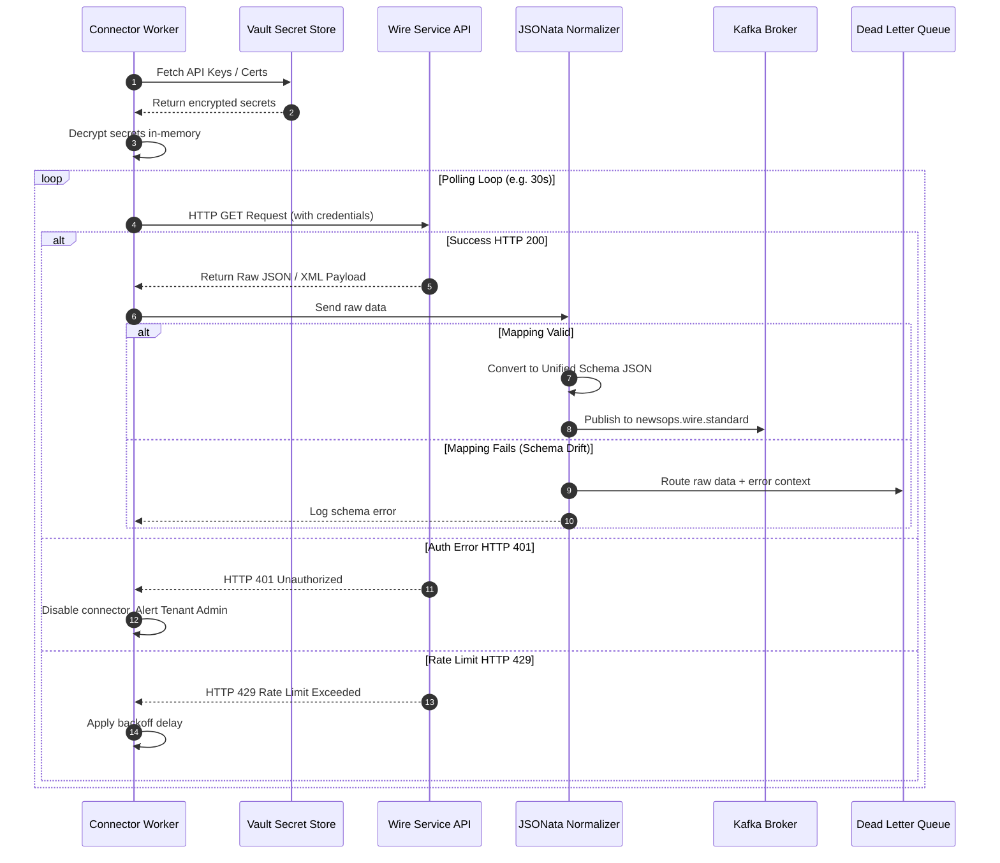

# API Connector Engine

## Purpose
The API Connector Engine is the enterprise integration service of NewsOps Cloud. It connects directly to premium wire services, including the Associated Press (AP WebFeeds / Media API), Reuters Connect API, and Bloomberg Professional Enterprise Feed. The engine handles authentication handshakes, processes streaming or polling API responses, normalizes disparate wire service data structures into a unified internal format, and forwards these cleaned articles to the publishing workflow.

## Executive Summary
Premium news outlets rely heavily on commercial wire services for global coverage. However, every wire service uses its own proprietary schemas (such as NewsML-G2, custom JSON, or XML feeds) and security architectures (OAuth2, HMAC signatures, client SSL certificates). The API Connector Engine provides a modular wrapper architecture. It retrieves API secrets from an encrypted HashiCorp Vault store, establishes secure connections, maps incoming fields to the unified NewsOps database structure, and handles stream errors or schema drift through a Kafka-based Dead Letter Queue (DLQ) pipeline.

```
+--------------------+
| Associated Press   | --( API Key )-----+
+--------------------+                   |
                                         v
+--------------------+           +---------------+          +--------------------+
| Reuters Connect    | --( OAuth2 )---> | API Connector | -------> | Unified Normalizer |
+--------------------+           |    Engine     |          +--------------------+
                                         +---------------+                    |
+--------------------+                   ^                                    v
| Bloomberg Enterprise| --( SSL Cert )----+                            +--------------------+
+--------------------+                                                 |    Kafka / DB      |
                                                                       +--------------------+
```

## Vision
To provide a plug-and-play integration framework that allows tenant organizations to activate enterprise wire services in under 5 minutes, delivering high-urgency global alerts to editorial teams with sub-second latency.

## Scope
- **Credential Lifecycle Manager**: Automates API keys, OAuth tokens, and client SSL certificate handshakes.
- **Wire Integration Adapters**: Custom client adapters designed for AP Media API, Reuters Connect, and Bloomberg Enterprise.
- **JSON / XML Normalizer**: Stream transformation pipeline utilizing declarative JSONata mapping definitions.
- **Urgency Router**: Immediate high-priority queue processing for flash and bulletin-level stories.
- **Dead Letter Queue (DLQ)**: Diagnostic framework for capturing and retrying failed or malformed payloads.

## Goals
- **Sub-Second Delivery**: Ingest, parse, and normalize high-priority breaking news within 500 milliseconds of receipt.
- **Zero-Trust Credential Storage**: Isolate all API secrets, client certificates, and authentication tokens per tenant within HSM-backed environments.
- **100% Schema Mapping**: Maintain complete mapping of wire metadata, including priority levels, category tags, locations, copyright details, and media assets.
- **Fault-Tolerant Pipelines**: Ensure that transient network failures or third-party downtime do not result in dropped articles by utilizing message brokers and retries.

## Functional Requirements
- **FR-4.1**: The system must securely authenticate against wire APIs using OAuth 2.0 Client Credentials, API keys, or mutual TLS (mTLS) with client certificates.
- **FR-4.2**: The system must support both pull-based polling (cron-scheduled HTTP requests) and push-based delivery (webhook endpoints and TCP stream listeners).
- **FR-4.3**: The system must extract wire priority levels (e.g. AP's "Flash", "Bulletin", "Urgent", "Regular") and map them to a standardized internal priority scale (1 to 4).
- **FR-4.4**: The system must parse and download associated media assets (images, infographics, videos) linked in the wire feed, uploading them to the tenant's media bucket.
- **FR-4.5**: The system must normalize XML (NewsML-G2) payloads and complex JSON structures into the unified NewsOps Cloud schema.
- **FR-4.6**: The system must route any payload that fails validation rules to a Dead Letter Queue (DLQ) for troubleshooting.

## Non-Functional Requirements
- **NFR-5.1 (Performance)**: The mapping and normalization of a wire article payload must take less than 200 milliseconds.
- **NFR-5.2 (Throughput)**: The engine must support a continuous processing capacity of 5,000 articles per minute during major news events.
- **NFR-5.3 (Security)**: All wire credentials must be encrypted using envelope encryption with AES-256-GCM. Decryption must occur only in memory on the worker node.
- **NFR-5.4 (High Availability)**: API Connector workers must run in an active-active clustered configuration, distributing stream parsing to avoid single points of failure.

## Business Rules
- **BR-6.1**: Wire credentials are owned by individual tenant organizations and must never be shared, pooled, or leaked across organizational boundaries.
- **BR-6.2**: Wires designated as "Flash" or "Bulletin" priority must bypass normal processing queues and be routed through a dedicated high-priority Kafka topic (`newsops.wire.flash`).
- **BR-6.3**: Ingested wire stories must retain their source copyright headers and license metadata throughout their lifecycle inside the CMS.
- **BR-6.4**: Connectors must enforce the wire service's rate limits (e.g., maximum of 10 requests per second for AP API) to avoid credential suspension.

## Actors
- **Content Operator**: Sets up, edits, and monitors wire configurations and mappings.
- **API Integration Daemon**: Background worker that polls API endpoints or listens for webhook triggers.
- **Vault Service**: Secure storage provider holding the API tokens and certificates.
- **Kafka Broker**: Distributes normalized items to the central storage and AI indexing systems.

## User Stories
- **US-7.1**: As a Content Operator, I want to upload a Bloomberg client SSL certificate and configure handshake endpoints, so that the connector initiates a secure connection.
- **US-7.2**: As an Editor, I want the system to extract AP's priority classification tags (Flash, Bulletin, Urgent) and map them to CMS urgency scores, so that breaking news pops up immediately on our editorial desk.
- **US-7.3**: As a DevOps Engineer, I want the normalization pipeline to route malformed API payloads to a DLQ, so that the parsing queue does not block when the wire provider introduces unannounced format modifications.

## Acceptance Criteria
- **AC-8.1**: The connector must automatically refresh OAuth access tokens at least 5 minutes before their expiration time.
- **AC-8.2**: The parser must successfully extract NewsML-G2 formatted XML data and output standard JSON keys without losing embedded structures (e.g., author metadata).
- **AC-8.3**: If the wire connection drops, the system must trigger backoff retries starting at 5 seconds, doubling the duration up to 10 minutes, and alert the operations channel after 5 failed attempts.
- **AC-8.4**: Any normalized article written to the database must contain the `license_attributes` field detailing source terms (e.g. "Do Not Redistribute").

## Workflows
1. **Connection Initialization**:
   - The API Connector Engine worker starts up and queries the database for active wire configurations.
   - For each active connector, the worker requests credentials from Vault.
   - The worker establishes the connection:
     - For AP: Sets up poll headers with API keys.
     - For Reuters: Executes OAuth2 token exchange and schedules token refresh.
     - For Bloomberg: Establishes mutual TLS socket using the client certificate.
2. **Data Ingestion Stream**:
   - The worker listens on the webhook endpoint (push) or schedules periodic GET requests (pull).
   - A raw payload is received.
   - The worker validates the source signature or certificate to guarantee origin authenticity.
3. **Data Normalization Pipeline**:
   - The raw JSON or XML is fed into the Normalizer.
   - The engine selects the template mapper matching the provider (e.g., `reuters-connect-v1.jsonata`).
   - Standard fields (Headline, Byline, Body, Location, Images, Urgency, Licensing) are mapped.
   - Images and multimedia attachment URLs are sent to the Media Ingestion Queue.
4. **Routing and Queueing**:
   - The system validates the final normalized JSON against the unified schema.
   - If validation passes:
     - If priority is "Flash", the item is sent to the `newsops.wire.flash` Kafka topic.
     - Otherwise, the item is sent to the `newsops.wire.standard` Kafka topic.
   - If validation fails, the raw payload and error context are sent to the `newsops.wire.dlq` topic.

## API Design

### 1. Register a Wire API Connector
- **Endpoint**: `POST /api/v1/connectors`
- **Request Payload**:
```json
{
  "provider": "reuters_connect",
  "name": "Reuters Global News Stream",
  "syncMode": "poll",
  "pollingIntervalSeconds": 30,
  "vaultSecretPath": "secret/data/tenants/org_123/reuters",
  "mappingRules": {
    "headline": "headline",
    "byline": "authors[0].name",
    "content": "body_html",
    "priority": "urgency_rating",
    "license": "usage_terms"
  }
}
```
- **Response Payload (201 Created)**:
```json
{
  "connectorId": "conn_api_88b9c8d7",
  "provider": "reuters_connect",
  "status": "connected",
  "lastSyncedAt": null,
  "createdAt": "2026-06-27T17:20:00Z"
}
```

### 2. Configure Webhook Target for Push Wire Feeds
- **Endpoint**: `POST /api/v1/connectors/conn_api_88b9c8d7/webhooks`
- **Request Payload**:
```json
{
  "secretToken": "wh_sec_99112233445566",
  "allowedIps": ["203.0.113.0/24", "198.51.100.12"]
}
```
- **Response Payload (200 OK)**:
```json
{
  "webhookUrl": "https://ingest.newsops.com/v1/webhooks/wire/conn_api_88b9c8d7",
  "status": "configured"
}
```

### 3. Retrieve Connector Health and Sync Status
- **Endpoint**: `GET /api/v1/connectors/conn_api_88b9c8d7/status`
- **Response Payload (200 OK)**:
```json
{
  "connectorId": "conn_api_88b9c8d7",
  "status": "active",
  "lastSyncAt": "2026-06-27T17:22:15Z",
  "uptimePercentage": 99.98,
  "apiRateLimit": {
    "limit": 1000,
    "remaining": 982,
    "resetAt": "2026-06-27T17:30:00Z"
  },
  "metrics": {
    "totalIngested": 14205,
    "totalErrors": 2,
    "dlqCount": 1
  }
}
```

## Database Design

### Table: `wire_connectors`
Stores configurations for active wire service connectors.
- `id` (UUID, Primary Key)
- `tenant_id` (UUID, Foreign Key, Indexed)
- `provider` (VARCHAR(50) NOT NULL) -- 'ap', 'reuters', 'bloomberg'
- `name` (VARCHAR(255) NOT NULL)
- `sync_mode` (VARCHAR(20) NOT NULL) -- 'poll', 'push'
- `polling_interval_seconds` (INTEGER DEFAULT 60)
- `vault_secret_path` (VARCHAR(512) NOT NULL) -- Path to Vault secret
- `mapping_rules` (JSONB NOT NULL) -- JSONata template or field mappings
- `status` (VARCHAR(50) DEFAULT 'disconnected') -- 'connected', 'degraded', 'error'
- `last_sync_at` (TIMESTAMP WITH TIME ZONE NULL)
- `created_at` (TIMESTAMP WITH TIME ZONE DEFAULT NOW())

### Table: `wire_logs`
Detailed execution logs for individual wire API calls and processing jobs.
- `id` (UUID, Primary Key)
- `connector_id` (UUID, Foreign Key referencing `wire_connectors.id` ON DELETE CASCADE, Indexed)
- `event_type` (VARCHAR(50) NOT NULL) -- 'fetch', 'parse', 'auth', 'dlq'
- `status` (VARCHAR(50) NOT NULL) -- 'success', 'failure'
- `payload_size_bytes` (INTEGER NULL)
- `execution_time_ms` (INTEGER NOT NULL)
- `error_details` (JSONB NULL) -- Stack traces or API error structures
- `created_at` (TIMESTAMP WITH TIME ZONE DEFAULT NOW())

Indexes:
- `idx_wire_logs_created`: Index on `(created_at DESC)` for logs roll-off.

## UI Design
The UI provides an administration screen titled **Wire Integrations Console**:
- **Connector Connection Wizard**: A step-by-step form where users choose a provider, configure endpoints, select authentication credentials, and input the Vault key locations.
- **Active Mappers Panel**: Allows selecting custom XML/JSON mappings, including raw preview boxes displaying parsed variables side-by-side with original structures.
- **Payload Pipeline Monitor**: A real-time console showing throughput rates, API connection statuses, network timing latency, and a table showing items routed to the DLQ.

## Permissions
- `connectors:read` - View list of integrations and status logs.
- `connectors:write` - Create, edit, or delete wire integrations.
- `connectors:credentials:write` - Update API keys, upload certificates, or set Vault configuration values.

## Security
- **OAuth Authentication Security**: Tokens are obtained inside container runtimes and never written to disk or logs.
- **mTLS with Client Certificates**: Bloomberg client certificates are stored in HashiCorp Vault. The container accesses them via an in-memory temp file (`/dev/shm`) that is automatically destroyed upon worker shutdown.
- **IP Access Control Lists (ACLs)**: Webhook endpoints enforce strict source IP validation using CIDR ranges provided by AP/Reuters.
- **XML Safe Parsing**: Disable DTD processing on all parser engines.

## Performance
- **Asynchronous Parsing**: Node.js workers process payload transformations using streaming JSON parsers (e.g. `oboe` or `JSONStream`) to minimize RAM impact during large payloads.
- **High-Priority Channel**: Skip primary database serialization buffers for breaking alerts. Flash items are written to a low-latency cache before slow background databases process archiving workflows.
- **Target Latency**: Ingest to normalized Kafka publication in < 200ms.

## Monitoring
Prometheus metrics:
- `newsops_wire_api_requests_total{provider="ap|reuters|bloomberg", status="200|401|429|500"}`
- `newsops_wire_api_duration_seconds{provider="ap|reuters|bloomberg"}`
- `newsops_wire_normalization_errors_total{provider="ap|reuters|bloomberg"}`
- `newsops_wire_dlq_count_total`

Alerts:
- **WireAuthFailure**: Fires if `rate(newsops_wire_api_requests_total{status="401"}[5m]) > 0` (alerting credentials problems).
- **WireRateLimitHit**: Fires if `rate(newsops_wire_api_requests_total{status="429"}[5m]) > 0`.
- **WireDLQSpike**: Critical alert if `newsops_wire_dlq_count_total > 10` within a 10-minute window.

## Logging
Structured JSON logging:
```json
{
  "timestamp": "2026-06-27T17:21:44.891Z",
  "level": "ERROR",
  "service": "api-connector",
  "connector_id": "conn_api_88b9c8d7",
  "message": "Schema validation failed for Reuters payload. Routing to DLQ.",
  "context": {
    "validation_error": "Required field 'headline' was missing or null",
    "raw_payload_snippet": "{\"id\":\"reuters:news:123\",\"content_body\":\"...\"}",
    "dlq_message_id": "dlq_msg_reuters_9988"
  }
}
```

## Error Handling
- `WIRE_AUTH_FAILED` (HTTP 401): The provider credentials are invalid or expired. Disable the sync scheduler and alert the tenant administrator.
- `WIRE_RATE_LIMIT` (HTTP 429): Upstream rate limiting activated. Pause calls for 5 minutes or respect `Retry-After` header.
- `WIRE_SCHEMA_DRIFT` (HTTP 422): Upstream structure changes cause mapper output validation to fail. Route the item to the DLQ and send a warning to the operations alert channel.

## Edge Cases
- **Schema Drift**: When a wire provider changes their XML/JSON output layout unannounced. The engine catches parser failures, routes payloads to the DLQ, and allows operators to update rules and re-process items directly from the UI.
- **Connection Reset during Media Downloads**: The connector retries large image downloads using HTTP Range requests if interrupted.
- **Duplicate Regional Deliveries**: The same story distributed by both regional and national wires. The LSH duplicate engine resolves these duplicates down-stream; the API connector simply ingests all unique items.

## Future Improvements
- **Autonomous Mapping Generation**: Implement AI parsers that analyze new wire endpoints and automatically suggest mapping rules.
- **Direct Video Streams Ingest**: Integrate real-time RTMP/SRT streaming endpoints for automated video wire ingestion.

## Mermaid Diagrams


## References
- [News Intelligence System Overview](./index.md)
- [RSS Monitoring Engine](./rss_monitoring_engine.md)
- [Web Crawler Engine](./web_crawler_engine.md)
- [Database Schema Design Standards](../03-database/schema_design_standards.md)
