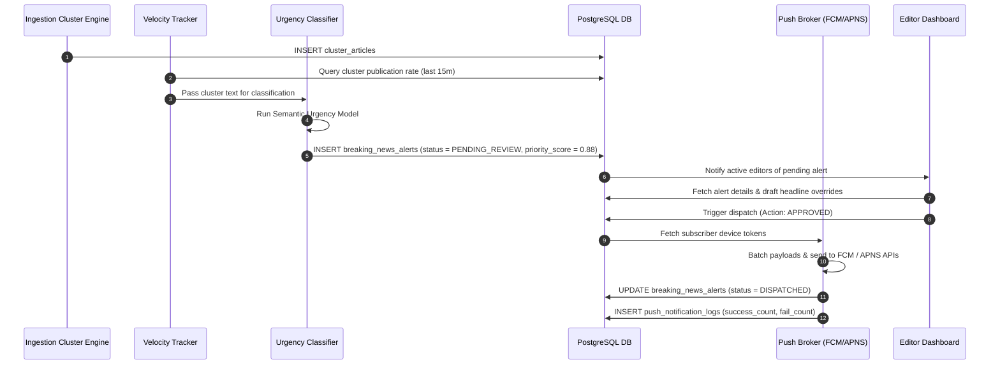
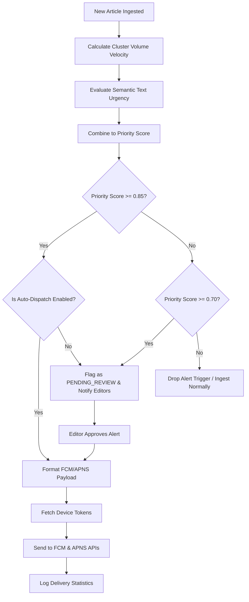

# Breaking News Prioritization and Push Alerts

## Purpose
The purpose of the Breaking News Prioritization and Push Alerts system is to detect, evaluate, and dispatch urgent news events. By combining automated classification models with velocity tracking metrics across ingestion sources, the system ranks the urgency of incoming events, determines push notification suitability, routes alerts to mobile notifications services, and enables editors to override priority states or force-publish breaking updates.

## Executive Summary
When critical news breaks, minutes matter. The Breaking News Prioritizer tracks incoming articles to detect spikes in reporting frequency and automatically evaluates their semantic urgency (e.g., natural disasters, major policy changes, market crashes). The system scores the priority of each incident, matches it against target audience interest tags, and determines whether to automatically push alerts to reader applications, send them to editors for review, or discard the alert trigger. It provides complete integration pipelines for FCM (Firebase Cloud Messaging) and APNS (Apple Push Notification Service), along with UI controls for editorial manual overrides.

## Vision
Our vision is to build an intelligent, high-velocity distribution channel that delivers critical, factually validated updates to audiences within seconds of an event occurring. By combining structural ML models with human editorial sign-off, NewsOps Cloud will achieve a fast delivery cycle that avoids alert fatigue by sending push notifications only for truly high-impact, verified breaking stories.

## Scope
This document covers:
- Urgent news semantic classification models and importance indexing.
- Ingestion velocity and publication density tracking metrics.
- Push notification threshold rules and delivery queues.
- API endpoints for dispatching alerts and executing editor overrides.
- Database designs for alert states, delivery tracking, and channel configurations.
- Prometheus metrics, performance metrics, and edge cases.

It does not cover end-user push notification permissions or client-side SDK rendering architectures.

## Goals
- Classify and score the urgency of incoming articles within 100ms.
- Trigger breaking news notifications to FCM/APNS under 2 seconds from editor approval.
- Limit notification delivery latency to less than 3 seconds for 1 million concurrent endpoints.
- Maintain a zero-false-positive rate for auto-dispatched push alerts.

## Functional Requirements
- **Semantic Urgency Classification**: The system must run incoming text through an ML classifier to compute an Urgency Score (0.00 to 1.00) based on categories (e.g., disaster, geopolitics, finance, sports).
- **Topic Velocity Tracker**: The system must calculate the ingestion velocity of matching articles in a cluster (e.g., number of articles published in the last 15 minutes).
- **Priority Scoring**: The engine must combine urgency and velocity scores into a single Priority Score (0.00 to 1.00).
- **Notification Triage Rules**: The system must direct alerts according to priority:
  - *Priority >= 0.85 (High)*: Auto-dispatch alerts (if enabled) or send immediate push review notifications to editor devices.
  - *0.70 <= Priority < 0.85 (Medium)*: Place in the editorial breaking queue for human review.
  - *Priority < 0.70 (Low)*: Catalog in the intelligence feed without triggering notification actions.
- **Editor Overrides**: Editors must be able to select any ingested raw feed item, escalate its priority to "Breaking", edit the alert message, and dispatch it to FCM/APNS.
- **Delivery Logging**: The system must record recipient counts, delivery success, and failure rates per dispatch action.

## Non-Functional Requirements
- **High Ingestion Support**: The velocity check worker must handle database clustering telemetry without locking the main news tables.
- **Highly Concurrent Dispatch**: The push dispatch queue must scale to support 10,000 push requests per second.
- **Fail-safe Retries**: Implement exponential backoff for FCM/APNS connection failures up to 3 retry attempts.

## Business Rules
1. A push alert must map to a specific `raw_feed_items` or a unified `clusters` record.
2. Direct-to-consumer auto-dispatched alerts are restricted to organizations that have explicitly activated the auto-dispatch toggle in their configurations.
3. Every alert dispatch record must store the ID of the validating editor or the code signature of the auto-dispatch agent.
4. A cooldown period of 15 minutes is enforced per target segment to prevent alert fatigue.

## Actors
- **Classifier Engine**: Service that evaluates content text and determines semantic urgency.
- **Velocity Tracker**: Background worker that monitors publication spikes in active clusters.
- **Editorial Editor**: Human who reviews, overrides, draft, or dispatches alerts.
- **Mobile Push Service Broker**: Outbound agent that formats and pushes payloads to FCM and APNS.

## User Stories
1. **As a Newsroom Editor**, I want the system to alert me on my desktop when a cluster's volume spikes by 200% in 10 minutes, so that I can immediately draft a breaking push notification.
2. **As an Editor-in-Chief**, I want to review the exact push message and modify the target user audience segment before hitting dispatch, so that our notification is accurate and highly relevant.
3. **As a Mobile Publisher**, I want to configure the system to auto-dispatch notifications for high-priority geopolitical announcements directly, minimizing time-to-market.

## Acceptance Criteria
1. The classification pipeline must score incoming clusters within 150ms of cluster assignment.
2. A manual priority override must change the article's system priority state instantly and log the editor's credentials.
3. The push dispatch broker must batch tokens in groups of 500 when sending to FCM to optimize HTTP connection overhead.
4. Latency between hitting "Dispatch" in the UI and the FCM server receiving the payload must be under 300ms.

## Workflows

### 1. Automated Detection and Priority Escalation
- **Cluster Update**: A new article is inserted, updating an existing topic cluster.
- **Velocity Threshold Check**: The velocity daemon counts articles in the cluster. If it sees >5 articles in 10 minutes, it flags high velocity.
- **Urgency Classification**: The text runs through the Urgency Classifier. It returns a score of 0.92 (e.g., natural disaster event).
- **Rule Verification**: The rules engine combines velocity and urgency, yielding a Priority Score of 0.90. It triggers a `PENDING_REVIEW` alert.
- **Notification**: The system dispatches a Slack/system alert to the editorial staff.

### 2. Editor Review & Dispatch Workflow
- **Review**: The Editor accesses the Breaking Alerts view and reviews the pending items.
- **Edit**: The Editor selects the alert, modifies the notification headline (e.g. from "Earthquake hits region" to "Breaking: 6.2 Magnitude Earthquake Strikes Tokyo Coast"), and targets the "All Users" segment.
- **Dispatch**: The Editor clicks "Send Alert".
- **Execution**: The system locks the alert record, reads the target user tokens from the database, pushes them to FCM/APNS via the Broker, and logs the dispatch success/failure ratio.



## API Design

### POST /api/v1/intelligence/breaking/alerts
Manually creates a new breaking news alert block from a raw feed item.
- **Request Headers**:
  - `Authorization: Bearer <JWT>`
  - `Content-Type: application/json`
- **Request Payload**:
  ```json
  {
    "rawFeedItemId": "itm_882910111",
    "alertTitle": "Breaking: major policy changes announced at G7 summit",
    "targetSegments": ["global-news", "politics"],
    "priorityOverride": 0.95
  }
  ```
- **Response Payload (201 Created)**:
  ```json
  {
    "alertId": "bna_772819201",
    "rawFeedItemId": "itm_882910111",
    "alertTitle": "Breaking: major policy changes announced at G7 summit",
    "priorityScore": 0.9500,
    "status": "DRAFT",
    "targetSegments": ["global-news", "politics"],
    "createdAt": "2026-06-27T22:45:00Z"
  }
  ```

### POST /api/v1/intelligence/breaking/alerts/{id}/dispatch
Approves and dispatches the alert immediately to downstream push notification gateways.
- **Request Headers**:
  - `Authorization: Bearer <JWT>`
  - `Content-Type: application/json`
- **Request Payload**:
  ```json
  {
    "overrideTitle": "BREAKING: G7 Summit Announces Global Climate Accord",
    "bypassCooldown": true
  }
  ```
- **Response Payload (200 OK)**:
  ```json
  {
    "alertId": "bna_772819201",
    "status": "DISPATCHED",
    "dispatchedAt": "2026-06-27T22:46:12Z",
    "recipientsEstimated": 125000,
    "dispatchTrackingId": "trk_992817203"
  }
  ```

### GET /api/v1/intelligence/breaking/alerts/{id}/delivery
Retrieves real-time telemetry on notification delivery and click-through rates.
- **Request Headers**:
  - `Authorization: Bearer <JWT>`
- **Response Payload (200 OK)**:
  ```json
  {
    "alertId": "bna_772819201",
    "trackingId": "trk_992817203",
    "status": "COMPLETED",
    "metrics": {
      "sentCount": 125000,
      "deliveredCount": 124850,
      "failedCount": 150,
      "clickThroughCount": 18450,
      "ctrPercent": 14.76,
      "averageLatencyMs": 182
    }
  }
  ```

## Database Design

### Prisma Schema
```prisma
datasource db {
  provider = "postgresql"
  url      = env("DATABASE_URL")
}

enum AlertStatus {
  DRAFT
  PENDING_REVIEW
  APPROVED
  REJECTED
  DISPATCHED
  FAILED
}

enum NotificationChannel {
  PUSH_MOBILE
  PUSH_WEB
  EMAIL
  SMS
  SLACK
}

model BreakingNewsAlert {
  id              String                @id @default(dbgenerated("concat('bna_', replace(gen_random_uuid()::text, '-', ''))")) @db.VarChar(50)
  clusterId       String?               @map("cluster_id") @db.VarChar(50)
  rawFeedItemId   String?               @map("raw_feed_item_id") @db.VarChar(50)
  urgencyScore    Decimal               @map("urgency_score") @db.Decimal(5, 4)
  velocityScore   Decimal               @map("velocity_score") @db.Decimal(5, 4)
  priorityScore   Decimal               @map("priority_score") @db.Decimal(5, 4)
  status          AlertStatus           @default(PENDING_REVIEW)
  alertTitle      String                @map("alert_title") @db.VarChar(255)
  targetSegments  Json                  @map("target_segments")
  editorUserId    String?               @map("editor_user_id") @db.VarChar(50)
  overrideReason  String?               @map("override_reason") @db.Text
  createdAt       DateTime              @default(now()) @map("created_at")
  updatedAt       DateTime              @updatedAt @map("updated_at")
  dispatchedAt    DateTime?             @map("dispatched_at")

  cluster         Cluster?              @relation(fields: [clusterId], references: [id], onDelete: Cascade)
  rawFeedItem     RawFeedItem?          @relation(fields: [rawFeedItemId], references: [id], onDelete: Cascade)
  logs            PushNotificationLog[]

  @@index([status])
  @@index([priorityScore])
  @@index([createdAt])
  @@map("breaking_news_alerts")
}

model PushNotificationLog {
  id              String              @id @default(dbgenerated("concat('pnl_', replace(gen_random_uuid()::text, '-', ''))")) @db.VarChar(50)
  alertId         String              @map("alert_id") @db.VarChar(50)
  channel         NotificationChannel
  sentCount       Int                 @map("sent_count")
  successCount    Int                 @map("success_count")
  failedCount     Int                 @map("failed_count")
  clickCount      Int                 @default(0) @map("click_count")
  latencyMs       Int                 @map("latency_ms")
  startedAt       DateTime            @default(now()) @map("started_at")
  finishedAt      DateTime?           @map("finished_at")

  alert           BreakingNewsAlert   @relation(fields: [alertId], references: [id], onDelete: Cascade)

  @@index([alertId])
  @@map("push_notification_logs")
}

// Reference existing tables from news_intelligence_schema
model RawFeedItem {
  id             String              @id @db.VarChar(50)
  alerts         BreakingNewsAlert[]
}

model Cluster {
  id             String              @id @db.VarChar(50)
  alerts         BreakingNewsAlert[]
}
```

### PostgreSQL DDL
```sql
CREATE TYPE alert_status AS ENUM ('DRAFT', 'PENDING_REVIEW', 'APPROVED', 'REJECTED', 'DISPATCHED', 'FAILED');
CREATE TYPE notification_channel AS ENUM ('PUSH_MOBILE', 'PUSH_WEB', 'EMAIL', 'SMS', 'SLACK');

-- Breaking News Alerts Configuration and Queue
CREATE TABLE breaking_news_alerts (
    id VARCHAR(50) PRIMARY KEY DEFAULT concat('bna_', replace(gen_random_uuid()::text, '-', '')),
    cluster_id VARCHAR(50) REFERENCES clusters(id) ON DELETE CASCADE,
    raw_feed_item_id VARCHAR(50) REFERENCES raw_feed_items(id) ON DELETE CASCADE,
    urgency_score DECIMAL(5,4) NOT NULL CHECK (urgency_score >= 0.0000 AND urgency_score <= 1.0000),
    velocity_score DECIMAL(5,4) NOT NULL CHECK (velocity_score >= 0.0000 AND velocity_score <= 1.0000),
    priority_score DECIMAL(5,4) NOT NULL CHECK (priority_score >= 0.0000 AND priority_score <= 1.0000),
    status alert_status NOT NULL DEFAULT 'PENDING_REVIEW',
    alert_title VARCHAR(255) NOT NULL,
    target_segments JSONB NOT NULL DEFAULT '[]'::jsonb,
    editor_user_id VARCHAR(50),
    override_reason TEXT,
    created_at TIMESTAMP WITH TIME ZONE NOT NULL DEFAULT NOW(),
    updated_at TIMESTAMP WITH TIME ZONE NOT NULL DEFAULT NOW(),
    dispatched_at TIMESTAMP WITH TIME ZONE
);

CREATE INDEX idx_breaking_status ON breaking_news_alerts(status);
CREATE INDEX idx_breaking_priority ON breaking_news_alerts(priority_score);
CREATE INDEX idx_breaking_created ON breaking_news_alerts(created_at);

-- Push Notification Logs for Audit and Performance Tracking
CREATE TABLE push_notification_logs (
    id VARCHAR(50) PRIMARY KEY DEFAULT concat('pnl_', replace(gen_random_uuid()::text, '-', '')),
    alert_id VARCHAR(50) NOT NULL REFERENCES breaking_news_alerts(id) ON DELETE CASCADE,
    channel notification_channel NOT NULL,
    sent_count INT NOT NULL DEFAULT 0,
    success_count INT NOT NULL DEFAULT 0,
    failed_count INT NOT NULL DEFAULT 0,
    click_count INT NOT NULL DEFAULT 0,
    latency_ms INT NOT NULL DEFAULT 0,
    started_at TIMESTAMP WITH TIME ZONE NOT NULL DEFAULT NOW(),
    finished_at TIMESTAMP WITH TIME ZONE
);

CREATE INDEX idx_push_logs_alert ON push_notification_logs(alert_id);
```

## UI Design
- **Breaking News Dashboard**: Displays cards for all pending breaking news items. Displays priority status using color badges (Red for High, Amber for Medium). Shows cluster graphs indicating recent publication velocity.
- **Notification Editor & Sender Modal**: Opens when clicked. Shows:
  - Source article description and velocity details.
  - Urgency and Velocity sliders displaying automated values (with options to override).
  - Target audience selection boxes (by tags, languages, countries).
  - Live character counts for the notification title.
  - Large red button marked "Send Alert to App Users" with a confirmation requirement.

## Permissions
- `intelligence:breaking:read` - Views breaking lists, rules, and push telemetry.
- `intelligence:breaking:write` - Drafts alerts, overrides priority scores, modifies target segments.
- `intelligence:breaking:dispatch` - Dispatches push alerts directly to production apps.

## Security
- **Double-Approval for Auto-Dispatch Override**: Requires a multi-factor confirmation challenge (PIN or Biometric) before an editor can trigger a global alert bypass to prevent accidental notification blasts.
- **Strict Rate Limiting**: Limit API endpoint `/dispatch` requests to 5 calls per minute per user to prevent duplicate pushes from overlapping.
- **JWT Key Authorization**: Only backend servers holding dedicated push signatures can authorize token generation actions on FCM/APNS.

## Performance
- **Low-Latency Dispatch**: Uses multi-threaded worker pools in Go/Rust to execute FCM batch calls.
- **Query Latency**: Ingest velocity checks completed in under 20ms using transactional indexes.
- **Target TPS**: Scaling targets set to support 50,000 pushes processed per minute.

## Monitoring
- `newsops_push_dispatched_alerts_total`: Counter tracking total breaking notification events sent.
- `newsops_push_delivery_failures_total`: Counter tracking network/validation push drops.
- `newsops_push_clickthrough_rate`: Gauge tracking interaction percentages.
- **Alert Trigger**: Trigger PagerDuty alarm if `newsops_push_delivery_failures_total` exceeds 5% of a total dispatch payload.

## Logging
- **Log Format**: JSON serialization.
- **Levels**: INFO for routine evaluations, WARN for manual priority adjustments, ERROR for delivery endpoint failures.
- **Log Context Example**:
  ```json
  {
    "timestamp": "2026-06-27T22:48:12.802Z",
    "level": "INFO",
    "context": "newsops-breaking-prioritizer",
    "alert_id": "bna_772819201",
    "priority_score": 0.95,
    "recipients": 125000,
    "message": "Breaking news alert dispatched successfully. FCM gateway responded in 182ms."
  }
  ```

## Error Handling
- `PUSH_GATEWAY_TIMEOUT`: Code 504. HTTP Status 504. "The push gateway FCM/APNS failed to respond within the allowed time limit."
- `RATE_LIMIT_COOLDOWN`: Code 429. HTTP Status 429. "A push notification has recently been sent to this audience segment. Cool-down active."
- `INVALID_PAYLOAD_SIZE`: Code 400. HTTP Status 400. "The alert notification character length exceeds the platform limit of 256 characters."

## Edge Cases
- **Simultaneous Breaking Events**: Two unrelated stories breaking concurrently. The coordinator queue queues notifications sequentially, spacing deliveries out by at least 180 seconds.
- **Network Failures during FCM Ingestion**: If FCM experiences outages, the system redirects alerts through secondary pathways (e.g., in-app socket connections, WebPush, and SMS for critical tiers).

## Future Improvements
- **Personalized Urgency Scoring**: Running client-side algorithms that adjust priority triggers based on local user read histories.
- **Geofenced Push Dispatch**: Automatically focusing breaking alerts to users within a specific geographic radius of an event.

## Mermaid Diagrams

### Breaking Alert Decision Path


## References
- [News Intelligence Schema](../03-database/news_intelligence_schema.md)
- [Fact Consistency and Verification](./fact_consistency.md)
- [System Architecture](../02-architecture/system_architecture.md)
- [Event Driven Design](../02-architecture/event_driven_design.md)
