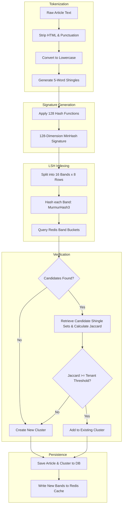

# Duplicate Detection Engine

## Purpose
The Duplicate Detection Engine is the real-time content clustering and deduplication service of NewsOps Cloud. Its primary purpose is to identify, group, and filter near-duplicate articles arriving from various ingestion streams (RSS feeds, web crawlers, and wire APIs). The engine ensures that editorial teams and automated publishing feeds are not overwhelmed by redundant content, while maintaining high performance and customizable similarity thresholds.

## Executive Summary
Ingesting high-volume external news feeds creates massive data redundancy. The Duplicate Detection Engine uses a two-stage filtering pipeline to solve this. First, a lexical signature stage uses Locality-Sensitive Hashing (LSH) and MinHash algorithms to instantly identify potential near-duplicate candidates in $O(1)$ time. Second, a verification stage computes the exact Cosine or Jaccard similarity between the new article and the candidate group. If the similarity exceeds the tenant-configured threshold (typically 85%), the new article is clustered under the existing parent story; otherwise, it forms the basis of a new story cluster.

```
                  +--------------------------------+
                  |    Incoming Raw Article        |
                  +--------------------------------+
                                  |
                                  v
                  +--------------------------------+
                  |  Tokenization & K-Shingling    |
                  +--------------------------------+
                                  |
                                  v
                  +--------------------------------+
                  |   128 MinHash Signature Gen    |
                  +--------------------------------+
                                  |
                                  v
                  +--------------------------------+
                  |      LSH Banding Lookup        |
                  +--------------------------------+
                                  |
                        [ Candidate Found? ]
                       /                  \
                     Yes                   No
                     /                      \
                    v                        v
         +--------------------+     +-------------------+
         | Calculate Jaccard  |     | Create New        |
         |  / Cosine Metric   |     | Article Cluster   |
         +--------------------+     +-------------------+
            /              \                  |
       [ > Threshold? ]  [ No ]               |
         /            \      \                |
       Yes             \      ----------------|--> [ Write to DB ]
       /                v                     |
      v            +--------------------+     |
+------------+     | Create New Cluster | ----+
| Add to     |     +--------------------+
| Existing   |
| Cluster    |
+------------+
```

## Vision
To establish an instantaneous, sub-100ms lexical and semantic comparison layer capable of filtering millions of incoming publications, ensuring that NewsOps Cloud CMS operators can navigate deduplicated story streams with zero latency.

## Scope
- **Tokenization Engine**: Strips HTML tags, tokenizes text, and generates overlapping character or word-level k-shingles.
- **MinHash Generator**: Applies a vector of 128 independent hash functions to represent document shingle sets.
- **LSH Indexer**: Segregates MinHash signatures into bands and rows, inserting them into Redis-backed hash buckets.
- **Similarity Calculator**: Performs Jaccard coefficient and Cosine vector similarity calculations on candidate records.
- **Cluster Repository**: Manages clusters, designating primary documents and linking duplicate variants.

## Goals
- **High Throughput**: Process and index incoming articles in less than 80 milliseconds.
- **High Recall**: Maintain near-duplicate detection recall above 95% on lexical modifications.
- **Low Memory Overhead**: Keep LSH band indexes cached in Redis with a 72-hour sliding expiration window to control cloud storage footprints.
- **Precise Controls**: Expose tenant-specific configuration sliders to adjust matching sensitivity.

## Functional Requirements
- **FR-5.1**: The system must tokenize article body text, converting characters to lowercase, stripping punctuation/symbols, and removing common stop words.
- **FR-5.2**: The system must generate word-based k-shingles (where $k$ is configurable, defaulting to $k=5$ words).
- **FR-5.3**: The system must generate a 128-dimension MinHash signature vector for each shingled document.
- **FR-5.4**: The system must index MinHash signatures using LSH banding (defaulting to $b=16$ bands and $r=8$ rows per band) to find candidate articles.
- **FR-5.5**: The system must verify candidate matches by calculating Jaccard similarity. If Jaccard similarity is above the configured threshold, the articles are marked as duplicates.
- **FR-5.6**: The system must allow users to choose the duplicate action: **Group** (nested in UI), **Hide** (flagged as inactive), or **Alert** (manually approve merging).

## Non-Functional Requirements
- **NFR-6.1 (Latency)**: MinHash signature generation and LSH lookup must complete in under 50ms per article.
- **NFR-6.2 (Scalability)**: The deduplication workers must run as stateless services, scaling horizontally using Kafka queue lag metrics.
- **NFR-6.3 (Memory)**: Redis cluster instances must utilize Least-Recently-Used (LRU) cache eviction policies on the LSH bucket tables.
- **NFR-6.4 (Data Isolation)**: Ingestion hashes and LSH bucket lists must be isolated per tenant organization to prevent document leaking.

## Business Rules
- **BR-7.1**: The similarity threshold default is set to 85% (0.85 Jaccard index). Tenants can override this value within a range of 0.60 to 0.98.
- **BR-7.2**: Articles with a similarity rating of 1.0 (exact duplicates) must be automatically marked as `Hidden` in the ingest queue, except if their source URLs differ and require distinct licensing tags.
- **BR-7.3**: LSH signatures and Redis hash bands are purged from the cache 72 hours after ingestion. Historical duplicates beyond 72 hours are verified using database indexing.
- **BR-7.4**: Deduplication is scoped strictly to the tenant organization; articles from different tenants must never be grouped under the same cluster.

## Actors
- **Ingestion Pipeline**: Automated system dispatcher sending normalized articles to the duplicate engine.
- **Deduplication Worker**: Microservice executing tokenization, hashing, and similarity comparison logic.
- **Editorial Editor**: Inspects clusters, changes primary articles, and overrides auto-groupings.
- **System Administrator**: Adjusts shingle sizes ($k$), band ratios, and memory expiration settings.

## User Stories
- **US-8.1**: As an Editor, I want the system to automatically group articles that share 85% of their content, so that my feed displays a single master story with sub-links.
- **US-8.2**: As an Admin, I want to set a custom shingle size ($k=9$) and threshold (0.90) for our premium finance feed, to distinguish subtle shifts in market reports.
- **US-8.3**: As a DevOps Engineer, I want the signature cache to expire after 72 hours, to prevent our Redis memory usage from growing infinitely.

## Acceptance Criteria
- **AC-9.1**: The tokenization stage must clean HTML entities (e.g. converting `&amp;` to `&`, removing `<script>` elements) before generating shingles.
- **AC-9.2**: The MinHash engine must produce identical signature arrays for two articles containing the same text regardless of ingestion order.
- **AC-9.3**: The verification service must correctly calculate Jaccard Similarity as:
  $$J(A, B) = \frac{|A \cap B|}{|A \cup B|}$$
- **AC-9.4**: The system must raise a processing error if the input body text is less than 50 characters (e.g., flash alerts), routing it to the manual verification queue instead of applying LSH.

## Workflows
1. **Article Normalization Ingestion**:
   - The ingestion pipeline publishes a normalized article message to the Kafka `newsops.intelligence.ingested` topic.
   - The Deduplication Worker consumes the message.
2. **Text Preprocessing & Shingling**:
   - The worker cleans the article body text, converting to lowercase and stripping punctuation.
   - It divides the cleaned text into a set of 5-word shingles.
     - *Example*: "the quick brown fox jumps" -> `{"the_quick_brown_fox_jumps"}`.
3. **MinHash Generation**:
   - The worker generates 128 MinHash values by applying 128 hash functions to the shingle sets.
   - It saves the resulting 128-integer array as the article's MinHash Signature.
4. **LSH Banding & Candidate Search**:
   - The 128-dimension signature is split into 16 bands of 8 integers each.
   - Each band is serialized and hashed using a fast hash function (like MurmurHash3).
   - The worker queries Redis for each of the 16 band hash values.
   - Redis returns matching article IDs that share at least one band hash bucket (the candidate set).
5. **Exact Similarity Calculation**:
   - If no candidates are found, a new cluster is created.
   - For each candidate found:
     - The worker retrieves the candidate's full shingle set or MinHash signature from the Redis cache.
     - It calculates the Jaccard similarity coefficient.
     - If Jaccard similarity exceeds the tenant threshold (e.g., 0.85), the candidate is classified as a duplicate.
6. **Database Persistence & Routing**:
   - The worker updates the Postgres `intelligence_articles` table, setting the `cluster_id` to match the detected parent cluster.
   - If no duplicate exists, it creates a new record in the `intelligence_clusters` table and assigns the new `cluster_id`.
   - The processed event is forwarded to the editorial queue.

## API Design

### 1. Dry-Run Analyze Content for Duplicates
- **Endpoint**: `POST /api/v1/deduplication/analyze`
- **Request Payload**:
```json
{
  "tenantId": "org_77e9b8c0",
  "title": "Stock Market Trends Rise",
  "body": "Global markets registered significant gains today as equities continued to mount following optimistic rate revisions...",
  "threshold": 0.85
}
```
- **Response Payload (200 OK - Duplicate Found)**:
```json
{
  "isDuplicate": true,
  "confidenceScore": 0.92,
  "matchedClusterId": "cluster_abc998811",
  "matchedArticleId": "art_88f7e6d5",
  "candidatesEvaluatedCount": 4,
  "executionTimeMs": 34
}
```

### 2. Retrieve Cluster Details and Members
- **Endpoint**: `GET /api/v1/deduplication/clusters/cluster_abc998811`
- **Response Payload (200 OK)**:
```json
{
  "clusterId": "cluster_abc998811",
  "primaryArticleId": "art_88f7e6d5",
  "createdAt": "2026-06-27T17:00:00Z",
  "members": [
    {
      "articleId": "art_88f7e6d5",
      "title": "Stock Market Trends Rise",
      "source": "Reuters",
      "publishedAt": "2026-06-27T17:00:00Z",
      "similarity": 1.0
    },
    {
      "articleId": "art_99a8b7c6",
      "title": "Markets Experience Growth Following Revisions",
      "source": "AP News",
      "publishedAt": "2026-06-27T17:04:12Z",
      "similarity": 0.89
    }
  ]
}
```

### 3. Manually Merge or Unmerge Clusters
- **Endpoint**: `POST /api/v1/deduplication/clusters/merge`
- **Request Payload**:
```json
{
  "action": "merge",
  "sourceClusterId": "cluster_11112222",
  "targetClusterId": "cluster_abc998811"
}
```
- **Response Payload (200 OK)**:
```json
{
  "status": "success",
  "clusterId": "cluster_abc998811",
  "mergedMembersCount": 3
}
```

## Database Design

### Table: `lsh_signatures`
Stores precomputed MinHash signature vectors for historical queries.
- `article_id` (UUID, Primary Key referencing `intelligence_articles.id` ON DELETE CASCADE)
- `signature` (INTEGER[] NOT NULL) -- 128-integer array
- `created_at` (TIMESTAMP WITH TIME ZONE DEFAULT NOW())

### Table: `lsh_bands`
Database fallback index for matching bands (primary lookup resides in Redis).
- `id` (BIGSERIAL, Primary Key)
- `tenant_id` (UUID, Foreign Key, Indexed)
- `band_index` (SMALLINT NOT NULL) -- 0 to 15
- `hash_value` (VARCHAR(64) NOT NULL) -- MurmurHash3 representation
- `article_id` (UUID, Foreign Key referencing `intelligence_articles.id` ON DELETE CASCADE)

Indexes:
- `idx_lsh_bands_search`: Composite index on `(tenant_id, band_index, hash_value)`.
- `idx_lsh_bands_created`: Index on `(article_id, band_index)`.

## UI Design
The system includes a dashboard view titled **Duplicate Explorer Workspace**:
- **Cluster Hierarchy View**: A dynamic tree structure grouping duplicate wire stories under the main headline, showing source name tags, ingest timing offsets, and similarity ratings.
- **Diff Viewer**: Displays a side-by-side text comparison panel between selected articles, highlighting additions in green, deletions in red, and unchanged text in grey.
- **Cluster Override Console**: Tools allowing editors to select an article, split it from the cluster, assign it as the primary parent article, or drag it to a different cluster manually.

## Permissions
- `deduplication:clusters:read` - Allows viewing clustered stories and member lists.
- `deduplication:clusters:write` - Enables manual merge, split, or parent overrides.
- `deduplication:config:write` - Allows updating similarity parameters (thresholds, shingle configuration, band setups).

## Security
- **Denial of Service Prevention**: Limit input processing to a maximum of 100,000 characters per article. Articles exceeding this limit are truncated before tokenization to prevent CPU starvation.
- **Tenant Scope Enforcement**: The query key pattern in Redis includes the tenant ID to prevent cross-tenant lookup:
  - Format: `lsh:tenant_{tenant_id}:band_{band_index}:bucket_{hash}`.

## Performance
- **In-Memory Band Indexing**: Band lookups execute against a Redis Cluster using pipeline commands:
```redis
// Node.js implementation example
const pipeline = redis.pipeline();
for (let i = 0; i < 16; i++) {
  pipeline.smembers(`lsh:tenant_${tenantId}:band_${i}:${bandHashes[i]}`);
}
const candidateSetGroup = await pipeline.exec();
```
- **Math Optimization**: Cosine similarity calculations use optimized native libraries (e.g. Go-based SIMD vector libraries) to achieve sub-millisecond execution.
- **Target Throughput**: 1,200 matches/sec per node container.

## Monitoring
Prometheus metrics:
- `newsops_dedup_processing_time_seconds` - Histograms tracking parser, MinHash, LSH, and Verification time blocks.
- `newsops_dedup_clusters_created_total`
- `newsops_dedup_duplicates_found_total{tenant_id="X"}`
- `newsops_dedup_cache_size` - Gauge tracking active keys in Redis.

Alerts:
- **DeduplicationLatencySpike**: Triggered if the 95th percentile execution latency exceeds 150ms over 5 minutes.
- **RedisMemoryLimitDanger**: Warning alert if Redis memory footprint exceeds 85% capacity.

## Logging
Structured JSON logging:
```json
{
  "timestamp": "2026-06-27T17:25:12.332Z",
  "level": "INFO",
  "service": "dedup-engine",
  "tenant_id": "org_77e9b8c0",
  "article_id": "art_99a8b7c6",
  "message": "Duplicate match resolved.",
  "context": {
    "primary_article_id": "art_88f7e6d5",
    "cluster_id": "cluster_abc998811",
    "jaccard_similarity": 0.89,
    "matching_bands_count": 3
  }
}
```

## Error Handling
- `DEDUP_PROCESSING_ERROR` (HTTP 500): Parser crash during vector calculation. Log trace and assign the article to a manual verification queue.
- `CLUSTER_NOT_FOUND` (HTTP 404): Merge requested on an invalid cluster ID.
- `INVALID_SIGNATURE` (HTTP 400): Signature size does not match the required 128 dimensions.

## Edge Cases
- **Boilerplate Matching**: Unrelated stories with identical footer licensing text (e.g. "Associated Press. All rights reserved. This material may not be published...") triggering matches. Mitigation: Remove trailing footer blocks and boilerplate metadata templates prior to shingle generation.
- **Extremely Short Articles**: Short alerts containing only a title and a single sentence. Standard LSH can miss these due to high shingle sparsity. Mitigation: If content contains fewer than 20 words, skip LSH and match based on title Levenshtein distance.
- **Story Updates**: Incremental wire updates where a paragraph is added every 15 minutes. The Jaccard score might fall below 85%. Mitigation: Compare the new update to the most recent member of the cluster rather than only the primary article.

## Future Improvements
- **Semantic Vector Embeddings**: Transition to dense vector representations (e.g., using MiniLM or BERT model embeddings) loaded into a Vector Database (like Qdrant or pgvector) to detect paraphrased content alongside lexical matches.
- **Graph-based Cluster Visualizations**: Implement interactive graph visualization of clusters in the UI, showing story propagation and citation flows.

## Mermaid Diagrams


## References
- [News Intelligence System Overview](./index.md)
- [RSS Monitoring Engine](./rss_monitoring_engine.md)
- [Web Crawler Engine](./web_crawler_engine.md)
- [API Connector Engine](./api_connector_engine.md)
- [Database Schema Design Standards](../03-database/schema_design_standards.md)
- [News Intelligence Schema Tables](../03-database/news_intelligence_schema.md)
