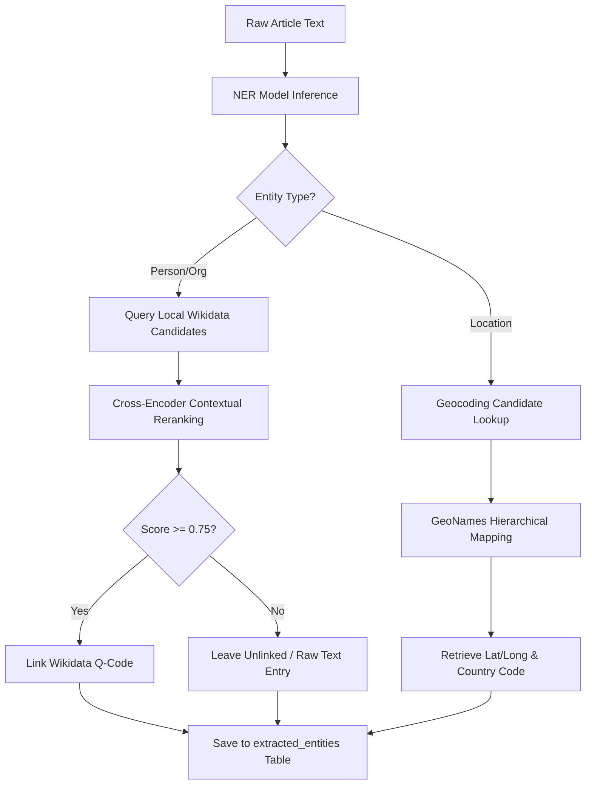
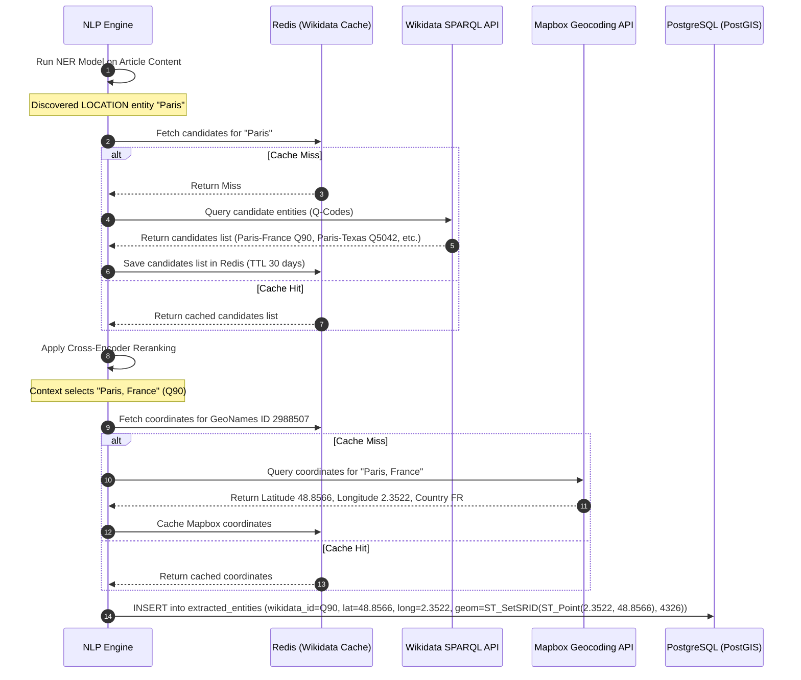

# Entity Extraction

## Purpose
The purpose of the Entity Extraction design document is to define the technical implementation details for Named Entity Recognition (NER), entity disambiguation (Wikidata / Wikipedia linkage), and geographic coordinate mapping (geo-resolution) within the NewsOps Cloud digital publishing platform. This engine converts unstructured news text into structured, semantic metadata nodes.

## Executive Summary
Unstructured news items from global feeds lack relational structure, making it difficult to search, categorize, and build a cohesive knowledge graph. The Entity Extraction engine resolves this by running incoming articles through a multi-stage NLP pipeline. First, a transformer-based NER model identifies mentions of People, Organizations, Locations, and Products. Second, a candidate-retrieval and entity-linking model resolves name ambiguities by linking entities to distinct Wikidata (Q-codes) or Wikipedia IDs. Third, locations are resolved via a geocoder to exact coordinates (GeoNames / Mapbox).

## Vision
To develop a zero-latency, high-accuracy entity extraction and linking pipeline that acts as the semantic backbone of the platform, enabling cross-referencing of news events, automated tagging, and mapping of news stories globally.

## Scope
This design document covers:
- Named Entity Recognition (NER) pipeline (SpaCy Transformer / fine-tuned RoBERTa models).
- Entity Linking (EL) architectures using bi-encoder and cross-encoder candidate retrieval against a local Wikidata snapshot cache.
- Geo-entity resolution (Geocoding places, resolving hierarchy to city/state/country, and mapping coordinates via GeoNames and Mapbox).
- API definitions for parsing and managing entities.
- Database schema layouts for storing entities and geographical geometries.

## Goals
- Achieve an F1-score of $\ge 90\%$ for Named Entity Recognition across Person, Organization, and Location types.
- Disambiguate and link entities to Wikidata with $\ge 85\%$ accuracy on ambiguous terms.
- Geocode location entities to precise latitude and longitude within a target SLA of 100ms.
- Ensure API queries for entity lookup and cross-referencing resolve in under 30ms.

## Functional Requirements
- **Automatic NER**: The system must automatically scan all raw feed items upon ingestion to identify entity mentions.
- **Wikidata Disambiguation**: Identified entities must be matched against Wikidata. For example, distinguishing "Apple" (the company) from "Apple" (the fruit) based on article context.
- **Geo-resolution**: Locations must be resolved to their GeoNames identifier, country code, latitude, and longitude.
- **Manual Editor Overrides**: Editors must have the ability to manually unlink, edit, or search and re-bind an entity to a different Wikidata Q-code in the CMS.
- **Synonym Resolution**: The pipeline must group variations of the same name (e.g., "Donald Trump", "Trump", "Donald J. Trump") to the same unique entity record.

## Non-Functional Requirements
- **Throughput**: The entity extraction pipeline must support a throughput of 80 articles per second.
- **Resilience**: The system must fall back to a lightweight regex/lexicon-based extractors if the deep learning transformer pipeline runs out of GPU memory.
- **Data Footprint**: Linkages must utilize indexed foreign keys to prevent duplicate storage of entity metadata in the database.
- **Localization**: Support English, Spanish, and French language feeds using multilingual models (e.g., `xlm-roberta-ner`).

## Business Rules
1. Every extracted entity must be assigned a `confidence_score` between $0.0000$ and $1.0000$.
2. Any entity with a confidence score below $0.70$ must be marked for review and not exposed to the public UI.
3. Multiple mentions of the same entity within a single article must be consolidated into a single `extracted_entities` record with an updated `mention_count`.
4. If a location cannot be resolved with at least $80\%$ confidence, its coordinates must remain null, and only the raw name string is stored.

## Actors
- **NLP Extraction Service**: Background service that parses text and calls the NER models.
- **Geocoding API**: Upstream service (GeoNames or Mapbox) resolving locations to coordinates.
- **Editor**: Corrects incorrect linkages or merges duplicate entities via the administrative interface.

## User Stories
1. **As an Editorial Curator**, I want the system to automatically tag companies and politicians mentioned in an article so that users can click the tags to see related content.
2. **As an NLP Extraction Service**, I want to look up entity candidates from a local cache of Wikidata records so that I can link names without querying remote APIs on every article.
3. **As a News Analyst**, I want to see articles mapped geographically based on the locations mentioned in the text so that I can monitor regional news trends.

## Acceptance Criteria
1. The NER pipeline must process a 500-word article in under 120ms (P95).
2. The entity disambiguator must successfully distinguish "Washington" (state), "Washington" (city), and "George Washington" (person) based on sentence context.
3. Geo-resolution must successfully extract hierarchical parent structures (e.g., resolving "Paris" to "Paris, Île-de-France, France" instead of "Paris, Texas, USA" if the article context references Europe).
4. Manual edits to entity linkages via the API must take effect instantly across all search index caches (Redis/Elasticsearch) in under 50ms.

## Workflows
1. **Extraction and Linking Pipeline**:
   - The NLP service consumes a new article event from Kafka.
   - Text is run through the NER Model, returning a list of entities with character span indexes.
   - For each entity, candidate generation querying the local Wikidata cache is executed.
   - The Cross-Encoder rerank model evaluates candidates using a context window of 50 characters surrounding the mention.
   - The candidate with the highest score is selected. If the score is $> 0.75$, the Wikidata Q-code is assigned.
   - If the entity type is `LOCATION`, the Geocoding service matches the name to GeoNames.
   - Coordinates and bounding boxes are returned.
   - Extracted entity records are written to the database.



## API Design

### POST /api/v1/intelligence/entities/extract
Runs extraction on raw text. Used for testing or custom editor integrations.
**Request Headers**:
- `Authorization: Bearer <JWT>`
- `Content-Type: application/json`

**Request Payload**:
```json
{
  "text": "Tesla shares rose after Elon Musk announced a new gigafactory in Berlin.",
  "language": "en"
}
```

**Response Payload (200 OK)**:
```json
{
  "entities": [
    {
      "name": "Tesla",
      "type": "ORGANIZATION",
      "confidence": 0.985,
      "wikidataId": "Q378258",
      "mentionCount": 1,
      "metadata": {
        "description": "American electric vehicle and clean energy company"
      }
    },
    {
      "name": "Elon Musk",
      "type": "PERSON",
      "confidence": 0.999,
      "wikidataId": "Q35852",
      "mentionCount": 1,
      "metadata": {
        "description": "Business magnate and investor"
      }
    },
    {
      "name": "Berlin",
      "type": "LOCATION",
      "confidence": 0.971,
      "wikidataId": "Q64",
      "mentionCount": 1,
      "metadata": {
        "latitude": 52.5200,
        "longitude": 13.4050,
        "countryCode": "DE",
        "geonamesId": 2950159
      }
    }
  ]
}
```

### PUT /api/v1/intelligence/entities/:id/link
Manually links or updates the Wikidata association for an extracted entity.
**Request Headers**:
- `Authorization: Bearer <JWT>`
- `Content-Type: application/json`

**Request Payload**:
```json
{
  "wikidataId": "Q378258",
  "overrideReason": "Corrected automatic classification from fruit to company"
}
```

**Response Payload (200 OK)**:
```json
{
  "id": "ent_991823a8e",
  "name": "Apple",
  "type": "ORGANIZATION",
  "wikidataId": "Q378258",
  "updatedAt": "2026-06-27T22:26:10.000Z"
}
```

## Database Design

To handle linkages and spatial geo-resolution queries, we extend the `extracted_entities` table in the database schema.

### DDL Schema Additions
```sql
-- Enable PostGIS extension for spatial queries if available
CREATE EXTENSION IF NOT EXISTS postgis;

-- Add linking columns to extracted_entities
ALTER TABLE extracted_entities ADD COLUMN wikidata_id VARCHAR(50);
ALTER TABLE extracted_entities ADD COLUMN geonames_id INT;
ALTER TABLE extracted_entities ADD COLUMN country_code VARCHAR(3);
ALTER TABLE extracted_entities ADD COLUMN latitude DECIMAL(9,6);
ALTER TABLE extracted_entities ADD COLUMN longitude DECIMAL(9,6);

-- PostGIS geometry column for location-based GIS indexes
ALTER TABLE extracted_entities ADD COLUMN geom geometry(Point, 4326);

-- Create spatial and standard indexes
CREATE INDEX idx_entities_wikidata_id ON extracted_entities(wikidata_id);
CREATE INDEX idx_entities_country_code ON extracted_entities(country_code);
CREATE INDEX idx_entities_geom ON extracted_entities USING gist(geom);
```

### Prisma Schema Additions
```prisma
// Extension of ExtractedEntity in Prisma
model ExtractedEntity {
  id              String     @id @default(dbgenerated("concat('ent_', replace(gen_random_uuid()::text, '-', ''))")) @db.VarChar(50)
  rawFeedItemId   String     @map("raw_feed_item_id") @db.VarChar(50)
  name            String     @db.VarChar(255)
  type            EntityType @default(OTHER)
  confidenceScore Decimal    @map("confidence_score") @db.Decimal(5, 4)
  mentionCount    Int        @default(1) @map("mention_count")
  metadata        Json?      @map("metadata")
  
  // Linkages fields
  wikidataId      String?    @map("wikidata_id") @db.VarChar(50)
  geonamesId      Int?       @map("geonames_id")
  countryCode     String?    @map("country_code") @db.VarChar(3)
  latitude        Decimal?   @map("latitude") @db.Decimal(9, 6)
  longitude       Decimal?   @map("longitude") @db.Decimal(9, 6)

  rawFeedItem RawFeedItem @relation(fields: [rawFeedItemId], references: [id], onDelete: Cascade)

  @@index([rawFeedItemId])
  @@index([name])
  @@index([type])
  @@index([wikidataId])
  @@map("extracted_entities")
}
```

## UI Design
- **Entity Linker Modal**: An editor clicks on a highlighted entity in the article editor panel. A modal appears showing:
  - Current Entity Text.
  - Linked Wikidata Q-code with corresponding summary, logo, and external link.
  - Alternatives: A list of fallback entity candidates fetched via Wikidata Search API with buttons to "Re-link".
  - Geo-resolution block: If a location, a mini OpenStreetMap/Mapbox preview showing the exact coordinate pin.

## Permissions
- `intelligence:entities:read` - Viewer role. Browse entities and coordinates.
- `intelligence:entities:write` - Editor role. Create manual entity tags, resolve ambiguities.
- `intelligence:entities:admin` - Admin role. Purge entity index cache, modify classification confidence boundaries.

## Security
- **Input Validation**: Text input for the `/extract` endpoint must be truncated to 50,000 characters to prevent buffer overflow or DoS on the NLP backend.
- **SQL Injection**: When executing spatial queries, use parameterized PostGIS operators (e.g., `ST_DWithin($1, $2, $3)`).
- **JWT Protection**: JWT tokens must contain authorization claims for the tenant organization matching the source item’s organization ID.

## Performance
- **SLA Limits**: NER inference must be completed within 80ms for an average-sized article (3,000 characters).
- **Caching**: Wikidata candidates and coordinates must be cached in Redis with a TTL of 30 days to avoid duplicate API lookups.
- **Target Ingestion TPS**: Supporting 80 concurrent article runs on standard AWS g4dn GPU instances.

## Monitoring
- `newsops_nlp_ner_duration_seconds`: Histogram tracking NER model inference latency.
- `newsops_nlp_entity_linking_errors_total`: Counter tracking network failures during candidate resolution lookups.
- `newsops_nlp_unresolved_entities_ratio`: Gauge tracking percentage of entities that could not be linked to a Wikidata ID.
- **Alert Trigger**: Trigger slack notification if the unresolved entity ratio climbs above $40\%$ for a batch of 1,000 items (indicates API format changes or cache failures).

## Logging
- **Log Format**: JSON log format.
- **Log Level**: INFO for successful mappings; WARN for low confidence candidates; ERROR for failed API integrations.
- **Log Context**:
  ```json
  {
    "timestamp": "2026-06-27T22:26:10.412Z",
    "level": "WARN",
    "context": "newsops-ner",
    "article_id": "itm_771829",
    "entity_text": "Washington",
    "disambiguation_confidence": 0.412,
    "message": "Entity Linking confidence below threshold. Saved as unlinked raw term."
  }
  ```

## Error Handling
- `GEOMETRY_OUT_OF_BOUNDS`: Code 400. HTTP Status 400 Bad Request. Message: "Coordinates provided exceed physical Earth boundaries (-90 to 90 lat, -180 to 180 long)."
- `WIKIDATA_RESOLVER_UNAVAILABLE`: Code 502. HTTP Status 502 Bad Gateway. Message: "The upstream Wikidata linkage service is currently unreachable."
- `INVALID_ENTITY_TYPE`: Code 400. HTTP Status 400 Bad Request. Message: "Specified entity type is invalid. Must be one of PERSON, ORGANIZATION, LOCATION, PRODUCT, EVENT, or OTHER."

## Edge Cases
- **No Wikidata Entity Exists**: For highly local figures or newly formed companies, Wikidata might not have a Q-code. In these cases, the pipeline creates a local namespace ID prefixed with `local_` and assigns it, allowing editors to later map it if a Wikidata page is created.
- **Overlapping Spans**: The NER model may identify both "New York City Police Department" (Organization) and "New York City" (Location) in the same string. The pipeline resolves overlaps by selecting the longest span, discarding sub-spans unless they refer to distinct semantic structures in the sentence.

## Future Improvements
- **Zero-Shot Entity Linking**: Transition from candidate-lookup to a unified encoder-decoder architecture (like `GENRE`) that directly generates the entity's Wikidata canonical name.
- **Local Knowledge Graph Cache**: Replicate a minimal semantic subset of Wikidata (e.g., top 1 million entities) in a local graph database (e.g., Neo4j) to completely eliminate external lookup network latency.

## Mermaid Diagrams

### Sequence Diagram: Entity Extraction and Geo-Resolution


## References
- [News Intelligence Schema](../03-database/news_intelligence_schema.md)
- [System Architecture Blueprint](../02-architecture/system_architecture.md)
- [Topic Clustering Specs](topic_clustering.md)
