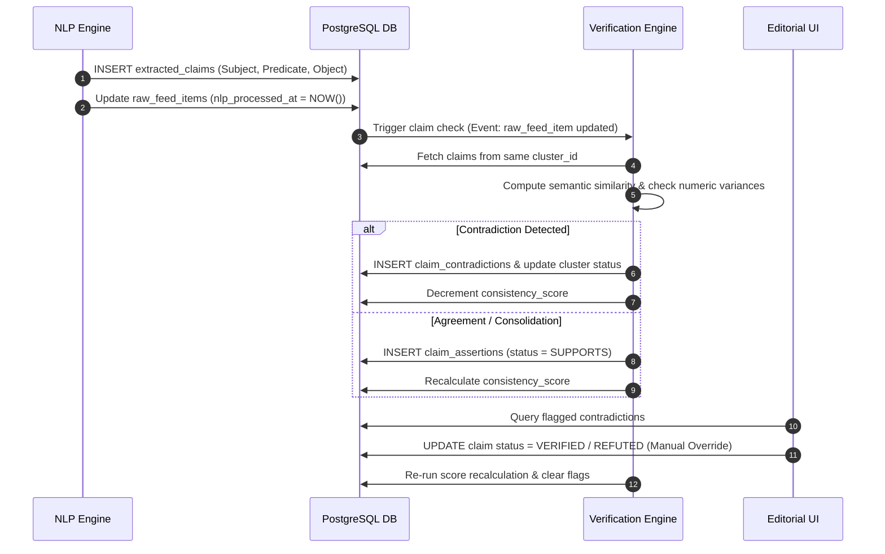
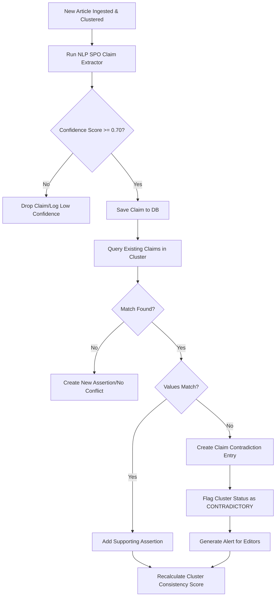

# Fact Consistency and Cross-Source Verification

## Purpose
The purpose of the Fact Consistency and Cross-Source Verification engine is to identify, extract, and reconcile factual assertions across multiple raw news feed items. By parsing ingested text into structured claims and cross-referencing them within topic clusters, this engine flags contradictions, computes factual consistency scores, and exposes disputed assertions to editorial staff. This prevents the dissemination of conflicting reports and ensures editorial integrity across all publications.

## Executive Summary
In a high-frequency digital publishing environment, news sources often report conflicting details about the same event. The Fact Consistency engine automates the validation of claims by parsing raw articles into structured subject-predicate-object assertions. It evaluates assertions across articles in the same topic cluster to identify agreement, neutral expansions, or outright contradictions (e.g., diverging casualty numbers, contradictory financial figures, or conflicting event times). The system outputs a numerical Consistency Score for each cluster and individual article, flags contradictory assertions for human review, and updates verification statuses dynamically.

## Vision
Our vision is to build an automated, low-latency trust engine that verifies and correlates assertions from thousands of global feeds. By mapping unstructured textual claims to a unified, queryable knowledge graph, NewsOps Cloud will serve as a reliable platform where editors can instantly identify conflicting facts, see which sources are reporting what variations, and make informed publishing decisions based on empirical cross-source consensus.

## Scope
This document covers:
- The Claim Extraction NLP pipeline (Subject-Predicate-Object parsing and entity matching).
- Cross-source assertion comparison algorithms and semantic overlap calculations.
- Contradiction identification heuristics (numerical tolerances, entity mismatch, binary negations).
- Consistency score formulas at the article and cluster level.
- Editorial workflow databases and human-in-the-loop moderation APIs.
- Integration schemas, performance standards, logging patterns, and alerting configurations.

It does not cover external fact-checking organization integrations (e.g., Snopes, PolitiFact) or general grammar/spell-checking services.

## Goals
- Extract and cluster factual assertions with an NLP model confidence precision of >= 90%.
- Maintain claim matching latency under 150ms per ingested article.
- Scale claim-level cross-comparison up to 100 raw feed items per second.
- Reduce editorial publishing of unverified conflicting facts by 85%.

## Functional Requirements
- **Automated Claim Extraction**: The system must process unprocessed feed items and extract structured claims containing a Subject, a Predicate, and an Object, with associated entity IDs.
- **Cross-Source Comparison**: The engine must compare newly extracted claims against existing claims within the same article cluster.
- **Contradiction Detection**: The system must flag claims that directly contradict each other. Contradictions must be categorized as:
  - *Numerical Mismatch*: Divergent numeric counts (e.g., date, currency, count) for the same subject-predicate.
  - *Logical Negation*: Explicit antonyms or polarity reversals (e.g., "confirmed" vs "denied").
  - *Entity Conflicts*: Different entities occupying the same structural role (e.g., "John Doe was named CEO" vs "Jane Smith was named CEO").
- **Consistency Score Generation**: The system must compute:
  - *Article Consistency Score*: The ratio of agreeing assertions to total evaluated assertions within its cluster.
  - *Cluster Consistency Score*: Aggregated alignment score representing overall consensus among all sources in the cluster.
- **Human-in-the-loop (HITL) Intervention**: Editors must be able to review flagged contradictions, select the "canonical truth", and mark disputing sources as refuted.

## Non-Functional Requirements
- **High Concurrency**: Support up to 50 concurrent NLP claim extraction workers executing updates against Neon PostgreSQL.
- **Reliable Isolation**: Verification state processing must operate without blocking database writes of incoming raw feed articles.
- **Searchable Indexing**: B-Tree indexes on claim subject entities and hash indexes on normalized predicate strings to ensure rapid matching.
- **Explainability**: Every computed score and contradiction flag must contain a machine-readable JSON trace detailing the source text and confidence margins.

## Business Rules
1. Every extracted claim must reference a valid `raw_feed_items` record.
2. Contradiction evaluation is scoped to articles within the same `Cluster`. Claims are not cross-compared globally unless their parent articles are clustered together.
3. If an editor manually overrides a claim's status to `VERIFIED` or `REFUTED`, that status is locked and cannot be overridden by automated NLP classification updates.
4. Consistency scores must be represented as a decimal between 0.0000 (total contradiction) and 1.0000 (complete consensus).

## Actors
- **NLP Ingestion Pipeline**: Background agent that parses articles, extracts structured claims, and writes them to the DB.
- **Verification Engine**: Background worker that calculates cross-source comparison matrices, flags contradictions, and calculates scores.
- **Editor**: Human user who reviews contradictions, makes final decisions on canonical facts, and configures confidence thresholds.
- **Publisher Service**: Reads consistency scores before syndicating stories to public social endpoints or subscriber portals.

## User Stories
1. **As an Ingestion Analyst**, I want the NLP pipeline to automatically extract factual claims and match them to known entities so that I don't have to manually outline the facts of every incoming article.
2. **As a News Editor**, I want the system to flag a contradiction if two different sources report conflicting acquisition prices for a company, so that I can hold publishing until the discrepancy is resolved.
3. **As a Publishing System**, I want to fetch the Consistency Score of an article cluster before automated newsletter syndication so that I can prevent sending out highly controversial or unverified rumors.

## Acceptance Criteria
1. Factual claims must be extracted with a minimum confidence score of 0.70 to be written to the database.
2. Contradiction flags must trigger within 2 seconds of a new article being assigned to a cluster.
3. The cluster consistency score must drop below 0.60 if there is a verified binary contradiction between two major sources.
4. System must respond to `/api/v1/intelligence/claims/consistency` queries in less than 80ms under 100 concurrent requests.

## Workflows

### 1. Claim Extraction and Comparison Flow
- **Ingestion**: A raw feed item is saved. The NLP Ingestion pipeline detects the new item.
- **Extraction**: The NLP service parses the content, extracting subject-predicate-object patterns (e.g., Subject: `src_Apple`, Predicate: `acquire`, Object: `ent_Shazam`, Modifiers: `value: 400M USD`).
- **Cluster Lookup**: The verification engine identifies the cluster ID associated with the raw feed item.
- **Comparison**: The engine retrieves all active claims in the cluster, compares semantic vector embeddings of the new claim against existing ones, and measures distance.
- **Score Calculation**: If matching claims are found, the engine calculates whether they support or contradict. It recalculates the Consistency Score.
- **Flagging**: If a contradiction is detected, a `claim_contradiction` record is written, and the cluster's status is flagged as `CONTRADICTORY`.

### 2. Editorial Resolution Workflow
- **Review**: An Editor opens the Fact Verification dashboard, filters by "Flagged Contradictions", and views the conflicting claims side-by-side.
- **Override**: The Editor verifies the assertion from the more reliable source.
- **Resolve**: The system updates the selected claim as `VERIFIED` and the opposing claim as `REFUTED`.
- **Recalculation**: The verification engine recalculates the Consistency Score, clears the contradiction flag, and records the manual verification action.



## API Design

### POST /api/v1/intelligence/claims/verify
Manually resolves a contradiction or verifies a claim.
- **Request Headers**:
  - `Authorization: Bearer <JWT>`
  - `Content-Type: application/json`
- **Request Payload**:
  ```json
  {
    "claimId": "clm_abc123987",
    "status": "VERIFIED",
    "overrideReason": "Official press release confirmed the transaction size at $400 million.",
    "refuteOpposingClaims": true
  }
  ```
- **Response Payload (200 OK)**:
  ```json
  {
    "status": "success",
    "claimId": "clm_abc123987",
    "resolvedStatus": "VERIFIED",
    "refutedClaims": ["clm_xyz987654"],
    "clusterId": "cls_992837482",
    "newClusterConsistencyScore": 0.9500,
    "updatedAt": "2026-06-27T22:35:00Z"
  }
  ```

### GET /api/v1/intelligence/clusters/{clusterId}/consistency
Retrieves the detailed consistency audit log and score breakdown for a specific topic cluster.
- **Request Headers**:
  - `Authorization: Bearer <JWT>`
- **Response Payload (200 OK)**:
  ```json
  {
    "clusterId": "cls_992837482",
    "consistencyScore": 0.7250,
    "totalClaims": 14,
    "status": "CONTRADICTORY",
    "contradictions": [
      {
        "id": "ctd_883920111",
        "type": "NUMERICAL_MISMATCH",
        "severity": "HIGH",
        "primaryClaim": {
          "id": "clm_abc123987",
          "articleId": "itm_5516273",
          "sourceName": "Reuters",
          "assertionText": "Apple acquires Shazam for 400M USD",
          "subject": "Apple",
          "predicate": "acquire",
          "object": "Shazam",
          "numericValue": 400000000.00
        },
        "conflictingClaim": {
          "id": "clm_xyz987654",
          "articleId": "itm_9928172",
          "sourceName": "Tech Rumors Blog",
          "assertionText": "Apple acquired Shazam for 300 million dollars",
          "subject": "Apple",
          "predicate": "acquire",
          "object": "Shazam",
          "numericValue": 300000000.00
        },
        "variancePercent": 25.00
      }
    ],
    "consensusStatements": [
      {
        "canonicalAssertion": "Apple is acquiring Shazam",
        "supportingSourcesCount": 8,
        "opposingSourcesCount": 1
      }
    ]
  }
  ```

## Database Design

### Prisma Schema
```prisma
datasource db {
  provider = "postgresql"
  url      = env("DATABASE_URL")
}

enum AssertionStatus {
  SUPPORTS
  REFUTES
  NEUTRAL
}

enum ClaimVeracity {
  VERIFIED
  REFUTED
  UNVERIFIED
  CONTRADICTORY
}

enum ContradictionType {
  NUMERICAL_MISMATCH
  LOGICAL_NEGATION
  ENTITY_CONFLICT
  DATE_MISMATCH
}

model ExtractedClaim {
  id              String         @id @default(dbgenerated("concat('clm_', replace(gen_random_uuid()::text, '-', ''))")) @db.VarChar(50)
  rawFeedItemId   String         @map("raw_feed_item_id") @db.VarChar(50)
  subjectEntityId String?        @map("subject_entity_id") @db.VarChar(50)
  subjectText     String         @map("subject_text") @db.VarChar(255)
  predicate       String         @db.VarChar(100)
  objectEntityId  String?        @map("object_entity_id") @db.VarChar(50)
  objectText      String         @map("object_text") @db.VarChar(255)
  numericValue    Decimal?       @map("numeric_value") @db.Decimal(18, 4)
  rawClaimText    String         @map("raw_claim_text") @db.VarChar(1024)
  confidenceScore Decimal        @map("confidence_score") @db.Decimal(5, 4)
  veracity        ClaimVeracity  @default(UNVERIFIED)
  createdAt       DateTime       @default(now()) @map("created_at")
  updatedAt       DateTime       @updatedAt @map("updated_at")

  rawFeedItem     RawFeedItem    @relation(fields: [rawFeedItemId], references: [id], onDelete: Cascade)
  primaryContradictions   ClaimContradiction[] @relation("PrimaryClaim")
  conflictingContradictions ClaimContradiction[] @relation("ConflictingClaim")
  assertions      ClaimAssertion[]

  @@index([rawFeedItemId])
  @@index([subjectText])
  @@index([predicate])
  @@map("extracted_claims")
}

model ClaimAssertion {
  id             String          @id @default(dbgenerated("concat('asr_', replace(gen_random_uuid()::text, '-', ''))")) @db.VarChar(50)
  claimId        String          @map("claim_id") @db.VarChar(50)
  clusterId      String          @map("cluster_id") @db.VarChar(50)
  status         AssertionStatus @default(NEUTRAL)
  matchingScore  Decimal         @map("matching_score") @db.Decimal(5, 4)
  createdAt      DateTime        @default(now()) @map("created_at")

  claim          ExtractedClaim  @relation(fields: [claimId], references: [id], onDelete: Cascade)
  cluster        Cluster         @relation(fields: [clusterId], references: [id], onDelete: Cascade)

  @@index([claimId])
  @@index([clusterId])
  @@map("claim_assertions")
}

model ClaimContradiction {
  id                 String            @id @default(dbgenerated("concat('ctd_', replace(gen_random_uuid()::text, '-', ''))")) @db.VarChar(50)
  clusterId          String            @map("cluster_id") @db.VarChar(50)
  primaryClaimId     String            @map("primary_claim_id") @db.VarChar(50)
  conflictingClaimId String            @map("conflicting_claim_id") @db.VarChar(50)
  type               ContradictionType
  severity           String            @default("MEDIUM") @db.VarChar(20)
  resolvedAt         DateTime?         @map("resolved_at")
  resolvedBy         String?           @map("resolved_by") @db.VarChar(100)
  overrideReason     String?           @map("override_reason") @db.Text
  createdAt          DateTime          @default(now()) @map("created_at")

  cluster            Cluster           @relation(fields: [clusterId], references: [id], onDelete: Cascade)
  primaryClaim       ExtractedClaim    @relation("PrimaryClaim", fields: [primaryClaimId], references: [id], onDelete: Cascade)
  conflictingClaim   ExtractedClaim    @relation("ConflictingClaim", fields: [conflictingClaimId], references: [id], onDelete: Cascade)

  @@index([clusterId])
  @@index([primaryClaimId])
  @@index([conflictingClaimId])
  @@map("claim_contradictions")
}

model ConsistencyReport {
  id             String   @id @default(dbgenerated("concat('rpt_', replace(gen_random_uuid()::text, '-', ''))")) @db.VarChar(50)
  clusterId      String   @unique @map("cluster_id") @db.VarChar(50)
  consistencyScore Decimal @map("consistency_score") @db.Decimal(5, 4)
  totalClaimsCount Int     @map("total_claims_count")
  contradictionCount Int   @map("contradiction_count")
  calculatedAt   DateTime @default(now()) @map("calculated_at")

  cluster        Cluster  @relation(fields: [clusterId], references: [id], onDelete: Cascade)

  @@index([clusterId])
  @@map("consistency_reports")
}

// References to existing models from news_intelligence_schema
model RawFeedItem {
  id             String           @id @db.VarChar(50)
  claims         ExtractedClaim[]
}

model Cluster {
  id             String               @id @db.VarChar(50)
  assertions     ClaimAssertion[]
  contradictions ClaimContradiction[]
  report         ConsistencyReport?
}
```

### PostgreSQL DDL
```sql
CREATE TYPE assertion_status AS ENUM ('SUPPORTS', 'REFUTES', 'NEUTRAL');
CREATE TYPE claim_veracity AS ENUM ('VERIFIED', 'REFUTED', 'UNVERIFIED', 'CONTRADICTORY');
CREATE TYPE contradiction_type AS ENUM ('NUMERICAL_MISMATCH', 'LOGICAL_NEGATION', 'ENTITY_CONFLICT', 'DATE_MISMATCH');

-- Extracted Claims Table
CREATE TABLE extracted_claims (
    id VARCHAR(50) PRIMARY KEY DEFAULT concat('clm_', replace(gen_random_uuid()::text, '-', '')),
    raw_feed_item_id VARCHAR(50) NOT NULL REFERENCES raw_feed_items(id) ON DELETE CASCADE,
    subject_entity_id VARCHAR(50),
    subject_text VARCHAR(255) NOT NULL,
    predicate VARCHAR(100) NOT NULL,
    object_entity_id VARCHAR(50),
    object_text VARCHAR(255) NOT NULL,
    numeric_value DECIMAL(18, 4),
    raw_claim_text VARCHAR(1024) NOT NULL,
    confidence_score DECIMAL(5,4) NOT NULL CHECK (confidence_score >= 0.0000 AND confidence_score <= 1.0000),
    veracity claim_veracity NOT NULL DEFAULT 'UNVERIFIED',
    created_at TIMESTAMP WITH TIME ZONE NOT NULL DEFAULT NOW(),
    updated_at TIMESTAMP WITH TIME ZONE NOT NULL DEFAULT NOW()
);

CREATE INDEX idx_claims_item ON extracted_claims(raw_feed_item_id);
CREATE INDEX idx_claims_subject ON extracted_claims(subject_text);
CREATE INDEX idx_claims_predicate ON extracted_claims(predicate);

-- Claim Assertions Table (Maps claims to clusters)
CREATE TABLE claim_assertions (
    id VARCHAR(50) PRIMARY KEY DEFAULT concat('asr_', replace(gen_random_uuid()::text, '-', '')),
    claim_id VARCHAR(50) NOT NULL REFERENCES extracted_claims(id) ON DELETE CASCADE,
    cluster_id VARCHAR(50) NOT NULL REFERENCES clusters(id) ON DELETE CASCADE,
    status assertion_status NOT NULL DEFAULT 'NEUTRAL',
    matching_score DECIMAL(5,4) NOT NULL CHECK (matching_score >= 0.0000 AND matching_score <= 1.0000),
    created_at TIMESTAMP WITH TIME ZONE NOT NULL DEFAULT NOW()
);

CREATE INDEX idx_assertions_claim ON claim_assertions(claim_id);
CREATE INDEX idx_assertions_cluster ON claim_assertions(cluster_id);

-- Claim Contradictions Table
CREATE TABLE claim_contradictions (
    id VARCHAR(50) PRIMARY KEY DEFAULT concat('ctd_', replace(gen_random_uuid()::text, '-', '')),
    cluster_id VARCHAR(50) NOT NULL REFERENCES clusters(id) ON DELETE CASCADE,
    primary_claim_id VARCHAR(50) NOT NULL REFERENCES extracted_claims(id) ON DELETE CASCADE,
    conflicting_claim_id VARCHAR(50) NOT NULL REFERENCES extracted_claims(id) ON DELETE CASCADE,
    type contradiction_type NOT NULL,
    severity VARCHAR(20) NOT NULL DEFAULT 'MEDIUM',
    resolved_at TIMESTAMP WITH TIME ZONE,
    resolved_by VARCHAR(100),
    override_reason TEXT,
    created_at TIMESTAMP WITH TIME ZONE NOT NULL DEFAULT NOW()
);

CREATE INDEX idx_contradictions_cluster ON claim_contradictions(cluster_id);
CREATE INDEX idx_contradictions_primary ON claim_contradictions(primary_claim_id);
CREATE INDEX idx_contradictions_conflicting ON claim_contradictions(conflicting_claim_id);

-- Consistency Reports Table
CREATE TABLE consistency_reports (
    id VARCHAR(50) PRIMARY KEY DEFAULT concat('rpt_', replace(gen_random_uuid()::text, '-', '')),
    cluster_id VARCHAR(50) UNIQUE NOT NULL REFERENCES clusters(id) ON DELETE CASCADE,
    consistency_score DECIMAL(5,4) NOT NULL CHECK (consistency_score >= 0.0000 AND consistency_score <= 1.0000),
    total_claims_count INT NOT NULL DEFAULT 0,
    contradiction_count INT NOT NULL DEFAULT 0,
    calculated_at TIMESTAMP WITH TIME ZONE NOT NULL DEFAULT NOW()
);

CREATE INDEX idx_consistency_reports_cluster ON consistency_reports(cluster_id);
```

## UI Design
- **Fact Verification Hub**: Dashboard lists clusters sorted by the number of active contradictions. Displays a visual gauge showing the consistency score.
- **Contradiction Resolver Drawer**: Side sheet that opens when clicking a flagged contradiction. Displays:
  - Subject-Predicate-Object breakdown of the dispute.
  - Side-by-side card views of the opposing source articles (including publication name, author, trust index, and highlighted sentence).
  - Radio selection to mark one assertion as "Canonical True".
  - Text input area for documenting the verification source or reasoning.
  - Submit action button labeled "Publish Verified Truth".

## Permissions
- `intelligence:claims:read` - Read claims, assertions, contradictions, and scores.
- `intelligence:claims:verify` - Write manual overrides, resolve contradictions, change veracity state.
- `intelligence:claims:configure` - Edit NLP threshold configurations and tolerance bands.

## Security
- **JWT Scope Enforcement**: Users must present a JWT containing a valid roles scope matching `editor` or `fact-checker` to hit the `/verify` endpoint.
- **Input Sanitization**: Subject/Object text and override reasons must be sanitized to reject HTML scripts or SQL injections.
- **Auditing**: Every manual claim status override is strictly written to the audit log table detailing the user ID, timestamp, original values, and override reason.

## Performance
- **Target Ingestion Latency**: Core claim extraction must execute asynchronously in background queues within 1.5 seconds of raw item clustering.
- **Read Latency**: Aggregated consistency reports must fetch within 40ms utilizing GIN text indexes and database index joins.
- **Target TPS**: Up to 80 assertion evaluations per second during peak breaking news traffic.

## Monitoring
- `newsops_fact_extracted_claims_total`: Counter of claims successfully parsed by the NLP worker.
- `newsops_fact_contradictions_detected_total`: Counter of flagged logical/numerical contradictions.
- `newsops_fact_consistency_processing_seconds`: Histogram measuring the execution duration of cross-source matching.
- **Alert Trigger**: Trigger Slack/PagerDuty notification if `newsops_fact_contradictions_detected_total` exceeds 500 in 10 minutes (suggesting an ingestion failure or major disinformation event).

## Logging
- **Log Format**: JSON log layout.
- **Levels**: INFO for claim clustering and scoring, WARN for high-variance numerical detections, ERROR for NLP parsing syntax exceptions.
- **Log Context Example**:
  ```json
  {
    "timestamp": "2026-06-27T22:36:12.802Z",
    "level": "WARN",
    "context": "newsops-verification-engine",
    "cluster_id": "cls_992837482",
    "contradiction_id": "ctd_883920111",
    "type": "NUMERICAL_MISMATCH",
    "variance_percent": 25.0,
    "message": "Factual conflict detected between Reuters and Tech Rumors Blog on acquisition cost."
  }
  ```

## Error Handling
- `CLAIM_NOT_FOUND`: Code 404. HTTP Status 404. "The target claim record does not exist."
- `ALREADY_RESOLVED`: Code 409. HTTP Status 409. "The contradiction has already been resolved by another moderator."
- `INVALID_VERACITY_STATUS`: Code 400. HTTP Status 400. "The requested claim veracity status is invalid."

## Edge Cases
- **Circular Contradictions**: Three or more articles asserting three conflicting details (A=10, B=12, C=15). The engine handles this by grouping all conflicting nodes within a single `claim_contradiction` record and assigning a severity rating of `CRITICAL`.
- **Repetitive Syndication (Echo Chambers)**: Plagiarized or verbatim syndications of a rumor. The engine measures high text similarity and short publication window offsets to count them as a single assertion branch, preventing the consensus score from being artificially skewed by repeating sources.

## Future Improvements
- **Knowledge Graph Syncing**: Exporting verified claims automatically to Wikidata or an internal Neo4j instance to perform graph-based logical integrity verification.
- **Auto-Correction Injection**: Ingesting correction feeds from major news agencies and applying retroactive corrections automatically.

## Mermaid Diagrams

### Contradiction Detection Process Flow


## References
- [News Intelligence Schema](../03-database/news_intelligence_schema.md)
- [System Architecture](../02-architecture/system_architecture.md)
- [AI Orchestration Layer](../04-ai/ai_orchestration_architecture.md)
- [AI Moderation and Safety](../04-ai/ai_moderation_safety.md)
