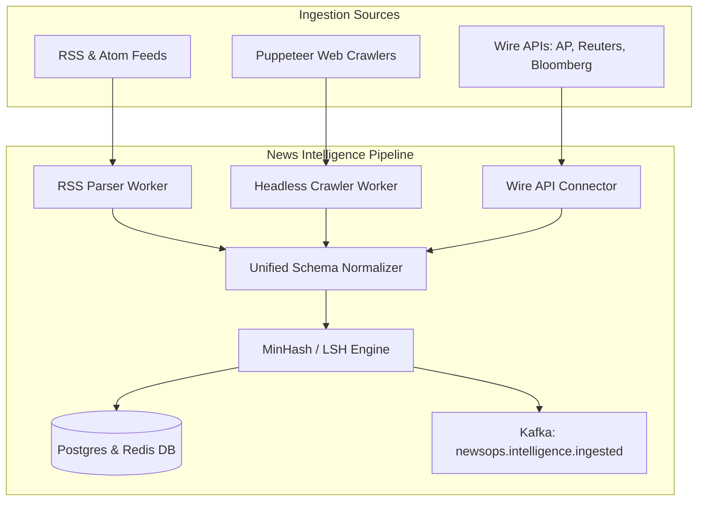

# News Intelligence Subsystem

## Purpose
The News Intelligence subsystem is the automated ingestion, parsing, normalization, and deduplication layer for the NewsOps Cloud digital publishing platform. It acts as the system's external sensory organ, continuous polling feeds, crawling web publications, connecting to commercial news wire services, and clustering incoming content to prevent duplicate noise. This directory contains the architectural blueprints, schema contracts, worker engine specifications, and deployment requirements for all components involved in the ingestion and preprocessing of raw intelligence data before it enters the editorial CMS and AI enrichment pipelines.

## Executive Summary
Modern newsrooms face data deluge, receiving thousands of updates per minute from wire services, RSS feeds, and competitor publications. The News Intelligence subsystem streamlines this ingestion process. By implementing high-frequency polling, headless JS execution, API integration connectors, and an algorithmic Locality-Sensitive Hashing (LSH) deduplication layer, the system filters out redundant content, extracts high-quality structured data, and presents a normalized, unified stream to journalists and automated AI editors. This architecture guarantees multi-tenant data isolation, strict rate-limiting compliance, proxy rotation, and millisecond-level deduplication processing.

## Vision
To establish a zero-lag, highly resilient, and ethically compliant global content acquisition network. This network enables news organizations to instantly capture, isolate, and understand breaking news trends as they occur, ensuring that NewsOps Cloud tenants are always first to publish while maintaining zero operational overlap and low infrastructure overhead.

## Scope
The News Intelligence subsystem covers the following areas:
- **RSS Monitoring Engine**: High-frequency cron-based and queue-driven feed polling, XML parse workers, and feed health monitoring.
- **Web Crawler Engine**: Headless browser scraping via Puppeteer/Playwright, cookie and proxy management, robots.txt enforcement, and declarative HTML selectors.
- **API Connector Engine**: Enterprise wire service integrations (Associated Press, Reuters, Bloomberg) with custom credential handshakes and schema mapping.
- **Deduplication Engine**: MinHash and Locality-Sensitive Hashing (LSH) pipelines for near-duplicate clustering and cosine similarity ranking.
- **Administration & Monitoring UI**: Dashboards for configuring ingest rules, diagnosing crawler health, viewing crawl logs, and adjusting duplicate similarity thresholds.

## Goals
- **Real-Time Delivery**: Ingest, parse, normalize, and deduplicate wire messages in under 2 seconds from the time of receipt.
- **Robust Deduplication**: Reduce incoming editor feed noise by at least 70% by correctly grouping near-identical reports and updates.
- **Strict Compliance**: Maintain zero crawler-related IP bans by enforcing target site rate limits, respecting robots.txt files, and rotating through proxy pools.
- **Schema Unification**: Normalize disparate data sources (RSS, Custom JSON, Atom, AP WebFeeds) into a single, cohesive schema format.
- **Low Infrastructure Overhead**: Optimize JS-heavy scraping memory usage and LSH indexing processes to keep cloud costs minimal.

## Functional Requirements
- **FR-1.1**: The system must support registration, editing, and deletion of RSS/Atom feeds with custom polling intervals (ranging from 1 minute to 24 hours).
- **FR-1.2**: The system must run headless browsers to scrape JavaScript-rendered single-page applications (SPAs) and extract main article bodies.
- **FR-1.3**: The system must ingest raw news items from wire APIs (AP, Reuters, Bloomberg) using pull-based polling or push-based webhook subscriptions.
- **FR-1.4**: The system must automatically normalize all incoming content (title, body, author, publish date, source URL, tags, media assets) into a unified JSON schema.
- **FR-1.5**: The system must tokenize normalized article text, generate MinHash signatures, and perform LSH bucket matching to detect near-duplicates.
- **FR-1.6**: The system must allow editors to adjust similarity thresholds (0.5 to 1.0) and choose whether duplicate articles are hidden, grouped, or automatically merged.

## Non-Functional Requirements
- **NFR-2.1 (Performance)**: The duplicate detection engine must match and insert an incoming article within 100 milliseconds at a target throughput of 500 articles per second.
- **NFR-2.2 (Scalability)**: The crawlers and RSS workers must scale horizontally using Kubernetes HPA based on Kafka queue lag.
- **NFR-2.3 (Reliability)**: The ingestion pipeline must continue working even if target wire APIs fail, queuing failed requests for exponential backoff retries.
- **NFR-2.4 (Security)**: Third-party wire credentials must be encrypted at rest using AES-256-GCM and stored securely in Vault.
- **NFR-2.5 (Compliance)**: The web crawler must honor `robots.txt` directive files and support user-agent customization (e.g., `NewsOpsBot/1.0`).

## Business Rules
- **BR-3.1**: Ingested data is strictly isolated by tenant organization; a tenant cannot view or query raw feed items or wire connections configured by another tenant unless explicitly flagged as public/shared.
- **BR-3.2**: System crawlers must enforce a minimum politeness delay of 1 second between requests to any single domain name, unless specifically whitelisted by domain-level agreements.
- **BR-3.3**: Premium wire data is subject to licensing agreements; the system must auto-expire or archive wire stories older than 30 days to comply with wire vendor terms.
- **BR-3.4**: If a feed fails to poll successfully 5 consecutive times, it must be flagged as `Degraded` and the notification system must alert the tenant administrator.

## Actors
- **Content Operations Specialist**: Responsible for configuring, testing, and debugging crawler selectors, API connections, and RSS feeds.
- **System Administrator**: Monitors system capacity, queue backlogs, proxy health, and performance metrics.
- **Editorial User (Journalist/Editor)**: Consumes the normalized and deduplicated intelligence feed to find leads, write stories, and coordinate coverage.
- **AI Agent (Ingestion & Auto-writer)**: Automated actor that monitors specific intelligence clusters to generate automated summaries or drafts.

## User Stories
- **US-4.1**: As a Content Operations Specialist, I want to add a custom RSS feed and map its non-standard XML tags to the unified NewsOps schema, so that the parser can accurately extract metadata.
- **US-4.2**: As a Journalist, I want to view breaking news clusters grouped by similarity, so that I don't waste time reading ten different versions of the same wire story.
- **US-4.3**: As a System Administrator, I want to monitor proxy success rates and response latencies across our proxy pool, so that I can replace blocked or slow proxies before they impact ingestion times.

## Acceptance Criteria
- **AC-5.1**: The RSS worker must process a 500-item feed XML file, parse all articles, verify duplicate state, and write to the database in less than 5 seconds.
- **AC-5.2**: The scraper must execute client-side JavaScript, wait for the target selector to render, and extract the primary text content with an accuracy rate of 95% or higher on supported templates.
- **AC-5.3**: The deduplication engine must successfully group two articles that share 85% of their text (measured by cosine similarity of TF-IDF vectors) under the same LSH cluster.
- **AC-5.4**: The system must raise a critical PagerDuty alert if the overall ingestion pipeline queue lag exceeds 10,000 messages or if the dead-letter queue (DLQ) receives more than 50 failures in a 5-minute window.

## Workflows
1. **Source Discovery & Registration**:
   - The Content Operations Specialist enters a new source (RSS feed URL, Web URL, or Wire API endpoint) in the admin console.
   - The system verifies the connection, parses `robots.txt` if it is a crawler target, and runs a dry-run execution.
   - If successful, the source configuration is saved to the PostgreSQL database and a recurring job is scheduled in the task runner.
2. **Ingestion & Normalization Loop**:
   - The scheduler triggers a worker to poll an RSS feed or query a wire API.
   - For web scrapers, a Puppeteer job is dispatched to crawl the target page.
   - The raw payload is fetched, stripped of HTML boilerplate/scripts, and mapped into the unified schema layout.
3. **Deduplication & Clustering**:
   - The normalized document is tokenized and its MinHash signature is generated.
   - The LSH index queries matching bands to locate existing candidate clusters.
   - If a candidate is found, the system calculates precise Cosine or Jaccard similarity.
   - If similarity exceeds the configured threshold, the document is linked to the existing cluster. Otherwise, a new cluster is created.
4. **Editorial Routing**:
   - The normalized article and its cluster ID are written to the database.
   - An event is published to the `newsops.intelligence.ingested` Kafka topic.
   - Editorial dashboards update in real-time via WebSockets, alerting journalists to new clusters.

## API Design
Below are key REST endpoints for managing the News Intelligence subsystem.

### 1. Register Ingestion Source
- **Endpoint**: `POST /api/v1/news-intelligence/sources`
- **Headers**: `Content-Type: application/json`, `Authorization: Bearer <JWT>`
- **Request Payload**:
```json
{
  "name": "Associated Press World News",
  "type": "wire_api",
  "url": "https://api.ap.org/v2/feed",
  "pollingIntervalMinutes": 5,
  "config": {
    "authType": "apiKey",
    "apiKeyHeader": "X-Ap-Key",
    "secretName": "vault:ap-world-news-key",
    "mappingTemplate": "ap-v2-standard"
  },
  "metadata": {
    "region": "global",
    "language": "en",
    "category": "general"
  }
}
```
- **Response Payload (201 Created)**:
```json
{
  "sourceId": "src_8f9e0a1b2c3d4e5f",
  "name": "Associated Press World News",
  "status": "active",
  "nextRunAt": "2026-06-27T17:05:00Z",
  "createdAt": "2026-06-27T17:00:00Z"
}
```

### 2. Query Ingested Clusters
- **Endpoint**: `GET /api/v1/news-intelligence/clusters`
- **Query Parameters**: `minSimilarity=0.85`, `limit=20`, `offset=0`, `timeRange=24h`
- **Response Payload (200 OK)**:
```json
{
  "clusters": [
    {
      "clusterId": "cluster_99a88b77c66d",
      "primaryArticle": {
        "articleId": "art_111122223333",
        "title": "Global Market Influx Leads to Equity Surge",
        "source": "Reuters",
        "publishedAt": "2026-06-27T16:45:00Z",
        "url": "https://www.reuters.com/business/global-market-influx-equity-surge"
      },
      "duplicateCount": 3,
      "updatedAt": "2026-06-27T16:55:12Z",
      "members": [
        {
          "articleId": "art_444455556666",
          "title": "Markets Surge Globally as Equities Rise",
          "source": "AP News",
          "similarity": 0.91,
          "publishedAt": "2026-06-27T16:48:22Z"
        },
        {
          "articleId": "art_777788889999",
          "title": "Global Equities Experience Massive Surge",
          "source": "Bloomberg",
          "similarity": 0.88,
          "publishedAt": "2026-06-27T16:52:10Z"
        }
      ]
    }
  ],
  "pagination": {
    "total": 1,
    "limit": 20,
    "offset": 0
  }
}
```

## Database Design
Relevant schema tables inside the News Intelligence subsystem.

### Table: `ingestion_sources`
Tracks configured RSS feeds, scraper targets, and API endpoints.
- `id` (UUID, Primary Key)
- `tenant_id` (UUID, Foreign Key referencing `tenants.id`, Indexed)
- `name` (VARCHAR(255))
- `type` (VARCHAR(50)) -- 'rss', 'crawler', 'wire_api'
- `url` (VARCHAR(2048))
- `polling_interval_minutes` (INTEGER)
- `config` (JSONB) -- Selector rules, headers, API parameter mappings
- `status` (VARCHAR(50)) -- 'active', 'inactive', 'degraded', 'error'
- `last_run_at` (TIMESTAMP WITH TIME ZONE)
- `next_run_at` (TIMESTAMP WITH TIME ZONE, Indexed)
- `error_count` (INTEGER DEFAULT 0)
- `created_at` (TIMESTAMP WITH TIME ZONE DEFAULT NOW())

### Table: `intelligence_articles`
Stores raw, normalized incoming articles before editorial approval.
- `id` (UUID, Primary Key)
- `tenant_id` (UUID, Foreign Key)
- `source_id` (UUID, Foreign Key referencing `ingestion_sources.id`)
- `external_id` (VARCHAR(512)) -- ID from wire/feed source
- `title` (TEXT)
- `body` (TEXT)
- `author` (VARCHAR(255))
- `published_at` (TIMESTAMP WITH TIME ZONE, Indexed)
- `ingested_at` (TIMESTAMP WITH TIME ZONE DEFAULT NOW())
- `source_url` (VARCHAR(2048), Indexed)
- `raw_payload` (JSONB)
- `normalized_payload` (JSONB)
- `cluster_id` (UUID, Foreign Key referencing `intelligence_clusters.id`, Nullable, Indexed)

### Table: `intelligence_clusters`
Maintains grouping information for deduplicated articles.
- `id` (UUID, Primary Key)
- `tenant_id` (UUID, Foreign Key)
- `primary_article_id` (UUID) -- Points to first or most complete article
- `cluster_hash` (VARCHAR(64)) -- Global representative fingerprint
- `created_at` (TIMESTAMP WITH TIME ZONE DEFAULT NOW())
- `updated_at` (TIMESTAMP WITH TIME ZONE DEFAULT NOW(), Indexed)

## UI Design
The configuration interface is structured as a single-page workspace called the **News Intelligence Hub**:
1. **Left Panel: Source Navigation**: Tree view listing all monitored feeds, categorized by type (RSS, Crawler, API Connector) and status indicator lights (Green/Yellow/Red).
2. **Center Panel: Ingest Dashboard**: Displays real-time feed processing speed, success rates, active scraping jobs, and queue lags.
3. **Right Panel: Configuration Inspector**: Details for the selected source, including polling speed, custom selector configuration fields, authorization tokens, and target path mapping rules.
4. **Bottom Panel: Log Console**: Stream of warning, error, and info logs mapping parser successes, proxy switches, and block alerts.

## Permissions
Access control uses Role-Based Access Control (RBAC):
- `intelligence:sources:read` - View the list of ingestion sources and their health.
- `intelligence:sources:write` - Create, edit, and delete ingestion sources, RSS feeds, and crawler configurations.
- `intelligence:sources:credentials` - Access and edit third-party wire API keys or proxy credentials.
- `intelligence:clusters:read` - Query deduplicated clusters and article details.
- `intelligence:clusters:write` - Manually merge clusters, re-run similarity checks, or flag errors.

## Security
- **Authentication & Auditing**: All API requests require valid tenant JWTs. Actions are logged to the central audit path.
- **Wire Credentials Encrypted**: Wire API keys, OAuth client secrets, and proxy passwords are encrypted before database insertion using a KMS-backed envelope key.
- **Sandboxed Execution**: Crawlers execute Puppeteer pages within isolated Linux containers with restricted networking to prevent side-channel exploits.
- **Data Isolation**: Multi-tenant database filters enforce the `tenant_id` schema rule, preventing raw wire stories from leaking across tenants.

## Performance
- **Ingestion Latency**: Raw feed item parse to database storage must take less than 1.5 seconds.
- **Deduplication Engine**: MinHash signature matching must execute within 50ms using a Redis-backed index structure.
- **Throughput target**: The architecture supports a continuous load of 500 articles/sec and peaks of 2,000 articles/sec.
- **Cache Policy**: Redis holds active LSH bucket hashes for the last 72 hours of articles. Older signatures expire.

## Monitoring
Metrics exported to Prometheus:
- `newsops_news_intelligence_feed_polls_total{status="success|failure", source_type="rss|crawler|wire"}`
- `newsops_crawler_request_duration_seconds{domain="example.com"}`
- `newsops_duplicate_engine_processing_time_milliseconds`
- `newsops_active_proxies_count{status="online|banned|failed"}`

Alert Triggers:
- **FeedPollFailureHigh**: Alert fires if `rate(newsops_news_intelligence_feed_polls_total{status="failure"}[10m]) > 0.15`.
- **ProxyPoolDepleted**: Critical alert if `newsops_active_proxies_count{status="online"} < 5`.

## Logging
Logging uses standard structured JSON formats:
```json
{
  "timestamp": "2026-06-27T17:01:23.456Z",
  "level": "ERROR",
  "service": "rss-monitor",
  "tenant_id": "org_5e3d2c1b",
  "source_id": "src_8f9e0a1b2c3d4e5f",
  "message": "Failed to parse XML from RSS feed target",
  "exception": "XMLSyntaxError: StartTag: invalid element name at line 42",
  "context": {
    "url": "https://www.badfeed.com/rss.xml",
    "retries": 3
  }
}
```

## Error Handling
Map internal exception codes to external HTTP payloads:
- `NI_FEED_UNREACHABLE` (HTTP 504): Target server failed to respond. Customer message: "The feed server did not respond. Check the connection URL."
- `NI_PARSING_FAILED` (HTTP 422): Target XML or HTML selector does not match structure. Customer message: "Could not parse feed layout. Please verify selectors or templates."
- `NI_RATE_LIMIT_EXCEEDED` (HTTP 429): Crawler hit upstream rate-limiting threshold. Customer message: "Ingestion suspended to prevent domain block. Retrying in 15 minutes."

## Edge Cases
- **Crawler Traps**: Web scrapers hitting infinite loops of calendar pages or recursive query strings. Mitigation: Set strict maximum crawl depth of 2 levels and limit URLs per domain to 100 within a single session.
- **Breaking News Storms**: High rate of duplicates when a major event breaks. Mitigation: LSH buckets reject signatures if bucket size exceeds 50 identical hits within 5 minutes, routing them to a manual review queue.
- **Stale Proxies**: Target websites banning proxy IPs dynamically. Mitigation: Detect HTTP 403 or Cloudflare challenge pages, immediately rotate IP, and temporarily ban the bad proxy.

## Future Improvements
- **Autonomous Selector Repair**: AI models analyzing failed scrapers and automatically proposing updated DOM selector configurations.
- **Multimodal Deduplication**: Grouping clusters based on video frames and image embeddings in addition to text.
- **Edge Crawlers**: Offloading crawling workers to CDN edge locations to distribute traffic origin networks.

## Mermaid Diagrams


## References
- [System Architecture Blueprint](../02-architecture/system_architecture.md)
- [Database Schema Design Standards](../03-database/schema_design_standards.md)
- [News Intelligence Schema Tables](../03-database/news_intelligence_schema.md)
- [Event-Driven Integration Patterns](../02-architecture/event_driven_design.md)
