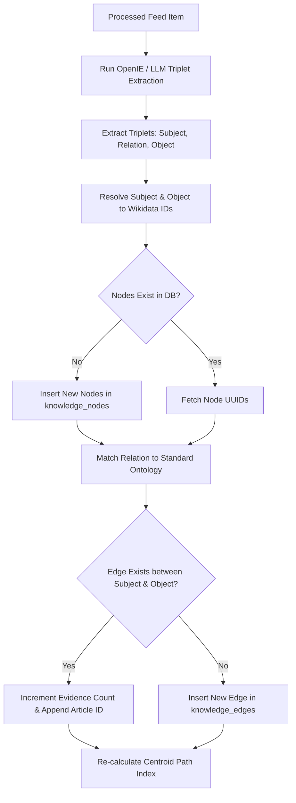
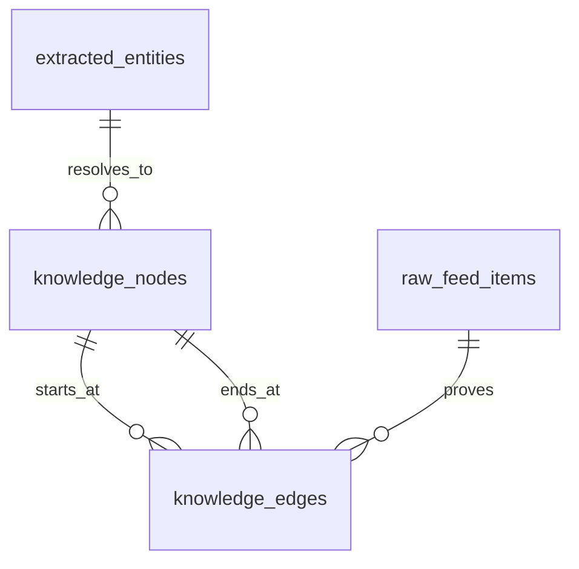

# Knowledge Graph

## Purpose
The purpose of the Knowledge Graph design document is to define the logical schema, storage architecture, query specifications, and path-tracing algorithms for representing semantic relationships between news entities (people, organizations, locations), events, and verified facts. This system facilitates advanced semantic search, story-arc tracking, and automated discovery of hidden connections across disparate news articles.

## Executive Summary
The NewsOps Cloud platform ingests massive amounts of unstructured articles and extracts named entities and verified facts. However, to understand the structural context of the news, these entities must be linked relatorially. The Knowledge Graph maps these extractions into a directed property graph. The system stores nodes (entities, locations, articles, sources) and directed edges (factual assertions like *AcquiredBy*, *PartneredWith*, *LocatedIn*, *Criticized*) with confidence scores. It supports hybrid querying using PostgreSQL recursive CTEs and external graph database endpoints (Neo4j Cypher).

## Vision
To establish a self-constructing, real-time news knowledge graph that automatically resolves factual triplets from raw text, traces paths between entities to show geopolitical or corporate connections, and acts as the relational foundation for automated intelligence reporting.

## Scope
This design document covers:
- Entity and Relationship schema design (Nodes and Edges).
- Relational schema representation in PostgreSQL (using tables and indexes optimized for join-intensive queries).
- Graph query specifications using both SQL Recursive CTEs (Common Table Expressions) and Cypher queries.
- Path tracing (Breadth-First Search / Shortest Path discovery) specifications between two arbitrary entity nodes.
- Ingestion pipeline from Open Information Extraction (OpenIE) / LLM triplet extraction to graph updates.

## Goals
- Support traversal queries up to 4 degrees of separation in under 80ms.
- Automate relation extraction with a precision threshold of $\ge 88\%$ using zero-shot semantic parsing.
- Support write concurrency of up to 100 edge insertions per second.
- Map and index 100% of extracted Wikidata-linked entities as unique nodes in the graph database.

## Functional Requirements
- **Triplet Extraction**: The NLP pipeline must extract factual triplets in the form of $(Subject, Relation, Object)$ from incoming raw feed items.
- **Node Resolution**: The system must automatically resolve subjects and objects to existing unique entity nodes based on their Wikidata Q-code or UUID.
- **Edge Confidence Scoring**: Every relationship edge must be annotated with a confidence score and a back-link reference to the source raw feed item.
- **Path Tracing**: The API must support finding the shortest path of relations connecting Entity A (e.g., a company) to Entity B (e.g., a politician).
- **Temporal Edges**: Edges must record validity periods (e.g., start_date, end_date) to capture historical changes, such as executive job tenure.

## Non-Functional Requirements
- **Query Latency**: Single-hop neighbor queries must resolve in $< 10\text{ms}$.
- **Storage Isolation**: Graph tables must be partitionable by organization to maintain strict multi-tenant constraints.
- **Graph Scalability**: Database structure must allow exporting node/edge CSV dumps for offline training or clustering in graph analysis libraries like NetworkX.

## Business Rules
1. A node must represent a resolved entity, location, or cluster. Unlinked entities cannot form standalone nodes in the main knowledge graph.
2. Relationships (edges) are directional. If a relationship is bidirectional (e.g., *CompetesWith*), the system must write two opposing edges or support undirected graph query modes.
3. Every edge must be verified by at least one `VerifiedFact` or associated with a high confidence extraction score ($> 0.82$) to be considered active.
4. Duplicate edges between the same source and target nodes with the same relation type must be aggregated, incrementing the `evidence_count` and updating the `updated_at` timestamp.

## Actors
- **Triplet Extraction Worker**: Automated worker that parses text into semantic relations.
- **Investigative Journalist**: Editor who uses the graph visualization tool to find connections between entities.
- **Platform API Consumer**: Frontend widget querying graph paths for display on article pages.

## User Stories
1. **As an Investigative Journalist**, I want to search for two companies and see if they are connected through any shared board members or parent corporations so that I can write an exposé.
2. **As an NLP Triplet Extractor**, I want to parse the sentence "Tesla acquired SolarCity in 2016" into a node connection $(Tesla) \xrightarrow{AcquiredBy} (SolarCity)$ so that the knowledge graph is automatically enriched.
3. **As a Product Developer**, I want to query the graph for all locations related to a political conflict cluster so that I can display an interactive map on the user dashboard.

## Acceptance Criteria
1. The path tracing engine must return the shortest path between any two nodes (up to 5 hops) in under 150ms.
2. The database must automatically merge duplicate relations, averaging the confidence score and appending the new article ID to the `source_article_ids` array.
3. The graph API must support filtering edges by confidence thresholds (e.g., returning only relations where confidence $\ge 0.90$).
4. The system must support soft-deleting edges, automatically setting a `deleted_at` timestamp without breaking the path traversal queries.

## Workflows
1. **Relation Extraction and Node/Edge Creation**:
   - Crawler inserts a raw article; NLP engine processes it.
   - NLP engine uses an OpenIE model or a structured LLM prompt to extract triplets: $(S, R, O)$.
   - The engine checks if $S$ and $O$ exist in `knowledge_nodes`. If not, it resolves them against Wikidata and inserts new nodes.
   - The engine inserts the relation into `knowledge_edges`.
   - If the edge already exists, it updates `evidence_count`, merges the confidence scores, and appends the source article ID.
   - If the relation matches an active verification schema, it marks the edge as `VERIFIED`.



## API Design

### GET /api/v1/intelligence/graph/path
Triggers a path-tracing query to find relations connecting two entities.
**Request Headers**:
- `Authorization: Bearer <JWT>`

**Request Query Parameters**:
- `sourceNodeId`: "node_entity_tesla123"
- `targetNodeId`: "node_entity_musk998"
- `maxHops`: 3
- `minConfidence`: 0.80

**Response Payload (200 OK)**:
```json
{
  "sourceNodeId": "node_entity_tesla123",
  "targetNodeId": "node_entity_musk998",
  "hops": 2,
  "path": [
    {
      "source": {
        "id": "node_entity_tesla123",
        "name": "Tesla, Inc.",
        "type": "ORGANIZATION"
      },
      "edge": {
        "id": "edge_119283",
        "relation": "FoundedBy",
        "confidence": 0.992,
        "evidenceCount": 142
      },
      "target": {
        "id": "node_entity_musk998",
        "name": "Elon Musk",
        "type": "PERSON"
      }
    }
  ]
}
```

### POST /api/v1/intelligence/graph/edges
Manually creates or updates a relationship edge. Used by editors to curate facts.
**Request Headers**:
- `Authorization: Bearer <JWT>`
- `Content-Type: application/json`

**Request Payload**:
```json
{
  "sourceNodeId": "node_org_abc111",
  "targetNodeId": "node_person_xyz222",
  "relationType": "Employs",
  "confidenceScore": 1.000,
  "properties": {
    "role": "Chief Executive Officer",
    "startDate": "2026-01-01"
  }
}
```

**Response Payload (201 Created)**:
```json
{
  "edgeId": "edge_8829103a",
  "sourceNodeId": "node_org_abc111",
  "targetNodeId": "node_person_xyz222",
  "relationType": "Employs",
  "confidenceScore": 1.000,
  "createdAt": "2026-06-27T22:26:11.000Z"
}
```

## Database Design

To optimize graph traversals in a relational database, we design schema tables using dedicated foreign keys and indexes. We also define a recursive SQL Common Table Expression (CTE) query standard.

### DDL Schema (PostgreSQL)
```sql
-- Nodes Table
CREATE TABLE knowledge_nodes (
    id VARCHAR(50) PRIMARY KEY DEFAULT concat('nod_', replace(gen_random_uuid()::text, '-', '')),
    organization_id VARCHAR(50) NOT NULL,
    entity_id VARCHAR(50) REFERENCES extracted_entities(id) ON DELETE SET NULL,
    wikidata_id VARCHAR(50),
    label VARCHAR(255) NOT NULL, -- e.g., "Apple Inc.", "Tim Cook"
    node_type VARCHAR(50) NOT NULL, -- e.g., "PERSON", "ORGANIZATION", "LOCATION", "EVENT"
    properties JSONB NOT NULL DEFAULT '{}'::jsonb,
    created_at TIMESTAMP WITH TIME ZONE NOT NULL DEFAULT NOW(),
    updated_at TIMESTAMP WITH TIME ZONE NOT NULL DEFAULT NOW()
);

CREATE INDEX idx_nodes_org ON knowledge_nodes(organization_id);
CREATE INDEX idx_nodes_wikidata ON knowledge_nodes(wikidata_id);
CREATE INDEX idx_nodes_type ON knowledge_nodes(node_type);
CREATE INDEX idx_nodes_label_trgm ON knowledge_nodes USING gin(label gin_trgm_ops);

-- Edges Table
CREATE TABLE knowledge_edges (
    id VARCHAR(50) PRIMARY KEY DEFAULT concat('edg_', replace(gen_random_uuid()::text, '-', '')),
    organization_id VARCHAR(50) NOT NULL,
    source_node_id VARCHAR(50) NOT NULL REFERENCES knowledge_nodes(id) ON DELETE CASCADE,
    target_node_id VARCHAR(50) NOT NULL REFERENCES knowledge_nodes(id) ON DELETE CASCADE,
    relation_type VARCHAR(100) NOT NULL, -- e.g., "EmployedBy", "Acquired", "LocatedIn"
    confidence_score DECIMAL(5,4) NOT NULL DEFAULT 1.0000 CHECK (confidence_score >= 0.0000 AND confidence_score <= 1.0000),
    evidence_count INT NOT NULL DEFAULT 1,
    source_article_ids VARCHAR(50)[] NOT NULL DEFAULT '{}',
    properties JSONB NOT NULL DEFAULT '{}'::jsonb,
    created_at TIMESTAMP WITH TIME ZONE NOT NULL DEFAULT NOW(),
    updated_at TIMESTAMP WITH TIME ZONE NOT NULL DEFAULT NOW(),
    deleted_at TIMESTAMP WITH TIME ZONE,
    CONSTRAINT chk_self_loop CHECK (source_node_id <> target_node_id)
);

CREATE INDEX idx_edges_org ON knowledge_edges(organization_id);
CREATE INDEX idx_edges_source_target ON knowledge_edges(source_node_id, target_node_id);
CREATE INDEX idx_edges_target_source ON knowledge_edges(target_node_id, source_node_id);
CREATE INDEX idx_edges_relation ON knowledge_edges(relation_type);
CREATE INDEX idx_edges_deleted ON knowledge_edges(deleted_at) WHERE deleted_at IS NULL;
```

### Prisma Schema
```prisma
model KnowledgeNode {
  id             String           @id @default(dbgenerated("concat('nod_', replace(gen_random_uuid()::text, '-', ''))")) @db.VarChar(50)
  organizationId String           @map("organization_id") @db.VarChar(50)
  entityId       String?          @map("entity_id") @db.VarChar(50)
  wikidataId     String?          @map("wikidata_id") @db.VarChar(50)
  label          String           @db.VarChar(255)
  nodeType       String           @map("node_type") @db.VarChar(50)
  properties     Json             @default("{}")
  createdAt      DateTime         @default(now()) @map("created_at")
  updatedAt      DateTime         @updatedAt @map("updated_at")

  outgoingEdges  KnowledgeEdge[]  @relation("OutgoingEdges")
  incomingEdges  KnowledgeEdge[]  @relation("IncomingEdges")

  @@index([organizationId])
  @@index([wikidataId])
  @@map("knowledge_nodes")
}

model KnowledgeEdge {
  id             String        @id @default(dbgenerated("concat('edg_', replace(gen_random_uuid()::text, '-', ''))")) @db.VarChar(50)
  organizationId String        @map("organization_id") @db.VarChar(50)
  sourceNodeId   String        @map("source_node_id") @db.VarChar(50)
  targetNodeId   String        @map("target_node_id") @db.VarChar(50)
  relationType   String        @map("relation_type") @db.VarChar(100)
  confidenceScore Decimal      @default(1.0000) @map("confidence_score") @db.Decimal(5, 4)
  evidenceCount  Int           @default(1) @map("evidence_count")
  sourceArticleIds String[]    @map("source_article_ids") @db.VarChar(50)
  properties     Json          @default("{}")
  createdAt      DateTime      @default(now()) @map("created_at")
  updatedAt      DateTime      @updatedAt @map("updated_at")
  deletedAt      DateTime?     @map("deleted_at")

  sourceNode     KnowledgeNode @relation("OutgoingEdges", fields: [sourceNodeId], references: [id], onDelete: Cascade)
  targetNode     KnowledgeNode @relation("IncomingEdges", fields: [targetNodeId], references: [id], onDelete: Cascade)

  @@index([organizationId])
  @@index([sourceNodeId, targetNodeId])
  @@map("knowledge_edges")
}
```

### Graph Path Tracing Query Specification (PostgreSQL Recursive CTE)
This query performs Breadth-First Search pathfinding to resolve paths of up to 4 hops between two entities:
```sql
WITH RECURSIVE path_tracer(source_id, target_id, path_nodes, path_edges, depth, confidence) AS (
    -- Anchor member
    SELECT 
        e.source_node_id, 
        e.target_node_id, 
        ARRAY[e.source_node_id::text, e.target_node_id::text] AS path_nodes,
        ARRAY[e.id::text] AS path_edges,
        1 AS depth,
        e.confidence_score AS confidence
    FROM knowledge_edges e
    WHERE e.source_node_id = $1 AND e.deleted_at IS NULL
    
    UNION ALL
    
    -- Recursive member
    SELECT 
        pt.source_id,
        e.target_node_id,
        pt.path_nodes || e.target_node_id::text,
        pt.path_edges || e.id::text,
        pt.depth + 1,
        LEAST(pt.confidence, e.confidence_score)
    FROM path_tracer pt
    JOIN knowledge_edges e ON pt.target_id = e.source_node_id
    WHERE e.deleted_at IS NULL
      AND NOT (e.target_node_id::text = ANY(pt.path_nodes)) -- Avoid cycle loops
      AND pt.depth < $3 -- Max depth parameter
      AND e.confidence_score >= $4 -- Min confidence threshold
)
SELECT 
    path_nodes, 
    path_edges, 
    depth, 
    confidence 
FROM path_tracer 
WHERE target_id = $2 
ORDER BY depth ASC, confidence DESC 
LIMIT 1;
```

## UI Design
- **Interactive Graph Visualizer**: A full-screen canvas rendered via WebGL/Cytoscape.js. It features zoom/pan controls, force-directed node physics, and a search panel. Nodes are color-coded by type. Clicking a node opens a sidebar displaying properties and neighbor counts. Edges display arrows and relationship label text. Hovering highlighting highlights paths.

## Permissions
- `intelligence:graph:read` - Viewer role. Query paths, browse relations.
- `intelligence:graph:write` - Editor role. Create relationships manually, merge nodes.
- `intelligence:graph:admin` - Admin role. Purge graph databases, rebuild indexes, configure Neo4j connectors.

## Security
- **Multi-Tenant Boundaries**: Every graph query (including Recursive CTEs) must explicitly include `WHERE organization_id = $tenantId` on both node and edge tables to prevent cross-tenant data leaks.
- **Recursion Limits**: Hard-code maximum traversal depth to 5 in the application layer to prevent memory exhaustion and infinite loops in the PostgreSQL query planner.

## Performance
- **SLA Limits**: Path tracing lookup must return in $< 80\text{ms}$ at 3 hops.
- **Caching**: Path results for highly popular entities (e.g., top 100 politicians) are cached in Redis with a 2-hour TTL.
- **Target Write TPS**: 100 edge writes/sec under baseline load.

## Monitoring
- `newsops_graph_query_duration_seconds`: Histogram tracking path traversal latency.
- `newsops_graph_nodes_total`: Gauge tracking current number of nodes in the graph database.
- `newsops_graph_edges_total`: Gauge tracking total active edges.
- **Alert Trigger**: Trigger system alert if average recursive query execution latency exceeds 300ms for 3 consecutive minutes.

## Logging
- **Log Format**: JSON log format.
- **Log Level**: INFO for updates; WARN for circular path detections; ERROR for queries exceeding CPU resource limits.
- **Log Context**:
  ```json
  {
    "timestamp": "2026-06-27T22:26:11.892Z",
    "level": "INFO",
    "context": "newsops-knowledge-graph",
    "tenant_id": "org_912384912",
    "query_type": "path_traversal",
    "source_node": "nod_99812",
    "target_node": "nod_44123",
    "depth_reached": 3,
    "latency_ms": 42.1
  }
  ```

## Error Handling
- `GRAPH_CYCLE_DETECTED`: Code 409. HTTP Status 409 Conflict. Message: "A relationship loop was detected. Action rejected to prevent circular traversals."
- `MAX_TRAVERSAL_EXCEEDED`: Code 400. HTTP Status 400 Bad Request. Message: "Traversal depth parameters cannot exceed 5 hops."
- `NODE_NOT_RESOLVED`: Code 422. HTTP Status 422 Unprocessable Entity. Message: "One or both of the target nodes do not exist or are not resolved in Wikidata."

## Edge Cases
- **Mergers of Companies**: When Company A acquires Company B, the graph nodes must either merge or establish an *Acquired* relation. The system handles this by keeping both nodes active to preserve historic articles, but links them via an *AcquiredBy* relationship edge, meaning path traversals will seamlessly traverse through both entities.
- **Conflicting Facts**: If Source X publishes that A is married to B, and Source Y publishes that A is married to C, two conflicting edges are created. The graph preserves both, letting their confidence scores and evidence counts diverge based on subsequent ingestions until manually resolved by editors.

## Future Improvements
- **Neo4j Integration**: Migrate traversal queries from PostgreSQL Recursive CTEs to a dedicated Neo4j Enterprise cluster.
- **Graph Neural Networks (GNN)**: Implement GNN models (like GraphSAGE) to perform link prediction, automatically suggesting potential relationships between entities that have not yet been explicitly co-mentioned in articles.

## Mermaid Diagrams

### Entity-Relationship Diagram of the Graph Schema


## References
- [News Intelligence Schema](../03-database/news_intelligence_schema.md)
- [Entity Extraction Specs](entity_extraction.md)
- [System Architecture Blueprint](../02-architecture/system_architecture.md)
