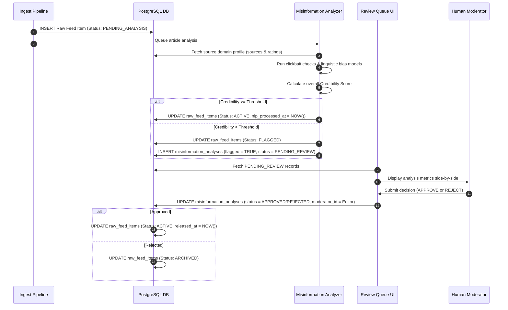
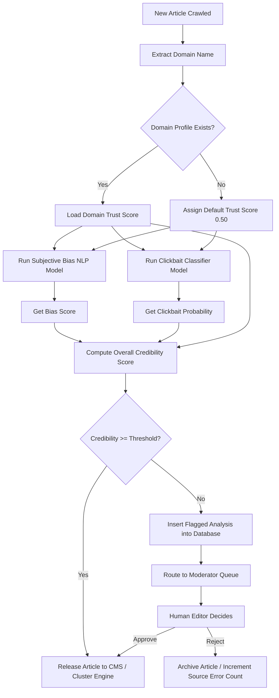

# Misinformation Detection and Bias Analysis

## Purpose
The purpose of the Misinformation Detection and Bias Analysis engine is to safeguard the publishing feed against clickbait, highly biased or hyper-partisan narratives, factual inaccuracies, and malicious misinformation. This component performs automated linguistic and structural screenings on ingested content, aggregates reliability metrics for source domains, and routes suspicious articles through a mandatory Human-in-the-Loop (HITL) moderation process before they are processed by down-stream publishing pipelines.

## Executive Summary
Maintaining editorial credibility is vital. The Misinformation Detection system acts as an analytical gateway. It processes ingested raw feed items through three specialized sub-processors:
1. **Linguistic Bias Analyzer**: Detects loaded wording, emotional manipulation, and subjective adjectives.
2. **Clickbait Screener**: Examines title structures for curiosity gaps, sensationalized punctuation, and exaggerated claims.
3. **Source Reliability Evaluator**: Cross-references source domains against an internal database of historical accuracy and bias classifications.
If the combined analysis scores fall below configured thresholds, the system flags the article and halts downstream clustering and summary operations, placing the content into a moderation dashboard for human editor review.

## Vision
Our vision is to build an automated, transparent content grading firewall. NewsOps Cloud will allow publishers to define granular guidelines regarding bias, accuracy, and clickbait, filtering out unreliable sources and clickbait headlines at ingestion time. This ensures that only high-quality, verified journalistic information is presented to editors and disseminated to consumers.

## Scope
This document covers:
- Algorithms and thresholds for scoring clickbait and linguistic bias.
- Database design for source reliability ratings and individual article assessments.
- Endpoints and request/response structures for analytical ingestion.
- The human-in-the-loop review queue and manual editorial override workflows.
- Performance SLAs, Prometheus metrics, and error code structures.

It does not cover deep-fake image or video generation detection, which is handled in the media pipeline modules.

## Goals
- Screen all incoming titles for clickbait within 50ms of ingestion.
- Flag linguistic bias and subjective tone with a precision score of >= 88%.
- Process a minimum of 200 raw articles per second through the screening pipeline.
- Maintain a zero-bypass policy: any article from an "untrusted" or "satirical" domain must be routed to the moderation queue.

## Functional Requirements
- **Linguistic Bias Screening**: The system must evaluate article bodies and assign a score indicating subjectivity versus objective reporting.
- **Clickbait Title Checks**: The system must analyze headline syntax (e.g., all-caps, multiple exclamation points, curiosity loops like "You won't believe what...") and assign a Clickbait Probability.
- **Source Reliability Score Check**: The system must lookup the historical reliability rating of the publishing domain, incorporating past corrections, retraction rates, and political bias leanings.
- **Combined Credibility Scoring**: The system must compile bias, clickbait, and source ratings into a single, weighted Credibility Score (0.00 to 1.00).
- **Human Moderation Loop**: Articles with a Credibility Score below the organization's threshold must be locked and placed in an editorial moderation queue.
- **Source Blocking / Whitelisting**: Administrators must be able to globally ban or whitelist source domains.

## Non-Functional Requirements
- **Low Latency Analyzers**: Inference latency for linguistic screening must not exceed 200ms per article using local transformer model adapters.
- **No Ingestion Lockups**: Ingestion queues must buffer incoming raw articles using Redis streams, preventing analysis delays from blocking incoming feed harvesting.
- **Tenant Isolation**: Organizations must be able to configure their own custom credibility and clickbait threshold limits.

## Business Rules
1. A raw feed item must be assessed for misinformation prior to becoming eligible for topic clustering or automated summarization.
2. If an article belongs to a domain classified as `PROPAGANDA`, `SATIRE`, or `CONSPIRACY`, it is flagged for moderation automatically, regardless of individual article scoring.
3. The moderation status transitions are strictly linear: `PENDING_REVIEW` -> `APPROVED` or `REJECTED`.
4. Approved articles from the queue are immediately forwarded to the topic clustering engine, while rejected articles are archived.

## Actors
- **Classifier Daemon**: ML model runner that computes bias, clickbait, and semantic sentiment scores.
- **Ingestion pipeline**: Orchestrates the flow of articles through the classifiers.
- **News Editor / Moderator**: Human operator who reviews flagged articles and makes final decisions.
- **System Administrator**: Configures source reliability ratings and organization-level thresholds.

## User Stories
1. **As a News Editor**, I want the system to flag clickbait titles like "Ten Secrets Apple Doesn't Want You to Know" so that I can rewrite them into professional, objective headlines before they are published.
2. **As an Ingestion Pipeline Manager**, I want the system to lookup the source reliability rating of every new feed RSS endpoint, so that articles from known low-factuality web sites are isolated from our automated feed clustering.
3. **As a Platform Administrator**, I want to define separate tolerance thresholds for different publishing teams, so that a financial desk can require a 0.90 credibility score while a sports/entertainment desk can allow a 0.50 score.

## Acceptance Criteria
1. Clickbait headlines containing sensationalized patterns must be flagged with a probability rating of >= 0.85.
2. The overall credibility score must be calculated using the weighted formula: `(0.4 * Source Reliability) + (0.3 * (1 - Bias Score)) + (0.3 * (1 - Clickbait Probability))`.
3. Flags must restrict the raw feed item from appearing in the main `clusters` database views.
4. Editorial decisions in the moderation queue must be processed and applied to the database within 100ms.

## Workflows

### 1. Ingestion and Misinformation Analysis Flow
- **Ingest**: The crawler service inserts a raw feed item.
- **Queue**: A Redis event triggers the Misinformation Analyzer.
- **Linguistic Scans**: The engine calls the local NLP classifier to measure lexical subjectivity, tone bias, and clickbait probability.
- **Domain Check**: The engine fetches the domain profile from `source_reliability_ratings`.
- **Score Calculation**: The engine combines the sub-scores into an overall Credibility Score.
- **Action**:
  - If the score is above the organization threshold, the item is updated with `nlp_processed_at` and released.
  - If the score is below the threshold, the item is flagged, a record is added to `misinformation_analyses`, and the raw item status is set to `FLAGGED`.

### 2. Editorial Review Queue Flow
- **Display**: The Moderator opens the moderation queue UI, viewing flagged raw items sorted by urgency or ingest time.
- **Details**: Clicking an item displays the title, body, and details of the analysis (e.g., Clickbait probability, subjective sentence highlights).
- **Decision**: The Moderator selects "Approve Content" (releasing it into the general stream) or "Reject & Archive" (archiving the record).
- **Update**: The DB changes the record's status, updates the moderator audit columns, and proceeds.



## API Design

### POST /api/v1/intelligence/moderation/assess
Runs a manual or test evaluation of a snippet or article for bias, clickbait, and reliability.
- **Request Headers**:
  - `Authorization: Bearer <JWT>`
  - `Content-Type: application/json`
- **Request Payload**:
  ```json
  {
    "title": "Shocking News: Massive Tech Company Secretly Admits Complete Defeat!",
    "content": "Insiders claim that the leadership has given up entirely, which is just typical of their incompetent managers.",
    "sourceDomain": "clickbaitsite.com"
  }
  ```
- **Response Payload (200 OK)**:
  ```json
  {
    "analysis": {
      "clickbaitProbability": 0.9450,
      "linguisticBiasScore": 0.8200,
      "subjectiveSentences": [
        "which is just typical of their incompetent managers"
      ],
      "sourceDomain": "clickbaitsite.com",
      "sourceReliabilityRating": 0.2000,
      "sourceBiasClassification": "RIGHT_CONSPIRACY",
      "overallCredibilityScore": 0.1585,
      "actionRequired": "FLAG_FOR_REVIEW"
    }
  }
  ```

### GET /api/v1/intelligence/moderation/queue
Fetches active pending moderation items.
- **Request Headers**:
  - `Authorization: Bearer <JWT>`
- **Request Query Parameters**:
  - `limit`: 10
  - `offset`: 0
- **Response Payload (200 OK)**:
  ```json
  {
    "items": [
      {
        "analysisId": "msa_882910111",
        "rawFeedItemId": "itm_33829172",
        "title": "Ten secrets your doctor doesn't want you to know about generic pills",
        "ingestedAt": "2026-06-27T22:30:00Z",
        "clickbaitProbability": 0.8900,
        "linguisticBiasScore": 0.6500,
        "overallCredibilityScore": 0.3800,
        "flaggedReason": "Title classified as clickbait (0.89), low credibility score (0.38)"
      }
    ],
    "totalCount": 1
  }
  ```

### POST /api/v1/intelligence/moderation/queue/{id}/resolve
Resolves a pending review.
- **Request Headers**:
  - `Authorization: Bearer <JWT>`
  - `Content-Type: application/json`
- **Request Payload**:
  ```json
  {
    "decision": "APPROVED",
    "notes": "Title was verified. Factual elements are correct, although headline is slightly sensationalized. Allowed post.",
    "headlineOverride": "The benefits and differences of generic prescription medications"
  }
  ```
- **Response Payload (200 OK)**:
  ```json
  {
    "analysisId": "msa_882910111",
    "status": "APPROVED",
    "resolvedBy": "usr_992817234",
    "resolvedAt": "2026-06-27T22:40:00Z",
    "headlinePublished": "The benefits and differences of generic prescription medications"
  }
  ```

## Database Design

### Prisma Schema
```prisma
datasource db {
  provider = "postgresql"
  url      = env("DATABASE_URL")
}

enum BiasAlignment {
  LEFT
  LEAN_LEFT
  CENTER
  LEAN_RIGHT
  RIGHT
  SATIRE
  CONSPIRACY
  PROPAGANDA
}

enum FactualityRating {
  VERY_HIGH
  HIGH
  MIXED
  LOW
  VERY_LOW
}

enum ModerationStatus {
  PENDING_REVIEW
  APPROVED
  REJECTED
}

model SourceReliabilityRating {
  id                String           @id @default(dbgenerated("concat('srr_', replace(gen_random_uuid()::text, '-', ''))")) @db.VarChar(50)
  domain            String           @unique @db.VarChar(255)
  biasAlignment     BiasAlignment    @map("bias_alignment")
  factualityRating  FactualityRating @map("factuality_rating")
  trustScore        Decimal          @map("trust_score") @db.Decimal(5, 4)
  notes             String?          @db.Text
  lastUpdatedAt     DateTime         @default(now()) @map("last_updated_at")

  @@index([domain])
  @@index([trustScore])
  @@map("source_reliability_ratings")
}

model MisinformationAnalysis {
  id                    String           @id @default(dbgenerated("concat('msa_', replace(gen_random_uuid()::text, '-', ''))")) @db.VarChar(50)
  rawFeedItemId         String           @unique @map("raw_feed_item_id") @db.VarChar(50)
  clickbaitProbability  Decimal          @map("clickbait_probability") @db.Decimal(5, 4)
  linguisticBiasScore   Decimal          @map("linguistic_bias_score") @db.Decimal(5, 4)
  sensationalismScore   Decimal          @map("sensationalism_score") @db.Decimal(5, 4)
  credibilityScore      Decimal          @map("credibility_score") @db.Decimal(5, 4)
  flagged               Boolean          @default(false)
  status                ModerationStatus @default(PENDING_REVIEW)
  moderatorNotes        String?          @map("moderator_notes") @db.Text
  moderatedBy           String?          @map("moderated_by") @db.VarChar(100)
  moderatedAt           DateTime?        @map("moderated_at")
  createdAt             DateTime         @default(now()) @map("created_at")

  rawFeedItem           RawFeedItem      @relation(fields: [rawFeedItemId], references: [id], onDelete: Cascade)

  @@index([status])
  @@index([createdAt])
  @@map("misinformation_analyses")
}

// Reference from news_intelligence_schema
model RawFeedItem {
  id            String                  @id @db.VarChar(50)
  analysis      MisinformationAnalysis?
}
```

### PostgreSQL DDL
```sql
CREATE TYPE bias_alignment AS ENUM ('LEFT', 'LEAN_LEFT', 'CENTER', 'LEAN_RIGHT', 'RIGHT', 'SATIRE', 'CONSPIRACY', 'PROPAGANDA');
CREATE TYPE factuality_rating AS ENUM ('VERY_HIGH', 'HIGH', 'MIXED', 'LOW', 'VERY_LOW');
CREATE TYPE moderation_status AS ENUM ('PENDING_REVIEW', 'APPROVED', 'REJECTED');

-- Source Reliability Database (Standardized trust lookup per site)
CREATE TABLE source_reliability_ratings (
    id VARCHAR(50) PRIMARY KEY DEFAULT concat('srr_', replace(gen_random_uuid()::text, '-', '')),
    domain VARCHAR(255) UNIQUE NOT NULL,
    bias_alignment bias_alignment NOT NULL,
    factuality_rating factuality_rating NOT NULL,
    trust_score DECIMAL(5,4) NOT NULL CHECK (trust_score >= 0.0000 AND trust_score <= 1.0000),
    notes TEXT,
    last_updated_at TIMESTAMP WITH TIME ZONE NOT NULL DEFAULT NOW()
);

CREATE INDEX idx_ratings_domain ON source_reliability_ratings(domain);
CREATE INDEX idx_ratings_score ON source_reliability_ratings(trust_score);

-- Misinformation Analysis Results per Ingested Article
CREATE TABLE misinformation_analyses (
    id VARCHAR(50) PRIMARY KEY DEFAULT concat('msa_', replace(gen_random_uuid()::text, '-', '')),
    raw_feed_item_id VARCHAR(50) UNIQUE NOT NULL REFERENCES raw_feed_items(id) ON DELETE CASCADE,
    clickbait_probability DECIMAL(5,4) NOT NULL CHECK (clickbait_probability >= 0.0000 AND clickbait_probability <= 1.0000),
    linguistic_bias_score DECIMAL(5,4) NOT NULL CHECK (linguistic_bias_score >= 0.0000 AND linguistic_bias_score <= 1.0000),
    sensationalism_score DECIMAL(5,4) NOT NULL CHECK (sensationalism_score >= 0.0000 AND sensationalism_score <= 1.0000),
    credibility_score DECIMAL(5,4) NOT NULL CHECK (credibility_score >= 0.0000 AND credibility_score <= 1.0000),
    flagged BOOLEAN NOT NULL DEFAULT FALSE,
    status moderation_status NOT NULL DEFAULT 'PENDING_REVIEW',
    moderator_notes TEXT,
    moderated_by VARCHAR(100),
    moderated_at TIMESTAMP WITH TIME ZONE,
    created_at TIMESTAMP WITH TIME ZONE NOT NULL DEFAULT NOW()
);

CREATE INDEX idx_analyses_status ON misinformation_analyses(status);
CREATE INDEX idx_analyses_created ON misinformation_analyses(created_at);
```

## UI Design
- **Editorial Moderation Queue**: Layout split into two columns. Left column contains a list of cards for flagged articles (showing domain, title, credibility score, and specific flag type). Right column displays the selected article's body with high-bias words colored in yellow, metadata indicators, and a clean control bar at the bottom containing options to "Approve Content", "Edit Title & Approve", or "Reject & Blacklist".
- **Domain Trust Configurator**: Admin grid showing domains list with editable fields for trust scores, bias alignments, factuality scores, and buttons to blacklist domains.

## Permissions
- `intelligence:moderation:read` - Allows viewing moderation queues and domain ratings.
- `intelligence:moderation:write` - Allows approving/rejecting articles, editing titles, adding reviewer notes.
- `intelligence:moderation:admin` - Add or update source domains in `source_reliability_ratings`.

## Security
- **Strict JWT Role Verification**: Enforce that the active user contains `news:moderator` or `system:admin` scopes to submit state transitions.
- **CSRF Mitigation**: Double Submit Cookie and Origin header checks enforced on resolving API endpoints.
- **Input Sanitization**: Content override changes must pass through an HTML entity escaping pipeline to prevent XSS payloads in CMS databases.

## Performance
- **Classifier Throughput**: local model inference optimized using TensorRT to maintain a target throughput of 200 items/second.
- **Database Query Performance**: Indexing on `misinformation_analyses.status` and `source_reliability_ratings.domain` guarantees lookup latencies under 5ms.

## Monitoring
- `newsops_misinfo_scanned_articles_total`: Counter tracking total processed articles.
- `newsops_misinfo_flagged_articles_total`: Counter tracking articles flagged for review by category (bias, clickbait, untrusted_domain).
- `newsops_misinfo_resolution_duration_seconds`: Histogram measuring human moderation response times.
- **Alert Trigger**: Trigger email/Slack alert if the length of the pending review queue exceeds 150 items.

## Logging
- **Log Format**: JSON structure.
- **Levels**: INFO for routine assessments, WARN for articles flagged with extreme clickbait or bias values, ERROR for ML model inference failure.
- **Log Context Example**:
  ```json
  {
    "timestamp": "2026-06-27T22:42:15.112Z",
    "level": "WARN",
    "context": "newsops-moderation-engine",
    "raw_feed_item_id": "itm_33829172",
    "domain": "clickbaitsite.com",
    "clickbait_probability": 0.89,
    "credibility_score": 0.38,
    "message": "Article flagged for moderation: clickbait headline detected and domain has mixed factuality rating."
  }
  ```

## Error Handling
- `QUEUE_EMPTY`: Code 204. No content. "There are no pending items in the moderation queue."
- `ALREADY_MODERATED`: Code 409. HTTP Status 409. "This article has already been approved or rejected by another moderator."
- `DOMAIN_PROFILE_EXISTS`: Code 409. HTTP Status 409. "A rating configuration profile for this domain already exists."

## Edge Cases
- **Domain Spoofing**: Content aggregator domains mapping (e.g., using medium.com/user). The system resolves reliability checks at the subdomain or author level if path-specific rules are defined in the schema metrics.
- **Sarcasm/Satire Feeds**: Outlets like "The Onion" matching typical clickbait patterns. The system addresses this by matching the domain profile directly and bypasses ML evaluations, immediately marking them as `SATIRE` and routing them to the queue for checking.

## Future Improvements
- **Automated Headline De-sensationalization**: Implementing a fine-tuned GPT/Llama model that automatically generates clean, objective rewrite proposals for flagged clickbait titles.
- **Adversarial Network Analysis**: Detecting coordinate bot distributions on social channels to dynamically adjust source reliability levels.

## Mermaid Diagrams

### Ingestion Moderation Pipeline


## References
- [News Intelligence Schema](../03-database/news_intelligence_schema.md)
- [Fact Consistency and Verification](./fact_consistency.md)
- [AI Moderation and Safety](../04-ai/ai_moderation_safety.md)
- [System Architecture](../02-architecture/system_architecture.md)
