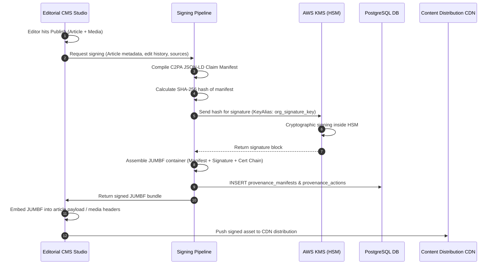
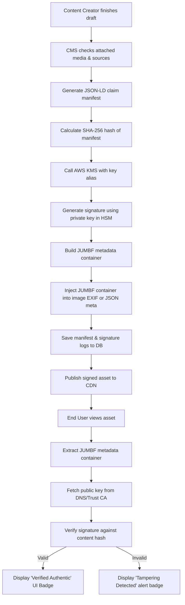

# Content Provenance and Cryptographic Attribution

## Purpose
The purpose of the Content Provenance and Cryptographic Attribution system is to establish a secure, auditable, and cryptographically verified supply chain for all news stories and media assets. By implementing the C2PA (Coalition for Content Provenance and Authenticity) standards, the system generates cryptographically signed manifests that document content origin, edit histories, AI model contributions, and human validation steps, protecting publications from plagiarism, impersonation, and untrusted modifications.

## Executive Summary
In an era of deepfakes and automated text generation, verifying news credibility is critical. This component provides the infrastructure to cryptographically sign digital assets (text articles, images, video) at the time of publication. It builds a C2PA-compliant manifest (JUMBF metadata block) that details who created the content, what AI tools or human editors modified it, and which source articles influenced it. The manifests are signed using private keys stored in hardware security modules (HSM) or secure cloud key management services (AWS KMS) and written to an attribution database for public verification.

## Vision
Our vision is to build an open, verifiable trust loop for digital news. By embedding cryptographic authenticity manifests directly into media assets and article distribution feeds, NewsOps Cloud enables search engines, social platforms, and end readers to verify the lineage of any publication, confirming the exact chain of human and AI actions that led to the final output.

## Scope
This document covers:
- Verification of content lineage and source attribution mapping.
- Standard compliance layouts for C2PA cryptographic manifests.
- Cryptographic signing pipelines backed by AWS KMS or HSM systems.
- JUMBF metadata injection and extraction mechanisms for text and image files.
- API payloads, database designs, permission matrices, and security protocols.

It does not cover public blockchain ledger integrations or PKI root certificate authority creation.

## Goals
- Sign and inject C2PA manifests into media assets in under 500ms.
- Ensure 100% compliance with C2PA/CAI (Content Authenticity Initiative) standards.
- Record and verify up to 500 asset attribution queries per second.
- Protect editorial private keys from leakage using FIPS 140-2 Level 3 HSMs.

## Functional Requirements
- **Manifest Compilation**: The system must assemble article metadata, editor identities, AI usage statistics, and source references into a standardized JSON-LD claim dictionary.
- **Cryptographic Signing Pipeline**: The system must pass the manifest hash to a secure HSM or KMS to generate a digital signature using an approved algorithm (e.g., ECDSA P-256).
- **Metadata Binding**: The signing pipeline must format the signature and manifest into a JUMBF (ISO/IEC 19566-5) container and embed it directly into the published asset (e.g., JPEG/PNG EXIF data, MP4 metadata, or JSON payloads for articles).
- **Lineage Reconstruction**: The system must query and display the origin graph (attribution path) of any published article, linking it to the source raw feed items.
- **Verification Engine**: The system must provide public APIs to parse uploaded assets, verify their signatures against known certificate roots, and display the edit history.

## Non-Functional Requirements
- **Key Security**: Signing keys must never be exposed in plaintext to the application memory. All signing must occur inside HSM/KMS environments.
- **Performance**: Cryptographic verification of incoming third-party assets must execute within 200ms.
- **High Availability**: The signing pipeline must utilize multi-region key aliases to survive cloud provider failures.

## Business Rules
1. Any article created, modified, or summarized using generative AI must explicitly list the model version and parameters in its provenance manifest under the `AI_GENERATED` or `AI_ASSISTED` action type.
2. Injected manifests cannot be edited after publication; any revision to an article requires generating a new manifest that references the previous manifest's hash as a parent (forming a hash chain).
3. Public verification keys must be published via standard DNSSEC-signed TXT records or trusted HTTPS endpoints.

## Actors
- **CMS Editor**: Human journalist or editor who writes, edits, and publishes content.
- **AI Router**: Orchestration worker that records AI-based modifications to the draft.
- **Signing Service**: Secure service that coordinates manifest generation and signs the data.
- **External Consumer / Platform**: Social media networks or readers who run cryptographic checks on the published items.

## User Stories
1. **As a News Journalist**, I want my articles to be cryptographically signed under my organization's name, so that if my article is plagiarized or modified, the public can verify the original source text.
2. **As an AI Assistant Engine**, I want to automatically inject a claim record listing the LLM model used to translate a story, so that we comply with transparency standards.
3. **As an End Reader**, I want to click a "Verify Content" badge on an article page to see the exact edit history, including the author, publication date, and any images that were verified as authentic.

## Acceptance Criteria
1. Generated JUMBF manifests must pass validation using the official C2PA command-line verification tool without errors.
2. Signature execution times utilizing KMS aliases must average under 120ms.
3. The attribution database must block publication if a signature verification check fails on a draft containing third-party media assets.
4. Cryptographic manifests must utilize X.509 certificates chained back to a recognized Content Authenticity Initiative root CA.

## Workflows

### 1. Publication Signing Pipeline
- **Publish Trigger**: An editor clicks "Publish" on a completed CMS article.
- **Manifest Assembly**: The CMS collects authorship, edit logs, AI history, and source references, formatting them into a standard C2PA claim structure.
- **Hashing**: The system hashes the claim.
- **Signing**: The system calls the AWS KMS API (`Sign` action) with the hash. KMS signs it using the organization's private key.
- **JUMBF Binding**: The Signing Service wraps the claim and signature into a JUMBF block, embeds it in the asset, and writes the reference metadata to the `provenance_manifests` table.
- **Syndication**: The signed asset is dispatched to public CDNs and APIs.

### 2. Public Verification Workflow
- **Upload**: A reader uploads an image or submits an article URL to the verification portal.
- **Parsing**: The portal extracts the embedded JUMBF container from the asset.
- **Signature Check**: The portal fetches the signing certificate chain from the manifest and verifies the signature using the issuer's public key.
- **Lineage Render**: The portal checks the internal database or the manifest list, displaying a visual timeline of the asset's creation, edits, and sources.



## API Design

### POST /api/v1/provenance/sign-manifest
Generates and signs a C2PA-compliant manifest for an article or media asset.
- **Request Headers**:
  - `Authorization: Bearer <JWT>`
  - `Content-Type: application/json`
- **Request Payload**:
  ```json
  {
    "assetId": "art_882910111",
    "assetType": "ARTICLE",
    "creator": {
      "name": "Jane Doe",
      "identifier": "usr_992817234"
    },
    "actions": [
      {
        "action": "c2pa.created",
        "softwareAgent": "NewsOps CMS v2.1.0",
        "timestamp": "2026-06-27T22:30:00Z"
      },
      {
        "action": "c2pa.edited",
        "softwareAgent": "Llama 3.1 70B translation",
        "timestamp": "2026-06-27T22:45:00Z",
        "description": "Translated body text from Japanese to English."
      }
    ],
    "sources": [
      {
        "relationship": "derivedfrom",
        "sourceId": "itm_33829172",
        "description": "Primary news release from local authorities."
      }
    ]
  }
  ```
- **Response Payload (201 Created)**:
  ```json
  {
    "manifestId": "pmf_992817364",
    "assetId": "art_882910111",
    "status": "SIGNED",
    "jumbfBase64": "Gk9QSwUGAAAAAAAAAAAAAAAAc2lnbmVkLW1hbmlmZXN0L...",
    "signatureAlgorithm": "ecdsa-p256-sha256",
    "kmsKeyArn": "arn:aws:kms:us-east-1:123456789012:key/12345678-1234-1234-1234-123456789012",
    "createdAt": "2026-06-27T22:50:00Z"
  }
  ```

### POST /api/v1/provenance/verify-asset
Verifies the cryptographic signatures and integrity of an uploaded asset file or raw manifest payload.
- **Request Headers**:
  - `Authorization: Bearer <JWT>`
  - `Content-Type: multipart/form-data`
- **Request Payload**:
  *(Multipart file payload containing target JPG/PNG/MP4 or PDF file)*
- **Response Payload (200 OK)**:
  ```json
  {
    "verified": true,
    "signatureStatus": "VALID",
    "signer": {
      "organization": "NewsOps Media Group LLC",
      "commonName": "newsops.cloud",
      "certificateAuthority": "DigiCert trusted CA",
      "validFrom": "2026-01-01T00:00:00Z",
      "validTo": "2027-01-01T00:00:00Z"
    },
    "history": [
      {
        "action": "c2pa.created",
        "timestamp": "2026-06-27T22:30:00Z",
        "actor": "Jane Doe (usr_992817234)"
      },
      {
        "action": "c2pa.edited",
        "timestamp": "2026-06-27T22:45:00Z",
        "actor": "AI translation (Llama 3.1)"
      }
    ],
    "tampered": false
  }
  ```

## Database Design

### Prisma Schema
```prisma
datasource db {
  provider = "postgresql"
  url      = env("DATABASE_URL")
}

enum ProvenanceActionType {
  CREATE
  EDIT
  TRANSLATE
  AI_GENERATED
  AI_ASSISTED
  MERGE
  REDACT
}

model ProvenanceManifest {
  id                  String             @id @default(dbgenerated("concat('pmf_', replace(gen_random_uuid()::text, '-', ''))")) @db.VarChar(50)
  assetId             String             @map("asset_id") @db.VarChar(50)
  manifestHash        String             @map("manifest_hash") @db.VarChar(64)
  jumbfData           Bytes              @map("jumbf_data")
  signature           Bytes
  kmsKeyArn           String             @map("kms_key_arn") @db.VarChar(255)
  certificateChain    String             @map("certificate_chain") @db.Text
  algorithm           String             @db.VarChar(50)
  createdAt           DateTime           @default(now()) @map("created_at")

  actions             ProvenanceAction[]
  attributions        AttributionRecord[]

  @@index([assetId])
  @@index([manifestHash])
  @@map("provenance_manifests")
}

model ProvenanceAction {
  id                  String               @id @default(dbgenerated("concat('pva_', replace(gen_random_uuid()::text, '-', ''))")) @db.VarChar(50)
  manifestId          String               @map("manifest_id") @db.VarChar(50)
  actionType          ProvenanceActionType @map("action_type")
  actorType           String               @map("actor_type") @db.VarChar(50)
  actorId             String               @map("actor_id") @db.VarChar(50)
  description         String?              @db.VarChar(512)
  timestamp           DateTime             @map("timestamp")

  manifest            ProvenanceManifest   @relation(fields: [manifestId], references: [id], onDelete: Cascade)

  @@index([manifestId])
  @@map("provenance_actions")
}

model AttributionRecord {
  id                  String             @id @default(dbgenerated("concat('atr_', replace(gen_random_uuid()::text, '-', ''))")) @db.VarChar(50)
  manifestId          String             @map("manifest_id") @db.VarChar(50)
  sourceFeedItemId    String             @map("source_feed_item_id") @db.VarChar(50)
  influenceScore      Decimal            @map("influence_score") @db.Decimal(5, 4)
  citationSnippet     String?            @map("citation_snippet") @db.VarChar(1024)
  createdAt           DateTime           @default(now()) @map("created_at")

  manifest            ProvenanceManifest @relation(fields: [manifestId], references: [id], onDelete: Cascade)
  rawFeedItem         RawFeedItem        @relation(fields: [sourceFeedItemId], references: [id])

  @@index([manifestId])
  @@index([sourceFeedItemId])
  @@map("attribution_records")
}

// Reference from news_intelligence_schema
model RawFeedItem {
  id                  String             @id @db.VarChar(50)
  attributions        AttributionRecord[]
}
```

### PostgreSQL DDL
```sql
CREATE TYPE provenance_action_type AS ENUM ('CREATE', 'EDIT', 'TRANSLATE', 'AI_GENERATED', 'AI_ASSISTED', 'MERGE', 'REDACT');

-- Cryptographic Provenance Manifests Table
CREATE TABLE provenance_manifests (
    id VARCHAR(50) PRIMARY KEY DEFAULT concat('pmf_', replace(gen_random_uuid()::text, '-', '')),
    asset_id VARCHAR(50) NOT NULL,
    manifest_hash VARCHAR(64) NOT NULL,
    jumbf_data BYTEA NOT NULL,
    signature BYTEA NOT NULL,
    kms_key_arn VARCHAR(255) NOT NULL,
    certificate_chain TEXT NOT NULL,
    algorithm VARCHAR(50) NOT NULL,
    created_at TIMESTAMP WITH TIME ZONE NOT NULL DEFAULT NOW()
);

CREATE INDEX idx_manifests_asset ON provenance_manifests(asset_id);
CREATE INDEX idx_manifests_hash ON provenance_manifests(manifest_hash);

-- Provenance Actions Log (Edit track history)
CREATE TABLE provenance_actions (
    id VARCHAR(50) PRIMARY KEY DEFAULT concat('pva_', replace(gen_random_uuid()::text, '-', '')),
    manifest_id VARCHAR(50) NOT NULL REFERENCES provenance_manifests(id) ON DELETE CASCADE,
    action_type provenance_action_type NOT NULL,
    actor_type VARCHAR(50) NOT NULL,
    actor_id VARCHAR(50) NOT NULL,
    description VARCHAR(512),
    timestamp TIMESTAMP WITH TIME ZONE NOT NULL
);

CREATE INDEX idx_prov_actions_manifest ON provenance_actions(manifest_id);

-- Attribution Records Table (Tracks sources linked to publication)
CREATE TABLE attribution_records (
    id VARCHAR(50) PRIMARY KEY DEFAULT concat('atr_', replace(gen_random_uuid()::text, '-', '')),
    manifest_id VARCHAR(50) NOT NULL REFERENCES provenance_manifests(id) ON DELETE CASCADE,
    source_feed_item_id VARCHAR(50) NOT NULL REFERENCES raw_feed_items(id) ON DELETE RESTRICT,
    influence_score DECIMAL(5,4) NOT NULL CHECK (influence_score >= 0.0000 AND influence_score <= 1.0000),
    citation_snippet VARCHAR(1024),
    created_at TIMESTAMP WITH TIME ZONE NOT NULL DEFAULT NOW()
);

CREATE INDEX idx_attribution_manifest ON attribution_records(manifest_id);
CREATE INDEX idx_attribution_source ON attribution_records(source_feed_item_id);
```

## UI Design
- **Lineage Verification Inspector Panel**: Drag-and-drop file upload target interface. Uploading an asset renders a clean visual tree diagram of the asset’s history. Shows certificate signature checks as a green badge ("Verified Authentic") or a red badge ("Signature Invalid - Tampering Detected").
- **Asset Attribution Drawer**: CMS sidebar tool displaying the list of verified source articles (representing quotes or data points) along with slide selectors to configure relative influence scores (0-100%).

## Permissions
- `provenance:manifest:create` - Permits compiling manifests and invoking KMS signatures.
- `provenance:manifest:read` - Views signatures, verification results, and history.
- `provenance:keys:admin` - Admin role. Manages KMS AWS ARN configurations and certificate installations.

## Security
- **Secure Key Access Rules**: The microservice executing the signing must run inside an IAM role restricted strictly to `kms:Sign` on the designated key ARN. Decrypt, Encrypt, or Key management calls must be blocked.
- **Replay Protection**: Cryptographic manifests must contain high-resolution millisecond timestamps and unique UUID nonces to prevent replay injections.
- **Certificate Revocation Check**: The verification engine must dynamically validate certificates against Online Certificate Status Protocol (OCSP) responders.

## Performance
- **Low HSM Overhead**: Cache session verification endpoints and pre-fetch intermediate trust certs using Redis to hit <50ms read verifications.
- **Signing Latency**: Ensure total manifest compilation and signature execution runs in under 400ms.

## Monitoring
- `newsops_provenance_signed_assets_total`: Counter tracking total successful signing actions.
- `newsops_provenance_failed_signatures_total`: Counter tracking failures to generate signatures.
- `newsops_provenance_verification_errors_total`: Counter tracking third-party asset validation failures.
- **Alert Trigger**: Trigger immediate high-severity alert if `newsops_provenance_failed_signatures_total` increases by more than 5 in 1 minute, suggesting cloud HSM connectivity loss.

## Logging
- **Log Format**: JSON serialization.
- **Levels**: INFO for routine signing execution, WARN for intermediate certificate expiry warnings, ERROR for signature invalidations.
- **Log Context Example**:
  ```json
  {
    "timestamp": "2026-06-27T22:52:12.802Z",
    "level": "INFO",
    "context": "newsops-provenance-signer",
    "manifest_id": "pmf_992817364",
    "kms_key_arn": "arn:aws:kms:us-east-1:123456789012:key/12345678-...",
    "duration_ms": 115,
    "message": "Asset manifest signed and JUMBF block bound successfully."
  }
  ```

## Error Handling
- `SIGNING_KEY_ACCESS_DENIED`: Code 403. HTTP Status 403. "The signing service is not authorized to access the requested KMS key ARN."
- `TAMPERING_DETECTED`: Code 422. HTTP Status 422. "The manifest signature does not match the content payload. Asset has been modified post-signing."
- `EXPIRED_CERTIFICATE`: Code 400. HTTP Status 400. "The cryptographic certificate chain has expired or is revoked."

## Edge Cases
- **Asset Transcoding (Format Conversion)**: Users converting a signed JPEG to a WebP file, which drops original EXIF blocks. The system mitigates this by maintaining a duplicate manifest store queryable by visual hash (perceptual hashing) of the asset content.
- **Cross-Organization Merges**: Two news organizations collaborating on a joint piece. The pipeline allows appending multiple organization signatures sequentially inside the JUMBF container's signature block.

## Future Improvements
- **Decentralized Attribution Ledgers**: Writing metadata hashes to public decentralized verification directories to guarantee transparency.
- **Hardware-based Camera Attributions**: Direct support for camera manufacturer chip key signatures (Sony/Nikon C2PA native integrations) to verify raw source images directly from the field.

## Mermaid Diagrams

### Cryptographic Lifecycle of Published Media


## References
- [News Intelligence Schema](../03-database/news_intelligence_schema.md)
- [System Architecture](../02-architecture/system_architecture.md)
- [Storage Architecture](../02-architecture/storage_architecture.md)
- [AI Orchestration Layer](../04-ai/ai_orchestration_architecture.md)
