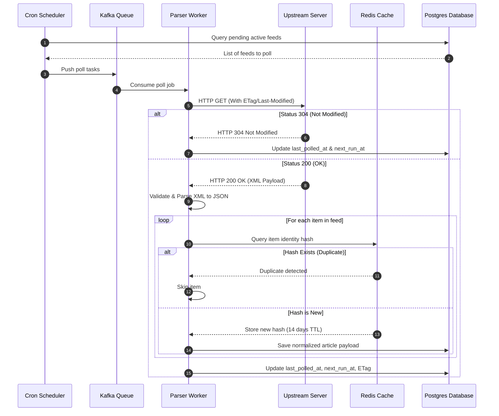

# RSS Monitoring Engine

## Purpose
The RSS Monitoring Engine is the high-frequency syndication feed ingestion service of NewsOps Cloud. Its primary purpose is to poll, parse, and normalize RSS, Atom, and Media RSS feeds configured by tenant organizations. It monitors updates in real-time, extracts metadata, prevents duplicate story ingestion, and exposes a diagnostic health dashboard for feed operations.

## Executive Summary
The RSS Monitoring Engine uses a decoupled, event-driven architecture designed to process thousands of feeds concurrently. A centralized scheduler puts feed polling jobs onto a Kafka queue. Light-weight parser workers consume these jobs, fetch the target feed XML while respecting HTTP cache headers (ETag, Last-Modified) to minimize network overhead, and parse the XML into a standardized JSON payload. It employs cryptographic hash generation on the feed items' unique properties to filter out previously seen articles at the ingestion gateway before sending the normalized content to the central News Intelligence database.

```
+------------------+     Produces Job     +----------------+
|  Feed Scheduler  | -------------------> | Kafka Poll Job |
+------------------+                      +----------------+
                                                  |
                                                  v
+------------------+     XML Payload      +----------------+
|    Target Web    | <------------------- | Parser Workers |
|   Server / Feed  | -------------------> |  (Kubernetes)  |
+------------------+                      +----------------+
                                                  |
                                                  v
                                          +----------------+
                                          | Duplicate Hash |
                                          |     Check      |
                                          +----------------+
                                                  |
                                                  v
                                          +----------------+
                                          | Postgres / LSH |
                                          +----------------+
```

## Vision
To provide tenant newsrooms with an instantaneous external source aggregator that processes breaking news feeds with latency under 60 seconds from original feed update, while protecting the system against malicious XML payloads, server timeouts, and redundant data storage.

## Scope
- **Job Scheduling**: Central cron scheduler mapping tenant-configured polling intervals.
- **Worker Execution**: Node.js/Go-based parser instances reading from Kafka queues.
- **XML Tag Extraction**: Modular mapping support for RSS 0.9x, RSS 2.0, Atom, Dublin Core (`dc:`), and Media RSS (`media:`).
- **Duplicate Prevention**: In-memory and index-level checks utilizing SHA-256 signatures of item identifiers.
- **Dashboard API**: Telemetry endpoints that track feed status, failure rates, and parsing logs.

## Goals
- **Polling Latency**: Support ultra-high polling frequencies up to 1-minute intervals for premium feeds.
- **Bandwidth Efficiency**: Achieve a 60% reduction in bandwidth consumption by supporting HTTP 304 (Not Modified) responses via ETags and Last-Modified header checks.
- **No Ingestion Loss**: Ensure zero dropped updates during high-frequency events by decoupling fetches from DB writes via message queues.
- **Resilient Tag Extraction**: Maintain parsing rate above 99.9% across legacy, malformed, or heavily customized feed structures.

## Functional Requirements
- **FR-2.1**: The scheduler must distribute feed polling tasks across Kafka partitions based on tenant ID to maintain fair usage.
- **FR-2.2**: The parser workers must validate and parse RSS 1.0/2.0, Atom 1.0, and Media RSS formats, and extract custom namespaces such as `dc:creator` and `content:encoded`.
- **FR-2.3**: The system must extract the following data fields from every feed item: GUID, Title, Link, Description, Full Text Content, Author, Publication Date, and Media Thumbnail URLs.
- **FR-2.4**: The system must use the item's GUID as the primary duplicate prevention key. If GUID is not present, the system must generate a deterministic SHA-256 hash using the concatenated string of the title, description, and link.
- **FR-2.5**: The system must record and update the HTTP ETag and Last-Modified timestamps for each feed source to enable conditional GET requests.
- **FR-2.6**: The dashboard must track feed health scores (0-100) based on successful vs. failed poll executions over the last 48 hours.

## Non-Functional Requirements
- **NFR-3.1 (Throughput)**: The parsing workers must scale to process up to 10,000 feed polls per minute.
- **NFR-3.2 (Resource Usage)**: Individual parser instances must limit memory allocation to 128MB RAM to optimize infrastructure costs.
- **NFR-3.3 (Availability)**: The system must run in a multi-region deployment, ensuring that scheduler failures failover within 10 seconds.
- **NFR-3.4 (Security)**: The parser must disable XML External Entity (XXE) resolution and external DTD (Document Type Definition) loading to prevent server-side request forgery (SSRF) and file access attacks.

## Business Rules
- **BR-4.1**: Feeds belonging to Basic Tier tenants are restricted to a minimum polling interval of 15 minutes. Premium Tier tenants can configure 1-minute polling.
- **BR-4.2**: If a feed fails to respond with a successful 2xx status code for 24 consecutive hours, it must be automatically marked as `Disabled`.
- **BR-4.3**: Crawling and RSS polling must honor HTTP `Retry-After` headers if returned during an upstream rate limit (HTTP 429).
- **BR-4.4**: Ingested feed items must be stored for a minimum of 14 days to prevent duplicates, even if deleted or archived in the primary CMS.

## Actors
- **RSS Worker Daemon**: The internal background actor that polls RSS URLs and parses XML.
- **Content Editor**: Configures feed targets and views incoming items.
- **DevOps Engineer**: Monitors feed queues and worker resource consumption.
- **Tenant Administrator**: Controls feed subscription tiers and sets system polling limits.

## User Stories
- **US-5.1**: As a Content Editor, I want to add an RSS feed URL that uses Dublin Core metadata, so that I can see the author's real name instead of just a generic publisher tag.
- **US-5.2**: As a DevOps Engineer, I want the RSS monitoring engine to skip fetching feed contents when the server returns HTTP 304, so that we minimize egress cost and CPU utilization.
- **US-5.3**: As a Content Editor, I want to inspect a feed's health status in the UI to see the exact HTTP response code and error message when a feed fails to import.

## Acceptance Criteria
- **AC-6.1**: The system must reject XML payloads larger than 10MB to prevent decompression bomb attacks (e.g., entity expansion attacks).
- **AC-6.2**: The duplicate checker must reject incoming items if their GUID already exists in the `rss_feed_items` database table for the associated feed ID.
- **AC-6.3**: When an RSS poll results in an HTTP 304 Not Modified response, the system must immediately complete the task without database updates or parsing workflows.
- **AC-6.4**: The system must resolve hostnames against a private IP blacklist (e.g., blocking `127.0.0.1`, `169.254.169.254`, `10.0.0.0/8`) before performing the HTTP request, preventing local network scanning.

## Workflows
1. **Feed Task Dispatch**:
   - The scheduler queries `rss_feeds` every 30 seconds for feeds where `next_run_at <= NOW()`.
   - For each matching feed, a poll job payload is sent to the `rss-poll-jobs` Kafka topic.
2. **Fetch and HTTP Header Negotiation**:
   - The parser worker consumes a job, resolves the DNS, and verifies it is public.
   - It constructs an HTTP GET request including `If-None-Match` (with stored ETag) and `If-Modified-Since` (with stored Last-Modified time) headers.
   - If the server returns HTTP 304, the worker updates `last_polled_at` and exits.
   - If the server returns HTTP 200, the worker reads the response body stream.
3. **XML Parsing and Tag Mapping**:
   - The worker parses the XML payload using a sandboxed parser.
   - It loops through `<item>` (RSS) or `<entry>` (Atom) tags.
   - Standard elements (title, link, description, pubDate) are extracted.
   - Custom tags are extracted if namespace configurations exist (e.g. `<media:content url="...">`).
4. **Duplicate Verification**:
   - The worker calculates the identity fingerprint for each item.
   - It queries a Redis cache containing the last 14 days of keys.
   - If the key exists, the item is skipped.
   - If the key is new, the normalized JSON payload is stored in the PostgreSQL database and an ingestion event is sent to Kafka.
5. **Scheduler Update**:
   - The database status of the feed is updated (updates ETag, Last-Modified, resets error count, recalculates `next_run_at`).

## API Design

### 1. Register a Monitored RSS Feed
- **Endpoint**: `POST /api/v1/rss/feeds`
- **Request Payload**:
```json
{
  "name": "TechCrunch Startups",
  "url": "https://techcrunch.com/category/startups/feed/",
  "pollingIntervalMinutes": 10,
  "namespaces": {
    "media": "http://search.yahoo.com/mrss/",
    "dc": "http://purl.org/dc/elements/1.1/"
  },
  "customMappings": {
    "author": "dc:creator",
    "thumbnailUrl": "media:thumbnail@url"
  }
}
```
- **Response Payload (201 Created)**:
```json
{
  "feedId": "feed_rss_77a8b9c0d1e2",
  "status": "active",
  "healthScore": 100,
  "nextRunAt": "2026-06-27T17:10:00Z"
}
```

### 2. Force Immediate Feed Sync / Diagnostic Run
- **Endpoint**: `POST /api/v1/rss/feeds/feed_rss_77a8b9c0d1e2/sync`
- **Response Payload (200 OK)**:
```json
{
  "feedId": "feed_rss_77a8b9c0d1e2",
  "status": "success",
  "itemsFound": 25,
  "itemsIngested": 3,
  "itemsSkipped": 22,
  "executionTimeMs": 412,
  "httpStatus": 200,
  "etag": "\"w/39b-123456789\"",
  "lastModified": "Sat, 27 Jun 2026 16:55:00 GMT"
}
```

### 3. Fetch Feed Diagnostics Dashboard Data
- **Endpoint**: `GET /api/v1/rss/feeds/diagnostics`
- **Response Payload (200 OK)**:
```json
{
  "summary": {
    "totalFeeds": 150,
    "activeFeeds": 142,
    "degradedFeeds": 6,
    "disabledFeeds": 2
  },
  "failures": [
    {
      "feedId": "feed_rss_99d8e7c6",
      "name": "Broken Blog News",
      "url": "https://www.brokenblog.com/feed.xml",
      "errorCode": "NI_FEED_UNREACHABLE",
      "lastAttemptAt": "2026-06-27T17:00:12Z",
      "consecutiveFailures": 8,
      "httpResponseCode": 502
    }
  ]
}
```

## Database Design

### Table: `rss_feeds`
Tracks metadata and sync parameters for monitored syndication feeds.
- `id` (UUID, Primary Key)
- `tenant_id` (UUID, Foreign Key referencing `tenants.id`, Indexed)
- `name` (VARCHAR(255) NOT NULL)
- `url` (VARCHAR(2048) NOT NULL)
- `polling_interval_minutes` (INTEGER DEFAULT 15)
- `etag` (VARCHAR(255) NULL)
- `last_modified` (VARCHAR(255) NULL)
- `status` (VARCHAR(50) DEFAULT 'active') -- 'active', 'degraded', 'disabled'
- `error_count` (INTEGER DEFAULT 0)
- `last_error_message` (TEXT NULL)
- `namespaces` (JSONB NULL) -- Mapped namespace URLs
- `custom_mappings` (JSONB NULL) -- JSON selectors for tags
- `last_polled_at` (TIMESTAMP WITH TIME ZONE NULL)
- `next_run_at` (TIMESTAMP WITH TIME ZONE NOT NULL, Indexed)

### Table: `rss_feed_items`
Contains historical entries parsed from feeds. Used for duplicate checking.
- `id` (UUID, Primary Key)
- `feed_id` (UUID, Foreign Key referencing `rss_feeds.id` ON DELETE CASCADE, Indexed)
- `guid` (VARCHAR(512) NOT NULL)
- `content_hash` (CHAR(64) NOT NULL, Indexed) -- SHA-256 of identifier
- `title` (TEXT NOT NULL)
- `link` (VARCHAR(2048) NOT NULL)
- `published_at` (TIMESTAMP WITH TIME ZONE NOT NULL)
- `ingested_at` (TIMESTAMP WITH TIME ZONE DEFAULT NOW())

Indexes:
- `idx_rss_feed_items_hash`: Unique composite index on `(feed_id, content_hash)`.
- `idx_rss_feed_items_pubdate`: Index on `(published_at DESC)` for cleanup routine.

## UI Design
The RSS monitoring layout is integrated into the source administration page:
- **Feed Health Overview Grid**: List of feeds, showing name, polling speed, status pill (green, orange, red), and last sync time.
- **Configuration Panel**: Form fields to define name, URL, scheduler timing, and an accordion for mapping custom XML nodes (e.g. mapping `creator` to author).
- **Diagnostics Dashboard Dashboard**: Real-time graph showing successful vs. failed requests, feed error counts, and a dry-run test console to test inputs and see extracted fields side-by-side with raw XML text.

## Permissions
- `rss:feeds:read` - Allows viewing feeds list and sync health metrics.
- `rss:feeds:write` - Allows creating, editing, and deleting feed targets.
- `rss:feeds:sync` - Allows manually executing the sync trigger.

## Security
- **SSRF Mitigation**: Block internal IPs by resolving domain names to IPv4/IPv6 addresses, validating against RFC 1918 and local networks prior to initiating outgoing HTTP requests.
- **XXE Prevention**: Parse XML with settings configured to block entity references:
```javascript
// Example Node.js xml2js configuration:
const parser = new xml2js.Parser({
  xmldec: { version: '1.0', encoding: 'UTF-8', standalone: false },
  explicitCharkey: true,
  trim: true,
  // Ensure external entities are disabled
  disableExternalEntities: true
});
```
- **Strict TLS Verification**: Enforce standard TLS cert handshakes on target feeds unless custom settings override is checked for self-signed development environments.

## Performance
- **Target Ingestion Latency**: < 5 seconds from download completion to database insertion.
- **Low Network Cost**: Enforce ETag verification, decreasing body fetches by 60% on static publications.
- **Worker Scaling**: Dynamic scaling rule spins up additional workers if Kafka queue latency exceeds 30 seconds.

## Monitoring
Prometheus metrics:
- `newsops_rss_poll_count_total{tenant_id="X", status="success|failure|not_modified"}`
- `newsops_rss_poll_errors_total{error_type="SSRF_Blocked|HttpError|ParseError"}`
- `newsops_rss_items_parsed_total`
- `newsops_rss_fetch_duration_seconds`

Alert Triggers:
- **HighFeedFailureRate**: Triggered if `sum(rate(newsops_rss_poll_count_total{status="failure"}[15m])) / sum(rate(newsops_rss_poll_count_total[15m])) > 0.10`.
- **SSRFBlockedAttempts**: Triggered if `rate(newsops_rss_poll_errors_total{error_type="SSRF_Blocked"}[5m]) > 0` (potential intrusion alert).

## Logging
Structured JSON logging:
```json
{
  "timestamp": "2026-06-27T17:00:01.123Z",
  "level": "INFO",
  "service": "rss-worker",
  "feed_id": "feed_rss_77a8b9c0d1e2",
  "message": "Feed poll returned 304 Not Modified. Skipping parse.",
  "context": {
    "url": "https://techcrunch.com/category/startups/feed/",
    "etag": "\"w/39b-123456789\""
  }
}
```

## Error Handling
- `NI_FEED_UNREACHABLE` (HTTP 504): Host connection timed out. Retry with exponential backoff up to 5 times.
- `NI_SSRF_ATTEMPT` (HTTP 403): Target URL resolves to an internal address. Log error and suspend feed immediately.
- `NI_INVALID_XML` (HTTP 422): Feed parser fails due to syntax errors in XML structure. Alert editor to check URL configuration.

## Edge Cases
- **Duplicate GUID across feeds**: A syndicated item shared between different feeds. Solved by scoping the content hash constraint to `(feed_id, content_hash)`.
- **Invalid UTF-8 encodings**: Legacy feeds with corrupt characters. Workers utilize iconv libraries to sanitize and convert raw input streams to UTF-8 before parsing XML.
- **Decompression Bomb**: Extremely large XML payloads. Mitigated by setting raw body size limit of 10MB on fetch client.

## Future Improvements
- **WebSub Integration**: Adopt PubSubHubbub (WebSub) protocol to receive real-time content push alerts instead of continuous pull polling.
- **RSS Auto-Discovery**: Scan target website HTML homepages for `<link rel="alternate" type="application/rss+xml">` tags to configure feeds from basic domain names automatically.

## Mermaid Diagrams


## References
- [News Intelligence System Overview](./index.md)
- [System Architecture Blueprint](../02-architecture/system_architecture.md)
- [Database Schema Design Standards](../03-database/schema_design_standards.md)
- [News Intelligence Schema Tables](../03-database/news_intelligence_schema.md)
