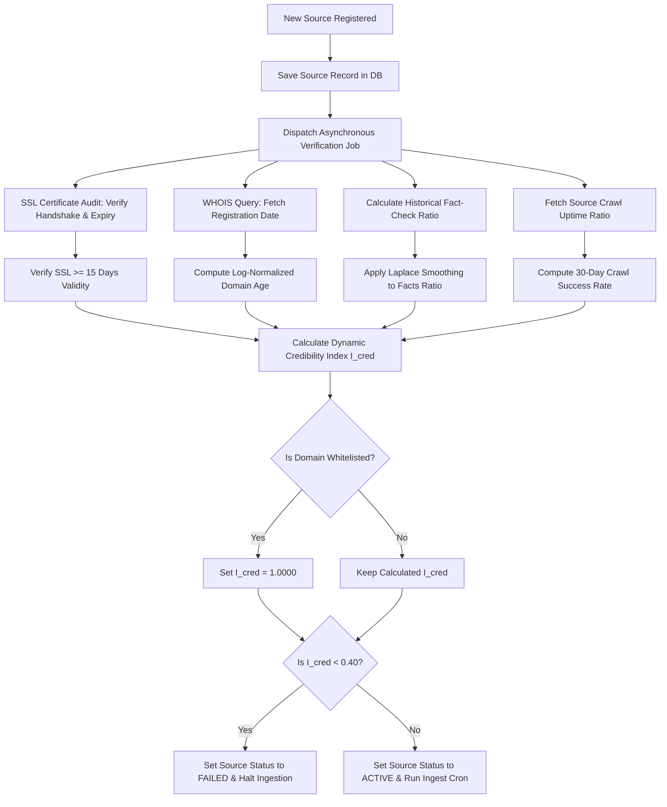
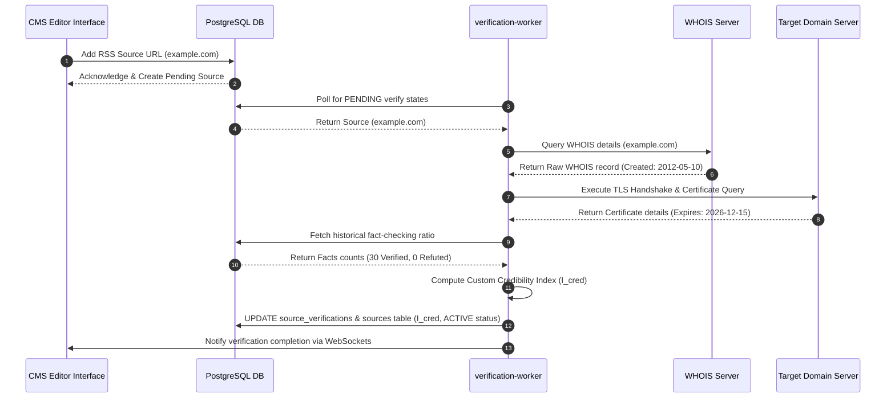

# Source Verification

## Purpose
The purpose of the Source Verification design document is to define the technical specifications, verification workflows, and reputation index calculations for news feed sources. This system assesses domain credibility by examining domain age, SSL certificate health, historical fact-check records, and feed uptime metrics, generating a custom credibility score to protect the platform from misinformation.

## Executive Summary
Ingesting RSS feeds from unverified internet domains poses a significant editorial risk. The NewsOps Cloud platform incorporates a Source Verification engine to establish automated trust boundaries. When a new ingestion source is registered, the system runs asynchronous verification checks: performing WHOIS queries to extract domain registration age, validating SSL/TLS handshake configurations, and reviewing historical fact-check ratings (ratio of verified vs. refuted claims). These variables are calculated using a custom credibility formula that directly influences the visibility and routing of ingested articles.

## Vision
To build a transparent, self-governing source audit trail that ensures no fabricated or unverified sources pollute the news platform, elevating editorial confidence through objective cryptographic and historical metrics.

## Scope
This design document covers:
- Verification pipeline scripts (WHOIS parser, SSL certificate expiration validator).
- Mathematical formulation of the Custom Source Credibility Index ($I_{cred}$).
- Historical verification lookup schedules and cache rules.
- Database schema definitions for source reputation parameters.
- API endpoints to fetch, force-update, and modify credibility weightings.

## Goals
- Complete domain WHOIS and SSL diagnostics in under 3 seconds during initial source registration.
- Maintain an accurate historical record of domain SSL renewal, preventing ingestion failures due to expired certificates.
- Compute dynamic credibility metrics for every source every 24 hours.
- Block ingestion from domains with a Credibility Index ($I_{cred}$) below $0.40$ automatically.

## Functional Requirements
- **Automated WHOIS Parsing**: The system must extract the domain registration date (`created_date`) from raw WHOIS records to determine domain age.
- **SSL Configuration Audit**: The system must check the SSL chain, expiration date, and signature algorithms of the target domain.
- **Dynamic Credibility Index**: The verification engine must calculate and update the $I_{cred}$ score daily.
- **Blacklist Enforcement**: If a source’s score falls below a critical threshold, its status must automatically change to `FAILED` or `INACTIVE`, halting feed ingestion.
- **Manual Verification Bypass**: Administrators must have the ability to override calculated scores for trusted state or institutional publications.

## Non-Functional Requirements
- **External Dependency Handling**: WHOIS lookups must utilize rate-limited local WHOIS servers or fall back to trusted HTTP WHOIS APIs to prevent connection blockages.
- **Data Encryption**: Raw WHOIS data and parsed domain details must be stored in encrypted database fields if they contain personal identifier contacts.
- **Latency Isolation**: Source verification must run asynchronously, ensuring that delays in WHOIS or SSL validation do not block the CMS user interface.

## Business Rules
1. A domain must have a valid, active SSL certificate with at least 15 days remaining before expiration to pass the SSL verification check.
2. The platform must re-evaluate SSL status and domain registration records every 7 days.
3. The custom credibility index $I_{cred}$ is calculated using the following mathematical model:

### Credibility Index ($I_{cred}$) Formula
$$I_{cred} = w_{age} \cdot A_{norm} + w_{ssl} \cdot S_{ssl} + w_{fact} \cdot F_{ratio} + w_{uptime} \cdot U_{uptime}$$
where the components are defined as:
- **Domain Age ($A_{norm}$)**: Log-normalized value of domain age in years:
  $$A_{norm} = \min\left(1.0, \frac{\ln(\text{Age in Days} + 1)}{\ln(3650 + 1)}\right)$$ (Normalized up to 10 years).
- **SSL Score ($S_{ssl}$)**: Evaluated based on certificate health:
  $$S_{ssl} = \begin{cases} 
  1.0 & \text{Valid SSL } (>90\text{ days remaining}) \\ 
  0.5 & \text{Valid SSL } (\le 90\text{ days remaining}) \\ 
  0.0 & \text{Expired, Self-Signed, or Invalid SSL} 
  \end{cases}$$
- **Factual Ratio ($F_{ratio}$)**: Calculated from historical verified facts:
  $$F_{ratio} = \frac{N_{verified} + 1}{N_{verified} + N_{refuted} + 2}$$ (Laplacian-smoothed ratio of verified to total evaluated facts).
- **Uptime Ratio ($U_{uptime}$)**: Uptime percentage from crawl logs:
  $$U_{uptime} = \frac{\text{Successful Crawls}}{\text{Total Crawl Runs}}$$ over the last 30 days.

- **Weightings**: The default weight coefficients must sum to 1.0:
  $$w_{age} = 0.15, \quad w_{ssl} = 0.10, \quad w_{fact} = 0.55, \quad w_{uptime} = 0.20$$

## Actors
- **Source Verification Worker**: Asynchronous cron worker running WHOIS, SSL, and index calculations.
- **System Administrator**: Modifies formula weights or manually whitelists domains.
- **Editor**: Adds new feeds and reviews verification logs in the CMS.

## User Stories
1. **As a System Administrator**, I want the system to automatically calculate a trust score for every new RSS feed added so that we do not ingest spam blogs.
2. **As an Ingestion Crawler**, I want to skip sources that have failed SSL checks so that we do not expose user clients to potentially compromised endpoints.
3. **As an Editor**, I want to see a detailed breakdown of a domain’s historical credibility factors (age, fact checks, uptime) in the dashboard so that I can make informed decisions about whitelist overrides.

## Acceptance Criteria
1. The WHOIS resolver must successfully parse registration years for `.com`, `.org`, `.net`, `.edu`, and major country code domains (ccTLDs like `.co.uk`, `.de`).
2. If the computed $I_{cred}$ falls below $0.45$, the source's status must transition to `FAILED` and trigger a warning log event.
3. Whitelisted domains (e.g., `reuters.com`, `apnews.com`) must override the calculated score, maintaining a permanent $I_{cred} = 1.0000$ regardless of SSL warnings or uptime spikes.
4. Calculated trust scores must update the UI database fields and Elasticsearch indices in under 1 second.

## Workflows
1. **Automated Domain Verification Sequence**:
   - Editor registers a new feed: `https://example-news.com/feed.xml`.
   - The system registers the Source in the database as `ACTIVE` but flags the verification state as `PENDING`.
   - An asynchronous task is dispatched to the Source Verification Worker.
   - The worker executes an SSL connection test to extract certificate parameters (validity, expiration, CA signature).
   - The worker queries the WHOIS server, extracts `created_date`, and calculates domain age in days.
   - The worker queries PostgreSQL for existing fact-check and crawl metrics.
   - The worker computes the Credibility Index ($I_{cred}$).
   - The verification details are saved in `source_verifications` and the aggregated score is updated in `sources`.
   - If the score is $< 0.40$, the source is flagged as `FAILED` and ingestion schedules are deactivated.



## API Design

### GET /api/v1/intelligence/sources/:id/verification
Retrieves the detailed verification logs and index breakdowns.
**Request Headers**:
- `Authorization: Bearer <JWT>`

**Response Payload (200 OK)**:
```json
{
  "sourceId": "src_883011293",
  "domain": "techcrunch.com",
  "credibilityIndex": 0.9425,
  "isWhitelisted": false,
  "lastVerifiedAt": "2026-06-27T22:26:00.000Z",
  "breakdown": {
    "domainAgeDays": 8412,
    "domainAgeScore": 0.9850,
    "sslExpiresAt": "2026-12-15T00:00:00.000Z",
    "sslRemainingDays": 171,
    "sslScore": 1.0000,
    "verifiedFactsCount": 42,
    "refutedFactsCount": 1,
    "factRatioScore": 0.9555,
    "uptimeRatioScore": 0.9980
  }
}
```

### POST /api/v1/intelligence/sources/:id/verify
Forces a manual verification update.
**Request Headers**:
- `Authorization: Bearer <JWT>`

**Response Payload (202 Accepted)**:
```json
{
  "sourceId": "src_883011293",
  "status": "QUEUED",
  "jobId": "job_verify_src_883011293",
  "submittedAt": "2026-06-27T22:26:11.000Z"
}
```

## Database Design

To support verification states, the database schema incorporates a dedicated verification logs table, referencing the core `sources` table.

### DDL Schema (PostgreSQL)
```sql
-- Verification Details Table
CREATE TABLE source_verifications (
    id VARCHAR(50) PRIMARY KEY DEFAULT concat('vrf_', replace(gen_random_uuid()::text, '-', '')),
    source_id VARCHAR(50) NOT NULL UNIQUE REFERENCES sources(id) ON DELETE CASCADE,
    domain_name VARCHAR(255) NOT NULL,
    is_whitelisted BOOLEAN NOT NULL DEFAULT FALSE,
    whois_created_at TIMESTAMP WITH TIME ZONE,
    whois_raw TEXT,
    ssl_issuer VARCHAR(255),
    ssl_expires_at TIMESTAMP WITH TIME ZONE,
    ssl_raw JSONB,
    calculated_credibility DECIMAL(5,4) NOT NULL DEFAULT 1.0000 CHECK (calculated_credibility >= 0.0000 AND calculated_credibility <= 1.0000),
    last_verified_at TIMESTAMP WITH TIME ZONE NOT NULL DEFAULT NOW()
);

CREATE INDEX idx_verifications_domain ON source_verifications(domain_name);
CREATE INDEX idx_verifications_credibility ON source_verifications(calculated_credibility);

-- Add credibility_score column to sources table for fast queries
ALTER TABLE sources ADD COLUMN credibility_score DECIMAL(5,4) DEFAULT 1.0000;
CREATE INDEX idx_sources_credibility ON sources(credibility_score);
```

### Prisma Schema
```prisma
model SourceVerification {
  id                    String    @id @default(dbgenerated("concat('vrf_', replace(gen_random_uuid()::text, '-', ''))")) @db.VarChar(50)
  sourceId              String    @unique @map("source_id") @db.VarChar(50)
  domainName            String    @map("domain_name") @db.VarChar(255)
  isWhitelisted         Boolean   @default(false) @map("is_whitelisted")
  whoisCreatedAt        DateTime? @map("whois_created_at")
  whoisRaw              String?   @map("whois_raw") @db.Text
  sslIssuer             String?   @map("ssl_issuer") @db.VarChar(255)
  sslExpiresAt          DateTime? @map("ssl_expires_at")
  sslRaw                Json?     @map("ssl_raw")
  calculatedCredibility Decimal   @default(1.0000) @map("calculated_credibility") @db.Decimal(5, 4)
  lastVerifiedAt        DateTime  @default(now()) @map("last_verified_at")

  source Source @relation(fields: [sourceId], references: [id], onDelete: Cascade)

  @@index([domainName])
  @@map("source_verifications")
}

// Extends Source model in Prisma schema definition
model Source {
  // Existing fields...
  credibilityScore    Decimal?            @default(1.0000) @map("credibility_score") @db.Decimal(5, 4)
  sourceVerification  SourceVerification?
}
```

## UI Design
- **Source Verification Status Card**: Located inside the administrative source manager panel. It features:
  - Trust Ring: A circular color-coded progress indicator (green for $>0.80$, orange for $0.50$-$0.80$, red for $<0.50$).
  - Breakdown Grid: Displaying domain registration age, SSL certificate expiry timer, and uptime status.
  - Interactive Action Panel: Providing buttons to "Toggle Whitelist Status" and "Force Recalculation".

## Permissions
- `intelligence:sources:verify` - Admin role. Modify whitelist status, run manual audits.
- `intelligence:sources:read` - Editor, Reader roles. View verification scores.
- `intelligence:sources:admin` - Admin role. Modify weight settings ($w_{age}$, $w_{ssl}$, $w_{fact}$, $w_{uptime}$).

## Security
- **Input Validation**: Custom URL parsing must validate hostname syntaxes to prevent command injection payloads during shell execution of whois commands.
- **Credential Storage**: SSL metadata stored in `ssl_raw` JSONB must not contain corporate secret keys or client certificates.
- **SQL Parameter Binding**: All lookup queries must utilize prepared statements.

## Performance
- **SLA Limits**: Index computations must execute in $< 50\text{ms}$ when cached variables are retrieved.
- **Caching**: WHOIS and SSL lookups are cached in Redis with a 24-hour TTL to prevent remote API rate limit bans.
- **Target Operations**: Verification worker scales to process 20 parallel domain audits.

## Monitoring
- `newsops_source_verification_duration_seconds`: Histogram tracking verification process runtimes.
- `newsops_source_failed_verification_total`: Counter tracking total sources blocked due to failing metrics.
- `newsops_source_whois_errors_total`: Counter tracking network failures during WHOIS resolution.
- **Alert Trigger**: Trigger slack alert if WHOIS resolution failures exceed 15% of daily attempts.

## Logging
- **Log Format**: JSON log format.
- **Log Level**: INFO for score updates; WARN for SSL certificates expiring in less than 30 days; ERROR for registration parsing failures.
- **Log Context**:
  ```json
  {
    "timestamp": "2026-06-27T22:26:11.992Z",
    "level": "WARN",
    "context": "newsops-source-verification",
    "source_id": "src_883011293",
    "domain": "techcrunch.com",
    "ssl_days_left": 12,
    "message": "Source SSL certificate is expiring soon. Ingestion warning active."
  }
  ```

## Error Handling
- `WHOIS_PARSE_FAILED`: Code 422. HTTP Status 422 Unprocessable Entity. Message: "The WHOIS record format could not be parsed for this TLD."
- `SSL_HANDSHAKE_FAILED`: Code 502. HTTP Status 502 Bad Gateway. Message: "SSL verification failed. The remote server rejected the handshake or uses an invalid certificate chain."
- `WEIGHTS_OUT_OF_BOUNDS`: Code 400. HTTP Status 400 Bad Request. Message: "Credibility weighting factors must sum to exactly 1.0."

## Edge Cases
- **Wildcard / Shared Domains**: Subdomains on sites like `blogspot.com` or `medium.com` will share the main domain age, but contain highly variable quality contents. The system handles this by checking the exact path of the feed. If it resides on a multi-user hosting domain, $w_{fact}$ is elevated to $0.85$ and $w_{age}$ is ignored ($0.0$), relying entirely on actual factual verification metrics.
- **Temporary Network Outages**: A transient timeout in WHOIS or SSL queries does not lower the score. The worker retries the request up to 3 times in 10-minute intervals before logging a warning and preserving the last known credibility rating.

## Future Improvements
- **Automated DNSSEC Checks**: Integrate verification of DNS Security Extensions (DNSSEC) to prevent DNS spoofing attacks on source domains.
- **Public Reputation Registry API**: Expose a public endpoint allowing third-party applications to query the NewsOps domain credibility database.

## Mermaid Diagrams

### Sequence Diagram: Ingestion Source Verification Loop


## References
- [News Intelligence Schema](../03-database/news_intelligence_schema.md)
- [System Architecture Blueprint](../02-architecture/system_architecture.md)
- [Trend Detection Specs](trend_detection.md)
