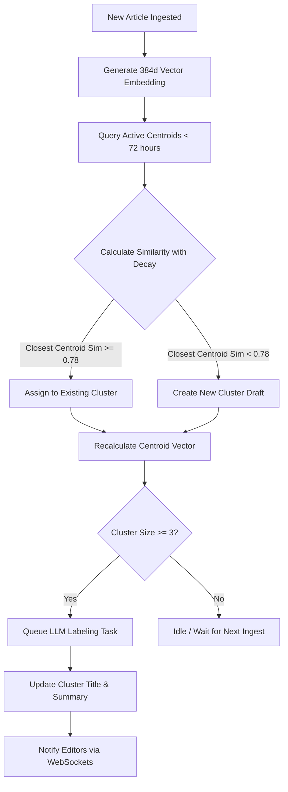
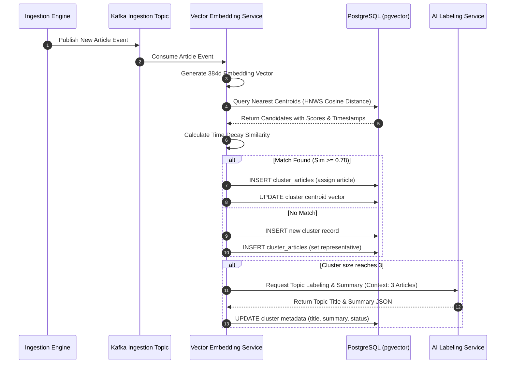

# Topic Clustering

## Purpose
The purpose of the Topic Clustering engine document is to define the technical design, algorithms, schemas, and workflows for grouping high-velocity raw news articles into distinct, coherent story clusters in real-time. This system ensures that duplicate, related, or developing stories are grouped under a single parent topic, reducing noise for editors and providing structured events for newsletter synthesis.

## Executive Summary
The NewsOps Cloud platform ingests thousands of articles daily across various RSS, Atom, and custom API feeds. To prevent editorial fragmentation, the Dynamic Story Clustering engine processes raw feed articles using dense vector embeddings, a sliding-window streaming DBSCAN algorithm, and hierarchical clustering. This process maps incoming stories to existing clusters, spawns new clusters when novel concepts emerge, computes dynamic multi-dimensional cluster centroids, and utilizes generative LLMs to produce clean, concise topic labels and summaries.

## Vision
To establish an automated, self-healing clustering pipeline that transforms disorganized global feed items into structured, semantic events within seconds of publication. The platform aims to represent the shifting landscape of global news accurately, keeping the database footprint clean through smart aging and consolidation of temporal topics.

## Scope
This design document covers:
- Vectorization pipeline using Sentence-Transformer models (e.g., `all-MiniLM-L6-v2` or local ONNX variants).
- Real-time online streaming DBSCAN algorithm with temporal decay.
- Agglomerative Hierarchical Clustering for cluster merging and reconciliation.
- Cluster centroid calculations (weighting by time and source domain reputation).
- LLM-driven cluster title and summary label generation.
- Database models for storing cluster assignments, coordinates, and thresholds.
- REST API design for manual editorial cluster management.

## Goals
- Limit latency of vectorization and clustering to under 150ms per ingested article.
- Achieve a minimum Silhouette Coefficient of 0.65 across active news categories.
- Support real-time ingestion rates of 100 articles per second without database lock-ups.
- Enable zero-downtime, sub-second manual cluster splits and merges by editorial staff.

## Functional Requirements
- **Dynamic Cluster Assignment**: The engine must evaluate each incoming raw feed item and either assign it to an existing active cluster or create a new cluster.
- **Dynamic Centroid Re-calculation**: Upon adding an article to a cluster, the engine must re-calculate the multi-dimensional vector centroid of the cluster.
- **Time-Decay Windowing**: Clustering similarity metrics must incorporate temporal distance, penalizing similarities for articles published far apart (e.g., more than 72 hours).
- **Cluster Merging and Splitting**: The system must support manual and automated cluster merging when two separate stories converge, and splitting when a cluster grows too broad.
- **Automated Labeling**: When a cluster reaches a minimum size (e.g., 3 articles), the engine must trigger an LLM-based labeling task to generate a title, summary, and primary entity mapping.

## Non-Functional Requirements
- **High Concurrency**: The clustering database tables must support up to 50 concurrent worker threads writing assignments.
- **Query Performance**: Standard dashboard queries to list active clusters must resolve in under 40ms.
- **Scalability**: Vector indexes must be partitioned or managed in a dedicated vector extension (like `pgvector` or Milvus) to support search spaces exceeding 10 million vectors.
- **Resilience**: A failure in the NLP embedding service must trigger a fallback to traditional TF-IDF cosine similarity clustering to avoid ingestion backlogs.

## Business Rules
1. A raw feed item can belong to at most one active cluster at any given point in time.
2. A cluster must have a minimum of 1 article. If all articles are removed from a cluster, the cluster must be soft-deleted.
3. Automatically generated clusters remain in `DRAFT` status until either verified by an editor or published via automated distribution rules based on confidence thresholds.
4. Time decay factor: Similarity score between article $A_i$ and centroid $C_j$ is adjusted by:
   $$S_{adj} = S_{cosine} \times e^{-\lambda (t_i - t_{centroid})}$$
   where $\lambda$ is the decay constant (e.g., $0.05$ per hour) and $t$ is measured in hours.

## Actors
- **NLP Ingestion Pipeline**: Background service that generates embeddings and runs clustering.
- **Editorial Curator**: Reviewer who splits, merges, edits titles, or archives clusters.
- **System Administrator**: Adjusts clustering parameters (e.g., DBSCAN $\epsilon$, min_samples, time decay rates).

## User Stories
1. **As an Editorial Curator**, I want to view a list of automatically grouped articles under a single topic card so that I don't have to read 20 redundant articles on the same subject.
2. **As an NLP Ingestion Pipeline**, I want to calculate the vector distance between an incoming article and active topic centroids so that I can immediately determine if it belongs to an ongoing story or starts a new one.
3. **As an Editorial Director**, I want to merge two similar clusters that were generated separately due to variations in initial reporting so that our public feed remains consolidated and unified.

## Acceptance Criteria
1. The clustering engine must process a batch of 50 incoming articles and group them into correct clusters with a precision of $\ge 92\%$ compared to manual editorial ground truth.
2. The dynamic cluster centroid recalculation must complete in under 5ms per article update.
3. The LLM-labeling prompt must generate titles that are under 100 characters and contain at least one extracted high-confidence entity.
4. Manual cluster merges must update the foreign keys of up to 1,000 associated articles in the database in under 200ms without blocking reads on the `raw_feed_items` table.

## Workflows
1. **Streaming Clustering Pipeline**:
   - Ingestion Crawler inserts a new article into `raw_feed_items`.
   - A Kafka event triggers the NLP Embedding Service.
   - The NLP service computes a 384-dimension vector embedding using the local `all-MiniLM-L6-v2` ONNX runtime.
   - The Clustering Engine queries the database (via pgvector) for active cluster centroids within the last 72 hours.
   - Cosine distance is calculated and adjusted for time decay.
   - If the closest centroid has $S_{adj} \ge 0.78$, the article is assigned to that cluster, and `cluster_articles` is updated.
   - If no centroid satisfies the threshold, a new temporary cluster is spawned, and the article is set as its initial representative.
   - The system re-calculates the weighted centroid vector:
     $$\vec{C}_{new} = \frac{\sum w_k \vec{A}_k}{\sum w_k}$$
     where $w_k$ is the weight of article $k$ based on its source credibility and freshness.
   - If the cluster size reaches 3 articles, an asynchronous LLM request is queued to generate a title and summary.



## API Design

### POST /api/v1/intelligence/clusters/rebuild
Triggers a manual recalculation of clusters within a specific time window.
**Request Headers**:
- `Authorization: Bearer <JWT>`
- `Content-Type: application/json`

**Request Payload**:
```json
{
  "startTime": "2026-06-25T00:00:00.000Z",
  "endTime": "2026-06-27T00:00:00.000Z",
  "epsilon": 0.22,
  "minSamples": 2,
  "timeDecayLambda": 0.05
}
```

**Response Payload (202 Accepted)**:
```json
{
  "jobId": "job_cluster_rebuild_992813",
  "status": "PROCESSING",
  "estimatedDurationSeconds": 45,
  "submittedAt": "2026-06-27T22:26:00.000Z"
}
```

### POST /api/v1/intelligence/clusters/merge
Merges two or more active clusters.
**Request Headers**:
- `Authorization: Bearer <JWT>`
- `Content-Type: application/json`

**Request Payload**:
```json
{
  "targetClusterId": "cls_destination777",
  "sourceClusterIds": [
    "cls_source111",
    "cls_source222"
  ]
}
```

**Response Payload (200 OK)**:
```json
{
  "success": true,
  "mergedClusterId": "cls_destination777",
  "articlesMovedCount": 14,
  "updatedCentroid": [0.0123, -0.0982, "...", 0.1145]
}
```

## Database Design

To support fast similarity queries, the database schema integrates a vector index on the centroid and individual article embeddings using `pgvector` extensions in PostgreSQL.

### DDL Schema Additions
```sql
-- Enable vector extension
CREATE EXTENSION IF NOT EXISTS vector;

-- Add embedding vector column to raw feed items
ALTER TABLE raw_feed_items ADD COLUMN embedding vector(384);
CREATE INDEX idx_raw_feed_items_embedding ON raw_feed_items USING hnsw (embedding vector_cosine_ops);

-- Add centroid column and vector indices to clusters table
ALTER TABLE clusters ADD COLUMN centroid vector(384);
ALTER TABLE clusters ADD COLUMN temporal_score_weight DECIMAL(5,4) DEFAULT 1.0000;

-- Indexes for cluster filtering and centroid searches
CREATE INDEX idx_clusters_centroid ON clusters USING hnsw (centroid vector_cosine_ops);
CREATE INDEX idx_clusters_deleted_at ON clusters(deleted_at) WHERE deleted_at IS NULL;
```

### Prisma Schema Additions
```prisma
// Representation of model extensions for pgvector in Prisma
// Prisma doesn't natively support HNSW indexes without custom schema declarations.
// We manage vectors using raw sql helper execution or custom fields:

model ClusterEmbedding {
  clusterId String   @id @map("cluster_id") @db.VarChar(50)
  centroid  String   @db.Text // Contains vector representation serialized as string
  updatedAt DateTime @updatedAt @map("updated_at")

  @@map("cluster_embeddings")
}
```

## UI Design
- **Clustering Workspace**: A split-pane layout showing a grid of dynamic clusters on the left and selected cluster details on the right.
- **Cluster Detail view**: Displays a chronological timeline of articles, similarity confidence scores, and raw metadata. Provides buttons for "Merge Cluster", "Split Article(s)", and "Force Label Regeneration".
- **Visual Similarity Map**: A 2D scatter plot visualization of active clusters using t-SNE or UMAP dimension reduction, allowing editors to see adjacent stories and select candidates for merging.

## Permissions
- `intelligence:clusters:read` - Viewer role. Browse active clusters and structures.
- `intelligence:clusters:write` - Editor role. Trigger cluster merges, split articles.
- `intelligence:clusters:admin` - Admin role. Rebuild vector spaces, adjust model coefficients ($\epsilon$, $\lambda$).

## Security
- **Input Validation**: Rebuild parameters must be strictly bound: $\epsilon$ restricted between $0.05$ and $0.95$; `minSamples` between $1$ and $100$.
- **Rate Limiting**: The `/rebuild` API is CPU-intensive and is rate-limited to 1 execution per 10 minutes per tenant organization.
- **JWT Scope Enforcement**: Ensure that only requests containing `org_id` match the organization partition within the multi-tenant database.

## Performance
- **Ingestion Processing SLA**: Embedding generation and cluster mapping must complete in $< 150\text{ms}$.
- **Target Vector TPS**: Support up to 500 embedding lookups/sec.
- **Caching**: Store cluster metadata, titles, and summaries in Redis with a 5-minute TTL. Avoid caching centroid vectors to ensure real-time accuracy during high-volume ingestion.

## Monitoring
- `newsops_clustering_embedding_latency_seconds`: Histogram tracking Sentence-Transformer latency.
- `newsops_clustering_active_count`: Gauge tracking total number of active draft clusters.
- `newsops_clustering_outliers_ratio`: Gauge tracking the percentage of incoming articles classified as noise (not belonging to any cluster).
- **Alert Trigger**: Trigger critical alert if `newsops_clustering_outliers_ratio` exceeds $45\%$ over a 1-hour window (indicates drift or incorrect similarity threshold $\epsilon$).

## Logging
- **Log Format**: JSON log format.
- **Log Level**: INFO for cluster creation and transitions; WARN for high similarity distance clusters; ERROR for vector calculation failures.
- **Log Example**:
  ```json
  {
    "timestamp": "2026-06-27T22:26:05.812Z",
    "level": "INFO",
    "context": "newsops-clustering",
    "cluster_id": "cls_destination777",
    "article_id": "itm_812984192",
    "similarity_score": 0.8412,
    "execution_time_ms": 12.4
  }
  ```

## Error Handling
- `CLUSTER_MERGE_FAILED`: Code 422. HTTP Status 422 Unprocessable Entity. Message: "Selected clusters belong to different tenant partitions or are already deleted."
- `VECTOR_SERVICE_OFFLINE`: Code 503. HTTP Status 503 Service Unavailable. Message: "The NLP embedding generator is currently offline. Falling back to keyword clustering."
- `THRESHOLD_OUT_OF_BOUNDS`: Code 400. HTTP Status 400 Bad Request. Message: "Epsilon value must be a positive decimal between 0.05 and 0.95."

## Edge Cases
- **Flash Crowds / Ingestion Spikes**: When a major breaking news event occurs, hundreds of articles are ingested simultaneously. The system uses a Kafka topic partitioned by the hash of the source domain to distribute vectorization, but processes actual clustering sequentially on a single thread per organization to prevent race conditions on centroid updates.
- **Drifting Centroids**: As a story evolves over weeks, the centroid can drift far from the initial articles. The system prevents this by applying a 72-hour sliding window, after which old articles are ignored for centroid computation, and the cluster is locked from receiving new auto-assignments.

## Future Improvements
- **Online Hierarchical Dirichlet Process (HDP)**: Move away from fixed DBSCAN $\epsilon$ to a non-parametric Bayesian method (HDP) to automatically determine the optimal number of topics without threshold tuning.
- **Multilingual Alignment**: Implement cross-lingual embeddings (like `LaBSE`) to automatically cluster articles written in different languages into the same topic.

## Mermaid Diagrams

### Sequence Diagram: Ingest, Embed, Cluster, and Label


## References
- [Database Schema Design Standard](../03-database/schema_design_standards.md)
- [News Intelligence Schema](../03-database/news_intelligence_schema.md)
- [System Architecture Blueprint](../02-architecture/system_architecture.md)
