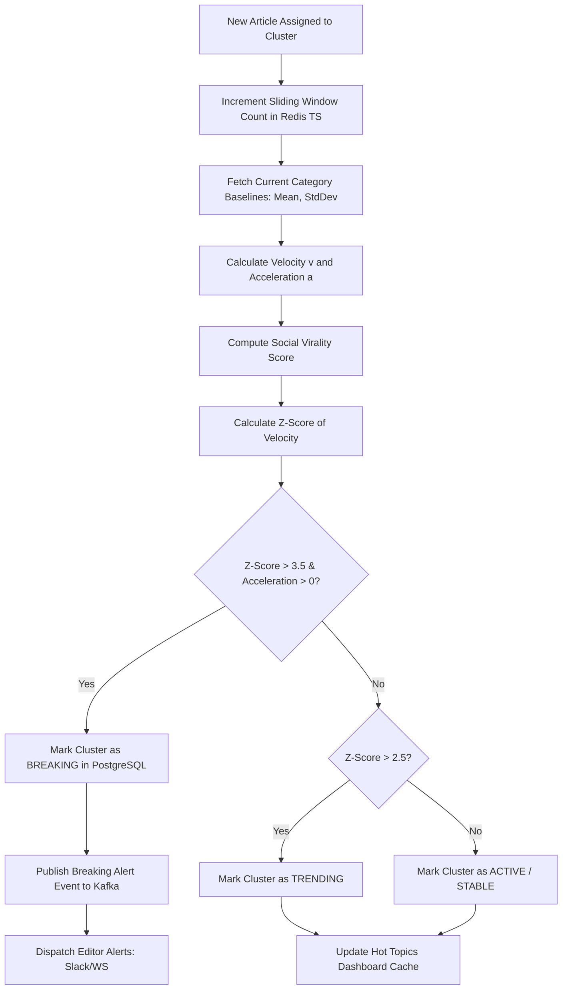
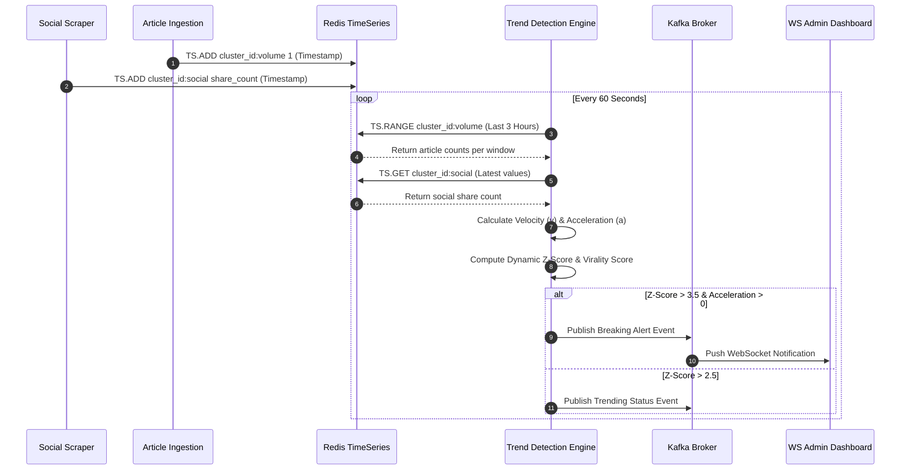

# Trend Detection

## Purpose
The purpose of the Trend Detection design document is to define the mathematical algorithms, time-series schemas, and alert workflows for detecting breaking news and trending topics in real-time. This system evaluates feed publication velocity, volume acceleration, and social media cross-shares to calculate virality scores and trigger editor notifications for rapidly developing stories.

## Executive Summary
For news organizations, identifying a breaking story minutes before competitors is a core competitive advantage. The Trend Detection engine monitors ingestion frequency and social platform indicators (such as shares, views, and reposts) associated with active clusters. By calculating publication velocity ($v$) and acceleration ($a$) over rolling hourly windows, and combining these metrics with social momentum values, the engine identifies hot topics and triggers breaking alerts when statistical anomalies (e.g., exceeding 3 standard deviations from the historical baseline) occur.

## Vision
To build an automated, zero-latency trend sentinel that detects global and localized news breakouts within minutes of emergence, enabling editorial teams to prioritize content creation and automate breaking newsletter distributions.

## Scope
This design document covers:
- Mathematical formulations for publication velocity ($v$), acceleration ($a$), and social virality scores.
- Real-time sliding window calculations using Redis Timeseries or PostgreSQL time-series structures.
- Breaking alert trigger thresholds based on Dynamic Z-score analysis.
- Ranking systems for "Hot Topics" utilizing logarithmic time-decay models.
- API endpoints for querying trends and configuring alert thresholds.
- Database schema and index definitions for tracking trend metrics.

## Goals
- Detect breaking news events within 5 minutes of initial feed publication spikes.
- Restrict false positive alerts to under 5% through multi-source validation thresholds.
- Scale time-series metric tracking to support 10,000 active topics concurrently.
- Maintain alert evaluation loop latency below 500ms from the point of article ingestion.

## Functional Requirements
- **Feed Velocity Tracking**: The engine must compute the hourly publication frequency of articles within each active cluster.
- **Social Virality Ingestion**: The system must periodically poll social APIs (e.g., X, Reddit, Bluesky) for URLs within a cluster to aggregate sharing activity.
- **Dynamic Z-Score Alerting**: A breaking alert must be generated when a cluster's volume acceleration exceeds a dynamic Z-score threshold.
- **Time-Decayed Hot Ranking**: The dashboard must display a ranked list of "Hot Topics" sorted by a score that decays as the story ages.
- **Threshold Configuration**: Administrators must be able to adjust baseline sensitivity settings per news category.

## Non-Functional Requirements
- **Low Latency Database Writes**: The time-series data storage must handle up to 500 writes/second.
- **In-Memory Caching**: Redis must store rolling window metrics to prevent constant PostgreSQL aggregations.
- **Thread Safety**: Trend evaluation loops must execute in isolated asynchronous threads to avoid locking the ingestion pipeline.

## Business Rules
1. A cluster is classified as `TRENDING` if its calculated velocity is greater than the category's median velocity by 2.5 standard deviations.
2. A cluster is classified as `BREAKING` if its acceleration $a$ is positive and the Z-score of its hourly velocity exceeds 3.5.
3. Virality and Hot scores are calculated using the following mathematical models:

### Velocity ($v$) & Acceleration ($a$) Formulas
For a given cluster $C_j$, the velocity in window $W_t$ (e.g., current hour) is:
$$v(t) = \frac{N(t) - N(t-1)}{\Delta t}$$
where $N(t)$ is the cumulative count of articles at time $t$. The acceleration is:
$$a(t) = \frac{v(t) - v(t-1)}{\Delta t}$$

### Virality Score ($S_{viral}$) Formula
$$S_{viral} = \ln(S_{social} + 1) \times \left( \frac{A_{unique} \cdot H_{source}}{t - t_0 + \alpha} \right)$$
where:
- $S_{social}$ is the sum of social shares and reposts.
- $A_{unique}$ is the count of unique media domains reporting on the story.
- $H_{source}$ is the average credibility index of the reporting domains.
- $t - t_0$ is the age of the cluster in hours.
- $\alpha$ is a smoothing gravity constant (e.g., $1.5$) to prevent division by zero for new clusters.

## Actors
- **Trend Detection Service**: Background worker running velocity calculations and alert evaluations.
- **Social Scraper Service**: Background task updating sharing metrics for cluster URLs.
- **Editor**: Receives breaking alerts, writes stories, or triggers newsletter alerts.
- **System Administrator**: Adjusts threshold parameters.

## User Stories
1. **As a News Editor**, I want to receive an immediate push notification when articles about a specific corporate merger accelerate in volume so that we can assign a reporter immediately.
2. **As a Social Scraper Service**, I want to batch-update share counts in Redis for trending articles so that the virality score is recalculated without overloading external APIs.
3. **As a Reader**, I want to view a "Hot Topics" section on the site home page that accurately reflects the most talked-about news of the last 24 hours.

## Acceptance Criteria
1. The trend evaluation pipeline must calculate the velocity of 5,000 clusters and update the database in under 2 seconds.
2. The Z-score calculation must adapt to seasonal weekly baselines (e.g., lower average feed volume on weekends).
3. Breaking alerts must be dispatched to Slack or PagerDuty webhooks in under 2 seconds from the time the Z-score threshold is crossed.
4. Hot topic listings must update the UI via WebSockets within 10 seconds of a score shift.

## Workflows
1. **Trend Detection and Alerting Flow**:
   - Ingestion Crawler saves new raw feed items.
   - The article is matched to a Cluster.
   - The Trend Engine updates the cluster's article count in a sliding-window cache (Redis TS).
   - Every 60 seconds, the Trend Engine calculates $v(t)$, $a(t)$, and $S_{viral}(t)$ for all active clusters.
   - The engine computes the Z-score for each cluster:
     $$Z = \frac{v(t) - \mu}{\sigma}$$
     where $\mu$ and $\sigma$ are the historical mean and standard deviation of velocity for the category over the last 14 days.
   - If $Z > 3.5$, the cluster is flagged as `BREAKING`, and the status is written to the database.
   - An alert event is published to Kafka, triggering push notifications to WebSockets and administrative panels.



## API Design

### GET /api/v1/intelligence/trends/hot
Retrieves the list of hot topics with current velocity metrics and score decay.
**Request Headers**:
- `Authorization: Bearer <JWT>`

**Request Query Parameters**:
- `limit`: 10
- `category`: "business"

**Response Payload (200 OK)**:
```json
{
  "data": [
    {
      "clusterId": "cls_semiconductor991",
      "title": "TSMC Announces Next-Gen Fab in Arizona",
      "category": "business",
      "viralScore": 842.15,
      "velocity": 14.2,
      "acceleration": 2.1,
      "zScore": 4.12,
      "articleCount": 22,
      "socialShares": 45100,
      "updatedAt": "2026-06-27T22:26:00.000Z"
    }
  ]
}
```

### POST /api/v1/intelligence/trends/alerts/config
Updates dynamic alerting thresholds for a specific category.
**Request Headers**:
- `Authorization: Bearer <JWT>`
- `Content-Type: application/json`

**Request Payload**:
```json
{
  "category": "politics",
  "minZScore": 3.2,
  "minSources": 4,
  "gravityConstant": 1.8
}
```

**Response Payload (200 OK)**:
```json
{
  "success": true,
  "category": "politics",
  "minZScore": 3.2,
  "updatedAt": "2026-06-27T22:26:11.000Z"
}
```

## Database Design

To support fast time-series writes and historical trend queries, the database schema incorporates dedicated tables for metrics and cluster statistics.

### DDL Schema (PostgreSQL)
```sql
-- Cluster Trend Metrics (Hourly aggregate snapshots)
CREATE TABLE cluster_trends (
    id VARCHAR(50) PRIMARY KEY DEFAULT concat('trd_', replace(gen_random_uuid()::text, '-', '')),
    cluster_id VARCHAR(50) NOT NULL REFERENCES clusters(id) ON DELETE CASCADE,
    recorded_at TIMESTAMP WITH TIME ZONE NOT NULL DEFAULT NOW(),
    article_count INT NOT NULL,
    velocity DECIMAL(8,2) NOT NULL,
    acceleration DECIMAL(8,2) NOT NULL,
    social_score INT NOT NULL DEFAULT 0,
    viral_score DECIMAL(10,4) NOT NULL,
    z_score DECIMAL(6,3) NOT NULL,
    status VARCHAR(50) NOT NULL DEFAULT 'STABLE' -- e.g., 'STABLE', 'TRENDING', 'BREAKING'
);

CREATE INDEX idx_cluster_trends_lookup ON cluster_trends(cluster_id, recorded_at DESC);
CREATE INDEX idx_cluster_trends_status ON cluster_trends(status, recorded_at DESC);
CREATE INDEX idx_cluster_trends_viral ON cluster_trends(viral_score DESC) WHERE status = 'TRENDING';

-- Social Share Aggregations (Detailed per article URL)
CREATE TABLE article_social_metrics (
    id VARCHAR(50) PRIMARY KEY DEFAULT concat('soc_', replace(gen_random_uuid()::text, '-', '')),
    raw_feed_item_id VARCHAR(50) NOT NULL REFERENCES raw_feed_items(id) ON DELETE CASCADE,
    platform VARCHAR(50) NOT NULL, -- e.g., 'X', 'REDDIT', 'FACEBOOK'
    share_count INT NOT NULL DEFAULT 0,
    view_count INT NOT NULL DEFAULT 0,
    last_scraped_at TIMESTAMP WITH TIME ZONE NOT NULL DEFAULT NOW()
);

CREATE UNIQUE INDEX idx_article_social_platform ON article_social_metrics(raw_feed_item_id, platform);
```

### Prisma Schema
```prisma
model ClusterTrend {
  id           String   @id @default(dbgenerated("concat('trd_', replace(gen_random_uuid()::text, '-', ''))")) @db.VarChar(50)
  clusterId    String   @map("cluster_id") @db.VarChar(50)
  recordedAt   DateTime @default(now()) @map("recorded_at")
  articleCount Int      @map("article_count")
  velocity     Decimal  @db.Decimal(8, 2)
  acceleration Decimal  @db.Decimal(8, 2)
  socialScore  Int      @default(0) @map("social_score")
  viralScore   Decimal  @map("viral_score") @db.Decimal(10, 4)
  zScore       Decimal  @map("z_score") @db.Decimal(6, 3)
  status       String   @default("STABLE") @db.VarChar(50)

  cluster Cluster @relation(fields: [clusterId], references: [id], onDelete: Cascade)

  @@index([clusterId, recordedAt(sort: Desc)])
  @@index([status, recordedAt(sort: Desc)])
  @@map("cluster_trends")
}

model ArticleSocialMetric {
  id              String   @id @default(dbgenerated("concat('soc_', replace(gen_random_uuid()::text, '-', ''))")) @db.VarChar(50)
  rawFeedItemId   String   @map("raw_feed_item_id") @db.VarChar(50)
  platform        String   @db.VarChar(50)
  shareCount      Int      @default(0) @map("share_count")
  viewCount       Int      @default(0) @map("view_count")
  lastScrapedAt   DateTime @default(now()) @map("last_scraped_at")

  rawFeedItem RawFeedItem @relation(fields: [rawFeedItemId], references: [id], onDelete: Cascade)

  @@unique([rawFeedItemId, platform])
  @@map("article_social_metrics")
}
```

## UI Design
- **Trend Intelligence Dashboard**: Displays a real-time monitor. It features:
  - Hero Chart: A line graph mapping the velocity ($v$) and acceleration ($a$) of top clusters.
  - Breaking Alert Banner: A flashing alert indicating when a cluster crosses $Z > 3.5$, with direct buttons to "Open Cluster Editor" or "Dismiss Alert".
  - Sidebar: Real-time "Hot List" sorted by $S_{viral}$, updating without page reloads.

## Permissions
- `intelligence:trends:read` - Viewer role. Monitor dashboards, query hot lists.
- `intelligence:trends:write` - Editor role. Acknowledge and dismiss breaking alerts.
- `intelligence:trends:admin` - Admin role. Modify alert thresholds, manage social scrapers.

## Security
- **Input Validation**: Threshold configurations must be strictly numeric: `minZScore` ($0.5$ to $10.0$), `gravityConstant` ($0.1$ to $5.0$).
- **Anti-Spam Safeguards**: The engine sanitizes raw social count inputs, filtering out anomalous spikes from bots by applying a capping factor (max 5,000 shares per scraping interval per source domain).

## Performance
- **SLA Limits**: Trend recalculation and Z-score evaluations must complete in under 500ms for all active clusters.
- **Caching**: Category standard deviations and means are cached in Redis with a 24-hour TTL, recomputed nightly via an automated database job.
- **Target Ingestion TPS**: Supporting time-series writes up to 500 writes/sec.

## Monitoring
- `newsops_trends_eval_latency_seconds`: Histogram tracking calculation loop runtimes.
- `newsops_trends_breaking_alerts_total`: Counter tracking total triggered breaking news events.
- `newsops_trends_cache_hits_total`: Counter tracking Redis cache hits on metric aggregations.
- **Alert Trigger**: Trigger PagerDuty alert if `newsops_trends_eval_latency_seconds` exceeds 3 seconds for 2 consecutive runs (indicates index degradation).

## Logging
- **Log Format**: JSON log format.
- **Log Level**: INFO for trend calculations; WARN for alert trigger failures; ERROR for database write timeouts.
- **Log Context**:
  ```json
  {
    "timestamp": "2026-06-27T22:26:11.902Z",
    "level": "INFO",
    "context": "newsops-trends",
    "cluster_id": "cls_semiconductor991",
    "calculated_velocity": 14.2,
    "calculated_z_score": 4.12,
    "classification": "BREAKING",
    "message": "Breaking alert condition satisfied. Emitting alert event."
  }
  ```

## Error Handling
- `METRICS_NOT_FOUND`: Code 404. HTTP Status 404 Not Found. Message: "No historical metrics available for this cluster or time window."
- `INVALID_THRESHOLD`: Code 400. HTTP Status 400 Bad Request. Message: "Dynamic Z-score threshold must be a decimal value greater than 1.0."
- `SOCIAL_SCRAPER_TIMEOUT`: Code 504. HTTP Status 504 Gateway Timeout. Message: "The upstream social API failed to respond within the allotted time."

## Edge Cases
- **Duplicate Social Shares**: A single article URL shared multiple times can skew calculations. The social scraper deduplicates requests and registers unique engagements using a Redis set containing hashed user identifiers where available.
- **Zombie Topics**: A topic can remain artificially high in rankings if social sharing continues indefinitely. The gravity factor ($t - t_0 + \alpha$) ensures that as the time elapsed since the last reporting article increases, the score drops exponentially.

## Future Improvements
- **Predictive Trends**: Integrate LSTM neural network models to predict the peak volume of a cluster based on the first 30 minutes of publication velocity.
- **Cross-Lingual Velocity**: Group velocities across translated variants of a cluster to track trends globally, not just in English-language publications.

## Mermaid Diagrams

### Flowchart: Ingestion to Dynamic Alerting Loop


## References
- [News Intelligence Schema](../03-database/news_intelligence_schema.md)
- [Topic Clustering Specs](topic_clustering.md)
- [System Architecture Blueprint](../02-architecture/system_architecture.md)
