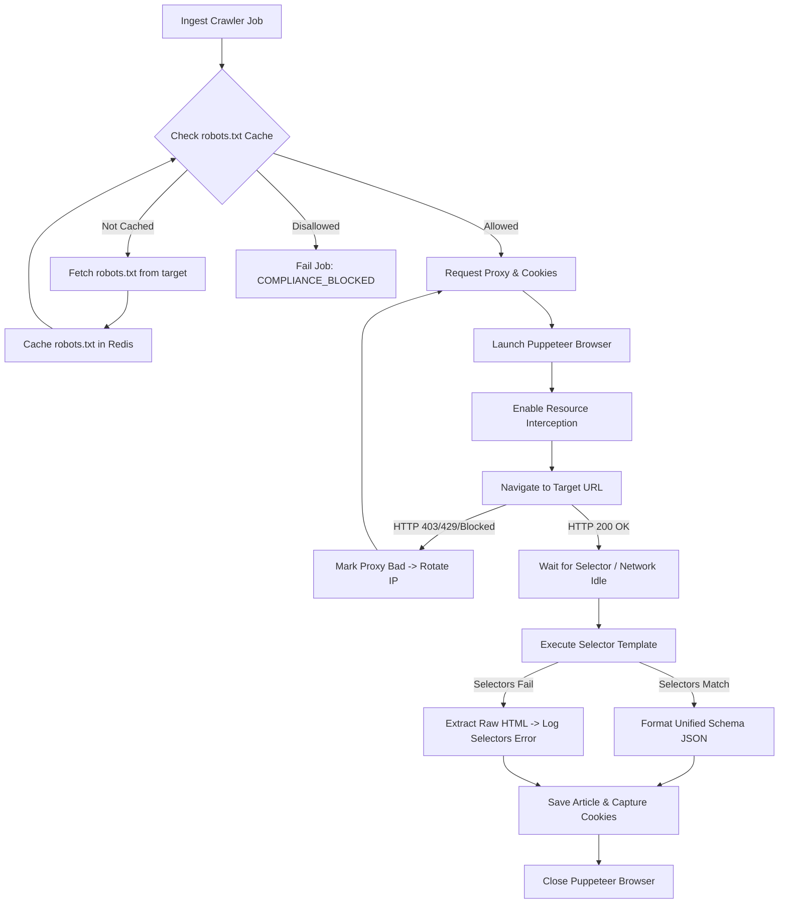

# Web Crawler Engine

## Purpose
The Web Crawler Engine is the automated web scraping service of NewsOps Cloud. It is designed to navigate target news sites, execute client-side JavaScript, bypass anti-scraping firewalls, and extract structured content from unstructured HTML. It operates as a highly polite crawler, respecting site policies while ensuring resilient extraction of articles for editorial ingestion.

## Executive Summary
For modern single-page applications (SPAs) and paywalled publishers, standard HTML scraping is insufficient. The Web Crawler Engine coordinates a swarm of headless browser instances managed by Puppeteer inside secure, sandboxed containers. The engine rotates requests through a high-reputation proxy pool, maintains a database of session cookies to access authorized portals, reads and obeys remote `robots.txt` files, and applies declarative JSON-based template selector paths (CSS, XPath) to map raw webpage DOM trees into unified metadata records.

```
                  +----------------------------------+
                  |  Kubernetes Crawler Worker Pod   |
                  |                                  |
                  |   +--------------------------+   |     Rotates IPs
                  |   |    Crawler Controller    | --+-------------------+
                  |   +--------------------------+   |                   |
                  |                 |                |                   v
                  |                 v                |           +---------------+
                  |   +--------------------------+   |           | Rotating      |
                  |   |  Puppeteer (Headless)    |   |           | Proxy Pool    |
                  |   +--------------------------+   |           +---------------+
                  |      |         |          |      |                   |
                  |      v         v          v      |                   v
                  |  [Cookie]  [Robots]   [Selector] |           +---------------+
                  |  [ Pool ]  [Parser]   [Template] |           |  Target Site  |
                  +----------------------------------+           +---------------+
```

## Vision
To build a highly robust, stealthy, and standardized extraction layer that treats the internet as a structured database. This system allows journalists to automatically monitor and pull data from diverse publishing sites without fear of dynamic template breaks, IP bans, or resource exhaustion.

## Scope
- **Headless Browser Cluster**: Dockerized Chromium environments configured for high-performance crawling.
- **Proxy Middleware**: Dynamic routing proxy agent that manages residential and datacenter networks.
- **Identity & Session Store**: Cookie manager that handles session preservation and login routines.
- **Compliance Guard**: Active parser that fetches, checks, and caches `robots.txt` paths.
- **Content Parser**: Template interpreter executing custom CSS selectors, XPaths, and regex cleaners.

## Goals
- **SPA Compatibility**: Successfully extract content from JavaScript-rendered websites (Angular, React, Vue) with a 99% success rate.
- **IP Protection**: Maintain less than 1% ban rate by dynamically switching IP addresses and user agents.
- **Network Performance**: Decrease average browser memory profile to under 150MB by intercepting and blocking non-essential assets (ads, tracking scripts, images, videos).
- **Extraction Accuracy**: Ensure extraction of author, publish date, and content meets 98% accuracy against configured templates.

## Functional Requirements
- **FR-3.1**: The system must run Headless Chromium using Puppeteer to render complete DOM trees before content extraction.
- **FR-3.2**: The system must resolve the target URL and dynamically select a proxy from a rotating pool based on target geographic restrictions.
- **FR-3.3**: The system must verify the target domain's `robots.txt` constraints before requesting any subpath. It must reject crawls targeting disallowed routes.
- **FR-3.4**: The system must load page templates containing CSS selectors or XPath rules to extract standard keys: `title`, `author`, `publish_date`, `content_body`, `hero_image_url`, and `tags`.
- **FR-3.5**: The system must save and reload cookie states for domains requiring paywall logins or age-verification compliance.
- **FR-3.6**: The system must intercept Puppeteer network requests and cancel loading of stylesheets, fonts, images, and audio/video resources to minimize bandwidth usage.

## Non-Functional Requirements
- **NFR-4.1 (Latency)**: Web pages must render and return extracted content within a timeout threshold of 15 seconds.
- **NFR-4.2 (Scalability)**: The engine must support running up to 50 concurrent headless browser workers per virtual machine cluster node.
- **NFR-4.3 (Security)**: Chromium execution must use strict sandbox flags (`--no-sandbox` only permitted inside specialized secure kernel environments, preferring isolated user namespaces).
- **NFR-4.4 (Resiliency)**: When a scraping job encounters an HTTP 403, 503, or cloudflare barrier, the proxy engine must retry the request up to 3 times with a different IP address and browser fingerprint.

## Business Rules
- **BR-5.1**: Every crawl request must identify itself using the tenant's specified User-Agent or default to `NewsOpsBot/2.0 (+https://newsops.com/bot)`.
- **BR-5.2**: The system must delay consecutive calls to the same host by a minimum of 1,000ms unless a different crawl-delay is specified by the target's `robots.txt`.
- **BR-5.3**: No crawling is permitted on sites displaying explicit `Disallow: /` directives for all crawlers unless written consent is acquired and bypassed via tenant-specific credentials.
- **BR-5.4**: Multi-tenant isolation dictates that cookies collected during a tenant-configured authenticated crawl (e.g. logging into a paid subscription) must never be shared with other tenants.

## Actors
- **Crawler Worker**: The background daemon that spins up Chromium, navigates targets, and extracts content.
- **Proxy Manager**: Subsystem that checks proxy status, routes traffic, and handles failovers.
- **Content Operator**: Writes CSS selectors, builds templates, and monitors crawler health.
- **Target Web Server**: The external publisher site hosting the desired content.

## User Stories
- **US-6.1**: As a Content Operator, I want to create a CSS template mapping for a dynamically-loaded React news website, so that the scraper extracts content after the text fully mounts in the DOM.
- **US-6.2**: As a Publisher, I want NewsOpsBot to read my site's `robots.txt` file and slow down its requests accordingly, so that my server doesn't suffer performance degradation.
- **US-6.3**: As a Content Operator, I want the web crawler to rotate through residential proxies when scraping foreign language publications, so that we can bypass regional geo-blocking.

## Acceptance Criteria
- **AC-7.1**: The crawler must reject any target URL utilizing protocols other than `http://` or `https://` (specifically blocking `file://`, `ftp://`, `chrome://`, and `gopher://`).
- **AC-7.2**: The scraper must wait for the target element to become visible (using `page.waitForSelector`) for up to 5,000ms before falling back to static HTML extraction.
- **AC-7.3**: The proxy middleware must switch the request IP if the target website returns HTTP statuses `403 Forbidden`, `429 Too Many Requests`, or redirects to a known Cloudflare challenge page.
- **AC-7.4**: Raw HTML output must be stripped of `<script>`, `<style>`, `<iframe>`, and `<noscript>` blocks before content parsing to prevent cross-site scripting (XSS) injection in the CMS.

## Workflows
1. **Scraping Task Dispatch**:
   - The scheduler pushes a scraping job containing the target URL and the template configuration to the Kafka `crawler-jobs` topic.
2. **Pre-Flight Validation**:
   - The Crawler Worker fetches `https://<domain>/robots.txt` (or retrieves it from the Redis cache if fetched in the last 24 hours).
   - The worker verifies the URL path against the `robots.txt` rules.
   - If disallowed, the job is marked as failed with the reason `COMPLIANCE_BLOCKED`.
3. **Session and Proxy Configuration**:
   - The worker requests a proxy from the Proxy Manager.
   - The worker retrieves stored cookies for the target domain from the Database.
   - Puppeteer is launched with custom launch arguments, proxy configuration, and screen resolutions.
4. **Browser Navigation & Resource Interception**:
   - A new browser page is opened.
   - Network interception is enabled. Requests for `.png`, `.jpg`, `.gif`, `.css`, `.woff2`, and analytics domains are aborted.
   - Cookies are injected. The page navigates to the target URL.
5. **DOM Processing & Selector Extraction**:
   - The browser waits for the network to idle (`networkidle2`) or the target selector to appear.
   - The worker evaluates the DOM, executing the template's CSS/XPath selectors.
   - Structured JSON metadata is returned from the browser context.
6. **Cleanup and Saving**:
   - Updated session cookies are captured and saved back to the database.
   - The browser instance is closed.
   - The normalized JSON is sent to the ingestion queue.

## API Design

### 1. Execute On-Demand Crawl Job
- **Endpoint**: `POST /api/v1/crawler/jobs`
- **Request Payload**:
```json
{
  "url": "https://www.dynamicnews.com/articles/market-update-2026",
  "template": {
    "titleSelector": "h1.entry-title",
    "authorSelector": "span.author-name > a",
    "bodySelector": "div.article-content-body p",
    "publishDateSelector": "meta[property='article:published_time']::attr(content)",
    "waitForSelector": "div.article-content-body"
  },
  "useProxy": true,
  "geoTarget": "US",
  "bypassPaywall": true
}
```
- **Response Payload (202 Accepted)**:
```json
{
  "jobId": "job_crawl_1a2b3c4d5e",
  "status": "queued",
  "queuedAt": "2026-06-27T17:15:00Z"
}
```

### 2. Manage Crawler Selector Templates
- **Endpoint**: `POST /api/v1/crawler/templates`
- **Request Payload**:
```json
{
  "domain": "dynamicnews.com",
  "selectors": {
    "title": "h1.entry-title",
    "author": "span.author-name",
    "body": "div.article-content-body p",
    "publishDate": "meta[name='publish-date']",
    "heroImage": "figure.article-media img"
  },
  "headers": {
    "Accept-Language": "en-US,en;q=0.9"
  }
}
```
- **Response Payload (201 Created)**:
```json
{
  "templateId": "tmpl_8f7e6d5c4b",
  "domain": "dynamicnews.com",
  "version": 1,
  "createdAt": "2026-06-27T17:15:30Z"
}
```

### 3. Retrieve Crawler Job Result
- **Endpoint**: `GET /api/v1/crawler/jobs/job_crawl_1a2b3c4d5e`
- **Response Payload (200 OK - Finished)**:
```json
{
  "jobId": "job_crawl_1a2b3c4d5e",
  "status": "completed",
  "startedAt": "2026-06-27T17:15:02Z",
  "completedAt": "2026-06-27T17:15:09Z",
  "proxyIp": "192.111.45.23",
  "data": {
    "title": "Markets Fluctuate Under New Guidelines",
    "author": "Sarah Jenkins",
    "body": "Global markets reacted sharply today following the release of the updated economic guidelines...",
    "publishDate": "2026-06-27T16:00:00Z",
    "heroImageUrl": "https://www.dynamicnews.com/images/markets.jpg"
  }
}
```

## Database Design

### Table: `crawler_templates`
Stores selectors and template properties used to parse websites by domain name.
- `id` (UUID, Primary Key)
- `tenant_id` (UUID, Foreign Key, Indexed)
- `domain` (VARCHAR(255) NOT NULL, Indexed) -- e.g. 'nytimes.com'
- `selectors` (JSONB NOT NULL) -- CSS/XPath selector dictionary
- `headers` (JSONB NULL) -- Custom headers (e.g. Accept-Language)
- `created_at` (TIMESTAMP WITH TIME ZONE DEFAULT NOW())
- `updated_at` (TIMESTAMP WITH TIME ZONE DEFAULT NOW())

### Table: `proxy_pool`
Tracks active proxies, authorization details, and performance statistics.
- `id` (UUID, Primary Key)
- `address` (VARCHAR(255) NOT NULL) -- IP address or domain
- `port` (INTEGER NOT NULL)
- `username` (VARCHAR(255) NULL)
- `password` (VARCHAR(255) NULL)
- `type` (VARCHAR(50) NOT NULL) -- 'datacenter', 'residential'
- `geo_region` (VARCHAR(10) NULL) -- 'US', 'EU', 'AS'
- `status` (VARCHAR(50) DEFAULT 'active') -- 'active', 'banned', 'slow'
- `failure_count` (INTEGER DEFAULT 0)
- `last_used_at` (TIMESTAMP WITH TIME ZONE NULL)
- `created_at` (TIMESTAMP WITH TIME ZONE DEFAULT NOW())

### Table: `cookie_pool`
Stores session state for authenticated crawls per tenant.
- `id` (UUID, Primary Key)
- `tenant_id` (UUID, Foreign Key referencing `tenants.id`, Indexed)
- `domain` (VARCHAR(255) NOT NULL)
- `cookies` (JSONB NOT NULL) -- Array of Puppeteer-formatted cookies
- `updated_at` (TIMESTAMP WITH TIME ZONE DEFAULT NOW())

Indexes:
- `idx_cookie_tenant_domain`: Unique index on `(tenant_id, domain)`.

## UI Design
The crawler operations workspace includes the following views:
- **Crawler Template Studio**: A visual workspace that loads the target page on the left in a sandboxed iframe, and allows the operator to click elements to auto-generate CSS/XPath selectors. The right panel displays the parsed JSON fields live.
- **Proxy Monitor**: Displays the active proxy counts (total, online, banned, slow), response latency graphs, and a configuration window to input credentials for third-party proxy packages.
- **Job Log Analytics**: A list of execution events detailing URLs, proxies used, crawl time, response headers, and exact failure traceback logs.

## Permissions
- `crawler:templates:read` - Read selector templates for domains.
- `crawler:templates:write` - Create, edit, and delete parsing templates.
- `crawler:jobs:create` - Dispatch manual crawler jobs.
- `crawler:proxies:manage` - View and manage the proxy IP lists.

## Security
- **Sandbox Rules**: Puppeteer must launch Chromium with strict isolation flags.
```javascript
const browser = await puppeteer.launch({
  args: [
    '--no-sandbox',
    '--disable-setuid-sandbox',
    '--disable-dev-shm-usage',
    '--disable-accelerated-2d-canvas',
    '--disable-gpu',
    '--single-process'
  ],
  headless: true
});
```
- **Network Isolation**: The scraping pods must have Kubernetes NetworkPolicies that block connection attempts to internal VPC CIDRs (e.g. `10.0.0.0/8`, `172.16.0.0/12`), allowing outbound access only to public internet networks and proxy gateways.
- **Input Sanitization**: Block Javascript-injection loops (such as target URLs with payload components like `javascript:...`).

## Performance
- **Resource Limits**: Limit browser processes to 1 virtual CPU and 512MB RAM using Docker cgroups.
- **Request Interception**: Intercept and cancel resources to save bandwidth:
```javascript
await page.setRequestInterception(true);
page.on('request', (req) => {
  const resourceType = req.resourceType();
  if (['image', 'stylesheet', 'font', 'media'].includes(resourceType)) {
    req.abort();
  } else {
    req.continue();
  }
});
```
- **Connection Reuse**: Keep browser instances alive for up to 10 sequential pages before recycling Chromium to prevent memory leak build-ups.

## Monitoring
Prometheus metrics:
- `newsops_crawler_page_load_seconds{domain="X", status="success|timeout|failed"}`
- `newsops_crawler_proxy_failures_total{proxy_ip="Y", error="403|429|ConnectionReset"}`
- `newsops_active_browser_processes`
- `newsops_robots_cache_hits_total`

Alerts:
- **ProxyFailureSpike**: Alerts if proxy failures exceed 20% of total crawler traffic in a 5-minute window.
- **CrawlerHighMemoryUsage**: Triggered if container RAM utilization exceeds 90% of limit configurations.

## Logging
Structured JSON logging:
```json
{
  "timestamp": "2026-06-27T17:16:01.442Z",
  "level": "WARN",
  "service": "web-crawler",
  "tenant_id": "org_77e9b8c0",
  "job_id": "job_crawl_1a2b3c4d5e",
  "message": "Proxy IP banned by target website. Rotating proxy and retrying.",
  "context": {
    "url": "https://www.dynamicnews.com/articles/market-update-2026",
    "banned_ip": "192.111.45.23",
    "http_status": 403,
    "attempt": 1
  }
}
```

## Error Handling
- `CRAWLER_TIMEOUT` (HTTP 504): Page did not load within 15 seconds. Retry task.
- `PROXY_BLOCKED` (HTTP 502): Target returns 403/Cloudflare block page. Mark proxy as degraded, choose a new proxy, and retry.
- `SELECTOR_MISMATCH` (HTTP 422): Target selectors parsed empty fields. Log error, trigger a Slack warning for the content operator, and ingest raw HTML for manual review.
- `COMPLIANCE_BLOCKED` (HTTP 403): The robots.txt explicitly forbids scraping the target URL path.

## Edge Cases
- **Infinite Scrolling**: Target sites that load content dynamically as the user scrolls. Solution: The scraper template executes a scroll script in the page context up to 5 times or until page height remains constant before executing selector evaluations.
- **Paywall Dialog Overlay**: A pop-up block blocking page reads. Solution: Inject custom CSS into the Puppeteer page to hide overlays (e.g. `display: none !important` on target modal classes) or load user cookies from the cookie pool.
- **Dynamic CSS Classes**: Websites using CSS modules or Tailwind containing randomized hash classes (e.g. `class="ArticleBody_abc123"`). Solution: Configure templates to utilize relative XPath queries or partial selector matches (e.g. `div[class^="ArticleBody"]`).

## Future Improvements
- **Self-Healing Selectors**: Utilize deep learning models to process page layout DOM structures and automatically heal broken CSS selectors when publishers change layouts.
- **Browserless Grid**: Transition to a decentralized serverless browser network to execute chrome actions at scale without managing regional virtual machines.

## Mermaid Diagrams


## References
- [News Intelligence System Overview](./index.md)
- [RSS Monitoring Engine](./rss_monitoring_engine.md)
- [System Architecture Blueprint](../02-architecture/system_architecture.md)
- [News Intelligence Schema Tables](../03-database/news_intelligence_schema.md)
