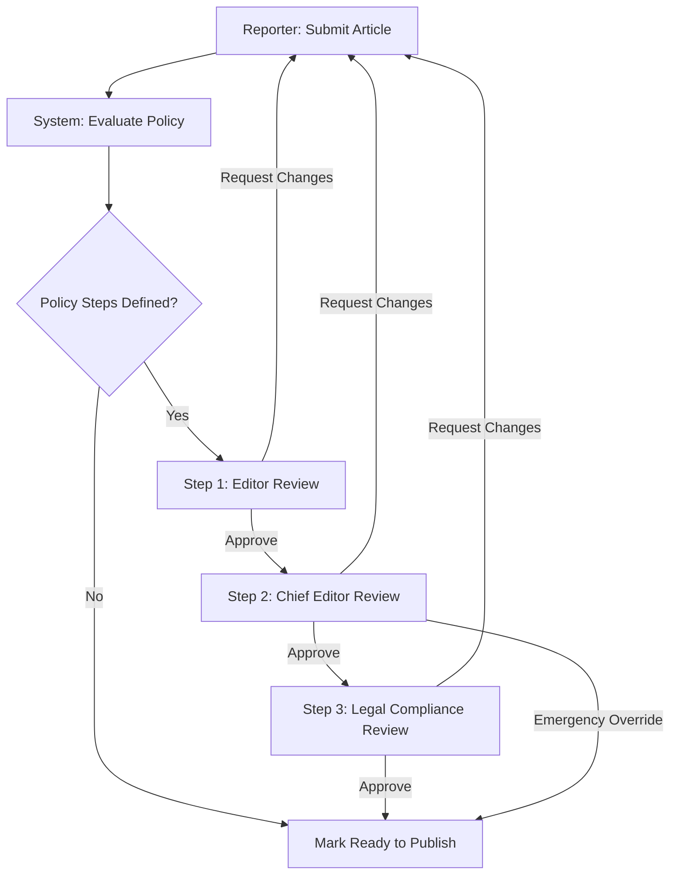

# Approval Workflows

## Purpose
The purpose of the Approval Workflows module is to establish a secure, multi-stage, customizable path for validating and signing off on editorial content before publication. This feature coordinates the transition of articles across different roles—from Reporter to Editor, Chief Editor, and Legal—ensuring content quality, legal compliance, and strict adherence to publication standards.

## Executive Summary
NewsOps Cloud requires a robust editorial approval framework to govern the publishing lifecycle. The system must support configurable, organization-specific multi-step approval pipelines, emergency overrides, detailed audit trails, and custom approval actions (e.g., requesting revisions, scheduling, and signing off). This design document outlines the technical architecture, data model, APIs, workflows, and security considerations required to implement the approval system across the digital publishing tenant fleet.

## Vision
To provide a highly reliable, event-driven approval engine that empowers newsrooms to balance agility with governance. The module will serve as the system of record for the editorial lifecycle, preventing unauthorized modifications, providing audit logs, and facilitating compliance checkouts.

## Scope
The scope of this design document includes:
- Multi-step approval paths (Reporter -> Editor -> Chief Editor -> Legal).
- Workflow rule configurations (sequential, parallel, conditional routing).
- Emergency overrides by authorized administrators.
- API endpoints for managing workflows, actions, and overrides.
- Relational database schema for workflow definitions, runs, steps, and history logs.
- Real-time notification triggers and webhooks for status changes.

This document excludes:
- The actual content-editing UI components (which are covered in other editorial design briefs).
- General notification system delivery implementations (SMS/Email providers).

## Goals
- Support up to 10 sequential or parallel approval steps per workflow definition.
- Guarantee full auditability of all workflow state changes, transitions, and bypass events.
- Allow less than 100ms response time for transition evaluations on typical workloads.
- Support hot-swapping approval policies without breaking active runs of historical articles.

## Functional Requirements
- **Dynamic Policy Configuration**: Administrators can define approval pipelines containing multiple steps, each specifying required roles or specific user assignees.
- **Workflow State Management**: Articles must transition through states: `Draft`, `Pending Approval`, `In Review`, `Approved`, `Changes Requested`, and `Published`.
- **Predefined Routing Paths**: Out-of-the-box support for the standard pipeline:
  1. **Reporter**: Drafting and initial submission.
  2. **Editor**: Copy-editing, style check, and initial validation.
  3. **Chief Editor**: Editorial stance verification, positioning, and scheduling.
  4. **Legal**: Compliance check, defamation validation, and rights review.
- **Override Settings**: Emergency publishing flags must allow Chief Editors or Publisher Admins to bypass steps, requiring a mandatory justification log entry.
- **Custom Actions**: Users can perform actions such as `Approve`, `Request Changes`, `Reject`, and `Reassign`.
- **Automatic Blockers**: Any modifications to an article under active review must immediately suspend the workflow, reset approval steps, and revert the status to `Draft` (unless explicitly configured otherwise).

## Non-Functional Requirements
- **High Availability**: Workflow processing must remain available even if downstream services (like AI checks) fail.
- **Auditing**: Every transition must write a permanent audit entry to a read-only table.
- **Concurrency**: Prevent double-approval race conditions using database-level pessimistic or optimistic locking.
- **Performance**: Workflow routing rules evaluation must take < 50ms using cached policy rules.

## Business Rules
- **Rule 1 (No Self-Approval)**: A user cannot approve their own submission at any subsequent step (e.g., if a Reporter submits an article, and is also an Editor, they cannot approve the Editor step).
- **Rule 2 (Mandatory Legal)**: If an article is flagged with `legal_review_required = TRUE`, the Legal approval stage cannot be bypassed under any standard configuration, including standard overrides (only the Publisher Admin can execute a high-security bypass).
- **Rule 3 (Reversion Scope)**: Rejections with "Request Changes" reset the workflow to the step corresponding to the reporter/author role, invalidating subsequent steps already completed.

## Actors
- **Reporter**: Creates, edits, and submits the article for approval.
- **Editor**: Reviews style, formatting, facts, and structure. Approves or requests changes.
- **Chief Editor**: Reviews overall editorial alignment. Handles layout positioning and final scheduling.
- **Legal Auditor**: Validates compliance, copyright, defamation risks, and regulatory adherence.
- **System Administrator / Publisher Admin**: Configures system-wide approval policies and performs emergency overrides.

## User Stories
### User Stories (At least 3 specific stories)
1. **Custom Workflow Routing**: As an Editor-in-Chief, I want to configure a custom workflow routing rule for high-profile investigative reports that mandates both Senior Editorial and Legal validation, so that our organization is protected from libel claims before publishing.
2. **Requesting Revisions**: As an Editor, I want to return an article to a Reporter with specific inline change requests, so that they can address the corrections and re-submit the article to my queue.
3. **Emergency Override**: As a Publisher Admin, I want to execute an emergency bypass of a pending legal review step during a major breaking news event, so that we can report critical information to the public in real-time, while ensuring the bypass is logged with a detailed reason.

## Acceptance Criteria
- **Criteria 1 (Bypass Logging)**: If an approval step is overridden, the `approval_overrides` table must record the actor's user ID, timestamp, the specific step bypassed, and an explanation text of at least 50 characters.
- **Criteria 2 (Concurrency Lock)**: When two editors approve the same step simultaneously, only the first request must succeed; the second must return a `409 Conflict` error and not duplicate the transition log.
- **Criteria 3 (Self-Approval Blocker)**: The API must reject an approval request with a `400 Bad Request` if the actor performing the approval is the `created_by` author of the associated article.

## Workflows
1. **Initiation**: The Reporter clicks "Submit for Review". The system resolves the tenant's active approval policy.
2. **First Step Evaluation**: The system updates the article status to `Pending Approval`, instantiates an `approval_run`, and activates the first step (Editor review).
3. **Task Notification**: The system publishes an `approval.step.activated` event. An email/Slack notification is dispatched to all users holding the `Editor` role.
4. **Editor Action**:
   - If *Approved*: The system marks the step as `completed` and checks the next step. If Chief Editor is next, the step is activated.
   - If *Changes Requested*: The system transitions the run to `suspended`, sets the article state to `Draft`, and notifies the Reporter.
5. **Final Step Completion**: Once Legal (the final step) approves, the system transitions the run to `completed` and sets the article status to `Ready to Publish`.

## API Design

### Create Approval Policy
- **Endpoint**: `POST /api/v1/approval-policies`
- **Method**: `POST`
- **Request Headers**:
  - `Content-Type: application/json`
  - `Authorization: Bearer <JWT>`
- **Request Payload**:
```json
{
  "name": "Investigative Standard Policy",
  "description": "Standard flow for investigative reporting",
  "is_default": true,
  "steps": [
    {
      "sequence_order": 1,
      "name": "Editorial Copy Edit",
      "required_role": "editor",
      "allow_self_approval": false,
      "auto_approval_conditions": null
    },
    {
      "sequence_order": 2,
      "name": "Chief Editor Stance Review",
      "required_role": "chief_editor",
      "allow_self_approval": false,
      "auto_approval_conditions": null
    },
    {
      "sequence_order": 3,
      "name": "Legal Clearance",
      "required_role": "legal",
      "allow_self_approval": false,
      "auto_approval_conditions": {
        "field": "metadata.libel_risk_flag",
        "operator": "EQUALS",
        "value": "false"
      }
    }
  ]
}
```
- **Response (201 Created)**:
```json
{
  "id": "policy_889d184a_2634_4263_9f14_30a7d976be98",
  "name": "Investigative Standard Policy",
  "is_default": true,
  "created_at": "2026-06-27T22:29:14Z",
  "updated_at": "2026-06-27T22:29:14Z"
}
```

### Action an Approval Request
- **Endpoint**: `POST /api/v1/approval-runs/{run_id}/steps/{step_id}/action`
- **Method**: `POST`
- **Request Headers**:
  - `Content-Type: application/json`
  - `Authorization: Bearer <JWT>`
- **Request Payload**:
```json
{
  "action": "APPROVE",
  "comment": "Editorial edits verify cleanly. Content formatting aligns with style rules."
}
```
- **Response (200 OK)**:
```json
{
  "run_id": "run_04a9d72c_892d_494c_8df9_e71d2b8b9a10",
  "step_id": "step_a64e1c8d_b901_4cb5_ba6f_cde78a6311de",
  "status": "COMPLETED",
  "next_step_id": "step_c4b69d82_e220_41fe_a9f8_210d7a049cb1",
  "article_status": "Pending Approval",
  "actioned_by": "user_e03f0b2f_4102_47bf_be7d_49dbbb1cfdf2",
  "timestamp": "2026-06-27T22:31:00Z"
}
```

### Execute Emergency Override
- **Endpoint**: `POST /api/v1/approval-runs/{run_id}/override`
- **Method**: `POST`
- **Request Headers**:
  - `Content-Type: application/json`
  - `Authorization: Bearer <JWT>`
- **Request Payload**:
```json
{
  "reason": "Breaking news override for public safety warning. Delayed publishing would cause public harm.",
  "bypass_remaining_steps": true
}
```
- **Response (200 OK)**:
```json
{
  "run_id": "run_04a9d72c_892d_494c_8df9_e71d2b8b9a10",
  "status": "OVERRIDDEN",
  "override_id": "ovr_6cf90e1f_0e2b_41cb_a260_d0e495204481",
  "article_status": "Ready to Publish",
  "completed_at": "2026-06-27T22:32:15Z"
}
```

## Database Design

### Schema Tables

#### `approval_policies`
Tracks policy configurations defined for the tenants.
- `id` (UUID, Primary Key, Default: uuid_generate_v4())
- `tenant_id` (UUID, Not Null)
- `name` (VARCHAR(128), Not Null)
- `description` (TEXT)
- `is_default` (BOOLEAN, Default: false)
- `created_at` (TIMESTAMP WITH TIME ZONE, Default: now())
- `updated_at` (TIMESTAMP WITH TIME ZONE, Default: now())

#### `approval_steps`
Configured steps within an approval policy.
- `id` (UUID, Primary Key)
- `policy_id` (UUID, Foreign Key to `approval_policies` ON DELETE CASCADE)
- `sequence_order` (INTEGER, Not Null)
- `name` (VARCHAR(128), Not Null)
- `required_role` (VARCHAR(64), Not Null)
- `allow_self_approval` (BOOLEAN, Default: false)
- `auto_approval_conditions` (JSONB)

#### `approval_runs`
An execution instance of a policy on an article.
- `id` (UUID, Primary Key)
- `tenant_id` (UUID, Not Null)
- `article_id` (UUID, Not Null)
- `policy_id` (UUID, Foreign Key to `approval_policies`)
- `status` (VARCHAR(32)) -- PENDING, COMPLETED, SUSPENDED, OVERRIDDEN, REJECTED
- `created_by` (UUID, Not Null) -- Initiator of approval
- `created_at` (TIMESTAMP WITH TIME ZONE)
- `completed_at` (TIMESTAMP WITH TIME ZONE)

#### `approval_run_steps`
The current runtime state of each step in the active run.
- `id` (UUID, Primary Key)
- `run_id` (UUID, Foreign Key to `approval_runs` ON DELETE CASCADE)
- `sequence_order` (INTEGER, Not Null)
- `name` (VARCHAR(128), Not Null)
- `required_role` (VARCHAR(64), Not Null)
- `status` (VARCHAR(32)) -- PENDING, ACTIVE, COMPLETED, BYPASSED
- `actioned_by` (UUID, Nullable)
- `actioned_at` (TIMESTAMP WITH TIME ZONE, Nullable)
- `comment` (TEXT, Nullable)

#### `approval_overrides`
Log of emergency bypass actions.
- `id` (UUID, Primary Key)
- `run_id` (UUID, Foreign Key to `approval_runs`)
- `user_id` (UUID, Not Null)
- `reason` (TEXT, Not Null)
- `bypassed_steps` (JSONB, Not Null) -- Array of step IDs bypassed
- `created_at` (TIMESTAMP WITH TIME ZONE)

### Indexes
- `idx_approval_policies_tenant` ON `approval_policies (tenant_id, is_default)`
- `idx_approval_runs_article` ON `approval_runs (article_id, status)`
- `idx_approval_run_steps_run` ON `approval_run_steps (run_id, status)`

## UI Design
- **Workflow Track Component**: A horizontal stepper component embedded within the editor panel header. Green nodes indicate verified checks, a pulsing amber ring denotes the current waiting action (e.g. Legal review), and dotted lines indicate pending stages.
- **Review Drawer Panel**: A slide-out panel allowing users to input inline notes, verify pre-publishing heuristics, and click on distinct, role-colored action buttons (`Approve`, `Request Changes`, or `Decline`).
- **Policy Builder Dashboard**: Administrative workspace page built with draggable cards representing review states, allowing custom threshold conditions to trigger optional parallel validation steps.

## Permissions
- `policies:read` - View workflow configurations.
- `policies:write` - Create, edit, and delete approval policies.
- `articles:submit` - Submit articles to the review queue.
- `articles:approve` - Perform approval actions (Approve, Request Changes).
- `articles:override` - Execute emergency bypasses of the approval pipeline.

## Security
- **JWT Claim Validation**: Roles and tenant isolation tokens must match target organization scopes before executing modifications.
- **CSRF Token Verification**: Standard anti-forgery headers checked on every modifying request.
- **Immutable Audit Trail**: Database triggers blocking updates or deletes to the `approval_overrides` and `approval_run_steps` archive tables once finalized.

## Performance
- **Latency Limits**: Write operations (completing a step) must respond in under 120ms at p99.
- **Caching**: Policy metadata caching in Redis with invalidation triggers when administrative updates occur.
- **Target TPS**: Designed to scale to 150 transactions per second under peak system load.

## Monitoring
- **Prometheus Metrics**:
  - `newsops_approval_runs_total` (counter, labeled by tenant, status)
  - `newsops_approval_overrides_total` (counter, labeled by user_id)
  - `newsops_approval_step_duration_seconds` (histogram, tracking latency of actions)
- **Alert Triggers**:
  - Alert if `rate(newsops_approval_overrides_total[5m]) > 5` (Potential credential abuse or workflow failure).
  - Alert if `newsops_approval_step_duration_seconds{quantile="0.95"} > 172800` (Step blocked in active queue for more than 48 hours).

## Logging
- **Format**: Structured JSON.
- **Levels**:
  - `INFO`: Successful step approval or transitions.
  - `WARNING`: Self-approval block events or validation mismatches.
  - `ERROR`: Permission checking failures, db deadlock.
- **Log Context**: Include `tenant_id`, `article_id`, `run_id`, `user_id`, and `ip_address` in all log contexts.

## Error Handling
- **ERR_AUTH_SELF_APPROVAL**: HTTP 400. "User cannot approve their own submission."
- **ERR_WORKFLOW_STATE_CONCURRENCY**: HTTP 409. "The step has already been actioned by another reviewer."
- **ERR_OVERRIDE_JUSTIFICATION_MISSING**: HTTP 400. "Emergency overrides require a valid justification statement (minimum 50 characters)."
- **ERR_ARTICLE_HASH_MISMATCH**: HTTP 422. "The article content was modified outside the approval pipeline. Approval process aborted."

## Edge Cases
- **Concurrent Review Submissions**: Resolved using database transaction locking levels (`SERIALIZABLE`) to block double-approvals.
- **Assignee Role Eviction**: If an active reviewer loses authorization during a run, system triggers automated escalation notify to fallback roles.
- **Network Interruptions**: Transactions are designed for atomic commit, returning full state rollback on failure.

## Future Improvements
- **Machine Learning Auto-Signoff**: Integrate machine learning models to automatically sign off on low-risk, routine syndicated content.
- **Multi-Tenant Global Pipelines**: Allow conglomerate publisher networks to deploy parent policies that child tenants inherit and can only extend, but not loosen.

## Mermaid Diagrams



## References
- [Editorial and CMS Schema](../03-database/editorial_and_cms_schema.md)
- [Audit and History Schema](../03-database/audit_and_history_schema.md)
- [System Architecture](../02-architecture/system_architecture.md)
