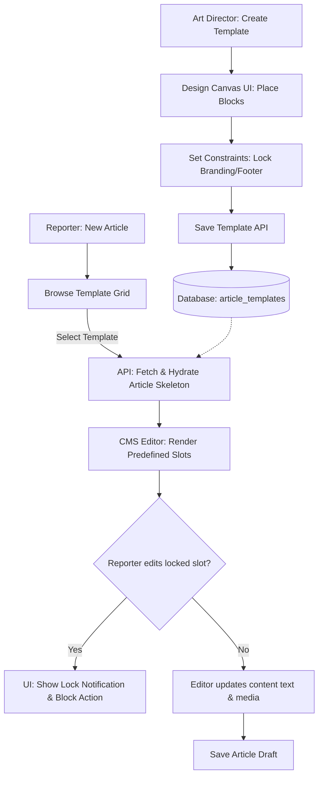

# Article Templates

## Purpose
The Article Templates module provides reporters, design editors, and marketing operations staff with a structured framework to build, manage, and apply standardized layout formats. This includes breaking news cards, newsletter designs, print spreads, and interactive web formats, ensuring visual identity consistency across all channels.

## Executive Summary
Consistent formatting across multiple digital and print mediums is critical for brand authority. This document defines the technical architecture of the Article Templates engine. We specify standard JSON layouts, block locking mechanisms, distribution templates (including Print and Newsletter-specific configurations), API routing, database schema definitions, visual layout builder requirements, and role-based permissions.

## Vision
To establish an intuitive, block-based templating system where editors can instantiate pre-formatted news layouts with a single click, and visual designers can publish standardized, responsive patterns without writing custom code.

## Scope
The scope of this design document includes:
- Custom template definitions and validation schemas.
- Output target layouts (Responsive Web, AMP, Newsletter HTML, PDF/InDesign print exports).
- Dynamic block variables and structural constraints (e.g. locking specific slots).
- Database schemas for layout definition and variable mapping.
- CRUD APIs for template management.

This document excludes:
- The implementation details of headless PDF renderers or physical printing-press integrations.
- CSS/Styling stylesheet parsers (handled by the general theme manager service).

## Goals
- Support rapid template applications with less than 20ms template-to-content hydration latency.
- Achieve 100% compliance with AMP and newsletter structural rules out-of-the-box.
- Enable zero-code drag-and-drop template layout creation for non-technical visual directors.

## Functional Requirements
- **Predefined Layout Schemes**: Native configurations for:
  - *Breaking News Cards*: High-impact, minimal text, prominent image slots, live update flags.
  - *Newsletter Styles*: Compact columns, integrated social sharing banners, editorial intro locks.
  - *Print Layouts*: Exact dimensions, column guidelines, bleed/margin borders, image DPI alerts.
  - *Standard Web/Mobile Layouts*: Flexible grids, related links containers, inline advertisement slots.
- **Visual Block Restrictions**: Allow designers to lock specific slots (e.g., editorial banner, legal footer) to prevent reporters from moving or deleting them.
- **Dynamic Variable Hydration**: Templates define placeholders (e.g., `{{author_name}}`, `{{article_headline}}`, `{{hero_image}}`) resolved at render time.
- **Export Channels**: Standard API options to serialize the hydrated template structures to clean semantic HTML, JSON, or InCopy ICML blocks.
- **Template Creator Editor**: Web workspace for design admins to arrange components, set restrictions, and declare customizable areas.

## Non-Functional Requirements
- **Performance**: Template rendering must run concurrently on edge nodes using lightweight JSON parsing.
- **Extensibility**: Support customization of template JSON schemas without requiring structural changes to the core article table.
- **Validation**: Strict JSON schema validator must run upon template definition uploads to ensure block structural integrity.

## Business Rules
- **Rule 1 (Lock Enforcement)**: Any block tagged with `is_locked = TRUE` cannot be deleted, dragged, or modified in properties by a user with a `Reporter` role.
- **Rule 2 (Tenant Segregation)**: Templates created by a tenant are private to that tenant, unless explicitly shared through the organization's enterprise-level distribution pool.
- **Rule 3 (Archival Fallback)**: If a template is deleted, existing published articles using that template must remain intact by snapshotting the compiled HTML, rather than referencing the live template definition.

## Actors
- **Reporter**: Selects a template to start writing an article, fills in predefined fields, and publishes.
- **Design Editor / Art Director**: Creates template structures, designs the visual layout rules, and assigns constraints.
- **Publisher Admin**: Configures default templates for specific categories (e.g., all sports articles default to standard layout).

## User Stories (At least 3 specific stories)
1. **Selecting a Layout**: As a Reporter, when I cover a fast-developing event, I want to select the "Breaking News Card" template, so that I only fill in a header, summary, and photo, and get it published instantly.
2. **Locking Brand Assets**: As an Art Director, I want to lock the placement and formatting of the brand header and newsletter signup form in our editorial templates, so that reporters cannot accidentally change our brand presentation.
3. **Print Export Validation**: As a Print Production Manager, I want to export an editorial piece using the "Print Standard Page" template, ensuring it maps correctly to the exact margins, columns, and high-resolution assets necessary for the layout editor.

## Acceptance Criteria (At least 3-5 criteria with clear thresholds)
- **Criteria 1 (Layout Validation)**: A template update API request must return `400 Bad Request` if it contains invalid block structures or lacks mandatory variable slots (e.g. missing `main_headline_slot`).
- **Criteria 2 (Role Lock Enforcement)**: When a user with the `Reporter` role attempts to alter a blocked node properties, the CMS block editor must block the operation and return `ERR_TEMPLATE_SLOT_LOCKED`.
- **Criteria 3 (Hydration Speed)**: Liquid or handlebars-style replacement of text variables in standard 100KB article layouts must complete in under 5ms.

## Workflows
1. **Template Creation**: The Design Editor accesses the Template Creator UI, builds a multi-column structure, locks the footer banner, and saves it as "Standard Feature".
2. **Storage**: The API validates the structural schema and saves it to the `article_templates` database.
3. **Article Initialization**: The Reporter clicks "New Article" and chooses "Standard Feature" from the template selection dialog.
4. **Hydration and Content Entry**: The system creates a blank article skeleton mapped to the template. The block editor opens with pre-placed placeholder fields.
5. **Editing restrictions**: The Reporter fills the slots. Attempts to drag or remove locked banner components are rejected by the editor UI.
6. **Publication compiling**: Upon publication, the system compiles the content blocks against the template's target structures (web, print, email) and routes them to distribution channels.

## API Design

### Create Layout Template
- **Endpoint**: `POST /api/v1/templates`
- **Method**: `POST`
- **Request Headers**:
  - `Content-Type: application/json`
  - `Authorization: Bearer <JWT>`
- **Request Payload**:
```json
{
  "name": "Standard Newsletter Template",
  "category": "NEWSLETTER",
  "layout_definition": {
    "version": "1.0.0",
    "structure": [
      {
        "id": "slot_header",
        "type": "branding_header",
        "is_locked": true,
        "properties": {}
      },
      {
        "id": "slot_headline",
        "type": "text_input",
        "is_locked": false,
        "placeholder": "Enter Newsletter Headline..."
      },
      {
        "id": "slot_editorial_intro",
        "type": "rich_text",
        "is_locked": false,
        "placeholder": "Write editorial greeting..."
      },
      {
        "id": "slot_signup_banner",
        "type": "cta_button",
        "is_locked": true,
        "properties": {
          "text": "Subscribe to full coverage",
          "link_target": "https://newsops.cloud/subscribe"
        }
      }
    ]
  }
}
```
- **Response (201 Created)**:
```json
{
  "id": "tpl_992c3a4f_b901_4de8_aa03_fb63102bb100",
  "name": "Standard Newsletter Template",
  "category": "NEWSLETTER",
  "created_at": "2026-06-27T22:38:00Z"
}
```

### Apply Template to Article
- **Endpoint**: `POST /api/v1/articles/{article_id}/apply-template`
- **Method**: `POST`
- **Request Headers**:
  - `Content-Type: application/json`
  - `Authorization: Bearer <JWT>`
- **Request Payload**:
```json
{
  "template_id": "tpl_992c3a4f_b901_4de8_aa03_fb63102bb100"
}
```
- **Response (200 OK)**:
```json
{
  "article_id": "art_221d567c_b910_41fe_be72_bb79a1f298c1",
  "applied_template_id": "tpl_992c3a4f_b901_4de8_aa03_fb63102bb100",
  "status": "HYDRATED",
  "blocks_count": 4,
  "updated_at": "2026-06-27T22:39:15Z"
}
```

## Database Design

### Schema Tables

#### `article_templates`
Contains the structural definition and locking permissions of the visual template configurations.
- `id` (UUID, Primary Key)
- `tenant_id` (UUID, Not Null)
- `name` (VARCHAR(128), Not Null)
- `category` (VARCHAR(32), Not Null) -- e.g., BREAKING, NEWSLETTER, PRINT, WEB
- `layout_definition` (JSONB, Not Null) -- Schema of blocks, variables, and properties
- `is_active` (BOOLEAN, Default: true)
- `created_by` (UUID, Not Null)
- `created_at` (TIMESTAMP WITH TIME ZONE)
- `updated_at` (TIMESTAMP WITH TIME ZONE)

#### `user_templates`
Saves configurations customized by individual newsroom reporters or sub-editors.
- `id` (UUID, Primary Key)
- `tenant_id` (UUID, Not Null)
- `user_id` (UUID, Not Null)
- `parent_template_id` (UUID, Foreign Key to `article_templates` ON DELETE CASCADE)
- `custom_name` (VARCHAR(128), Not Null)
- `layout_overrides` (JSONB) -- Override default parameters (e.g. customized widgets list)
- `created_at` (TIMESTAMP WITH TIME ZONE)

### Indexes
- `idx_templates_tenant_cat` ON `article_templates (tenant_id, category, is_active)`
- `idx_user_templates_lookup` ON `user_templates (user_id, tenant_id)`

## UI Design
- **Template Selector Grid**: A visual card-based interface displayed upon initializing new articles. Offers filters by type (web, print, email) and displays thumbnail previews of layouts.
- **Locked Block Indicator**: Inside the CMS block editor, locked slots are bound with red dotted outlines and lock icons. Clicking these displays a message explaining that this area is managed by the organization style sheet.
- **Drag-and-Drop Designer Canvas**: A standalone workspace for editors. Includes a left sidebar panel with generic block types (paragraph, video, quote block, CTA, advertisement block) that can be dropped onto a multi-column visual grid.
- **Property Settings Panel**: A floating drawer exposing parameters for selected slots, allowing designers to toggle variables, declare placeholder instructions, and set locking settings.

## Permissions
- `templates:read` - Browse and view active layouts.
- `templates:write` - Create, edit, dynamic templates and block permissions.
- `templates:apply` - Hydrate articles with layouts.
- `templates:delete` - Archive or remove template layout records.

## Security
- **JSON Schema Validation**: Standard schemas enforce validation constraints on definitions to block malicious code injection (e.g. executable script elements within block properties).
- **CSS Sanitization**: CSS style declarations are run through a sanitize parse pipeline to strip expressions or imports that could allow cross-site scripting (XSS).
- **Tenant Validation**: The backend confirms the target client's auth profile matches the template's owner tenant ID before hydration.

## Performance
- **Hydration Time**: Liquid compile and replacement of template slots in under 5ms.
- **Caching**: Templates are stored in Redis (`template:{id}`) with write-through updates, resulting in < 5ms read times.
- **Target TPS**: Built to handle 300 page generation loads per second when compiling templates.

## Monitoring
- **Prometheus Metrics**:
  - `newsops_templates_hydration_total` (counter, labeled by category)
  - `newsops_templates_hydration_latency_seconds` (histogram)
  - `newsops_templates_created_total` (counter)
- **Alert Triggers**:
  - Alert if `newsops_templates_hydration_latency_seconds{quantile="0.99"} > 0.05` (Slow markdown templates hydration evaluation).

## Logging
- **Format**: JSON.
- **Levels**:
  - `INFO`: Template applied, layout created.
  - `WARNING`: Validation rule bypassed, attempted violation of template block rules.
  - `ERROR`: JSON syntax validation failed, hydration parse error.
- **Log Context**: Include `tenant_id`, `user_id`, `template_id`, `article_id`.

## Error Handling
- **ERR_TEMPLATE_VALIDATION_FAILED**: HTTP 400. "The visual layout configuration is structurally invalid."
- **ERR_TEMPLATE_SLOT_LOCKED**: HTTP 403. "The requested block cannot be moved or deleted due to system style lock settings."
- **ERR_TEMPLATE_NOT_FOUND**: HTTP 404. "The selected layout reference does not exist or has been archived."

## Edge Cases
- **Archiving in-use Templates**: If an editor deletes a template, the system does not purge references from existing drafts; it flags the template as `is_active = FALSE`, allowing legacy edits to finish while blocking new creations.
- **Media Slot Constraints**: If a print layout requires a high-DPI (300 DPI) photo, and a reporter uploads a low-res web asset, the CMS editor raises a blocking warning rather than silently formatting it.
- **Theme Overrides**: In cases where global brand sheets change CSS variables, templates automatically inherit updated values dynamically.

## Future Improvements
- **Automated A/B Testing**: Automatically deploy variations of template layouts (e.g., varying advertisement slot configurations) and monitor click-through rates.
- **InDesign Sync Plugin**: Create a bidirectional sync agent to import print template layouts directly from InDesign files.

## Mermaid Diagrams



## References
- [Editorial and CMS Schema](../03-database/editorial_and_cms_schema.md)
- [Storage Architecture](../02-architecture/storage_architecture.md)
- [Design Patterns](../02-architecture/design_patterns.md)
