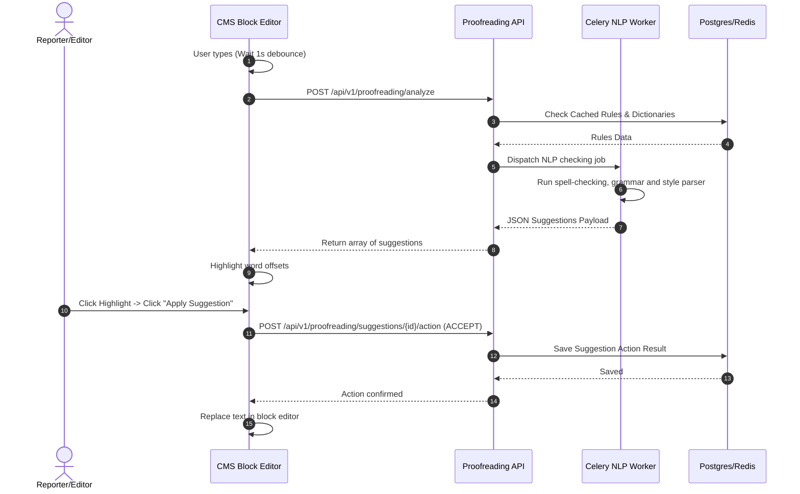

# Automated Proofreading

## Purpose
The Automated Proofreading system provides reporters and editors with context-aware, real-time grammar checking, spelling verification, style guide validation, and tone adjustments. By incorporating machine learning engines and rule-based compliance filters, the module ensures all published content adheres to corporate editorial policies and high-quality journalistic standards.

## Executive Summary
This design document details the system specifications for the Automated Proofreading engine. The service evaluates draft copy against a configurable dictionary, systemic style guidelines (e.g., AP style, localized house style sheets), and tone metrics (e.g., neutrality, readability). We define the APIs for analysis submission, database schemas for tracking correction logs and style rule sets, monitoring patterns, and user interface workflows for editor resolution.

## Vision
To establish an ambient, low-latency checking system integrated natively within the block editor, minimizing manual editor workload and protecting against embarrassing grammar, spelling, or factual style violations.

## Scope
The scope of this design document includes:
- Syntax, grammar, spelling, and style rule parsing.
- Integration endpoints for local or cloud Large Language Models (LLMs) and NLP libraries (e.g., LanguageTool, custom rules).
- Actionable suggestion schema and user feedback loops (Accept/Reject).
- Tenant-specific style rule databases.
- Real-time text block checking.

This document excludes:
- AI safety guardrails for hate speech and harassment, which are governed in the main AI Moderation and Safety specifications.
- Deep machine translation architectures.

## Goals
- Provide full document analysis execution in under 800ms for drafts up to 2,000 words.
- Reduce post-publish typo correction incidents by 75% across the newsroom.
- Offer 99.9% uptime for the check validation service.

## Functional Requirements
- **Contextual Spelling and Grammar**: Run multi-lingual tokenizers that check for common typographic mistakes, contextual homophone errors, and advanced subject-verb agreement.
- **Style Guide Compliance**: Automatically flag non-preferred expressions or terms (e.g., using "e-mail" instead of "email" according to AP Style updates) and suggest alternatives.
- **Tone Profile Tuning**: Analyze the text against target audiences (e.g., Informative, Opinion, Analytical, Sensational) and flag sentences displaying excessive bias or inappropriate tone.
- **Inline Correction Interface**: Yield specific JSON-formatted suggestions containing error ranges (character offsets), categories, replacement arrays, and explanatory justifications.
- **Custom Dictionaries**: Support tenant-wide and user-specific dictionary exclusions (e.g., local names, technical terminology, proprietary brands) to prevent false positives.

## Non-Functional Requirements
- **Latency**: Inline keystroke debounce matching rules must return in < 200ms for single paragraph blocks.
- **Scalability**: Support horizontal scaling of tokenizer tasks via a celery/redis queue backend.
- **Robustness**: If the third-party proofreading API timeouts or is down, gracefully fallback to a simple local dictionary checker without interrupting the editor.

## Business Rules
- **Rule 1 (Opt-Out Bypass)**: While authors can configure suggestions to ignore individually, a Tenant Admin can designate specific Style rules as "Blocking" (which prevents publication if violated).
- **Rule 2 (Audit Feedback)**: Rejecting a stylistic correction must prompt an optional feedback input to flag potential false positives, feeding back into custom dictionary rules.
- **Rule 3 (Version Consistency)**: The suggestions generated must bind to a specific article content checksum; if the article is edited, outdated suggestions are discarded immediately.

## Actors
- **Reporter**: Writes draft content, views inline annotations, and decides to accept or reject adjustments.
- **Editor**: Performs final reviews of flagged errors, edits style rule configurations, and handles custom dictionary extensions.
- **System NLP Worker**: Asynchronous worker node parsing text packages and executing linguistic models.

## User Stories (At least 3 specific stories)
1. **Interactive Grammar Correction**: As a Reporter, I want to see squiggly red and blue lines under grammatical mistakes or spelling errors in my block editor, so that I can click them and immediately substitute the correct text.
2. **Style Violations**: As an Editor, I want the system to check if an investigative piece uses non-inclusive language or formatting inconsistent with our standard style sheet, so that I can maintain professional publication consistency.
3. **Tone Consistency Warning**: As an Editorial Lead, I want a warnings panel showing if a breaking news wire has an overly opinionated tone, so that we can adjust it to maintain journalistic neutrality before pushing to social feeds.

## Acceptance Criteria (At least 3-5 criteria with clear thresholds)
- **Criteria 1 (Linguistic Engine Latency)**: For a block of 300 words, the suggestion service must respond with correction payloads within 250ms at p95.
- **Criteria 2 (Suggestion Accuracy)**: The proofreading engine must map precise text spans (`start_char` to `end_char`) matching the exact characters to replace, without shifting offsets.
- **Criteria 3 (Style Flag Enforcement)**: High-severity style errors flagged as "Block Publication" must set the article validation state to `FAILED` and prevent transition out of `Draft` status.

## Workflows
1. **Keystroke Debounce**: The user writes in the CMS Editor. After a 1-second idle debounce, the editor sends the modified block payload to the API.
2. **Task Processing**: The API routes the text block to an NLP validation queue.
3. **Linguistic Checking**: The engine runs matching algorithms:
   - Dictionary lookup (Spelling).
   - Rule-based parser (Style Guide).
   - LLM/NLP analysis (Grammar & Tone).
4. **Suggestions Assembly**: The service collects suggestions, formats them into standard offsets, and returns the list to the client.
5. **Rendering and User Action**: The CMS Editor highlights matching ranges. The user clicks on the range:
   - *Accept*: The editor updates the text block range with the chosen replacement.
   - *Reject*: The editor removes the highlight and notifies the database to log the suggestion as ignored.

## API Design

### Submit Text Block for Analysis
- **Endpoint**: `POST /api/v1/proofreading/analyze`
- **Method**: `POST`
- **Request Headers**:
  - `Content-Type: application/json`
  - `Authorization: Bearer <JWT>`
- **Request Payload**:
```json
{
  "article_id": "art_776d54d2_c45a_4821_a29e_cb4c3d82a101",
  "block_id": "blk_a1a2a3_b4b5_c6c7",
  "text": "The government has not made no decision regarding the new tax policy yet. They are planning to meet on tomorow.",
  "language": "en-US",
  "tone_target": "NEUTRAL"
}
```
- **Response (200 OK)**:
```json
{
  "article_id": "art_776d54d2_c45a_4821_a29e_cb4c3d82a101",
  "block_id": "blk_a1a2a3_b4b5_c6c7",
  "suggestions": [
    {
      "id": "sug_01a2b3c4_5678",
      "type": "GRAMMAR",
      "severity": "MEDIUM",
      "message": "Double negative detected: 'not made no'.",
      "original_text": "not made no",
      "start_char": 19,
      "end_char": 30,
      "replacements": ["made any", "made no"],
      "rule_id": "RULE_DOUBLE_NEG"
    },
    {
      "id": "sug_02b3c4d5_6789",
      "type": "SPELLING",
      "severity": "HIGH",
      "message": "Possible spelling mistake: 'tomorow'.",
      "original_text": "tomorow",
      "start_char": 99,
      "end_char": 106,
      "replacements": ["tomorrow"],
      "rule_id": "RULE_DICT_EN_US"
    }
  ]
}
```

### Action a Suggestion
- **Endpoint**: `POST /api/v1/proofreading/suggestions/{suggestion_id}/action`
- **Method**: `POST`
- **Request Headers**:
  - `Content-Type: application/json`
  - `Authorization: Bearer <JWT>`
- **Request Payload**:
```json
{
  "action": "ACCEPT",
  "selected_replacement": "tomorrow",
  "feedback_comment": null
}
```
- **Response (200 OK)**:
```json
{
  "suggestion_id": "sug_02b3c4d5_6789",
  "status": "ACCEPTED",
  "actioned_by": "user_e03f0b2f_4102_47bf_be7d_49dbbb1cfdf2",
  "timestamp": "2026-06-27T22:35:10Z"
}
```

## Database Design

### Schema Tables

#### `proofreading_rules`
Defines active checks, including spelling dictionaries and style compliance flags.
- `id` (UUID, Primary Key)
- `tenant_id` (UUID, Not Null) -- Support multi-tenancy configurations
- `code` (VARCHAR(64), Unique, Not Null) -- e.g., STYLE_NO_EMAIL_HYPHEN
- `name` (VARCHAR(128), Not Null)
- `description` (TEXT)
- `rule_type` (VARCHAR(32)) -- SPELLING, GRAMMAR, STYLE, TONE
- `severity` (VARCHAR(16)) -- LOW, MEDIUM, HIGH, BLOCKER
- `pattern` (TEXT) -- Regular expressions, NLP token structures, or LLM evaluation parameters
- `is_enabled` (BOOLEAN, Default: true)
- `created_at` (TIMESTAMP WITH TIME ZONE)

#### `proofreading_runs`
Captures historical execution metrics.
- `id` (UUID, Primary Key)
- `tenant_id` (UUID, Not Null)
- `article_id` (UUID, Not Null)
- `triggered_by` (UUID)
- `word_count` (INTEGER)
- `latency_ms` (INTEGER)
- `suggestions_count` (INTEGER)
- `created_at` (TIMESTAMP WITH TIME ZONE)

#### `proofreading_suggestions`
Saves generated suggestions and traces their action outcomes.
- `id` (UUID, Primary Key)
- `run_id` (UUID, Foreign Key to `proofreading_runs` ON DELETE CASCADE)
- `rule_id` (UUID, Foreign Key to `proofreading_rules`)
- `type` (VARCHAR(32)) -- GRAMMAR, SPELLING, STYLE, TONE
- `message` (TEXT)
- `original_text` (TEXT)
- `start_char` (INTEGER)
- `end_char` (INTEGER)
- `replacements` (JSONB) -- Array of strings
- `status` (VARCHAR(16)) -- GENERATED, ACCEPTED, REJECTED, EXPIRED
- `actioned_by` (UUID, Nullable)
- `actioned_at` (TIMESTAMP WITH TIME ZONE, Nullable)
- `feedback_comment` (TEXT, Nullable)

### Indexes
- `idx_proofreading_rules_tenant`: `(tenant_id, is_enabled)`
- `idx_proofreading_runs_article`: `(article_id, created_at)`
- `idx_proofreading_sug_run`: `(run_id, status)`

## UI Design
- **Inline Highlights**: Suggestions are marked in the text editor body using underlined styling (red for typos, blue for style mismatches, purple for tone alerts).
- **Suggestion Popover Context**: Clicking a highlighted segment triggers a popover showing the recommended change, explanation context, and button controls: `Apply`, `Ignore`, and `Add to Dictionary`.
- **Proofreading Sidebar Panel**: A right-side panel that calculates the general article readability grade (e.g. Flesch-Kincaid score) and lists all remaining unresolved problems.
- **Style Configurations Admin Page**: Tenant-wide preferences panel to configure the style rules (e.g. toggle AP Style vs. Oxford Style, add forbidden words, manage custom abbreviations).

## Permissions
- `proofread:analyze` - Submit drafts to the linguistic check service.
- `proofread:action` - Accept, reject, or comment on corrections.
- `proofread:rules_manage` - Adjust styles, dictionary rules, and blocking flags.

## Security
- **Input Sanitization**: Content payloads are parsed into AST blocks, escaping HTML attributes to protect from XSS injections when rendering suggestions.
- **Rate Limiting**: Keystroke checks use a rate-limit system configured per tenant to limit upstream AI pricing spikes.
- **Authentication**: All endpoints restrict access to valid CMS session holder keys (validated JWT).

## Performance
- **Block Check Target Latency**: < 150ms for blocks under 200 words.
- **Full Document Analysis**: < 800ms for 2,000 words.
- **Caching**: Dictionary lists and style guide rules are cached in Redis (`tenant:{id}:rules_cache`) to avoid database lookup hits.

## Monitoring
- **Prometheus Metrics**:
  - `newsops_proofread_runs_total` (counter, labeled by tenant)
  - `newsops_proofread_suggestions_total` (counter, labeled by type, severity)
  - `newsops_proofread_latency_seconds` (histogram)
- **Alert Triggers**:
  - Alert if `rate(newsops_proofread_runs_total[5m]) > 0 AND newsops_proofread_latency_seconds{quantile="0.95"} > 2.0` (Proofread worker delay).

## Logging
- **Format**: Structured JSON.
- **Levels**:
  - `INFO`: Proofread request finished, suggesting counts.
  - `WARNING`: NLP service fallback occurred, rule config mismatch.
  - `ERROR`: Tokenizer parsing error.
- **Log Context**: Include `tenant_id`, `article_id`, `nlp_engine`, and `latency`.

## Error Handling
- **ERR_PROOFREAD_ENGINE_TIMEOUT**: HTTP 504. "Linguistic analyzer did not reply in time; falling back to offline check."
- **ERR_INVALID_OFFSET_RANGE**: HTTP 400. "The request offsets do not match the target document length."
- **ERR_DICTIONARY_WRITE_DENIED**: HTTP 403. "Insufficient rights to add words to tenant global dictionary."

## Edge Cases
- **Stale Offsets**: If a user is rapidly writing, suggestions returned for an older keystroke hash may target offsets that have shifted. The editor front-end runs a diff-match-patch offset tracking algorithm to adjust or discard suggestions dynamically.
- **Unicode Surrogate Pairs**: Multi-byte characters (emojis, mathematical symbols) can corrupt offset pointers. Tokenizers use UTF-8 byte boundary alignment counters to guarantee index safety.
- **Simultaneous Collaborative Edits**: In collaborative modes, suggestion ranges are pinned to specific block identifiers rather than global page offsets.

## Future Improvements
- **Automatic Multi-Language Swapping**: Automatically switch rule packages depending on block-level detected language metadata.
- **Custom Style ML Models**: Fine-tune custom sequence-to-sequence models trained on the tenant's own high-quality editorial history to predict brand-matching corrections.

## Mermaid Diagrams



## References
- [Editorial and CMS Schema](../03-database/editorial_and_cms_schema.md)
- [AI Moderation and Safety](../04-ai/ai_moderation_safety.md)
- [AI Memory Architecture](../04-ai/ai_memory_architecture.md)
