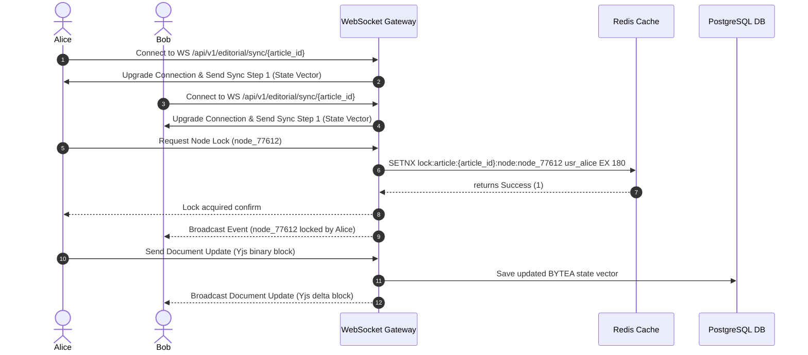

# Collaborative Editor Architecture

## Purpose
This document specifies the technical design, architectural patterns, and communication protocols for the real-time collaborative rich-text editor within the NewsOps Cloud digital publishing platform.

## Executive Summary
The NewsOps Cloud collaborative editor enables multiple remote authors, editors, and reviewers to concurrently compose and edit articles. Based on the Tiptap/ProseMirror framework and powered by Yjs Conflict-free Replicated Data Types (CRDTs) over WebSockets, the system maintains document consistency across distributed clients. It incorporates real-time cursor/selection syncing, block-level node locking to manage operational boundaries, and automatic local-first state caching via browser-level IndexedDB.

## Vision
To establish a zero-friction, multi-tenant editing workspace that matches the responsiveness of desktop word processors while ensuring robust data integrity, auditability, and immediate sync speeds under suboptimal network conditions.

## Scope
The scope of this architecture covers:
*   Frontend integration of ProseMirror, Tiptap, and Yjs.
*   WebSocket gateway design for broadcasting document state vectors and updates.
*   Node-locking API specifications for locking document nodes (such as specific paragraph or media blocks).
*   Selection syncing schemas for real-time cursor presence mapping.
*   Interactions with document storage and persistence layers.

## Goals
*   **Sub-100ms Synchronization**: Keep localized peer-to-peer synchronization latency under 100ms under standard network conditions (RTT <= 50ms).
*   **Conflict Resolution**: Employ Yjs-based CRDTs to resolve typing conflicts deterministically without server-side compute overhead.
*   **Block-Level Isolation**: Enable explicit block-locking APIs so that specific layout segments can be reserved for single-user edit rights during compound publication layouts.

## Functional Requirements
*   **Real-time Collaborative Composition**: Multiple users must be able to type, delete, and style text in the same document simultaneously.
*   **Collaborative Presence Display**: The editor must render colored carets and labels indicating the exact cursor position and selection range of each active user.
*   **Granular Block-Locking**: Users must be able to lock a specific node (e.g., an image block or a pull quote block) to prevent edit collisions.
*   **Automatic Offline Syncing**: The editor must cache document changes locally in browser memory (IndexedDB) during network disconnects and merge them back using Yjs state vectors upon reconnection.

## Non-Functional Requirements
*   **Connection Scalability**: The WebSocket gateway must sustain at least 10,000 concurrent active connections per server node.
*   **Data Integrity**: Document updates must be processed transactionally, preventing database commits of malformed or invalid ProseMirror document schemas.
*   **Browser Interoperability**: The editor component must maintain full compatibility across Chrome (>=90), Safari (>=14), Firefox (>=88), and Edge (>=90).

## Business Rules
*   **Single-Ownership of Nodes**: A node-lock is exclusive. No other user can modify a locked block until it is unlocked or the session times out.
*   **Lock Idle Expiration**: Node locks automatically expire and release after 180 seconds of user inactivity.
*   **Save and Publish Segregation**: Local modifications sync immediately across editing users, but only authorized editors can commit edits to the main database staging branch.

## Actors
*   **Reporter/Writer**: Concurrently writes copy, embeds media, and formats headers.
*   **Editor**: Conducts reviews, edits copy live, adds block locks, and approves paragraphs.
*   **WebSocket Gateway Service**: Manages client connection states and routes frame payloads.
*   **CMS Persistence Service**: Listens for debounced document saves and commits Y-Docs to PostgreSQL.

## User Stories
1.  As a reporter, I want to edit an article simultaneously with my editor so that we can refine a breaking story under a tight deadline without overriding each other's work.
2.  As a layout designer, I want to lock a specific media block in the editor so that copywriters do not accidentally replace the hero image while I am configuring its focal crop point.
3.  As an editor working in transit, I want my edits to be saved locally when I enter a tunnel, and synchronized automatically when my connection is restored.

## Acceptance Criteria
*   **Synchronization Speed**: Updates made by User A must render on User B's screen in less than 150ms over a connection with <= 50ms latency.
*   **Cursor Tracking Accuracy**: Cursor locations must correspond exactly to the underlying ProseMirror node positions across different screen viewports.
*   **Node-Lock Verification**: Locked nodes must reject all keystrokes and API mutations from users other than the lock holder, returning a `403 Forbidden` response.

## Workflows
1.  **WebSocket Handshake and Sync Workflow**:
    *   Client opens the article editor interface.
    *   Client requests WebSocket connection via the gateway: `WS /api/v1/editorial/sync/{article_id}`.
    *   Gateway validates JWT. Upon success, connection upgrades.
    *   Client sends Yjs `sync-step-1` message containing local state vector.
    *   Server replies with Yjs `sync-step-2` containing missing updates, followed by server state vector.
    *   Both client and server reach synchronization sync-step-complete.
2.  **Block-Locking Workflow**:
    *   User selects a specific block (e.g., node ID `node_9872`).
    *   Client sends a request `POST /api/v1/editorial/lock` to lock this node.
    *   Server checks database for active lock on `node_9872`.
    *   If no lock exists, server creates a lock in Redis with a 180-second TTL.
    *   Server broadcasts a `lock-acquired` event over WebSockets to all connected peers.
    *   Client UI renders the node in a read-only state for other users.

## API Design

### WebSocket Message Protocol
Clients communicate with the editor backend via WebSocket binary frames or JSON frames depending on the protocol type. Below is the JSON representation for synchronization metadata and cursor presence.

#### WebSocket Handshake Request
```http
GET /api/v1/editorial/sync/123e4567-e89b-12d3-a456-426614174000/connect HTTP/1.1
Host: ws.newsops.cloud
Upgrade: websocket
Connection: Upgrade
Sec-WebSocket-Key: dGhlIHNhbXBsZSBub25jZQ==
Sec-WebSocket-Version: 13
Authorization: Bearer <JWT_TOKEN>
```

#### Sync Frame: Yjs Update (Binary wrapped in JSON base64)
```json
{
  "type": "yjs-update",
  "payload": "AQd1cGRhdGUSGBYBCQABAgMEBQYHCAkKCwwNDg8QERIT"
}
```

#### Presence Frame: Selection and Caret Sync
```json
{
  "type": "presence",
  "payload": {
    "user_id": "usr_99876",
    "name": "Jane Doe",
    "color": "#FF5733",
    "anchor": 154,
    "head": 162,
    "active_node_id": "node_77612"
  }
}
```

### REST Endpoints for Lock Management

#### Request Node Lock
```http
POST /api/v1/editorial/locks
Host: cms.newsops.cloud
Content-Type: application/json
Authorization: Bearer <JWT_TOKEN>

{
  "article_id": "123e4567-e89b-12d3-a456-426614174000",
  "node_id": "node_77612",
  "client_id": "client_abc123"
}
```
**Response:**
```json
{
  "lock_id": "lock_9983716",
  "article_id": "123e4567-e89b-12d3-a456-426614174000",
  "node_id": "node_77612",
  "acquired_by": "usr_99876",
  "expires_at": "2026-06-27T22:33:14Z"
}
```

#### Release Node Lock
```http
DELETE /api/v1/editorial/locks/lock_9983716
Host: cms.newsops.cloud
Authorization: Bearer <JWT_TOKEN>
```
**Response:**
```json
{
  "status": "success",
  "message": "Lock on node node_77612 has been successfully released."
}
```

## Database Design
The collaborative backend uses PostgreSQL for persistence and Redis for fast lock state management.

### PostgreSQL: Yjs Document Binary Storage
```sql
CREATE TABLE IF NOT EXISTS editor_y_documents (
    article_id UUID PRIMARY KEY,
    tenant_id UUID NOT NULL,
    y_doc_state BYTEA NOT NULL,
    version INT NOT NULL DEFAULT 1,
    updated_at TIMESTAMP WITH TIME ZONE DEFAULT CURRENT_TIMESTAMP
);

CREATE INDEX idx_y_docs_tenant ON editor_y_documents (tenant_id);
```

### PostgreSQL: ProseMirror Node Registry (Flat Document Snapshot)
```sql
CREATE TABLE IF NOT EXISTS document_nodes (
    node_id VARCHAR(64) PRIMARY KEY,
    article_id UUID NOT NULL REFERENCES editor_y_documents(article_id) ON DELETE CASCADE,
    node_type VARCHAR(32) NOT NULL,
    content JSONB NOT NULL,
    created_at TIMESTAMP WITH TIME ZONE DEFAULT CURRENT_TIMESTAMP,
    updated_at TIMESTAMP WITH TIME ZONE DEFAULT CURRENT_TIMESTAMP
);

CREATE INDEX idx_doc_nodes_article ON document_nodes (article_id);
```

### Redis Schema for Node Locks
*   **Key**: `lock:article:{article_id}:node:{node_id}`
*   **Value**: `usr_99876` (ID of the holding user)
*   **TTL**: 180 seconds

## UI Design
The Tiptap-based editor canvas integrates collaborative elements:
*   **Active Users List**: Displayed in the top right corner with matching avatar colors.
*   **Remote Cursor Rendering**: A vertical colored bar with a floating name tag that fades after 3 seconds of inactivity.
*   **Locked Nodes visual treatment**: Locked blocks feature a dotted border matching the lock holder's color, alongside a small lock icon. In this state, editing functions inside the block are disabled for non-holders.

## Permissions
*   `articles:edit:collaborative`: Required to establish a WebSocket sync connection.
*   `articles:lock:create`: Grants permission to acquire block locks.
*   `articles:lock:delete`: Allows administrators or team leads to force-release locks held by other users.

## Security
*   **Authentication**: WebSocket connections must use a JWT passed via query parameters or a ticket authorization mechanism.
*   **Input Validation**: Rich text contents must be parsed and validated against the system's strict ProseMirror Schema definition to prevent arbitrary HTML or XSS injection.
*   **CSRF Prevention**: WebSocket connection requests must enforce strict Origin checks at the gateway layer.

## Performance
*   **Synchronization RTT**: Server message parsing and rebroadcast time must stay below 5ms.
*   **Target TPS**: WebSocket gateway must support 2,500 messages/sec per node.
*   **Redis Latency**: Lock checks and sets must be completed in under 2ms.

## Monitoring
*   `newsops_websocket_active_connections`: Gauge metric tracking active connections.
*   `newsops_websocket_message_latency_seconds`: Histogram tracking processing latency of updates.
*   `newsops_editor_lock_acquisitions_total`: Counter tracking node lock executions.

## Logging
```json
{
  "timestamp": "2026-06-27T22:31:00Z",
  "level": "INFO",
  "logger": "com.newsops.editorial.editor.WebSocketGateway",
  "message": "User joined document session",
  "context": {
    "article_id": "123e4567-e89b-12d3-a456-426614174000",
    "user_id": "usr_99876",
    "connection_id": "conn_f8391823"
  }
}
```

## Error Handling
| Error Code | HTTP Status / WS Code | Customer-Facing Message |
| :--- | :--- | :--- |
| `ERR_NODE_LOCKED` | 403 Forbidden | This paragraph is currently locked for editing by Jane Doe. |
| `ERR_WS_AUTH_FAILED` | 4401 WS Close Code | Authentication failed. Re-authenticate to access real-time collaboration. |
| `ERR_LOCK_TIMEOUT` | 408 Timeout | The request to acquire the lock timed out. Please try again. |

## Edge Cases
*   **Simultaneous Lock Requests**: If two users attempt to lock the same node within the exact same millisecond, the Redis `SETNX` command resolves the race condition atomically. Only the first client gets the lock; the second client is rejected.
*   **Split-Brain Connectivity**: If a user is disconnected and edits a segment while offline, and that segment is edited by someone else online: upon reconnection, Yjs merges the edits. However, if conflict resolution results in semantic ambiguity, the system flags the paragraph with a visual conflict overlay.

## Future Improvements
*   **P2P WebRTC Fallback**: Integrate WebRTC for direct client-to-client delta transfers to offload WebSocket server compute during heavy newsrooms operations.
*   **AI Co-Writing Locks**: Establish system-level non-human locks for AI agents generating content suggestions inside designated editor slots.

## Mermaid Diagrams


## References
*   [Editorial Index Map](index.md)
*   [Database Schema Specs](../03-database/editorial_and_cms_schema.md)
*   [User Roles and Persons](../01-business/customer_personas.md)
