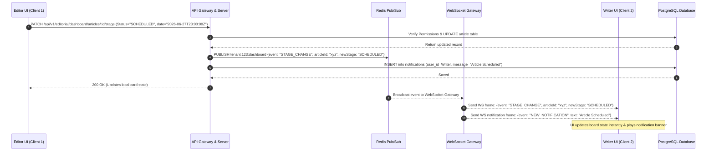
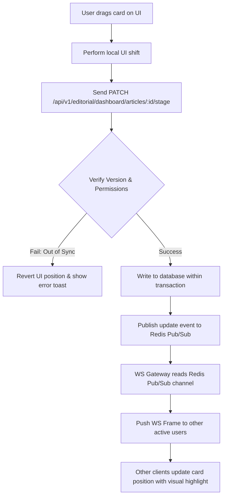

# Editorial Dashboard

## Purpose
The purpose of the Editorial Dashboard design document is to define the technical implementation, API designs, database structures, UI component layouts, and real-time synchronization mechanisms for the NewsOps Cloud digital publishing operating system's collaboration workspace. This system enables editorial planning calendars, Kanban-style progress boards, author workload management, and contextual notifications.

## Executive Summary
A modern newsroom is a dynamic, collaborative environment that requires real-time task visualization and orchestration. The Editorial Dashboard consolidates raw article pipelines, deadlines, and publishing targets into a unified space. It provides:
1. An **Editorial Calendar** for scheduling and dragging articles across dates.
2. A **Kanban Progress Tracker** to move articles through workflows.
3. An **Author Workload Board** showing current capacity and task counts.
4. A **Notification Center** using WebSockets for real-time alerts.

Using high-performance WebSockets and Redis Pub/Sub, the dashboard synchronizes state updates across all connected clients instantly, avoiding race conditions and double-scheduling.

## Vision
To build a highly collaborative, reactive dashboard environment that eliminates coordination bottlenecks, balances writing workloads, and coordinates publication timing with low latency.

## Scope
This document covers:
- The technical design of the Editorial Calendar (monthly/weekly/daily grids, scheduling).
- The Kanban Board progress tracker (state logic, transition rules, drag-and-drop integrations).
- The Workload Assignment module (capacity tracking, metrics, task counts).
- WebSocket-based real-time state synchronization architecture.
- Database DDL schemas and Prisma models for tasks, workloads, and notification logs.
- API design endpoints, RBAC permissions, performance benchmarks, and security controls.

## Goals
- Render the interactive Kanban board under $150\text{ ms}$ for 500+ active cards (P95).
- Broadcast state changes (e.g., column shifts) to all active organization sessions in under $50\text{ ms}$ over WebSockets.
- Deliver real-time notification alerts (badge updates and slide-outs) within $100\text{ ms}$ of the initiating event.
- Ensure that workload capacity estimates compute in under $15\text{ ms}$ using indexed aggregation queries.

## Functional Requirements
- **Interactive Calendar Workspace**: A multi-view calendar (month, week, day) detailing scheduled and published articles. Supports dragging article entries to reschedule publication target dates.
- **Progress Kanban Board**: Columnar layout matching CMS publishing workflows: `PITCH`, `RESEARCH`, `WRITING`, `IN_REVIEW`, `SCHEDULED`, `PUBLISHED`, `ARCHIVED`.
- **Workload Heat Map**: Display all writers and editors, showing their currently assigned articles, total word count burdens, deadlines, and active workload health flags (Normal, Near-Capacity, Overloaded).
- **Notification Hub**: Toast alerts, header bell list, and notifications tray tracking:
  - Article status changes.
  - Assignment transfers.
  - Editor review comments and feedback requests.
  - Publishing window warnings.
- **WebSocket Broadcast Engine**: Automatically stream any change made by one user (re-assignment, status change, date shift) to all other users looking at the same dashboard.

## Non-Functional Requirements
- **State Synchronization**: Enforce optimistic concurrency controls to handle simultaneous drag-and-drop events by two users.
- **Websocket Scalability**: Support up to 5,000 concurrent websocket connections per tenant cluster.
- **Reliable Dispatch**: If a websocket disconnects, queue notifications in the database and push them as soon as the client reconnects (offline queueing).
- **Audit Trails**: All dashboard actions (status changes, assignments, schedule modifications) must write to the unified CMS audit log.

## Business Rules
1. Articles cannot be transitioned to the `SCHEDULED` status column unless they have a valid `scheduled_at` timestamp set.
2. Only users with the `editorial:dashboard:write` permission can change task assignments, shift publish dates, or change status fields.
3. Writers cannot be assigned more than 5 high-priority articles or a total of 15,000 draft words simultaneously unless approved via a supervisor bypass warning.
4. Notifications are automatically purged from active database tables after 30 days or moved to archive partition logs.

## Actors
- **Editor-in-Chief / Managing Editor**: Assigns stories, modifies calendar publication dates, reviews author capacities.
- **Journalist / Writer**: Tracks their assigned queue, moves articles from `WRITING` to `IN_REVIEW`.
- **System Scheduler / Queue Manager**: Executes auto-publishing when calendar items reach their target times.
- **WebSocket Gateway**: Handles persistent TCP connections and event broadcasts.

## User Stories
1. **As a Managing Editor**, I want to drag an article card from the "In Review" column to the "Scheduled" column on the Kanban board so that I can set its publication parameters in one movement.
2. **As a Writer**, I want to receive a real-time sound alert and banner notification when an editor assigns me a new breaking news draft, showing the deadline details.
3. **As an Editor-in-Chief**, I want to view a visual capacity chart showing how many articles each reporter is writing this week before assigning a new time-sensitive investigation.

## Acceptance Criteria
1. Moving a card on the Kanban board must invoke the `PATCH /api/v1/editorial/dashboard/articles/:id/stage` endpoint and update the database within $15\text{ ms}$.
2. The user's websocket connection must validate JWT tokens on connection setup and refresh authorization claims every 15 minutes.
3. A writer's workload capacity indicator must render red if their active word count exceeds 15,000 words across incomplete drafts.
4. Marking a notification as read must update the UI badge count and the database state in under $30\text{ ms}$.

## Workflows
### Real-Time Column Shift and Event Broadcast
1. **Action**: Editor drags "Launch Specs" card from `IN_REVIEW` to `SCHEDULED` on the Kanban board.
2. **REST Call**: Client app triggers a `PATCH` request to `/api/v1/editorial/dashboard/articles/:id/stage` containing the new status and scheduling date.
3. **DB Update**: The API service validates permissions, updates the article record, writes to `article_revisions`, and updates the dashboard log database in a transaction.
4. **Redis Publish**: The API publishes a JSON packet to Redis Pub/Sub under the channel `tenant:{tenant_id}:dashboard`.
5. **WS Stream**: The WebSocket gateway servers subscribe to Redis. They receive the message and push a WebSocket frame to all clients connected to the organization's dashboard.
6. **UI Render**: The cards shift on the displays of other editors viewing the board, highlighted with a temporary green outline.
7. **Task Alert**: The notification engine notices the transition, formats a message, writes it to the database `notifications` table, and broadcasts it to the assigned author's private socket room.



## API Design

### GET /api/v1/editorial/dashboard/calendar
Retrieves scheduled publication items in a date range.
**Headers**:
- `Authorization: Bearer <JWT>`
- `X-Tenant-ID: 7a29e31d-b812-4fcf-89b2-321118671234`

**Query Parameters**:
- `startDate`: "2026-06-01"
- `endDate`: "2026-06-30"

**Response Payload (200 OK)**:
```json
{
  "tenantId": "7a29e31d-b812-4fcf-89b2-321118671234",
  "range": { "start": "2026-06-01", "end": "2026-06-30" },
  "articles": [
    {
      "id": "8fa23d4c-c049-43c7-9cfb-81d368e7b34e",
      "title": "NewsOps Cloud Launches Database Architecture",
      "status": "SCHEDULED",
      "scheduledAt": "2026-06-27T23:00:00Z",
      "assignedTo": {
        "id": "usr_9912a",
        "name": "Alex Mercer"
      },
      "category": "Engineering"
    }
  ]
}
```

### PATCH /api/v1/editorial/dashboard/articles/:id/stage
Modifies an article's status and assignment parameters on the board.
**Request Payload**:
```json
{
  "status": "SCHEDULED",
  "assignedToId": "usr_9912a",
  "scheduledAt": "2026-06-27T23:00:00Z",
  "lockVersion": 4
}
```

**Response Payload (200 OK)**:
```json
{
  "articleId": "8fa23d4c-c049-43c7-9cfb-81d368e7b34e",
  "status": "SCHEDULED",
  "assignedToId": "usr_9912a",
  "scheduledAt": "2026-06-27T23:00:00Z",
  "updatedAt": "2026-06-27T22:35:00Z",
  "lockVersion": 5
}
```

### GET /api/v1/editorial/dashboard/workloads
Retrieves writing capacities and current burdens of all tenant staff.
**Response Payload (200 OK)**:
```json
{
  "workloads": [
    {
      "userId": "usr_9912a",
      "name": "Alex Mercer",
      "role": "WRITER",
      "activeArticles": 3,
      "totalWordCount": 8500,
      "maxWordCapacity": 15000,
      "loadFactor": 0.56,
      "status": "NORMAL"
    },
    {
      "userId": "usr_7718b",
      "name": "Sarah Connor",
      "role": "WRITER",
      "activeArticles": 6,
      "totalWordCount": 16200,
      "maxWordCapacity": 15000,
      "loadFactor": 1.08,
      "status": "OVERLOADED"
    }
  ]
}
```

### GET /api/v1/editorial/dashboard/notifications
Retrieves notifications for the authenticated user.
**Query Parameters**:
- `limit`: 20
- `includeRead`: false

**Response Payload (200 OK)**:
```json
{
  "notifications": [
    {
      "id": "not_199a8b122",
      "message": "Alex Mercer assigned you to 'NewsOps Cloud Launches Database Architecture'",
      "type": "ASSIGNMENT",
      "referenceId": "8fa23d4c-c049-43c7-9cfb-81d368e7b34e",
      "isRead": false,
      "createdAt": "2026-06-27T22:35:00Z"
    }
  ]
}
```

## Database Design

### PostgreSQL DDL Schema
```sql
-- Schema: editorial_cms additions for Dashboards and Workloads

-- Table 1: Author Workload Configuration (Track limits per user)
CREATE TABLE author_workloads (
    user_id UUID PRIMARY KEY, -- Primary key matches Identity schema User ID
    tenant_id UUID NOT NULL,
    max_active_tasks INT DEFAULT 5 NOT NULL,
    max_word_capacity INT DEFAULT 15000 NOT NULL,
    created_at TIMESTAMP WITH TIME ZONE DEFAULT CURRENT_TIMESTAMP NOT NULL,
    updated_at TIMESTAMP WITH TIME ZONE DEFAULT CURRENT_TIMESTAMP NOT NULL
);

CREATE INDEX idx_workloads_tenant ON author_workloads(tenant_id);

-- Table 2: Notifications log (Offline retrieval store)
CREATE TABLE notifications (
    id VARCHAR(50) PRIMARY KEY, -- Prefix 'not_' + base64 UUID
    tenant_id UUID NOT NULL,
    user_id UUID NOT NULL, -- Destination user
    message VARCHAR(255) NOT NULL,
    notification_type VARCHAR(50) NOT NULL, -- ASSIGNMENT, STATUS_CHANGE, COMMENT, ALERT
    reference_id VARCHAR(50), -- Target Article or Asset ID
    is_read BOOLEAN DEFAULT FALSE NOT NULL,
    created_at TIMESTAMP WITH TIME ZONE DEFAULT CURRENT_TIMESTAMP NOT NULL,
    deleted_at TIMESTAMP WITH TIME ZONE
);

CREATE INDEX idx_notifications_user_active ON notifications(user_id, is_read) WHERE deleted_at IS NULL;
CREATE INDEX idx_notifications_tenant ON notifications(tenant_id);
```

### Prisma ORM Models
```prisma
model AuthorWorkload {
  userId          String   @id @map("user_id") @db.Uuid
  tenantId        String   @map("tenant_id") @db.Uuid
  maxActiveTasks  Int      @default(5) @map("max_active_tasks")
  maxWordCapacity Int      @default(15000) @map("max_word_capacity")
  createdAt       DateTime @default(now()) @map("createdAt") @db.Timestamptz(6)
  updatedAt       DateTime @default(now()) @updatedAt @map("updatedAt") @db.Timestamptz(6)

  @@index([tenantId])
  @@map("author_workloads")
}

model Notification {
  id               String    @id @db.VarChar(50)
  tenantId         String    @map("tenant_id") @db.Uuid
  userId           String    @map("user_id") @db.Uuid
  message          String    @db.VarChar(255)
  notificationType String    @map("notification_type") @db.VarChar(50)
  referenceId      String?   @map("reference_id") @db.VarChar(50)
  isRead           Boolean   @default(false) @map("is_read")
  createdAt        DateTime  @default(now()) @map("created_at") @db.Timestamptz(6)
  deletedAt        DateTime? @map("deleted_at") @db.Timestamptz(6)

  @@index([userId, isRead])
  @@index([tenantId])
  @@map("notifications")
}
```

## UI Design
The Editorial Dashboard uses a SPA layout containing three interactive tabs:
1. **Editorial Calendar Grid**:
   - Renders month/week view blocks. Each cell lists publication slots.
   - Cards are smaller, displaying category badges, title, and initials of assigned authors.
   - Rescheduling occurs by dragging cards across cells. Clicking a cell triggers a "Quick Pitch" dialog.
2. **Workflow Kanban Board**:
   - Column layout matching states: Draft, Pitch, In Writing, Review, Scheduled.
   - Individual cards display title, word count, completion progress bar, priority tags, and a circular author avatar.
   - Actionable cards support drag handles. Moving a card updates the database state immediately.
3. **Staff Workload Board**:
   - A list layout of newsroom staff. Columns show assigned cards count, active word counts, and weekly publication volume.
   - Word capacity is shown as a horizontal bar (Green: $<75\%$, Orange: $75-99\%$, Red: $\ge 100\%$).
4. **Header Bell Notification Component**:
   - Displayed in the top right. Shows an orange badge counter indicating unread alerts.
   - Clicking the bell slides down a list showing the last 10 messages with CTA shortcuts (e.g., "Review Draft").

## Permissions
- `editorial:dashboard:read` - Viewer access. Renders dashboard items, calendars, and workload counts.
- `editorial:dashboard:write` - Editor access. Drag-and-drop cards, reschedule dates, and reassign tasks.
- `notifications:read` - Allows users to retrieve their own alerts.
- `notifications:write` - Allows system services to post alerts to staff members.

## Security
- **WebSocket Handshake Validation**: Clients must supply a valid JWT token either in the headers of the upgrade request or as a short-lived handshake query parameter. Sockets are terminated if the token signature is invalid or expired.
- **Tenant Scope Isolation**: Websocket subscriptions are grouped by `tenant_id` room namespaces. Sockets cannot join rooms belonging to other tenants.
- **Optimistic Concurrency Locking**: When editing cards, the API checks `version_number` properties. If a status change request has a stale version count, the system returns an error, prompting the client to refresh card data.

## Performance
- **Dashboard Response Time**: API routes serving Kanban arrays and calendar indices must complete under $50\text{ ms}$ using indexed scans.
- **Redis Caching**: Workload capacities and calendar aggregates are cached in Redis. Update triggers (card movement, user task transfers) invalidate corresponding cache fragments.
- **Websocket Broadcast Latency**: Redis Pub/Sub events are processed by websocket servers in under $2\text{ ms}$, ensuring near-instant client updates.

## Monitoring
- `newsops_websocket_connections_active`: Gauge tracking total active websocket sessions.
- `newsops_websocket_broadcasts_total`: Counter tracking total updates pushed down to clients.
- `newsops_dashboard_stage_transitions_total`: Counter tracking Kanban drag operations by category.
- `newsops_workload_exceeded_warnings_total`: Counter tracking assignments bypassed after warnings.
- **Alert Trigger**: Trigger slack webhook if websocket gateway error rates exceed $1\%$ of total network requests in a 5-minute period.

## Logging
- **Log Format**: JSON log format.
- **Log Level**: INFO for transitions and websocket attachments; ERROR for database update conflicts.
- **Log Context**:
  ```json
  {
    "timestamp": "2026-06-27T22:35:00.654Z",
    "level": "INFO",
    "context": "dashboard-service",
    "tenant_id": "7a29e31d-b812-4fcf-89b2-321118671234",
    "event": "STAGE_TRANSITION",
    "article_id": "8fa23d4c-c049-43c7-9cfb-81d368e7b34e",
    "from_status": "IN_REVIEW",
    "to_status": "SCHEDULED",
    "editor_id": "usr_9912a"
  }
  ```

## Error Handling
- `ERR_INVALID_TRANSITION`: Code 400. HTTP Status 400 Bad Request. Message: "Cannot transition article to 'Scheduled' without setting a publication date."
- `ERR_CAPACITY_OVERFLOW`: Code 409. HTTP Status 409 Conflict. Message: "The assigned author is currently overloaded. Override permission required."
- `ERR_OUTOF_SYNC`: Code 409. HTTP Status 409 Conflict. Message: "This card was updated by another editor. Refreshing card data."

## Edge Cases
- **Concurrent Drag-and-Drop Conflict**: If two editors drag the same card to different columns at the same time, the second request fails the `version_number` constraint check. The UI alerts the second editor and reverts the card's position.
- **Websocket Disconnection Recovery**: If a client loses connection, the UI tries to reconnect with exponential backoff. Upon reconnection, it requests a delta update (`GET /api/v1/editorial/dashboard/delta?since=timestamp`) to apply missed updates.

## Future Improvements
- **AI Calendar Scheduling**: Automatically suggest publication slots based on historical reader engagement patterns per category.
- **Auto-Capacity Balancing**: Implement automation that dynamically re-routes assignments to other reporters when a writer becomes overloaded.

## Mermaid Diagrams

### Flowchart: Real-Time Kanban Card Drag & Drop Pipeline


## References
- [Editorial CMS Database Schema](../03-database/editorial_and_cms_schema.md)
- [System Architecture Blueprint](../02-architecture/system_architecture.md)
- [Identity and Organization Schema](../03-database/identity_and_org_schema.md)
- [Event-Driven Design Pattern Blueprint](../02-architecture/event_driven_design.md)
