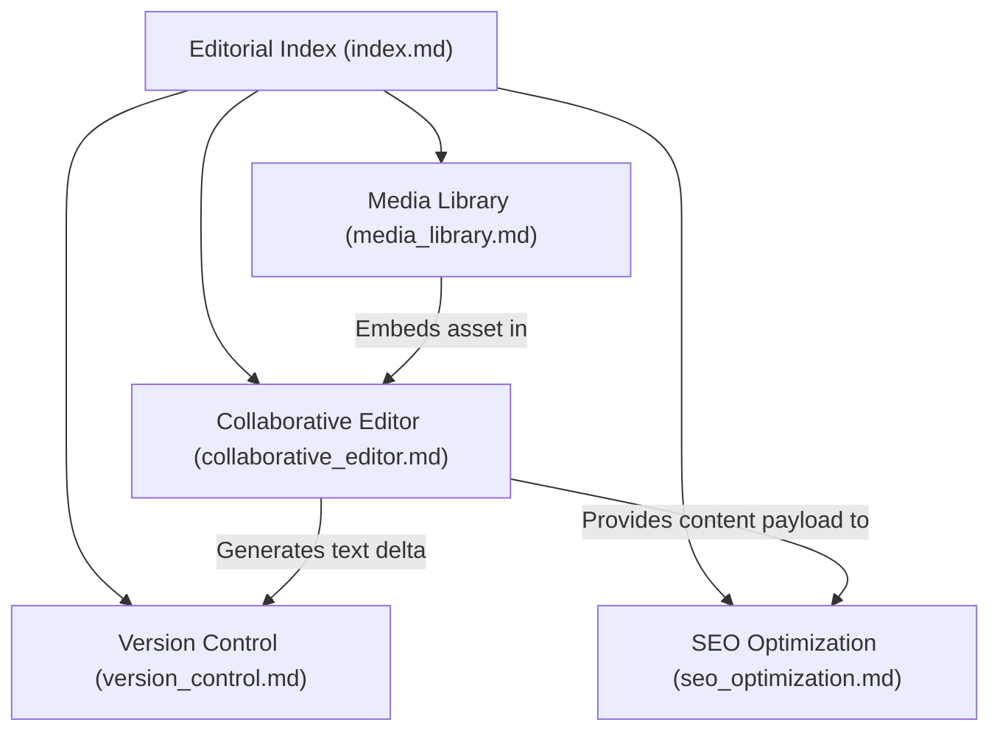

# Editorial Directory Overview

## Purpose
This document provides a comprehensive structural guide, architectural index, and operational overview for the `06-editorial` subsystem within the NewsOps Cloud digital publishing platform. It maps the directory contents and outlines the relationships between the collaborative editor, revision control, digital asset management (DAM), and search engine optimization (SEO) systems.

## Executive Summary
The editorial engine of NewsOps Cloud represents the central workspace for newsrooms, journalists, editors, and digital content managers. This overview document serves as a map for the subcomponents of the editorial folder, detailing how the collaborative rich-text editor, deep version control, media asset library, and metadata/SEO generation components fit together. By coordinating real-time concurrent editing, differential revision tracking, automated digital asset enrichment, and structured metadata generation, the editorial module forms a high-performance content pipeline.

## Vision
The NewsOps Cloud editorial suite is designed to democratize high-scale, real-time journalism workflows. Its vision is to deliver zero-latency concurrent workspace collaboration combined with deterministic document revision history, unified asset curation, and autonomous SEO packaging, ensuring newsrooms can report, refine, and distribute stories faster than competitors without operational overhead.

## Scope
The scope of this directory covers:
*   **Collaborative Editing (`collaborative_editor.md`)**: Rich-text editing architecture based on ProseMirror/Tiptap, Yjs (CRDT) over WebSockets, selection/caret tracking, and granular node-locking mechanisms.
*   **Version Control (`version_control.md`)**: Delta tracking, side-by-side visual diff engines, rollbacks, restore points, and editorial tags.
*   **Media Library (`media_library.md`)**: Digital Asset Management (DAM) folder structures, image transformations, metadata schemes, and automated tagging systems.
*   **SEO Optimization (`seo_optimization.md`)**: Automatic schema markup, keyword density evaluation, Google Discover optimizations, and crawl previews.

## Goals
*   **Unified Information Architecture**: Provide clean navigation and structural integrity across all editorial engineering specifications.
*   **Workflow Interoperability**: Clarify the contract and data exchange patterns between the real-time editor state and the version history / media embedding layers.
*   **Developer Onboarding**: Establish a self-documenting code-to-specification map to reduce engineering friction when deploying CMS updates.

## Functional Requirements
*   **Component Map Access**: The system must provide entry points, conceptual routes, and navigation indices to all sub-documents.
*   **Lifecycle Management**: Document status must be tracked from draft, peer review, SEO enrichment, to published state.
*   **System Integrity**: Cross-document consistency must be enforced, ensuring changes in media embeds or SEO tags are reflected in the version history.

## Non-Functional Requirements
*   **Document Read Latency**: Index files and directory maps must load in under 100ms globally using CDN caching.
*   **Searchability**: All architectural specifications must be indexed for search within the internal documentation portal.
*   **Exportability**: The structural documents must render cleanly to PDF or static HTML pages using the system build tool (MkDocs).

## Business Rules
*   **Documentation Alignment**: Any schema change in `03-database` concerning editorial schemas must trigger a corresponding update in this overview index.
*   **Standardized Nomenclature**: The terminology of "Article", "Revision", "Asset", and "Meta-Data" must remain uniform across all four primary sub-pages.
*   **Pathing Conformity**: All references must resolve correctly to actual workspace locations.

## Actors
*   **Technical Architect**: Reviews this directory structure to ensure compliance with NewsOps architecture standards.
*   **Core Engineer**: Reads this index to locate functional modules for code updates.
*   **Product Owner**: Uses the user stories and acceptance criteria in this index to gauge overall platform capabilities.

## User Stories
1.  As a core engineer, I want an overarching directory index so that I can immediately identify where the collaborative synchronization and revision schemas are specified.
2.  As a technical architect, I want to understand how the collaborative editor interacts with the database schema and media engine, so I can ensure proper transaction boundaries.
3.  As an operations engineer, I want to see the performance and monitoring goals of all editorial services defined in one central directory overview, so that I can configure alerts.

## Acceptance Criteria
*   The directory index must link to exactly four sibling files (`collaborative_editor.md`, `version_control.md`, `media_library.md`, and `seo_optimization.md`).
*   All file links must use relative markdown paths that are verified as resolvable by the system static site generator.
*   No placeholder headings or empty sections can exist.

## Workflows
1.  **Developer Navigation Workflow**:
    *   Engineer opens the editorial directory.
    *   System serves `index.md` listing the components.
    *   Engineer clicks on `collaborative_editor.md` to access WebSocket specifications.
2.  **Editorial Lifecycle Workflow**:
    *   Author initializes a document using the Collaborative Editor.
    *   Media and asset links are pulled from the Media Library.
    *   Version Control tracks document updates.
    *   SEO Engine runs checks and writes meta-attributes.
    *   Publication updates the index-level content tracking registry.

## API Design
The Directory index acts as an orchestrator, listing the status of the editorial subsystems:
```http
GET /api/v1/editorial/health
Host: cms.newsops.cloud
Authorization: Bearer <JWT_TOKEN>
```
**Response:**
```json
{
  "status": "healthy",
  "services": {
    "collaborative_editor": {
      "status": "active",
      "active_connections": 1420,
      "websocket_pool_healthy": true
    },
    "version_control": {
      "status": "active",
      "queue_depth": 0,
      "average_diff_latency_ms": 12.4
    },
    "media_library": {
      "status": "active",
      "cdn_status": "operational",
      "processing_queue": 3
    },
    "seo_optimization": {
      "status": "active",
      "api_usage_percentage": 24.5
    }
  },
  "timestamp": "2026-06-27T22:30:00Z"
}
```

## Database Design
This index refers to the general status registry table for the editorial backend modules:
```sql
CREATE TABLE IF NOT EXISTS editorial_service_status (
    service_name VARCHAR(64) PRIMARY KEY,
    status VARCHAR(32) NOT NULL,
    last_checked_at TIMESTAMP WITH TIME ZONE DEFAULT CURRENT_TIMESTAMP,
    metrics JSONB NOT NULL
);

CREATE INDEX idx_service_status ON editorial_service_status (status);
```

## UI Design
The Editorial Index is represented in the CMS control panel under "Systems Configuration":
*   **Layout**: Split grid displaying service health cards.
*   **Interaction**: Clickable cards routing users to the specific settings for collaborative editor, revision logs, asset libraries, or SEO rules.
*   **States**: Healthy (Green), Warning (Yellow), Degraded (Red).

## Permissions
*   `editorial:index:read`: View service status maps.
*   `editorial:index:write`: Update global service mapping records.

## Security
*   All cross-service requests shown in this document must validate JWTs with standard RS256 algorithms.
*   Endpoints protecting configuration metadata must require HTTPS TLS 1.3 only.

## Performance
*   **Latency Limit**: Health dashboard payloads must execute database queries in under 5ms.
*   **Target TPS**: Handles 500 requests/sec for status checks during peak periods.

## Monitoring
*   `newsops_editorial_service_health_status`: Gauge metric indicating status per subsystem (1 = Healthy, 0 = Unhealthy).
*   `newsops_editorial_requests_total`: Counter tracking directory and navigation routing requests.

## Logging
```json
{
  "timestamp": "2026-06-27T22:30:15Z",
  "level": "INFO",
  "logger": "com.newsops.editorial.index",
  "message": "Subsystem health status verified successfully",
  "context": {
    "active_nodes": 4,
    "unhealthy_count": 0
  }
}
```

## Error Handling
| Error Code | HTTP Status | Customer-Facing Message |
| :--- | :--- | :--- |
| `ERR_SUB_HEALTH_FAILED` | 503 Service Unavailable | Editorial subsystem state could not be verified. Please check cluster status. |
| `ERR_UNAUTHORIZED` | 401 Unauthorized | You do not have permission to view the editorial service directory map. |

## Edge Cases
*   **Partial Outage**: If the collaborative editor goes offline, Yjs documents cached locally must continue to work via offline storage (IndexedDB) until synchronization is restored.
*   **Rate Limits on System Map**: Aggressive polling on the health registry is rate-limited to 5 requests per minute per IP address.

## Future Improvements
*   **Automated Directory Rebalancing**: Auto-routing user edits to local edge database nodes based on geographical coordinates of editors.
*   **AI Auto-Indexing**: Integrating semantic clustering of documentation files to automatically link code changes to relevant paragraphs.

## Mermaid Diagrams


## References
*   [System Architecture Specification](../02-architecture/system_architecture.md)
*   [Editorial and CMS Schema Document](../03-database/editorial_and_cms_schema.md)
*   [Storage Architecture](../02-architecture/storage_architecture.md)
