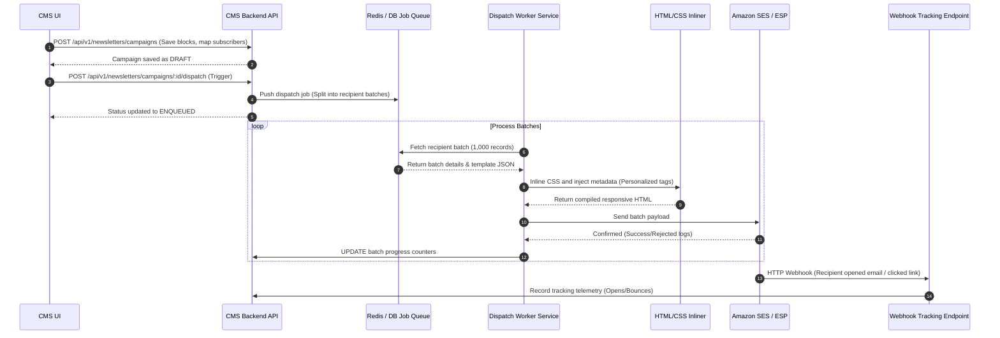
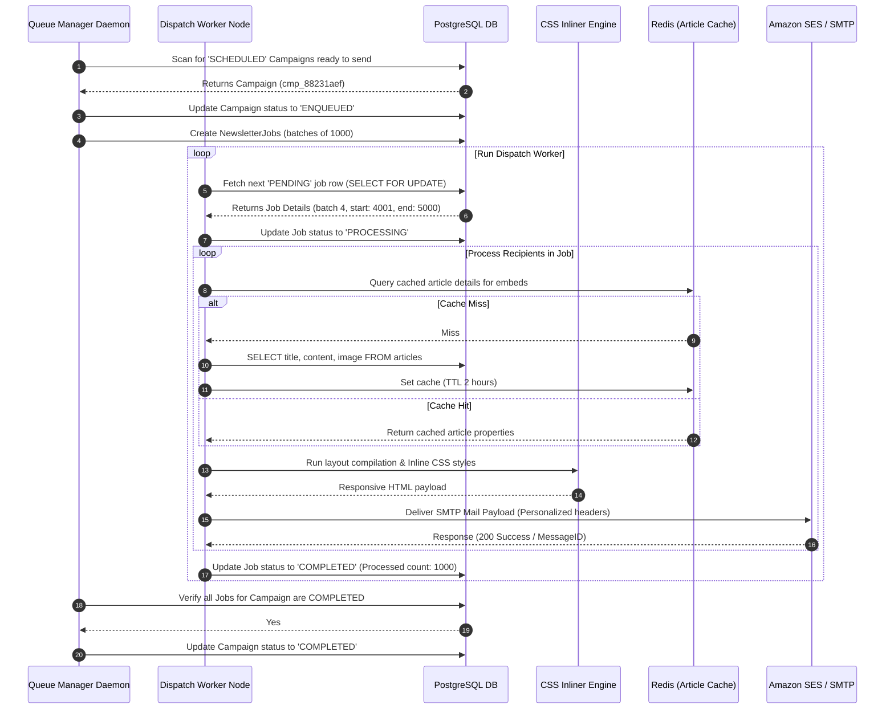

# Newsletter Builder

## Purpose
The purpose of the Newsletter Builder design document is to define the technical implementation, API designs, database structures, UI component layouts, and dispatch pipelines for the NewsOps Cloud digital publishing platform's email newsletter module. This module enables responsive drag-and-drop email design, article wrapping, subscriber list mapping, and high-volume email campaign dispatches.

## Executive Summary
Email newsletters are a primary channel for publisher monetization and subscriber engagement. The Newsletter Builder provides a drag-and-drop canvas to arrange structured blocks (headers, rich text, media assets, CTA buttons, and direct article wrappers) into responsive, email-compliant templates. Campaigns are targeted to dynamic subscriber segments. Once triggered, the dispatch pipeline compiles blocks into CSS-inlined HTML and processes dispatches through a queue-backed worker network integrated with Email Service Providers (ESPs) (e.g., Amazon SES, SendGrid).

## Vision
To establish an integrated newsletter platform that links CMS article assets with subscriber distribution channels, reducing editorial assembly time and delivering emails reliably at scale.

## Scope
This design document covers:
- Drag-and-drop builder components and JSON block specifications.
- Responsive HTML rendering and automatic CSS inlining.
- Subscriber segment mapping and demographic query interfaces.
- Queue-backed dispatch pipeline architecture (RabbitMQ/PostgreSQL queuing).
- Database DDL schemas and Prisma models for templates, campaigns, jobs, and revisions.
- API design endpoints, RBAC permissions, and security considerations.

## Goals
- Compile visual layouts into CSS-inlined HTML in under $10\text{ ms}$ per template.
- Enqueue campaign dispatches to 500,000+ subscribers in under $90\text{ seconds}$.
- Achieve a pipeline dispatch throughput of up to 2,500 emails per second.
- Support deep content integration (dragging articles directly into templates to auto-fill summaries and links).

## Functional Requirements
- **Drag-and-Drop Campaign Editor**: Visual editing canvas using structured JSON layouts:
  - Header: Branding images, logos, organization details.
  - Text Block: Rich text editor block (markdown to HTML).
  - Article Wrapper: Drag-and-drop query component where users select an article, auto-injecting its Title, Slug, Featured Image, and TL;DR.
  - Media: Standard media wrapper displaying cropped assets.
  - CTA Button: Custom links, colors, alignment.
  - Footer: Automated social links and mandatory unsubscribe link blocks.
- **Subscriber Segment Selector**: Dynamic query panel utilizing subscriber criteria (e.g., tier, categories, country) to isolate delivery lists.
- **CSS Inliner Service**: Preprocessor that converts global CSS stylesheets into inline HTML attributes, ensuring compatibility with client renderers (Outlook, Gmail, Apple Mail).
- **Dispatch Queue Broker**: High-volume scheduler that chunks target recipient lists, allocates batch sizes, tracks delivery indices, and coordinates worker nodes.
- **Template Revisions & Version Control**: Maintain version histories for all templates and newsletter campaigns. Every edit to layout blocks creates a version record, allowing rollbacks.

## Non-Functional Requirements
- **Email Compatibility**: Output HTML must validate against HTML tables compatibility standards to prevent distorted layouts in older clients (Outlook 2013-2019).
- **Fault-Tolerant Delivery**: If an ESP API fails, the worker must log the last successful recipient, yield for $30\text{ seconds}$, and resume the dispatch task.
- **Data Privacy Compliance**: Every email footer must feature an encrypted, tokenized single-click unsubscribe link.
- **Tenant Rate Limits**: Free tiers are throttled to 100 emails/min; Enterprise tenants can configure custom speeds up to 10,000 emails/min.

## Business Rules
1. A newsletter campaign cannot be sent to production lists until a test email has been successfully sent to a verified staff inbox.
2. The HTML compiler must reject compile tasks that lack a `{{{unsubscribe_url}}}` placeholder tag in the template footer.
3. Every email sent must log a unique delivery token to the metrics database to track opens, clicks, and bounce signals.
4. Active campaigns are locked for edits once their state transitions to `ENQUEUED` or `DISPATCHING`.

## Actors
- **Newsletter Creator / Marketing Editor**: Designs layouts, maps dynamic subscriber lists, schedules dispatches.
- **Compilation Worker**: Inlines CSS styles, injects article metadata, generates unsubscribe tokens.
- **Queue Scheduler Daemon**: Manages dispatch state, divides campaigns into batches, and runs workers.
- **External ESP Interface**: API wrapper connecting the queue workers to Amazon SES, SendGrid, or Mailgun.

## User Stories
1. **As a Marketing Editor**, I want to drag an article block into my newsletter template and search for "Database Architecture" so that the template automatically imports the featured image, title, and summary.
2. **As an Editorial Publisher**, I want to define a subscriber list targeted to users interested in "Tech News" so that I can send a weekly digest tailored to their reading preferences.
3. **As an Operations Engineer**, I want the newsletter dispatch process to run in the background, updating a progress bar in real time and logging bounce events without blocking the CMS.

## Acceptance Criteria
1. The compilation service must produce CSS-inlined HTML that scores $\ge 98\%$ on EmailOnAcid/Litmus layout validation tests.
2. The unsubscribe token must contain an encrypted string containing `tenant_id`, `subscriber_id`, and `campaign_id`, valid for 30 days.
3. If an ESP returns a rate-limit error (HTTP 429), the dispatch worker must pause execution, update the scheduler, and sleep for 5 seconds using exponential backoff.
4. The system must create a record in `newsletter_campaign_revisions` each time a campaign's layout is modified before dispatch.

## Workflows
### Newsletter Creation, Compilation, and Dispatch Workflow
1. **Design**: Editor creates a campaign, selects a subscriber segment, and drags article blocks into the template.
2. **Review**: Editor triggers a test email call. The API runs the CSS inliner, injects details, and sends it to the editor's inbox.
3. **Trigger**: Editor schedules the campaign for immediate send. The campaign status changes to `SCHEDULED`.
4. **Queue Enqueuing**: The Queue Scheduler runs, shifts campaign status to `ENQUEUED`, and chunks the list into batches of 1,000 recipients.
5. **Worker Execution**: Worker nodes pick up batches. For each recipient, the worker:
   - Computes unique unsubscribe tokens.
   - Compiles final CSS-inlined HTML with personalized tokens.
   - Sends payload to the ESP API.
6. **State Progress**: Workers update `newsletter_jobs` progress counters in real time.
7. **Tracking Callbacks**: Bounces, opens, and clicks are processed by webhook receivers, updating metrics tables.



## API Design

### POST /api/v1/editorial/newsletters/campaigns
Creates a new newsletter campaign.
**Headers**:
- `Authorization: Bearer <JWT>`
- `X-Tenant-ID: 7a29e31d-b812-4fcf-89b2-321118671234`

**Request Payload**:
```json
{
  "title": "Weekly Tech Digest",
  "subjectLine": "Discover our latest database architectures 🚀",
  "templateId": "tmpl_99128ab",
  "subscriberSegmentId": "seg_7718b2",
  "layoutBlocks": [
    {
      "type": "header",
      "properties": { "logoUrl": "https://cdn.newsops.cloud/logo.png" }
    },
    {
      "type": "article",
      "properties": {
        "articleId": "8fa23d4c-c049-43c7-9cfb-81d368e7b34e",
        "showSummary": true,
        "showFeaturedImage": true
      }
    },
    {
      "type": "text",
      "properties": { "htmlContent": "<p>Thank you for subscribing! Check out our updates.</p>" }
    },
    {
      "type": "footer",
      "properties": { "address": "123 Publishing Way, Tech City" }
    }
  ]
}
```

**Response Payload (201 Created)**:
```json
{
  "campaignId": "cmp_88231aef",
  "status": "DRAFT",
  "versionNumber": 1,
  "createdAt": "2026-06-27T22:40:00Z"
}
```

### POST /api/v1/editorial/newsletters/campaigns/:id/test
Sends a personalized preview test email to target addresses.
**Request Payload**:
```json
{
  "testEmails": ["editor@newsops.cloud", "reviewer@newsops.cloud"]
}
```

**Response Payload (200 OK)**:
```json
{
  "success": true,
  "message": "Test emails enqueued successfully.",
  "dispatchedCount": 2
}
```

### POST /api/v1/editorial/newsletters/campaigns/:id/dispatch
Locks layouts, enqueues dispatches, and triggers worker pipelines.
**Request Payload**:
```json
{
  "scheduledAt": "2026-06-27T23:00:00Z"
}
```

**Response Payload (200 OK)**:
```json
{
  "campaignId": "cmp_88231aef",
  "status": "SCHEDULED",
  "scheduledAt": "2026-06-27T23:00:00Z",
  "recipientCount": 142500
}
```

### GET /api/v1/editorial/newsletters/campaigns/:id/stats
Retrieves delivery performance metrics for a campaign.
**Response Payload (200 OK)**:
```json
{
  "campaignId": "cmp_88231aef",
  "recipientCount": 142500,
  "stats": {
    "dispatched": 142500,
    "delivered": 141200,
    "opened": 68420,
    "clicked": 18240,
    "bounced": 1100,
    "complaints": 200,
    "unsubscribed": 450
  },
  "rates": {
    "deliveryRate": 0.9908,
    "openRate": 0.4845,
    "clickThroughRate": 0.1291,
    "bounceRate": 0.0077
  }
}
```

## Database Design

### PostgreSQL DDL Schema
```sql
-- Schema: editorial_cms additions for newsletters and campaigns

-- Table 1: Newsletter Templates (Base layouts)
CREATE TABLE newsletter_templates (
    id VARCHAR(50) PRIMARY KEY, -- 'tmpl_' + uuid hash
    tenant_id UUID NOT NULL,
    name VARCHAR(150) NOT NULL,
    layout_blocks JSONB NOT NULL, -- JSON array of design block templates
    created_at TIMESTAMP WITH TIME ZONE DEFAULT CURRENT_TIMESTAMP NOT NULL,
    updated_at TIMESTAMP WITH TIME ZONE DEFAULT CURRENT_TIMESTAMP NOT NULL,
    deleted_at TIMESTAMP WITH TIME ZONE
);

CREATE INDEX idx_newsletter_templates_tenant ON newsletter_templates(tenant_id);

-- Table 2: Newsletter Campaigns
CREATE TABLE newsletter_campaigns (
    id VARCHAR(50) PRIMARY KEY, -- 'cmp_' + uuid hash
    tenant_id UUID NOT NULL,
    template_id VARCHAR(50) REFERENCES newsletter_templates(id),
    subscriber_segment_id VARCHAR(50) NOT NULL, -- Dynamic segment filter references
    title VARCHAR(255) NOT NULL,
    subject_line VARCHAR(255) NOT NULL,
    layout_blocks JSONB NOT NULL, -- Live layout configuration JSON
    status VARCHAR(50) DEFAULT 'DRAFT' NOT NULL, -- DRAFT, TESTED, SCHEDULED, ENQUEUED, DISPATCHING, COMPLETED, FAILED
    current_version INT DEFAULT 1 NOT NULL,
    scheduled_at TIMESTAMP WITH TIME ZONE,
    started_at TIMESTAMP WITH TIME ZONE,
    completed_at TIMESTAMP WITH TIME ZONE,
    created_at TIMESTAMP WITH TIME ZONE DEFAULT CURRENT_TIMESTAMP NOT NULL,
    updated_at TIMESTAMP WITH TIME ZONE DEFAULT CURRENT_TIMESTAMP NOT NULL,
    deleted_at TIMESTAMP WITH TIME ZONE
);

CREATE INDEX idx_campaigns_tenant ON newsletter_campaigns(tenant_id);
CREATE INDEX idx_campaigns_status ON newsletter_campaigns(status);

-- Table 3: Campaign Revisions (Version Control)
CREATE TABLE newsletter_campaign_revisions (
    id UUID PRIMARY KEY DEFAULT gen_random_uuid(),
    campaign_id VARCHAR(50) NOT NULL REFERENCES newsletter_campaigns(id) ON DELETE CASCADE,
    version_number INT NOT NULL,
    subject_line VARCHAR(255) NOT NULL,
    layout_blocks JSONB NOT NULL,
    modified_by UUID, -- Matches Identity schema User ID
    created_at TIMESTAMP WITH TIME ZONE DEFAULT CURRENT_TIMESTAMP NOT NULL
);

CREATE INDEX idx_campaign_revisions_lookup ON newsletter_campaign_revisions(campaign_id, version_number DESC);

-- Table 4: Dispatch Job Batches (State tracker for sending queues)
CREATE TABLE newsletter_jobs (
    id UUID PRIMARY KEY DEFAULT gen_random_uuid(),
    tenant_id UUID NOT NULL,
    campaign_id VARCHAR(50) NOT NULL REFERENCES newsletter_campaigns(id) ON DELETE CASCADE,
    batch_index INT NOT NULL,
    start_recipient_index INT NOT NULL,
    end_recipient_index INT NOT NULL,
    status VARCHAR(50) DEFAULT 'PENDING' NOT NULL, -- PENDING, PROCESSING, COMPLETED, FAILED
    processed_count INT DEFAULT 0 NOT NULL,
    failed_count INT DEFAULT 0 NOT NULL,
    error_log TEXT,
    updated_at TIMESTAMP WITH TIME ZONE DEFAULT CURRENT_TIMESTAMP NOT NULL
);

CREATE INDEX idx_newsletter_jobs_lookup ON newsletter_jobs(campaign_id, status);
```

### Prisma ORM Models
```prisma
model NewsletterTemplate {
  id           String               @id @db.VarChar(50)
  tenantId     String               @map("tenant_id") @db.Uuid
  name         String               @db.VarChar(150)
  layoutBlocks Json                 @map("layout_blocks") @db.Jsonb
  createdAt    DateTime             @default(now()) @map("created_at") @db.Timestamptz(6)
  updatedAt    DateTime             @default(now()) @updatedAt @map("updated_at") @db.Timestamptz(6)
  deletedAt    DateTime?            @map("deleted_at") @db.Timestamptz(6)
  campaigns    NewsletterCampaign[]

  @@index([tenantId])
  @@map("newsletter_templates")
}

model NewsletterCampaign {
  id                  String                       @id @db.VarChar(50)
  tenantId            String                       @map("tenant_id") @db.Uuid
  templateId          String?                      @map("template_id") @db.VarChar(50)
  subscriberSegmentId String                       @map("subscriber_segment_id") @db.VarChar(50)
  title               String                       @db.VarChar(255)
  subjectLine         String                       @map("subject_line") @db.VarChar(255)
  layoutBlocks        Json                         @map("layout_blocks") @db.Jsonb
  status              String                       @default("DRAFT") @db.VarChar(50)
  currentVersion      Int                          @default(1) @map("current_version")
  scheduledAt         DateTime?                    @map("scheduled_at") @db.Timestamptz(6)
  startedAt           DateTime?                    @map("started_at") @db.Timestamptz(6)
  completedAt         DateTime?                    @map("completed_at") @db.Timestamptz(6)
  createdAt           DateTime                     @default(now()) @map("created_at") @db.Timestamptz(6)
  updatedAt           DateTime                     @default(now()) @updatedAt @map("updated_at") @db.Timestamptz(6)
  deletedAt           DateTime?                    @map("deleted_at") @db.Timestamptz(6)

  template            NewsletterTemplate?          @relation(fields: [templateId], references: [id], onDelete: SetNull)
  revisions           NewsletterCampaignRevision[]
  jobs                NewsletterJob[]

  @@index([tenantId])
  @@index([status])
  @@map("newsletter_campaigns")
}

model NewsletterCampaignRevision {
  id            String             @id @default(dbgenerated("gen_random_uuid()")) @db.Uuid
  campaignId    String             @map("campaign_id") @db.VarChar(50)
  versionNumber Int                @map("version_number")
  subjectLine   String             @map("subject_line") @db.VarChar(255)
  layoutBlocks  Json               @map("layout_blocks") @db.Jsonb
  modifiedBy    String?            @map("modified_by") @db.Uuid
  createdAt     DateTime           @default(now()) @map("created_at") @db.Timestamptz(6)
  campaign      NewsletterCampaign @relation(fields: [campaignId], references: [id], onDelete: Cascade)

  @@unique([campaignId, versionNumber])
  @@index([campaignId])
  @@map("newsletter_campaign_revisions")
}

model NewsletterJob {
  id                  String             @id @default(dbgenerated("gen_random_uuid()")) @db.Uuid
  tenantId            String             @map("tenant_id") @db.Uuid
  campaignId          String             @map("campaign_id") @db.VarChar(50)
  batchIndex          Int                @map("batch_index")
  startRecipientIndex Int                @map("start_recipient_index")
  endRecipientIndex   Int                @map("end_recipient_index")
  status              String             @default("PENDING") @db.VarChar(50)
  processedCount      Int                @default(0) @map("processed_count")
  failedCount         Int                @default(0) @map("failed_count")
  errorLog            String?            @map("error_log") @db.Text
  updatedAt           DateTime           @default(now()) @updatedAt @map("updated_at") @db.Timestamptz(6)
  campaign            NewsletterCampaign @relation(fields: [campaignId], references: [id], onDelete: Cascade)

  @@index([campaignId, status])
  @@map("newsletter_jobs")
}
```

## UI Design
The Newsletter Builder uses a split-pane layout:
1. **Left Sidebar (Components panel)**:
   - Contains draggable element icons: Header block, Text block, Button block, Image block, Divider, and Article block.
2. **Center Canvas (Visual Editor)**:
   - Visual viewport showing the email structure. Dragging elements onto the canvas adds them to the layout.
   - Article blocks on the canvas display a "Search Article" search input. Selecting an article queries the system API to fetch titles, images, and text snippets to display.
   - Layout elements support handles for reordering, copy buttons, and delete icons.
3. **Right Settings Panel**:
   - Tab 1: Styling configuration (background colors, font rules, spacing heights).
   - Tab 2: Campaign Settings (Subject line, Sender name, Sender address, target Subscriber segment dropdown, Scheduled time).
   - Tab 3: Version History (List revisions like "v3 - marketing", "v2 - text edit", "v1 - base", click to restore previous states).
4. **Header Control Bar**:
   - "Send Test" button triggers a popup to type target test emails.
   - "Schedule Dispatch" or "Send Now" triggers validation and processes the queue.

## Permissions
- `newsletter:campaigns:read` - Viewer access. Inspect template details and dispatch statistics.
- `newsletter:campaigns:write` - Editor access. Modify designs, save revisions, build lists.
- `newsletter:campaigns:send` - Authority to send tests and trigger live subscriber dispatches.
- `newsletter:subscribers:read` - Permission to pull address queries and demographics.

## Security
- **Strict HTML Sanitization**: Raw code blocks within text components are run through DOMPurify to eliminate scripting elements and security vulnerabilities before compilation.
- **Unsubscribe Link Cryptography**: The tracking token must be encrypted using AES-GCM-256 containing `subscriber_id`, `campaign_id`, and `salt`. This guarantees that unsubscribe requests cannot be forged or guessed.
- **Tenant API Isolation**: Workers isolate ESP keys based on tenant IDs. Free tier runs share NewsOps API keys with strict rate-limiting controls.

## Performance
- **Aggressive Caching**: Embedded article assets in layout blocks are cached in Redis with a TTL of 2 hours, preventing repeated database queries when compiling templates for thousands of recipients.
- **Inliner Latency**: HTML parsing and CSS styling inline compiles in under $8\text{ ms}$ per template run on a standard Node worker instance.
- **SLA send limits**: Targets a dispatch queue write latency of $<10\text{ ms}$ per record.

## Monitoring
- `newsops_newsletter_enqueued_batches_total`: Counter tracking total batches sent to the queue.
- `newsops_newsletter_dispatched_emails_total`: Counter tracking emails sent to SMTP endpoints.
- `newsops_newsletter_delivery_failures_total`: Counter tracking failures, segmented by bounce types (Hard/Soft).
- `newsops_newsletter_compile_latency_seconds`: Histogram tracking layout compilation speed.
- **Alert Trigger**: Trigger alert if dispatch failure rate exceeds $3\%$ of total sends in any batch.

## Logging
- **Log Format**: JSON log format.
- **Log Level**: INFO for queue enqueuing and completions; WARN for soft bounces; ERROR for SMTP timeouts or missing unsubscribes.
- **Log Context**:
  ```json
  {
    "timestamp": "2026-06-27T22:42:15.112Z",
    "level": "INFO",
    "context": "newsletter-dispatch-worker",
    "tenant_id": "7a29e31d-b812-4fcf-89b2-321118671234",
    "campaign_id": "cmp_88231aef",
    "batch_index": 4,
    "success_count": 1000,
    "failure_count": 0,
    "elapsed_ms": 385
  }
  ```

## Error Handling
- `ERR_UNSUBSCRIBE_LINK_MISSING`: Code 422. HTTP Status 422 Unprocessable Entity. Message: "Template compilation failed. Newsletter must include a verified unsubscribe placeholder link."
- `ERR_ESP_CONNECTION_FAILED`: Code 502. HTTP Status 502 Bad Gateway. Message: "The upstream Email Service Provider (ESP) is unreachable. Retrying transaction."
- `ERR_EMPTY_RECIPIENT_LIST`: Code 400. HTTP Status 400 Bad Request. Message: "The selected subscriber segment has no active subscribers."

## Edge Cases
- **Simultaneous Sending Trigger**: If an editor clicks "Send Now" twice, or two editors trigger the same campaign simultaneously, the scheduler uses a PostgreSQL row lock (`SELECT FOR UPDATE NOWAIT`) on the campaign record. This locks the state at `ENQUEUED` instantly, causing the second request to fail validation and abort.
- **Stale Article Embeds**: If an embedded article is deleted from the CMS after a newsletter is scheduled but before it is dispatched, the compilation engine falls back to using the cached article properties stored in the layout JSON. It writes a warning log but proceeds with the dispatch to prevent compiler crashes.

## Future Improvements
- **A/B Subject Testing**: Automate sending two subject variations to $10\%$ of the target segment, tracking open rates for one hour, and sending the winning subject to the remaining $90\%$.
- **AI recommendation mapping**: Dynamically populate article blocks with personalized recommendations for each subscriber based on their reading history.

## Mermaid Diagrams

### Sequence Diagram: Newsletter Template Compilation and Dispatch


## References
- [Editorial CMS Database Schema](../03-database/editorial_and_cms_schema.md)
- [System Architecture Blueprint](../02-architecture/system_architecture.md)
- [Caching Strategy Specs](../02-architecture/caching_strategy.md)
- [Identity and Organization Schema](../03-database/identity_and_org_schema.md)
