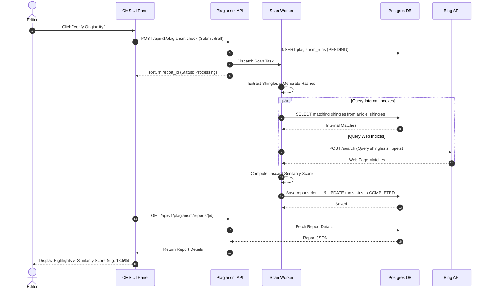

# Plagiarism Checker

## Purpose
The Plagiarism Checker provides editorial teams with automated systems to verify content originality. It runs validation algorithms against internal publication archives, sister organization records, and public search indexes to protect the company from copyright violations, academic fraud, and duplicated content penalties.

## Executive Summary
Originality is fundamental to editorial integrity. The Plagiarism Checker module utilizes sentence-shingle parsing, MinHash LSH indexes, and third-party search APIs to perform low-latency copy validations. This specification outlines the comparison pipelines, database tables mapping shingles, API schemas, UI split-screen layout interfaces, and alert configurations for the editorial platform.

## Vision
To build an automated, high-precision content scanner integrated into the publication pipeline that flags copy matches instantly, identifies sources, and determines whether matching text represents standard citation formatting or outright duplication.

## Scope
The scope of this design document includes:
- Sentence-shingle comparison algorithms (k-shingle parsing, Jaccard Similarity, MinHash, LSH indexing).
- Internal database archive checks (comparison across all articles in the tenant's database).
- External web search API integration pipelines.
- Plagiarism report schema, including similarity percentage and matching source list.
- Admin rules configurations.

This document excludes:
- Structural styling duplication (e.g. copying layouts, which is covered under Article Templates).
- Cross-language translation plagiarism checks (which require semantic embedding systems handled in subsequent AI model designs).

## Goals
- Complete internal repository scan of an article up to 1,500 words in under 1.5 seconds.
- Maintain a false positive rate under 2% on legitimate quotes and standard idioms.
- Support parallel search scanning across large historical archives.

## Functional Requirements
- **Shingle Hashing Generation**: Break article drafts into clean alphanumeric string shingles (e.g., $k$-word shingles where $k=5$) and compute MD5/Murmur3 hashes.
- **Internal Database Search**: Match generated shingles against the pre-compiled `article_shingles` database index.
- **External Web Comparison**: Query public search APIs (e.g., Bing Web Search, Google Search) with prominent shingles to identify matches across public index websites.
- **Quote and Citation Exclusion**: Parse markdown or HTML formatting to automatically ignore blockquotes, inline quotes, and properly formatted attributions.
- **Originality Reports**: Return a cumulative similarity score (0% to 100%), absolute counts of copied characters, list of matched external URLs, and offset spans showing the exact duplicated sentences.

## Non-Functional Requirements
- **Scalability**: Shingle matching checks must scale horizontally using partitioned databases and Redis caches.
- **Availability**: Offline fallback to internal database checking if external web search APIs rate-limit or timeout.
- **Precision**: Shingle lookup engine must support configurable thresholds (e.g., minimum 8 matching words to flag a segment).

## Business Rules
- **Rule 1 (Block Threshold)**: Any article returning a cumulative similarity index greater than 25% (excluding properly formatted citations) must be blocked from publishing and flagged with `Status = HOLD_PLAGIARISM`.
- **Rule 2 (Tenant Scope)**: System searches must index and query across all sub-brands/tenants under the parent publisher organization to prevent internal cross-brand duplication.
- **Rule 3 (Historical Re-indexing)**: Updates to published articles must re-compile their shingle records within 1 minute to prevent stale lookups.

## Actors
- **Reporter**: Initiates scans and views highlights to resolve overlaps before submission.
- **Editor**: Examines similarity reports, flags infractions, and overrides false positive blocks.
- **System Crawler**: Re-indexes newly published content into the global shingle archive.

## User Stories (At least 3 specific stories)
1. **Self-Check Originality**: As a Reporter, I want to scan my draft before submitting it, so that I can ensure I have properly cited all source texts and rewritten common phrasing in my own words.
2. **Flagging Copied Text**: As an Editor, I want to see a side-by-side comparison panel highlighting matching sentences from an external blog post, so that I can verify if the author plagiarized the text.
3. **Syndication Validation**: As an Editorial Lead, I want the system to ignore matching segments from our own sister publication when syndicating content, so that our internal syndication doesn't trigger plagiarism warnings.

## Acceptance Criteria (At least 3-5 criteria with clear thresholds)
- **Criteria 1 (Matching Highlight)**: The API must report the exact character coordinates (`start_offset` and `end_offset`) matching the source text.
- **Criteria 2 (Scan Execution Time)**: Scan operations checking both internal database shards and external web indexes must return results in under 3.5 seconds at p95.
- **Criteria 3 (Action Block Trigger)**: If similarity scores exceed 30%, the system must disable the "Publish" button in the CMS workspace for that article, showing a warning banner.

## Workflows
1. **Trigger Scan**: A user clicks the "Check Originality" button or submits the article.
2. **Document Normalization**: The API strips styling HTML/Markdown tags, converts the text to lowercase, and extracts alphanumeric characters.
3. **Shingle Compilation**: The text is broken into overlapping shingles of 5 words. The worker hashes each shingle.
4. **Index Query**:
   - **Internal**: Look up hashes in the database index table `article_shingles`.
   - **External**: Identify the longest continuous text blocks and search them using web engines.
5. **Result Compilation**: Matches are aggregated. Similarity is calculated:
   $$\text{Similarity Score} = \frac{\text{Unique Matching Shingles}}{\text{Total Shingles}} \times 100\%$$
6. **Report Return**: The frontend highlights matching regions and loads the side-by-side URL comparison pane.

## API Design

### Run Plagiarism Scan
- **Endpoint**: `POST /api/v1/plagiarism/check`
- **Method**: `POST`
- **Request Headers**:
  - `Content-Type: application/json`
  - `Authorization: Bearer <JWT>`
- **Request Payload**:
```json
{
  "article_id": "art_554d32a1_8890_41fe_a923_aef8d098711e",
  "text_content": "The quick brown fox jumps over the lazy dog. Journalistic integrity requires verified facts.",
  "bypass_external": false
}
```
- **Response (202 Accepted)**:
```json
{
  "report_id": "rep_991c0e3f_4821_49de_bb01_ccf87d098e21",
  "article_id": "art_554d32a1_8890_41fe_a923_aef8d098711e",
  "status": "PROCESSING",
  "estimated_duration_ms": 1200
}
```

### Retrieve Plagiarism Report
- **Endpoint**: `GET /api/v1/plagiarism/reports/{report_id}`
- **Method**: `GET`
- **Request Headers**:
  - `Authorization: Bearer <JWT>`
- **Response (200 OK)**:
```json
{
  "report_id": "rep_991c0e3f_4821_49de_bb01_ccf87d098e21",
  "article_id": "art_554d32a1_8890_41fe_a923_aef8d098711e",
  "cumulative_similarity_score": 18.5,
  "status": "COMPLETED",
  "matches": [
    {
      "source_type": "EXTERNAL",
      "source_url": "https://example.com/original-article",
      "matched_text": "The quick brown fox jumps over the lazy dog",
      "start_offset": 0,
      "end_offset": 43,
      "shingles_count": 4
    },
    {
      "source_type": "INTERNAL",
      "source_article_id": "art_112c3b4a_5500_4ee1_99bb_ee81d093aa11",
      "matched_text": "Journalistic integrity requires verified facts",
      "start_offset": 45,
      "end_offset": 91,
      "shingles_count": 5
    }
  ]
}
```

## Database Design

### Schema Tables

#### `article_shingles`
Stores pre-computed MinHash/LSH shingle signatures of all published content for quick lookups.
- `id` (BIGSERIAL, Primary Key)
- `article_id` (UUID, Not Null) -- References Core Article Table
- `shingle_hash` (BIGINT, Not Null) -- Hash value representing a 5-word shingle
- `position_offset` (INTEGER, Not Null) -- Character offset location of the shingle
- `created_at` (TIMESTAMP WITH TIME ZONE, Default: now())

#### `plagiarism_runs`
Records scan events and cumulative scoring metadata.
- `id` (UUID, Primary Key)
- `tenant_id` (UUID, Not Null)
- `article_id` (UUID, Not Null)
- `status` (VARCHAR(32)) -- PENDING, PROCESSING, COMPLETED, FAILED
- `similarity_score` (NUMERIC(5, 2)) -- e.g. 18.50
- `executed_by` (UUID)
- `created_at` (TIMESTAMP WITH TIME ZONE)

#### `plagiarism_matches`
Details of specific segments matching source materials.
- `id` (UUID, Primary Key)
- `run_id` (UUID, Foreign Key to `plagiarism_runs` ON DELETE CASCADE)
- `source_type` (VARCHAR(16)) -- INTERNAL, EXTERNAL
- `source_url` (TEXT, Nullable)
- `source_article_id` (UUID, Nullable)
- `matched_text` (TEXT, Not Null)
- `start_offset` (INTEGER, Not Null)
- `end_offset` (INTEGER, Not Null)
- `created_at` (TIMESTAMP WITH TIME ZONE)

### Indexes
- `idx_shingles_hash` ON `article_shingles (shingle_hash)`
- `idx_plagiarism_runs_art` ON `plagiarism_runs (article_id, similarity_score)`

## UI Design
- **Originality Checker Button**: Located in the editor tools toolbar. Initiates the scan and shows a loading spinner state.
- **Score Meter Dashboard**: A circular gauge panel displaying the similarity percentage. Colored green (0-15%), yellow (16-30%), and red (31%+).
- **Split Screen Match Viewer**: Opens in a lower drawer. The left side highlights matching segments in the draft; the right side updates dynamically to display the matching text source with highlighted differences.
- **Bypass Request Dialog**: Allows Chief Editors to input an authorization overrides reason (e.g. syndicated report validation) to clear publishing blocks.

## Permissions
- `plagiarism:check` - Trigger originality scans.
- `plagiarism:read_reports` - View historical plagiarism scores.
- `plagiarism:override` - Override publishing block constraints.

## Security
- **Data Isolation**: The LSH index query filters matches using database partitioning to prevent unauthorized tenants from leaking unpublished draft text metadata to other tenants.
- **Payload Limits**: Max input text sizes capped at 5MB per API request to prevent memory denial-of-service (DoS).
- **Sanitized Search Queries**: Web search requests use strict string parameter escaping to prevent injection attacks when communicating with API endpoints.

## Performance
- **Target Latency**: Internal repository matching in < 500ms; external web matching in < 2.5 seconds.
- **Memory Footprint**: Fast bitwise index search using LSH arrays in Redis memory pipelines.
- **Target TPS**: 50 scans per second under peak publishing cycles.

## Monitoring
- **Prometheus Metrics**:
  - `newsops_plagiarism_scans_total` (counter, labeled by status)
  - `newsops_plagiarism_external_api_duration_seconds` (histogram)
  - `newsops_plagiarism_high_similarity_alerts` (counter)
- **Alert Triggers**:
  - Alert if `rate(newsops_plagiarism_high_similarity_alerts[10m]) > 20` (Spike in plagiarism detection or potential bots attempting system extraction).

## Logging
- **Format**: JSON.
- **Levels**:
  - `INFO`: Plagiarism run completed, score returned.
  - `WARNING`: External crawler API return rate-limited status.
  - `ERROR`: Token parser execution failure.
- **Log Context**: Include `tenant_id`, `article_id`, `report_id`, `similarity_score`.

## Error Handling
- **ERR_EXTERNAL_API_RATE_LIMIT**: HTTP 429. "Search engine queries rate-limited. Falling back to internal check."
- **ERR_ARTICLE_TEXT_EMPTY**: HTTP 400. "The text payload submitted contains no words to parse."
- **ERR_SCAN_TIMEOUT**: HTTP 504. "The validation scan timed out. Please try again in a few moments."

## Edge Cases
- **Common Idioms**: Text containing common idioms (e.g. "at the end of the day") could trigger matches. Solution: Shingles that match thousands of database documents are flagged as "Noise shingles" and excluded from similarity calculation.
- **Quotes from Speeches**: Multiple articles reporting the same speech will share quote sequences. Solution: Text encapsulated inside quotes is stripped before computing scores.
- **Stale Web Indexes**: Web articles modified after scanning will show outdated matches. Solution: Reports expire after 24 hours, mandating clean scans.

## Future Improvements
- **Semantic Vector Plagiarism**: Deploy dense vector embeddings (e.g., sentence-BERT) to identify paraphasic and translation-based plagiarism.
- **Blockchain Content Registries**: Register article hashes on decentralized registries to establish ownership timelines.

## Mermaid Diagrams



## References
- [Editorial and CMS Schema](../03-database/editorial_and_cms_schema.md)
- [Audit and History Schema](../03-database/audit_and_history_schema.md)
- [System Architecture](../02-architecture/system_architecture.md)
