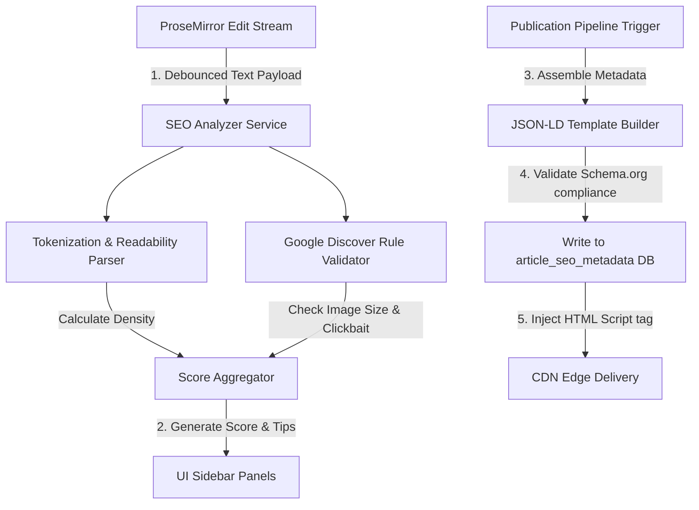

# Metadata and SEO Generation

## Purpose
This document defines the architectural specifications, processing pipelines, schemas, and API structures for the search engine optimization (SEO) and structured metadata generation engine in the NewsOps Cloud digital publishing platform.

## Executive Summary
Maximizing audience reach is critical for modern digital publishing. The NewsOps Cloud SEO Optimization module dynamically analyzes article content to generate real-time SEO advice, track target keyword densities, output structured JSON-LD schemas (such as NewsArticle, Review, and Organization specifications), enforce Google Discover compliance standards, and compile interactive social media and search crawler previews.

## Vision
To establish a zero-friction SEO pipeline that automatically handles complex search engine configurations and metadata generation, allowing journalists to concentrate on writing while ensuring maximum discoverability.

## Scope
The scope of this document covers:
*   Real-time keyword density calculations and recommendations.
*   Structured data formatting engines (JSON-LD, OpenGraph, Twitter Cards).
*   Google Discover formatting checks (such as verifying minimum 1200px image width rules).
*   Preview generators simulating search and social media snippet displays.
*   SEO API endpoint routing.

## Goals
*   **Search Discovery Compliance**: Ensure 100% of published articles contain error-free, Rich-Result-validated JSON-LD structures.
*   **Discover Inclusion Boost**: Automatically check and alert authors of missing asset parameters (e.g. high-resolution visual ratios) before publishing.
*   **Real-time Feedback**: Maintain latency of keyword density evaluation and content scoring under 50ms during active text entry.

## Functional Requirements
*   **Real-Time SEO Scoring**: The module must calculate content readability and SEO scores based on target keywords as the writer types.
*   **JSON-LD Schema Automation**: The system must assemble and serve semantic markup schemas matching Schema.org definitions (primarily `NewsArticle` and `Review`).
*   **Google Discover Policy Checker**: The platform must validate Discover guidelines, including verifying that main images are at least 1200px wide and that titles contain no clickbait patterns.
*   **Snippet Preview Simulation**: Authors must be able to view real-time representations of their content as it will appear on Google SERP, Facebook OpenGraph feeds, and X (Twitter) Cards.

## Non-Functional Requirements
*   **JSON-LD Rendering Overhead**: Generating structured JSON-LD data on a page request must add no more than 3ms of latency to page load times.
*   **Analysis Accuracy**: The parser must correctly identify and extract keyword variations, accounting for common plurals and suffix adjustments.
*   **System Extensibility**: The SEO rules engine must be modular, allowing engineers to add new validator rules without refactoring the parsing pipeline.

## Business Rules
*   **Discover Image Enforcements**: No article can be labeled "Google Discover Ready" unless it features at least one landscape layout image of 1200px width or greater.
*   **Structured Schema Validation**: All JSON-LD records must pass local Schema validation checks before being pushed to the public content delivery layer.
*   **Override Precedence**: Hand-written meta titles and descriptions take immediate precedence over system-generated automated values.

## Actors
*   **Reporter/Writer**: References real-time SEO scores and keyword suggestions during drafting.
*   **Audience Development Editor**: Reviews Discover alerts and optimizes headline structures.
*   **Search Crawler (Googlebot, Bingbot)**: Consumes structured JSON-LD and OpenGraph tags.
*   **SEO Engine Service**: Orchestrates content parsing and generates crawler previews.

## User Stories
1.  As a writer, I want to see a live keyword density meter in my editor sidebar so that I don't overuse my target keyword and get penalized for search-stuffing.
2.  As an editor, I want to see exactly how our breaking news headline will look on a Google mobile search screen so that I can optimize it for click-through rate.
3.  As an audience developer, I want the system to automatically flag article headlines that contain clickbait phrases so that we protect our rank standing on Google Discover.

## Acceptance Criteria
*   **Schema Validity**: 100% of output JSON-LD documents must successfully validate against the Schema.org structure definitions without warnings.
*   **Density Analysis Speed**: The density calculations for a 2,000-word article must return results within 45ms of the user pausing typing.
*   **Discover Check Accuracy**: The editor must block release of any article marked "Target: Google Discover" if the main image is under 1200px wide.

## Workflows
1.  **SEO Assessment and Scoring Workflow**:
    *   Writer inputs text and defines target keywords (e.g. "Federal Reserve").
    *   Editor client sends content to `/api/v1/editorial/seo/analyze`.
    *   SEO Service parses text, runs readability indexes, counts keyword frequencies, and checks against Discover image parameters.
    *   SEO Service returns scorecard containing score (0-100), density percentages, and specific action items.
    *   Client UI updates score indicator gauges.
2.  **Crawler Preview and JSON-LD Delivery**:
    *   Public page request arrives at CDN.
    *   System queries the `article_seo_metadata` table.
    *   System formats the results into standard JSON-LD schema block, injecting it into the HTML document header.
    *   Crawler fetches page, immediately reading structured information.

## API Design

### Run Content SEO Analysis
```http
POST /api/v1/editorial/seo/analyze HTTP/1.1
Host: cms.newsops.cloud
Content-Type: application/json
Authorization: Bearer <JWT_TOKEN>

{
  "article_id": "123e4567-e89b-12d3-a456-426614174000",
  "html_content": "<p>The Federal Reserve interest rate adjustments are expected to stabilize the housing market.</p>",
  "target_keywords": ["Federal Reserve", "interest rate"],
  "focus_image_url": "https://cdn.newsops.cloud/media/photo.jpg",
  "focus_image_width": 1024
}
```
**Response:**
```json
{
  "seo_score": 78,
  "metrics": {
    "word_count": 14,
    "readability_index": "Flesch-Kincaid Grade 8",
    "keyword_densities": [
      {
        "keyword": "Federal Reserve",
        "count": 1,
        "density_percentage": 7.14,
        "status": "optimal"
      },
      {
        "keyword": "interest rate",
        "count": 1,
        "density_percentage": 7.14,
        "status": "optimal"
      }
    ]
  },
  "discover_eligibility": {
    "is_eligible": false,
    "violations": [
      {
        "rule_id": "DISCOVER_MIN_IMAGE_WIDTH",
        "severity": "blocker",
        "message": "Focus image width must be at least 1200px. Current width is 1024px."
      }
    ]
  },
  "suggestions": [
    {
      "type": "title",
      "priority": "high",
      "message": "Add your target keyword 'Federal Reserve' to the beginning of the title."
    }
  ]
}
```

### Fetch Crawler JSON-LD Schema
```http
GET /api/v1/editorial/seo/articles/123e4567-e89b-12d3-a456-426614174000/schema HTTP/1.1
Host: cms.newsops.cloud
```
**Response:**
```json
{
  "@context": "https://schema.org",
  "@type": "NewsArticle",
  "mainEntityOfPage": {
    "@type": "WebPage",
    "@id": "https://www.newsops.com/politics/federal-reserve-rates"
  },
  "headline": "Federal Reserve Rates Adjust in Economic Shift",
  "image": [
    "https://cdn.newsops.cloud/media/photo_1200.jpg"
  ],
  "datePublished": "2026-06-27T22:00:00Z",
  "dateModified": "2026-06-27T22:30:00Z",
  "author": {
    "@type": "Person",
    "name": "Jane Doe"
  },
  "publisher": {
    "@type": "Organization",
    "name": "NewsOps Publishing",
    "logo": {
      "@type": "ImageObject",
      "url": "https://cdn.newsops.cloud/brand/logo.png"
    }
  },
  "description": "Analysis of the Federal Reserve adjustments and economic implications."
}
```

## Database Design

### PostgreSQL: SEO Metadata Table
```sql
CREATE TABLE IF NOT EXISTS article_seo_metadata (
    article_id UUID PRIMARY KEY,
    meta_title VARCHAR(150),
    meta_description VARCHAR(300),
    canonical_url VARCHAR(512),
    target_keywords VARCHAR(64)[] DEFAULT '{}',
    schema_type VARCHAR(32) NOT NULL DEFAULT 'NewsArticle',
    custom_schema JSONB,
    discover_ready BOOLEAN DEFAULT FALSE,
    og_title VARCHAR(150),
    og_description VARCHAR(300),
    og_image VARCHAR(512),
    twitter_card_type VARCHAR(32) DEFAULT 'summary_large_image',
    created_at TIMESTAMP WITH TIME ZONE DEFAULT CURRENT_TIMESTAMP,
    updated_at TIMESTAMP WITH TIME ZONE DEFAULT CURRENT_TIMESTAMP
);

CREATE INDEX idx_seo_discover ON article_seo_metadata (discover_ready);
```

## UI Design
The SEO sidebar integrates into the right side of the document workspace:
*   **SEO Score Dial**: A circular progress ring shifting color from red (0-49) to yellow (50-79) to green (80-100) reflecting overall score.
*   **Keyword Analysis Table**: List of target keywords showing occurrences, density meters, and density classification labels.
*   **Crawler Preview Tabs**: Layout switcher with tabs:
    *   **Google Search Tab**: Displays simulated mobile search results card (blue title, green path breadcrumbs, grey description).
    *   **Facebook Preview Tab**: Displays simulated OpenGraph timeline card with landscape cover image.
    *   **X Cards Preview Tab**: Displays summary-style social cards.
*   **Google Discover Checklist**: Dynamic checklist item showing image resolution warnings, clickbait checks, and author bio state.

## Permissions
*   `seo:metadata:read`: View SEO dashboard and schemas.
*   `seo:metadata:write`: Update meta keywords, configure JSON-LD, override descriptions.

## Security
*   **HTML Sanitization**: Content payloads submitted to the analyzer API must pass through strict sanitization engines to prevent CSS expressions or script tags from executing in the parser container.
*   **Schema Safety validation**: JSON-LD scripts output on public web layers must escape characters like `<` and `>` as `\u003c` and `\u003e` to prevent context escape.

## Performance
*   **Analysis Execution latency**: Text analyzer execution time must stay below 30ms.
*   **Metadata Read Performance**: Retreiving metadata for CDN cache injection must resolve in under 2ms using database connection pooling.
*   **Target TPS**: Supports 1,500 requests/sec.

## Monitoring
*   `newsops_seo_analysis_latency_seconds`: Histogram tracking parsing duration.
*   `newsops_seo_score_average`: Gauge metric tracking average SEO score across drafts.
*   `newsops_seo_discover_violations_total`: Counter tracking frequency of Discover layout blocker hits.

## Logging
```json
{
  "timestamp": "2026-06-27T22:36:00Z",
  "level": "INFO",
  "logger": "com.newsops.seo.analyzer.ContentParser",
  "message": "SEO calculation completed",
  "context": {
    "article_id": "123e4567-e89b-12d3-a456-426614174000",
    "score": 78,
    "words": 14,
    "violations_found": 1
  }
}
```

## Error Handling
| Error Code | HTTP Status | Customer-Facing Message |
| :--- | :--- | :--- |
| `ERR_SEO_PARSE_FAILED` | 422 Unprocessable Entity | The article body is structurally invalid and cannot be parsed for keywords. |
| `ERR_KEYWORD_LIMIT_EXCEEDED` | 400 Bad Request | You can define a maximum of 5 target keywords per article. |

## Edge Cases
*   **Non-Latin Character sets**: For Chinese, Japanese, or Arabic text, character-based segmenters (using morphological analyzers like MeCab or ICU segmenters) are utilized to calculate token densities rather than standard whitespace tokenization.
*   **Dynamic Tag relocation**: If a target keyword is adjusted mid-sentence, the analysis worker delays processing (debouncing for 1.5 seconds) to avoid continuous calculations during rapid typing.

## Future Improvements
*   **LLM Meta-Generation**: Integrate a local model to automatically draft optimal title tags and summary meta descriptions based on content context.
*   **Real-time Competitor GAP analysis**: Fetch active Google Search results for the target keywords to recommend additional subheadings that competitors are covering.

## Mermaid Diagrams


## References
*   [Editorial Index Map](index.md)
*   [Collaborative Rich-Text Specification](collaborative_editor.md)
*   [Database News Intelligence Schema](../03-database/news_intelligence_schema.md)
