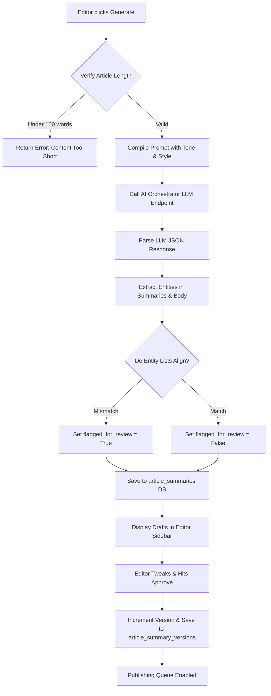
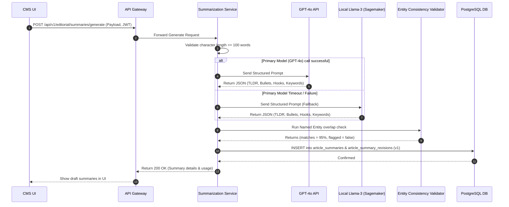

# Smart Summarization

## Purpose
The purpose of the Smart Summarization design document is to define the technical implementation specifications, API endpoints, database structures, and UI designs for content synthesis within the NewsOps Cloud platform. This engine generates TL;DR text summaries, key bullet takeaways, social media post hooks, and SEO keyword extractions utilizing deep learning and Large Language Models (LLMs) managed by the AI Orchestration layer.

## Executive Summary
Long-form journalism requires multi-channel distribution across web portals, newsletter summaries, and social media platforms. Generating these marketing and synthesis assets manually consumes significant editorial time. The Smart Summarization Engine automates this by processing articles through a multi-stage NLP and LLM pipeline. It produces:
1. A concise, single-paragraph **TL;DR** summary.
2. A structured set of key **bullet summaries** detailing crucial events.
3. Engaging **social media hooks** optimized for platform-specific constraints (e.g., Twitter/X character limits, LinkedIn professional formats).
4. Semantic and SEO-optimized **keywords** mapped to the global taxonomy.

Editors retain absolute control, with side-by-side comparison interfaces to review, adjust, regenerate, and approve synthetic outputs before publication. Full version history is captured for audits.

## Vision
To establish a zero-friction synthesis layer that acts as a co-pilot for journalists, instantly transforming rich body content into cross-platform summaries and tags, maximizing editorial velocity, and maintaining strict factual consistency.

## Scope
This document covers:
- Core LLM prompt structures and routing rules for synthesis.
- Content parameters: length, tone selector specifications, and validation rules.
- Social media hook formatters and character limit enforcement (Twitter/X, Facebook, LinkedIn, Instagram).
- Schema designs for summaries and audit-ready version control history in PostgreSQL.
- API endpoints for automated and manual summaries generation, updates, and approval.
- The UI workflow in the article editor canvas.

## Goals
- Complete synthesis generation (TL;DR, Bullets, Social Hooks, Keywords) in under $1.8\text{ seconds}$ (P95) using low-latency LLMs.
- Achieve a hallucination and factual inconsistency rate of $< 2\%$ via cross-reference NER checks.
- Enforce strict platform-specific character caps (e.g., exactly $\le 280$ characters for Twitter/X) at the API and database levels.
- Provide a robust version rollback system that retrieves historical revisions in under $10\text{ ms}$.

## Functional Requirements
- **TL;DR Synthesizer**: Generate a 3-sentence summary of the input text based on configurable tones (Objective, Engaging, Professional, Academic, Direct).
- **Takeaway Bullet Generator**: Generate 3 to 7 key takeaways in a bullet-point array.
- **Social Hook Tailoring**: Generate custom social media captions for:
  - **Twitter/X**: Under 280 characters, incorporating relevant hashtags.
  - **LinkedIn**: Professional tone, formatting with line breaks, introducing a call-to-action link.
  - **Facebook**: Conversational, storytelling narrative hooks.
  - **Instagram**: Rich in emoji context, visual-centric, and hashtag-dense.
- **Automatic Keyword Extraction**: Extract high-density semantic tags and rank them by relevance score.
- **Version Control & Revisions**: Save all changes to the generated summaries as immutable versions whenever editors update drafts. Allow rollback to any previous version.
- **Factual Consistency Filter**: Compare entities extracted in summaries with the original text; flag summaries that introduce unverified names or figures for mandatory review.

## Non-Functional Requirements
- **Concurrency**: Support up to 100 concurrent synthesis requests per tenant without degradation.
- **Resilience**: If the primary LLM (e.g., GPT-4o) fails or times out, the engine must fall back to a local fast inference model (e.g., Llama-3-8B-Instruct) in under $500\text{ ms}$.
- **Idempotency**: Requests containing identical article revision signatures should return cached summaries if no parameters have changed.
- **Traceability**: Track model token counts (prompt, completion, and cost) for audit and billing analysis.

## Business Rules
1. A generated summary cannot be exposed to public feeds or syndication APIs until an editor marks it as `APPROVED` (`is_approved = true`).
2. Regenerating a summary wipes current draft progress unless the editor locks specific fields (e.g., locking the TL;DR while regenerating social hooks).
3. Every synthesis event must log prompt and completion tokens to the tenant's usage ledger.
4. If an article's body text contains fewer than 100 words, summarization requests must be rejected to prevent poor-quality LLM generations.

## Actors
- **Editor / Writer**: Initiates summarization, edits draft outputs, locks fields, and approves.
- **AI Orchestration Service**: Handles token routing, prompts, and interface with LLM endpoints.
- **Verification Worker**: Run-time validator analyzing factual consistency and named entity overlap.
- **Syndication API Router**: Serves approved summaries to newsletters, frontpage cards, and social schedulers.

## User Stories
1. **As an Editor**, I want to generate a TL;DR summary and three bullet-point highlights directly in the sidebar of my writing canvas so that I do not have to write them manually for mobile feeds.
2. **As a Social Manager**, I want the system to generate platform-specific post drafts for a single story simultaneously, allowing me to tweak the text of each hook and approve them for the publishing queue.
3. **As a Chief Editor**, I want to view a history of all modifications made to the summaries of a highly sensitive political article, seeing exactly who changed which sentence and when, and reverting to the original AI-generated text if needed.

## Acceptance Criteria
1. The Twitter/X hook must never exceed 280 characters, and the system must validate this using strict UTF-8 code point length checks.
2. The keyword generator must produce a list of exactly 5 to 10 keywords, ordered by calculated importance, each mapped to a confidence score.
3. Any editorial edit to a summary must create a new record in the `article_summary_versions` table, incrementing the `version_number` by 1.
4. If the factual consistency checker finds any named entity (Person, Organization, Location) in the summary that does not exist in the source text, it must set `flagged_for_review` to true and display a visual warning in the UI.

## Workflows
### Summarization Generation and Refinement Cycle
1. **Trigger**: An editor finishes drafting an article and clicks "Generate Summaries".
2. **Request validation**: The CMS validates that the article has at least 100 words and sends a payload to the Smart Summarization service.
3. **LLM Execution**: The AI Orchestrator selects the designated LLM, applies the prompt template for the selected tone, and sends the request.
4. **Validation Pipeline**: The output is parsed. The named entities in the summaries are compared with those in the source article.
5. **Database Transaction**: The system saves the generated summaries to `article_summaries` and creates the initial version record in `article_summary_versions` with `version_number = 1`.
6. **UI Display**: The sidebar is updated with text boxes for the TL;DR, bullets, social hooks, and keywords.
7. **Refinement**: The editor modifies the LinkedIn hook and removes a keyword.
8. **Save & Approve**: The editor clicks "Approve & Save". The system saves the update as `version_number = 2` and flags `is_approved = true`.



## API Design

### POST /api/v1/editorial/summaries/generate
Triggers LLM generation for summaries.
**Headers**:
- `Authorization: Bearer <JWT>`
- `Content-Type: application/json`
- `X-Tenant-ID: 7a29e31d-b812-4fcf-89b2-321118671234`

**Request Payload**:
```json
{
  "articleId": "8fa23d4c-c049-43c7-9cfb-81d368e7b34e",
  "tone": "Engaging",
  "bulletCount": 4,
  "platforms": ["twitter", "linkedin", "facebook", "instagram"],
  "lockedFields": {
    "tldr": false,
    "bullets": false,
    "socialHooks": false,
    "keywords": false
  }
}
```

**Response Payload (200 OK)**:
```json
{
  "summaryId": "sum_c04981d368e7b",
  "articleId": "8fa23d4c-c049-43c7-9cfb-81d368e7b34e",
  "versionNumber": 1,
  "flaggedForReview": false,
  "tldr": "NewsOps Cloud introduces its next-generation database framework optimized for high-throughput publishing. The new architecture achieves sub-8ms latencies using a multi-tenant PostgreSQL strategy. This deployment marks a major transition toward decoupled, CDN-cached semantic distributions.",
  "bullets": [
    "Launches new database schema standards for multi-tenant isolation.",
    "Achieves sub-8ms read times on public endpoints using PostGIS spatial partitioning.",
    "Ensures write-once audit immutability for critical article revisions.",
    "Integrated knowledge graphs automate entity relationships in semantic storage."
  ],
  "socialHooks": {
    "twitter": "Fast, isolated, and scalable. NewsOps Cloud launches its new database architecture, delivering sub-8ms public reads & immutable content revisions! 🚀 Read more: {url} #CMS #Database #WebDev",
    "linkedin": "We are proud to introduce the new database layer for NewsOps Cloud. Engineered for modern digital publishing, it offers absolute multi-tenant tenant isolation and write-once article revision logs, ensuring complete editorial auditability. Discover how we achieved sub-8ms read performance: {url}",
    "facebook": "Managing digital publishing at scale requires a database built for speed and integrity. Today, we're sharing an inside look at the new NewsOps Cloud database schema, designed to handle millions of visitors while keeping content revisions perfectly secure.",
    "instagram": "Database architecture, but make it lightning fast. ⚡️ NewsOps Cloud is proud to share our new database design patterns, bringing sub-8ms read times and spatial GIS indexing to modern publishing. Link in bio to read the technical specs! 💻 #postgres #prisma #systemdesign"
  },
  "keywords": [
    { "text": "database architecture", "relevance": 0.98 },
    { "text": "multi-tenancy", "relevance": 0.92 },
    { "text": "PostgreSQL", "relevance": 0.89 },
    { "text": "editorial CMS", "relevance": 0.85 },
    { "text": "system design", "relevance": 0.78 }
  ],
  "usage": {
    "promptTokens": 1824,
    "completionTokens": 380,
    "totalCostUsd": 0.0036
  }
}
```

### PUT /api/v1/editorial/summaries/:id
Saves custom modifications made by an editor. Creates a new version.
**Request Payload**:
```json
{
  "tldr": "NewsOps Cloud has unveiled a new database standard for digital publishing. The architecture features sub-8ms latencies via PostgreSQL.",
  "bullets": [
    "Launches new database schema standards for multi-tenant isolation.",
    "Achieves sub-8ms read times using PostgreSQL replication.",
    "Ensures write-once audit logs for articles."
  ],
  "socialHooks": {
    "twitter": "NewsOps Cloud launches its new database architecture, delivering sub-8ms public reads! 🚀 Read more: {url} #Database #SystemDesign",
    "linkedin": "We are proud to introduce the new database layer for NewsOps Cloud. Engineered for modern digital publishing. Discover how we achieved sub-8ms read performance: {url}",
    "facebook": "Today, we're sharing an inside look at the new NewsOps Cloud database schema.",
    "instagram": "Database architecture, but make it lightning fast. ⚡️ NewsOps Cloud is proud to share our new database design patterns."
  },
  "keywords": [
    { "text": "database architecture", "relevance": 0.98 },
    { "text": "PostgreSQL", "relevance": 0.89 }
  ],
  "isApproved": true
}
```

**Response Payload (200 OK)**:
```json
{
  "summaryId": "sum_c04981d368e7b",
  "articleId": "8fa23d4c-c049-43c7-9cfb-81d368e7b34e",
  "versionNumber": 2,
  "isApproved": true,
  "updatedAt": "2026-06-27T22:31:00Z"
}
```

### GET /api/v1/editorial/summaries/:id/revisions
Returns the version history of the summaries.
**Response Payload (200 OK)**:
```json
{
  "summaryId": "sum_c04981d368e7b",
  "revisions": [
    {
      "versionNumber": 2,
      "updatedAt": "2026-06-27T22:31:00Z",
      "editorName": "Jane Doe",
      "changes": ["tldr", "bullets", "socialHooks", "keywords"]
    },
    {
      "versionNumber": 1,
      "updatedAt": "2026-06-27T22:29:14Z",
      "editorName": "AI Engine",
      "changes": []
    }
  ]
}
```

## Database Design

### PostgreSQL DDL Schema
```sql
-- Schema: editorial_cms additions for Smart Summarization

-- Table 1: Article Summaries (Primary state table)
CREATE TABLE article_summaries (
    id VARCHAR(50) PRIMARY KEY, -- Prefix 'sum_' followed by UUID hash
    tenant_id UUID NOT NULL,
    article_id UUID NOT NULL REFERENCES articles(id) ON DELETE CASCADE,
    tldr TEXT NOT NULL,
    bullets JSONB NOT NULL, -- Array of string takeaways
    social_hooks JSONB NOT NULL, -- Key-value map for platforms
    keywords JSONB NOT NULL, -- Array of objects: {text, relevance}
    is_approved BOOLEAN DEFAULT FALSE NOT NULL,
    flagged_for_review BOOLEAN DEFAULT FALSE NOT NULL,
    current_version INT DEFAULT 1 NOT NULL,
    created_at TIMESTAMP WITH TIME ZONE DEFAULT CURRENT_TIMESTAMP NOT NULL,
    updated_at TIMESTAMP WITH TIME ZONE DEFAULT CURRENT_TIMESTAMP NOT NULL,
    deleted_at TIMESTAMP WITH TIME ZONE
);

CREATE INDEX idx_summaries_tenant ON article_summaries(tenant_id);
CREATE UNIQUE INDEX idx_summaries_article_active ON article_summaries(article_id) WHERE deleted_at IS NULL;

-- Table 2: Article Summary Revisions (Version History Control)
CREATE TABLE article_summary_revisions (
    id UUID PRIMARY KEY DEFAULT gen_random_uuid(),
    summary_id VARCHAR(50) NOT NULL REFERENCES article_summaries(id) ON DELETE CASCADE,
    version_number INT NOT NULL,
    tldr TEXT NOT NULL,
    bullets JSONB NOT NULL,
    social_hooks JSONB NOT NULL,
    keywords JSONB NOT NULL,
    modified_by UUID, -- Refers to identity schema users
    created_at TIMESTAMP WITH TIME ZONE DEFAULT CURRENT_TIMESTAMP NOT NULL
);

CREATE INDEX idx_summary_revisions_lookup ON article_summary_revisions(summary_id, version_number DESC);
```

### Prisma ORM Models
```prisma
model ArticleSummary {
  id               String                   @id @db.VarChar(50)
  tenantId         String                   @map("tenant_id") @db.Uuid
  articleId        String                   @map("article_id") @db.Uuid
  tldr             String                   @db.Text
  bullets          Json                     @db.Jsonb // [string]
  socialHooks      Json                     @map("social_hooks") @db.Jsonb // {x: string, linkedin: string}
  keywords         Json                     @db.Jsonb // [{text: string, relevance: float}]
  isApproved       Boolean                  @default(false) @map("is_approved")
  flaggedForReview Boolean                  @default(false) @map("flagged_for_review")
  currentVersion   Int                      @default(1) @map("current_version")
  createdAt        DateTime                 @default(now()) @map("created_at") @db.Timestamptz(6)
  updatedAt        DateTime                 @default(now()) @updatedAt @map("updated_at") @db.Timestamptz(6)
  deletedAt        DateTime?                @map("deleted_at") @db.Timestamptz(6)
  
  revisions        ArticleSummaryRevision[]

  @@unique([articleId, deletedAt])
  @@index([tenantId])
  @@map("article_summaries")
}

model ArticleSummaryRevision {
  id            String         @id @default(dbgenerated("gen_random_uuid()")) @db.Uuid
  summaryId     String         @map("summary_id") @db.VarChar(50)
  versionNumber Int            @map("version_number")
  tldr          String         @db.Text
  bullets       Json           @db.Jsonb
  socialHooks   Json           @map("social_hooks") @db.Jsonb
  keywords      Json           @db.Jsonb
  modifiedBy    String?        @map("modified_by") @db.Uuid
  createdAt     DateTime       @default(now()) @map("created_at") @db.Timestamptz(6)
  
  summary       ArticleSummary @relation(fields: [summaryId], references: [id], onDelete: Cascade)

  @@unique([summaryId, versionNumber])
  @@index([summaryId])
  @@map("article_summary_revisions")
}
```

## UI Design
The Smart Summarization sidebar operates inside the Article Editing Interface:
1. **Trigger Component**: A top panel featuring a "Summarize Tone" dropdown (Objective, Dynamic, Academic), a bullet slider (range 3-7), and a large "Synthesize Content" button.
2. **Review Canvas**: Split layout columns within the sidebar:
   - **Tab 1: TL;DR & Highlights**: A rich textbox editing the main TL;DR. Below it is an editable list of bullet highlights. Items can be dragged to reorder, deleted, or manually appended.
   - **Tab 2: Social Media Hooks**: Display cards for Twitter/X (showing live character counter, e.g., 245/280, flashing red if $>280$), LinkedIn, Facebook, and Instagram. Each hook has a lock icon to prevent regeneration.
   - **Tab 3: Semantic Tags**: Editable bubble chips representing extracted keywords with their confidence scores. Users can click "x" to discard, or type inside a search input to append keywords.
3. **Control Bar**:
   - **Version Picker**: Dropdown displaying "v2 (2026-06-27) - Jane Doe", "v1 (2026-06-27) - AI Engine", letting editors trigger a side-by-side revision rollback comparison.
   - **Approve Switch**: Large green toggle button for "Approve Summaries" that marks the summaries as ready for public feeds and social syndicators.

## Permissions
- `editorial:summaries:create` - Ability to send raw text to AI models and populate summary drafts.
- `editorial:summaries:write` - Ability to modify drafts, add/remove keywords, change social copy.
- `editorial:summaries:approve` - Authority to set `is_approved = true`, pushing data to public syndicators.
- `editorial:summaries:audit` - Access to view historical versions in `article_summary_revisions`.

## Security
- **Prompt Injection Defense**: Original text payloads are strictly separated from system prompts in LLM calls using structured API parameters (`messages` object formats in Chat Completion APIs rather than raw string concats).
- **Validation Filtering**: All custom strings entered by the editor are validated using standard regex to filter out raw HTML, script injections, or system control characters.
- **Organization Isolation**: The `tenant_id` and `organization_id` on the source article must match the JWT claims payload of the active editor. Cross-tenant reads/updates are strictly forbidden.

## Performance
- **Latency Limits**: LLM call timeout set at $3000\text{ ms}$. If reached, system drops to local fallback.
- **Caching Strategy**: Article summaries are indexed in a Redis cache with a key structure of `summary:{article_id}:{version_number}` and a TTL of 14 days to minimize database roundtrips for active publishing targets.
- **Target TPS**: 45 summarization events per second system-wide, supported by a queue broker managing LLM API rate constraints.

## Monitoring
- `newsops_summarization_duration_seconds`: Histogram tracking synthesis execution latency.
- `newsops_summarization_failures_total`: Counter tracking summarization API failures.
- `newsops_summarization_llm_cost_usd_total`: Gauge tracking running API cost per tenant.
- `newsops_summarization_hallucination_warnings_total`: Counter tracking how often the named entity alignment check triggers a warning.
- **Alert Trigger**: Trigger pager alert if API response failure rate exceeds $5\%$ over a rolling 10-minute window.

## Logging
- **Log Format**: JSON log format.
- **Log Level**: INFO for normal generations; WARN for low similarity validation matches; ERROR for connection dropouts.
- **Log Context**:
  ```json
  {
    "timestamp": "2026-06-27T22:31:00.142Z",
    "level": "INFO",
    "context": "summarization-service",
    "article_id": "8fa23d4c-c049-43c7-9cfb-81d368e7b34e",
    "tenant_id": "7a29e31d-b812-4fcf-89b2-321118671234",
    "version": 2,
    "prompt_tokens": 1824,
    "completion_tokens": 380,
    "cost_usd": 0.0036
  }
  ```

## Error Handling
- `LLM_PROVIDER_TIMEOUT`: Code 504. HTTP Status 504 Gateway Timeout. Message: "The upstream AI synthesiser took too long to respond. The system will attempt fallback."
- `CONTENT_TOO_SHORT`: Code 400. HTTP Status 400 Bad Request. Message: "Article content length must exceed 100 words to create summaries."
- `SOCIAL_HOOK_EXCEEDS_LIMIT`: Code 422. HTTP Status 422 Unprocessable Entity. Message: "The generated hook for Twitter/X exceeds the 280-character limit."

## Edge Cases
- **Overlapping/Redundant Keywords**: If the LLM generates synonyms (e.g. "AI", "Artificial Intelligence"), a deduplication script runs similarity checking against the global tags database and consolidates duplicates to the taxonomically preferred term.
- **Map-Reduce for Mega Documents**: Articles over 8,000 words (exceeding context limits or producing sparse summaries) are automatically split into 2,000-word blocks. Each block is summarized, and then the summaries are combined and condensed in a final pass.

## Future Improvements
- **Automatic Hashtag Trend Matching**: Query live Twitter/X API search trends to automatically append trending and relevant hashtags directly into the generated social hooks.
- **Image Hook Syncing**: Automatically select key phrases, place them as overlays onto featured article media, and export tailored graphical social preview cards directly to S3.

## Mermaid Diagrams

### Sequence Diagram: Smart Summarization with Fallback & Entity Checking


## References
- [Editorial CMS Database Schema](../03-database/editorial_and_cms_schema.md)
- [System Architecture Blueprint](../02-architecture/system_architecture.md)
- [AI Orchestration Specifications](../04-ai/ai_orchestration_architecture.md)
- [Social Publishing Schemas](../03-database/social_publishing_schema.md)
