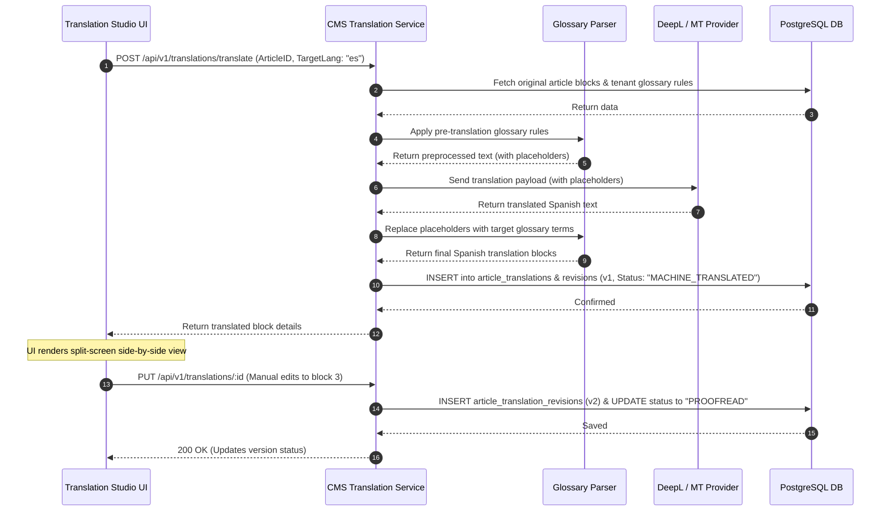

# Translation Studio

## Purpose
The purpose of the Translation Studio design document is to define the technical implementation, API designs, database structures, UI component layouts, and translation pipelines for the NewsOps Cloud translation interface. This module enables split-screen translation editing, machine translation routing, custom idiom glossary mapping, and visual proofreading comparisons.

## Executive Summary
For global news organizations, translating articles quickly and accurately is key to scaling readership. The Translation Studio provides a side-by-side editing interface where the original article is locked on the left and the editable translated content is displayed on the right. The system integrates machine translation APIs (e.g., DeepL, Google Translate) with a custom Glossary service that preprocesses text to swap specific terminology or idioms. Every manual edit made by a translator is tracked in a version history table, allowing proofreaders to compare revisions and revert changes before publication.

## Vision
To build a high-velocity localization workspace that combines fast machine translations with customizable editorial controls and paragraph synchronization, keeping translation layouts aligned.

## Scope
This design document covers:
- Split-screen workspace layout and scroll synchronization logic.
- Machine translation API gateways and custom pre-translation glossary mappings.
- Paragraph-level block alignment models.
- Translation version controls, revisions, and side-by-side diff displays.
- Database DDL schemas and Prisma models for translations, revisions, and glossaries.
- API endpoint designs, RBAC permissions, and security protocols.

## Goals
- Complete automated translation of a 1,500-word article in under $2.0\text{ seconds}$ (P95).
- Ensure scroll alignment between source and target panels with a delay of $<12\text{ ms}$ (P99).
- Apply custom glossary replacements to text payloads with $100\%$ matching accuracy.
- Save editorial adjustments and write translation revisions with database write times under $15\text{ ms}$.

## Functional Requirements
- **Split-Screen Workspace**: Dual-pane editor interface:
  - Left Panel: Displays the original article text in read-only blocks (paragraphs, headers, lists) matching the CMS block layout.
  - Right Panel: Displays editable fields for translated text blocks, aligned side-by-side with the source blocks.
- **Scroll Synchronization**: Automatically scroll the target language panel when the editor scrolls the source language panel, keeping corresponding paragraphs aligned.
- **Idiom Glossary Preprocessor**: An interface to manage translation rules (source text, target translation, language pair). The translation pipeline uses these rules to replace specific terms before sending text to translation APIs.
- **Proofreading Comparison (Diff tool)**: Highlight additions (green) and deletions (red) between translation versions or compared with the raw machine translation.
- **Translation Revisions & Version Control**: Track all changes to translations. Every save operation writes a historical record in `article_translation_revisions`, allowing users to compare and roll back translations.

## Non-Functional Requirements
- **Layout Alignment**: The database must enforce alignment between the translated block array structure and the original article block array structure.
- **RTL Support**: The UI must dynamically shift layouts to Right-to-Left (RTL) orientation when target languages like Arabic (`ar`), Hebrew (`he`), or Persian (`fa`) are selected.
- **Translation Security**: Use zero-data-retention endpoints with translation providers to protect draft copyrights and prevent provider model training on proprietary news content.

## Business Rules
1. A machine-translated article is assigned the status `MACHINE_TRANSLATED` and cannot be published until a translator reviews it and changes its status to `PROOFREAD` or `APPROVED`.
2. Taxonomies, categories, and tags are inherited from the original article but can be overridden for specific locales.
3. Translation glossaries are scoped to tenants, preventing vocabulary cross-leakage between organizations.
4. Re-translating an article via the machine translation engine wipes unsubmitted drafts unless specific blocks are locked by the translator.

## Actors
- **Translator / Proofreader**: Edits translation blocks, configures glossaries, and approves layouts.
- **Translation API Gateway**: Connects the platform to translation providers (DeepL, Google, etc.).
- **Glossary Parser**: Preprocesses text to apply tenant-specific idiom mappings.
- **Publishing Service**: Syncs approved translations to localized frontpages.

## User Stories
1. **As a Translator**, I want to view my original German draft next to an auto-translated English draft in a split pane so that I can correct translation mistakes without switching windows.
2. **As an Editor**, I want to add a glossary rule that translates the German phrase "Katzensprung" to the English idiom "a stone's throw away" instead of the literal translation "cat's jump."
3. **As a Proofreader**, I want to compare the current translation version with the raw machine-translated version to verify the manual changes made by the translator.

## Acceptance Criteria
1. The visual text editor must use block IDs to align target paragraph boxes with source paragraphs, even when blocks are resized.
2. Glossary matches must support case-insensitive searches and boundary word parsing (regex matching).
3. The translation workflow must preserve HTML block tags (such as `<strong>`, `<a>`, `<em>`) and keep them in their correct positions during translation.
4. Any manual save action in the Translation Studio must create a new record in `article_translation_revisions` and increment the `version_number` by 1.

## Workflows
### Translation Compilation and Refinement Workflow
1. **Initiation**: Editor opens Translation Studio on an article, selects the target language (e.g., French), and clicks "Run Translation".
2. **Glossary Application**: The system retrieves glossary rules for the tenant and pre-processes the source text, replacing key phrases with protected placeholders.
3. **API Call**: The translation gateway sends the blocks to the translation API.
4. **Glossary Re-substitution**: The API returns translated text, and the system swaps protected placeholders back with target glossary terms.
5. **Database Transaction**: The system saves the initial translation as `version_number = 1` with the status `MACHINE_TRANSLATED`.
6. **UI Render**: The split-screen editor displays the source text on the left and the translated blocks on the right.
7. **Editing**: The translator edits text blocks, adds inline links, and updates paragraphs.
8. **Save Revision**: The translator hits "Save", saving the updates as `version_number = 2`.
9. **Approval**: The translator marks the status as `PROOFREAD` and approves it for publication.



## API Design

### POST /api/v1/editorial/translations/translate
Triggers machine translation for an article.
**Headers**:
- `Authorization: Bearer <JWT>`
- `X-Tenant-ID: 7a29e31d-b812-4fcf-89b2-321118671234`

**Request Payload**:
```json
{
  "articleId": "8fa23d4c-c049-43c7-9cfb-81d368e7b34e",
  "targetLanguage": "es",
  "engine": "deepl",
  "applyGlossary": true
}
```

**Response Payload (200 OK)**:
```json
{
  "translationId": "trn_991823abf",
  "articleId": "8fa23d4c-c049-43c7-9cfb-81d368e7b34e",
  "targetLanguage": "es",
  "status": "MACHINE_TRANSLATED",
  "versionNumber": 1,
  "blocks": [
    {
      "blockId": "blk_1",
      "type": "heading",
      "source": "NewsOps Cloud Launches Database Architecture",
      "translated": "NewsOps Cloud lanza la arquitectura de base de datos"
    },
    {
      "blockId": "blk_2",
      "type": "paragraph",
      "source": "This document maps the implementation details.",
      "translated": "Este documento detalla los detalles de implementación."
    }
  ]
}
```

### PUT /api/v1/editorial/translations/:id
Saves manual edits to a translation. Creates a new version.
**Request Payload**:
```json
{
  "status": "PROOFREAD",
  "blocks": [
    {
      "blockId": "blk_1",
      "translated": "NewsOps Cloud lanza su arquitectura de base de datos"
    },
    {
      "blockId": "blk_2",
      "translated": "Este documento detalla los planes de implementación."
    }
  ]
}
```

**Response Payload (200 OK)**:
```json
{
  "translationId": "trn_991823abf",
  "status": "PROOFREAD",
  "versionNumber": 2,
  "updatedAt": "2026-06-27T22:50:00Z"
}
```

### POST /api/v1/editorial/translations/glossaries
Creates a new glossary rule for the tenant.
**Request Payload**:
```json
{
  "sourceText": "break a leg",
  "targetText": "Hals- und Beinbruch",
  "sourceLanguage": "en",
  "targetLanguage": "de",
  "matchType": "EXACT"
}
```

**Response Payload (201 Created)**:
```json
{
  "glossaryId": "glo_77182ba",
  "tenantId": "7a29e31d-b812-4fcf-89b2-321118671234",
  "sourceText": "break a leg",
  "targetText": "Hals- und Beinbruch",
  "matchType": "EXACT"
}
```

### GET /api/v1/editorial/translations/:id/revisions
Retrieves the edit history for a translation.
**Response Payload (200 OK)**:
```json
{
  "translationId": "trn_991823abf",
  "revisions": [
    {
      "versionNumber": 2,
      "updatedAt": "2026-06-27T22:50:00Z",
      "modifiedBy": "usr_9912a",
      "changes": ["blk_1", "blk_2"]
    },
    {
      "versionNumber": 1,
      "updatedAt": "2026-06-27T22:45:00Z",
      "modifiedBy": "system_mt",
      "changes": []
    }
  ]
}
```

## Database Design

### PostgreSQL DDL Schema
```sql
-- Schema: editorial_cms additions for Translation Studio

-- Table 1: Article Translations (State tracker)
CREATE TABLE article_translations (
    id VARCHAR(50) PRIMARY KEY, -- 'trn_' + uuid hash
    tenant_id UUID NOT NULL,
    article_id UUID NOT NULL REFERENCES articles(id) ON DELETE CASCADE,
    target_language VARCHAR(10) NOT NULL, -- Language locale (e.g. 'es', 'de', 'ar')
    status VARCHAR(50) DEFAULT 'MACHINE_TRANSLATED' NOT NULL, -- MACHINE_TRANSLATED, PROOFREAD, APPROVED, ARCHIVED
    translated_blocks JSONB NOT NULL, -- Array of objects: {blockId, type, translated}
    current_version INT DEFAULT 1 NOT NULL,
    created_at TIMESTAMP WITH TIME ZONE DEFAULT CURRENT_TIMESTAMP NOT NULL,
    updated_at TIMESTAMP WITH TIME ZONE DEFAULT CURRENT_TIMESTAMP NOT NULL,
    deleted_at TIMESTAMP WITH TIME ZONE
);

CREATE INDEX idx_translations_tenant ON article_translations(tenant_id);
CREATE UNIQUE INDEX idx_translations_article_lang ON article_translations(article_id, target_language) WHERE deleted_at IS NULL;

-- Table 2: Article Translation Revisions (Version Control)
CREATE TABLE article_translation_revisions (
    id UUID PRIMARY KEY DEFAULT gen_random_uuid(),
    translation_id VARCHAR(50) NOT NULL REFERENCES article_translations(id) ON DELETE CASCADE,
    version_number INT NOT NULL,
    status VARCHAR(50) NOT NULL,
    translated_blocks JSONB NOT NULL,
    modified_by UUID, -- Matches Identity schema User ID
    created_at TIMESTAMP WITH TIME ZONE DEFAULT CURRENT_TIMESTAMP NOT NULL
);

CREATE INDEX idx_translation_revisions_lookup ON article_translation_revisions(translation_id, version_number DESC);

-- Table 3: Translation Glossaries (Tenant dictionaries)
CREATE TABLE translation_glossaries (
    id VARCHAR(50) PRIMARY KEY, -- 'glo_' + uuid hash
    tenant_id UUID NOT NULL,
    source_language VARCHAR(10) NOT NULL,
    target_language VARCHAR(10) NOT NULL,
    source_text VARCHAR(255) NOT NULL,
    target_text VARCHAR(255) NOT NULL,
    match_type VARCHAR(50) DEFAULT 'EXACT' NOT NULL, -- EXACT, REGEX
    created_at TIMESTAMP WITH TIME ZONE DEFAULT CURRENT_TIMESTAMP NOT NULL,
    updated_at TIMESTAMP WITH TIME ZONE DEFAULT CURRENT_TIMESTAMP NOT NULL,
    deleted_at TIMESTAMP WITH TIME ZONE
);

CREATE INDEX idx_glossaries_tenant_lang ON translation_glossaries(tenant_id, source_language, target_language);
CREATE UNIQUE INDEX idx_glossaries_unique_rule ON translation_glossaries(tenant_id, source_language, target_language, source_text) WHERE deleted_at IS NULL;
```

### Prisma ORM Models
```prisma
model ArticleTranslation {
  id               String                       @id @db.VarChar(50)
  tenantId         String                       @map("tenant_id") @db.Uuid
  articleId        String                       @map("article_id") @db.Uuid
  targetLanguage   String                       @map("target_language") @db.VarChar(10)
  status           String                       @default("MACHINE_TRANSLATED") @db.VarChar(50)
  translatedBlocks Json                         @map("translated_blocks") @db.Jsonb // [{blockId, type, translated}]
  currentVersion   Int                          @default(1) @map("current_version")
  createdAt        DateTime                     @default(now()) @map("created_at") @db.Timestamptz(6)
  updatedAt        DateTime                     @default(now()) @updatedAt @map("updated_at") @db.Timestamptz(6)
  deletedAt        DateTime?                    @map("deleted_at") @db.Timestamptz(6)
  revisions        ArticleTranslationRevision[]

  @@unique([articleId, targetLanguage, deletedAt])
  @@index([tenantId])
  @@map("article_translations")
}

model ArticleTranslationRevision {
  id               String             @id @default(dbgenerated("gen_random_uuid()")) @db.Uuid
  translationId    String             @map("translation_id") @db.VarChar(50)
  versionNumber    Int                @map("version_number")
  status           String             @db.VarChar(50)
  translatedBlocks Json               @map("translated_blocks") @db.Jsonb
  modifiedBy       String?            @map("modified_by") @db.Uuid
  createdAt        DateTime           @default(now()) @map("created_at") @db.Timestamptz(6)
  translation      ArticleTranslation @relation(fields: [translationId], references: [id], onDelete: Cascade)

  @@unique([translationId, versionNumber])
  @@index([translationId])
  @@map("article_translation_revisions")
}

model TranslationGlossary {
  id             String    @id @db.VarChar(50)
  tenantId       String    @map("tenant_id") @db.Uuid
  sourceLanguage String    @map("source_language") @db.VarChar(10)
  targetLanguage String    @map("target_language") @db.VarChar(10)
  sourceText     String    @map("source_text") @db.VarChar(255)
  targetText     String    @map("target_text") @db.VarChar(255)
  matchType      String    @default("EXACT") @map("match_type") @db.VarChar(50)
  createdAt      DateTime  @default(now()) @map("created_at") @db.Timestamptz(6)
  updatedAt      DateTime  @default(now()) @updatedAt @map("updated_at") @db.Timestamptz(6)
  deletedAt      DateTime? @map("deleted_at") @db.Timestamptz(6)

  @@unique([tenantId, sourceLanguage, targetLanguage, sourceText, deletedAt])
  @@index([tenantId, sourceLanguage, targetLanguage])
  @@map("translation_glossaries")
}
```

## UI Design
The Translation Studio uses a responsive split-screen UI:
1. **Left Panel (Source Canvas)**:
   - Displays the original article text in read-only format.
   - Text is arranged in blocks corresponding to database components.
   - Headers and media assets are displayed inline.
2. **Right Panel (Target Editor)**:
   - Contains editable text inputs for each aligned block on the left.
   - When scrolling the left panel, the right panel scrolls automatically using offset tracking to keep paragraphs aligned.
   - Each block has a lock icon to prevent auto-translation overwrites, a translate block button, and status tags (e.g. Edited, Original).
3. **Glossary Settings Drawer**:
   - Slides out from the right. Allows translators to add terms, verify matches, and manage glossary files.
4. **Proofreading Comparison Panel**:
   - Displays a side-by-side or inline layout diff comparing the current draft with historical versions (such as the raw machine translation or a previous save).
   - Text deletions are highlighted in red strike-through, additions are shown in green underline.

## Permissions
- `translations:read` - Viewer access. Read original articles and existing translations.
- `translations:write` - Editor access. Edit translation blocks, translate content, and save revisions.
- `translations:approve` - Proofreader access. Change translation status to `PROOFREAD` or `APPROVED`.
- `glossaries:manage` - Administrator access. Create, edit, and delete glossary rules.

## Security
- **Data Confidentiality Policy**: To prevent copyright leaks, translation requests use enterprise API keys with zero data-retention options. Translation inputs are never cached by external providers.
- **Cross-Site Scripting (XSS) Prevention**: All translated inputs are sanitized with DOMPurify on save, stripping potential scripts while retaining allowed HTML tags (e.g. `<b>`, `<i>`, `<a>`).
- **Tenant Scope Isolation**: Glossary terms and translations are isolated by `tenant_id`, verified against the editor's JWT claims.

## Performance
- **Scroll Sync Latency**: The scroll synchronization event listener uses throttling. Sync actions must run in under $12\text{ ms}$ on the client browser.
- **Preprocessing Efficiency**: Glossary replacements use Trie structures to search and replace terms, executing in under $5\text{ ms}$ for a 2,000-word article.
- **SLA Limits**: API gateway timeout for translation providers is capped at $4000\text{ ms}$.

## Monitoring
- `newsops_translation_requests_total`: Counter tracking translation API requests by provider.
- `newsops_translation_words_total`: Counter tracking the number of words sent to translation APIs.
- `newsops_translation_revisions_total`: Counter tracking saved translation revisions.
- `newsops_glossary_matches_total`: Counter tracking the number of glossary matches applied.
- **Alert Trigger**: Trigger alert if translation provider API errors (HTTP 5xx, 429) exceed $5\%$ of total requests over a rolling 15-minute window.

## Logging
- **Log Format**: JSON log format.
- **Log Level**: INFO for translation completions; WARN for glossary match warnings; ERROR for translation API timeouts.
- **Log Context**:
  ```json
  {
    "timestamp": "2026-06-27T22:45:10.112Z",
    "level": "INFO",
    "context": "translation-service",
    "tenant_id": "7a29e31d-b812-4fcf-89b2-321118671234",
    "article_id": "8fa23d4c-c049-43c7-9cfb-81d368e7b34e",
    "target_language": "es",
    "word_count": 1280,
    "provider": "deepl"
  }
  ```

## Error Handling
- `ERR_TRANSLATION_API_LIMIT`: Code 429. HTTP Status 429 Too Many Requests. Message: "Translation provider rate limit reached. Please try again shortly."
- `ERR_UNSUPPORTED_LANGUAGE`: Code 400. HTTP Status 400 Bad Request. Message: "The requested target language is not supported by the selected translation engine."
- `ERR_GLOSSARY_CONFLICT`: Code 409. HTTP Status 409 Conflict. Message: "A glossary rule for this source phrase already exists in this language pair."

## Edge Cases
- **HTML Tag Deletions**: If an automated translation drops formatting tags (like `</a>` or `</strong>`), the preprocessor detects mismatched tags, runs a tag balancer, and flags the translation as `NEEDS_REVIEW` to prevent rendering issues.
- **Paragraph Count Mismatch**: If a translation API merges or splits paragraphs, the database matches translated text by block index. If blocks cannot be matched, the translator is prompted to manually align paragraphs in the UI.

## Future Improvements
- **Automatic Idiom Suggestions**: Use LLMs to suggest idiom updates for translations based on local cultural contexts.
- **Dynamic Translation Layout Sync**: Automatically generate and crop localized images and adjust their focal points according to the reading direction of the target language.

## Mermaid Diagrams

### Flowchart: Visual Diff and Proofreading Workflow
```mermaid
flowchart TD
    A[Proofreader opens comparison tool] --> B[Fetch target translation record]
    B --> C[Fetch selected revision versions (e.g. v2 vs v1)]
    C --> D[Retrieve block-level text contents]
    D --> E[Run Myers Diff algorithm on paragraphs]
    E --> F[Generate HTML layout with diff tags]
    F --> G[Highlight insertions in green & deletions in red]
    G --> H[Display diffs in side-by-side view]
    H --> I[Proofreader approves changes and updates status to APPROVED]
```

## References
- [Editorial CMS Database Schema](../03-database/editorial_and_cms_schema.md)
- [System Architecture Blueprint](../02-architecture/system_architecture.md)
- [Zero Cost MVP Architecture](../02-architecture/zero_cost_mvp_architecture.md)
- [Indexes and Partitioning Specs](../03-database/indexes_and_partitioning.md)
