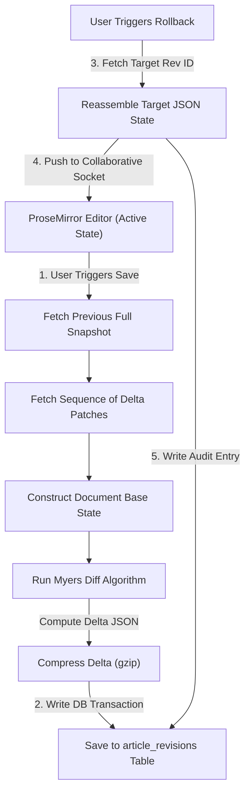

# Revision Control Mechanisms

## Purpose
This document outlines the architecture, data schemas, algorithms, and APIs governing the revision control and rollback system for the NewsOps Cloud digital publishing platform.

## Executive Summary
Newsrooms operate under rapid, iterative cycles. Tracking edits, understanding differences, tagging milestones, and rolling back to stable drafts is critical to editorial compliance and efficiency. The NewsOps Cloud Revision Control system tracks document mutations through a JSON-delta history mechanism based on Myers' diff algorithm adapted for structured ProseMirror node trees. The system exposes endpoints to run side-by-side visual diff computations, restore historical snapshots, and apply semantic labels (such as "Legal Approved" or "Pre-Embargo Release") to specific points in time.

## Vision
To provide a secure, immutable ledger of all editorial changes that supports real-time comparison capabilities and guarantees instant, zero-data-loss document rollback with audit trails.

## Scope
The scope of this architecture covers:
*   Document delta generation algorithms and transaction management.
*   Revision storage schemas in PostgreSQL.
*   APIs for retrieving history timelines, calculating diffs, and executing rollbacks.
*   Metadata structures for version tagging and editorial milestones.
*   Audit log integration.

## Goals
*   **Exact Auditability**: Track every character modification, asset insertion, and styling change with creator attribution.
*   **Minimal Storage Overhead**: Store revisions as compressed binary deltas (RFC 3284 VCDIFF or JSON-diff format) rather than full document duplicates.
*   **Fast Diffs**: Complete character-level and block-level Myers diff computations on a 10,000-word article in under 15ms.

## Functional Requirements
*   **Continuous Delta Tracking**: The system must automatically compute and record a delta patch whenever the collaborative editor flushes edits.
*   **Side-by-Side Visual Diff**: The system must generate visual comparison payloads highlighting additions (green, underlined) and deletions (red, struck-through) between any two arbitrary revisions.
*   **Revision Rollback/Restore**: Authors must be able to restore the active state of an article to any prior revision ID, automatically creating a new restoration node in the version tree.
*   **Semantic Milestone Tagging**: Users must be able to tag a revision with custom markers (e.g., `editorial_milestone`, `legal_review_pass`, `final_draft`).

## Non-Functional Requirements
*   **Recovery Point Objective (RPO)**: The system must guarantee an RPO of 0 (no committed edits lost).
*   **API Response Time**: Loading the revision history list must take less than 50ms for the first 100 entries.
*   **Storage Density**: Average delta size per transaction should be kept below 2KB.

## Business Rules
*   **Immutability of History**: Revisions once saved cannot be updated, modified, or deleted by any user (including administrators) to maintain legal accountability.
*   **Revision Tag Exclusivity**: A tag (e.g., `published_v1`) is unique within an article's timeline; tagging a new revision with an existing tag automatically relocates the tag pointer.
*   **Rollback Attribution**: Every rollback action must explicitly identify the user triggering the rollback as a new revision entry.

## Actors
*   **Journalist**: Creates drafts, views edit history, and recovers lost text segments.
*   **Chief Editor**: Audits changes, tags legal/editorial milestones, and rolls back files to approved states.
*   **Audit Compliance Officer**: Inspects revision logs for regulatory compliance and verification of source protection policies.
*   **History Worker daemon**: Asynchronously bundles real-time Yjs updates into structured revision snapshots in the database.

## User Stories
1.  As a journalist, I want to compare my current draft against my original submission side-by-side so that I can verify that my editor's changes haven't altered the factual reporting of the story.
2.  As a chief editor, I want to tag a version of the article as "Legal Approved" so that the publishing team knows which version of the sensitive piece is cleared for public release.
3.  As an editor, I want to restore an article to the draft it was at 4 hours ago because the secondary angles we added turned out to be false leads, and we need to revert the text immediately.

## Acceptance Criteria
*   **Rollback Success Rate**: 100% of rollback operations must result in a valid ProseMirror JSON document that opens correctly in the collaborative editor.
*   **Diff Computation Bound**: A side-by-side comparison of two versions containing up to 1,000 modified sentences must be completed and return results in less than 30ms.
*   **Tag Integrity**: Trying to assign an invalid or empty tag name must return a `422 Unprocessable Entity` error.

## Workflows
1.  **Delta Compression and Saving Workflow**:
    *   Editor gateway receives document edit stream.
    *   At standard intervals (every 10 seconds of silence, or upon explicit user save), the History Worker reads the active Yjs state.
    *   System computes the Myers difference between the current state and the last committed revision.
    *   System saves the difference as a gzip-compressed delta record in `article_revisions`.
2.  **Visual Diff Retrieval Workflow**:
    *   User selects Revision #12 and Revision #15 in the UI history panel.
    *   Client requests `GET /api/v1/editorial/articles/{id}/diff?from=12&to=15`.
    *   The backend retrieves both revision updates, applies the sequence of patches to build the intermediate states, executes the Myers Diff engine, and returns a JSON payload detailing character additions and deletions with formatting flags.
    *   The UI renders the comparative HTML visualization.

## API Design

### Get Revision List
```http
GET /api/v1/editorial/articles/123e4567-e89b-12d3-a456-426614174000/revisions?limit=20&offset=0 HTTP/1.1
Host: cms.newsops.cloud
Authorization: Bearer <JWT_TOKEN>
```
**Response:**
```json
{
  "article_id": "123e4567-e89b-12d3-a456-426614174000",
  "total_revisions": 142,
  "revisions": [
    {
      "revision_id": 142,
      "parent_id": 141,
      "created_by": "usr_99876",
      "created_at": "2026-06-27T22:20:00Z",
      "change_summary": "Rollback to Revision 124 (Legal Approved)",
      "tags": ["milestone_active_v2"]
    },
    {
      "revision_id": 141,
      "parent_id": 140,
      "created_by": "usr_22109",
      "created_at": "2026-06-27T22:15:30Z",
      "change_summary": "Updated paragraph 3 copy on regulatory changes",
      "tags": []
    }
  ]
}
```

### Get Visual Diff Payload
```http
GET /api/v1/editorial/articles/123e4567-e89b-12d3-a456-426614174000/diff?from=140&to=141 HTTP/1.1
Host: cms.newsops.cloud
Authorization: Bearer <JWT_TOKEN>
```
**Response:**
```json
{
  "from_revision": 140,
  "to_revision": 141,
  "diff_blocks": [
    {
      "block_id": "node_77612",
      "type": "paragraph",
      "changes": [
        { "op": "equal", "text": "The Federal Reserve announced " },
        { "op": "delete", "text": "yesterday " },
        { "op": "insert", "text": "on Saturday afternoon " },
        { "op": "equal", "text": "that interest rates will adjust downwards." }
      ]
    }
  ]
}
```

### Tag a Revision
```http
POST /api/v1/editorial/articles/123e4567-e89b-12d3-a456-426614174000/revisions/141/tags HTTP/1.1
Host: cms.newsops.cloud
Content-Type: application/json
Authorization: Bearer <JWT_TOKEN>

{
  "tag_name": "legal_review_approved",
  "description": "Passed legal vetting regarding third-party allegations."
}
```
**Response:**
```json
{
  "revision_id": 141,
  "tag_name": "legal_review_approved",
  "tagged_by": "usr_10293",
  "tagged_at": "2026-06-27T22:32:00Z"
}
```

### Execute Rollback
```http
POST /api/v1/editorial/articles/123e4567-e89b-12d3-a456-426614174000/rollback HTTP/1.1
Host: cms.newsops.cloud
Content-Type: application/json
Authorization: Bearer <JWT_TOKEN>

{
  "target_revision_id": 124
}
```
**Response:**
```json
{
  "status": "success",
  "new_revision_id": 143,
  "restored_from": 124,
  "timestamp": "2026-06-27T22:32:15Z"
}
```

## Database Design

### PostgreSQL: Revision Schema Table
```sql
CREATE TABLE IF NOT EXISTS article_revisions (
    article_id UUID NOT NULL,
    revision_id INT NOT NULL,
    parent_id INT,
    created_by VARCHAR(64) NOT NULL,
    created_at TIMESTAMP WITH TIME ZONE DEFAULT CURRENT_TIMESTAMP,
    change_summary VARCHAR(256),
    delta_patch BYTEA NOT NULL, -- Compressed binary patch representation
    PRIMARY KEY (article_id, revision_id)
);

CREATE INDEX idx_revisions_lookup ON article_revisions (article_id, revision_id DESC);
```

### PostgreSQL: Revision Tags Table
```sql
CREATE TABLE IF NOT EXISTS article_revision_tags (
    article_id UUID NOT NULL,
    tag_name VARCHAR(64) NOT NULL,
    revision_id INT NOT NULL,
    assigned_by VARCHAR(64) NOT NULL,
    assigned_at TIMESTAMP WITH TIME ZONE DEFAULT CURRENT_TIMESTAMP,
    description TEXT,
    PRIMARY KEY (article_id, tag_name),
    FOREIGN KEY (article_id, revision_id) REFERENCES article_revisions(article_id, revision_id) ON DELETE CASCADE
);

CREATE INDEX idx_revision_tags_link ON article_revision_tags (article_id, revision_id);
```

## UI Design
The revision control interface contains three sub-views:
*   **Version Timeline panel**: Sidebar scrolling list showing revision numbers, timestamps, author names, and custom tags. Clicking any version loads its snapshot in the viewer.
*   **Diff Slider view**: Two-column visual layout. The left column shows the original content with deleted words highlighted in red. The right column shows the new version with inserted text in green.
*   **Milestone Tag configuration dialog**: Action window allowing users to type tag strings, select colors, and view historical tags active on this article.

## Permissions
*   `articles:revisions:read`: View version history and comparison diffs.
*   `articles:revisions:tag`: Attach semantic metadata tags to versions.
*   `articles:revisions:rollback`: Trigger document state rollbacks.

## Security
*   **Immutable Write Enforcement**: Database permissions must restrict SQL `UPDATE` or `DELETE` commands on the `article_revisions` table except for database administrators under emergency recovery conditions.
*   **PII Filtering**: Revision metadata must obscure sensitive worker identifiers unless the requesting user possesses administrative clearance.

## Performance
*   **Delta Compilation Latency**: Under 25ms.
*   **Network Payload Limit**: Compression (gzip/zstd) must achieve a minimum 4:1 compression ratio on JSON content.
*   **Target TPS**: Supports 1,000 parallel diff computations per second.

## Monitoring
*   `newsops_revision_delta_size_bytes`: Summary metric tracking size distribution of computed deltas.
*   `newsops_revision_diff_duration_seconds`: Histogram measuring Myers diff algorithm computation times.
*   `newsops_revision_rollback_events_total`: Counter tracking execution of rollback APIs.

## Logging
```json
{
  "timestamp": "2026-06-27T22:33:00Z",
  "level": "INFO",
  "logger": "com.newsops.editorial.versioncontrol.RollbackService",
  "message": "Document revision successfully rolled back",
  "context": {
    "article_id": "123e4567-e89b-12d3-a456-426614174000",
    "target_revision": 124,
    "new_revision": 143,
    "user_id": "usr_99876"
  }
}
```

## Error Handling
| Error Code | HTTP Status | Customer-Facing Message |
| :--- | :--- | :--- |
| `ERR_REV_NOT_FOUND` | 404 Not Found | The specified revision number does not exist on this article. |
| `ERR_TAG_DUPLICATE` | 409 Conflict | The tag name specified is already in use by a protected revision. |
| `ERR_INVALID_PATCH` | 500 Internal Error | The delta patch file is corrupted and cannot be applied to the base snapshot. |

## Edge Cases
*   **Parallel Rollbacks**: If two editors try to rollback the document to different points in time simultaneously, the Postgres schema locks the row using a write-intent transaction block on the parent article's metadata row, resolving the request sequentially.
*   **Reverting an Already Reverted Document**: A rollback to a version that was itself created by an earlier rollback is fully supported. The parent pointer structure forms a directed acyclic graph (DAG) of document state paths, permitting complex undo-redo cycles.

## Future Improvements
*   **Git-backed Backup Integration**: Periodically backup tagged milestones to an external, offline git repository for extreme disaster resilience.
*   **Semantic AI Summarization**: Generate natural language change summaries (e.g. "Changed paragraph 2 to mention OPEC agreements and corrected spelling of leader's name") using low-latency local LLMs.

## Mermaid Diagrams


## References
*   [Editorial Index Map](index.md)
*   [Collaborative Rich-Text Specification](collaborative_editor.md)
*   [Database History Schema Specs](../03-database/audit_and_history_schema.md)
