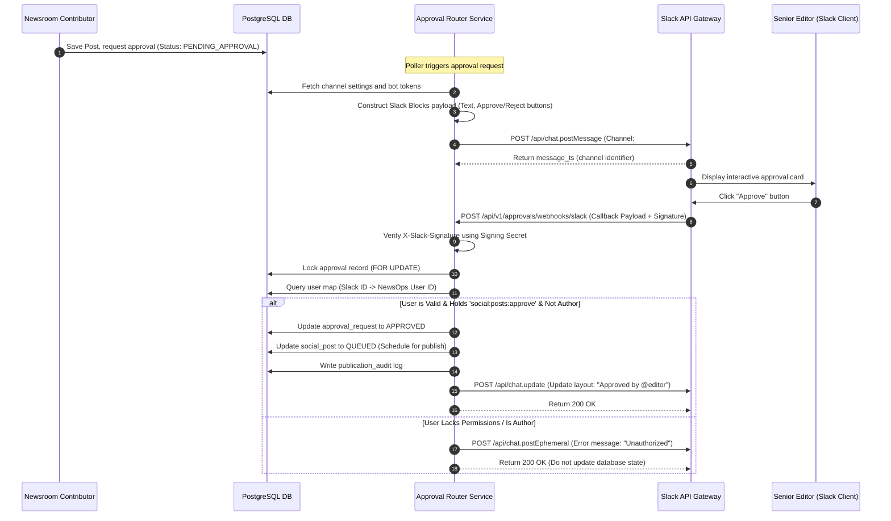
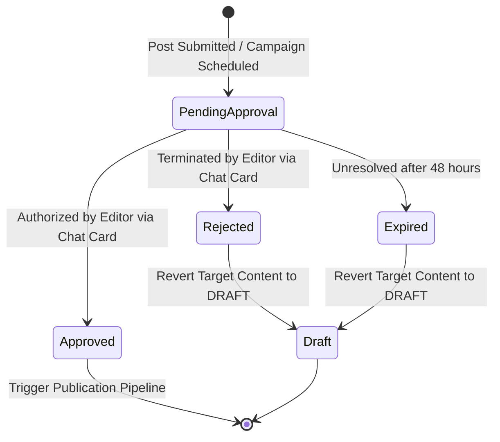

# Interactive Approval Routing

## Purpose
The Interactive Approval Routing document defines the architecture, message payloads, security protocols, and callback handlers for coordinating content publication approvals via Slack block buttons, Telegram inline keyboard buttons, and Microsoft Teams Adaptive Cards. It specifies the authentication, permission validation, and transaction locking systems required to manage publication states from chat environments.

## Executive Summary
Before editorial content or newsletter campaigns publish to external channels, they frequently require peer review. To accelerate this process, the NewsOps Cloud Interactive Approval Routing engine sends rich messages directly to connected organization chat applications. Editors can review content and click "Approve" or "Reject" actions directly in their client. The system intercepts the webhook callback, verifies the identity and authorization of the user against RBAC rules, and modifies the database publication state securely.

## Vision
To streamline editorial workflows by enabling editors to review, authorize, or reject critical newsletter distributions and social posts directly from their mobile or desktop chat clients, maintaining zero-trust validation controls.

## Scope
The scope of this system includes:
- Interactive layout generators for Slack Blocks, Telegram Inline Keyboards, and MS Teams Adaptive Cards.
- Secure callback webhook endpoints mapping chat platform users to NewsOps accounts.
- Cryptographic signature check engines verifying callback authenticity.
- RBAC validation check protocols for external action executors.
- Transactional locking logic preventing duplicate actions.

It does not cover:
- Direct instant messaging user-to-user communications.
- Workspace setup and token installation oauth flows for Slack/MS Teams directories.
- General notification routing for non-editorial system events.

## Goals
- Dispatch approval cards to destination chat platforms within 1.5 seconds of request trigger.
- Complete callback signature verification and RBAC checks in under 300ms.
- Support 100% auditable traceability for all approved publication events.
- Enforce strict segregation of duties (e.g., block authors from approving their own posts).
- Maintain robust failover states when external chat platform APIs return timeouts.

## Functional Requirements
- **Interactive Card Dispatcher**: Generates and posts JSON payload cards to channel webhooks or chat bots.
- **Payload Callback Handlers**: Endpoints to capture interactive button-click payloads from Slack, Telegram, and MS Teams.
- **Identity Resolver**: Resolves external chat client IDs (e.g., Slack member IDs) to internal platform user accounts.
- **Action Auditing**: Records all action responses (who clicked, when, and their decision) inside the platform audit logs.
- **Post-Action Card Update**: Updates the chat card interface to show the action results (e.g., "Approved by Jane Doe at 10:15 AM") to prevent other reviewers from acting on stale cards.

## Non-Functional Requirements
- **High Performance**: Webhook callbacks must respond with a `200 OK` within 2 seconds of receipt to satisfy platform SLA constraints.
- **End-to-End Security**: Signature verification is mandatory for all inbound payloads. Unsigned or invalid requests are dropped immediately.
- **Reliability**: Use database row locks (`SELECT FOR UPDATE`) during callback handling to prevent duplicate approval triggers.
- **Resilience**: The service must run in high-availability clusters to prevent lost webhook callbacks.

## Business Rules
1. A user cannot approve an asset they authored (Segregation of Duties).
2. Only users possessing `social:posts:approve` (or `newsletters:campaigns:approve`) permission scopes are authorized to run approvals.
3. Approval requests automatically expire and transition to `EXPIRED` status 48 hours after generation.
4. If an approval is rejected, the target post must immediately revert to `DRAFT` status and notify the original author.
5. Organization settings define which channels (Slack, Telegram, Teams) receive approval requests.

## Actors
- **Contributor**: Authors a post and requests publication approval.
- **Approving Editor**: Senior staff member reviewing details and clicking interactive cards.
- **Approval Router Service**: Core microservice coordinating card layout generation and callback validations.
- **Chat Webhook Gateway**: External API endpoints representing Slack, Telegram, or MS Teams.

## User Stories (At least 3 specific stories)
1. **As a Contributor**, I want to submit a newsletter campaign for review and have a Slack notification automatically sent to the `#editorial-approvals` channel so that senior editors can review it quickly.
2. **As an Approving Editor**, I want to click an "Approve" button on a Telegram inline keyboard while using my phone so that I can authorize a breaking news post immediately without logging into the CMS.
3. **As a Compliance Officer**, I want every social post publication to link directly to an audit record showing the specific editor who clicked the approval card in MS Teams to ensure accountability.

## Acceptance Criteria (At least 3-5 criteria with clear thresholds)
1. The callback endpoints must validate incoming requests using HMAC-SHA256 signature checking against the respective platform secret keys.
2. If the user executing the chat action does not have their chat handle linked to a NewsOps account with appropriate permissions, a warning card must post back to the channel, and the DB transaction must roll back.
3. Interactive buttons must disable or change their state to "Processing..." upon click to prevent double-click actions.
4. An audit log entry must be created in the `publication_audit` database table containing the approver's user ID, timestamp, and target platform.

## Workflows (Step-by-step description of system and user interactions)

### Slack Approval Ingestion and State Transition Workflow


## API Design (Provide actual REST endpoints, method, request/response JSON payloads, or GraphQL schemas)

### POST /api/v1/approvals/request
Triggers an approval request.
**Request Headers**:
- `Authorization: Bearer <JWT>`
- `Content-Type: application/json`

**Request Payload**:
```json
{
  "targetType": "SOCIAL_POST",
  "targetId": "pst_77182901",
  "requestedBy": "usr_44901",
  "organizationId": "org_33901"
}
```

**Response Payload (201 Created)**:
```json
{
  "approvalId": "apr_1290881",
  "status": "PENDING",
  "channelsDispatched": ["SLACK", "TELEGRAM"],
  "expiresAt": "2026-06-29T22:32:13.000Z"
}
```

### POST /api/v1/approvals/webhooks/slack
Receives Slack interaction payload calls.
**Request Headers**:
- `X-Slack-Signature: v0=a2114d578a11342bb09f1938ee1b2d`
- `X-Slack-Request-Timestamp: 1782606733`
- `Content-Type: application/x-www-form-urlencoded`

**Request Payload (URL-Encoded Payload Field decoded to JSON)**:
```json
{
  "type": "block_actions",
  "user": {
    "id": "U123456",
    "username": "jdoe"
  },
  "api_app_id": "A01123908",
  "container": {
    "type": "message",
    "message_ts": "1782606700.000100",
    "channel_id": "C993801"
  },
  "actions": [
    {
      "action_id": "approve_action",
      "block_id": "block_approval_actions",
      "value": "apr_1290881",
      "type": "button",
      "action_ts": "1782606733.100100"
    }
  ]
}
```

**Response Status**:
- `200 OK`

## Database Design (Identify schema tables, fields, and indexes relevant to this feature)

### Prisma Schema
```prisma
datasource db {
  provider = "postgresql"
  url      = env("DATABASE_URL")
}

generator client {
  provider = "prisma-client-js"
}

enum ApprovalStatus {
  PENDING
  APPROVED
  REJECTED
  EXPIRED
}

enum ApprovalChannelType {
  SLACK
  TELEGRAM
  MS_TEAMS
}

model ApprovalRequest {
  id             String         @id @default(dbgenerated("concat('apr_', replace(gen_random_uuid()::text, '-', ''))")) @db.VarChar(50)
  organizationId String         @map("organization_id") @db.VarChar(50)
  targetType     String         @map("target_type") @db.VarChar(50) // SOCIAL_POST, CAMPAIGN
  targetId       String         @map("target_id") @db.VarChar(50)
  requestedBy    String         @map("requested_by") @db.VarChar(50)
  approvedBy     String?        @map("approved_by") @db.VarChar(50)
  status         ApprovalStatus @default(PENDING)
  expiresAt      DateTime       @map("expires_at")
  createdAt      DateTime       @default(now()) @map("created_at")
  updatedAt      DateTime       @updatedAt @map("updated_at")

  dispatchedCards DispatchedCard[]

  @@index([organizationId, status])
  @@index([targetType, targetId])
  @@map("approval_requests")
}

model UserChatMapping {
  id             String   @id @default(dbgenerated("concat('map_', replace(gen_random_uuid()::text, '-', ''))")) @db.VarChar(50)
  organizationId String   @map("organization_id") @db.VarChar(50)
  userId         String   @map("user_id") @db.VarChar(50)
  platform       ApprovalChannelType
  externalChatId String   @map("external_chat_id") @db.VarChar(255)
  createdAt      DateTime @default(now()) @map("created_at")

  @@unique([organizationId, userId, platform])
  @@unique([platform, externalChatId])
  @@map("user_chat_mappings")
}

model DispatchedCard {
  id                String              @id @default(dbgenerated("concat('crd_', replace(gen_random_uuid()::text, '-', ''))")) @db.VarChar(50)
  approvalRequestId String              @map("approval_request_id") @db.VarChar(50)
  channel           ApprovalChannelType
  messageIdentifier String              @map("message_identifier") @db.VarChar(255) // TS for Slack, message_id for Telegram
  destinationGroup  String              @map("destination_group") @db.VarChar(255)
  createdAt         DateTime            @default(now()) @map("created_at")

  approvalRequest   ApprovalRequest     @relation(fields: [approvalRequestId], references: [id], onDelete: Cascade)

  @@index([approvalRequestId])
  @@map("dispatched_cards")
}
```

### PostgreSQL DDL
```sql
CREATE TYPE approval_status AS ENUM ('PENDING', 'APPROVED', 'REJECTED', 'EXPIRED');
CREATE TYPE approval_channel_type AS ENUM ('SLACK', 'TELEGRAM', 'MS_TEAMS');

CREATE TABLE approval_requests (
    id VARCHAR(50) PRIMARY KEY DEFAULT concat('apr_', replace(gen_random_uuid()::text, '-', '')),
    organization_id VARCHAR(50) NOT NULL,
    target_type VARCHAR(50) NOT NULL,
    target_id VARCHAR(50) NOT NULL,
    requested_by VARCHAR(50) NOT NULL,
    approved_by VARCHAR(50),
    status approval_status NOT NULL DEFAULT 'PENDING',
    expires_at TIMESTAMP WITH TIME ZONE NOT NULL,
    created_at TIMESTAMP WITH TIME ZONE NOT NULL DEFAULT NOW(),
    updated_at TIMESTAMP WITH TIME ZONE NOT NULL DEFAULT NOW()
);

CREATE INDEX idx_approval_requests_org_status ON approval_requests(organization_id, status);
CREATE INDEX idx_approval_requests_target ON approval_requests(target_type, target_id);

CREATE TABLE user_chat_mappings (
    id VARCHAR(50) PRIMARY KEY DEFAULT concat('map_', replace(gen_random_uuid()::text, '-', '')),
    organization_id VARCHAR(50) NOT NULL,
    user_id VARCHAR(50) NOT NULL,
    platform approval_channel_type NOT NULL,
    external_chat_id VARCHAR(255) NOT NULL,
    created_at TIMESTAMP WITH TIME ZONE NOT NULL DEFAULT NOW(),
    CONSTRAINT uq_org_user_platform UNIQUE (organization_id, user_id, platform),
    CONSTRAINT uq_platform_chat_id UNIQUE (platform, external_chat_id)
);

CREATE TABLE dispatched_cards (
    id VARCHAR(50) PRIMARY KEY DEFAULT concat('crd_', replace(gen_random_uuid()::text, '-', '')),
    approval_request_id VARCHAR(50) NOT NULL REFERENCES approval_requests(id) ON DELETE CASCADE,
    channel approval_channel_type NOT NULL,
    message_identifier VARCHAR(255) NOT NULL,
    destination_group VARCHAR(255) NOT NULL,
    created_at TIMESTAMP WITH TIME ZONE NOT NULL DEFAULT NOW()
);

CREATE INDEX idx_dispatched_cards_request ON dispatched_cards(approval_request_id);
```

## UI Design (Describe component structure, layouts, actions, and states)
- **Workspace Mappings Screen**: Form letting users associate their Slack Member IDs, Telegram user IDs, or Teams UPN strings to their NewsOps platform accounts.
- **Approval Channels Configurations**: Organization dashboard setting indicating active target channels. Allows users to insert bot credential strings, secret tokens, and channel labels.
- **Pending Approvals Queue**: Live view displaying approval requests awaiting decisions. Shows fields indicating time left until expiration (48h countdown) and links to preview raw content blocks.

## Permissions (Specify RBAC permissions required, e.g., organizations:read, articles:write)
- `approvals:manage:write`: Setup and modify organizational bot webhook mappings (Admin).
- `approvals:requests:create`: Submit assets to approval paths (Editor, Contributor, Admin).
- `social:posts:approve`: Execute approval buttons for social media posts (Editor, Admin).
- `newsletters:campaigns:approve`: Execute approval buttons for newsletter dispatches (Editor, Admin).

## Security (Detail security considerations, e.g., input validation, CSRF, JWT validation)
- **HMAC Signature Validations**: Slack callbacks verify signatures using the computed HMAC-SHA256 hash of the request raw body prefixing the timestamp value (`v0=...`). Telegram signatures verify callbacks using bot-token hash validation scripts.
- **Segregation of Duties Enforcement**: Ingest controllers query the target approval requests DB record to confirm `requested_by` (author ID) is not equal to the resolving user ID.
- **Replay Attack Protections**: Slack requests timestamps must be validated against `NOW()`. Calls older than 5 minutes are dropped.
- **Sensitive Key Encryption**: Store chat API tokens, bot keys, and signing secrets in encrypted format utilizing AWS Key Management Service (KMS) layers.

## Performance (State latency limits, caching requirements, target TPS)
- **SLA Ingestion Limits**: Webhook receiver endpoints must confirm payload reads in under 200ms using asynchronous queue execution structures.
- **Cache Mappings**: Map active external chat IDs to database user records in Redis with a 24-hour expiration TTL to avoid frequent DB joins.
- **Target Callback Rates**: Support up to 200 concurrent user callbacks/sec.

## Monitoring (Detail Prometheus metrics names, alert triggers)
- `approvals_dispatched_total`: Counter tracking notifications sent, categorized by target chat platforms.
- `approvals_received_total`: Counter tracking inbound interactive callbacks, labeled by result (`success`, `unauthorized`, `duplicate`).
- `approval_callback_processing_seconds`: Histogram tracking processing latency from webhook request receipt to database commit.
- **Alert Triggers**:
  - Critical: Webhook callback request failures (HTTP 5xx responses) exceed 1% in any 10-minute slot.
  - Warning: Queue times for dispatching card messages exceed 30 seconds.

## Logging (Specify log formats, error levels, log contexts)
- **Log Format**: JSON log format.
- **Log Level**: INFO for notifications and decisions, WARN for invalid signature attempts or unauthorized users, ERROR for platform API outages.
- **Log Context**: Includes parameters `approval_id`, `chat_user_id`, `mapped_user_id`, `action_decision`, and `signature_verified`.
- **Log Example**:
```json
{
  "timestamp": "2026-06-27T22:32:13.910Z",
  "level": "WARN",
  "context": "approval-webhook-receiver",
  "approval_id": "apr_1290881",
  "chat_user_id": "U123456",
  "error_code": "SEGREGATION_OF_DUTIES_VIOLATION",
  "message": "User attempted to self-approve a post they created. Transaction rejected."
}
```

## Error Handling (Map input/system error codes to HTTP status and customer-facing messages)
- `SIGNATURE_VERIFICATION_FAILED`: Code 401. HTTP Status 401 Unauthorized. Message: "Cryptographic signature check failed. Webhook source unverified."
- `SECURE_USER_UNMAPPED`: Code 403. HTTP Status 403 Forbidden. Message: "Your chat user ID is not mapped to an active NewsOps account. Contact support."
- `AUTHOR_IS_APPROVER`: Code 409. HTTP Status 409 Conflict. Message: "You are the author of this post and are unauthorized to approve it."
- `REQUEST_ALREADY_RESOLVED`: Code 410. HTTP Status 410 Gone. Message: "This approval request has already been resolved by another editor."

## Edge Cases (Handle race conditions, rate limit hits, upstream timeouts)
- **Concurrent Approvals / Double-Clicking**: If two editors click "Approve" at the same time, the worker processing the first click uses `SELECT ... FOR UPDATE` row locking. The second worker reads the updated status (`APPROVED`), bypasses execution, and posts an ephemeral notice to the second editor stating the request was already resolved.
- **Unlinked External Users**: If an unlinked editor clicks a button, the system intercepts the action, rolls back DB writes, and sends an ephemeral message containing a button link to the workspace mapping configuration page.
- **Third-Party API Downtime**: If Slack is down, the system maintains fallback dashboard views inside the primary CMS console, letting editors approve posts manually.

## Future Improvements (Provide long-term scaling, architecture refactor paths)
- **Multi-Tier Hierarchical Approvals**: Support workflows requiring linear sequential approvals (e.g., Legal clearance -> Editorial review -> Editor-in-Chief authorization).
- **Conditional Rules Engines**: Automatically route approvals to specific chat channels based on content tags (e.g., finance posts route to `#legal-review`).

## Mermaid Diagrams (Include at least one high-quality diagram: flowchart, sequence, or ERD)


## References (Reference other related files in the repository using standard relative markdown links, e.g., '../02-architecture/system_architecture.md')
- [System Architecture](../02-architecture/system_architecture.md)
- [Social Publishing Schema](../03-database/social_publishing_schema.md)
- [Newsletter Sender Engine](./newsletter_sender.md)
- [Social Analytics Telemetry](./social_analytics_telemetry.md)
