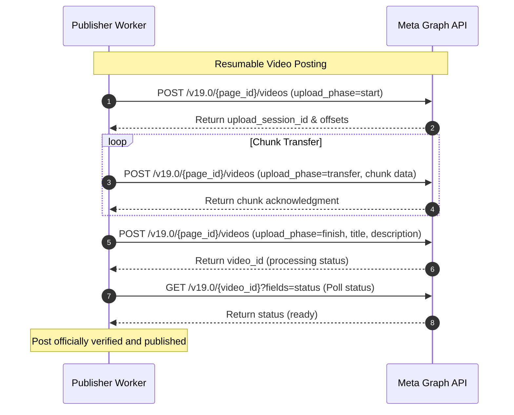
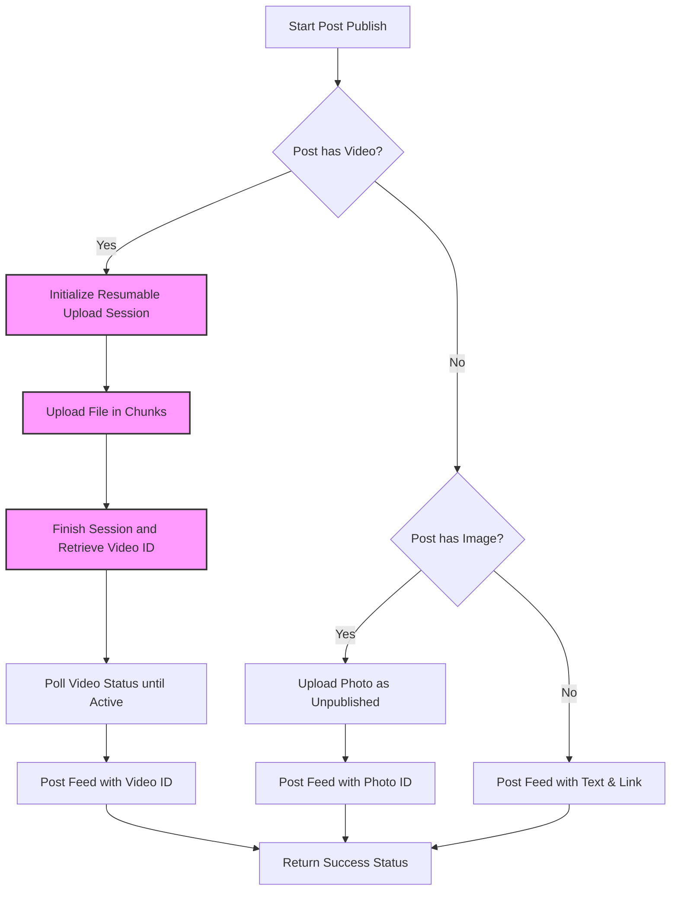

# Facebook Publisher
## Purpose
The purpose of the Facebook Publisher is to connect NewsOps Cloud to the Meta Graph API, allowing newsrooms to programmatically broadcast page posts, attach images and videos, handle API errors, and validate link sharing previews.

## Executive Summary
The Facebook Publisher is a platform-specific publishing adapter within the NewsOps Cloud social publishing suite. It handles integration with Meta's Graph API (v19.0) to publish posts to managed Facebook Pages. The adapter manages authentication using long-lived Page Access Tokens, structures text and link parameters, uploads images and videos (including chunked resumable uploads for large media assets), and implements error-retry policies based on Meta-specific API error codes.

## Vision
To establish a seamless and highly reliable connection with Meta's ecosystem, enabling editorial teams to distribute content to Facebook without leaves the NewsOps workspace. The module handles all underlying API complexities—such as rate limits, large video file chunking, and OpenGraph link mapping—transparently, allowing editors to focus solely on content creation and audience reach.

## Scope
The Facebook Publisher includes:
- Integration with Meta Graph API endpoints (`/{page_id}/feed`, `/{page_id}/photos`, `/{page_id}/videos`).
- Authentication lifecycle handling via long-lived Page Access Tokens.
- Media upload workflows: single/multiple image posts, chunked resumable video uploads.
- OpenGraph link validation and explicit link passing parameter parsing.
- Meta API error classification and conditional retry loops.

The Facebook Publisher excludes:
- Meta User Account authentication (handled by the central OAuth/Connection wizard).
- Webhook listener for incoming Facebook comments (handled by the Engagement microservice).

## Goals
- Achieve a 99.9% publication success rate for valid post payloads.
- Upload video files up to 4GB using standard chunked resumable protocols.
- Auto-classify Meta Graph API error codes to prevent useless retry loops on expired tokens.
- Parse and validate links inside posts to guarantee correct Open Graph card rendering on Facebook.

## Functional Requirements
- **Post Creation**: Support creating page posts containing plain text, text with external links, or text with media arrays.
- **Photo Attachment**: Stream image files from S3/CDN directly to Meta's `/{page_id}/photos` endpoint.
- **Resumable Video Uploads**: Orchestrate chunked uploads for large video assets using start, transfer, and finish phases.
- **Link Formatting**: Automatically extract URLs from editor inputs and pass them as the `link` parameter to ensure Facebook renders the site's rich meta-preview card.
- **Token Decryption**: Decrypt page tokens immediately before API execution and verify scopes (`pages_manage_posts`, `pages_read_engagement`).

## Non-Functional Requirements
- **Upload Timeout**: Individual media chunk transfer timeouts must be set to 60 seconds.
- **Security**: Raw Meta Page Access Tokens must never be written to application logs.
- **Fault Tolerance**: Network failures during chunked video uploads must resume from the last successful chunk index.

## Business Rules
1. Every Facebook posting operation must target a valid Meta Page ID associated with a verified tenant connection.
2. Posts containing videos must wait for Meta's encoding processing to complete before changing the database status to `PUBLISHED`.
3. If Meta returns error code `190` (Invalid/Expired token), the system must immediately mark the connection status as `EXPIRED` and cancel all downstream scheduled posts.
4. Editorial links posted to Facebook must be appended with UTM tracking tags configured by the tenant organization.

## Actors
- **Social Publisher Service**: The execution worker that invokes this adapter.
- **Meta Graph API**: The third-party API processing the post and media uploads.
- **Tenant Admin**: Connects the Facebook Page and sets long-lived credentials.

## User Stories (At least 3 specific stories)
1. **As an Editor**, I want to publish a breaking news article link to our Facebook Page with custom text so that our social followers are directed back to our site.
2. **As a Multimedia Journalist**, I want to upload a 2GB news broadcast video directly from the dashboard and have the publisher upload it in chunks to avoid timeout failures.
3. **As a Social Manager**, I want the platform to notify me immediately if someone changes the password of our corporate Facebook account and breaks our connection token, instead of silently failing queue items.

## Acceptance Criteria (At least 3-5 criteria with clear thresholds)
1. The publisher must correctly parse URLs from text posts and execute Meta feed creation using the Graph API `link` parameter.
2. Multi-chunk video upload must support files up to 4GB, with dynamic chunk sizes between 5MB and 25MB.
3. Meta rate-limiting errors (codes 17, 32, 613) must trigger an exponential backoff retry delaying the next attempt by at least 5 minutes.
4. Authentication failures (code 190) must set `channel_connections.status` to `EXPIRED` in less than 500ms.
5. All outbound HTTP calls to Meta APIs must include a `User-Agent` identifying the NewsOps Cloud instance and a correlation ID header.

## Workflows (Step-by-step description of system and user interactions)
1. **Photo Post Workflow**:
   - Publisher receives post payload with image URL.
   - Publisher calls `POST /v19.0/{page_id}/photos` with parameters: `url=<image_url>`, `published=false`, and `access_token`.
   - Meta returns `id` (photo ID).
   - Publisher calls `POST /v19.0/{page_id}/feed` with parameters: `message=<content>`, `attached_media=[{"media_fbid": <photo_id>}]`, and `access_token`.
   - Meta returns `id` (post ID). The post is marked `PUBLISHED`.
2. **Resumable Video Upload Workflow**:
   - **Phase 1 (Start)**: Call `POST /v19.0/{page_id}/videos` with `upload_phase=start`, `file_size=<total_bytes>`. Meta returns `upload_session_id`, `start_offset`, `end_offset`.
   - **Phase 2 (Transfer)**: Call `POST /v19.0/{page_id}/videos` with `upload_phase=transfer`, `upload_session_id`, `start_offset`, and the binary chunk data. Repeat until all chunks are uploaded.
   - **Phase 3 (Finish)**: Call `POST /v19.0/{page_id}/videos` with `upload_phase=finish`, `upload_session_id`, `description=<content>`. Meta returns video ID.
   - **Phase 4 (Publish)**: Publish post linking the video ID.



## API Design (Provide actual REST endpoints, method, request/response JSON payloads, or GraphQL schemas)
This publisher operates as a backend adapter. However, it exposes internal routing to trigger manual testing and metadata updates:

### POST /api/v1/social/publisher/facebook/test-connection
Validates a connection token against Meta's `/me` endpoint.
**Request Payload**:
```json
{
  "channelConnectionId": "con_fb_9908"
}
```
**Response Payload (200 OK)**:
```json
{
  "isValid": true,
  "pageName": "Global News Daily",
  "pageId": "10092839218201",
  "scopes": [
    "pages_manage_posts",
    "pages_read_engagement",
    "publish_video"
  ]
}
```

### POST /api/v1/social/publisher/facebook/publish
Direct publishing endpoint invoked by the central queue worker.
**Request Payload**:
```json
{
  "postId": "pst_fb_1289",
  "content": "Explore the historical impact of the clean energy transition. https://newsops.cloud/clean-energy-2026",
  "mediaUrls": [
    "https://cdn.newsops.cloud/media/clean_energy.jpg"
  ],
  "pageId": "10092839218201"
}
```
**Response Payload (201 Created)**:
```json
{
  "status": "SUCCESS",
  "externalPostId": "10092839218201_992019280312",
  "publishedAt": "2026-06-27T22:35:10Z"
}
```

## Database Design (Identify schema tables, fields, and indexes relevant to this feature)
The Facebook adapter reads and updates fields in the core database schemas:
- Reads page credentials from `channel_connections.accessToken` (decrypted via KMS).
- Updates publication status and metadata in `social_posts`.
- Stores detailed upload tracking for chunked operations in temporary states:
```sql
CREATE TABLE facebook_video_uploads (
    id VARCHAR(50) PRIMARY KEY DEFAULT concat('fbv_', replace(gen_random_uuid()::text, '-', '')),
    social_post_id VARCHAR(50) NOT NULL REFERENCES social_posts(id) ON DELETE CASCADE,
    upload_session_id VARCHAR(255) NOT NULL,
    total_chunks INT NOT NULL,
    uploaded_chunks INT DEFAULT 0,
    created_at TIMESTAMP WITH TIME ZONE DEFAULT NOW(),
    updated_at TIMESTAMP WITH TIME ZONE DEFAULT NOW()
);
```

## UI Design (Describe component structure, layouts, actions, and states)
- **Facebook Preview Card**: Emulates the native Facebook Page Post appearance. Displays the Page profile image, name, publication timestamp, post text, and the parsed link card (including site title, description, and thumbnail).
- **Page Association Selector**: Renders a dropdown of retrieved pages associated with the user's logged-in Facebook account, allowing page link selection.

## Permissions
- `social:connections:write` - Admin, Social Manager roles. Required to connect Facebook Pages.
- `social:posts:publish` - Internal Worker Service identity. Required to call the publisher microservice.

## Security
- **OAuth Scope Limitation**: Restrict requested Meta permissions strictly to `pages_show_list`, `pages_read_engagement`, `pages_manage_posts`, and `publish_video`.
- **Token Encryption**: Encrypt the Page Access Token using AES-256-GCM. The key must be rotated annually via the KMS policy.
- **IP Restrictions**: Limit Graph API egress traffic to static NAT gateway IPs defined in the system infrastructure.

## Performance
- Plain text/link post creation to Meta API must take less than 1.5 seconds.
- Chunk uploads must achieve throughput matching S3 stream transfer rates ($>10\text{ MB/s}$).
- The local parser must evaluate URLs and validate domain parameters in under 2ms.

## Monitoring
- `newsops_facebook_publish_latency_seconds`: Histogram tracking Graph API feed post response times.
- `newsops_facebook_chunk_upload_failures_total`: Counter tracking network interruptions during video chunks transfers.
- `newsops_facebook_api_errors_total`: Counter cataloging Meta error subcodes (e.g. `190`, `368`).
- **Alert Trigger**: Trigger a high-priority incident if Meta API responses throw rate limit error `613` consecutively for 10 minutes.

## Logging
- **Log Format**: Structured JSON.
- **Log Levels**: INFO for upload completion; WARN for retry triggers; ERROR for catastrophic API failures (bad requests, bad credentials).
- **Log Context Example**:
  ```json
  {
    "timestamp": "2026-06-27T22:36:12.441Z",
    "level": "ERROR",
    "context": "facebook-publisher-client",
    "error_code": 190,
    "error_subcode": 460,
    "message": "Error validating access token: The session has been invalidated because the user changed their password.",
    "page_id": "10092839218201"
  }
  ```

## Error Handling
| Meta Error Code | HTTP Mapping | NewsOps Status Code | Action / Customer Message |
|:---|:---|:---|:---|
| `190` (Invalid Token) | 401 Unauthorized | `OAUTH_EXPIRED` | Connection revoked. Please reconnect your Facebook account. |
| `368` (Spam Block) | 403 Forbidden | `CONTENT_BLOCKED` | Content blocked by Facebook spam filter policy. Check links. |
| `4` (App Rate Limit) | 429 Too Many Requests | `RATE_LIMIT_HIT` | Rate limit exceeded. Post rescheduled. |
| `100` (Bad Param) | 400 Bad Request | `INVALID_PAYLOAD` | Invalid request parameter. Check text length and media configurations. |

## Edge Cases
- **Meta Image Verification Delay**: If Meta fails to process a remote image URL provided in a post, the feed endpoint returns code `100`. To prevent this, the publisher fetches the image from local storage/S3, and posts it directly as binary multipart/form-data rather than linking the URL.
- **Partial Video Upload Dropout**: If the worker loses network connection during chunk 3 of 5, the worker queries `GET /v19.0/{page_id}/videos?upload_session_id=<session_id>` to determine the offset Meta has successfully stored, then resumes uploading from that byte offset.

## Future Improvements
- **Facebook Stories & Reels**: Extend publisher endpoints to support publishing short-form video assets directly into Facebook Reels and Stories.
- **Live Stream Broadcast Trigger**: Enable scheduling and triggering live video streams on Pages by integrating with Meta's Live API endpoints.

## Mermaid Diagrams


## References
- [Social Directory Index](./index.md)
- [Social Scheduler](./social_scheduler.md)
- [Social Publishing Schema](../03-database/social_publishing_schema.md)
