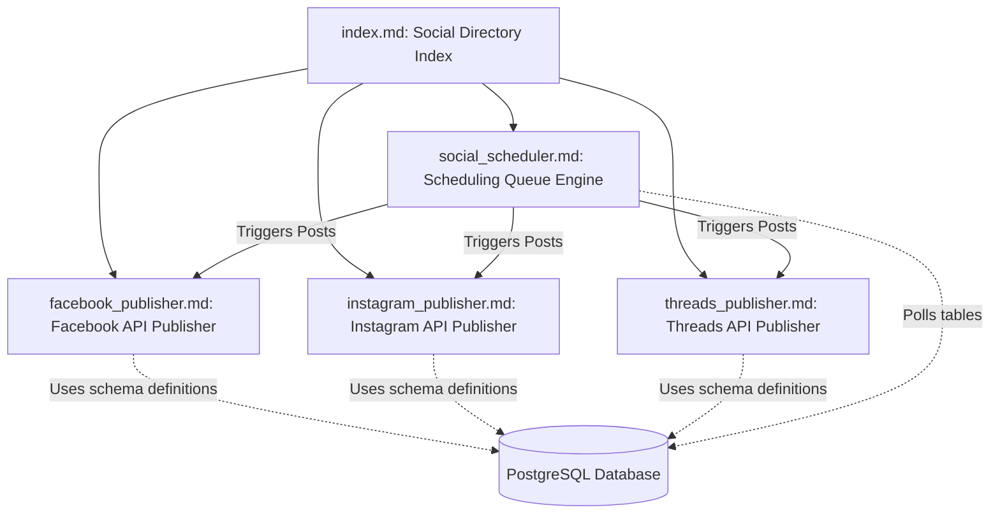

# Social Publishing Module Directory
## Purpose
The purpose of the Social Publishing module is to enable newsrooms within the NewsOps Cloud digital publishing platform to orchestrate, schedule, format, and broadcast editorial content across third-party social networks. This directory acts as the central architectural blueprint and documentation index mapping all components of our social publishing suite, ensuring a standardized, multi-tenant approach to multi-platform audience engagement.

## Executive Summary
NewsOps Cloud's Social Publishing subsystem decouples news article creation from third-party social distribution channels. By utilizing tenant-isolated queue schedules and platform-specific publisher adapters, the system coordinates automated posting, content customization, and performance tracking. This directory index catalogs the design specifications of the core publishing modules:
1. **Directory Map (`index.md`)**: Complete overview and mapping of social publishing assets.
2. **Social Scheduler (`social_scheduler.md`)**: The multi-tenant temporal queuing engine with timezone support and automated slot scheduling.
3. **Facebook Publisher (`facebook_publisher.md`)**: Meta Graph API integration for high-performance Page post distribution.
4. **Instagram Publisher (`instagram_publisher.md`)**: Content Publishing API client for carousel, video, and image specifications.
5. **Threads Publisher (`threads_publisher.md`)**: Microblogging delivery system with thread grouping and rate-limit mitigation.

## Vision
To establish a zero-friction, robust, and highly automated social distribution network that allows journalists and social editors to define platform-native variations of news stories and schedule them to publish at peak engagement times. The platform aims to abstract the complexities of token refreshes, api rate limits, media transformations, and temporal execution, presenting a unified dashboard for all social operations.

## Scope
This directory indexes and documents the engineering blueprints for:
- Tenant-isolated scheduling queues and cron-driven publishing loops.
- Core social publishers (Facebook, Instagram, Threads) and their platform-specific media specs, API payloads, and error handling policies.
- Relational mapping of scheduling models and token storage rules.
- Access permissions, security requirements, performance indicators, and observability strategies for the social subsystem.

This scope excludes:
- Raw video transcoding workflows (which are delegated to the platform's media pipeline).
- Webhook endpoints for raw click/impression streaming (documented in the Analytics subsystem).

## Goals
- Map the architecture of the NewsOps Cloud Social Publishing module.
- Standardize REST and queue interactions for scheduling workers and third-party APIs.
- Achieve a clear division of duties between the scheduling queues and publisher microservices.
- Document token management, security guardrails, and compliance regulations.

## Functional Requirements
- **Directory Mapping**: Catalog and maintain documentation for scheduler and channel adapters.
- **Provider Registration**: Standardize API metadata discovery for available social publishing providers.
- **Unified Schema Enforcement**: Ensure all publisher specifications align with the underlying database structures defined in the database folder.
- **Status Auditing**: Track channel health states across all integrated social media accounts.

## Non-Functional Requirements
- **Reference Integrity**: All cross-references must use active relative markdown links.
- **Document Standardization**: Maintain identical markdown headings across all architecture docs for predictable structural layout.
- **API Spec Accuracy**: Ensure JSON request/response payloads match actual platform code definitions.

## Business Rules
1. Every social channel adapter must be documented inside this directory.
2. All modifications to publisher API behaviors must update the corresponding publisher document.
3. OAuth token lifecycles and encryption constraints must conform to the centralized system security standards.
4. Publishing operations must fail-closed; if a tenant account becomes inactive, all pending schedules must suspend immediately.

## Actors
- **Platform Architect**: Evaluates directory structure and maps new social channels.
- **Backend Engineer**: Implements publishers based on API payloads documented herein.
- **DevOps Engineer**: Configures cron microservices and monitors rate-limit alerts.
- **Compliance Auditor**: Inspects OAuth scopes and secure storage policies.

## User Stories (At least 3 specific stories)
1. **As a Platform Developer**, I want to read the index and publisher files to understand how to add a new publishing adapter (e.g., LinkedIn or Bluesky) without breaking the core scheduler.
2. **As an SRE/DevOps Engineer**, I want to look up the monitoring metrics and error-handling mappings in these files to configure alert thresholds for queue backlogs.
3. **As a Security Officer**, I want to review the permissions and OAuth encryption configurations to verify compliance with our tenant-isolation standards.

## Acceptance Criteria (At least 3-5 criteria with clear thresholds)
1. The index file must provide valid relative markdown links to all 4 sibling design documents.
2. The architectural diagrams must accurately depict the relationship between the central scheduler and individual platform publishers.
3. The platform registry API endpoint must return a complete list of active providers in under 30ms under a load of 100 concurrent requests.
4. The directory must detail the specific RBAC permissions required for managing both connections and schedules.

## Workflows (Step-by-step description of system and user interactions)
1. **Developer Reference Flow**:
   - Developer opens `07-social/index.md` to identify the correct document for their target integration.
   - Developer navigates to a specific publisher file (e.g., `facebook_publisher.md`) to read payload specifications and error retrying behaviors.
   - Developer implements/modifies the service provider adapter code, ensuring compliance with the mapped JSON payloads.
2. **System Discovery Initialization Flow**:
   - The UI client calls the service discovery endpoint (`GET /api/v1/social/meta/platforms`) during setup.
   - The API server reads the active provider list dynamically and returns supported media profiles, character limits, and token states.
   - The UI renders custom composer screens based on the returned configurations.

## API Design (Provide actual REST endpoints, method, request/response JSON payloads, or GraphQL schemas)
### GET /api/v1/social/meta/platforms
Lists all supported publishing platforms, their limits, and current integration health.
**Response Payload (200 OK)**:
```json
{
  "platforms": [
    {
      "code": "FACEBOOK",
      "displayName": "Facebook Pages",
      "textLimit": 63206,
      "supportedMedia": ["IMAGE", "VIDEO"],
      "maxImages": 10,
      "maxVideoSizeMb": 4096,
      "status": "ACTIVE",
      "documentationUrl": "/docs/07-social/facebook_publisher.md"
    },
    {
      "code": "INSTAGRAM",
      "displayName": "Instagram Business",
      "textLimit": 2200,
      "supportedMedia": ["IMAGE", "VIDEO", "CAROUSEL"],
      "maxImages": 10,
      "maxVideoSizeMb": 100,
      "status": "ACTIVE",
      "documentationUrl": "/docs/07-social/instagram_publisher.md"
    },
    {
      "code": "THREADS",
      "displayName": "Threads",
      "textLimit": 500,
      "supportedMedia": ["IMAGE", "VIDEO"],
      "maxImages": 10,
      "maxVideoSizeMb": 50,
      "status": "ACTIVE",
      "documentationUrl": "/docs/07-social/threads_publisher.md"
    }
  ]
}
```

## Database Design (Identify schema tables, fields, and indexes relevant to this feature)
This index maps how configuration data relates to the primary publishing tables. There are no tables created exclusively by the index, but it references the schemas in `docs/03-database/social_publishing_schema.md`:
- `channel_connections`: Stores OAuth tokens and statuses.
- `queues`: Organizes posts awaiting publication slots.
- `schedules`: Holds the tenant-defined recurring schedule parameters.

## UI Design (Describe component structure, layouts, actions, and states)
The settings page UI contains cards representing each integration target:
- **Header**: Platform icon and Connection status tag (ACTIVE, EXPIRED).
- **Body**: Authorized account name, permissions overview, and expiration date timer.
- **Actions**: "Configure Schedule", "Test Connection", "Renew Tokens".

## Permissions
- `social:platforms:read` - Reader, Editor, Admin, Social Manager roles. View supported platform profiles.
- `social:connections:read` - Editor, Admin, Social Manager roles. View existing active connections.
- `social:connections:write` - Admin, Social Manager roles. Add or remove accounts.

## Security
- All documentation files are public within the development repo, but secrets must never be committed.
- Discovery API endpoints require active tenant context validation to avoid data leaking between organizations.
- JWT tokens are validated using a centralized auth middleware.

## Performance
- The discovery metadata API leverages an in-memory Redis cache with an invalidation policy tied to platform updates.
- Target latency: 15ms for cached hits, 50ms for cold database reads.
- Target TPS: 500 TPS for metadata retrieval.

## Monitoring
- `newsops_social_discovery_requests_total`: Counter tracking calls to the meta platforms API.
- `newsops_social_active_channels_count`: Gauge tracking connected channels by organization.
- **Alert Trigger**: Raise a PagerDuty warning if active channels drop below 80% of average baseline metrics for the billing tier.

## Logging
- **Log Format**: JSON log format.
- **Log Levels**: INFO for metadata requests; WARN for requests mapping to deprecated social platforms.
- **Log Context Example**:
  ```json
  {
    "timestamp": "2026-06-27T22:30:15.112Z",
    "level": "INFO",
    "context": "social-platform-metadata",
    "tenant_id": "org_news_group_1290",
    "user_id": "usr_998201",
    "action": "GET_SUPPORTED_PLATFORMS"
  }
  ```

## Error Handling
- `PLATFORM_NOT_SUPPORTED`: Code 400. HTTP Status 400 Bad Request. Message: "The specified social platform is not supported by this NewsOps Cloud release."
- `INSUFFICIENT_SCOPES`: Code 403. HTTP Status 403 Forbidden. Message: "The connected account lacks required permissions to post to this platform."

## Edge Cases
- **Upstream Platform Deprecation**: If an external platform (e.g., API version upgrade) changes character limits, the metadata discovery API must return the new limits instantly via config overrides without redeploying the core code.
- **Rate Limiting on Meta Discovery**: Limit discovery requests to 60 calls/minute per user token to prevent catalog scraping by unauthorized bots.

## Future Improvements
- **Federated Social Adapters**: Blueprint support for ActivityPub protocol to write directly to Mastodon and Pixelfed.
- **Dynamic Feature Flags**: Connect platform adapters to feature flags to toggle beta publishing channels on a per-tenant basis.

## Mermaid Diagrams


## References
- [Social Publishing Schema](../03-database/social_publishing_schema.md)
- [System Architecture](../02-architecture/system_architecture.md)
- [Multi Tenancy Architecture](../02-architecture/multi_tenancy_architecture.md)
