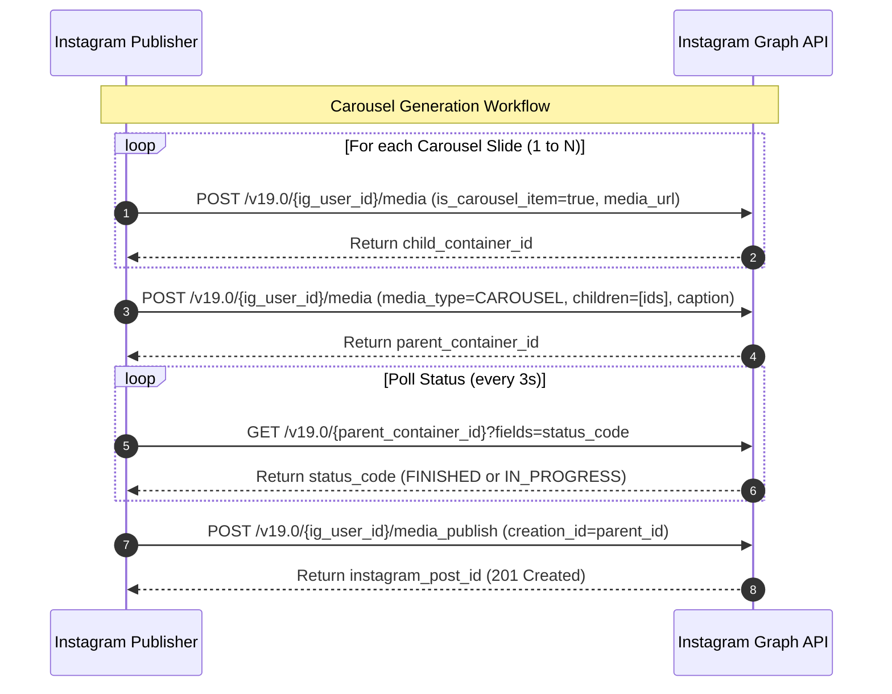
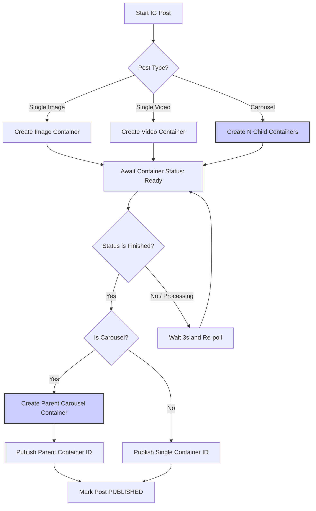

# Instagram Publisher
## Purpose
The purpose of the Instagram Publisher is to integrate NewsOps Cloud with the Instagram Content Publishing API, managing media specification validation, multi-item carousels, Reels deployment, and caption formatting checks.

## Executive Summary
The Instagram Publisher connects the digital publishing system with Meta's Instagram Business API. To publish to Instagram, the adapter uses a two-step container publication model. First, it uploads media files (photos or videos) to create media containers. Second, it publishes those containers to the user's feed. The service validates specific image ratios (4:5 to 1.91:1), video encoding (H.264/AAC), structures carousel posts using item arrays, registers Reels content, and performs validation on captions (limiting characters and hashtags).

## Vision
To enable newsrooms to publish visual news stories directly to Instagram (feed posts, carousels, and Reels) alongside their standard articles. By automating aspect ratio verification, transcoding status checks, and container construction, this module makes cross-posting visual journalism fast, compliant, and error-free.

## Scope
The Instagram Publisher includes:
- Integration with the Instagram Content Publishing API endpoints (`/{ig_user_id}/media`, `/{ig_user_id}/media_publish`).
- Media specification checker: aspect ratio, file size, video duration, and container format checking.
- Carousel publishing workflow (creating individual item containers and grouping them under a parent container).
- Reels posting configurations (specifically forcing a 9:16 layout, vertical tagging, and audio formats).
- Caption template checks: character count ($2,200$ limits), hashtag count ($30$ limits), and account tagging validations.

The Instagram Publisher excludes:
- Story publishing (which is currently not supported by Meta's API for business scheduling without direct mobile interaction).
- Direct image editing/cropping capabilities (delegated to the frontend browser or media server).

## Goals
- Guarantee 100% compliance with Instagram's strict media specs before initiating API upload requests.
- Streamline carousel generation to take under 5 seconds for creation and submission.
- Ensure that the visual representation of captions matches user-generated layouts, including line breaks and hashtag structures.
- Support high-performance parallel image container creation.

## Functional Requirements
- **Media Specification Verification**: Validate files against Instagram standards:
  - **Images**: JPEG/PNG, max 8MB, aspect ratio between 1.91:1 and 4:5.
  - **Videos**: MP4/MOV, H.264 compression, AAC audio, max 100MB, duration between 3 and 60 seconds (feed) or 15 minutes (Reels).
- **Single Post Creation**: Send image/video URL to create a container ID, check state, then publish.
- **Carousel Creation**: Create up to 10 child containers, retrieve child IDs, compile child array to parent container, then publish parent.
- **Reels Dispatch**: Construct container with parameter `media_type=REELS`, check status, and execute.
- **Caption Validation**: Implement a pre-flight validator to intercept posts exceeding 2200 characters, containing more than 30 hashtags, or utilizing malformed `@user` strings.

## Non-Functional Requirements
- **Container Check Interval**: Poll container creation status every 3 seconds for up to 90 seconds.
- **Robustness**: If a video container fails to encode on Instagram's server, delete the temp container and flag a descriptive error to the user.

## Business Rules
1. Every Instagram post must contain at least one image or video asset; plain text posts are rejected by the validator.
2. User tagging must use verified Instagram usernames, checked format-wise prior to submission.
3. Carousels must only group items of the same media type category (all images or all videos) if required by target legacy client accounts, or mixed media as permitted by modern API specs.
4. Organizations must configure a fallback banner image if an article has no visual assets.

## Actors
- **Social Media Editor**: Creates visual variations, sets captions, drafts Reels, and coordinates Carousel layout.
- **Instagram Publishing Service**: Integrates with the API and runs container status loops.
- **Instagram Graph API Service**: The Meta endpoints processing and hosting the visual posts.

## User Stories (At least 3 specific stories)
1. **As an Instagram Editor**, I want the platform to check that my video is formatted as a 9:16 MP4 before trying to upload it as a Reel, so that I don't wait for a failure notification.
2. **As a Photojournalist**, I want to select five images from an article gallery, arrange their order, and publish them as a single Carousel swipe-through post on our Instagram Business profile.
3. **As a Social Copywriter**, I want the platform to count my hashtags and characters as I type, displaying warning markers if I exceed the limit of 30 hashtags or 2200 characters.

## Acceptance Criteria (At least 3-5 criteria with clear thresholds)
1. Pre-flight caption checks must reject inputs with $> 30$ hashtags or $> 2200$ characters before calling Meta.
2. Image ratios outside the 1.91:1 - 4:5 range must be flagged with a formatting error in $< 20\text{ms}$.
3. Carousel container compilation must successfully combine between 2 and 10 child item IDs.
4. The system must poll container states up to 30 times (90s window) and report a timeout error if processing is incomplete.

## Workflows (Step-by-step description of system and user interactions)
1. **Carousel Posting Workflow**:
   - For each media asset in the carousel:
     - Call `POST /v19.0/{ig_user_id}/media` with `image_url=<cdn_url>` (or `video_url`), `is_carousel_item=true`, and `access_token`.
     - Record the returned child item ID.
   - Wait for all child container creations to succeed.
   - Call `POST /v19.0/{ig_user_id}/media` with `media_type=CAROUSEL`, `caption=<text>`, `children=[child_id_1, child_id_2, ...]`, and `access_token`.
   - Record the returned parent container ID.
   - Call `POST /v19.0/{ig_user_id}/media_publish` with `creation_id=<parent_container_id>` and `access_token`.
   - Upon success, mark the post status as `PUBLISHED`.
2. **Reels Posting Workflow**:
   - Call `POST /v19.0/{ig_user_id}/media` with `media_type=REELS`, `video_url=<cdn_url>`, `caption=<text>`, `share_to_feed=true`.
   - Poll container status using `GET /v19.0/{container_id}?fields=status_code`.
   - Once `status_code` becomes `FINISHED`, call `POST /v19.0/{ig_user_id}/media_publish` with `creation_id=<container_id>`.



## API Design (Provide actual REST endpoints, method, request/response JSON payloads, or GraphQL schemas)
This adapter provides endpoints to validate media specifications and process publishing:

### POST /api/v1/social/publisher/instagram/validate-media
Validates image or video properties prior to upload.
**Request Payload**:
```json
{
  "mediaType": "IMAGE",
  "url": "https://cdn.newsops.cloud/media/photo_1.jpg"
}
```
**Response Payload (200 OK - Valid)**:
```json
{
  "isValid": true,
  "dimensions": {
    "width": 1080,
    "height": 1350
  },
  "aspectRatio": "4:5",
  "fileSizeBytes": 1420192,
  "errors": []
}
```
**Response Payload (200 OK - Invalid)**:
```json
{
  "isValid": false,
  "dimensions": {
    "width": 500,
    "height": 200
  },
  "aspectRatio": "2.5:1",
  "fileSizeBytes": 992011,
  "errors": [
    "ASPECT_RATIO_OUT_OF_BOUNDS: Aspect ratio must be between 1.91:1 and 4:5"
  ]
}
```

### POST /api/v1/social/publisher/instagram/publish
Invoked by the worker queue to dispatch the post.
**Request Payload**:
```json
{
  "postId": "pst_ig_7720",
  "organizationId": "org_news_group_1290",
  "instagramUserId": "17841400019280",
  "type": "CAROUSEL",
  "caption": "Latest sights from the high-altitude climate survey. #environment #climate",
  "mediaUrls": [
    "https://cdn.newsops.cloud/survey/sights_1.jpg",
    "https://cdn.newsops.cloud/survey/sights_2.jpg"
  ]
}
```
**Response Payload (201 Created)**:
```json
{
  "status": "SUCCESS",
  "externalPostId": "17841400019280_188092819",
  "publishedAt": "2026-06-27T22:38:00Z"
}
```

## Database Design (Identify schema tables, fields, and indexes relevant to this feature)
The Instagram publishing process references the core tables via these schema mappings:
- Reads access tokens from `channel_connections` using decryption.
- Updates post status in `social_posts`.
- Stores detailed validation and child container records for carousels to enable recovery:
```sql
CREATE TABLE instagram_carousel_items (
    id VARCHAR(50) PRIMARY KEY DEFAULT concat('igi_', replace(gen_random_uuid()::text, '-', '')),
    social_post_id VARCHAR(50) NOT NULL REFERENCES social_posts(id) ON DELETE CASCADE,
    child_container_id VARCHAR(255) NOT NULL,
    media_url VARCHAR(2048) NOT NULL,
    position SMALLINT NOT NULL,
    created_at TIMESTAMP WITH TIME ZONE DEFAULT NOW()
);
```

## UI Design (Describe component structure, layouts, actions, and states)
- **Instagram Previewer**: Renders a mobile device frame representing an Instagram feed post. Shows profile picture, username, swipe indicators (for Carousels), image/video preview, and caption formatting (preserving line breaks).
- **Caption Health Bar**: Underneath the text input, progress bars render character count (out of 2200) and hashtag count (out of 30), changing color from green to red when limits are exceeded.

## Permissions
- `social:connections:write` - Admin, Social Manager roles. Required to connect Instagram Business accounts.
- `social:posts:publish` - Internal Worker Service identity. Required to call the publisher microservice.

## Security
- **OAuth Scope Limitation**: Requires `instagram_basic` and `instagram_content_publish`.
- **Media CDN Validation**: Restrict media URLs sent to Instagram to authorized S3 and CloudFront CDN domains configured within the tenant properties to prevent remote-file ingestion exploits.
- **SSL Enforcement**: All media files passed to Meta must use HTTPS protocols.

## Performance
- Caption validation checks must complete in under 5ms.
- API container initialization calls must respond in less than 2.0 seconds.
- Video container status polling must execute using backing cron tasks without blocking thread execution loops.

## Monitoring
- `newsops_instagram_publish_duration_seconds`: Histogram tracking completion speed.
- `newsops_instagram_validator_failures_total`: Counter tracking validation rejections.
- `newsops_instagram_container_polling_retries`: Gauge tracking average polling counts for encoding completion.
- **Alert Trigger**: Trigger a warning if the container polling timeout rate exceeds 5% of uploads over a 1-hour rolling window.

## Logging
- **Log Format**: JSON structures.
- **Log Levels**: INFO for container updates; WARN for formatting deviations; ERROR for Meta endpoint connection timeouts.
- **Log Context Example**:
  ```json
  {
    "timestamp": "2026-06-27T22:38:40.901Z",
    "level": "WARN",
    "context": "instagram-validator",
    "post_id": "pst_ig_7720",
    "reason": "HASHTAG_LIMIT_EXCEEDED",
    "count": 32
  }
  ```

## Error Handling
| Meta Subcode | HTTP Mapping | NewsOps Status Code | Action / Customer Message |
|:---|:---|:---|:---|
| `2207001` (Aspect Ratio) | 400 Bad Request | `INVALID_MEDIA_RATIO` | Media aspect ratio is unsupported. Crop to 1.91:1 - 4:5 range. |
| `2207005` (Encoding Video) | 422 Unprocessable | `VIDEO_TRANSCODE_FAIL` | Instagram failed to transcode your video. Verify H.264/AAC guidelines. |
| `2207009` (Carousel Size) | 400 Bad Request | `CAROUSEL_LIMIT_EXCEEDED` | Carousels must contain between 2 and 10 slides. |
| `2207011` (Daily Limit) | 429 Too Many Requests | `INSTAGRAM_RATE_LIMIT` | Instagram daily API publishing limit reached. Post delayed. |

## Edge Cases
- **Mixed Media in Carousels**: Meta recently allowed mixing images and videos in a single carousel. The publisher handles this by assigning correct API flags based on each slide's extension type (e.g. `.mp4` sets `media_type=VIDEO`, `.jpg` sets `media_type=IMAGE`) when constructing child containers.
- **Delayed Processing for Large Video Files**: If a video Reel takes longer than 90 seconds to process, the system throws a temporary execution deferral, rescheduling the publish step to run in 5 minutes, freeing the worker thread to process other jobs in the queue.

## Future Improvements
- **Direct Location Tagging**: Retrieve Facebook page location identifiers to allow tagging venues and cities directly on Instagram posts.
- **Auto-Cropping Engine**: Integrate a server-side ffmpeg service to automatically crop visual assets to Instagram-compliant ratios before submitting them to Meta's container API.

## Mermaid Diagrams


## References
- [Social Directory Index](./index.md)
- [Social Scheduler](./social_scheduler.md)
- [Facebook Publisher](./facebook_publisher.md)
- [Social Publishing Schema](../03-database/social_publishing_schema.md)
