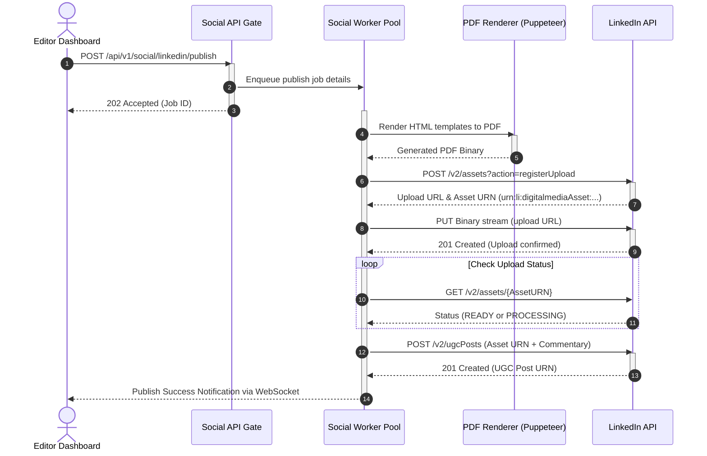

# LinkedIn Publisher Service Design

## Purpose
The purpose of this document is to define the technical design, system architecture, data schemas, and integration patterns for the LinkedIn Publisher Service within the NewsOps Cloud digital publishing platform. This service automates the distribution of articles, rich media, and dynamically generated PDF slide carousels to both LinkedIn member profiles and organization pages.

## Executive Summary
NewsOps Cloud requires a robust, scalable, and secure system to publish content directly to LinkedIn. The LinkedIn Publisher Service acts as a bridge between the NewsOps editorial dashboard and the LinkedIn UGC (User Generated Content) Post API. The service includes a custom HTML-to-PDF carousel converter to transform editorial summaries into highly engaging slide decks, handles multi-tiered OAuth authorization for member profiles and organization pages, and manages the multi-step binary media upload handshake mandated by LinkedIn.

## Vision
To provide newsrooms with an automated, zero-friction distribution pipeline that formats and delivers news stories to LinkedIn, capitalizing on the high organic reach of document-based carousel posts and rich media updates while maintaining perfect corporate brand alignment and security.

## Scope
- OAuth 2.0 authorization flows and credential management for both LinkedIn Members and Organizations.
- Dynamic HTML-to-PDF carousel generation engine utilizing Puppeteer.
- LinkedIn API Asset and UGC Post integrations, including multi-step media upload handshakes (PDF, Image, Video).
- Role-Based Access Control (RBAC) and audit logging for corporate social publishing.
- Fault-tolerant queuing and execution of publish jobs with advanced error handling.

## Goals
- Complete dynamic PDF carousel generation in under 2,500ms for a standard 10-slide deck.
- Support reliable uploading of files up to 100MB using chunked byte-range transfers.
- Enable publishing to multiple LinkedIn channels (personal profiles and organization pages) from a single editorial interface.
- Achieve a 99.9% delivery rate using automated retries and dead-letter queues (DLQ).

## Functional Requirements
1. **OAuth Authentication**: Authenticate users and organizations via LinkedIn's OAuth 2.0 gateway, requesting scopes `w_member_social`, `rw_organization_social`, and `r_basicprofile`.
2. **Dynamic Carousel Generation**: Render structured editorial data (text, images, branding) into an HTML template and compile it into a high-quality PDF using an isolated Puppeteer container.
3. **LinkedIn Media Handshake**: Implement the three-step media upload process:
   - Register the asset with LinkedIn to obtain upload credentials and URNs.
   - Perform binary stream upload to the designated ingestion endpoint (chunked for larger payloads).
   - Poll or verify the asset status until it transitions to `READY`.
4. **UGC Share Creation**: Compose and transmit the final UGC Post JSON payload containing text, hashtags, target actor URNs, and the uploaded asset URN.
5. **Multi-tenant Isolation**: Ensure credential and token isolation between different publication tenants in NewsOps.

## Non-Functional Requirements
- **Performance**: PDF carousel conversion must not block the main application thread; it must run asynchronously using a dedicated worker pool.
- **Latency**: API response for registering a publish job must be under 200ms.
- **Scalability**: The PDF converter worker pool must scale horizontally based on the size of the publication queue.
- **Security**: Access and refresh tokens must be encrypted using AES-256-GCM prior to database persistence.
- **Availability**: The system must survive downstream LinkedIn API outages through exponential backoff queuing.

## Business Rules
- **Verification Requirement**: Publications to Organization pages can only be initiated by users holding the `Editor-in-Chief` or `Social-Media-Manager` roles in NewsOps.
- **Carousel Constraints**: Generated PDFs must not exceed 10 pages, must use a 1:1 or 4:5 aspect ratio, and must be under 100MB in size.
- **Post Boundaries**: Text commentary must not exceed LinkedIn's limit of 3,000 characters.
- **Token Expiry**: LinkedIn access tokens expire in 60 days. System must notify administrators 7 days prior to expiry.

## Actors
- **Editorial Author**: Writes the news content and initiates publishing.
- **Social Media Manager**: Selects target channels, edits carousel slides, and schedules posts.
- **System Administrator**: Connects and authorizes LinkedIn Organizations.
- **LinkedIn Publisher Worker**: NewsOps background service processing the publish queue.
- **LinkedIn API**: Downstream external service accepting the post and assets.

## User Stories
- **User Story 1**: As an Editor-in-Chief, I want to publish a breaking business report to our official LinkedIn Organization Page so that our corporate followers receive immediate updates.
- **User Story 2**: As a Journalist, I want to convert my weekly article summaries into a multi-page PDF carousel automatically using our branding templates so that I can maximize engagement on my personal LinkedIn profile.
- **User Story 3**: As a Social Media Manager, I want to schedule a video post to LinkedIn at a specific time and receive real-time notifications if the media upload handshake fails, allowing me to remediate it immediately.

## Acceptance Criteria
- **AC 1**: When an editor publishes to an Organization, the system must verify the target URN format matches `urn:li:organization:[ID]` and the token contains `rw_organization_social`.
- **AC 2**: PDF carousels must render fonts, custom SVGs, and brand-color backgrounds exactly as defined in the editorial template design schema, verified via automated visual regression tests with a tolerance delta of < 0.1%.
- **AC 3**: The media upload mechanism must support chunked binary transfers (minimum chunk size 5MB) and successfully re-upload failed chunks without restarting the entire file upload.

## Workflows
1. **Asset Preparation**: The editor selects article summaries and branding.
2. **HTML-to-PDF Pipeline**: The system converts the summary into styled HTML slides, and triggers a headless browser (Puppeteer) to write a PDF file to secure storage.
3. **LinkedIn Handshake Initiation**: The system calls LinkedIn's `assets?action=registerUpload`.
4. **Binary Upload**: The background worker uploads the PDF file in chunked streams to the returned LinkedIn target URL.
5. **Asset Status Check**: The worker checks the status via LinkedIn's asset endpoint until it returns status `READY`.
6. **UGC Post Creation**: The system sends the UGC post request referencing the newly created asset URN.
7. **Status Update**: The database logs the publishing action and notifies the editor.

## API Design

### 1. Internal API: Create LinkedIn Carousel Post
- **Endpoint**: `POST /api/v1/social/linkedin/publish`
- **Headers**:
  - `Content-Type: application/json`
  - `Authorization: Bearer <JWT_TOKEN>`
- **Request Payload**:
```json
{
  "tenantId": "tenant-992-abc",
  "actorType": "ORGANIZATION",
  "targetUrn": "urn:li:organization:7739281",
  "commentary": "Discover the key architectural highlights of NewsOps Cloud v2.0! #cloud #architecture #publishing",
  "carousel": {
    "templateId": "tmpl-brand-corporate-01",
    "slides": [
      {
        "title": "Scalable Infrastructure",
        "description": "Built on Kubernetes, scaling to millions of reads.",
        "imageUrl": "https://cdn.newsops.cloud/assets/infra-slide.png"
      },
      {
        "title": "Dynamic Publishing",
        "description": "Instant delivery to LinkedIn, Twitter, and Web.",
        "imageUrl": "https://cdn.newsops.cloud/assets/delivery-slide.png"
      }
    ]
  },
  "scheduledTime": "2026-06-28T10:00:00Z"
}
```
- **Response Payload (Success - 202 Accepted)**:
```json
{
  "jobId": "job-li-883921",
  "status": "QUEUED",
  "targetUrn": "urn:li:organization:7739281",
  "createdAt": "2026-06-27T22:35:00Z"
}
```

### 2. External Handshake: Register Upload with LinkedIn API
- **Endpoint**: `POST https://api.linkedin.com/v2/assets?action=registerUpload`
- **Request Payload**:
```json
{
  "registerUploadRequest": {
    "recipes": [
      "urn:li:digitalmediaRecipe:feedshare-document"
    ],
    "owner": "urn:li:organization:7739281",
    "supportedUploadMechanism": [
      "SYNCHRONOUS_UPLOAD"
    ]
  }
}
```
- **Response Payload**:
```json
{
  "value": {
    "asset": "urn:li:digitalmediaAsset:C5622AQG17Y7S8bB32Q",
    "uploadMechanism": {
      "com.linkedin.digitalmedia.uploading.MediaUploadHttpRequest": {
        "uploadUrl": "https://api.linkedin.com/media/upload?id=C5622AQG17Y7S8bB32Q&t=129381203",
        "headers": {
          "Authorization": "Bearer AQW..."
        }
      }
    }
  }
}
```

## Database Design

```sql
-- LinkedIn Account Credentials Table
CREATE TABLE linkedin_accounts (
    id UUID PRIMARY KEY DEFAULT gen_random_uuid(),
    tenant_id VARCHAR(50) NOT NULL,
    account_type VARCHAR(20) NOT NULL, -- 'MEMBER' or 'ORGANIZATION'
    urn VARCHAR(100) UNIQUE NOT NULL, -- e.g. urn:li:organization:7739281
    display_name VARCHAR(150) NOT NULL,
    encrypted_access_token BYTEA NOT NULL,
    encrypted_refresh_token BYTEA NOT NULL,
    token_expires_at TIMESTAMP WITH TIME ZONE NOT NULL,
    refresh_token_expires_at TIMESTAMP WITH TIME ZONE NOT NULL,
    created_at TIMESTAMP WITH TIME ZONE DEFAULT CURRENT_TIMESTAMP,
    updated_at TIMESTAMP WITH TIME ZONE DEFAULT CURRENT_TIMESTAMP
);

CREATE INDEX idx_linkedin_accounts_tenant ON linkedin_accounts(tenant_id);

-- LinkedIn Publications/Jobs Table
CREATE TABLE linkedin_publications (
    id UUID PRIMARY KEY DEFAULT gen_random_uuid(),
    account_id UUID REFERENCES linkedin_accounts(id) ON DELETE CASCADE,
    article_id UUID,
    job_status VARCHAR(30) NOT NULL, -- 'QUEUED', 'GENERATING_PDF', 'UPLOADING_MEDIA', 'PUBLISHING_POST', 'COMPLETED', 'FAILED'
    target_urn VARCHAR(100) NOT NULL,
    commentary TEXT NOT NULL,
    pdf_storage_path VARCHAR(255),
    linkedin_asset_urn VARCHAR(100),
    linkedin_ugc_post_urn VARCHAR(100),
    error_message TEXT,
    retry_count INTEGER DEFAULT 0,
    scheduled_at TIMESTAMP WITH TIME ZONE,
    published_at TIMESTAMP WITH TIME ZONE,
    created_at TIMESTAMP WITH TIME ZONE DEFAULT CURRENT_TIMESTAMP
);

CREATE INDEX idx_linkedin_pub_status ON linkedin_publications(job_status);
CREATE INDEX idx_linkedin_pub_scheduled ON linkedin_publications(scheduled_at) WHERE job_status = 'QUEUED';
```

## UI Design
The NewsOps LinkedIn publishing composer is embedded in the Social Distribution panel:
- **Left Panel**: Target Account selector (dropdown showing Authorized Organization and personal profiles). Main commentary text area with hashtag suggestions and a character limit counter (3,000 limit).
- **Center Canvas**: Carousel editor. Drag-and-drop slide cards, customize titles, text bodies, background images, and layout theme.
- **Right Panel (Live Preview)**: A simulated mobile/desktop LinkedIn card viewport showing exactly how the carousel will appear, allowing the editor to flip through generated PDF slides using left/right arrows.
- **Footer Actions**: "Publish Now" button, "Schedule Post" inputs, and real-time status trackers for assets uploads.

## Permissions
- `social:linkedin:connect` - Connect profile/organization via OAuth.
- `social:linkedin:write` - Draft and edit LinkedIn posts and carousels.
- `social:linkedin:publish` - Approve and trigger live API publishing.
- `social:linkedin:templates` - Create/edit slide templates for carousel generation.

## Security
- **OAuth Token Storage**: Encrypted at rest using Envelope Encryption with AES-256-GCM. The key encrypting the tokens (DEK) is protected by a Key Encryption Key (KEK) managed in cloud vault services.
- **HTML Injection Mitigation**: All HTML slides are dynamically created using templates pre-compiled by the system. Raw user inputs inside slide titles/descriptions are strictly escaped to prevent Cross-Site Scripting (XSS) within the headless Chromium browser.
- **Network Sandbox**: The Puppeteer generation worker runs in a sandbox container isolated from access to other intranet resources.

## Performance
- **Target TPS**: 10 carousel post generations per second per worker instance.
- **Latency SLAs**:
  - HTML-to-PDF render: <= 2.2 seconds.
  - Initial upload handshake registration: <= 150ms.
- **Caching**: Pre-render common branding elements (SVGs, company logos) into local memory on workers to eliminate network round-trips during PDF conversion.

## Monitoring
- **Prometheus Metrics**:
  - `linkedin_publish_jobs_total{status="success|failure"}`
  - `linkedin_pdf_generation_latency_seconds`
  - `linkedin_upload_duration_seconds`
  - `linkedin_rate_limit_hits_total`
- **Alert Triggers**:
  - Trigger warning alert if `linkedin_pdf_generation_latency_seconds` (p95) > 5s.
  - Trigger critical alert if job failure rate exceeds 5% in a rolling 15-minute window.

## Logging
- **Log Format**: JSON
- **Fields**: `timestamp`, `log_level`, `tenant_id`, `job_id`, `linkedin_urn`, `trace_id`, `message`, `error_details`.
- **Examples**:
  - Info Level: `{"timestamp":"2026-06-27T22:36:01Z","level":"INFO","job_id":"job-li-883921","message":"Initiating PDF generation for template tmpl-brand-corporate-01"}`
  - Error Level: `{"timestamp":"2026-06-27T22:36:12Z","level":"ERROR","job_id":"job-li-883921","error_details":"LinkedIn API responded with 422 Unprocessable Entity - Asset URN invalid","message":"Publish transaction failed"}`

## Error Handling
| Internal Error Code | HTTP Status | Upstream Trigger | Customer-Facing Message |
| :--- | :--- | :--- | :--- |
| `LI_AUTH_EXPIRED` | 401 Unauthorized | Access token revoked or expired (401) | "LinkedIn authentication has expired. Please re-authorize the account in settings." |
| `LI_CAROUSEL_RENDER_FAIL` | 500 Internal Error | Puppeteer timeout/rendering crash | "Failed to render carousel PDF slides. Please verify image URLs and slide content." |
| `LI_UPLOAD_TIMEOUT` | 504 Gateway Timeout | Upload pipeline exceeded max time | "Media upload to LinkedIn timed out. NewsOps will automatically retry in the background." |
| `LI_RATE_LIMIT` | 429 Too Many Requests | LinkedIn API Rate limit hit (429) | "System is currently rate-limited by LinkedIn. Post is queued and will retry shortly." |

## Edge Cases
- **Upstream Rate Limiting**: The LinkedIn API imposes daily limits on posts and uploads per account. The system uses leaky-bucket scheduling. If a 429 error occurs, the job is delayed with exponential backoff and randomized jitter (between 5 and 30 minutes).
- **Browser Thread Crash**: If the Puppeteer Chrome instance crashes during HTML-to-PDF rendering, the worker catches the process signal, terminates the dead PID, spins up a fresh instance, and retries the render once before failing the job.
- **Large PDF Payload**: For PDFs approaching the 100MB limit, the system splits files into 10MB chunks and publishes them via parallel multipart chunk handshakes if supported, or enforces a sequential, byte-range stream write.

## Future Improvements
- **Interactive Carousel Layout Editor**: Integration of a canvas editor (similar to Canva) allowing custom coordinate text placement.
- **Audience Feedback Loop**: Collect and display comments, reactions, and slide-level click metrics directly in the NewsOps editor analytics view.
- **AI Slides Outline**: Generate structured slide contents automatically by parsing the main article text using NewsOps Cloud's standard LLM interfaces.

## Mermaid Diagrams



## References
- System Integration Patterns: [../02-architecture/integration_patterns.md](../02-architecture/integration_patterns.md)
- Database Design Schemas: [../03-database/index.md](../03-database/index.md)
- Event-Driven Architecture: [../02-architecture/event_driven_design.md](../02-architecture/event_driven_design.md)
- Multi-Tenancy Architecture: [../02-architecture/multi_tenancy_architecture.md](../02-architecture/multi_tenancy_architecture.md)
