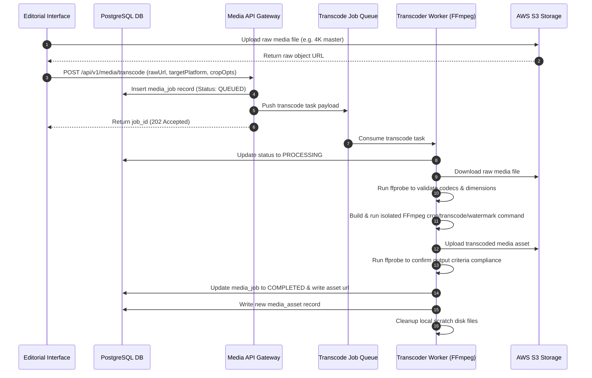
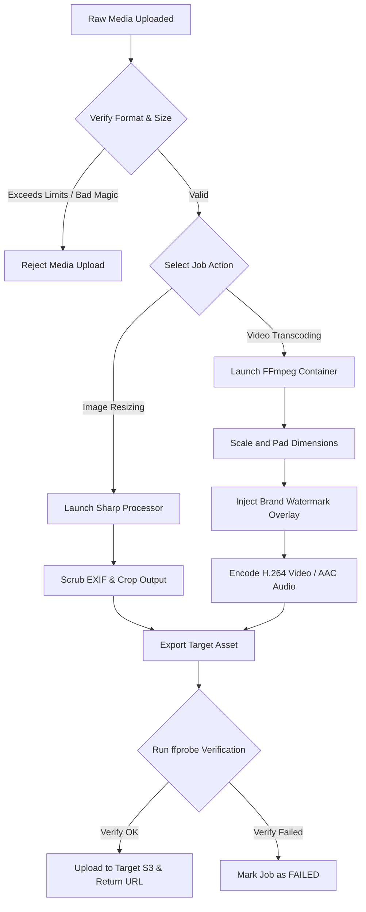

# Media Format Adapter

## Purpose
The Media Format Adapter defines the technical architecture, processing pipelines, command wrappers, and database models for resizing, cropping, and transcoding editorial media assets (images and videos) for social distribution. It ensures that all media attachments comply with the file size, resolution, aspect ratio, and codec constraints of platforms like Twitter/X, LinkedIn, Facebook, and Instagram.

## Executive Summary
Social media networks enforce strict limits on media uploads. Uploading an incorrect format leads to publication failures. The Media Format Adapter acts as an automated gateway that standardizes input assets. It wraps FFmpeg and Sharp processing commands inside isolated worker containers, converts media to target codecs, crops files to target aspect ratios, injects watermarks, and verifies output containers via `ffprobe` prior to publishing.

## Vision
To provide newsrooms with a zero-friction media preparation pipeline that automatically and instantly optimizes any image or video asset for maximum quality and guaranteed delivery across all social networks.

## Scope
The scope of this system includes:
- Command wrappers for FFmpeg (video transcoding) and Sharp/ImageMagick (image resizing).
- Aspect ratio conversion templates (1:1, 16:9, 9:16, 4:5).
- Brand watermark injection systems (logo overlays).
- File size limitation compliance filters and automatic bitrate reduction models.
- Cryptographic verification of uploaded files.

It does not cover:
- Non-linear video editing (cutting, stitching, transitions).
- Text-to-speech audio rendering.
- Master copy digital asset management (DAM) storage lifecycle policies.

## Goals
- Automate conversion of images under 500ms.
- Transcode a 1-minute 1080p HD video file in under 15 seconds.
- Deliver 100% upload success rates across target social networks.
- Enforce secure containerized isolation for all binary execution jobs.
- Automatically optimize encoding parameters to achieve minimum file sizes without visible compression artifacts.

## Functional Requirements
- **Format Normalization**: Convert all incoming images to WebP/JPEG and videos to MP4 (H.264/AAC).
- **Aspect Ratio Adaptation**: Support cropping and padding actions to adjust standard outputs into vertical (9:16) or square (1:1) structures.
- **Watermarking**: Render custom translucent logos at predefined positions (top-left, bottom-right, etc.) on image and video exports.
- **Scrubbing**: Strip EXIF and camera metadata fields from images to protect editorial sources.
- **Audio Standardization**: Downmix multi-channel audio tracks to stereo and normalize audio volume ranges (Target: -14 LUFS).

## Non-Functional Requirements
- **Scalability**: Media adapter workers must scale horizontally using Kubernetes HPA based on processing queue lag.
- **Resource Constraints**: CPU-based transcoding tasks must be limited to 2 cores and 2GB RAM per worker node to prevent resource starvation.
- **GPU Acceleration**: Leverage NVENC hardware encoders on supported infrastructure to accelerate video transcoding.
- **Security**: Sanitize all shell-executed arguments to prevent remote command execution (RCE) through malicious filenames or metadata payloads.

## Business Rules
1. Media files must be verified by size before transcoding to prevent processing files that exceed maximum limits:
   - **Twitter/X**: Images max 5MB, Videos max 512MB, duration max 140 seconds.
   - **Instagram**: Images max 8MB, Videos max 100MB, duration max 60 seconds.
   - **LinkedIn**: Images max 10MB, Videos max 200MB, duration max 10 minutes.
2. Original uploads must remain unmodified in object storage; all transcoded assets must be saved as new files.
3. If an input video has no audio track, the transcoder must inject a silent AAC audio track to ensure platform compatibility.
4. Webp images must be generated at 85% quality to optimize download sizes for mobile viewers.

## Actors
- **Social Media Editor**: Uploads raw media, selects cropping targets, and triggers publication.
- **Media Transcoder Worker**: The background service wrapping FFmpeg to execute transformations.
- **Publishing Service**: Relays the transcoded asset links to social API nodes.
- **Storage Ingest Agent**: Handles S3 bucket storage operations for input and output files.

## User Stories (At least 3 specific stories)
1. **As a Social Media Editor**, I want to upload a horizontal 4K video and have the system automatically output a cropped 9:16 vertical video for Instagram Stories with our newsroom's logo watermark applied.
2. **As an Editor**, I want the system to reject an upload immediately if it exceeds the target platform's video duration limit so that I can trim the file before processing.
3. **As a Platform Administrator**, I want transcoding tasks to run in sandbox environments so that a corrupt video upload cannot execute arbitrary code on our core servers.

## Acceptance Criteria (At least 3-5 criteria with clear thresholds)
1. The media adapter must wrap FFmpeg calls in a secure process execution library that rejects filenames containing special shell symbols (`$`, `;`, `&`, `|`, `\`, `` ` ``).
2. Video outputs must use H.264 video codec (High Profile, level 4.1) and AAC-LC audio codec.
3. Transcoding workers must report progress percentages to the database at least every 10% of execution progress.
4. The system must verify the final file size and duration using `ffprobe` before marking a transcoding task as `COMPLETED`.

## Workflows (Step-by-step description of system and user interactions)

### 1. Media Upload and Transcoding Pipeline


## API Design (Provide actual REST endpoints, method, request/response JSON payloads, or GraphQL schemas)

### POST /api/v1/media/transcode
Submits a media asset processing job.
**Request Headers**:
- `Authorization: Bearer <JWT>`
- `Content-Type: application/json`

**Request Payload**:
```json
{
  "rawAssetUrl": "https://newsops-raw-assets.s3.amazonaws.com/uploads/2026/06/june27_breaking.mp4",
  "targetPlatform": "INSTAGRAM",
  "crop": {
    "aspectRatio": "9:16",
    "x": 120,
    "y": 0,
    "width": 1080,
    "height": 1920
  },
  "watermark": {
    "position": "bottom-right",
    "opacity": 0.7
  },
  "maxFileSizeMb": 100
}
```

**Response Payload (202 Accepted)**:
```json
{
  "jobId": "job_88902118",
  "status": "QUEUED",
  "targetPlatform": "INSTAGRAM",
  "estimatedDurationSeconds": 12,
  "createdAt": "2026-06-27T22:32:13.000Z"
}
```

### GET /api/v1/media/jobs/{jobId}
Checks the current status and progress of a transcoding job.
**Response Payload (200 OK)**:
```json
{
  "jobId": "job_88902118",
  "status": "PROCESSING",
  "progressPercentage": 45,
  "startedAt": "2026-06-27T22:32:15.000Z",
  "error": null,
  "result": null
}
```

**Response Payload (200 OK - Finished)**:
```json
{
  "jobId": "job_88902118",
  "status": "COMPLETED",
  "progressPercentage": 100,
  "startedAt": "2026-06-27T22:32:15.000Z",
  "error": null,
  "result": {
    "assetId": "ast_991028",
    "outputUrl": "https://newsops-processed-assets.s3.amazonaws.com/dist/instagram/june27_breaking_vertical.mp4",
    "fileSize": 18902810,
    "format": "mp4",
    "resolution": "1080x1920",
    "durationSeconds": 30.5
  }
}
```

## Database Design (Identify schema tables, fields, and indexes relevant to this feature)

### Prisma Schema
```prisma
datasource db {
  provider = "postgresql"
  url      = env("DATABASE_URL")
}

generator client {
  provider = "prisma-client-js"
}

enum JobStatus {
  QUEUED
  PROCESSING
  COMPLETED
  FAILED
}

model MediaJob {
  id             String         @id @default(dbgenerated("concat('job_', replace(gen_random_uuid()::text, '-', ''))")) @db.VarChar(50)
  organizationId String         @map("organization_id") @db.VarChar(50)
  rawAssetUrl    String         @map("raw_asset_url") @db.VarChar(2048)
  targetPlatform String         @map("target_platform") @db.VarChar(50)
  status         JobStatus      @default(QUEUED)
  progress       Int            @default(0)
  errorMessage   String?        @map("error_message") @db.Text
  createdAt      DateTime       @default(now()) @map("created_at")
  updatedAt      DateTime       @updatedAt @map("updated_at")

  mediaAssets    MediaAsset[]

  @@index([organizationId])
  @@index([status])
  @@map("media_jobs")
}

model MediaAsset {
  id             String   @id @default(dbgenerated("concat('ast_', replace(gen_random_uuid()::text, '-', ''))")) @db.VarChar(50)
  organizationId String   @map("organization_id") @db.VarChar(50)
  jobId          String?  @map("job_id") @db.VarChar(50)
  outputUrl      String   @map("output_url") @db.VarChar(2048)
  fileSize       Int      @map("file_size")
  format         String   @db.VarChar(50)
  resolution     String   @db.VarChar(50)
  duration       Float?
  createdAt      DateTime @default(now()) @map("created_at")

  mediaJob       MediaJob? @relation(fields: [jobId], references: [id], onDelete: SetNull)

  @@index([organizationId])
  @@map("media_assets")
}
```

### PostgreSQL DDL
```sql
CREATE TYPE job_status AS ENUM ('QUEUED', 'PROCESSING', 'COMPLETED', 'FAILED');

CREATE TABLE media_jobs (
    id VARCHAR(50) PRIMARY KEY DEFAULT concat('job_', replace(gen_random_uuid()::text, '-', '')),
    organization_id VARCHAR(50) NOT NULL,
    raw_asset_url VARCHAR(2048) NOT NULL,
    target_platform VARCHAR(50) NOT NULL,
    status job_status NOT NULL DEFAULT 'QUEUED',
    progress INT NOT NULL DEFAULT 0,
    error_message TEXT,
    created_at TIMESTAMP WITH TIME ZONE NOT NULL DEFAULT NOW(),
    updated_at TIMESTAMP WITH TIME ZONE NOT NULL DEFAULT NOW()
);

CREATE INDEX idx_media_jobs_org_status ON media_jobs(organization_id, status);

CREATE TABLE media_assets (
    id VARCHAR(50) PRIMARY KEY DEFAULT concat('ast_', replace(gen_random_uuid()::text, '-', '')),
    organization_id VARCHAR(50) NOT NULL,
    job_id VARCHAR(50) REFERENCES media_jobs(id) ON DELETE SET NULL,
    output_url VARCHAR(2048) NOT NULL,
    file_size INT NOT NULL,
    format VARCHAR(50) NOT NULL,
    resolution VARCHAR(50) NOT NULL,
    duration REAL,
    created_at TIMESTAMP WITH TIME ZONE NOT NULL DEFAULT NOW()
);

CREATE INDEX idx_media_assets_org ON media_assets(organization_id);
```

## FFmpeg Command Templates
To convert a raw video to vertical aspect ratio (9:16) with brand watermark overlay, force H.264 profile, downscale to 1080x1920, and normalize stereo audio:
```bash
ffmpeg -y -i input_master.mp4 -i watermark.png \
-filter_complex "[0:v]scale=w=1080:h=1920:force_original_aspect_ratio=increase,crop=1080:1920[vscaled]; [vscaled][1:v]overlay=main_w-overlay_w-20:main_h-overlay_h-20:format=auto[vout]" \
-map "[vout]" -map 0:a? -c:v libx264 -profile:v high -level 4.1 -preset medium -crf 22 -maxrate 4M -bufsize 8M \
-c:a aac -b:a 128k -ac 2 -ar 44100 -movflags +faststart output_vertical.mp4
```

To resize an image, scrub metadata, and convert to WebP:
```bash
ffmpeg -y -i input_image.jpg -vf "scale=1200:-1" -metadata:s:v:0 rotate=0 -map_metadata -1 -quality 85 output_image.webp
```

## UI Design (Describe component structure, layouts, actions, and states)
- **Aspect Ratio Selector**: Layout options for 16:9 (Landscape), 1:1 (Square), and 9:16 (Vertical) represented as high-contrast frame aspect boxes.
- **Cropping Workspace**: Drag-and-drop workspace window indicating selected focus grids. Auto-calculates coordinates during adjustments.
- **Watermark Toggles**: Grid selections (top-left, top-right, bottom-left, bottom-right) to set overlay placements. Provides a slider to adjust transparency levels.

## Permissions (Specify RBAC permissions required, e.g., organizations:read, articles:write)
- `media:transcode:create`: Initiate media transformation and cropping tasks (Editor, Admin).
- `media:profiles:write`: Define encoding bitrates, default sizes, and watermarks (Platform Administrator).
- `media:assets:read`: View and reuse previously processed files (Viewer, Editor, Admin).

## Security (Detail security considerations, e.g., input validation, CSRF, JWT validation)
- **Command Injection Prevention**: Filename parameters are not interpolated directly into bash scripts. Instead, the service utilizes Node's `child_process.spawn` or Python's `subprocess.Popen` where arguments are passed as an isolated string array.
- **MIME Type Validation**: Do not trust file extensions. The ingest gate runs magic number analysis (e.g. reading the first 12 bytes of file headers) to determine file MIME types before sending them to the worker nodes.
- **Safe Directory Isolation**: Workers write to temporary directories protected by system limits (`noexec` and `nosuid` attributes).
- **Infinite Loop Prevention**: Stop transcoding immediately if input files are structured as nested HLS playlist wrappers designed to lock thread CPU.

## Performance (State latency limits, caching requirements, target TPS)
- **Target Ingest Size Limit**: Reject input uploads exceeding 1.5GB.
- **Caching**: CDN cache rules (Cloudflare/CloudFront) cache processed static image urls for 365 days using immutable headers.
- **Disk Cleanups**: Workers deploy local cron tasks clearing output scratch files older than 1 hour to maintain disk availability.

## Monitoring (Detail Prometheus metrics names, alert triggers)
- `media_transcode_duration_seconds`: Histogram tracking completion times by input format and target platform.
- `media_job_failures_total`: Counter monitoring process faults by exit code.
- `media_worker_disk_free_bytes`: Gauge tracking scratch volume disk space.
- **Alert Triggers**:
  - Critical: `media_worker_disk_free_bytes` drops below 10GB.
  - Warning: Video transcode tasks queue times exceed 5 minutes.

## Logging (Specify log formats, error levels, log contexts)
- **Log Format**: JSON log format.
- **Log Level**: INFO for job status transitions, WARN for input files needing non-standard modifications, ERROR for FFmpeg crash dumps.
- **Log Context**: Includes `job_id`, `input_file_codec`, `output_resolution`, `processing_duration_ms`, and `ffmpeg_exit_code`.
- **Log Example**:
```json
{
  "timestamp": "2026-06-27T22:32:13.780Z",
  "level": "ERROR",
  "context": "media-transcoder-worker",
  "job_id": "job_88902118",
  "ffmpeg_exit_code": 137,
  "stderr_summary": "Error: Out of memory during video processing",
  "message": "FFmpeg execution failed due to system resource exhaustion."
}
```

## Error Handling (Map input/system error codes to HTTP status and customer-facing messages)
- `FFMPEG_OUT_OF_MEMORY`: Code 507. HTTP Status 507 Insufficient Storage. Message: "Transcoding process exceeded container memory constraints. Try a lower resolution source."
- `INVALID_FILE_CORRUPT`: Code 415. HTTP Status 415 Unsupported Media Type. Message: "The media file appears corrupt or uses an unsupported encoding structure."
- `SIZE_LIMIT_EXCEEDED`: Code 413. HTTP Status 413 Payload Too Large. Message: "The output file size exceeds the target platform's threshold. Adjust encoding settings."
- `COMMAND_INJECTION_DETECTED`: Code 400. HTTP Status 400 Bad Request. Message: "Invalid characters detected in filename. Command execution blocked."

## Edge Cases (Handle race conditions, rate limit hits, upstream timeouts)
- **Missing Audio Tracks on Source**: Handled by adding the fallback flag `-map 0:a?` and conditional logic checks. If no audio track exists, the pipeline injects a silent track to avoid upload rejections.
- **Corrupt Frame Processing**: If FFmpeg encounters corrupted frame segments, the worker captures the error stream and attempts to recover using standard `-fflags +genpts` commands.
- **Parallel Requests for Same Asset**: If multiple editors trigger transcodes for the same S3 source file at the same time, the API checks active job records with the matching input URL hash, joining the subsequent requests to the original active queue job to prevent duplicate encoding.

## Future Improvements (Provide long-term scaling, architecture refactor paths)
- **Smart Cropping using AI Core**: Implement OpenCV/YOLO-based focus tracking that automatically pans the cropping window to follow active faces and primary action lines.
- **AV1 Format Adoption**: Incorporate next-generation AV1 video codecs as social platform support expands.

## Mermaid Diagrams (Include at least one high-quality diagram: flowchart, sequence, or ERD)


## References (Reference other related files in the repository using standard relative markdown links, e.g., '../02-architecture/system_architecture.md')
- [System Architecture](../02-architecture/system_architecture.md)
- [Storage Architecture](../02-architecture/storage_architecture.md)
- [Social Publishing Schema](../03-database/social_publishing_schema.md)
- [Social Analytics Telemetry](./social_analytics_telemetry.md)
