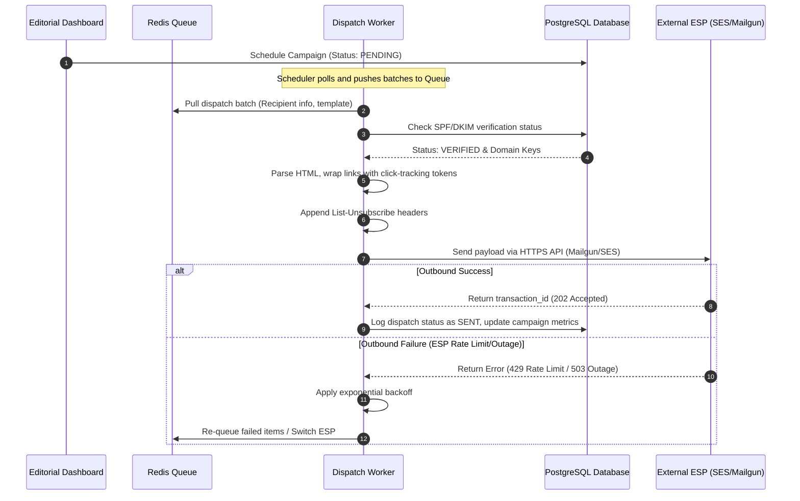
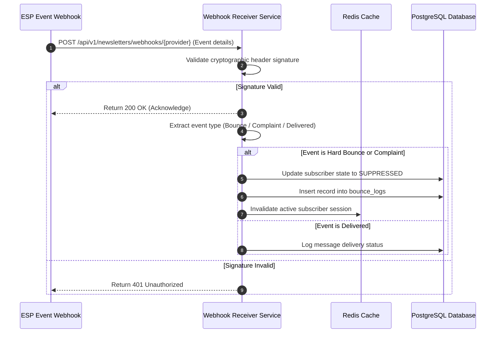
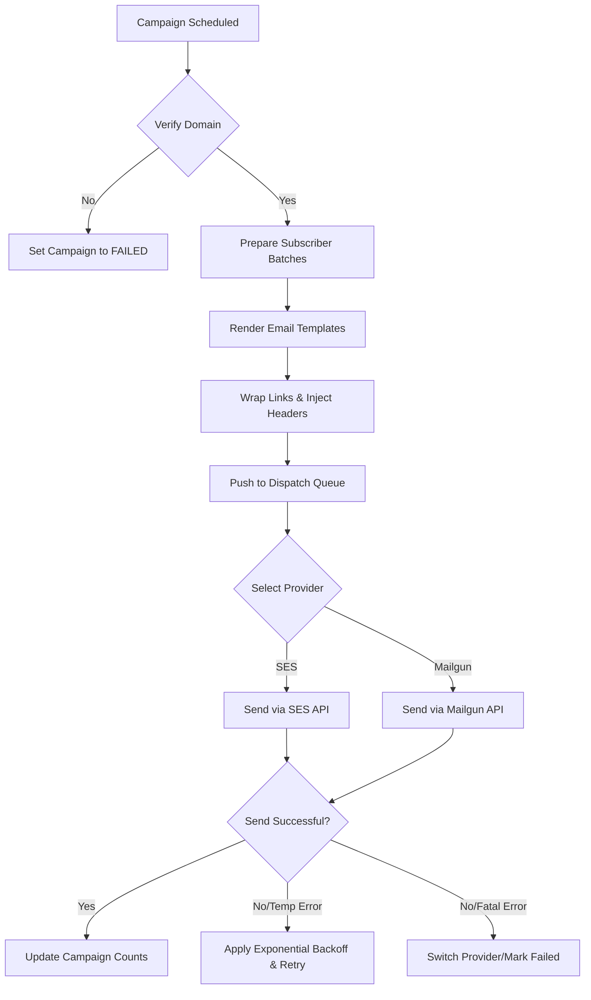

# Newsletter Sender Engine

## Purpose
The Newsletter Sender Engine defines the architecture, data structures, and operational parameters for dispatching high-volume digital newsletters and editorial updates across multiple email delivery systems (SendGrid, Mailgun, and AWS SES). This document outlines the dispatch infrastructure, sender authentication configurations (DKIM, SPF, DMARC), bounce/complaint webhook processing, traffic throttling mechanisms, and click-tracking telemetry.

## Executive Summary
NewsOps Cloud requires a highly resilient, high-throughput email transmission engine capable of delivering breaking news, daily digests, and editorial newsletters to millions of subscribers. The Newsletter Sender Engine integrates with industry-leading Email Service Providers (ESPs) via their native HTTP APIs and SMTP relays. It handles strict delivery rules, monitors sender domain reputation via bounce/complaint feedback loops, and aggregates tracking analytics using low-overhead redirection services.

## Vision
Our vision is to build an inbox-optimized, reputation-aware email delivery system that guarantees rapid newsletter arrival, enforces user privacy, and automatically coordinates multiple ESPs to maintain optimal deliverability scores.

## Scope
The scope of this system includes:
- Multi-provider outbound email routing and automatic failover logic (SendGrid, Mailgun, and AWS SES).
- DNS record verification specifications for sender domains (SPF, DKIM, DMARC).
- ESP webhook endpoints for real-time delivery status, bounce, and complaint collection.
- Rate limiting and throttle control models for recipient domains.
- Link tracking wrapper service and schema design for tracking click-through analytics.
- Global and subscription-list suppression logs.

It does not cover:
- In-browser WYSIWYG HTML layout design tools.
- AI copy generation tools (handled by the editorial AI service).
- Subscription payment gateway integration.

## Goals
- Support sustained dispatch rates of up to 5,000 emails per second (18M emails/hour).
- Maintain sender domain reputation scores above 98% across Google Postmaster and Microsoft SDNS.
- Keep bounce/complaint webhook processing latency under 200ms.
- Enforce a 99.99% redirect success rate for tracking links with latency under 30ms.
- Automate lists suppression update within 5 seconds of receiving a bounce or complaint event.

## Functional Requirements
- **Multi-Tenant Provider Management**: Tenants can connect their own ESP credentials (AWS SES, Mailgun, SendGrid) or utilize default platform relays.
- **DNS Record Verification**: System must verify sender domain configurations for SPF, DKIM, and DMARC before allowing campaign launches.
- **Dynamic Link Wrapping**: HTML newsletter templates must automatically have all `<a>` tags rewritten with click-tracking tokens pointing to the tracking proxy.
- **Bounce & Complaint Webhook Processing**: Standardized ingestion endpoints for verifying cryptographic signatures of ESP webhooks and parsing events.
- **Auto-Suppression Loop**: Automatically add hard-bounced (`permanent`) and complaining recipients to a suppression list.
- **Throttling Queue**: Segment dispatching lists by recipient domains (e.g., yahoo.com, gmail.com) to throttle send speeds and prevent ISP blocks.

## Non-Functional Requirements
- **High Availability**: Outbound queues must reside in persistent storage (RabbitMQ/Redis) to prevent data loss during worker node crashes.
- **Low-Latency Tracking**: Tracking link redirector must load cached endpoints via Redis to minimize database read overhead.
- **Scalability**: Webhook endpoints must handle up to 25,000 webhook events/sec during massive distribution periods.
- **Security**: ESP credentials must be encrypted in transit and at rest using AES-256-GCM.

## Business Rules
1. A newsletter campaign must not execute if the sender domain lacks valid DKIM or SPF records.
2. If a recipient email reports a `hard_bounce` or `spam_complaint`, the engine must set the subscriber's state to `SUPPRESSED` and halt all future emails.
3. Multi-provider routing must dynamically switch from SES to Mailgun or SendGrid if SES reports consecutive delivery errors exceeding 2% in a 5-minute window.
4. Unsubscribe links must be placed in both the email body and the list-unsubscribe headers.

## Actors
- **Editor**: Creates and schedules newsletter campaigns.
- **Platform Administrator**: Manages corporate domains, ESP configurations, and global throttling rules.
- **Subscriber**: Receives newsletters, clicks links, or marks mail as spam.
- **ESP Webhook Agent**: Sends HTTP POST requests containing events (delivered, bounced, clicked) to the webhook receiver.
- **Dispatch Worker**: Polls campaigns, renders templates, and pushes to ESP APIs.

## User Stories (At least 3 specific stories)
1. **As a Newsroom Editor**, I want to send a breaking news alert to 1,000,000 subscribers and have it distributed within 10 minutes so that our readers are informed instantly.
2. **As a Subscriber**, I want to click on the "Unsubscribe" header in my email client and have the platform register my opt-out immediately so that I do not receive unwanted messages.
3. **As a Platform Administrator**, I want to monitor our domain reputations and view real-time complaint ratios across SendGrid, Mailgun, and AWS SES in a single dashboard to catch delivery blocks early.

## Acceptance Criteria (At least 3-5 criteria with clear thresholds)
1. Sender domains must show a status of "Verified" only when SPF and DKIM public records match the platform-provided values exactly.
2. The dynamic link wrapping engine must parse HTML bodies using a streaming SAX parser and complete wrapping in less than 5ms per email.
3. Webhook signature checking must validate SendGrid's `X-Twilio-Email-Event-Webhook-Signature` or Mailgun's HMAC signatures; invalid headers must return `401 Unauthorized`.
4. Bounce processing must update target subscriber status from `ACTIVE` to `SUPPRESSED` within 5 seconds.

## Workflows (Step-by-step description of system and user interactions)

### 1. Outbound Campaign Dispatch Workflow


### 2. Inbound Webhook Bounce & Complaint Loop Workflow


## API Design (Provide actual REST endpoints, method, request/response JSON payloads, or GraphQL schemas)

### POST /api/v1/newsletters/campaigns
Creates a new newsletter campaign.
**Request Headers**:
- `Authorization: Bearer <JWT>`
- `Content-Type: application/json`

**Request Payload**:
```json
{
  "campaignName": "Daily Tech Digest - 2026-06-27",
  "senderDomainId": "dom_77209118",
  "listId": "lst_889021",
  "subject": "Breaking: AI limits exceeded globally",
  "htmlContent": "<html><body>Check out <a href=\"https://newsops.cloud/tech/ai-limits\">our post</a> to read more!</body></html>",
  "scheduledAt": "2026-06-28T09:00:00.000Z",
  "providerOverride": "AWS_SES"
}
```

**Response Payload (201 Created)**:
```json
{
  "campaignId": "cmp_9938012",
  "campaignName": "Daily Tech Digest - 2026-06-27",
  "status": "SCHEDULED",
  "scheduledAt": "2026-06-28T09:00:00.000Z",
  "wrappedLinksCount": 1,
  "createdAt": "2026-06-27T22:32:13.000Z"
}
```

### POST /api/v1/newsletters/webhooks/sendgrid
Receiver for SendGrid webhook event callbacks.
**Request Headers**:
- `X-Twilio-Email-Event-Webhook-Signature: <Signature>`
- `X-Twilio-Email-Event-Webhook-Timestamp: <Timestamp>`

**Request Payload**:
```json
[
  {
    "email": "subscriber@yahoo.com",
    "timestamp": 1782604800,
    "event": "bounce",
    "type": "blocked",
    "status": "5.7.1",
    "reason": "554 5.7.1 Service unavailable; Client host blocked",
    "sg_message_id": "sendgrid_msg_id_101",
    "newsletter_campaign_id": "cmp_9938012"
  },
  {
    "email": "complainer@gmail.com",
    "timestamp": 1782604810,
    "event": "spamreport",
    "sg_message_id": "sendgrid_msg_id_102",
    "newsletter_campaign_id": "cmp_9938012"
  }
]
```

**Response Payload (200 OK)**:
```json
{
  "status": "success",
  "processedEvents": 2
}
```

### GET /t/{trackingToken}
Public endpoint to track clicks and redirect the user to the destination target URL.
**URL Parameters**:
- `trackingToken`: A base64url-encoded, encrypted JSON payload containing campaign ID, subscriber ID, and target URL.

**Response Status (302 Found)**:
- `Location: https://newsops.cloud/tech/ai-limits`

## Database Design (Identify schema tables, fields, and indexes relevant to this feature)

### Prisma Schema
```prisma
datasource db {
  provider = "postgresql"
  url      = env("DATABASE_URL")
}

generator client {
  provider = "prisma-client-js"
}

enum CampaignStatus {
  DRAFT
  SCHEDULED
  PREPARING
  DISPATCHING
  COMPLETED
  FAILED
}

enum ProviderType {
  AWS_SES
  MAILGUN
  SENDGRID
}

enum SubscriptionStatus {
  ACTIVE
  UNSUBSCRIBED
  SUPPRESSED
}

model SenderDomain {
  id             String         @id @default(dbgenerated("concat('dom_', replace(gen_random_uuid()::text, '-', ''))")) @db.VarChar(50)
  organizationId String         @map("organization_id") @db.VarChar(50)
  domainName     String         @unique @map("domain_name") @db.VarChar(255)
  dkimSelector   String         @default("newsops") @map("dkim_selector") @db.VarChar(50)
  dkimPrivateKey String         @map("dkim_private_key") @db.Text
  spfRecord      String         @map("spf_record") @db.VarChar(255)
  dkimRecord     String         @map("dkim_record") @db.Text
  dmarcRecord    String         @map("dmarc_record") @db.VarChar(255)
  isVerified     Boolean        @default(false) @map("is_verified")
  createdAt      DateTime       @default(now()) @map("created_at")
  updatedAt      DateTime       @updatedAt @map("updated_at")
  campaigns      NewsletterCampaign[]

  @@index([organizationId])
  @@map("sender_domains")
}

model NewsletterCampaign {
  id             String         @id @default(dbgenerated("concat('cmp_', replace(gen_random_uuid()::text, '-', ''))")) @db.VarChar(50)
  organizationId String         @map("organization_id") @db.VarChar(50)
  senderDomainId String         @map("sender_domain_id") @db.VarChar(50)
  name           String         @db.VarChar(255)
  subject        String         @db.VarChar(255)
  htmlContent    String         @map("html_content") @db.Text
  status         CampaignStatus @default(DRAFT)
  provider       ProviderType   @default(AWS_SES)
  scheduledAt    DateTime?      @map("scheduled_at")
  startedAt      DateTime?      @map("started_at")
  completedAt    DateTime?      @map("completed_at")
  totalRecipients Int           @default(0) @map("total_recipients")
  sentCount      Int            @default(0) @map("sent_count")
  bounceCount    Int            @default(0) @map("bounce_count")
  complaintCount Int            @default(0) @map("complaint_count")
  clickCount     Int            @default(0) @map("click_count")
  createdAt      DateTime       @default(now()) @map("created_at")

  senderDomain   SenderDomain   @relation(fields: [senderDomainId], references: [id])
  clickLogs      ClickTrackingLog[]
  bounceLogs     BounceLog[]

  @@index([organizationId, status])
  @@map("newsletter_campaigns")
}

model Subscriber {
  id             String             @id @default(dbgenerated("concat('sub_', replace(gen_random_uuid()::text, '-', ''))")) @db.VarChar(50)
  organizationId String             @map("organization_id") @db.VarChar(50)
  email          String             @db.VarChar(255)
  status         SubscriptionStatus @default(ACTIVE)
  suppressedAt   DateTime?          @map("suppressed_at")
  suppressReason String?            @map("suppress_reason") @db.VarChar(255)
  createdAt      DateTime           @default(now()) @map("created_at")

  clickLogs      ClickTrackingLog[]
  bounceLogs     BounceLog[]

  @@unique([organizationId, email])
  @@index([status])
  @@map("subscribers")
}

model ClickTrackingLog {
  id           String             @id @default(dbgenerated("concat('clk_', replace(gen_random_uuid()::text, '-', ''))")) @db.VarChar(50)
  campaignId   String             @map("campaign_id") @db.VarChar(50)
  subscriberId String             @map("subscriber_id") @db.VarChar(50)
  targetUrl    String             @map("target_url") @db.VarChar(2048)
  ipAddress    String?            @map("ip_address") @db.VarChar(45)
  userAgent    String?            @map("user_agent") @db.VarChar(512)
  clickedAt    DateTime           @default(now()) @map("clicked_at")

  campaign     NewsletterCampaign @relation(fields: [campaignId], references: [id], onDelete: Cascade)
  subscriber   Subscriber         @relation(fields: [subscriberId], references: [id], onDelete: Cascade)

  @@index([campaignId])
  @@index([clickedAt])
  @@map("click_tracking_logs")
}

model BounceLog {
  id           String             @id @default(dbgenerated("concat('bnc_', replace(gen_random_uuid()::text, '-', ''))")) @db.VarChar(50)
  campaignId   String             @map("campaign_id") @db.VarChar(50)
  subscriberId String             @map("subscriber_id") @db.VarChar(50)
  bounceType   String             @map("bounce_type") @db.VarChar(50) // HARD, SOFT, COMPLAINT
  espMessageId String?            @map("esp_message_id") @db.VarChar(255)
  rawReason    String?            @map("raw_reason") @db.Text
  loggedAt     DateTime           @default(now()) @map("logged_at")

  campaign     NewsletterCampaign @relation(fields: [campaignId], references: [id], onDelete: Cascade)
  subscriber   Subscriber         @relation(fields: [subscriberId], references: [id], onDelete: Cascade)

  @@index([campaignId])
  @@index([bounceType])
  @@map("bounce_logs")
}
```

### PostgreSQL DDL
```sql
CREATE TYPE campaign_status AS ENUM ('DRAFT', 'SCHEDULED', 'PREPARING', 'DISPATCHING', 'COMPLETED', 'FAILED');
CREATE TYPE provider_type AS ENUM ('AWS_SES', 'MAILGUN', 'SENDGRID');
CREATE TYPE subscription_status AS ENUM ('ACTIVE', 'UNSUBSCRIBED', 'SUPPRESSED');

CREATE TABLE sender_domains (
    id VARCHAR(50) PRIMARY KEY DEFAULT concat('dom_', replace(gen_random_uuid()::text, '-', '')),
    organization_id VARCHAR(50) NOT NULL,
    domain_name VARCHAR(255) NOT NULL UNIQUE,
    dkim_selector VARCHAR(50) NOT NULL DEFAULT 'newsops',
    dkim_private_key TEXT NOT NULL,
    spf_record VARCHAR(255) NOT NULL,
    dkim_record TEXT NOT NULL,
    dmarc_record VARCHAR(255) NOT NULL,
    is_verified BOOLEAN NOT NULL DEFAULT FALSE,
    created_at TIMESTAMP WITH TIME ZONE NOT NULL DEFAULT NOW(),
    updated_at TIMESTAMP WITH TIME ZONE NOT NULL DEFAULT NOW()
);

CREATE INDEX idx_sender_domains_org ON sender_domains(organization_id);

CREATE TABLE newsletter_campaigns (
    id VARCHAR(50) PRIMARY KEY DEFAULT concat('cmp_', replace(gen_random_uuid()::text, '-', '')),
    organization_id VARCHAR(50) NOT NULL,
    sender_domain_id VARCHAR(50) NOT NULL REFERENCES sender_domains(id),
    name VARCHAR(255) NOT NULL,
    subject VARCHAR(255) NOT NULL,
    html_content TEXT NOT NULL,
    status campaign_status NOT NULL DEFAULT 'DRAFT',
    provider provider_type NOT NULL DEFAULT 'AWS_SES',
    scheduled_at TIMESTAMP WITH TIME ZONE,
    started_at TIMESTAMP WITH TIME ZONE,
    completed_at TIMESTAMP WITH TIME ZONE,
    total_recipients INT NOT NULL DEFAULT 0,
    sent_count INT NOT NULL DEFAULT 0,
    bounce_count INT NOT NULL DEFAULT 0,
    complaint_count INT NOT NULL DEFAULT 0,
    click_count INT NOT NULL DEFAULT 0,
    created_at TIMESTAMP WITH TIME ZONE NOT NULL DEFAULT NOW()
);

CREATE INDEX idx_newsletter_campaigns_org_status ON newsletter_campaigns(organization_id, status);

CREATE TABLE subscribers (
    id VARCHAR(50) PRIMARY KEY DEFAULT concat('sub_', replace(gen_random_uuid()::text, '-', '')),
    organization_id VARCHAR(50) NOT NULL,
    email VARCHAR(255) NOT NULL,
    status subscription_status NOT NULL DEFAULT 'ACTIVE',
    suppressed_at TIMESTAMP WITH TIME ZONE,
    suppress_reason VARCHAR(255),
    created_at TIMESTAMP WITH TIME ZONE NOT NULL DEFAULT NOW(),
    CONSTRAINT uq_org_email UNIQUE (organization_id, email)
);

CREATE INDEX idx_subscribers_status ON subscribers(status);

CREATE TABLE click_tracking_logs (
    id VARCHAR(50) PRIMARY KEY DEFAULT concat('clk_', replace(gen_random_uuid()::text, '-', '')),
    campaign_id VARCHAR(50) NOT NULL REFERENCES newsletter_campaigns(id) ON DELETE CASCADE,
    subscriber_id VARCHAR(50) NOT NULL REFERENCES subscribers(id) ON DELETE CASCADE,
    target_url VARCHAR(2048) NOT NULL,
    ip_address VARCHAR(45),
    user_agent VARCHAR(512),
    clicked_at TIMESTAMP WITH TIME ZONE NOT NULL DEFAULT NOW()
) PARTITION BY RANGE (clicked_at);

-- Initial partitions
CREATE TABLE click_tracking_logs_y2026m06 PARTITION OF click_tracking_logs
    FOR VALUES FROM ('2026-06-01 00:00:00+00') TO ('2026-07-01 00:00:00+00');

CREATE TABLE bounce_logs (
    id VARCHAR(50) PRIMARY KEY DEFAULT concat('bnc_', replace(gen_random_uuid()::text, '-', '')),
    campaign_id VARCHAR(50) NOT NULL REFERENCES newsletter_campaigns(id) ON DELETE CASCADE,
    subscriber_id VARCHAR(50) NOT NULL REFERENCES subscribers(id) ON DELETE CASCADE,
    bounce_type VARCHAR(50) NOT NULL,
    esp_message_id VARCHAR(255),
    raw_reason TEXT,
    logged_at TIMESTAMP WITH TIME ZONE NOT NULL DEFAULT NOW()
);

CREATE INDEX idx_bounce_logs_campaign ON bounce_logs(campaign_id);
```

## UI Design (Describe component structure, layouts, actions, and states)
- **Domain Verification View**: Screen displaying DNS setup directives. Provides the TXT records needed for SPF (`v=spf1 include:newsops.cloud ~all`), DKIM, and DMARC. Includes a "Verify Now" CTA button triggering DNS check.
- **Campaign Dispatch Panel**: Linear progression bar showing dispatch status (e.g., "750,000 / 1,000,000 emails sent"). Displays live gauges for Bounce Rate (acceptable: < 1.5%) and Complaint Rate (acceptable: < 0.05%).
- **Interactive Subscriber List**: Data table indicating active, unsubscribed, and suppressed emails. Provides toggle switches to manually lift blocks with input fields to note operational overrides.

## Permissions (Specify RBAC permissions required, e.g., organizations:read, articles:write)
- `newsletters:campaigns:write`: Write access to generate and dispatch campaigns (Editor, Admin).
- `newsletters:campaigns:read`: Read metrics and logs (Viewer, Editor, Admin).
- `newsletters:domains:write`: Add domains and modify provider config details (Platform Administrator).
- `newsletters:subscribers:write`: Add, delete, or change status of subscriber list elements (Editor, Admin).

## Security (Detail security considerations, e.g., input validation, CSRF, JWT validation)
- **ESP Secret Encryption**: ESP tokens are encrypted using AES-256-GCM. The decryption key is injected via AWS Secrets Manager.
- **Webhook Authenticity**: Custom signatures (SendGrid, Mailgun) are verified using provider public keys. SES notifications use AWS SNS signature verification.
- **Click Tracking Token Integrity**: Tokens are signed using HMAC-SHA256 with an environment secret (`TRACKING_SECRET`). Altered tokens return generic redirects to the organization's homepage without registering click analytics.
- **TLS Enforcement**: Enforce mandatory TLS 1.2+ for outbound SMTP communication.

## Performance (State latency limits, caching requirements, target TPS)
- **Target Dispatch Rate**: Sustained throughput of 5,000 TPS using distributed Go worker instances.
- **Click Redirection SLA**: Response latency below 30ms under a load of 15,000 requests per second.
- **Cache Requirements**: Cache DNS validation states for 1 hour. Cache tracker decryption payloads in Redis cluster with TTL of 7 days to eliminate DB load.

## Monitoring (Detail Prometheus metrics names, alert triggers)
- `newsletters_dispatched_total`: Counter tracking total emails sent, partitioned by campaign and provider.
- `newsletters_bounce_total`: Counter tracking bounces, partitioned by provider and category (`hard`, `soft`).
- `newsletters_complaints_total`: Counter tracking complaints by provider.
- `newsletters_worker_queue_backlog`: Gauge tracking pending emails in transmission queue.
- **Alert Triggers**:
  - Critical: `newsletters_bounce_total` > 2% of dispatch batch in any 5-minute window.
  - Warning: `newsletters_worker_queue_backlog` > 50,000 for more than 15 minutes.

## Logging (Specify log formats, error levels, log contexts)
- **Log Format**: JSON log format.
- **Log Context**: Includes `campaign_id`, `recipient_domain`, `provider_type`, and `latency_ms`.
- **Log Example**:
```json
{
  "timestamp": "2026-06-27T22:32:13.150Z",
  "level": "WARN",
  "context": "newsletter-dispatch-engine",
  "campaign_id": "cmp_9938012",
  "provider": "AWS_SES",
  "recipient_domain": "yahoo.com",
  "error_code": "THROTTLE_LIMIT_REACHED",
  "message": "ISP rate limit encountered. Throttling outbound queue for domain."
}
```

## Error Handling (Map input/system error codes to HTTP status and customer-facing messages)
- `DOMAIN_UNVERIFIED`: Code 422. HTTP Status 422 Unprocessable Entity. Message: "The sender domain lacks valid DKIM or SPF records. Please complete DNS validation."
- `ESP_CREDENTIAL_INVALID`: Code 401. HTTP Status 401 Unauthorized. Message: "The connected Email Service Provider rejected authentication. Inspect API keys."
- `RECIPIENT_SUPPRESSED`: Code 409. HTTP Status 409 Conflict. Message: "The recipient email is on the suppression list due to a previous bounce or spam report."
- `RATE_LIMIT_HIT`: Code 429. HTTP Status 429 Too Many Requests. Message: "Newsletter dispatch throttled due to provider rate constraints. Retrying automatically."

## Edge Cases (Handle race conditions, rate limit hits, upstream timeouts)
- **Simultaneous Webhook Burst**: Massive subscriber actions can send tens of thousands of callbacks simultaneously. The webhook endpoint dumps payloads into a Kafka topic, sending a fast `200 OK` back to the ESP, avoiding system lockups.
- **ESP API Outage**: If SES is down, the system switches the campaign's provider key to Mailgun or SendGrid and flags an incident ticket.
- **Tracking Database Down**: If the click tracking logs table is unresponsive, the redirector proxy redirects to the final target URL directly using token decryption keys in-memory.

## Future Improvements (Provide long-term scaling, architecture refactor paths)
- **IP Address Warm-Up Automation**: Create algorithms that automatically increase daily email volumes across new IP addresses over a 30-day period.
- **Predictive Send-Time Optimization**: Leverage machine learning to queue emails individually to fire when subscribers are historically active.

## Mermaid Diagrams (Include at least one high-quality diagram: flowchart, sequence, or ERD)


## References (Reference other related files in the repository using standard relative markdown links, e.g., '../02-architecture/system_architecture.md')
- [System Architecture](../02-architecture/system_architecture.md)
- [Multi Tenancy Architecture](../02-architecture/multi_tenancy_architecture.md)
- [Social Publishing Schema](../03-database/social_publishing_schema.md)
