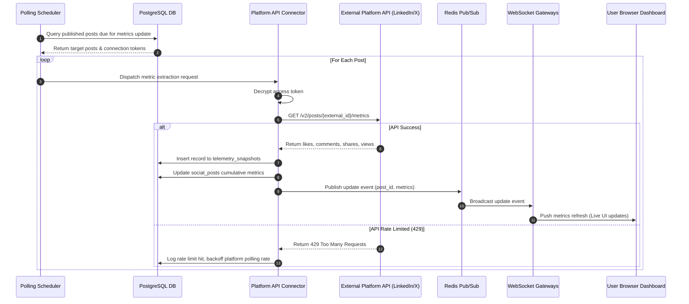
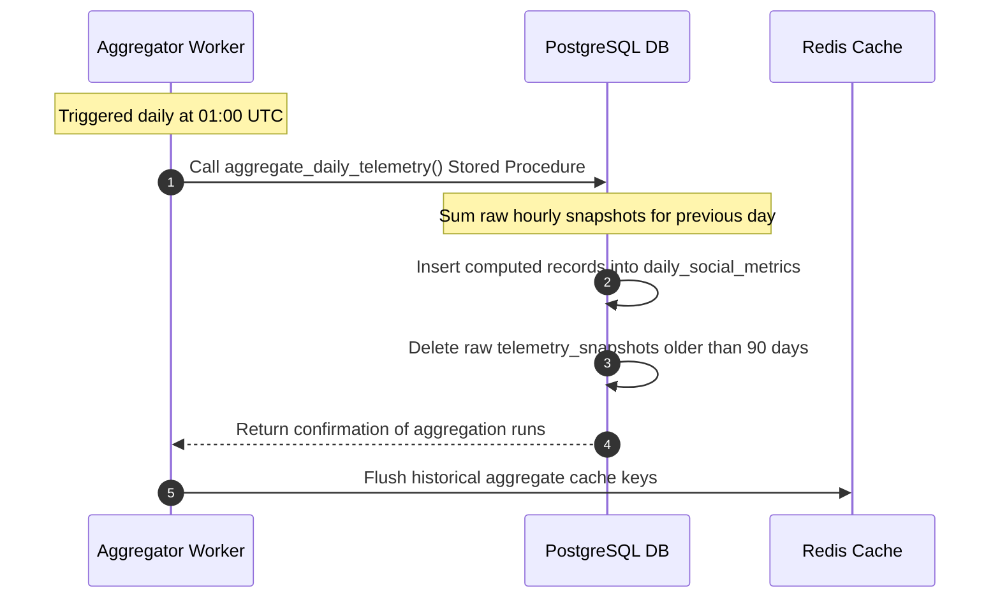
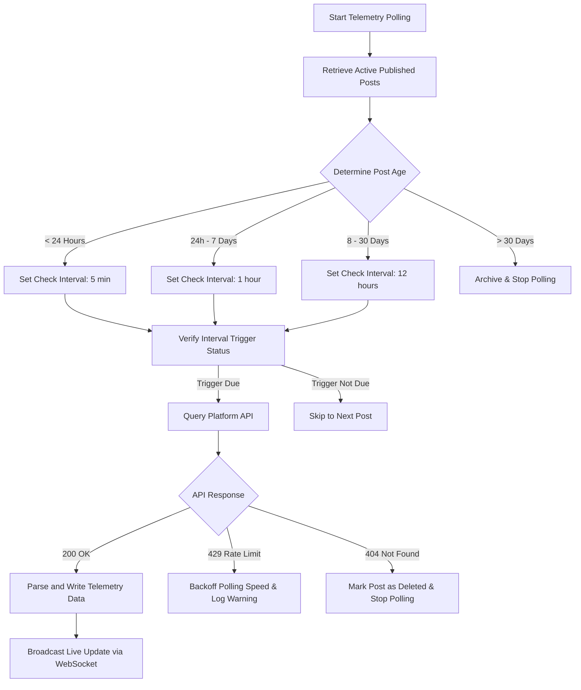

# Social Analytics Telemetry

## Purpose
The Social Analytics Telemetry document defines the technical architecture, data pipelines, database schemas, and aggregation workflows for tracking user engagement metrics (likes, reposts, comments, views, shares) across major social publishing networks (Twitter/X, LinkedIn, Facebook, and Instagram). It details the timeseries database schema, polling worker design, and analytics dashboard contracts.

## Executive Summary
A publication's success is measured by the distribution and impact of its content. The Social Analytics Telemetry system retrieves real-time and periodic performance metrics from external social platform APIs, registers them in a high-density database, and exposes aggregated telemetry through low-latency dashboard endpoints. The system uses an adaptive polling decay mechanism to reduce API calls on older posts and employs WebSocket messaging to deliver live UI updates.

## Vision
To provide editorial teams with a unified, high-performance telemetry dashboard that monitors content velocity, evaluates platform ROI, and triggers automated redistributions of highly engaging articles.

## Scope
The scope of this system includes:
- API ingestion connectors for Twitter/X, LinkedIn, Facebook, and Instagram metrics.
- Cron-based scheduling engines with decay curves for post metrics collection.
- Timeseries data models optimized for high-write engagement logging.
- Aggregation systems for calculating engagement rates and velocity metrics.
- Real-time updates push via WebSocket nodes.

It does not cover:
- Offsite website analytics (e.g., Google Analytics, Plausible).
- Multi-tenant email newsletters analytics (handled by the Newsletter Sender Engine).
- Financial metrics calculations (paid social ads tracking).

## Goals
- Fetch engagement metrics for all posts less than 30 days old.
- Support ingestion rates up to 5,000 metrics inserts/sec without performance degradation.
- Deliver WebSocket-based dashboard updates within 500ms of DB ingestion.
- Maintain API dashboard response times under 150ms for 30-day historical aggregates.
- Prevent API rate limiting penalties through adaptive worker pacing.

## Functional Requirements
- **Multi-Network Connectors**: Adaptors mapping platform-specific response payloads (e.g., Retweets, Reactions) to standard schema fields (`shares`, `likes`).
- **Decay-Driven Poller**: Worker service that adjusts query frequency depending on post age (e.g., poll every 5 minutes on day 1, down to twice daily on day 30).
- **Metric Ingestion API**: Secure endpoint for processing real-time platform webhooks (where available).
- **Timeseries Aggregator**: Continuous backend worker converting raw snapshots into daily, weekly, and monthly performance figures.
- **WebSocket Broadcast**: Service that broadcasts metric updates to active user dashboards using Redis Pub/Sub.

## Non-Functional Requirements
- **Tenant Isolation**: Metric queries must be partitioned by organization ID to prevent cross-tenant data leaks.
- **Data Retention**: Keep raw timeseries metrics for 90 days, after which data is rolled up into daily aggregates and purged.
- **Resilience**: Outgoing API failures must not block the queue. Failed requests are retried using exponential backoff.
- **Observability**: Expose detailed Prometheus metrics on worker run times, rate limits, and database latencies.

## Business Rules
1. Telemetry records must always track cumulative counts alongside interval deltas (change since last snapshot).
2. Polling frequencies must degrade automatically:
   - Post age < 24 Hours: Poll every 5 minutes.
   - Post age 24 Hours to 7 Days: Poll every 1 hour.
   - Post age 8 Days to 30 Days: Poll every 12 hours.
   - Post age > 30 Days: Archive and stop active polling.
3. If an external API returns a `429 Too Many Requests` status, the collector worker must double its wait interval for that platform connection.
4. Telemetry logs must be preserved for compliance audits even if the parent post is archived or unpublished.

## Actors
- **Social Media Editor**: Analyzes dashboard metrics to plan publication intervals.
- **Platform Polling Worker**: System service querying social APIs at designated schedules.
- **Ingest Service**: Receives webhook callbacks and pushes updates to the analytics queues.
- **Chief of Content**: Reviews weekly performance reports and export charts.

## User Stories (At least 3 specific stories)
1. **As a Chief of Content**, I want to view a real-time chart of social engagement velocities on our breaking news post so that I can allocate ad spend to the best-performing platform.
2. **As an Ingestion Worker**, I want to dynamically transition polling cycles to longer intervals as a post ages to conserve our API rate limits.
3. **As a Social Media Editor**, I want to download a consolidated PDF or CSV of engagement metrics for all platforms across the last month to present in the editorial sync meeting.

## Acceptance Criteria (At least 3-5 criteria with clear thresholds)
1. The Poller worker must determine execution intervals dynamically using SQL queries calculating the delta between `NOW()` and `published_at`.
2. Timeseries inserts must utilize bulk-write transactions with a target throughput SLA of 2,000 writes/sec at peak times.
3. WebSocket connections must receive updates within 1 second of metric snapshots committing to PostgreSQL.
4. Dashboard responses must load cached charts from Redis if requested within the last 5 minutes.

## Workflows (Step-by-step description of system and user interactions)

### 1. Adaptive Polling and Live Update Workflow


### 2. Daily Ingestion Aggregator Workflow


## API Design (Provide actual REST endpoints, method, request/response JSON payloads, or GraphQL schemas)

### GET /api/v1/social/analytics/posts/{postId}/timeseries
Retrieves engagement charts data for a single post.
**Request Headers**:
- `Authorization: Bearer <JWT>`

**Query Parameters**:
- `resolution`: `hourly` | `daily` (default: `hourly`)
- `metric`: `all` | `likes` | `comments` | `shares` | `views`

**Response Payload (200 OK)**:
```json
{
  "postId": "pst_1289012",
  "platform": "LINKEDIN",
  "resolution": "hourly",
  "timestamps": [
    "2026-06-27T18:00:00.000Z",
    "2026-06-27T19:00:00.000Z",
    "2026-06-27T20:00:00.000Z"
  ],
  "metrics": {
    "likes": [12, 45, 98],
    "comments": [2, 8, 19],
    "shares": [1, 4, 11],
    "views": [120, 480, 1120]
  }
}
```

### GET /api/v1/social/analytics/dashboard/summary
Retrieves cross-platform summary metrics for the active tenant.
**Request Headers**:
- `Authorization: Bearer <JWT>`

**Query Parameters**:
- `range`: `24h` | `7d` | `30d` (default: `7d`)

**Response Payload (200 OK)**:
```json
{
  "organizationId": "org_33901",
  "range": "7d",
  "aggregates": {
    "totalReach": 142090,
    "totalEngagement": 12890,
    "engagementRate": 0.0907,
    "clicks": 34902
  },
  "platforms": {
    "TWITTER": { "likes": 5090, "shares": 3120, "comments": 402, "clicks": 21090 },
    "LINKEDIN": { "likes": 3020, "shares": 680, "comments": 210, "clicks": 9010 },
    "FACEBOOK": { "likes": 3200, "shares": 340, "comments": 208, "clicks": 4802 }
  }
}
```

## Database Design (Identify schema tables, fields, and indexes relevant to this feature)

### Prisma Schema
```prisma
datasource db {
  provider = "postgresql"
  url      = env("DATABASE_URL")
}

generator client {
  provider = "prisma-client-js"
}

model TelemetrySnapshot {
  id           String     @id @default(dbgenerated("concat('snp_', replace(gen_random_uuid()::text, '-', ''))")) @db.VarChar(50)
  postId       String     @map("post_id") @db.VarChar(50)
  timestamp    DateTime   @default(now())
  likes        Int        @default(0)
  comments     Int        @default(0)
  shares       Int        @default(0)
  views        Int        @default(0)
  likesDelta   Int        @default(0) @map("likes_delta")
  commentsDelta Int       @default(0) @map("comments_delta")
  sharesDelta  Int        @default(0) @map("shares_delta")
  viewsDelta   Int        @default(0) @map("views_delta")

  @@index([postId, timestamp DESC])
  @@map("telemetry_snapshots")
}

model DailySocialMetric {
  id             String   @id @default(dbgenerated("concat('day_', replace(gen_random_uuid()::text, '-', ''))")) @db.VarChar(50)
  organizationId String   @map("organization_id") @db.VarChar(50)
  platform       String   @db.VarChar(50)
  metricDate     DateTime @map("metric_date") @db.Date
  likesSum       Int      @default(0) @map("likes_sum")
  commentsSum    Int      @default(0) @map("comments_sum")
  sharesSum      Int      @default(0) @map("shares_sum")
  viewsSum       Int      @default(0) @map("views_sum")

  @@unique([organizationId, platform, metricDate])
  @@index([metricDate])
  @@map("daily_social_metrics")
}
```

### PostgreSQL DDL
```sql
-- PostgreSQL DDL for timeseries telemetry storage

-- Raw Telemetry Snapshots (Partitioned by week for efficient data rolling)
CREATE TABLE telemetry_snapshots (
    id VARCHAR(50) NOT NULL DEFAULT concat('snp_', replace(gen_random_uuid()::text, '-', '')),
    post_id VARCHAR(50) NOT NULL,
    timestamp TIMESTAMP WITH TIME ZONE NOT NULL DEFAULT NOW(),
    likes INT NOT NULL DEFAULT 0,
    comments INT NOT NULL DEFAULT 0,
    shares INT NOT NULL DEFAULT 0,
    views INT NOT NULL DEFAULT 0,
    likes_delta INT NOT NULL DEFAULT 0,
    comments_delta INT NOT NULL DEFAULT 0,
    shares_delta INT NOT NULL DEFAULT 0,
    views_delta INT NOT NULL DEFAULT 0,
    PRIMARY KEY (id, timestamp)
) PARTITION BY RANGE (timestamp);

-- Weekly partitioning scripts
CREATE TABLE telemetry_snapshots_y2026w26 PARTITION OF telemetry_snapshots
    FOR VALUES FROM ('2026-06-22 00:00:00+00') TO ('2026-06-29 00:00:00+00');
CREATE TABLE telemetry_snapshots_y2026w27 PARTITION OF telemetry_snapshots
    FOR VALUES FROM ('2026-06-29 00:00:00+00') TO ('2026-07-06 00:00:00+00');

CREATE INDEX idx_telemetry_post_time ON telemetry_snapshots(post_id, timestamp DESC);

-- Aggregated Platform Metrics Table
CREATE TABLE daily_social_metrics (
    id VARCHAR(50) PRIMARY KEY DEFAULT concat('day_', replace(gen_random_uuid()::text, '-', '')),
    organization_id VARCHAR(50) NOT NULL,
    platform VARCHAR(50) NOT NULL,
    metric_date DATE NOT NULL,
    likes_sum INT NOT NULL DEFAULT 0,
    comments_sum INT NOT NULL DEFAULT 0,
    shares_sum INT NOT NULL DEFAULT 0,
    views_sum INT NOT NULL DEFAULT 0,
    CONSTRAINT uq_org_platform_date UNIQUE (organization_id, platform, metric_date)
);

CREATE INDEX idx_daily_metrics_date ON daily_social_metrics(metric_date);
```

## UI Design (Describe component structure, layouts, actions, and states)
- **Social Analytics Dashboard Layout**: Tabbed view showcasing general performance summary indicators (reach, clicks, interactions) alongside individual channel filters.
- **Engagement Velocity Chart**: Live line chart plotting post engagement counts in the selected timeline. Outlines baseline publication values as reference dotted lines.
- **Performance Leaderboard**: High-contrast sorted lists of posts ranked by engagement rates or click velocity, highlighting evergreen articles that are optimal candidates for auto-recycling.

## Permissions (Specify RBAC permissions required, e.g., organizations:read, articles:write)
- `social:analytics:read`: Read-only access to view charts, metrics, and leaderboards (Viewer, Editor, Admin).
- `social:analytics:export`: Authorization to extract raw telemetry logs and summaries into CSV, Excel, or PDF sheets (Editor, Admin).
- `social:analytics:recalculate`: Force metrics synchronization trigger for selected posts (Social Editor, Admin).

## Security (Detail security considerations, e.g., input validation, CSRF, JWT validation)
- **Tenant Scope Enforcement**: Database access rules must constrain dashboards queries using authorization token organizational claims (`where: { organizationId }`).
- **SQL Protection**: Filter attributes are structured via static string arrays to prevent query injection vectors.
- **Credential Storage**: Verification calls leverage stored encrypted channel settings. Client keys are never sent down to the UI layers.

## Performance (State latency limits, caching requirements, target TPS)
- **Ingestion Velocity**: 5,000 records/sec write threshold.
- **Aggregation SLA**: Database stored procedure aggregates daily telemetry counts in less than 5 seconds.
- **Caching**: Dashboard metrics query responses are stored in Redis cluster with a 300-second TTL to handle rapid browser refreshes.

## Monitoring (Detail Prometheus metrics names, alert triggers)
- `social_analytics_polling_duration_seconds`: Histogram tracking API collection task lengths.
- `social_analytics_api_calls_total`: Counter recording outgoing API queries, labeled by provider and status.
- `social_analytics_rate_limit_hits_total`: Counter monitoring instances where social platforms trigger HTTP 429 warnings.
- **Alert Triggers**:
  - Critical: `social_analytics_rate_limit_hits_total` > 10 occurrences in any 1-hour interval.
  - Warning: Average database write latencies on `telemetry_snapshots` exceed 150ms.

## Logging (Specify log formats, error levels, log contexts)
- **Log Format**: JSON log format.
- **Log Level**: INFO for worker runs, WARN for API timeouts or decay state transitions, ERROR for database failures and rate limit events.
- **Log Context**: Includes parameters `post_id`, `platform`, `api_latency_ms`, and `rate_limit_reset_epoch`.
- **Log Example**:
```json
{
  "timestamp": "2026-06-27T22:32:13.400Z",
  "level": "WARN",
  "context": "social-telemetry-poller",
  "post_id": "pst_1289012",
  "platform": "TWITTER",
  "message": "Twitter API rate limit reached. Decreasing polling speed for channel.",
  "rate_limit_reset_epoch": 1782608400
}
```

## Error Handling (Map input/system error codes to HTTP status and customer-facing messages)
- `RATE_LIMIT_EXCEEDED`: Code 429. HTTP Status 429 Too Many Requests. Message: "Social network rate limits reached. Retrying connection in 15 minutes."
- `INVALID_POST_REFERENCE`: Code 404. HTTP Status 404 Not Found. Message: "The requested post ID does not exist or has been deleted."
- `CREDENTIALS_EXPIRED`: Code 401. HTTP Status 401 Unauthorized. Message: "Authentication token for the destination network is invalid. Please renew connection."
- `AGGREGATION_FAILED`: Code 500. HTTP Status 500 Internal Server Error. Message: "Failed to compile aggregated statistics report. Retrying execution."

## Edge Cases (Handle race conditions, rate limit hits, upstream timeouts)
- **Metric Spikes / Viral Events**: A sudden influx of views/shares on a specific post can result in massive write operations. DB partitions prevent index locking, while the WebSocket broadcast throttles client-bound pushes using debounce routines (1 push/sec).
- **Post Deletion in External Network**: If a post is deleted by the author directly on Twitter/X, the poller receives a `404 Not Found` API payload. The worker flags the post status as `FAILED` (with error message: "Deleted on Platform") and terminates metrics collection.
- **Discrepant Timezones**: Social networks count metrics using varied day boundaries. The Ingestion Engine normalizes all timestamps to UTC before executing timeseries writes.

## Future Improvements (Provide long-term scaling, architecture refactor paths)
- **Sentiment Analytics Classifier**: Run comment texts through local semantic networks to classify user feedback (Positive, Neutral, Hostile) alongside numerical counts.
- **Recycling Recommendation Engines**: Trigger Slack alerts when posts achieve viral threshold markers to recommend editorial re-sharing or updates.

## Mermaid Diagrams (Include at least one high-quality diagram: flowchart, sequence, or ERD)


## References (Reference other related files in the repository using standard relative markdown links, e.g., '../02-architecture/system_architecture.md')
- [System Architecture](../02-architecture/system_architecture.md)
- [Social Publishing Schema](../03-database/social_publishing_schema.md)
- [Newsletter Sender Engine](./newsletter_sender.md)
