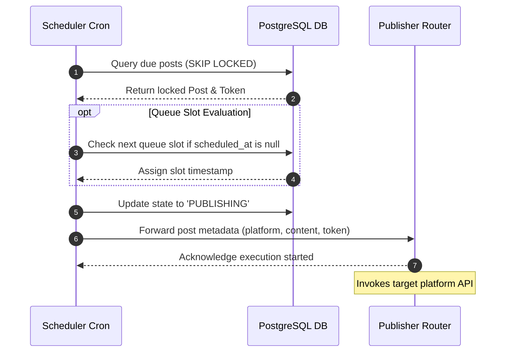
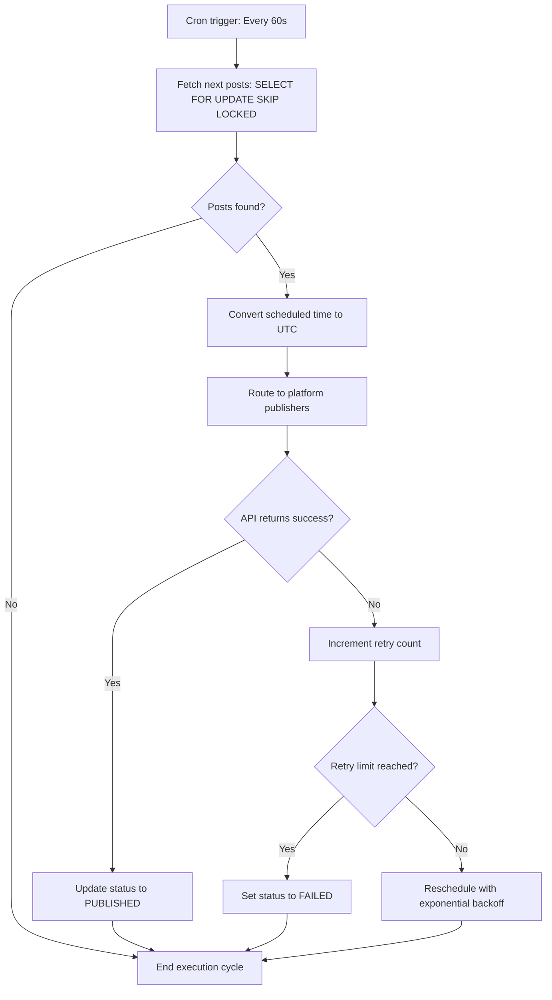

# Social Scheduler
## Purpose
The purpose of the Social Scheduler is to manage the multi-tenant publication queues, convert tenant-specific publication slots across various timezones, determine optimal posting times using engagement data, and run the background polling processes that orchestrate post distribution to target social media platforms.

## Executive Summary
The Social Scheduler is the core orchestration service of the NewsOps Cloud social suite. It handles multi-tenant isolation, allowing each organization to define distinct scheduling queues and recurring slots. The scheduler translates localized posting slot configurations into standardized UTC execution timestamps. It features an optimization engine that suggests "best posting times" based on historical analytics, and runs a high-performance, cron-driven worker that utilizes PostgreSQL row-level locks (`SKIP LOCKED`) to guarantee zero duplicate publishing under concurrent loads.

## Vision
To provide a highly reliable, autonomous scheduling subsystem that minimizes the cognitive load on editors by dynamically managing publication timelines. The scheduler ensures that breaking news is dispatched immediately, while evergreen or non-urgent content is automatically slotted into high-engagement windows optimized specifically for the target audience's timezone, all while maintaining perfect multi-tenant database isolation.

## Scope
The Social Scheduler includes:
- Multi-tenant queue management (FIFO ordering, drag-and-drop reordering, active/paused queues).
- Timezone translation engine (resolving localized slot schedules to UTC execution windows).
- Best Posting Times (BPT) analysis algorithm (analyzing `analytics_snapshots` for engagement optimization).
- Cron worker specifications (polling queries, lock management, execution loops).
- Queue status, queue manipulation, and analytics integration REST APIs.

The scheduler excludes:
- Platform-specific API request construction (handled by the platform-specific publishers).
- Direct OAuth credential acquisition (delegated to the central Identity/Auth module).

## Goals
- Support minute-level scheduling accuracy for millions of social posts across thousands of tenants.
- Prevent double-posting issues under concurrent worker scaling using database-level locking.
- Generate automated posting slot recommendations with an engagement lift of at least 15%.
- Minimize database poll times to under 15 milliseconds.

## Functional Requirements
- **Multi-Tenant Isolation**: Ensure queues, posts, and schedules are isolated using tenant partitions (`organization_id`).
- **Recurring Slot Management**: Allow tenants to define weekly recurring slots (e.g., Mondays at 09:00 AM) linked to a specific channel connection.
- **Timezone Resolution**: Store schedules in tenant local timezones and execute tasks precisely at the corresponding UTC timestamp.
- **Queue Reordering**: Provide endpoints to push a post to the top of the queue, move it to a specific index, or reschedule it manually.
- **Best Posting Time (BPT) Algorithm**: Compute historical peak engagement hours and auto-adjust slots to match.
- **Worker Concurrency Control**: Execute polling workers asynchronously across multiple instances without job overlapping.

## Non-Functional Requirements
- **High Availability**: The scheduling loop must recover from node crashes within 30 seconds.
- **Precision**: Polling workers must execute within +/- 5 seconds of the targeted minute.
- **Audit Trails**: Every queue state change (e.g. `QUEUED` -> `PUBLISHING`) must record a database-backed audit entry with user or system metadata.

## Business Rules
1. A tenant queue can be paused, which halts all scheduling execution for that queue but preserves the posts and order.
2. A post scheduled for a specific time (`scheduled_at`) takes precedence over the next available FIFO queue slot.
3. The cron worker must never process a post whose channel connection is in `EXPIRED` or `REVOKED` state.
4. If a post fails to publish, the scheduler will retry up to 3 times with exponential backoff (e.g., 5, 15, and 45 minutes) before marking it `FAILED`.

## Actors
- **Social Media Editor**: Defines recurring slots, edits queue order, and sets custom publishing times.
- **Scheduler Cron Worker**: A background Node.js/TypeScript service that polls and locks posts due for publishing.
- **BPT Analyzer Service**: An asynchronous python/rust worker that runs daily metric aggregation to update recommended slots.
- **API Client**: Renders the scheduling dashboard for newsrooms.

## User Stories (At least 3 specific stories)
1. **As a Social Editor in London**, I want to schedule a post for 9:00 AM local time, and have the system correctly execute it at 8:00 AM UTC (or 9:00 AM UTC during daylight saving transitions) so that I do not have to manually calculate offset shifts.
2. **As an Editor in a fast-paced newsroom**, I want to drag and drop draft posts within a visual queue list to rearrange their relative publishing order before they are processed by the worker.
3. **As a Content Director**, I want the system to analyze our last 30 days of Facebook posts and recommend three new scheduling slots where audience engagement has peaked, allowing us to capture higher click-through rates.

## Acceptance Criteria (At least 3-5 criteria with clear thresholds)
1. Timezone conversion must handle Daylight Saving Time (DST) transitions automatically, maintaining local time consistency.
2. The cron worker must process a queue batch of 100 posts within 2 seconds.
3. Database locking during worker polling must prevent duplicate execution with 100% reliability, verified by concurrent stress tests.
4. The BPT algorithm must complete execution over 100,000 historical snapshot records in under 3 seconds.
5. Rearranging posts in the queue must update index priorities without database table lockouts exceeding 50ms.

## Workflows (Step-by-step description of system and user interactions)
1. **Cron Polling Execution Workflow**:
   - The cron worker triggers every 60 seconds.
   - The worker executes a query to fetch the oldest posts in `QUEUED` or `SCHEDULED` status where `scheduled_at <= NOW()` or `scheduled_at IS NULL` (ready for the next slot).
   - Rows are locked using PostgreSQL `FOR UPDATE SKIP LOCKED`.
   - For each locked post, status is set to `PUBLISHING`.
   - The worker routes the post to the designated publisher service (e.g. Meta, Instagram).
   - The worker awaits the API result and updates the status to `PUBLISHED` or triggers the retry logic.
2. **Timezone Offset Computation Workflow**:
   - A user adds a slot "Mondays at 14:00" in timezone `America/New_York`.
   - The scheduler resolves the next Monday date.
   - Using the `luxon` or `moment-timezone` library, the scheduler translates `2026-06-29T14:00:00` in `America/New_York` to UTC (`2026-06-29T18:00:00Z`).
   - The computed UTC timestamp is saved in the database under `scheduled_at`.



## API Design (Provide actual REST endpoints, method, request/response JSON payloads, or GraphQL schemas)
### GET /api/v1/social/queues/{queueId}/status
Retrieves the status, limits, and chronological list of posts in a specific queue.
**Response Payload (200 OK)**:
```json
{
  "queueId": "que_990182",
  "name": "Morning Editorial Feed",
  "organizationId": "org_news_group_1290",
  "status": "ACTIVE",
  "timezone": "America/New_York",
  "totalPosts": 3,
  "posts": [
    {
      "postId": "pst_128901",
      "content": "Breaking: Market index reaches record highs.",
      "scheduledAt": "2026-06-28T13:00:00Z",
      "position": 1
    },
    {
      "postId": "pst_128902",
      "content": "Opinion: The shift in urban housing infrastructure.",
      "scheduledAt": "2026-06-28T14:30:00Z",
      "position": 2
    },
    {
      "postId": "pst_128903",
      "content": "Local highlights: Summer festival guide.",
      "scheduledAt": null,
      "position": 3
    }
  ]
}
```

### POST /api/v1/social/queues/{queueId}/reorder
Updates the position of a post within the queue.
**Request Payload**:
```json
{
  "postId": "pst_128903",
  "newPosition": 1
}
```
**Response Payload (200 OK)**:
```json
{
  "queueId": "que_990182",
  "reordered": true,
  "updatedPositions": [
    {"postId": "pst_128903", "position": 1},
    {"postId": "pst_128901", "position": 2},
    {"postId": "pst_128902", "position": 3}
  ]
}
```

### GET /api/v1/social/queues/recommend-slots
Calculates and returns the best posting times for a specific platform.
**Request Headers**:
- `organizationId: org_news_group_1290`
- `platform: FACEBOOK`
**Response Payload (200 OK)**:
```json
{
  "organizationId": "org_news_group_1290",
  "platform": "FACEBOOK",
  "timezone": "America/New_York",
  "recommendedSlots": [
    {
      "dayOfWeek": 2,
      "timeOfDay": "14:15",
      "score": 0.89,
      "reason": "Peak click-through rate observed on Tuesdays at 2 PM over the past 30 days."
    },
    {
      "dayOfWeek": 4,
      "timeOfDay": "10:30",
      "score": 0.81,
      "reason": "Highest share rate observed on Thursdays at 10 AM."
    }
  ]
}
```

## Database Design (Identify schema tables, fields, and indexes relevant to this feature)
The scheduler engine maintains a localized scheduler view with these indexes to manage queue order efficiently:

```sql
-- Indexes for performance tuning in scheduling
CREATE INDEX idx_social_posts_sort_order ON social_posts (queue_id, status) INCLUDE (id) WHERE status = 'QUEUED';
CREATE INDEX idx_social_posts_timezone_conversion ON social_posts (scheduled_at) WHERE status = 'SCHEDULED';
```

### The Best Posting Times Algorithm Specs
1. The scheduler computes the BPT engagement index $E$ for each hour-slot $h$ (0-23) and day-of-week $d$ (0-6) using:
   $$E(h, d) = \frac{\sum(\text{likes} + \text{reposts} \times 2 + \text{comments} \times 3 + \text{clicks} \times 4)}{\sum \text{impressions}}$$
2. High engagement windows are stored in temporary operational tables for quick user suggestion:
```sql
CREATE TABLE engagement_matrix_cache (
    organization_id VARCHAR(50) NOT NULL,
    platform platform_type NOT NULL,
    day_of_week SMALLINT NOT NULL,
    hour_of_day SMALLINT NOT NULL,
    score NUMERIC(5, 4) NOT NULL,
    updated_at TIMESTAMP WITH TIME ZONE DEFAULT NOW(),
    PRIMARY KEY (organization_id, platform, day_of_week, hour_of_day)
);
```

## UI Design (Describe component structure, layouts, actions, and states)
- **Queue View**: A timeline component illustrating each calendar day, with post blocks nested underneath. A drag handle on each post allows visual rearranging.
- **Timezone Selector**: Dropdown displaying UTC offset (e.g., "New York (GMT -4)") allowing managers to toggle display localized time representations.
- **BPT Generator Component**: A "Magic Wand" icon next to schedule slots. Clicking it displays a popover listing recommended hours with a one-click "Apply Recommendation" button.

## Permissions
- `social:schedules:read` - Reader, Editor, Admin. View slot maps and queues.
- `social:schedules:write` - Editor, Social Manager, Admin. Modify slots, reorder queues.
- `social:scheduler:optimize` - Social Manager, Admin. Run BPT recalculations.

## Security
- **Strict Tenant Boundary**: Every SQL query must bind `organization_id` using parameterized bindings.
- **Worker Access Tokens**: Workers authenticate using a secure backend token (`service-to-service` JWT) that limits their capabilities exclusively to status updates and token reads.
- **Input Sanitization**: Reordering requests must validate that both `postId` and `queueId` belong to the user's active tenant organization.

## Performance
- Polling query must run in $< 15\text{ms}$ using PostgreSQL indexes.
- Reordering operations use bulk updates restricted to the affected queue array limits to avoid locking the entire `social_posts` table.
- Cache the tenant timezone maps in Redis to avoid hitting the database for timezone translations on every scheduler loop.

## Monitoring
- `newsops_scheduler_poll_duration_seconds`: Histogram tracking DB polling speed.
- `newsops_scheduler_execution_latency_seconds`: Latency tracking time delta between planned `scheduled_at` and actual execution.
- `newsops_scheduler_active_locks_count`: Gauge tracking active row locks.
- **Alert Trigger**: Warning alert if `newsops_scheduler_execution_latency_seconds` exceeds 30 seconds. Critical alert if the loop does not run for 3 minutes.

## Logging
- **Log Format**: JSON structure.
- **Log Levels**: INFO for scheduling steps; ERROR for locking timeouts or timezone resolution crashes.
- **Log Context Example**:
  ```json
  {
    "timestamp": "2026-06-27T22:31:01.890Z",
    "level": "INFO",
    "context": "social-scheduler-cron",
    "locked_rows": 4,
    "duration_ms": 11,
    "action": "POLL_QUEUE_ROWS"
  }
  ```

## Error Handling
- `LOCK_ACQUISITION_TIMEOUT`: Code 508. HTTP Status 408 Timeout. Message: "Unable to acquire queue lock. The resource is being updated by another scheduling process."
- `INVALID_TIMEZONE`: Code 422. HTTP Status 422 Unprocessable Entity. Message: "The specified timezone identifier is invalid."
- `QUEUE_INDEX_OUT_OF_BOUNDS`: Code 400. HTTP Status 400 Bad Request. Message: "The new post position index is invalid for this queue size."

## Edge Cases
- **Daylight Saving Time (DST) Fallback Hour**: During the DST transition when the clock repeats an hour, the scheduler schedules double execution slots if not explicitly validated. To prevent this, the scheduler normalizes all database scheduling evaluations strictly using UTC, converting only on the presentation layer.
- **Simultaneous Drag-and-Drop Operations**: If two editors reorder the queue at the same time, the API applies a transactional pessimistic lock on the queue table, and resolves conflicts using a last-write-wins timestamp validation.

## Future Improvements
- **Machine Learning BPT**: Transition from formula-based engagement score calculation to an ML model running in python/torch analyzing post topics and image colors.
- **Decentralized Queue Processing**: Migrate queue workers from single-node cron queries to a distributed task framework (e.g., BullMQ or Temporal) for infinite scaling.

## Mermaid Diagrams


## References
- [Social Directory Index](./index.md)
- [Social Publishing Schema](../03-database/social_publishing_schema.md)
- [System Architecture](../02-architecture/system_architecture.md)
