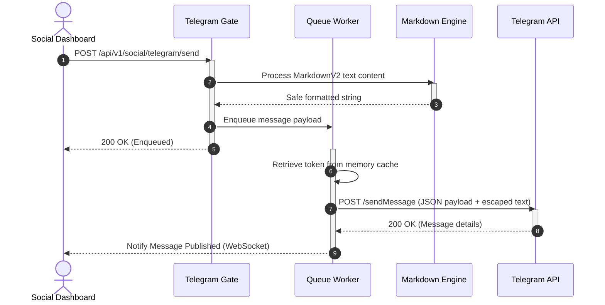

# Telegram Publisher Service Design

## Purpose
This document specifies the technical design, formatting engine, routing schemes, and security protocols for the Telegram Publisher Service within the NewsOps Cloud digital publishing platform. The service leverages the Telegram Bot API to broadcast rich text, images, and videos to news channels and chat groups.

## Executive Summary
Telegram is a crucial platform for instant news dissemination, especially in regions with high mobile usage. The Telegram Publisher Service allows editorial teams to configure automated channel feeds, formatting articles in real-time using Telegram's MarkdownV2 syntax. It handles strict character escaping requirements, manages dynamic Telegram Bot token rotations, resolves channel routing rules based on content taxonomy, and enforces platform attachment thresholds.

## Vision
To establish an instantaneous, highly reliable, and brand-safe distribution path to Telegram channels, leveraging rich media capabilities and automated formatting to maximize subscriber engagement.

## Scope
- Integration with the Telegram Bot API for message delivery (`sendMessage`, `sendPhoto`, `sendVideo`, `sendMediaGroup`).
- MarkdownV2 syntax parsing and safe character-escaping engine.
- Multi-channel routing and rule engine mapped to news sections (e.g. business news routed to channel A, sports to channel B).
- Automated Bot Token Rotation framework and auditing logs.
- Automated media sizing and compression engine for images and videos.

## Goals
- Format and escape article content to MarkdownV2 in under 50ms with zero rendering faults.
- Achieve token rotation tasks dynamically in less than 5 seconds without blocking publishing workers.
- Route articles automatically based on tags and category parameters.
- Handle attachment uploads up to Telegram Bot API limits (10MB for photos, 50MB for videos/documents).

## Functional Requirements
1. **Bot API Dispatcher**: Deliver messages, photos, videos, and multi-photo media groups using the standard HTTP Bot API.
2. **MarkdownV2 Escaping Engine**: Automatically escape reserved MarkdownV2 characters (e.g., `_`, `*`, `[`, `]`, `(`, `)`, `~`, `` ` ``, `>`, `#`, `+`, `-`, `=`, `|`, `{`, `}`, `.`, `!`) that are not part of intentional Markdown markup.
3. **Channel Routing**: Enable editors to define rules that route news alerts based on geographical tags, categories, or language codes.
4. **Token Rotation Logger**: Maintain a secure vault-integrated job that rotates bot API keys, records token metadata, and logs transitions.
5. **Media Attachment Optimizer**: Check size properties of video/image binaries, downscaling and compressing them to remain under Telegram's thresholds before upload.

## Non-Functional Requirements
- **Throughput**: Support a continuous burst rate of 30 messages per second (Telegram's rate limit cap per channel).
- **Latency**: Message processing and transmission latency must be under 300ms.
- **Reliability**: Use a local Redis queue to buffer outgoing messages, avoiding rate-limit blocks (HTTP 429).
- **Security**: Prevent bot token exposures in system output logs. Mask all tokens using SHA-256 hashes for auditing.

## Business Rules
- **Formatting Rule**: All outbound messages must include the original article hyperlink at the bottom of the post.
- **Size Enforcements**: Photos exceeding 10MB must be auto-resized to 1080p width. Videos exceeding 50MB must be rejected, triggering an editor notice to post a short snippet instead.
- **Auditing**: Bot token rotation must occur every 90 days. Logs must trace the authorization path without recording the raw secrets.

## Actors
- **Newsroom Editor**: Compiles and issues the news dispatch.
- **Telegram Bot Daemon**: Background execution loop that delivers payloads to Telegram API.
- **Telegram API Gateway**: External service receiving messages and routing them to target channels.
- **Security Officer**: Triggers token rotations.

## User Stories
- **User Story 1**: As a breaking news editor, I want to write a short update containing bold titles, bullet points, and code snippets, and have it format correctly on Telegram without crashing due to unescaped dots or exclamation marks.
- **User Story 2**: As a publisher managing multiple regional feeds, I want sports updates routed automatically to the Telegram channel dedicated to sports, and politics to the general news feed.
- **User Story 3**: As a Security Officer, I want to rotate the Telegram bot credentials regularly without dropping any active publishing jobs or exposing secrets in log trackers.

## Acceptance Criteria
- **AC 1**: The MarkdownV2 wrapper must cleanly parse headings, bold, italics, code segments, and hyperlinks while escaping special character anomalies outside those blocks (verified via a unit test suite with 100% code coverage).
- **AC 3**: Videos exceeding 50MB must fail validation at the gateway level, returning HTTP 400 with a descriptive size-error message.
- **AC 4**: During token rotation, active workers must smoothly drain old-token tasks and hot-reload the new token within 5 seconds with zero lost updates.

## Workflows
1. **Article Publishing Trigger**: An editor selects "Share on Telegram" and sets tags.
2. **Routing Lookup**: The router identifies which Telegram target channels map to the article categories.
3. **Message Formatting**: The content passes through the MarkdownV2 parser which escapes all non-syntax special characters.
4. **Media Validation**: Attachments are checked. Large images are downscaled; heavy videos are flagged.
5. **Queue Ingestion**: The message job is added to the target channel queue.
6. **Execution & Rate Limit Compliance**: The bot worker dequeues the job, checks the leaky-bucket rate limiter, and calls the Telegram API.
7. **Callback Processing**: The API response (message ID) is saved to the db.

## API Design

### 1. Internal API: Dispatch Telegram Message
- **Endpoint**: `POST /api/v1/social/telegram/send`
- **Headers**:
  - `Content-Type: application/json`
  - `Authorization: Bearer <JWT_TOKEN>`
- **Request Payload**:
```json
{
  "tenantId": "tenant-882-op",
  "category": "breaking-news",
  "text": "*Breaking Alert:* Major restructuring announced at City Council. More updates shortly!",
  "mediaUrl": "https://cdn.newsops.cloud/images/city_hall.jpg",
  "buttons": [
    {
      "text": "Read Full Article",
      "url": "https://newsops.cloud/articles/city-hall-restructure"
    }
  ]
}
```
- **Response Payload (200 OK)**:
```json
{
  "messageId": "tg-msg-99281239",
  "channelUrn": "@newsops_breaking",
  "status": "SENT",
  "deliveredAt": "2026-06-27T22:42:00Z"
}
```

### 2. Internal API: Bot Token Rotation Trigger
- **Endpoint**: `POST /api/v1/social/telegram/bot/rotate-token`
- **Headers**:
  - `Authorization: Bearer <ADMIN_JWT>`
- **Request Payload**:
```json
{
  "botId": "bot-tg-88231",
  "newSecretKeyVaultPath": "vault:secrets/tg-bot-token-v2"
}
```
- **Response Payload (200 OK)**:
```json
{
  "botId": "bot-tg-88231",
  "tokenHash": "e3b0c44298fc1c149afbf4c8996fb92427ae41e4649b934ca495991b7852b855",
  "status": "ROTATED",
  "activeTokenExpiry": "2026-09-25T22:42:00Z"
}
```

## Database Design

```sql
-- Telegram Channels Configuration Table
CREATE TABLE telegram_channels (
    id UUID PRIMARY KEY DEFAULT gen_random_uuid(),
    tenant_id VARCHAR(50) NOT NULL,
    channel_name VARCHAR(100) NOT NULL,
    channel_username VARCHAR(100) UNIQUE NOT NULL, -- e.g. @newsops_breaking
    chat_id BIGINT UNIQUE NOT NULL, -- Telegram internal channel ID
    routing_tags VARCHAR(100)[] NOT NULL, -- Array of tags, e.g., {'sports', 'breaking'}
    is_active BOOLEAN DEFAULT TRUE,
    created_at TIMESTAMP WITH TIME ZONE DEFAULT CURRENT_TIMESTAMP
);

CREATE INDEX idx_tg_channels_routing ON telegram_channels USING GIN(routing_tags);

-- Telegram Bot Settings & Token Audits
CREATE TABLE telegram_bots (
    id UUID PRIMARY KEY DEFAULT gen_random_uuid(),
    tenant_id VARCHAR(50) NOT NULL,
    bot_username VARCHAR(100) UNIQUE NOT NULL,
    encrypted_token BYTEA NOT NULL,
    token_fingerprint VARCHAR(64) NOT NULL, -- SHA-256 of the token to detect changes
    rotated_at TIMESTAMP WITH TIME ZONE DEFAULT CURRENT_TIMESTAMP,
    rotated_by VARCHAR(100) NOT NULL
);

-- Telegram Bot Rotation Logs
CREATE TABLE telegram_bot_rotation_logs (
    id UUID PRIMARY KEY DEFAULT gen_random_uuid(),
    bot_id UUID REFERENCES telegram_bots(id) ON DELETE CASCADE,
    event_type VARCHAR(50) NOT NULL, -- 'ROTATION_INITIATED', 'ROTATION_COMPLETED', 'ROTATION_FAILED'
    old_token_fingerprint VARCHAR(64) NOT NULL,
    new_token_fingerprint VARCHAR(64) NOT NULL,
    status_code VARCHAR(30) NOT NULL,
    error_message TEXT,
    created_at TIMESTAMP WITH TIME ZONE DEFAULT CURRENT_TIMESTAMP
);

CREATE INDEX idx_tg_rotation_bot ON telegram_bot_rotation_logs(bot_id);
```

## UI Design
- **Channel Dashboard**: Configuration page listing authorized Telegram bots and channels. Displays statuses, message counts, and channel usernames.
- **Composer Panel**: Input field dedicated to Telegram dispatches. It has a real-time Markdown highlighter. Words containing unescaped special characters show visual yellow highlights indicating that they will be automatically escaped by the parser before release.
- **Routing Editor**: Matrix-style check panel allowing editors to check categories and assign them to specific channel routing pathways.

## Permissions
- `social:telegram:bot:write` - Connect/edit Telegram bots and rotate tokens.
- `social:telegram:channel:write` - Configure channels and category routing rules.
- `social:telegram:send` - Publish messages and rich media content.

## Security
- **Strict Token Masking**: Raw tokens are never logged. The system uses SHA-256 hash checks (`token_fingerprint`) inside trace contexts.
- **Dynamic Key Storage**: Decrypted tokens only live in JVM/runtime process memory and are never written to swap space or log files.
- **Secure Host Validation**: The worker only communicates with Google DNS resolved `api.telegram.org` endpoints, preventing MITM DNS spoofing.

## Performance
- **Throughput SLA**: 30 messages/sec per channel.
- **Parsing Overhead**: MarkdownV2 wrapper compile time < 5ms for posts under 4,000 characters.
- **Rate-Limiter Pattern**: Utilizes Redis-backed Token Bucket algorithm to throttle outbound calls to Telegram, conforming to the `30 requests/sec` platform limit.

## Monitoring
- **Prometheus Metrics**:
  - `telegram_messages_sent_total{status="success|failure"}`
  - `telegram_bot_api_latency_seconds`
  - `telegram_rate_limit_delays_seconds`
  - `telegram_token_rotations_total`
- **Alert Conditions**:
  - Alert if `telegram_rate_limit_delays_seconds` (p99) exceeds 60 seconds (indicates severe throttling or outbound spike).
  - Warn alert if a bot token rotation fails.

## Logging
- **Log Format**: JSON
- **Log Contexts**:
  - Info: `{"timestamp":"2026-06-27T22:42:15Z","level":"INFO","event":"BOT_TOKEN_ROTATION","bot_id":"bot-tg-88231","new_fingerprint":"4f828a...","message":"Token successfully rotated in Vault and database"}`
  - Error: `{"timestamp":"2026-06-27T22:42:30Z","level":"ERROR","event":"TELEGRAM_DELIVERY_FAIL","channel":"@newsops_breaking","error_code":400,"error_description":"Bad Request: can't parse entities: Character '.' is reserved and must be escaped with the symbol '\\'","message":"Markdown V2 syntax check failed upstream"}`

## Error Handling
| Internal Error Code | HTTP Status | Upstream Reason | Customer-Facing Message |
| :--- | :--- | :--- | :--- |
| `TG_BAD_MARKDOWN` | 422 Unprocessable | 400 Bad Request (Parse entities fail) | "Failed to format post text. An unescaped special symbol caused a syntax collision." |
| `TG_RATE_LIMIT` | 429 Too Many Requests | 429 Too Many Requests from Telegram | "Telegram channel is temporarily busy. Retrying delivery in the background." |
| `TG_ATTACHMENT_TOO_LARGE` | 413 Payload Too Large | Binary exceeds bot API file limits | "Video is too large to publish directly. Try compressing or uploading a URL link instead." |
| `TG_BOT_BLOCKED` | 403 Forbidden | Bot was kicked from the channel | "The broadcasting bot was disconnected from the Telegram channel. Please check channel settings." |

## Edge Cases
- **Reserved Character Collisions**: Editors often paste code snippets or URL query variables containing characters like `.`, `_`, or `-`. The MarkdownV2 wrapper parses markdown delimiters first (`*`, `_`, `[`, etc.), replaces them with safe place markers, escapes all remaining characters, and replaces the markers back with original markdown codes.
- **Concurrent Token Rotations**: If two administrators try to rotate the same bot token simultaneously, optimistic locking on the `telegram_bots` table version column halts the second transaction.
- **Network Timeout on Large Files**: When pushing 45MB videos near the 50MB limit, the worker establishes a 60-second read/write HTTP timeout. If it times out, it moves the job to a dedicated chunked pipeline or triggers a fallback alert.

## Future Improvements
- **Inline Keyboard Builder**: Dynamic generation of custom call-to-action buttons underneath posts based on user interaction flow.
- **Web App Integrations**: Enable interactive widgets inside Telegram channels using Telegram Mini Apps.
- **Channel Stat Puller**: Periodically fetch subscriber count and views metrics to feed the dashboard charts.

## Mermaid Diagrams



## References
- System Architecture Overview: [../02-architecture/system_architecture.md](../02-architecture/system_architecture.md)
- Integration Design Patterns: [../02-architecture/integration_patterns.md](../02-architecture/integration_patterns.md)
- Event-Driven Design Details: [../02-architecture/event_driven_design.md](../02-architecture/event_driven_design.md)
