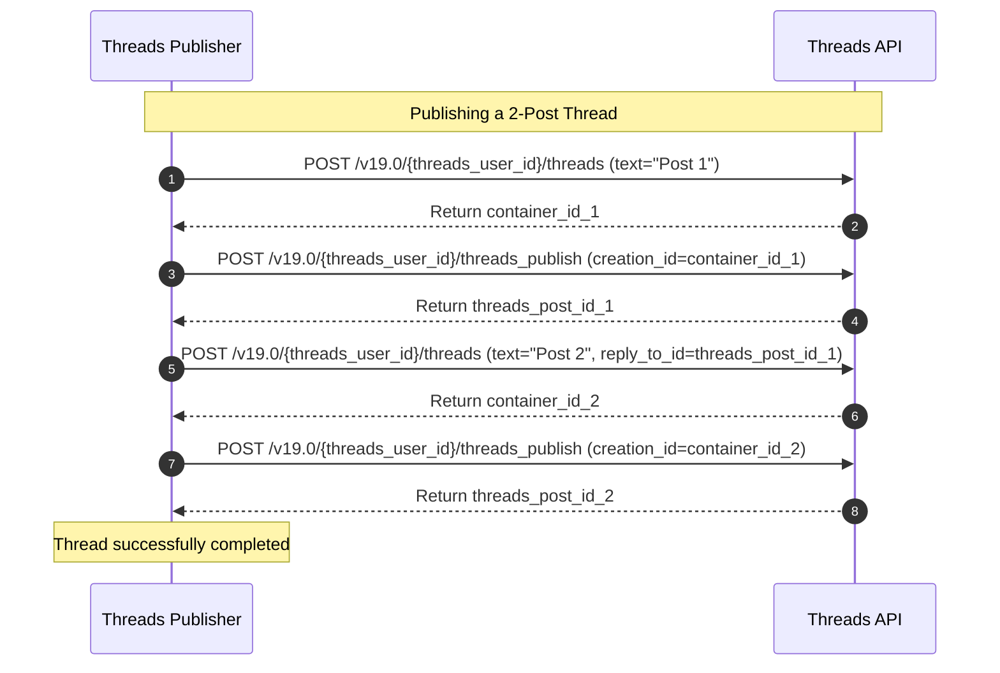

# Threads Publisher
## Purpose
The purpose of the Threads Publisher is to integrate NewsOps Cloud with the Threads API, managing the 500-character text limitations, processing structured multi-post threading arrays, uploading media attachments, and querying post engagement metrics.

## Executive Summary
The Threads Publisher is a platform-specific publishing adapter within the NewsOps Cloud social publishing suite. It interfaces with Meta's Threads API to distribute textual and visual content to the Threads microblogging platform. The publisher enforces a strict 500-character limit, supports building sequential threads by tracking reply chains (`reply_to_id` linkages), handles image and video attachments, and retrieves real-time performance indicators (impressions, likes, replies, reposts) to feed the platform's analytics dashboards.

## Vision
To establish a high-throughput, microblogging publishing bridge that allows newsrooms to publish breaking news updates, editorial commentary, and media-rich threads to Threads. By automating text splitting, linear threading creation, and media container packaging, the system provides social teams with a native microblogging experience from a single centralized dashboard.

## Scope
The Threads Publisher includes:
- Integration with Threads API endpoints (`/{threads_user_id}/threads`, `/{threads_user_id}/threads_publish`, and media metrics query APIs).
- Automated character-count checks (500-character limits) and link integration validation.
- Threading array compilers (generating multi-post chains using linear parent-child relationships).
- Media specifications check: JPEG/PNG up to 8MB, MP4/MOV videos up to 1GB and 5 minutes.
- Engagement polling for thread items: impressions, likes, replies, reposts, and quotes.

The Threads Publisher excludes:
- Account linking workflows (delegated to the organization settings and central OAuth controller).
- Scraping direct replies for content moderation (handled by the AI Moderation module).

## Goals
- Post multi-item threads sequentially with less than 2 seconds of latency per thread level.
- Provide a strict validator to prevent API rejections by trimming and validating text configurations before submission.
- Sync engagement metrics on a 24-hour schedule to track viral reach.
- Abstract the linear publishing sequence of threads into a single user-facing transaction.

## Functional Requirements
- **Text Post Processing**: Enforce the 500-character limit. Count emojis and URLs correctly (URLs are counted based on their shortened characters if using a link shortener).
- **Linear Threading Compiler**: Group an array of post blocks and compile them into a thread where post $N$ is linked to post $N-1$ using the `reply_to_id` parameter.
- **Media Ingestion**: Support attaching up to 10 images or videos per thread level using the Threads media container endpoints.
- **Engagement Ingestor**: Query the media ID to fetch metrics: `impression_count`, `like_count`, `reply_count`, `repost_count`, and `quote_count`.

## Non-Functional Requirements
- **Sequential Stability**: Ensure thread item $N$ is only posted after item $N-1$ has returned a success status and valid ID.
- **Data Protection**: Store all token parameters securely within the kms-decrypted `channel_connections` table.
- **Rate Limit Resilience**: Implement token bucket rate limiting on the adapter layer to honor Threads' publishing limits.

## Business Rules
1. A single thread request can contain at most 10 linked posts (levels).
2. All editorial URLs included in a thread must append UTM tracking parameters aligned with the source newsroom ID.
3. Media posts must define an alternative text block (`alt_text`) for accessibility compliance.
4. Threads containing video assets must poll the API until container status is `FINISHED` before creating subsequent thread replies.

## Actors
- **Social Media Editor**: Composes microblogging content, configures threads, and checks engagement.
- **Threads Publisher Service**: Manages the API pipeline and sequentially executes threads.
- **Threads API Engine**: Third-party endpoints processing the content.

## User Stories (At least 3 specific stories)
1. **As an Editorial Writer**, I want to paste a long-form news summary into the composer and have the publisher automatically break it into a sequential thread of 3 posts so that I don't exceed the 500-character limit.
2. **As a Digital Journalist**, I want to publish a photo gallery thread to Threads with alternative descriptions to keep our content accessible to visually impaired followers.
3. **As a Newsroom Analyst**, I want the platform to check my Threads post metrics every hour for the first 24 hours so that I can see when my breaking news post starts trending.

## Acceptance Criteria (At least 3-5 criteria with clear thresholds)
1. Text posts exceeding 500 characters must fail pre-flight validation in $< 10\text{ms}$ with a detailed length error message.
2. Threads consisting of 5 posts must publish sequentially in under 12 seconds, maintaining the correct order.
3. The metrics collector must successfully query and parse the 5 target engagement metrics from the Threads API.
4. If a thread level fails, downstream elements of the chain must be suspended, and the parent post marked `FAILED` with a traceback.

## Workflows (Step-by-step description of system and user interactions)
1. **Thread Publishing Workflow**:
   - The publisher receives a thread request: `posts: [{text, media}, {text, media}, ...]`.
   - **Post 1 (Root)**: 
     - Call `POST /v19.0/{threads_user_id}/threads` with `text`, `media_type` details. Meta returns container ID.
     - Poll container status. Once ready, call `POST /v19.0/{threads_user_id}/threads_publish` with `creation_id`. Meta returns root `threads_post_id`.
   - **Post 2 (Reply)**:
     - Call `POST /v19.0/{threads_user_id}/threads` with `text`, `reply_to_id=root_threads_post_id`. Meta returns container ID.
     - Poll status, then publish to get `reply_post_id_1`.
   - **Post N**:
     - Repeat, using the preceding post ID as the `reply_to_id`.
2. **Engagement Collection Workflow**:
   - The scheduler triggers the analytics cron daily.
   - The cron loops through `social_posts` where `platform = 'THREADS'` and age is under 30 days.
   - For each post, the collector calls `GET /v19.0/{external_post_id}?fields=like_count,reply_count,repost_count,quote_count,impression_count`.
   - The metrics are parsed and inserted into `analytics_snapshots`.



## API Design (Provide actual REST endpoints, method, request/response JSON payloads, or GraphQL schemas)
The Threads publisher operates as a microservice consumer. The following API definitions specify the adapter contracts:

### POST /api/v1/social/publisher/threads/publish-thread
Creates and publishes a multi-post thread.
**Request Payload**:
```json
{
  "postId": "pst_thr_1209",
  "organizationId": "org_news_group_1290",
  "threadsUserId": "8820192803",
  "threadItems": [
    {
      "text": "Breaking Update: Economic council releases new interest rate metrics. 1/3",
      "mediaUrls": []
    },
    {
      "text": "The rates are adjusted by 25 basis points to stabilize consumer indexes. 2/3",
      "mediaUrls": ["https://cdn.newsops.cloud/charts/rates.png"]
    },
    {
      "text": "Read the full analysis here: https://newsops.cloud/rates-2026 3/3",
      "mediaUrls": []
    }
  ]
}
```
**Response Payload (201 Created)**:
```json
{
  "status": "SUCCESS",
  "threadId": "thr_9920192083",
  "publishedItems": [
    {"position": 1, "externalPostId": "18820921029"},
    {"position": 2, "externalPostId": "18820921035"},
    {"position": 3, "externalPostId": "18820921044"}
  ],
  "publishedAt": "2026-06-27T22:40:05Z"
}
```

### GET /api/v1/social/publisher/threads/{externalPostId}/metrics
Retrieves engagement counts directly from the platform.
**Response Payload (200 OK)**:
```json
{
  "externalPostId": "18820921029",
  "metrics": {
    "likes": 250,
    "replies": 45,
    "reposts": 88,
    "quotes": 12,
    "impressions": 10500
  }
}
```

## Database Design (Identify schema tables, fields, and indexes relevant to this feature)
The Threads publishing model utilizes database integrations to track multi-post structures. To link thread components, the database records the sequential positions:
```sql
CREATE TABLE threads_post_chains (
    id VARCHAR(50) PRIMARY KEY DEFAULT concat('tpc_', replace(gen_random_uuid()::text, '-', '')),
    parent_post_id VARCHAR(50) NOT NULL REFERENCES social_posts(id) ON DELETE CASCADE,
    child_post_id VARCHAR(50) NOT NULL REFERENCES social_posts(id) ON DELETE CASCADE,
    position_index INT NOT NULL,
    external_item_id VARCHAR(255) NOT NULL,
    CONSTRAINT uq_thread_pos UNIQUE (parent_post_id, position_index)
);
```

## UI Design (Describe component structure, layouts, actions, and states)
- **Threads Thread Composer**: Renders a vertical layout of post boxes connected by a vertical line, mirroring the mobile Threads feed layout. Clicking "+ Add to Thread" appends a new post box.
- **Character Counter Badge**: Each post box displays an individual counter (500 max limit) and handles image attachment preview blocks independently.

## Permissions
- `social:connections:write` - Admin, Social Manager roles. Required to configure Threads profiles.
- `social:posts:publish` - Internal Worker Service identity. Required to publish thread lists.

## Security
- **Data Protection**: Store long-lived Threads User Access Tokens with AES-256-GCM.
- **CSRF Verification**: Enforce CSRF headers on UI thread compilation requests.
- **Content Sanitization**: Strip dangerous HTML, scripts, and non-supported unicode control characters from text fields before processing.

## Performance
- The character counting algorithm must support UTF-8 multi-byte characters and count them in $< 1\text{ms}$.
- Sequential thread publishing must utilize dynamic HTTP client pools with keep-alive connections to Meta endpoints, capping API overhead latency under 500ms.
- Target TPS: 200 concurrent thread dispatches.

## Monitoring
- `newsops_threads_publish_success_total`: Counter tracking successful dispatches.
- `newsops_threads_chain_length_distribution`: Histogram tracking sizes of published threads.
- `newsops_threads_api_response_time_seconds`: Histogram tracking raw API latency.
- **Alert Trigger**: Trigger a warning if Threads API throws authentication issues (token expiry) on more than 3 active channels concurrently.

## Logging
- **Log Format**: JSON structures.
- **Log Levels**: INFO for step dispatches; WARN for API throttling; ERROR for thread chain breaks.
- **Log Context Example**:
  ```json
  {
    "timestamp": "2026-06-27T22:41:15.390Z",
    "level": "ERROR",
    "context": "threads-publisher-adapter",
    "parent_post_id": "pst_thr_1209",
    "failed_position": 2,
    "error": "Threads API returned 400. Media URL is unreachable.",
    "action": "PUBLISH_THREAD_CHAIN"
  }
  ```

## Error Handling
- `THREADS_TEXT_TOO_LONG`: Code 400. HTTP Status 400 Bad Request. Message: "Thread text block exceeds the 500-character limit."
- `THREAD_CHAIN_BROKEN`: Code 502. HTTP Status 502 Bad Gateway. Message: "A post in the thread failed to publish. Subsequent replies have been cancelled."
- `RATE_LIMIT_EXCEEDED`: Code 429. HTTP Status 429 Too Many Requests. Message: "Threads API rate limits reached. Post delayed."

## Edge Cases
- **Sequential Thread Interruption**: If post 2 of a 4-post thread fails (e.g. image validation failure on Threads' server), the publisher terminates the loop, leaves posts 1 as a standalone post, flags the failure on post 2, and logs an error marking the chain as incomplete. The editor is notified to resubmit the remaining sequence manually.
- **Rapid Metric Shifts**: If a post goes viral, the polling service might face local rate-limiting. The system handles this by using an adaptive polling window that slows down polling frequency for posts older than 3 days.

## Future Improvements
- **Automated Thread Splitting**: Implement an intelligent tokenizer that reads a long text post and splits it into logical 500-character blocks at sentence boundaries (avoiding word splits).
- **Quote Post Embedding**: Add support for referencing external thread IDs to allow quote posting directly from the newsroom interface.

## Mermaid Diagrams
```mermaid
graph TD
    A[Receive Multi-Post Thread Payload] --> B[Initialize Position Index i = 1]
    B --> C{i <= threadItems.length?}
    C -->|Yes| D{i > 1?}
    D -->|Yes| E[Create Container with reply_to_id = post_id[i-1]]
    D -->|No| F[Create Root Container]
    E --> G[Upload Media and Poll Status]
    F --> G
    G --> H[Publish Container and Retrieve post_id[i]]
    H --> I[Increment i]
    I --> C
    C -->|No| J[Compile Thread Result and Return Success]
    
    style E fill:#fcc,stroke:#333,stroke-width:2px
    style H fill:#cfc,stroke:#333,stroke-width:2px
```

## References
- [Social Directory Index](./index.md)
- [Social Scheduler](./social_scheduler.md)
- [Instagram Publisher](./instagram_publisher.md)
- [Social Publishing Schema](../03-database/social_publishing_schema.md)
