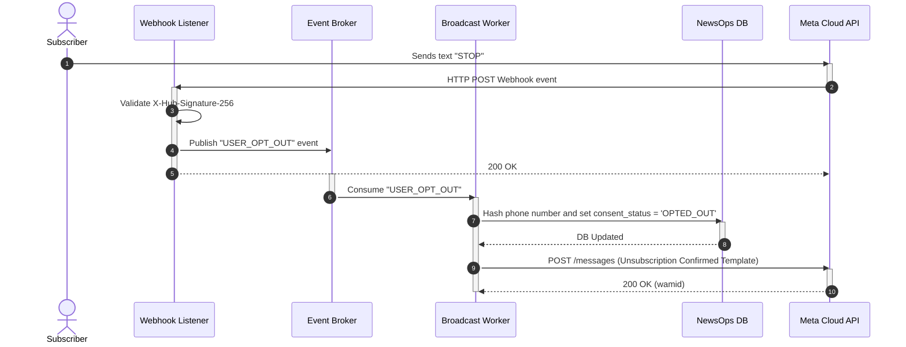

# WhatsApp Channels Service Design

## Purpose
This document outlines the system architecture, API schemas, security controls, and media processing specifications for the WhatsApp Channels Service inside the NewsOps Cloud digital publishing platform. The service manages mass broadcast distributions, subscriber messaging templates, opt-in compliance, and direct media delivery via the Meta WhatsApp Cloud API.

## Executive Summary
WhatsApp is a dominant messaging platform globally, presenting an essential channel for direct-to-reader news delivery. The WhatsApp Channels Service connects NewsOps Cloud with the Meta WhatsApp Business API. The service enables news organizations to push structured notifications using pre-approved template messages, run interactive broadcasts, track subscription agreements, scale media delivery pipelines, and comply with international spam and opt-out regulations.

## Vision
To provide a direct, high-deliverability portal to readers' mobile devices using WhatsApp's conversational capabilities, providing real-time news alerts, personalized newsletters, and media updates.

## Scope
- Meta WhatsApp Cloud API integration for template-based messaging and media sharing.
- Ingestion and management of WhatsApp Approved Templates (Meta's Business Manager sync).
- Reader subscription management, including explicit opt-in/opt-out consent mechanisms.
- Media management pipelines (compiling, resizing, and caching video and images for Meta API ingestion).
- Rate-limiting safeguards and queue management for bulk delivery.

## Goals
- Synchronize and manage up to 50 message templates from Meta Business Manager in real-time.
- Maintain a delivery rate of 100 messages per second (TPS) on standard Business accounts.
- Ensure 100% compliance on opt-out commands ("STOP", "UNSUBSCRIBE") by stopping delivery within 500ms.
- Automate Media API handshakes, reducing media conversion time to under 1.5 seconds.

## Functional Requirements
1. **Template Manager**: Retrieve, edit, and request approval for WhatsApp Message Templates directly from the NewsOps dashboard.
2. **Opt-in database**: Track phone number subscriptions, records of consent, and opt-out requests.
3. **Template Composer**: Allow journalists to write updates mapping variable slots (e.g. `{{1}}`, `{{2}}`) to article fields (Title, Author, Hyperlink).
4. **Broadcast Scheduler**: Queue and send bulk template messages to targeted subscriber lists.
5. **Interactive Responses**: Implement automated inbound keyword parsing (e.g. "YES", "NO", "STOP") to handle user enrollment flows.

## Non-Functional Requirements
- **Compliance**: Adhere to Meta's quality rating guidelines; keep message rejection rates under 1.5%.
- **Latency**: Direct alert template delivery to a single user must complete in under 1.5 seconds.
- **Availability**: Maintain messaging service availability of 99.9% through active monitoring of Meta endpoint health.
- **Data Privacy**: Encrypt subscriber phone numbers using database-level encryption (AES-256-GCM) to comply with GDPR/CCPA.

## Business Rules
- **Opt-in Verification**: Templates cannot be dispatched to subscribers who do not have a verified, active "Opt-In" flag in the database.
- **Opt-out Action**: Receiving text "STOP" or "UNSUBSCRIBE" must immediately mark the subscriber as "Opted-Out" and suspend all outgoing SMS/WhatsApp broadcasts.
- **Approval Check**: No template can be used in a broadcast until its status changes to `APPROVED` in the Meta console.
- **Pricing Management**: Outbound broadcasts must log message counts categorized by template category (Utility, Marketing, Authentication) to predict API costs.

## Actors
- **Editor-in-Chief**: Manages content strategy and templates.
- **WhatsApp Cloud API Worker**: Dispatches bulk notifications and tracks delivery status.
- **Subscribed Reader**: Receives updates and replies with commands.
- **Meta Business API**: External engine executing final carrier routing.

## User Stories
- **User Story 1**: As an Editor-in-Chief, I want to define a news flash template with a header photo and a "Read More" button, submit it to Meta for approval, and see its status change dynamically in NewsOps.
- **User Story 2**: As a Subscriber, I want to text "STOP" to the news account to unsubscribe from daily newsletters immediately without speaking to customer support.
- **User Story 3**: As a Social Editor, I want to send a breaking story update to our 10,000 opt-in subscribers and track how many messages were successfully delivered and read.

## Acceptance Criteria
- **AC 1**: Opt-out processing must run synchronously. If a user texts "STOP", the db state must transition to `OPTED_OUT` and a verification webhook response must be dispatched within 1,000ms.
- **AC 2**: Broadcast operations must fetch active opt-in users only, excluding any numbers flagged as inactive, blocked, or suspended.
- **AC 3**: Broadcast requests must throttle execution speeds dynamically if Meta responds with rate-limiting code 131048.

## Workflows
1. **Template Sync**: The NewsOps daemon syncs template approval lists from the Meta API.
2. **Broadcast Compilation**: An editor drafts a message matching a template. The system maps the article's parameters to the template's placeholder variables.
3. **Queue Creation**: The broadcast job is split into chunks of 500 recipient batches.
4. **Consent Check**: The dispatcher queries the database to filter out any inactive/opted-out numbers.
5. **Payload Dispatch**: The worker sends individual HTTP request streams to the WhatsApp Cloud API.
6. **Webhook Tracking**: Meta returns callbacks reflecting delivery statuses (`sent`, `delivered`, `read`, `failed`), which update the analytics database in real-time.

## API Design

### 1. Internal API: Sync Approved Templates
- **Endpoint**: `GET /api/v1/social/whatsapp/templates`
- **Headers**:
  - `Authorization: Bearer <JWT_TOKEN>`
- **Response Payload**:
```json
{
  "templates": [
    {
      "name": "breaking_news_alert",
      "category": "UTILITY",
      "status": "APPROVED",
      "language": "en_US",
      "components": [
        {
          "type": "HEADER",
          "format": "IMAGE"
        },
        {
          "type": "BODY",
          "text": "Breaking news alert from NewsOps: {{1}}. Tap to read the full report."
        },
        {
          "type": "BUTTONS",
          "buttons": [
            {
              "type": "URL",
              "text": "Read Full Story",
              "url": "https://newsops.cloud/breaking/{{2}}"
            }
          ]
        }
      ]
    }
  ]
}
```

### 2. Internal API: Dispatch Broadcast
- **Endpoint**: `POST /api/v1/social/whatsapp/broadcast`
- **Headers**:
  - `Content-Type: application/json`
  - `Authorization: Bearer <JWT_TOKEN>`
- **Request Payload**:
```json
{
  "tenantId": "tenant-002-wa",
  "templateName": "breaking_news_alert",
  "languageCode": "en_US",
  "variables": {
    "headerImage": "https://cdn.newsops.cloud/breaking/headline.png",
    "bodyParams": ["Fire breaks out at industrial district, residents evacuated"],
    "buttonParams": ["fire-industrial-district-2026"]
  },
  "subscriberListId": "list-breaking-subscribers"
}
```
- **Response Payload (202 Accepted)**:
```json
{
  "broadcastId": "bc-wa-993818",
  "totalRecipients": 4500,
  "status": "PROCESSING",
  "createdAt": "2026-06-27T22:45:00Z"
}
```

## Database Design

```sql
-- WhatsApp Subscribers Consent Table
CREATE TABLE whatsapp_subscribers (
    id UUID PRIMARY KEY DEFAULT gen_random_uuid(),
    tenant_id VARCHAR(50) NOT NULL,
    phone_number_encrypted BYTEA UNIQUE NOT NULL, -- Encrypted subscriber number
    phone_number_hash VARCHAR(64) UNIQUE NOT NULL, -- SHA-256 hash for quick lookups
    consent_status VARCHAR(20) NOT NULL, -- 'OPTED_IN', 'OPTED_OUT', 'BOUNCED'
    opted_in_at TIMESTAMP WITH TIME ZONE DEFAULT CURRENT_TIMESTAMP,
    opted_out_at TIMESTAMP WITH TIME ZONE,
    updated_at TIMESTAMP WITH TIME ZONE DEFAULT CURRENT_TIMESTAMP
);

CREATE INDEX idx_wa_sub_hash ON whatsapp_subscribers(phone_number_hash);
CREATE INDEX idx_wa_sub_status ON whatsapp_subscribers(consent_status) WHERE consent_status = 'OPTED_IN';

-- WhatsApp Messages Analytics Table
CREATE TABLE whatsapp_messages (
    id UUID PRIMARY KEY DEFAULT gen_random_uuid(),
    tenant_id VARCHAR(50) NOT NULL,
    broadcast_id UUID,
    recipient_hash VARCHAR(64) NOT NULL,
    wamid VARCHAR(100) UNIQUE, -- Meta WhatsApp Message ID
    message_status VARCHAR(20) NOT NULL, -- 'QUEUED', 'SENT', 'DELIVERED', 'READ', 'FAILED'
    error_code INTEGER,
    error_message TEXT,
    created_at TIMESTAMP WITH TIME ZONE DEFAULT CURRENT_TIMESTAMP,
    updated_at TIMESTAMP WITH TIME ZONE DEFAULT CURRENT_TIMESTAMP
);

CREATE INDEX idx_wa_msg_status ON whatsapp_messages(message_status);
CREATE INDEX idx_wa_msg_wamid ON whatsapp_messages(wamid);
```

## UI Design
- **Subscriber Directory**: Table displaying subscriber counts, opt-in/opt-out trends over time, and a search field to look up consent status by phone number hash.
- **Template Builder**: Visual canvas replicating the WhatsApp layout. Editors can write header texts, draft descriptions, choose action button options, and upload variable test cases.
- **Broadcast Status Tracker**: Live dashboard featuring delivery rate percentages, receipt checks (sent vs delivered vs read), and financial calculation graphs (aggregating estimated billing based on country and conversation type).

## Permissions
- `social:whatsapp:template:edit` - Submit templates to Meta and design layout mappings.
- `social:whatsapp:subscribers:manage` - View and manage subscriber database and consent overrides.
- `social:whatsapp:broadcast` - Approve and trigger message dispatches.

## Security
- **PII Protection**: Telephone numbers represent Protected Identifiable Information (PII). NewsOps stores phone numbers in binary ciphertext using AES-256-GCM. Unencrypted search uses the SHA-256 one-way hashing index (`phone_number_hash`).
- **Signature Verification**: Webhooks from Meta Cloud API contain an `X-Hub-Signature-256` header. The system computes the SHA-256 HMAC of the request body using the Meta client secret and verifies the signature to block spoofing attacks.

## Performance
- **Target Rate**: 120 API requests per second (concurrent threads).
- **Latency SLAs**:
  - Webhook processing time: <= 50ms (non-blocking, processing pushed to background).
  - Bulk assembly: <= 100ms processing delay per 1,000 target subscribers.
- **Caching**: WhatsApp message template configurations are cached in Redis with a 15-minute Time-To-Live (TTL) to avoid calling the Meta endpoint on every API lookup.

## Monitoring
- **Prometheus Metrics**:
  - `whatsapp_broadcast_sent_total`
  - `whatsapp_message_status_total{status="sent|delivered|read|failed"}`
  - `whatsapp_opt_out_total`
  - `whatsapp_meta_api_duration_seconds`
- **Alert triggers**:
  - Alert warning if the failure rate (`status="failed"`) on a single broadcast job exceeds 4%.
  - Critical alert if webhook processing queue backlogs exceed 5,000 items.

## Logging
- **Log Format**: JSON
- **Log Contexts**:
  - Info: `{"timestamp":"2026-06-27T22:45:10Z","level":"INFO","event":"SUBSCRIBER_OPT_OUT","recipient_hash":"7a892b...","message":"User opted out successfully via STOP keyword"}`
  - Error: `{"timestamp":"2026-06-27T22:45:25Z","level":"ERROR","event":"META_API_REJECTION","wamid":"wamid.HBgL...","error_code":131026,"error_message":"Message template is not approved","message":"Failed to dispatch broadcast alert"}`

## Error Handling
| Internal Error Code | HTTP Status | Meta Trigger Code | Customer-Facing Message |
| :--- | :--- | :--- | :--- |
| `WA_TEMPLATE_NOT_APPROVED` | 400 Bad Request | 131026 | "This template has not been approved yet. Please wait for Meta's review to complete." |
| `WA_SUBSCRIBER_BLOCKED` | 403 Forbidden | 131047 | "Delivery failed because the user is no longer active or has blocked this channel." |
| `WA_RATE_LIMIT_EXCEEDED` | 429 Too Many Requests | 131048 | "Platform throughput exceeded. The messaging rate is throttling down automatically." |
| `WA_MEDIA_DOWNLOAD_FAIL` | 502 Bad Gateway | 132001 | "Meta failed to download media. Please check image hosting paths." |

## Edge Cases
- **Simultaneous Opt-In and Opt-Out**: If a subscriber submits dual commands (e.g. subscribing via website while texting STOP), the system prioritizes the opt-out command, maintaining a strict "Safety-First" stance to prevent spam compliance fines.
- **Template Status Reversion**: Meta can suspend previously approved templates if quality score drops. The sync scheduler pulls statuses every 15 minutes. If a template status changes to `SUSPENDED` mid-broadcast, the active queue halts immediately.
- **Large Webhook Payload Burst**: During mass campaigns, Meta sends thousands of webhook status calls per second. The system splits the webhook listener into a fast gateway that pushes raw events to RabbitMQ/Kafka, deferring JSON updates to background workers to prevent request timeouts.

## Future Improvements
- **Interactive Chatbots**: Incorporate standard news navigation dialogues via conversational interactive bot states (using RAG AI pipelines).
- **Localized Broadcast Schedules**: Dispatch messages dynamically aligned with recipient timezone regions to prevent late-night phone vibration alerts.
- **Dynamic Media Downscaling**: Automatic layout adjustment of videos into WhatsApp optimal resolutions before uploading.

## Mermaid Diagrams



## References
- System Integration Patterns: [../02-architecture/integration_patterns.md](../02-architecture/integration_patterns.md)
- Database Design Schemas: [../03-database/index.md](../03-database/index.md)
- Multi-Tenancy Architecture: [../02-architecture/multi_tenancy_architecture.md](../02-architecture/multi_tenancy_architecture.md)
- Caching Strategy: [../02-architecture/caching_strategy.md](../02-architecture/caching_strategy.md)
