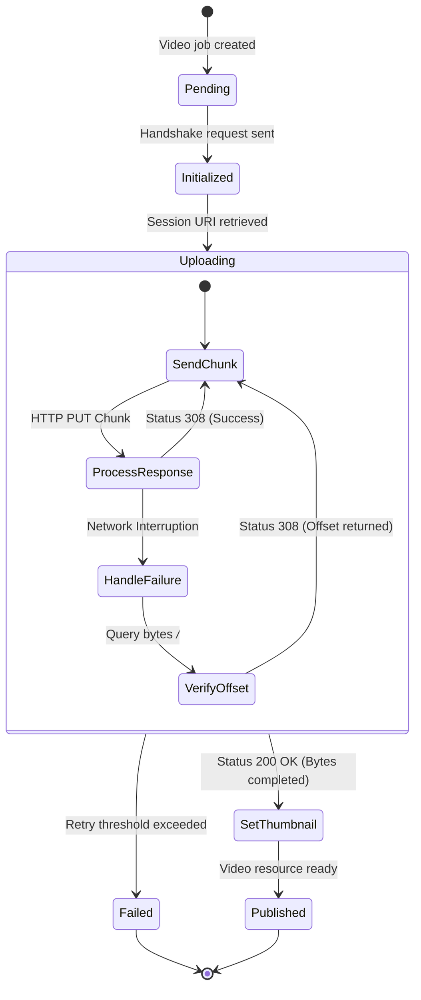

# YouTube Publisher Service Design

## Purpose
This document details the system design, network protocols, data schemas, and integration specifications for the YouTube Publisher Service within the NewsOps Cloud digital publishing platform. The service automates video uploads, metadata enrichment, thumbnail settings, and channel management using the YouTube Data API v3.

## Executive Summary
Video is a primary communication medium for modern news organizations. The YouTube Publisher Service provides a resilient pipeline for publishing video content directly from NewsOps Cloud to YouTube. Key capabilities include a resumable chunked upload mechanism for large media files (up to 5GB), integrations with an AI-powered description generator, custom thumbnail insertion, and quota optimization mechanisms to manage the strict limits of the YouTube Data API.

## Vision
To establish a high-throughput, error-resilient video publishing pipeline that lets newsrooms publish formatted, optimized, and categorized videos to YouTube within minutes of final editing, with zero manual video handling.

## Scope
- OAuth2.0 credential handshakes and management for YouTube Channels (Google Accounts).
- Chunked, resumable video binary upload protocol to YouTube API endpoints.
- Integration with AI services to generate video titles, tags, and descriptions.
- API endpoints for custom thumbnail rendering and automatic upload.
- Video publication lifecycle management (draft, private, unlisted, public states).
- YouTube API quota usage tracking and rate limit protection.

## Goals
- Successfully upload 1GB+ files under variable network conditions using a resumable session design.
- Complete metadata and custom thumbnail attachment in less than 30 seconds after video upload completion.
- Support parallel background uploading of multiple video streams.
- Track and limit daily quota consumption to prevent system-wide publishing blocks.

## Functional Requirements
1. **Google OAuth2 Authentication**: Authenticate YouTube channels and store refresh tokens with scopes `https://www.googleapis.com/auth/youtube.upload` and `https://www.googleapis.com/auth/youtube`.
2. **Resumable Chunked Ingestion**: Implement the Google Resumable Media Upload protocol, slicing files into 5MB chunks (or larger) and writing them sequentially with recovery checkpoints.
3. **AI Description Generator**: Read transcription scripts or article bodies from NewsOps Editorial, feed them to the internal LLM service, and produce optimized descriptions, tags, and chapters.
4. **Custom Thumbnail Setter**: Accept image files or render article graphics as JPG/PNG (1280x720, < 2MB) and upload them to the newly created YouTube video resource.
5. **Privacy and Scheduling**: Allow video scheduling with initial upload state set to `private` or `unlisted`, updating to `public` at the specified timestamp.

## Non-Functional Requirements
- **Reliability**: Resume interrupted uploads from the exact byte offset where the failure occurred.
- **Resource Management**: Limit active concurrent upload streams to 2 per workspace to preserve outbound bandwidth.
- **Latency**: Custom thumbnail upload must execute within 2,000ms from the trigger event.
- **Security**: OAuth refresh tokens must be encrypted via AES-256-GCM. Upload sessions must be authenticated and tenant-bound.

## Business Rules
- **Monetization Policy**: Videos categorized as "Breaking News" must have monetization features pre-configured before they are switched to public.
- **Thumbnail Constraints**: Thumbnail images must be exactly 16:9 aspect ratio, minimum width of 640 pixels, and under 2MB in size.
- **Metadata Boundaries**: Titles must not exceed 100 characters; descriptions must not exceed 5,000 characters.
- **Quota Limit Rules**: The system must warn social editors when the daily quota usage reaches 80% of the YouTube account limit (typically 10,000 quota units).

## Actors
- **Video Producer**: Directs editing, inputs metadata, and approves publishing.
- **System Scheduler**: Manages release times and transitions videos from private to public.
- **NewsOps Upload Worker**: Processes the chunked uploads in the background.
- **YouTube API Gateway**: Receives video bytes and registers metadata.
- **AI Text Transformer**: Generates descriptions and timestamps.

## User Stories
- **User Story 1**: As a Video Producer, I want my 1.5GB investigative documentary video to upload reliably even if my newsroom internet temporarily drops, so that I don't waste time restarting uploads.
- **User Story 2**: As an Editor, I want the system to generate relevant tags, keywords, and description chapters automatically based on my edited script, ensuring the video is search-optimized immediately.
- **User Story 3**: As a Social Media Manager, I want to upload a specifically designed thumbnail image for our breaking news broadcast to replace YouTube's auto-generated frame, maximizing click-through rates.

## Acceptance Criteria
- **AC 1**: The system must successfully query the upload progress byte range using `PUT` with content range header `bytes */*` after a network disconnection.
- **AC 2**: Custom thumbnails must be uploaded to `https://www.googleapis.com/upload/youtube/v3/thumbnails/set` and verify that the response returns HTTP status code 200.
- **AC 3**: The system must block uploads if the remaining daily API quota balance is insufficient to complete the request, queuing the job for the next reset cycle.

## Workflows
1. **Publish Request**: The editor selects a video file and enters basic metadata in NewsOps.
2. **Metadata Optimization**: The system calls the AI service to build descriptions, tags, and timestamps.
3. **Session Initialization**: The worker contacts YouTube to initialize a resumable upload, obtaining a unique Session URI.
4. **Chunk Ingestion**: The video file is read in chunks, sending HTTP PUT requests to the Session URI.
5. **Resume Protocol (if failed)**: The worker queries YouTube for the last successfully received byte range and resumes from that point.
6. **Thumbnail Assignment**: The custom thumbnail is generated and uploaded.
7. **Scheduling**: If scheduled, the worker logs the video ID and registers a cron trigger to update the video state from `private` to `public` at the release time.

## API Design

### 1. Internal API: Initiate YouTube Upload Job
- **Endpoint**: `POST /api/v1/social/youtube/upload`
- **Headers**:
  - `Content-Type: application/json`
  - `Authorization: Bearer <JWT_TOKEN>`
- **Request Payload**:
```json
{
  "tenantId": "tenant-443-xyz",
  "channelId": "chan-998218",
  "videoStoragePath": "s3://newsops-media/raw/2026/06/investigation_report.mp4",
  "metadata": {
    "title": "Uncovering the Truth: The Water Crisis in Metro City",
    "categoryId": "25",
    "privacyStatus": "private",
    "tags": ["investigative", "news", "water crisis"]
  },
  "generateAiDescription": true,
  "thumbnailUrl": "s3://newsops-media/processed/thumbnails/metro_city_thumbnail.png"
}
```
- **Response Payload (202 Accepted)**:
```json
{
  "uploadJobId": "job-yt-7739182",
  "channelId": "chan-998218",
  "status": "INITIALIZED",
  "currentOffset": 0,
  "createdAt": "2026-06-27T22:38:00Z"
}
```

### 2. External Request: Google Resumable Session Handshake
- **Endpoint**: `POST https://www.googleapis.com/upload/youtube/v3/videos?uploadType=resumable&part=snippet,status`
- **Headers**:
  - `Authorization: Bearer <ACCESS_TOKEN>`
  - `Content-Type: application/json; charset=UTF-8`
  - `X-Upload-Content-Length: 1610612736`
  - `X-Upload-Content-Type: video/mp4`
- **Request Payload**:
```json
{
  "snippet": {
    "title": "Uncovering the Truth: The Water Crisis in Metro City",
    "description": "AI-generated description placeholder containing report summary and chapters.",
    "tags": ["investigative", "news", "water crisis"],
    "categoryId": "25"
  },
  "status": {
    "privacyStatus": "private"
  }
}
```
- **Response Headers (Success - 200 OK)**:
  - `Location: https://www.googleapis.com/upload/youtube/v3/videos?uploadType=resumable&upload_id=AEnB2UoR8291...`

### 3. Chunk Upload Operation
- **Endpoint**: `PUT https://www.googleapis.com/upload/youtube/v3/videos?uploadType=resumable&upload_id=AEnB2UoR8291...`
- **Headers**:
  - `Content-Length: 10485760`
  - `Content-Range: bytes 0-10485759/1610612736`
- **Response Payload (308 Resume Incomplete)**:
  - Header: `Range: bytes=0-10485759`

## Database Design

```sql
-- YouTube Channel Configuration
CREATE TABLE youtube_channels (
    id UUID PRIMARY KEY DEFAULT gen_random_uuid(),
    tenant_id VARCHAR(50) NOT NULL,
    google_channel_id VARCHAR(100) UNIQUE NOT NULL,
    channel_name VARCHAR(150) NOT NULL,
    encrypted_credentials BYTEA NOT NULL,
    quota_limit_daily INTEGER DEFAULT 10000,
    quota_used_today INTEGER DEFAULT 0,
    quota_reset_at TIMESTAMP WITH TIME ZONE,
    created_at TIMESTAMP WITH TIME ZONE DEFAULT CURRENT_TIMESTAMP,
    updated_at TIMESTAMP WITH TIME ZONE DEFAULT CURRENT_TIMESTAMP
);

CREATE INDEX idx_youtube_channels_tenant ON youtube_channels(tenant_id);

-- YouTube Upload Job History
CREATE TABLE youtube_uploads (
    id UUID PRIMARY KEY DEFAULT gen_random_uuid(),
    channel_id UUID REFERENCES youtube_channels(id) ON DELETE CASCADE,
    video_id VARCHAR(50), -- Assigned by YouTube after metadata initialization
    upload_status VARCHAR(30) NOT NULL, -- 'PENDING', 'INITIALIZED', 'UPLOADING', 'COMPLETED', 'FAILED'
    resumable_session_url VARCHAR(512),
    bytes_total BIGINT NOT NULL,
    bytes_uploaded BIGINT DEFAULT 0,
    source_storage_path VARCHAR(255) NOT NULL,
    video_title VARCHAR(150) NOT NULL,
    privacy_state VARCHAR(20) NOT NULL,
    custom_thumbnail_path VARCHAR(255),
    error_log TEXT,
    scheduled_at TIMESTAMP WITH TIME ZONE,
    completed_at TIMESTAMP WITH TIME ZONE,
    created_at TIMESTAMP WITH TIME ZONE DEFAULT CURRENT_TIMESTAMP
);

CREATE INDEX idx_youtube_uploads_status ON youtube_uploads(upload_status);
CREATE INDEX idx_youtube_uploads_channel ON youtube_uploads(channel_id);
```

## UI Design
- **Upload Drop-zone**: Modern interface supporting file drag-and-drop. Shows file name, size, type, and progress bar with real-time percentage, MB transfer rates, and ETA.
- **Metadata Pane**: Input fields for title, category, tags, and playlists. Toggle switch for AI description generation.
- **Thumbnail Ingestion**: Component to drag and drop custom thumbnail graphic, presenting a canvas with safe-zone guides (e.g., ensuring titles aren't blocked by YouTube's timestamp badge).
- **Quota Monitor**: Graphic widget showing current channel's quota usage level (color transitions from green to red).

## Permissions
- `social:youtube:upload` - Upload video streams to authorized channels.
- `social:youtube:thumbnail` - Modify and replace custom video thumbnails.
- `social:youtube:metadata` - Update snippet titles, tags, and descriptions.
- `social:youtube:delete` - Remove videos or transition them back to private.

## Security
- **OAuth Scope Control**: Restrict token access to the YouTube channel database; do not request broad Google Account access.
- **Ingestion Protection**: Signed S3 bucket access policies to pull video binaries directly into worker memory without exposed transit routes.
- **Metadata Sanitation**: Clean incoming title and tag text variables against common injection payloads before building JSON requests.

## Performance
- **Bandwidth Consumption**: 100 Mbps target per upload stream.
- **Latency**: Target metadata validation execution time of < 50ms.
- **Streaming Pipeline**: Use NodeJS or Go Streams to read chunks from secure cloud storage and pipe them directly into the YouTube API request stream to avoid disk read bottlenecks.

## Monitoring
- **Prometheus Metrics**:
  - `youtube_upload_bytes_total`
  - `youtube_upload_failures_total{reason="network|quota|invalid_media"}`
  - `youtube_upload_duration_seconds`
  - `youtube_api_quota_units_used`
- **Alerts**:
  - Warn alert if daily `youtube_api_quota_units_used` goes above 9,000.
  - Critical alert if standard worker fails to resume an upload after 3 sequential retries.

## Logging
- **Log Format**: JSON
- **Log contexts**:
  - Info: `{"timestamp":"2026-06-27T22:40:00Z","level":"INFO","job_id":"job-yt-7739182","bytes_transferred":524288000,"message":"Chunk upload validation successful"}`
  - Error: `{"timestamp":"2026-06-27T22:40:15Z","level":"ERROR","job_id":"job-yt-7739182","error_message":"Received 503 Service Unavailable from Google - Retrying chunk","message":"Ingestion path interrupted"}`

## Error Handling
| Internal Error Code | HTTP Status | Upstream Cause | Customer-Facing Message |
| :--- | :--- | :--- | :--- |
| `YT_QUOTA_EXHAUSTED` | 403 Forbidden | Google quota limits reached (403) | "Daily YouTube publishing quota limit hit. The upload will automatically resume tomorrow." |
| `YT_CHUNK_MISMATCH` | 400 Bad Request | Size header mismatch during PUT | "Video upload data mismatch occurred. Re-verifying upload status." |
| `YT_EXPIRED_SESSION` | 410 Gone | Resumable session ID expired (>24 hrs) | "The video upload session expired. Restarting the upload handshake." |
| `YT_INVALID_MEDIA` | 415 Unsupported | Format not accepted by YouTube | "Unsupported video format. Please upload standard MP4, MOV, or WebM files." |

## Edge Cases
- **Upload Interruptions**: If the worker loses connection, it initiates a byte-verify loop:
```http
PUT [Resumable Session URI]
Content-Length: 0
Content-Range: bytes */1610612736
```
The YouTube server returns a `308 Resume Incomplete` code indicating the last received range, and the worker pipes remaining bytes.
- **Quota Cap Enforcement**: If a video upload request fails due to quota limits, the scheduler automatically shifts all queued uploads to "Paused" and schedules execution to restart at UTC 08:00 (when Google quotas reset).
- **Metadata Verification Fail**: YouTube blocks certain characters in descriptions. If a payload gets rejected, the worker sanitizes the description, strips illegal characters, and retries.

## Future Improvements
- **Automatic Subtitling**: Auto-transcribe video binaries and publish SRT files alongside video.
- **Shorts Auto-Slicing**: Automatically convert 16:9 videos into 9:16 vertical shorts if length is under 60 seconds.
- **Advanced Metadata Mapping**: Match video category codes dynamically based on AI classification tags.

## Mermaid Diagrams



## References
- System Integration Patterns: [../02-architecture/integration_patterns.md](../02-architecture/integration_patterns.md)
- Storage Architecture Design: [../02-architecture/storage_architecture.md](../02-architecture/storage_architecture.md)
- Data Schemas Index: [../03-database/index.md](../03-database/index.md)
