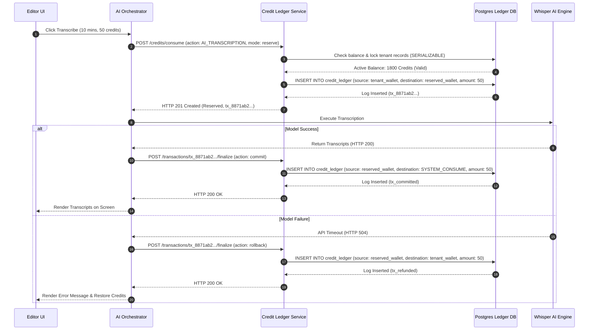

# Credit Consumption

## Purpose
This document specifies the technical design, system configurations, and schema rules of the Credit Ledger Engine inside the NewsOps Cloud platform. It guides engineers on how AI credits are tracked, bought, consumed, and audited using a double-entry accounting model.

## Executive Summary
To meter the operational costs of artificial intelligence workflows (such as content summarization, audio transcription, multilingual translation, and text-to-image generation), NewsOps Cloud deploys a high-throughput, transactionally isolated credit ledger. Credits are purchased via Stripe Checkout and debited instantly whenever AI tools are used. By utilizing a database double-entry ledger design, we guarantee zero drift and absolute accountability.

## Vision
The credit consumption engine must scale to support hundreds of concurrent AI-powered newsrooms. It enforces real-time balance validation checks at database-level speed, preventing double-spend attacks during parallel operations while providing an immutable ledger log for auditing.

## Scope
### In-Scope
* Database schemas and indexes for double-entry credit ledger operations.
* Standardized AI credit consumption ratios for different models.
* REST API endpoints to fetch balances, initiate credit purchases, and consume credits.
* Transaction orchestration protocols including credit reservation and rollback mechanisms.

### Out-of-Scope
* Direct execution of LLM algorithms (handled in the [AI module](../04-ai/index.md)).
* Management of monthly subscription plans (handled in [subscription_billing.md](./subscription_billing.md)).

## Goals
* **Concurrency Protection**: Block parallel requests attempting to double-spend remaining credit lines.
* **Low Latency**: Balance check and reservation checks must execute in $< 8\text{ ms}$.
* **Throughput Capacity**: Support up to 500 ledger entry inserts per second.
* **Zero Discrepancy**: Ensure the global balance sum across all mint, consumer, and tenant accounts always equals zero.

## Functional Requirements
* **Ledger Auditing**: Log all credit changes in a transaction log with debit and credit records.
* **Real-time Balance Lookups**: Expose fast endpoints for the UI and AI executors to query remaining balances.
* **Reservation Lifecycle**: Support credit reservation (hold) before sending data to upstream AI providers, with dynamic commit or rollback based on downstream task success.
* **Stripe Integration for Top-ups**: Process credit package transactions using Stripe sessions and instantly credit the ledger on completion.

## Non-Functional Requirements
* **Transaction Isolation Level**: Enforce `REPEATABLE READ` or `SERIALIZABLE` transactions on ledger modifications.
* **Data Immutability**: Enforce database rules preventing any updates or deletions of existing ledger entries; corrections must require compensatory transactions.

## Business Rules
### AI Consumption Ratios
AI processing is metered using precise consumption ratios based on compute costs:

| AI Action Category | Metric Unit | Credit Cost | System Backend Action |
|:---|:---|:---|:---|
| **AI Text Summarization** | Per execution | 1 credit | Triggers GPT-4o-mini summarizer |
| **Smart Content Tagging** | Per article | 1 credit | Analyzes topics and categories |
| **Multilingual Translation** | Per 1,000 words | 3 credits | Translates articles into target language |
| **AI Voice Transcription** | Per audio minute | 5 credits | Triggers Whisper-1 transcriber |
| **AI Image Generation** | Per image generated | 10 credits | Triggers DALL-E 3 / SDXL generator |

### Credit Top-up Packages
Tenants can purchase dynamic credit packages:
* **Bronze Package**: 1,000 credits for $10.00 USD
* **Silver Package**: 5,000 credits for $45.00 USD (10% discount)
* **Gold Package**: 10,000 credits for $80.00 USD (20% discount)

## Actors
* **News Editor**: Triggers AI generation tools in the editorial panel.
* **Tenant Administrator**: Reviews logs, inspects usage graphs, and purchases credit packages.
* **AI Processing Orchestrator**: Internal system service that coordinates reservation and execution of AI tasks.

## User Stories
* **User Story 1**: As a News Editor, I want the system to check my organization's credit balance before I start translating a 5,000-word article so that I am notified if we need to buy more credits first.
* **User Story 2**: As a Tenant Administrator, I want to buy a 5,000-credit top-up using our billing card so that my writing staff can instantly resume generating article audio transcripts.
* **User Story 3**: As a Platform Auditor, I want every credit adjustment to be recorded as a double-entry transaction between system mints and tenant accounts so that we can easily trace our compute margins.

## Acceptance Criteria
* Credit deduction must fail with HTTP 402 Payment Required if the tenant's current balance is less than the action cost.
* If an AI model fails to respond due to upstream timeouts, the system must trigger a compensating ledger transaction to refund the exact credit amount.
* The balance database query must return the accurate ledger calculation (`SUM(credit) - SUM(debit)`) within 10ms.

## Workflows
### AI Execution Credit Lifecycle
1. **Request Trigger**: Editor clicks "Generate Transcript" on a 10-minute video (cost: 50 credits).
2. **Transaction Start**: AI Orchestrator calls `/credits/consume` with reservation status.
3. **Balance Check**: Ledger checks balance using SQL `SELECT FOR UPDATE` to lock records.
4. **Reservation Row**: System inserts a reservation row (50 credits moved from `tenant_wallet` to `reserved_wallet`).
5. **AI API Call**: AI Orchestrator sends the transcription task to OpenAI Whisper.
6. **Task Result**:
   * *Success*: AI Orchestrator calls commit endpoint. The reservation is finalized, debiting `reserved_wallet` and crediting the global `system_consume` account.
   * *Failure*: AI Orchestrator calls rollback endpoint. The 50 credits are transferred back to the `tenant_wallet`.
7. **UI Update**: The user gets the transcripts and their updated balance reflects the final state.

## API Design
### Check Credit Balance
* **URL**: `/api/v1/credits/balance`
* **Method**: `GET`
* **Headers**:
  * `Authorization: Bearer <JWT>`
* **Response Payload (200 OK)**:
```json
{
  "tenantId": "tnt_29104a-88f1-4ab1",
  "balance": 1850,
  "reserved": 50,
  "netAvailable": 1800,
  "currency": "credits"
}
```

### Consume Credits (Reserve/Direct)
* **URL**: `/api/v1/credits/consume`
* **Method**: `POST`
* **Headers**:
  * `Authorization: Bearer <JWT>`
* **Request Payload**:
```json
{
  "action": "AI_TRANSCRIPTION",
  "units": 10, 
  "correlationId": "job_9920182_transcribe",
  "mode": "reserve"
}
```
* **Response Payload (201 Created)**:
```json
{
  "transactionId": "tx_8871ab2-cd34-4a21-9921-91a92cf99a81",
  "status": "reserved",
  "amount": 50,
  "remainingBalance": 1750,
  "correlationId": "job_9920182_transcribe"
}
```

### Finalize Transaction (Commit / Void)
* **URL**: `/api/v1/credits/transactions/tx_8871ab2-cd34-4a21-9921-91a92cf99a81/finalize`
* **Method**: `POST`
* **Headers**:
  * `Authorization: Bearer <JWT>`
* **Request Payload**:
```json
{
  "action": "commit" 
}
```
* **Response Payload (200 OK)**:
```json
{
  "transactionId": "tx_8871ab2-cd34-4a21-9921-91a92cf99a81",
  "status": "committed",
  "amount": 50,
  "finalBalance": 1750
}
```

### Purchase Credit Package
* **URL**: `/api/v1/credits/checkout`
* **Method**: `POST`
* **Headers**:
  * `Authorization: Bearer <JWT>`
* **Request Payload**:
```json
{
  "packageId": "pkg_gold",
  "successUrl": "https://vanguard-news.newsops.cloud/admin/billing/credits/success",
  "cancelUrl": "https://vanguard-news.newsops.cloud/admin/billing/credits/cancel"
}
```
* **Response Payload (200 OK)**:
```json
{
  "checkoutSessionId": "cs_test_cr_8871a...",
  "url": "https://checkout.stripe.com/pay/cs_test_cr_8871a..."
}
```

## Database Design
To ensure transactional integrity, we implement a ledger structure that prohibits inline editing:

### Table: `credit_ledger`
```sql
CREATE TABLE credit_ledger (
    entry_id UUID PRIMARY KEY DEFAULT gen_random_uuid(),
    tenant_id UUID NOT NULL,
    source_account VARCHAR(100) NOT NULL, -- 'SYSTEM_MINT', 'tenant_wallet', 'reserved_wallet'
    destination_account VARCHAR(100) NOT NULL, -- 'tenant_wallet', 'reserved_wallet', 'SYSTEM_CONSUME'
    amount INT NOT NULL CHECK (amount > 0),
    transaction_type VARCHAR(50) NOT NULL, -- 'TOPUP', 'RESERVATION', 'CONSUMPTION', 'REFUND'
    correlation_id VARCHAR(255) NOT NULL UNIQUE,
    created_at TIMESTAMP WITH TIME ZONE DEFAULT CURRENT_TIMESTAMP
);

CREATE INDEX idx_ledger_tenant ON credit_ledger(tenant_id);
CREATE INDEX idx_ledger_correlation ON credit_ledger(correlation_id);
```

### Dynamic Balance Calculation view
```sql
CREATE VIEW tenant_balances AS
SELECT 
    tenant_id,
    (COALESCE(SUM(amount) FILTER (WHERE destination_account = 'tenant_wallet'), 0) - 
     COALESCE(SUM(amount) FILTER (WHERE source_account = 'tenant_wallet'), 0)) AS available_balance,
    (COALESCE(SUM(amount) FILTER (WHERE destination_account = 'reserved_wallet'), 0) - 
     COALESCE(SUM(amount) FILTER (WHERE source_account = 'reserved_wallet'), 0)) AS reserved_balance
FROM credit_ledger
GROUP BY tenant_id;
```

## UI Design
The credit consumption panel inside the dashboard provides these features:
* **Balance Meter**: Displays total active credits, reserved credits, and equivalent dollar values.
* **Usage Breakdown**: A bar chart mapping credit consumption across AI services (Summarization, Transcription, Translation, Image Generation) over the last 30 days.
* **Top-up Selector**: Interactive cards displaying Bronze, Silver, and Gold pricing plans, redirecting directly to checkout processes.

## Permissions
* `credits:read`: Permissions to check credit balances and consumption histories.
* `credits:consume`: Authorized backend services to debit and reservation parameters.
* `credits:adjust`: Administrator-level permissions to manually grant or void ledger rows.

## Security
* **Double Entry Enforcement**: System validation layers check that every transaction balance is accounted for.
* **Idempotent Keys**: All transactions require a unique `correlationId`. If the orchestrator retries a request with the same ID, the database returns the existing transaction entry to prevent duplicate billing.
* **SQL Lock Protections**: Balance validations use `SELECT FOR UPDATE` inside transactions to prevent race conditions during rapid multi-user edit actions.

## Performance
* **Redis Balance Replication**: Current tenant balances are mirrors in Redis keys `tenant:credits:balance:<tenant_id>` to support instant API checks without querying database tables on read loops.
* **Index Configurations**: Primary indexes on `tenant_id` and `correlation_id` optimize lookup latency to $< 2\text{ ms}$.

## Monitoring
* **Prometheus Metric**: `credit_ledger_balance_inquiries_total` (Counter tracking balance API queries).
* **Prometheus Metric**: `credit_ledger_insufficient_funds_events` (Counter tracking blocked AI calls).
* **Alert Trigger**: Trigger WARNING alarm if `credit_ledger_insufficient_funds_events` rises above 20 in 5 minutes, indicating potential customer billing distress.

## Logging
Logs are printed in strict JSON schema format, correlating processing pipelines:
```json
{"timestamp":"2026-06-27T22:36:30Z","level":"INFO","context":"CreditLedgerService","tenant_id":"tnt_29104a-88f1-4ab1","action":"RESERVATION","amount":50,"correlation_id":"job_9920182_transcribe","message":"Reserved 50 credits for AI Whisper task"}
```

## Error Handling
| Internal Ledger Error | HTTP Status | Customer-Facing Action |
|:---|:---|:---|
| `INSUFFICIENT_CREDITS` | 402 Payment Required | Your credit balance is insufficient. Please purchase a top-up. |
| `DUPLICATE_CORRELATION_ID` | 409 Conflict | This transaction request has already been processed. |
| `LEDGER_ISOLATION_FAILURE` | 503 Service Unavailable | Credit verification is temporarily busy. Please retry in a few seconds. |

## Edge Cases
* **AI Model Failure rollback**: If the AI model crashes after a credit reservation, a background reconciler checks for reserved transactions older than 30 minutes and automatically executes refund compensation rows.
* **Negative Balance Prevention**: Under peak parallel tasks, if a tenant has 10 credits remaining and fires three parallel requests costing 5 credits each, the databases' `SERIALIZABLE` isolation locks execution queues, ensuring the third request rejects safely.

## Future Improvements
* **Automated Top-ups**: Enable auto-recharge settings that purchase credit packages via Stripe whenever balance levels drop below 10% thresholds.
* **Cryptographic Block Chaining**: Sign each ledger record with the SHA-256 hash of the preceding record to guarantee complete data immutability.

## Mermaid Diagrams
### Ledger Transaction Reservation and Commit Flow


## References
* High-Level SaaS Index: [index.md](./index.md)
* Multi-Tenancy Architecture: [../02-architecture/multi_tenancy_architecture.md](../02-architecture/multi_tenancy_architecture.md)
* AI Subsystem Index: [../04-ai/index.md](../04-ai/index.md)
