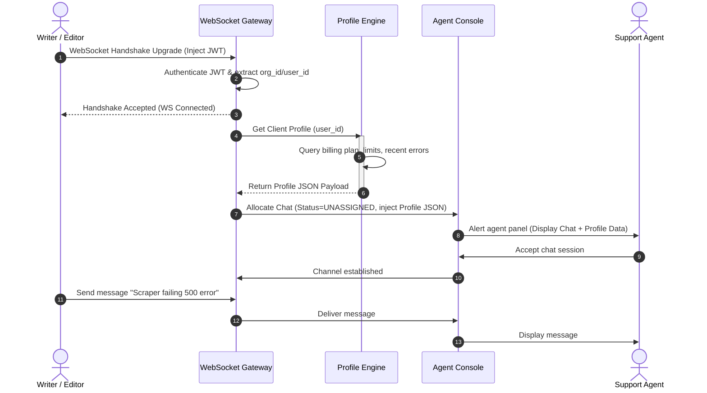

# Customer Support Integration
## Purpose
This document specifies the technical design, system integration architectures, database schemas, search indexes, and user workflows for the NewsOps Cloud customer support system. It covers the in-app chat interface, the ticket management engine, Elasticsearch indexing, and the client profile context aggregation system designed to assist support agents.

## Executive Summary
The support system ensures that tenant administrators and editorial staff can easily request help and resolve operational issues directly from the NewsOps Cloud console. This specification outlines the WebSocket-based in-app chat system, the underlying ticketing database design, the Elasticsearch search schema configuration, and the dynamic client support profiles that gather billing, usage, and error log contexts. Finally, it documents the API contracts and synchronization loops with external support gateways (such as Zendesk or Intercom).

## Vision
To provide a customer support experience that minimizes user friction by integrating chat capabilities directly into the editorial environment. By equipping support agents with comprehensive, real-time client profile contexts (billing levels, system quotas, and recent backend error dumps), we aim to resolve technical issues quickly and reduce average response times.

## Scope
The scope of this integration design includes:
- **In-App Chat Specification**: WebSocket-driven communication layer for publishers.
- **Ticketing Engine Schema**: Structured models for tickets, messaging history, and file uploads.
- **Search Index Mapping**: Elasticsearch definitions for full-text indexing and retrieval.
- **Client Profiles Context Generator**: Data compiler summarizing tenant metadata, active quotas, and recent console error codes.
- **Gateway Webhook Synchronization**: Bi-directional event adapters linking local DB rows with third-party service desks.

## Goals
1. Establish in-app chat WebSocket handshake connections in less than 200ms.
2. Index support ticket mutations in Elasticsearch with a replication delay of less than 2 seconds.
3. Consolidate client profiles and deliver them to support dashboards in under 1 second.
4. Keep full-text query times for ticket search history under 50ms across 100,000 records.

## Functional Requirements
- **Integrated Chat widget**:
  - Authenticated users must have access to a floating chat widget that connects to a dedicated chat gateway.
  - The client must degrade from WebSockets to HTTP long-polling if ports are blocked.
- **Ticketing Life Cycle**:
  - Users can submit formal support tickets with descriptions, categories, priority, and attachments.
  - The system must capture and store state changes (New, Assigned, Open, Pending Customer, Resolved, Closed).
- **Search Queries**:
  - Operators must be able to perform full-text searches across tickets, agent comments, and categories.
- **Contextual Support Profiles**:
  - The system must assemble a profile payload (billing tier, usage telemetry, and recent API exceptions) and attach it to every new ticket or chat session.

## Non-Functional Requirements
- **Security**: Support tickets and chat streams must be isolated using row-level security (RLS) based on the tenant organization scope.
- **Attachment Policies**: Uploaded media must be sent to an isolated S3 bucket and scanned for malware using ClamAV prior to storage.
- **Availability**: The system must fail-safe; if the chat engine is offline, the widget must fall back to an email ticket submission form.
- **Compliance**: The database must support masking or hard-deleting chat history to comply with GDPR/CCPA request requests.

## Business Rules
1. **SLA Deadlines**: Support response targets are based on subscription tier:
   - **Free Plan**: Best-effort response. No live chat access.
   - **Pro Plan**: Chat response < 4 hours, email ticket response < 24 hours.
   - **Enterprise Plan**: Chat response < 15 minutes, email ticket response < 2 hours (24/7 coverage).
2. **Inactivity Session Closure**: Active chat sessions with no client input for 15 minutes are closed and archived.
3. **File Size Constraints**: Ticket attachments are limited to 10 MB per file, restricted to extensions: `pdf`, `png`, `jpg`, `txt`, `log`, `json`.
4. **Data Isolation**: Support agents are subject to strict RBAC audits; they cannot read attachments or ticket details of organizations unless assigned to the active ticket or case.

## Actors
- **Writer / Editor**: Initiates support sessions or submits tickets regarding publishing errors.
- **Support Agent**: Resolves tickets, replies to chats, and updates ticketing status fields.
- **Support Gateway Syncer**: Background daemon mapping data between the local DB and external systems (e.g. Zendesk).
- **Elasticsearch Indexer**: Daemon listening to PostgreSQL replication logs and updating search databases.

## User Stories
### Story 1: Inline Chat Assistance
As a **Pro Editor**, I want to open an in-app chat session when the social publishing gateway rejects my article post, so that a support agent can immediately review my screen session and fix the routing configuration.

### Story 2: Reviewing Historical Resolutions
As a **Support Agent**, I want to search for keywords like "Cloudflare DNS mismatch" or "Stripe card declined" across historical tickets, so that I can quickly reference past solutions and resolve active cases.

### Story 3: Rich Context Delivery
As a **Support Agent**, when I receive a ticket from an enterprise user, I want the system to present a summary panel containing their tenant details, remaining crawl limits, and recent 5xx error logs, so that I can diagnose the problem without requesting more information.

## Acceptance Criteria
1. **WebSocket Connection Verification**: The in-app chat widget must connect to `wss://support.newsops.co/chat` and receive an acknowledgment payload within 500ms under standard network conditions.
2. **Dynamic Client Profile Delivery**: The client profile builder must generate a schema-valid JSON payload containing `organization_id`, `tier`, `current_billing_cycle_usage`, and the 10 most recent error entries from the logs database.
3. **Malware Block**: Any uploaded ticket attachment containing malware signatures must be deleted immediately, and the API must return an HTTP `422 Unprocessable Entity` with error code `MALWARE_DETECTED`.
4. **Search Query Speed**: Full-text keyword searches across 100,000 index documents must return matching results in less than 50 milliseconds.

## Workflows
### 1. In-App Chat and Profile Aggregation Workflow
```
[Client App UI]
   |-- 1. User clicks "Start Support Chat"
   v
[Chat Gateway (WebSocket)]
   |-- 2. Establishes connection handshake
   |-- 3. Emits request to Context Engine: "Compile profile for User X / Org Y"
   v
[Context Engine Service]
   |-- 4. Reads org plan from Postgres
   |-- 5. Queries Redis for current usage metrics
   |-- 6. Fetches recent 5xx errors from log database (e.g. ElasticSearch log index)
   |-- 7. Returns assembled Profile JSON payload
   v
[Support Agent Dashboard]
   |-- 8. Allocates active chat channel to Agent
   |-- 9. Displays chat UI alongside the assembled Client Profile
```

### 2. External Service Sync Loop (Zendesk Integration)
```
[User UI / API]
   |-- 1. Creates support ticket
   v
[Postgres Database]
   |-- 2. Inserts ticket row (status=NEW)
   |-- 3. Write-Ahead Log (WAL) listener captures insert event
   v
[Gateway Syncer Service]
   |-- 4. Transforms ticket into Zendesk API format (injects Client Profile context)
   |-- 5. Dispatches HTTP POST to https://api.zendesk.com/v2/tickets
   v
[Zendesk Service Desk]
   |-- 6. Ticket generated in Zendesk; agent responds
   |-- 7. Zendesk emits webhook to https://api.newsops.co/gateways/zendesk/webhook
   v
[Gateway Syncer Service]
   |-- 8. Validates Zendesk payload and signature
   |-- 9. Updates ticket comments and status columns in local PostgreSQL
```

## API Design

### 1. Create Support Ticket
Submits a ticket with an option for file attachments.
- **Endpoint**: `POST /api/v1/support/tickets`
- **Headers**:
  - `Authorization: Bearer <JWT>`
  - `Content-Type: application/json`
- **Request Payload**:
  ```json
  {
    "category": "BILLING",
    "subject": "Invoicing overage charge discrepancy",
    "description": "Our team was billed for 6,000 crawls, but our dashboard usage dashboard states we only completed 4,900.",
    "priority": "HIGH",
    "attachment_ids": [
      "att_991823ab-7c8d-9e0f-1a2b-3c4d5e6f7a8b"
    ]
  }
  ```
- **Response Payload (`201 Created`)**:
  ```json
  {
    "ticket_id": "tkt_119283-x",
    "ticket_number": "NOPS-2026-10492",
    "status": "OPEN",
    "created_at": "2026-06-27T22:35:57Z"
  }
  ```

### 2. Submit Message to Support Ticket
Appends a question or reply to a ticket thread.
- **Endpoint**: `POST /api/v1/support/tickets/{ticket_id}/messages`
- **Request Payload**:
  ```json
  {
    "content": "Here is the screenshot showing our dashboard usage counters.",
    "attachment_ids": [
      "att_998877-y"
    ]
  }
  ```
- **Response Payload (`201 Created`)**:
  ```json
  {
    "message_id": "msg_992831-d",
    "sender_id": "usr_7718290-d",
    "sender_type": "CUSTOMER",
    "content": "Here is the screenshot showing our dashboard usage counters.",
    "created_at": "2026-06-27T22:36:10Z"
  }
  ```

### 3. Fetch Client Profile Context (Internal Agent API)
Retrieves the technical context details associated with a user for display in the support console.
- **Endpoint**: `GET /api/v1/support/agents/profiles/{user_id}`
- **Headers**:
  - `Authorization: Bearer <Agent-JWT>`
- **Response Payload (`200 OK`)**:
  ```json
  {
    "user": {
      "user_id": "usr_7718290-d",
      "full_name": "Jane Doe",
      "email": "jane.doe@dailygazette.com"
    },
    "organization": {
      "organization_id": "org_4410294-a",
      "name": "Daily Gazette",
      "plan": "Pro",
      "created_at": "2025-01-10T12:00:00Z"
    },
    "billing": {
      "stripe_customer_id": "cus_Ok8821a9asd",
      "payment_status": "ACTIVE",
      "monthly_spend_usd": 155.00
    },
    "usage_summary": {
      "web_crawls_percentage": 102.4,
      "storage_percentage": 85.9,
      "ai_tokens_percentage": 80.3
    },
    "system_context": {
      "browser_user_agent": "Mozilla/5.0 (Windows NT 10.0; Win64; x64) AppleWebKit/537.36",
      "recent_errors": [
        {
          "timestamp": "2026-06-27T22:30:15Z",
          "endpoint": "POST /api/v1/scraper/crawl",
          "error_code": "QUOTA_EXCEEDED",
          "message": "Scraper quota limits reached for Pro plan."
        }
      ]
    }
  }
  ```

## Database Design
```sql
-- Customer Support Tickets table
CREATE TABLE support_tickets (
    id UUID PRIMARY KEY DEFAULT gen_random_uuid(),
    ticket_number VARCHAR(50) UNIQUE NOT NULL, -- e.g., 'NOPS-2026-00102'
    organization_id UUID NOT NULL REFERENCES tenant_organizations(id) ON DELETE CASCADE,
    creator_id UUID NOT NULL, -- User who opened ticket
    category VARCHAR(50) NOT NULL CHECK (category IN ('BILLING', 'TECHNICAL', 'DOMAIN_MAPPING', 'AI_ROUTING', 'ACCOUNT')),
    priority VARCHAR(20) NOT NULL DEFAULT 'MEDIUM' CHECK (priority IN ('LOW', 'MEDIUM', 'HIGH', 'URGENT')),
    status VARCHAR(30) NOT NULL DEFAULT 'NEW' CHECK (status IN ('NEW', 'ASSIGNED', 'OPEN', 'PENDING_CUSTOMER', 'RESOLVED', 'CLOSED')),
    subject VARCHAR(255) NOT NULL,
    description TEXT NOT NULL,
    zendesk_ticket_id VARCHAR(255) UNIQUE,
    created_at TIMESTAMP WITH TIME ZONE DEFAULT CURRENT_TIMESTAMP,
    updated_at TIMESTAMP WITH TIME ZONE DEFAULT CURRENT_TIMESTAMP
);

CREATE INDEX idx_support_tickets_org ON support_tickets(organization_id);
CREATE INDEX idx_support_tickets_status ON support_tickets(status);

-- Individual ticket reply history
CREATE TABLE ticket_messages (
    id UUID PRIMARY KEY DEFAULT gen_random_uuid(),
    ticket_id UUID NOT NULL REFERENCES support_tickets(id) ON DELETE CASCADE,
    sender_id UUID NOT NULL,
    sender_type VARCHAR(20) NOT NULL CHECK (sender_type IN ('CUSTOMER', 'AGENT', 'SYSTEM')),
    content TEXT NOT NULL,
    created_at TIMESTAMP WITH TIME ZONE DEFAULT CURRENT_TIMESTAMP
);

CREATE INDEX idx_ticket_messages_tkt ON ticket_messages(ticket_id);

-- Attachments associated with tickets/messages
CREATE TABLE ticket_attachments (
    id UUID PRIMARY KEY DEFAULT gen_random_uuid(),
    ticket_id UUID REFERENCES support_tickets(id) ON DELETE CASCADE,
    message_id UUID REFERENCES ticket_messages(id) ON DELETE CASCADE,
    uploader_id UUID NOT NULL,
    file_name VARCHAR(255) NOT NULL,
    s3_object_key VARCHAR(512) NOT NULL,
    file_size_bytes BIGINT NOT NULL,
    mime_type VARCHAR(100) NOT NULL,
    virus_scan_status VARCHAR(30) NOT NULL DEFAULT 'PENDING' CHECK (virus_scan_status IN ('PENDING', 'PASSED', 'FAILED')),
    created_at TIMESTAMP WITH TIME ZONE DEFAULT CURRENT_TIMESTAMP
);

CREATE INDEX idx_ticket_attachments_tkt ON ticket_attachments(ticket_id);
```

## Search Index Configuration (Elasticsearch Index Mapping)
Ticketing information is indexed in Elasticsearch under the name `newsops-tickets-v1` to allow full-text search.

```json
{
  "settings": {
    "index": {
      "number_of_shards": 2,
      "number_of_replicas": 1,
      "analysis": {
        "analyzer": {
          "ticket_content_analyzer": {
            "type": "custom",
            "tokenizer": "standard",
            "filter": ["lowercase", "stop", "snowball"]
          }
        }
      }
    }
  },
  "mappings": {
    "properties": {
      "ticket_id": { "type": "keyword" },
      "ticket_number": { "type": "keyword" },
      "organization_id": { "type": "keyword" },
      "category": { "type": "keyword" },
      "status": { "type": "keyword" },
      "priority": { "type": "keyword" },
      "subject": { 
        "type": "text", 
        "analyzer": "ticket_content_analyzer",
        "fields": {
          "suggest": { "type": "completion" }
        }
      },
      "description": { 
        "type": "text", 
        "analyzer": "ticket_content_analyzer" 
      },
      "messages": {
        "type": "nested",
        "properties": {
          "message_id": { "type": "keyword" },
          "sender_type": { "type": "keyword" },
          "content": { "type": "text", "analyzer": "ticket_content_analyzer" }
        }
      },
      "created_at": { "type": "date" },
      "updated_at": { "type": "date" }
    }
  }
}
```

## UI Design
The support components are rendered inside the admin panel with these key layouts:
1. **In-App Floating Support Widget**:
   - Resides in the lower-right corner of the browser workspace.
   - Initial state presents quick links (FAQs, Documentation Search) and a primary "Chat with Agent" button.
   - Active chat mode features a simple message feed with typing indicators and an attachment paperclip upload control.
2. **Help Center / Ticket Grid**:
   - Renders a table of past and current organization tickets (Ticket Number, Subject, Priority, Status, Last Updated).
   - "New Support Case" button launches a wizard panel capturing Category, Subject, Priority, Text Description, and file drag-and-drop.
3. **Agent Dashboard Sidebar (Internal Console)**:
   - Placed to the right of the conversation feed.
   - Shows the client profile details containing telemetry, active plans, and recent errors.

## Permissions
- `support:tickets:create`: Submit support tickets and upload attachments.
- `support:tickets:read`: View tickets and reply threads belonging to the user's organization.
- `support:tickets:update`: Close tickets or add messages.
- `support:agent:access`: Access internal support operator dashboards and fetch client profile payloads.

## Security
- **Data Encapsulation**: A database Row-Level Security (RLS) policy isolates ticketing records by tenant organization, ensuring users cannot view other tenants' support tickets.
- **WebSocket Handshake Validation**: The WebSocket server requires a valid user JWT sent as a query parameter during the handshake upgrade. Connections missing or utilizing expired tokens are closed with state `4001 Unauthorized`.
- **Virus Verification Gate**: When S3 receives a new file attachment upload, it sends an event notification trigger to a Lambda worker. The Lambda scans the object using ClamAV, and if a threat is detected, it flags the record as `FAILED` and deletes the object.

## Performance
- **Indexed Search Query Speeds**: The Elasticsearch cluster operates index-replicas optimized for read search metrics, serving results in under 50ms.
- **Database Partitioning**: The `support_tickets` database partition separates resolved/closed tickets from active open cases to keep transaction speed high.
- **WebSocket Heartbeat Rate**: The gateway forces client/server heartbeat pings every 30 seconds to prevent resource consumption from abandoned connections.

## Monitoring
### Prometheus Metrics
- `newsops_active_websocket_connections`: Gauge tracking active client WebSocket connections.
- `newsops_tickets_created_total`: Counter tracking total submitted tickets categorized by `category` and `priority`.
- `newsops_ticket_scan_failures_total`: Counter tracking attachments failing virus validation scans.
- `newsops_zendesk_sync_duration_seconds`: Histogram measuring Zendesk API synchronization speeds.

### Alerting Rules
- **HighSupportLoad**: Alert if `newsops_active_websocket_connections` spikes above 1,000 active sessions.
- **AttachmentVirusDetected**: Trigger warning alerts if `newsops_ticket_scan_failures_total` increases by > 0 in a 1-hour window.

## Logging
- **Log Format**: Structured JSON payload.
- **Log Levels**:
  - `INFO`: Chat connection opened, chat closed, Zendesk ticket synchronized, attachment uploaded.
  - `WARN`: User upload virus scan fails, session disconnects.
  - `ERROR`: Elasticsearch update timeouts, Zendesk webhook validation failures.
- **Log Context**: Includes `user_id`, `organization_id`, `ticket_id`, `websocket_id`, `s3_object_key`, and `http_error_code`.

## Error Handling
| Input/System Error Code | HTTP Status | Customer-Facing Message |
| :--- | :--- | :--- |
| `MALWARE_DETECTED` | 422 Unprocessable | "The uploaded file failed security scans and was rejected." |
| `TICKET_ACCESS_DENIED` | 403 Forbidden | "You do not have permission to view or modify this support ticket." |
| `EXTERNAL_SYNC_TIMEOUT` | 504 Gateway Timeout | "The support service could not synchronize with the helpdesk. Retrying request." |
| `CHAT_WS_UPGRADE_FAILED` | 426 Upgrade Required | "WebSocket connection protocol upgrade failed. Reverting to HTTP polling." |

## Edge Cases
- **WebSocket Drops During File Upload**: If a client's WebSocket drops while transmitting an attachment, the server stops writing the S3 block, marks `virus_scan_status` as `FAILED`, and issues a garbage collection clean-up sweep on the temporary S3 key.
- **External Webhook Reordering**: If Zendesk webhooks arrive out-of-order, message logs could display incorrectly. Mitigation: Every incoming webhook message carries an incrementing `sequence_number` timestamp. Local writes reject updates with sequence stamps older than the current record's stamp.
- **Cross-Tenant Ticket Access Attempt**: An authenticated user changes the URL path variable to fetch another organization's ticket ID. Mitigation: RLS policies on PostgreSQL check that the user's validated JWT payload contains the corresponding `organization_id` value matching the target ticket's record:
  ```sql
  CREATE POLICY tenant_support_ticket_isolation ON support_tickets
  FOR ALL TO authenticated
  USING (organization_id = (current_setting('request.jwt.claim.organization_id')::uuid));
  ```

## Future Improvements
1. **Automated AI Co-Pilot**: Integrate an AI model that reads incoming tickets, scans the organization's configuration and the platform's documentation, and proposes drafts of solutions to the support agent.
2. **Interactive Session Replay**: Allow users to share interactive dashboard session logs directly with engineers during troubleshooting chats.
3. **Multi-Channel Messenger Sync**: Connect support channels to Slack workspace channels or Microsoft Teams targets to resolve issues directly from enterprise platforms.

## Mermaid Diagrams


## References
- Database Identity and Org Schemas: [../03-database/identity_and_org_schema.md](../03-database/identity_and_org_schema.md)
- SaaS Tenant Tiering Limits: [../01-business/tenant_tiering_model.md](../01-business/tenant_tiering_model.md)
- Organization Management Systems: [../08-saas/organization_management.md](../08-saas/organization_management.md)
- Tenant Lifecycle Controls: [../08-saas/tenant_lifecycle.md](../08-saas/tenant_lifecycle.md)
