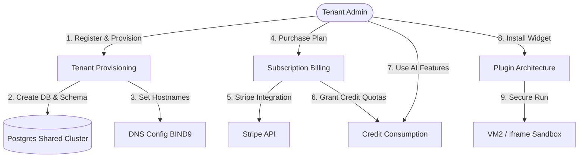

# SaaS Directory Overview

## Purpose
This directory contains the core documentation for the Software-as-a-Service (SaaS) operational modules of the NewsOps Cloud digital publishing platform. It serves as the architectural and implementation guide for tenant lifecycle management, automated provisioning, stripe-integrated billing, credit ledgers, and extensible sandboxed plugins.

## Executive Summary
NewsOps Cloud operates on a multi-tenant SaaS model designed to scale across thousands of distinct digital publishers. This directory is structured to cover the five major pillars of our SaaS platform layer:
1. **Directory Mapping (`index.md`)**: The root index detailing file locations and architectural scopes.
2. **Tenant Provisioning (`tenant_provisioning.md`)**: Dynamic multi-tenant setups including PostgreSQL schema generation, BIND9/Route53 DNS mapping, and directory partitioning.
3. **Subscription Billing (`subscription_billing.md`)**: Plan tiers (Free, Pro, Enterprise), Stripe billing engine, invoice aggregation, and automatic feature gating.
4. **Credit Ledger System (`credit_consumption.md`)**: High-throughput transaction ledger tracking AI processing costs, generation quotas, and automated replenishment.
5. **Plugin Architecture (`plugin_architecture.md`)**: Dynamic extensions using secure iframe and `vm2` Node.js sandboxing models to run user-developed publishing widgets.

## Vision
The vision of the NewsOps Cloud SaaS layer is to provide a self-service, infinitely scalable digital publishing ecosystem. A publisher should be able to register, configure their domain, select a subscription model, buy AI credits, and install third-party plugins in under 5 minutes without manual operations intervention.

## Scope
### Inside Scope
* Automated onboarding pipelines and dynamic database migrations.
* Stripe billing state sync and plan-based feature gating.
* Credit allocation, transaction ledger journaling, and billing check-outs.
* Sandbox lifecycles, event hooks, and secure communications protocols for external widgets.

### Outside Scope
* Core editorial WYSIWYG systems (covered in [editorial docs](../06-editorial/index.md)).
* Physical machine autoscaling (handled by Kubernetes HPA configurations).
* Payment gateway provider migrations (Stripe is hardcoded).

## Goals
* **Provisioning Velocity**: Tenant creation and database schema initialization in $< 15\text{ seconds}$.
* **Ledger Consistency**: Zero-loss ledger operations utilizing ACID-compliant transactional double-entry systems.
* **Webhook Reliability**: $99.99\%$ success rate on Stripe transaction syncing with dead-letter queue fallbacks.
* **Sandbox Security**: Complete physical isolation of third-party scripts to prevent server-side privilege escalation.

## Functional Requirements
* **Catalog Browsing**: System administrators must have a single directory view of SaaS states.
* **Feature Gating**: The routing layer must verify tenant active tiers (Free, Pro, Enterprise) on every request.
* **Ledger Inquiries**: Tenants must be able to view their real-time credit consumption history and balance.
* **Widget Lifecycle**: Admin users must be able to install, enable, disable, and uninstall plugins.

## Non-Functional Requirements
* **Audit Trail**: All SaaS administrative actions must be stored in a write-once audit log.
* **API Latency**: Tenant subscription verification must add less than 1ms to request-routing loops via Redis caches.
* **High Availability**: Billing systems must remain operational during temporary Stripe API outages through local queuing.

## Business Rules
* **No Credit, No AI**: AI features must be blocked immediately if a tenant's credit ledger balance reaches zero.
* **Delinquent Suspensions**: If a Stripe subscription payment fails and the grace period of 7 days expires, the tenant status must be set to `suspended`.
* **Plugin Approval**: Third-party plugins must be marked as `approved` by system administrators before they are active in the store.

## Actors
* **SaaS Platform Admin**: Manages global tenant lists, billing configurations, and approves plugins.
* **Tenant Owner**: Subscribes to plans, views invoices, and purchases credits.
* **System Scheduler**: Background cron service that updates quotas and monitors tenant statuses.

## User Stories
* **User Story 1**: As a SaaS Platform Admin, I want an index mapping of all SaaS sub-systems so that I can easily navigate the technical architectural documentation of NewsOps.
* **User Story 2**: As a Tenant Owner, I want to understand how credit consumption, billing, and provisioning tie together so that I can configure my newsroom operations safely.
* **User Story 3**: As a Systems Engineer, I want a single directory source of truth so that I can write unified deployment scripts matching these specs.

## Acceptance Criteria
* The directory structure must contain all 5 documented markdown files.
* Every module must reference the dynamic tenant context established in [multi_tenancy_architecture.md](../02-architecture/multi_tenancy_architecture.md).
* Every API must return standard JSON schemas.

## Workflows
Below is the relationship between the SaaS modules:

```
[ Tenant Provisioning ] ---> Generates database schema & folders
         |
         v
[ Subscription Billing ] ---> Activates tier configurations
         |
         v
[ Credit Consumption ] ---> Regulates AI operations & ledger entries
         |
         v
[ Plugin Architecture ] ---> Extends dynamic functionalities on site
```

## API Design
### Discovery API Endpoint
* **URL**: `/api/v1/saas/status`
* **Method**: `GET`
* **Headers**:
  * `Authorization: Bearer <JWT>`
* **Response Payload (200 OK)**:
```json
{
  "service": "NewsOps Cloud SaaS Gateway",
  "status": "operational",
  "version": "1.4.0",
  "modules": {
    "provisioning": { "status": "active", "db_driver": "postgresql_dynamic" },
    "billing": { "status": "active", "provider": "stripe_v3" },
    "credits": { "status": "active", "ledger_mode": "double_entry" },
    "plugins": { "status": "active", "runtime": "vm2_sandboxed" }
  }
}
```

## Database Design
This index file maps the collective database schemas across all SaaS features:
* **Admin Shared Database**: `tenants`, `subscriptions`, `plans`, `plugin_registry`.
* **Tenant Isolated Database**: `credit_transactions`, `plugin_installations`, `tenant_invoices`.

## UI Design
The SaaS navigation structure is mapped in the primary console:
* `/admin/saas/tenants` (Tenant List & Schema Migration Status)
* `/admin/saas/billing` (Subscription & Invoice Tracking)
* `/admin/saas/credits` (Real-time Ledger Logs & Adjustments)
* `/admin/saas/plugins` (Extension Marketplace & Approval Panel)

## Permissions
* `saas:read`: View SaaS settings and status.
* `saas:write`: Modify billing plans, tenant configurations, and plugins globally.

## Security
All requests going to the SaaS endpoints must be authenticated and checked for tenant identity parameters. There is strict parameter isolation between the administrative system operations and the tenant-scoped ledger/billing logs.

## Performance
* SaaS dashboard page loading time must not exceed 800ms.
* API Gateway validation caches in Redis must have a 99.9% read hit rate.

## Monitoring
* **Prometheus Metric**: `saas_module_health_status` (Gauge checking 1 for healthy, 0 for unhealthy for all SaaS modules).
* **Alert Trigger**: Trigger CRITICAL alert if `saas_module_health_status{module="credits"} == 0` for over 2 minutes.

## Logging
Logs are printed in structured JSON:
```json
{"timestamp":"2026-06-27T22:36:00Z","level":"INFO","context":"SAAS_INDEX","message":"SaaS discovery endpoint queried by admin ID admin_8871"}
```

## Error Handling
| Internal Error Code | HTTP Status | User Message |
|:---|:---|:---|
| `SAAS_OFFLINE` | 503 Service Unavailable | SaaS operations engine is temporarily offline. Please try again. |

## Edge Cases
* **Split-brain configurations**: If dynamic provisioning fails after database creation but before DNS updates, the onboarding transaction rolls back all steps via SAGA pattern to maintain clean directories.

## Future Improvements
* **Self-healing DNS Routing**: Dynamic redirection to secondary clusters during regional CDN outages.
* **Unified OAuth2 Tenant Gateway**: Cross-tenant secure identity federations.

## Mermaid Diagrams
### High-Level SaaS Systems Orchestration Flow


## References
* Tenancy Routing Layer: [multi_tenancy_architecture.md](../02-architecture/multi_tenancy_architecture.md)
* Shared Data Schemas: [storage_architecture.md](../02-architecture/storage_architecture.md)
* Service Topologies: [system_architecture.md](../02-architecture/system_architecture.md)
