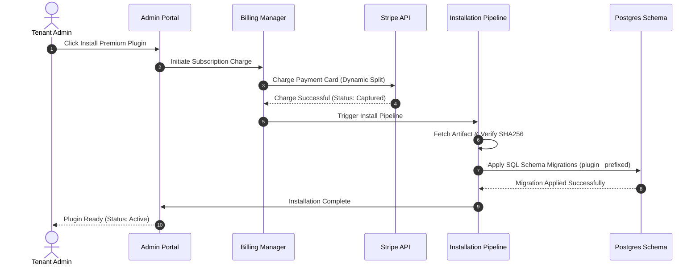

# Extension and Theme Marketplace

## Purpose
This document specifies the design, capabilities, and workflows of the NewsOps Cloud Extension and Theme Marketplace. It covers plugin listings, review and rating models, installation pipelines, and the SaaS billing and revenue-sharing mechanisms.

## Executive Summary
The NewsOps Cloud Marketplace is the central registry for discovering, installing, and billing extensions and visual themes. Built to run multi-tenant at scale, the marketplace provides mechanisms for developers to publish verified plugins, for tenants to subscribe to paid add-ons, and for the platform to securely install code and run database migrations. It incorporates automated revenue-split pipelines linked to Stripe Connect, ensuring seamless commercial settlements.

## Vision
To establish a self-sustaining ecosystem of publishers, developers, and designers. Future integrations will support autonomous security validation of code submissions, AI-assisted compatibility testing against dynamic customer environments, and automated tax reporting across global jurisdictions.

## Scope
This document covers:
- Core plugin registry, classification, and searching specifications.
- Review, rating, and spam-mitigation database models.
- Step-by-step plugin installation pipelines including checksum verification.
- Billing configurations, developer subscription management, and revenue sharing (Stripe Connect).

It does not cover local developer tooling (which is under [plugin_sdk.md](./plugin_sdk.md)) or CSS theme compilation details (which is under [theme_engine.md](./theme_engine.md)).

## Goals
- **Secure Provisioning**: Ensure that plugin installation is fully transaction-safe and rollback-ready.
- **Robust Spam Control**: Limit reviews to verified installations with automated sentiment/spam flagging.
- **Automated Payouts**: Distribute marketplace subscription revenue accurately between developers (80%) and the platform (20%) via Stripe Connect.
- **High Searchability**: Support sub-second search times for over 50,000 listed plugins and themes.

## Functional Requirements
- **Directory and Search**: The marketplace must categorize plugins (e.g., SEO, Analytics, Editors, Themes) and support tagging, search filters, and popularity sorting.
- **Review and Rating System**: Authenticated tenant administrators must be able to submit ratings (1-5 stars) and text reviews only for plugins currently or previously installed in their workspace.
- **Installation Orchestrator**: The system must run a automated download, validation, and schema migration pipeline upon user installation approval.
- **Revenue Splitting**: Integration with Stripe Connect must split subscription charges dynamically: 80% to the developer's registered account, 20% platform commission, minus Stripe processing fees.

## Non-Functional Requirements
- **Search Latency**: Search and filter queries under high load must return results in $< 150\text{ ms}$ (95th percentile).
- **Billing Sync SLA**: Payout splits and transaction state updates must reflect in the developer ledger within $2\text{ hours}$ of payment clearance.
- **Installation Rollback**: Installation failures must rollback all database schemas and configurations within $< 10\text{ s}$.

## Business Rules
- **Verified Purchase Only**: Ratings are strictly locked to tenant users who have an active or historical installation record of that specific plugin.
- **Developer Registration**: Developers must complete KYC/KYB validation via Stripe Connect before publishing paid plugins or themes.
- **Refund Window**: Subscription fees are subject to a 7-day refund policy, managed automatically by putting payouts in a "pending escrow" state for 7 days.

## Actors
- **SaaS Tenant Administrator**: Browses, installs, reviews, and pays for plugins.
- **Extension/Theme Developer**: Publishes extensions, monitors installations, and receives payout settlements.
- **Marketplace Moderator**: Reviews new plugin submissions for compliance and security guidelines.

## User Stories
- **User Story 1**: As a Tenant Administrator, I want to search for a "translation tool" plugin, filter by rating, and read verified reviews so that I can confidently select the best integration.
- **User Story 2**: As an Extension Developer, I want to publish a premium plugin at $29/month so that the platform processes payments, deducts its 20% share, and routes the remainder to my bank account automatically.
- **User Story 3**: As a Tenant Administrator, I want to trigger a plugin installation so that the system downloads the signed package, runs verification checks, and executes database migrations automatically.

## Acceptance Criteria
- Review creation must fail with a `403 Forbidden` error if the tenant ID does not have a matching `tenant_plugin_installations` record.
- The installation pipeline must abort and perform a complete schema rollback if any individual table creation SQL command fails.
- Payout triggers must calculate the developer split exactly: $Payout = (\text{ChargeAmount} - \text{StripeFees}) \times 0.80$, throwing errors on arithmetic discrepancies $> \$0.01$.

## Workflows
### Plugin Installation Pipeline
1. **Purchase/Install Command**: Tenant Admin clicks "Install" on a marketplace listing.
2. **Entitlement Check**: Billing service verifies payment status (free or successful charge capture).
3. **Artifact Retrieval**: Pipeline fetches the plugin archive (`.tar.gz`) from the secure S3 release bucket.
4. **Checksum Verification**: Pipeline compares the downloaded file's SHA-256 hash against the registry signature.
5. **Code Scanning**: Automated AST scans run in the background to ensure no forbidden operations are injected.
6. **Schema Migration**: The host executes SQL migration scripts targeting the specific tenant's schema space.
7. **Isolate Provisioning**: The plugin is registered inside the tenant's execution map, triggering the `onInstall` hook.
8. **Activation State**: The plugin is marked as `active` in the tenant's workspace catalog, ready for use.

## API Design
### Marketplace Registry and Review API

#### 1. List Plugins
* **URL**: `/api/v1/marketplace/plugins`
* **Method**: `GET`
* **Query Parameters**:
  * `category`: `seo` | `analytics` | `theme` | `editor`
  * `search`: `string`
  * `page`: `1`
  * `limit`: `20`
* **Response Payload (200 OK)**:
```json
{
  "plugins": [
    {
      "pluginId": "com.newsops.ai-seo",
      "name": "AI SEO Optimizer",
      "version": "1.2.4",
      "rating": 4.8,
      "reviewCount": 142,
      "priceMonthly": 19.99,
      "developerName": "AI Publishing Labs",
      "tags": ["seo", "ai", "editorial"]
    }
  ],
  "pagination": {
    "total": 1,
    "page": 1,
    "limit": 20
  }
}
```

#### 2. Submit Review
* **URL**: `/api/v1/marketplace/plugins/:pluginId/reviews`
* **Method**: `POST`
* **Headers**:
  * `Authorization: Bearer <TENANT_JWT>`
* **Request Payload**:
```json
{
  "rating": 5,
  "comment": "Outstanding dynamic SEO suggestions. Dramatically cut down editing workflows."
}
```
* **Response Payload (201 Created)**:
```json
{
  "reviewId": "f7a372cc-618d-4be9-9d51-40be6d3027b1",
  "pluginId": "com.newsops.ai-seo",
  "rating": 5,
  "comment": "Outstanding dynamic SEO suggestions. Dramatically cut down editing workflows.",
  "isVerifiedInstall": true,
  "createdAt": "2026-06-27T22:30:00Z"
}
```

#### 3. Trigger Installation
* **URL**: `/api/v1/marketplace/plugins/:pluginId/install`
* **Method**: `POST`
* **Headers**:
  * `Authorization: Bearer <TENANT_JWT>`
* **Response Payload (202 Accepted)**:
```json
{
  "installationId": "a7b8c9d0-1234-5678-abcd-ef0123456789",
  "status": "processing",
  "message": "Plugin installation initiated. Database migration running."
}
```

## Database Design
These tables reside in the shared administrative database instance to manage global states:

### Table: `marketplace_plugins`
| Field Name | Data Type | Constraints | Description |
|:---|:---|:---|:---|
| `plugin_id` | VARCHAR(128) | PRIMARY KEY | Unique namespace identifier |
| `name` | VARCHAR(255) | NOT NULL | Human-readable name |
| `type` | VARCHAR(32) | NOT NULL | `extension` or `theme` |
| `developer_id` | UUID | NOT NULL, FK to developers | Owner reference |
| `price_monthly` | NUMERIC(10,2) | DEFAULT 0.00 | Subscription pricing |
| `archive_url` | VARCHAR(512) | NOT NULL | Path to package archive in S3 |
| `sha256_hash` | VARCHAR(64) | NOT NULL | SHA-256 for validation |
| `is_verified` | BOOLEAN | DEFAULT FALSE | Security check passing indicator |

### Table: `marketplace_reviews`
| Field Name | Data Type | Constraints | Description |
|:---|:---|:---|:---|
| `review_id` | UUID | PRIMARY KEY, DEFAULT gen_random_uuid() | Unique ID |
| `plugin_id` | VARCHAR(128) | NOT NULL, FK to marketplace_plugins | Target plugin |
| `tenant_id` | VARCHAR(64) | NOT NULL, FK to tenants | Submitting tenant |
| `rating` | SMALLINT | CHECK (rating >= 1 AND rating <= 5) | Star rating |
| `comment` | TEXT | NOT NULL | Text evaluation |
| `is_verified_install` | BOOLEAN | DEFAULT TRUE | Verified install validation |
| `created_at` | TIMESTAMP | DEFAULT NOW() | Record creation date |

### Table: `marketplace_billing_ledgers`
| Field Name | Data Type | Constraints | Description |
|:---|:---|:---|:---|
| `transaction_id` | UUID | PRIMARY KEY | Unique ledger entry |
| `tenant_id` | VARCHAR(64) | NOT NULL | Payer reference |
| `plugin_id` | VARCHAR(128) | NOT NULL | Purchased plugin |
| `stripe_charge_id` | VARCHAR(128) | UNIQUE | Stripe transaction reference |
| `amount` | NUMERIC(10,2) | NOT NULL | Total charged amount |
| `stripe_fee` | NUMERIC(10,2) | NOT NULL | Network transaction fee |
| `developer_payout` | NUMERIC(10,2) | NOT NULL | 80% split target |
| `platform_commission`| NUMERIC(10,2) | NOT NULL | 20% commission |
| `payout_status` | VARCHAR(32) | DEFAULT 'escrow' | `escrow`, `paid`, `refunded` |
| `settled_at` | TIMESTAMP | NULL | Date transferred to developer |

Indexes:
- `idx_review_plugin_search`: (`plugin_id`, `rating`)
- `idx_billing_payout_status`: (`payout_status`, `settled_at`)

## UI Design
The Marketplace Dashboard in the Tenant Control Panel features:
- **Grid Layout Explorer**: Features clear categorizations, query filters, search fields, and quick-install action buttons.
- **Plugin Detail View**: Shows detailed feature guides, developer contacts, pricing models, verified review lists, and current installation status.
- **Developer Payout Console**: For registered developers, showing monthly recurring revenue (MRR), total active installs, ledger list, and Stripe Connect status.

## Permissions
- `marketplace:browse`: Read access to view directory list and review tables.
- `marketplace:install`: Trigger installation pipeline inside own tenant workspace.
- `marketplace:review`: Add rating and comment on installed extensions.
- `marketplace:developer:write`: Publish or update plugins on the marketplace registry.

## Security
- **Archive Verification**: The installation pipeline verifies SHA-256 integrity checks, rejecting any package mismatching the registered hash.
- **Token Scope Isolation**: When installations trigger migrations, database connection credentials are dynamically scoped using temporary schema roles containing only execution rights within that single tenant's schema space.
- **Review Spoofing Protection**: Verification queries are executed before posting ratings to ensure the tenant's installation record is active or was run for at least 72 hours, blocking rapid script-based review creation.

## Performance
- **Registry Caching**: The marketplace search and directories are cached in Redis with a TTL of 1 hour, maintaining sub-10ms response times.
- **S3 Download Streams**: Files are streamed directly from S3 to memory structures, preventing temporary storage load spikes on application servers.
- **Target Operations**: The system must sustain $100$ concurrent installation pipelines without degrading main editorial systems.

## Monitoring
- **Prometheus Metric**: `marketplace_installations_total` (Counter tracking installation events by status `success` or `failed`).
- **Prometheus Metric**: `marketplace_transaction_revenue_usd` (Counter tracking total transaction value cleared).
- **Alert Trigger**: Trigger Slack alerts if `rate(marketplace_installations_total{status="failed"}[10m]) > 3`, indicating potential deployment or schema script issues.

## Logging
Detailed logs are written with context:
* **Log Pattern**: `{"timestamp": "%ISO8601%", "tenant_id": "%TENANT%", "plugin_id": "%PLUGIN%", "action": "INSTALL_PIPELINE", "step": "%STEP%", "status": "%STATUS%"}`
* **Error Logs**: Contain full rollback traces in case of schema execution issues.

## Error Handling
| Internal Marketplace Error | HTTP Status | Customer-Facing Action |
|:---|:---|:---|
| `PaymentFailedException` | 402 Payment Required | Subscription charge failed. Please update payment credentials. |
| `ChecksumMismatchException` | 502 Bad Gateway | The downloaded plugin package failed integrity checks. Please retry. |
| `MigrationFailedException` | 500 Internal Error | Database changes failed to apply. Installation was safely rolled back. |
| `ReviewForbiddenException` | 403 Forbidden | You must install and test this plugin before writing a review. |

## Edge Cases
- **Stripe Webhook Delays**: If a tenant installs a plugin but the payment webhook is delayed, the installation pipeline remains in a `pending_payment` status and transitions to active once the Stripe event is captured.
- **Concurrent Upgrade Commands**: If multiple updates are triggered simultaneously, an application lock (distributed via Redis locks) blocks redundant workflows on the same plugin instance.

## Future Improvements
- **Security Dependency Scanner**: Integrate Snyk or npm audit directly into the publishing pipeline to automatically block developers from importing vulnerable dependencies.
- **Canary Plugin Rollouts**: Support canary testing, enabling administrators to roll out plugin updates to only 5% of their site readers before completing global system updates.

## Mermaid Diagrams
### Plugin Installation & Billing Sequence


## References
- Multi-Tenancy Architecture: [multi_tenancy_architecture.md](../02-architecture/multi_tenancy_architecture.md)
- Plugin SDK Design: [plugin_sdk.md](./plugin_sdk.md)
- Dynamic Theme Engine: [theme_engine.md](./theme_engine.md)
