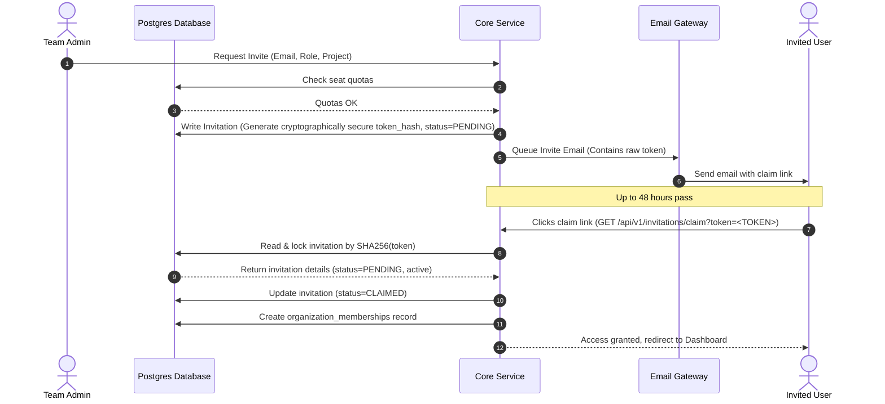

# Organization Management
## Purpose
This document specifies the configurations, technical workflows, and data models for managing tenant-level organizations, secure user invitation flows, custom project domain/namespace mappings, and flexible organization metadata schemas within the NewsOps Cloud digital publishing platform.

## Executive Summary
The NewsOps Cloud platform uses a multi-tenant model where users belong to one or more organizations. This file details how organization boundaries are managed, how team administrators issue and validate cryptographically secure invitations, how custom domains and project mappings route traffic to the appropriate tenant namespaces, and how arbitrary metadata schemas are defined and validated. Together, these systems establish the foundation for secure collaboration, white-labeling, and tenant partitioning.

## Vision
To provide a friction-free, secure, and highly customizable organizational framework that enables media enterprises, editorial teams, and independent creators to instantly configure their workspaces, onboard team members safely, white-label their delivery pipelines, and extend system behavior via dynamic, schema-verified metadata.

## Scope
The scope of this document covers:
- **User Invitation Loops**: Tokenized invite workflows with role enforcement (Owner, Admin, Editor, Contributor, Guest) and automatic expiration.
- **Custom Project Mappings**: Routing mapping structures that connect custom hostnames (vanity domains) to tenant project namespaces.
- **Organization Metadata Schemas**: JSON Schema-based dynamic validation for custom organization attributes, system integrations, and branding variables.
- **RBAC Integrations**: Defining standard tenant permissions and synchronization of user context across organizations.

## Goals
1. Establish a cryptographically secure, invitation-based onboarding loop with zero reliance on manual user creation by admins.
2. Resolve custom domain-to-tenant routing mapping in less than 5ms at the API gateway layer.
3. Enable dynamic organization metadata extension using PostgreSQL `jsonb` storage without database migration overhead.
4. Enforce strict role-based access control (RBAC) boundaries during cross-tenant membership validation.

## Functional Requirements
- **Secure Invitation Cycle**:
  - Admins can create invitations containing target email, organization role, and project scopes.
  - The system must generate a 64-character hexadecimal, one-time invitation token.
  - The system must dispatch an email with a secure link (expiring in 48 hours).
  - Inviting a user that already exists must link their existing user account to the new organization.
- **Custom Vanity Domains & Project Mappings**:
  - Tenants can bind custom domains (e.g., `editorial.newspaper.com`) to specific project namespaces.
  - The system must generate unique DNS TXT verification challenges (e.g., `newsops-verification=txt_abc123`).
  - A background process must verify DNS TXT record matching before traffic routing is activated.
- **Dynamic Metadata Validation**:
  - The system must store unstructured organizational metadata (branding colors, logo URLs, custom policy switches) in a JSON document.
  - The system must validate custom metadata against a configurable JSON schema before saving.

## Non-Functional Requirements
- **Performance**: Invitation validation must complete under 150ms.
- **Scalability**: Domain routing maps must scale to support 100,000 active domain mappings, loaded into gateway memory caches.
- **Availability**: The DNS verification worker must check pending domains every 15 minutes.
- **Consistency**: Metadata schema updates must trigger immediate cache invalidation across all application instances.

## Business Rules
1. **Token Lifetime**: Invitation links are valid for exactly 48 hours. Expired links are marked as `EXPIRED` in the database and cannot be consumed.
2. **DNS Validation Check**: A custom domain will not route traffic unless the DNS TXT record matches the challenge token exactly.
3. **Role Limits**: An organization must have exactly one user assigned as the `Owner` role. Administrative actions can transfer this role but cannot delete it.
4. **Metadata Constraint**: The metadata JSON document is limited to a maximum size of 64KB per organization to prevent abuse.

## Actors
- **Organization Owner**: The primary billing contact and ultimate authority. Can assign roles, manage custom domains, and configure metadata schemas.
- **Organization Administrator**: Manages daily operations including inviting team members, editing roles, and mapping projects.
- **Invitee**: A user (new or existing) who receives an invitation email and completes the verification loop.
- **API Gateway Router**: An automated component that reads the inbound host header and maps it to the tenant organization context.

## User Stories
### Story 1: Onboarding an External Editor
As an **Organization Administrator**, I want to invite an external editor to our organization with a "Contributor" role restricted to the "World News" project, so that they can draft articles without viewing our billing configurations or other project sections.

### Story 2: Mapping a Custom Domain
As an **Organization Owner**, I want to map our custom vanity domain `news.dailygazette.com` to our "Daily Gazette" workspace project, so that our audience and writers access the white-labeled portal directly under our brand.

### Story 3: Storing and Validating Custom Editorial Brand Data
As an **Organization Administrator**, I want to define a custom metadata JSON schema requiring a primary branding color and a logo URL, so that our writers' dashboards are rendered with correct brand attributes and validation errors occur if invalid color formats are saved.

## Acceptance Criteria
1. **Invitation Expiration Gate**: When an invitee clicks an invite token after 48 hours, the system must return an HTTP `410 Gone` status and mark the status in the database as `EXPIRED`.
2. **Domain Route Verification**: The API Gateway must return an HTTP `404 Not Found` for any unverified domain mapping until the DNS TXT challenge returns a match and the database updates `is_verified = true`.
3. **Metadata Schema Enforcement**: If a client submits a metadata update missing the required fields specified in the organization's schema definition, the server must reject the payload with HTTP `422 Unprocessable Entity` listing the validation errors.
4. **Single Owner Rule**: An attempt to set a second user's role to `Owner` without performing the formal ownership transfer API flow must return HTTP `409 Conflict`.

## Workflows
### 1. User Invitation Loop
```
[Admin Page] 
   |-- 1. Submits email, role, and project mappings
   v
[SaaS Core Engine]
   |-- 2. Checks organization seat quota limits
   |-- 3. Generates secure invitation record, token = SHA256(RandomBytes + Secret)
   |-- 4. Dispatches email via SendGrid with link: https://newsops.com/invites/claim?token=<TOKEN>
   v
[Invitee Client]
   |-- 5. Clicks link; sends token to backend
   |-- 6. Backend validates token status and expiration (must be < 48 hours)
   |-- 7. If valid:
          |-- User creates password or logs in
          |-- Membership record is committed to Postgres
          |-- Token marked as CLAIMED
          |-- Redis auth cache is cleared
```

### 2. Custom Domain Verification Loop
```
[User Interface]
   |-- 1. Inputs custom domain (e.g. news.gazette.com)
   v
[API Gateway / Core]
   |-- 2. Generates DNS TXT record challenge: newsops-verification-token=txt_9920194812301
   |-- 3. Instructs user to create DNS record
   v
[DNS Challenge Cron Worker]
   |-- 4. Runs every 15 minutes, queries DNS TXT records for news.gazette.com
   |-- 5. Checks if returned value matches challenge token
   |-- 6. On match:
          |-- Updates database setting project_mappings.is_verified = true
          |-- Pushes routing update to API Gateway memory cache (Redis cluster)
```

## API Design

### 1. Create Organization Invitation
Generates an invitation token and dispatches an invite email.
- **Endpoint**: `POST /api/v1/organizations/{org_id}/invitations`
- **Headers**:
  - `Authorization: Bearer <JWT>`
  - `Content-Type: application/json`
- **Request Payload**:
  ```json
  {
    "email": "editor.external@independent.org",
    "role": "EDITOR",
    "project_id": "proj_a1b2c3d4-e5f6-7a8b-9c0d-1e2f3a4b5c6d",
    "metadata": {
      "department": "International Desk",
      "max_drafts_per_day": 5
    }
  }
  ```
- **Response Payload (`201 Created`)**:
  ```json
  {
    "invitation_id": "inv_9981245-a",
    "email": "editor.external@independent.org",
    "role": "EDITOR",
    "token_preview": "sha256_ab819...99a",
    "expires_at": "2026-06-29T22:35:57Z",
    "status": "PENDING"
  }
  ```

### 2. Process / Claim Invitation
Consumes an invitation token and links the user's account to the organization.
- **Endpoint**: `POST /api/v1/invitations/accept`
- **Request Payload**:
  ```json
  {
    "token": "ab81928374ba91823791a823cbd918a23019ab9213efcb91a823b1239841da99",
    "password": "SecurePassword123!",
    "full_name": "Jane Doe"
  }
  ```
- **Response Payload (`200 OK`)**:
  ```json
  {
    "user_id": "usr_7718290-d",
    "organization_id": "org_4410294-a",
    "membership_id": "memb_123901-b",
    "role": "EDITOR",
    "status": "ACTIVE"
  }
  ```

### 3. Create Custom Domain Mapping
Initiates mapping of a custom domain to a specific project.
- **Endpoint**: `POST /api/v1/organizations/{org_id}/project-mappings`
- **Request Payload**:
  ```json
  {
    "project_id": "proj_a1b2c3d4-e5f6-7a8b-9c0d-1e2f3a4b5c6d",
    "custom_domain": "editorial.dailygazette.com"
  }
  ```
- **Response Payload (`201 Created`)**:
  ```json
  {
    "mapping_id": "map_9918231-k",
    "custom_domain": "editorial.dailygazette.com",
    "dns_txt_record_host": "_newsops-challenge.editorial.dailygazette.com",
    "dns_txt_record_value": "newsops-verification-token=challenge_f89102830ad1",
    "is_verified": false
  }
  ```

### 4. Update Organization Metadata
Saves branding and operational configurations validated by the metadata schema.
- **Endpoint**: `PUT /api/v1/organizations/{org_id}/metadata`
- **Request Payload**:
  ```json
  {
    "branding": {
      "primary_color": "#1A2B3C",
      "logo_url": "https://cdn.dailygazette.com/assets/logo.png",
      "favicon_url": "https://cdn.dailygazette.com/assets/favicon.ico"
    },
    "editorial_policy": {
      "require_two_factor_auth_to_publish": true,
      "auto_archive_days": 180
    }
  }
  ```
- **Response Payload (`200 OK`)**:
  ```json
  {
    "organization_id": "org_4410294-a",
    "updated_at": "2026-06-27T22:35:57Z",
    "metadata": {
      "branding": {
        "primary_color": "#1A2B3C",
        "logo_url": "https://cdn.dailygazette.com/assets/logo.png",
        "favicon_url": "https://cdn.dailygazette.com/assets/favicon.ico"
      },
      "editorial_policy": {
        "require_two_factor_auth_to_publish": true,
        "auto_archive_days": 180
      }
    }
  }
  ```

## Database Design
```sql
-- Core organizations table
CREATE TABLE tenant_organizations (
    id UUID PRIMARY KEY DEFAULT gen_random_uuid(),
    name VARCHAR(255) NOT NULL,
    subdomain_namespace VARCHAR(100) UNIQUE NOT NULL, -- e.g. 'gazette' for 'gazette.newsops.co'
    metadata JSONB NOT NULL DEFAULT '{}'::jsonb,
    metadata_schema JSONB NOT NULL DEFAULT '{}'::jsonb,
    created_at TIMESTAMP WITH TIME ZONE DEFAULT CURRENT_TIMESTAMP,
    updated_at TIMESTAMP WITH TIME ZONE DEFAULT CURRENT_TIMESTAMP
);

CREATE INDEX idx_tenant_orgs_subdomain ON tenant_organizations(subdomain_namespace);

-- Organization memberships (RBAC linking users to organizations)
CREATE TABLE organization_memberships (
    id UUID PRIMARY KEY DEFAULT gen_random_uuid(),
    organization_id UUID NOT NULL REFERENCES tenant_organizations(id) ON DELETE CASCADE,
    user_id UUID NOT NULL, -- References global users table (auth service)
    role VARCHAR(50) NOT NULL CHECK (role IN ('OWNER', 'ADMIN', 'EDITOR', 'CONTRIBUTOR', 'GUEST')),
    status VARCHAR(50) NOT NULL DEFAULT 'ACTIVE', -- ACTIVE, SUSPENDED, DELETED
    created_at TIMESTAMP WITH TIME ZONE DEFAULT CURRENT_TIMESTAMP,
    updated_at TIMESTAMP WITH TIME ZONE DEFAULT CURRENT_TIMESTAMP,
    UNIQUE(organization_id, user_id)
);

CREATE INDEX idx_org_memberships_user ON organization_memberships(user_id);
CREATE INDEX idx_org_memberships_org ON organization_memberships(organization_id);

-- Invitations tracking pending join requests
CREATE TABLE organization_invitations (
    id UUID PRIMARY KEY DEFAULT gen_random_uuid(),
    organization_id UUID NOT NULL REFERENCES tenant_organizations(id) ON DELETE CASCADE,
    email VARCHAR(255) NOT NULL,
    role VARCHAR(50) NOT NULL CHECK (role IN ('OWNER', 'ADMIN', 'EDITOR', 'CONTRIBUTOR', 'GUEST')),
    project_id UUID, -- Optional project scoping mapping
    token_hash VARCHAR(64) UNIQUE NOT NULL, -- SHA-256 hash of random invite token
    status VARCHAR(50) NOT NULL DEFAULT 'PENDING', -- PENDING, CLAIMED, EXPIRED, REVOKED
    invited_by UUID NOT NULL, -- User who sent invite
    invited_at TIMESTAMP WITH TIME ZONE DEFAULT CURRENT_TIMESTAMP,
    expires_at TIMESTAMP WITH TIME ZONE NOT NULL,
    metadata JSONB NOT NULL DEFAULT '{}'::jsonb
);

CREATE INDEX idx_org_invitations_token ON organization_invitations(token_hash);
CREATE INDEX idx_org_invitations_email ON organization_invitations(email);

-- Custom vanity domain and project mappings
CREATE TABLE project_mappings (
    id UUID PRIMARY KEY DEFAULT gen_random_uuid(),
    organization_id UUID NOT NULL REFERENCES tenant_organizations(id) ON DELETE CASCADE,
    project_id UUID NOT NULL, -- References organization sub-project
    custom_domain VARCHAR(255) UNIQUE NOT NULL, -- e.g., 'editorial.dailygazette.com'
    dns_challenge_token VARCHAR(255) NOT NULL,
    is_verified BOOLEAN NOT NULL DEFAULT FALSE,
    verified_at TIMESTAMP WITH TIME ZONE,
    created_at TIMESTAMP WITH TIME ZONE DEFAULT CURRENT_TIMESTAMP,
    updated_at TIMESTAMP WITH TIME ZONE DEFAULT CURRENT_TIMESTAMP
);

CREATE INDEX idx_project_mappings_domain ON project_mappings(custom_domain);
CREATE INDEX idx_project_mappings_org ON project_mappings(organization_id);
```

## UI Design
The SaaS interface exposes organization administrative tools through clean, tabular screens:
1. **Team Directory Grid**:
   - Lists active members with their profiles (Name, Email, Role).
   - Contains a role drop-down selection (restricted based on the current user's privileges).
   - "Invite Team Member" button triggers a modal with inputs for Email, Role Selection, and Project Access scopes.
2. **Domain Mapping Configurations**:
   - A list containing mapped custom domains, displaying their status (Verified/Unverified).
   - Clicking an unverified domain opens a helper modal containing the generated TXT Host and Value parameters, along with a "Verify DNS Now" trigger.
3. **Metadata Schema Editor**:
   - A split screen showing the current Metadata JSON values on the left and the Organization validation schema editor (JSON Schema format) on the right, including inline syntax linting.

## Permissions
- `organizations:read`: View organizational configuration, metadata, and custom domains.
- `organizations:write`: Modify metadata, name, and namespaces.
- `invitations:create`: Send email invitations to new team members.
- `invitations:delete`: Revoke active, unconsumed invitations.
- `domains:manage`: Create, delete, and trigger verification of custom project domains.
- `roles:update`: Modify roles of organization memberships.

## Security
- **Secure Tokens**: Invitation tokens are generated using a cryptographically secure pseudo-random number generator (CSPRNG). The raw token is sent to the user, and only its SHA-256 hash is stored in the database to prevent database-compromise token abuse.
- **Host Header Validation**: To prevent cache poisoning and routing injection, the API Gateway matches inbound request host headers against a strict whitelist of active and verified mappings from the database/cache.
- **Dynamic Input Validation**: All custom metadata changes must execute against JSON Schema draft-07 validations using a strict backend library (e.g., AJV for Node.js or jsonschema for Python) to block script injection or database bloat payloads.

## Performance
- **Gateway Caching**: Verified domain-to-tenant mappings are cached in Redis under the key prefix `domain:routing:{domain}` with a TTL of 1 hour, auto-invalidated on mapping updates.
- **Database Indexing**: Composite indexes are placed on tables like `organization_memberships(organization_id, user_id)` and `organization_invitations(token_hash)` to keep queries running in sub-5ms ranges.
- **Invite Token Resolution**: Resolving and validating active invitation tokens takes less than 50ms using optimized index scans on `token_hash`.

## Monitoring
### Prometheus Metrics
- `newsops_org_invites_sent_total`: Counter tracking total invitations dispatched.
- `newsops_org_invites_accepted_total`: Counter tracking successful sign-ups via invite links.
- `newsops_domain_verification_duration_seconds`: Histogram tracking runtime of the DNS verification cron loops.
- `newsops_metadata_validation_failures_total`: Counter tracking how many metadata updates were blocked by schema failures.

### Alerting Rules
- **DNSCronFailures**: Alert if DNS verification cron does not execute for more than 30 consecutive minutes.
- **AbnormalInviteRejections**: Alert if `newsops_metadata_validation_failures_total` spikes over 50 failures in 10 minutes.

## Logging
- **Log Format**: Structured JSON payload.
- **Log Levels**:
  - `INFO`: Invite sent, invite claimed, domain mapping requested, domain verified.
  - `WARN`: Expiry limits reached on checked invite tokens, validation warnings.
  - `ERROR`: System DNS queries timeout, validation exceptions.
- **Log Context**: Includes `organization_id`, `invite_id`, `custom_domain`, `target_role`, and `operator_user_id`.

## Error Handling
| Input/System Error Code | HTTP Status | Customer-Facing Message |
271: | `INVITATION_EXPIRED` | 410 Gone | "This invitation link has expired. Please request a new invite from your administrator." |
272: | `INVITATION_ALREADY_CLAIMED` | 400 Bad Request | "This invitation has already been claimed." |
273: | `DOMAIN_VERIFICATION_FAILED` | 422 Unprocessable | "DNS TXT record matching challenge token could not be found. Please check your DNS propagation." |
274: | `METADATA_SCHEMA_VALIDATION_FAILED` | 422 Unprocessable | "Your organization settings do not conform to the required schema: {details}" |

## Edge Cases
- **Concurrent Invite Claims**: If an invitee double-clicks or double-submits the claim API, the transactional lock on `organization_invitations` updates the row to `CLAIMED` and forces subsequent threads to fail with `INVITATION_ALREADY_CLAIMED` instead of creating duplicate memberships.
- **Domain Hijacking**: An attacker could map a domain owned by another tenant. To resolve this, domain verification requires generating a unique challenge token tied to the specific tenant ID, ensuring that only the entity controlling the DNS settings can authorize routing.
- **SSO Override**: If an organization configures single-sign-on (SSO), any invitation claimed must bypass standard password creation and redirect to the tenant IDP (Identity Provider) flow.

## Future Improvements
1. **Dynamic SSO Self-Provisioning**: Allow organizations to self-map SAML and OpenID Connect profiles through the metadata schema configurations.
2. **ACME Automated Certificates**: Programmatically issue Let's Encrypt SSL/TLS certificates automatically as soon as custom domain verification completes.
3. **Audit Trail History**: Keep a version history of organization metadata changes inside a structured ledger for compliance review.

## Mermaid Diagrams


## References
- Database Identity and Org Schemas: [../03-database/identity_and_org_schema.md](../03-database/identity_and_org_schema.md)
- SaaS Tenant Tiering Limits: [../01-business/tenant_tiering_model.md](../01-business/tenant_tiering_model.md)
- Tenant Lifecycle Controls: [../08-saas/tenant_lifecycle.md](../08-saas/tenant_lifecycle.md)
- Storage Architecture Partitioning: [../02-architecture/storage_architecture.md](../02-architecture/storage_architecture.md)
