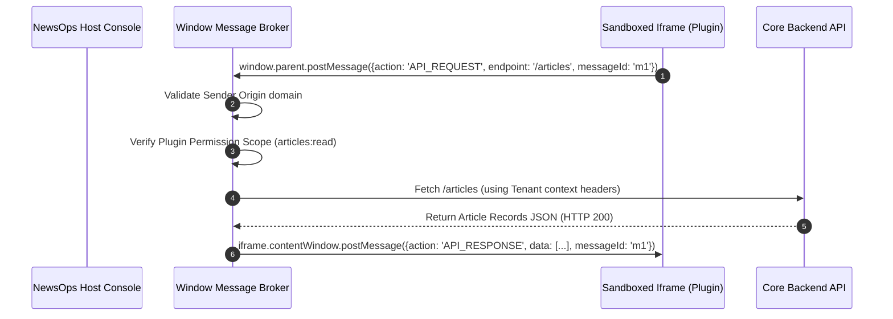

# Plugin Architecture

## Purpose
This document specifies the technical design, security controls, and runtime integration of the Extensible Plugin Engine in the NewsOps Cloud platform. It guides developers and engineers on how third-party plugins are securely sandboxed, registered, and executed across frontend and backend boundaries.

## Executive Summary
To enable publishers to extend their editorial workspaces without compromising core platform security, NewsOps Cloud implements a dual-layer sandboxing model. Frontend editor plugins are loaded inside highly restricted HTML5 `iframe` wrappers communicating via a secure `postMessage` protocol. Backend automation tasks are executed inside isolated Node.js context boundaries using the `vm2` sandboxing framework. Both pathways utilize an event-driven hook system to interact with platform state changes.

## Vision
The goal of the NewsOps Cloud plugin system is to create a vibrant, safe, and performant extension ecosystem. Publishers must be able to customize their editorial workflow, integrate custom analytics, and automate social distribution using third-party modules with zero risk of database cross-tenant exposure or server resource exhaustion.

## Scope
### In-Scope
* Frontend sandboxing specifications utilizing HTML5 `iframe` security features.
* Backend sandboxing architectures based on secure Node.js `vm2` runtimes.
* Lifecycle management states (Draft, Submitted, Approved, Installed, Active).
* Real-time event-driven hook registrations and payload structures.
* Cross-origin communication protocols and bridge SDK interfaces.

### Out-of-Scope
* The visual layout styling of individual third-party plugins.
* Deployment pipelines of plugins hosted on external developer servers.

## Goals
* **Absolute Isolation**: Block access from sandboxes to parent window DOMs, browser local storage, host network file systems, and system environment variables.
* **Low Startup Overhead**: Initialize backend sandbox environments in $< 50\text{ ms}$.
* **Strict Execution Caps**: Terminate any backend sandboxed script running for more than $2,000\text{ ms}$ or exceeding $128\text{ MB}$ of memory allocation.
* **Verification Rate**: Support real-time dynamic callback delivery to installed hooks under $15\text{ ms}$ routing latency.

## Functional Requirements
* **Manifest Parsing**: Automatically read, parse, and validate `manifest.json` definitions.
* **Hook Registry**: Bind plugin callbacks to key platform events (e.g., `article.publish.before`, `user.login.after`).
* **Message Bridge**: Provide an SDK for frontend plugins to make secure API requests through host proxy methods.
* **State Management**: Expose admin interfaces to install, activate, pause, or remove plugins.
* **Log Ingress**: Capture and route stdout/stderr streams from sandboxed executions back to tenant admin panels.

## Non-Functional Requirements
* **Runtime Sandbox Containment**: Ensure sandbox escapes are impossible by restricting access to standard Node variables (`process`, `require`, `module`).
* **Storage Allocation**: Restrict plugins to a maximum of 5MB local client storage allocations.
* **Network Restrictions**: Frontend sandboxes must not run network requests directly; all operations must leverage the parent's message broker.

## Business Rules
* **Permission Manifest Declarations**: Plugins must explicitly declare requested permissions (e.g. `articles:read`, `users:read`) inside their `manifest.json`. Access to undeclared permissions is blocked.
* **Admin Verification**: All plugins uploaded to the marketplace must remain in a `submitted` state until reviewed and signed by a platform administrator.
* **Tenant Scoping**: A plugin execution can only read and write data mapped within the active request's resolved tenant schema.

## Actors
* **Plugin Developer**: Writes code, designs the plugin manifest, and uploads extensions.
* **Tenant Admin**: Installs, configures, and monitors plugins for their specific newsroom.
* **Sandbox Supervisor Service**: Internal Node process monitor that boots, runs, and terminates VM contexts.
* **Editorial Editor**: Interacts with the sandboxed widgets loaded within the editing dashboard.

## User Stories
* **User Story 1**: As a Plugin Developer, I want to register a plugin that intercepts the `article.save.before` event so that I can automatically scan content for spelling errors before committing to the DB.
* **User Story 2**: As a Tenant Admin, I want to download a translation helper widget from the marketplace so that our editors can translate stories, while knowing the widget cannot read other editor profiles.
* **User Story 3**: As a Sandbox Supervisor Service, I want to terminate a backend script that enters an infinite loop so that it does not exhaust the physical CPU resources of our API servers.

## Acceptance Criteria
* Frontend iframe elements must enforce the attributes: `sandbox="allow-scripts"` (without `allow-same-origin`, `allow-top-navigation`, or `allow-popups`).
* Backend dynamic VM execution must timeout and throw an exception if execution exceeds 2,000ms.
* API calls made by plugins must be authenticated using short-lived tokens restricted exclusively to the plugin's manifest scope.
* Log messages generated in sandboxes must be mapped with `plugin_id` and `tenant_id` tags.

## Workflows
### Event Hook Execution Workflow
1. **Action Event Triggered**: An editor clicks "Publish" on an article.
2. **Hook Verification**: The event processor checks for active plugins listening to `article.publish.before` for this tenant.
3. **Payload Construction**: The system structures the article details into a standardized JSON payload.
4. **Sandbox Initialization**: The Sandbox Supervisor instantiates a `vm2` Node context, loading the plugin's script bundle.
5. **Execution**: The payload is injected, and the sandboxed code runs.
6. **Result Capture**: The script returns a modified article payload (e.g., adding automated SEO tags).
7. **Timeout Safeguard**: If the VM runs for $> 2000\text{ ms}$, the supervisor halts the thread, logs an timeout error, and continues the publication process using the original data.

## API Design
### Register Plugin Manifest
* **URL**: `/api/v1/plugins/register`
* **Method**: `POST`
* **Headers**:
  * `Authorization: Bearer <DEVELOPER_JWT>`
* **Request Payload**:
```json
{
  "name": "SEO Analyzer",
  "version": "1.0.4",
  "manifestUrl": "https://cdn.dev-plugins.com/seo-analyzer/manifest.json",
  "entrypoint": "https://cdn.dev-plugins.com/seo-analyzer/index.js"
}
```
* **Response Payload (201 Created)**:
```json
{
  "pluginId": "plg_88192a-33b2-4cf2",
  "status": "submitted",
  "verificationToken": "sig_vfy_99201a08cbf99201"
}
```

### Manifest Schema Design (`manifest.json`)
```json
{
  "id": "plg_88192a-33b2-4cf2",
  "name": "SEO Analyzer",
  "version": "1.0.4",
  "permissions": [
    "articles:read",
    "articles:write"
  ],
  "hooks": [
    {
      "event": "article.save.before",
      "target": "backend"
    }
  ],
  "frontendWidget": {
    "location": "editor_sidebar",
    "src": "https://cdn.dev-plugins.com/seo-analyzer/ui/index.html"
  }
}
```

### SDK Cross-Context postMessage Schema
Frontend iframe widgets use this protocol to interact with the NewsOps parent host frame:
```json
{
  "origin": "vanguard-news.newsops.cloud",
  "pluginId": "plg_88192a-33b2-4cf2",
  "action": "API_REQUEST",
  "payload": {
    "endpoint": "/api/v1/articles/art_99102",
    "method": "GET"
  },
  "messageId": "msg_9920188"
}
```

## Database Design
To manage plugins, installations, and hook routing:

### Table: `plugins`
```sql
CREATE TABLE plugins (
    plugin_id UUID PRIMARY KEY DEFAULT gen_random_uuid(),
    name VARCHAR(255) NOT NULL,
    version VARCHAR(50) NOT NULL,
    manifest_url TEXT NOT NULL,
    entrypoint TEXT NOT NULL,
    status VARCHAR(50) NOT NULL, -- 'submitted', 'approved', 'rejected', 'deprecated'
    developer_id UUID NOT NULL,
    created_at TIMESTAMP WITH TIME ZONE DEFAULT CURRENT_TIMESTAMP
);
```

### Table: `plugin_installations`
```sql
CREATE TABLE plugin_installations (
    installation_id UUID PRIMARY KEY DEFAULT gen_random_uuid(),
    tenant_id UUID NOT NULL,
    plugin_id UUID NOT NULL REFERENCES plugins(plugin_id),
    status VARCHAR(50) NOT NULL, -- 'active', 'disabled'
    config_json JSONB DEFAULT '{}'::jsonb,
    installed_at TIMESTAMP WITH TIME ZONE DEFAULT CURRENT_TIMESTAMP,
    CONSTRAINT unique_tenant_plugin UNIQUE (tenant_id, plugin_id)
);

CREATE INDEX idx_plugin_inst_tenant ON plugin_installations(tenant_id);
```

### Table: `plugin_hooks`
```sql
CREATE TABLE plugin_hooks (
    hook_id UUID PRIMARY KEY DEFAULT gen_random_uuid(),
    plugin_id UUID NOT NULL REFERENCES plugins(plugin_id),
    event_name VARCHAR(100) NOT NULL,
    target VARCHAR(50) NOT NULL, -- 'backend', 'frontend'
    created_at TIMESTAMP WITH TIME ZONE DEFAULT CURRENT_TIMESTAMP
);

CREATE INDEX idx_plugin_hooks_event ON plugin_hooks(event_name);
```

## UI Design
The system console contains these configuration zones:
* **Marketplace Directory**: Grid layout showcasing approved tools with rating parameters, tags, and install controls.
* **Plugin Configuration Panel**: Displays options fields, token inputs, toggle sliders to restrict permissions, and dynamic logs output.
* **Editor Sidebar Integration**: Render region that hosts active frontend plugin iframes inside a collapsible dashboard widget.

## Permissions
* `plugins:read`: View available and installed plugins.
* `plugins:write`: Request installations or updates.
* `plugins:approve`: Global admin action to approve submitted marketplace plugins.
* `plugins:execute`: Internal execution right bound to the sandbox worker daemon.

## Security
* **Iframe Sandbox Enforcements**: By using standard iframe containment parameters:
```html
<iframe src="https://cdn.dev-plugins.com/seo-analyzer/ui/index.html"
        sandbox="allow-scripts"
        csp="default-src 'self'; script-src 'self' 'unsafe-inline'; style-src 'self' 'unsafe-inline'; connect-src 'none';">
</iframe>
```
* **VM2 Escapes Mitigations**: Node scripts run inside a dedicated Node process child worker. If any script attempts prototype pollution or VM breakouts, the execution engine forces process termination.
* **Origin Checking**: The host window checks `event.origin` on every `message` event before parsing payload commands.

## Performance
* **VM Pooling**: To avoid cold boot latency, the platform maintains a pre-warmed pool of isolated VM2 environments.
* **Lazy Loading**: Frontend iframes are loaded dynamically only when the user opens their respective UI sidebar, saving memory footprint.

## Monitoring
* **Prometheus Metric**: `plugin_execution_duration_seconds` (Histogram capturing VM execution timings).
* **Prometheus Metric**: `plugin_sandbox_escapes_detected` (Counter tracking security exceptions).
* **Alert Trigger**: Trigger CRITICAL Alarm immediately if `plugin_sandbox_escapes_detected > 0`, indicating potential sandbox breakout attempts.

## Logging
Every log written within a plugin VM context is decorated with identification keys:
```json
{"timestamp":"2026-06-27T22:36:40Z","level":"INFO","context":"PluginSandbox","tenant_id":"tnt_29104a-88f1-4ab1","plugin_id":"plg_88192a-33b2-4cf2","message":"[SEO Analyzer Log] - Starting readability scan"}
```

## Error Handling
| Internal Sandbox Error | HTTP Status | Customer-Facing Action |
|:---|:---|:---|
| `SANDBOX_TIMEOUT` | 504 Gateway Timeout | Plugin took too long to respond and was terminated. |
| `SANDBOX_MEMORY_EXCEEDED` | 500 Internal Error | Plugin exceeded memory limits. |
| `UNAUTHORIZED_PERMISSION` | 403 Forbidden | Action rejected: The plugin has not declared the required permissions. |

## Edge Cases
* **Infinite Loops**: Sandbox executors watch script executions in a separate thread. If the CPU execution time exceeds the limits, the thread is forcefully destroyed.
* **Malicious Event Flooding**: If a plugin floods the message gateway with thousands of rapid `postMessage` requests, the host throttles incoming calls, suspending the plugin state if boundaries are breached.

## Future Improvements
* **WebAssembly Runtime Isolation**: Migrate backend scripting execution to V8 Isolate sandboxes compiling to WebAssembly (WASM), providing lower CPU overhead and tighter memory limitations.
* **IP-isolated Sandbox Clusters**: Distribute VM executions across dedicated worker server clusters.

## Mermaid Diagrams
### Host and Iframe Secure Communication Loop


## References
* High-Level SaaS Index: [index.md](./index.md)
* Multi-Tenancy Architecture: [../02-architecture/multi_tenancy_architecture.md](../02-architecture/multi_tenancy_architecture.md)
* Editorial System Design: [../06-editorial/index.md](../06-editorial/index.md)
