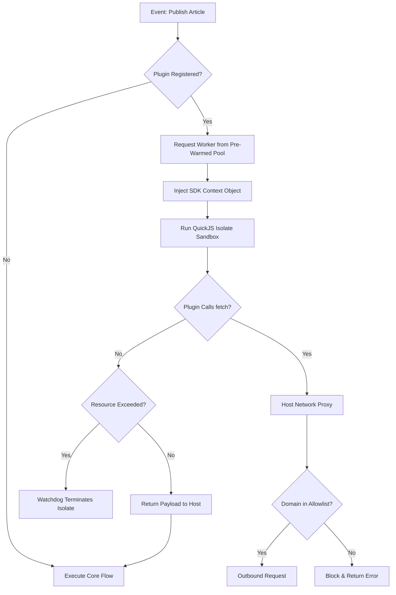

# Plugin SDK

## Purpose
This document specifies the architecture, interfaces, and development workflows of the NewsOps Cloud Plugin SDK. It defines how external developers build, test, and run third-party integrations securely within isolated environments while interacting with the host system via standardized JavaScript APIs.

## Executive Summary
The NewsOps Cloud Plugin SDK enables modular extension of the core digital publishing engine. It provides high-performance, sandboxed execution using secure JavaScript runtimes (V8 isolates or QuickJS), standardized registration APIs, and dynamic database schema extensions. It ensures that tenant plugins cannot compromise host performance, security, or database integrity, facilitating a robust extension ecosystem.

## Vision
To build a highly extensible digital publishing platform where 80% of specific editorial workflows and third-party integrations are built as plugins. The long-term vision is a serverless plugin infrastructure where plugins are executed at the edge, utilizing WebAssembly (Wasm) and distributed data stores to achieve sub-millisecond execution times globally.

## Scope
This document covers:
- JavaScript/TypeScript SDK APIs and lifecycle interfaces.
- Local sandbox configuration and developer CLI toolchains.
- Dynamic custom database schema registration and isolation patterns.
- Package manifest structures, validation utilities, and distribution rules.
- Runtime sandboxing architectures and resource boundaries.

It does not cover the frontend marketplace UI design or the billing engine logic, which are detailed in [marketplace.md](./marketplace.md).

## Goals
- **Secure Sandboxing**: Complete execution isolation of untrusted plugin code with strict memory limits (max 64MB) and CPU quotas (max 50ms execution time per invocation).
- **Type-Safe Integrations**: Complete TypeScript declaration support for all core services, ensuring compile-time safety.
- **Dynamic Database Extensions**: Support dynamic database schema extensions within the tenant's isolated schema namespace, limiting plugins to 5 custom tables.
- **Zero-Trust Networking**: All external network requests by plugins must go through a secure proxy with domain allowlisting configurations.

## Functional Requirements
- **Lifecycle Management**: The SDK must support standardized lifecycle hooks: `onInstall`, `onUninstall`, `onActivate`, `onDeactivate`, and event-specific hooks (e.g., `beforeArticlePublish`).
- **Dynamic Table Provisioning**: Plugins must be able to define dynamic table schemas in their manifest, which the host system automatically applies inside the tenant's database schema.
- **Event Interception**: The SDK must allow plugins to register middleware hooks to intercept, modify, or cancel system operations (e.g., editorial review triggers).
- **Local Dev Sandbox**: The developer toolchain must run a local sandbox emulator that mirrors the production environment, including database mock wrappers.

## Non-Functional Requirements
- **Execution Latency**: The overhead added by the plugin execution sandbox must be $< 10\text{ ms}$ per middleware invocation.
- **Memory Cap**: Each plugin instance is limited to a maximum RSS memory consumption of $64\text{ MB}$.
- **CPU Time Limit**: Plugin hook handlers must complete execution within $50\text{ ms}$ of wall-clock time; exceeding this results in graceful termination.
- **Validation Engine**: The SDK manifest validator must scan and reject plugins containing blacklisted npm packages or unauthorized filesystem/network requests in $< 2\text{ s}$.

## Business Rules
- **Plugin Ownership**: Custom tables created by a plugin must be prefixed with `plugin_[plugin_name]_` and are deleted upon plugin uninstallation, unless a retention policy of 30 days is explicitly configured by the tenant administrator.
- **Network Permissions**: Plugins cannot open arbitrary network connections; external URLs must be declared in the manifest under `permissions.network` and are restricted to HTTPS protocols.
- **Version Compatibility**: Plugins must declare semantic version compatibility ranges matching the host platform (e.g., `^1.4.0`).

## Actors
- **Extension Developer**: Writes, debugs, and packages plugins using the NewsOps Plugin SDK.
- **Tenant Administrator**: Installs, configures, and monitors plugins for their publication.
- **SaaS Platform Security Engine**: Automatically validates manifest, scans code, and enforces sandbox resource constraints at runtime.

## User Stories
- **User Story 1**: As an Extension Developer, I want to define a custom table for tracking "editorial collaboration history" in my plugin manifest so that when a tenant installs my plugin, the required Postgres tables are created automatically within their schema.
- **User Story 2**: As a Tenant Administrator, I want to define a network domain allowlist for a translator plugin so that the plugin can only send articles to `api.deepl.com` and cannot exfiltrate data to other servers.
- **User Story 3**: As an Extension Developer, I want to use a local sandbox CLI emulator so that I can mock hook events (like `beforeArticlePublish`) and debug my plugin's response payloads locally before publishing.

## Acceptance Criteria
- Plugins must not be able to execute Node.js built-in modules (e.g., `fs`, `child_process`, `net`) directly; any attempt to import or call them must trigger a validation compile-time error and runtime reference error.
- Manifest schema validation must enforce the presence of `id`, `version`, `entry`, `permissions`, and `customSchema` fields, throwing detailed errors for missing properties.
- Dynamic table creation must restrict schema migration to tables with the `plugin_[name]_` prefix and reject any tables attempting to alter core platform tables (e.g., `articles`, `users`).
- Sandbox monitoring must terminate any plugin execution that consumes $> 64\text{ MB}$ of memory or $> 50\text{ ms}$ of CPU time, returning a standard `PluginResourceExceededException`.

## Workflows
### Plugin Invocation Lifecycle
1. **Event Trigger**: An editor clicks "Publish" on an article.
2. **Hook Execution**: The host system's workflow engine identifies an active plugin registered to the `beforeArticlePublish` hook.
3. **Sandbox Initialization**: The Host Sandboxed Runner (using dynamic isolate worker pools) provisions a secure QuickJS runtime context.
4. **Environment Injection**: The host injects the SDK Context Object (consisting of the current article payload, tenant-scoped configurations, and restricted API bridges).
5. **Execution**: The plugin script runs inside the isolated context.
6. **Network Proxy**: If the plugin calls `fetch()`, the request is intercepted by the host network supervisor, validated against the plugin's manifest allowlist, and routed.
7. **Response Evaluation**: The plugin returns the modified article payload.
8. **Sandbox Eviction**: The worker context is cleaned up and returned to the pool; the execution time is recorded in metrics.

## API Design
### SDK Interface Definitions (TypeScript)
```typescript
export interface PluginManifest {
  id: string;
  name: string;
  version: string;
  description: string;
  author: string;
  entry: string;
  permissions: {
    network: string[];
    readAccess: string[];
    writeAccess: string[];
  };
  customSchema?: {
    tables: TableSchema[];
  };
}

export interface TableSchema {
  name: string;
  columns: {
    name: string;
    type: 'uuid' | 'varchar' | 'text' | 'integer' | 'boolean' | 'timestamp' | 'jsonb';
    nullable?: boolean;
    isPrimary?: boolean;
    isUnique?: boolean;
  }[];
  indexes?: {
    name: string;
    columns: string[];
    unique?: boolean;
  }[];
}

export interface SDKContext {
  tenantId: string;
  environment: Record<string, string>;
  db: {
    query: <T = any>(sql: string, params?: any[]) => Promise<T[]>;
  };
  http: {
    fetch: (url: string, options?: RequestInit) => Promise<Response>;
  };
  logger: {
    info: (msg: string, ctx?: any) => void;
    warn: (msg: string, ctx?: any) => void;
    error: (msg: string, ctx?: any) => void;
  };
}

export interface NewsOpsPlugin {
  onInstall?: (ctx: SDKContext) => Promise<void>;
  onUninstall?: (ctx: SDKContext) => Promise<void>;
  onActivate?: (ctx: SDKContext) => Promise<void>;
  onDeactivate?: (ctx: SDKContext) => Promise<void>;
}
```

### Sandbox Host RPC Layer (JSON-RPC 2.0)
Communication protocol between core host and sandbox isolate:
```json
{
  "jsonrpc": "2.0",
  "method": "executeHook",
  "params": {
    "hookName": "beforeArticlePublish",
    "pluginId": "com.newsops.translator",
    "context": {
      "tenantId": "tenant_sports_daily",
      "article": {
        "id": "e4b21b8c-5527-4a0b-93ff-183e87d19760",
        "title": "Championship Finals Scheduled",
        "content": "The match will take place on Saturday night."
      }
    }
  },
  "id": "req-98231-abc"
}
```
Response:
```json
{
  "jsonrpc": "2.0",
  "result": {
    "status": "success",
    "modifiedPayload": {
      "article": {
        "id": "e4b21b8c-5527-4a0b-93ff-183e87d19760",
        "title": "Championship Finals Scheduled",
        "content": "The match will take place on Saturday night.",
        "translatedContentFr": "Le match aura lieu samedi soir."
      }
    }
  },
  "id": "req-98231-abc"
}
```

## Database Design
To handle custom dynamic schemas safely, dynamic structures are managed under the tenant's schema, strictly mapped to plugin-prefixed names.

### Admin Database Registry Schema
#### Table: `plugin_registries`
| Field Name | Data Type | Constraints | Description |
|:---|:---|:---|:---|
| `plugin_id` | VARCHAR(128) | PRIMARY KEY | Unique namespace identifier (e.g., `com.newsops.ai-seo`) |
| `name` | VARCHAR(255) | NOT NULL | Human-readable name of the plugin |
| `current_version` | VARCHAR(32) | NOT NULL | Semantic version code |
| `manifest_payload` | JSONB | NOT NULL | Complete validated manifest details |
| `created_at` | TIMESTAMP | DEFAULT NOW() | Timestamp of first registration |

#### Table: `tenant_plugin_installations`
| Field Name | Data Type | Constraints | Description |
|:---|:---|:---|:---|
| `installation_id` | UUID | PRIMARY KEY, DEFAULT gen_random_uuid() | Unique ID of installation |
| `tenant_id` | VARCHAR(64) | NOT NULL, FK to tenants | Linked tenant workspace |
| `plugin_id` | VARCHAR(128) | NOT NULL, FK to plugin_registries | Installed plugin reference |
| `status` | VARCHAR(32) | NOT NULL | `installing`, `active`, `disabled`, `failed` |
| `config_values` | JSONB | DEFAULT '{}'::jsonb | Encrypted config settings for tenant |
| `installed_at` | TIMESTAMP | DEFAULT NOW() | Installation timestamp |
| `updated_at` | TIMESTAMP | DEFAULT NOW() | Last update timestamp |

Indexes:
- `idx_tenant_plugin_unique`: UNIQUE (`tenant_id`, `plugin_id`)
- `idx_tenant_plugin_status`: (`tenant_id`, `status`)

## UI Design
The Developer Local Sandbox Console is a local Web GUI exposed on port `4500` by the CLI tool:
- **Sandbox Console Layout**:
  - **Left Navigation**: Plugin Manifest Viewer, Hook Simulator, Schema Manager, Network Log Monitor.
  - **Hook Simulator View**: Contains a dropdown to choose target event hook, a JSON editor to input raw hook payloads, and a "Run Hook" button.
  - **Real-Time Logs Window**: Renders streaming sandbox execution logs with color-coded severity (green = info, yellow = warn, red = error).
  - **Schema Viewer Panel**: Shows dynamic tables provisioned inside the mock SQLite database, with an interactive table viewer.

## Permissions
- `plugins:register`: Admin-only permission to publish new versions to the marketplace registry.
- `plugins:install`: Tenant-level permission to install plugins within a specific tenant space.
- `plugins:configure`: Edit tenant-specific plugin keys, settings, and network overrides.
- `plugins:read`: Retrieve list of active plugins and configurations.

## Security
- **Sandbox Isolation Level**: Runtimes must run in an isolated environment. The host process uses `node:worker_threads` running a custom C++-bound `V8 Isolate` or `quickjs-emscripten` wrapper. No host filesystem access is permitted.
- **Resource Depletion Defense**: In addition to memory limits, a watchdog thread monitors active worker execution. If a thread remains locked (e.g., `while(true) {}`), the thread is terminated via `.terminate()` after 50ms.
- **Dynamic Database Sanitization**: Injected SQL databases utilize parameterized query interfaces (`db.query('SELECT ...')`). Dynamic table generation is parsed via an AST parser to ensure queries contain only standard DDL keywords (`CREATE TABLE`, `CREATE INDEX`) and prevent arbitrary system procedure execution.

## Performance
- **Sandbox Startup Cache**: Worker threads are pre-warmed in a pool of 20 idle QuickJS isolates to reduce execution startup time to $< 1\text{ ms}$.
- **Network Proxy Caching**: The external proxy caches outbound HTTPS API requests from plugins to configured endpoints using an in-memory Redis cache with TTL matching cache headers.
- **Target Throughput**: The plugin hook worker engine must support $2,000$ executions per second (TPS) on a standard 8-core application server node.

## Monitoring
- **Prometheus Metric**: `plugin_execution_duration_seconds` (Histogram tracking hook execution times grouped by `plugin_id` and `hook_name`).
- **Prometheus Metric**: `plugin_sandbox_violations_total` (Counter tracking timeouts, memory leaks, and network policy breaches).
- **Alert Trigger**: Raise a PagerDuty ticket if `rate(plugin_sandbox_violations_total[5m]) > 20`, indicating widespread plugin compilation or execution failures.

## Logging
Logging occurs through the host wrapper, tagging each log line with metadata to prevent spoofing:
* **Log Format**: `{"timestamp": "%ISO8601%", "tenant_id": "%TENANT%", "plugin_id": "%PLUGIN%", "hook": "%HOOK%", "level": "%LEVEL%", "message": "%MSG%"}`
* **Log Routing**: Logs are exported to ElasticSearch under a distinct index template `logs-newsops-plugins-*` to separate third-party runtime logs from core platform diagnostics.

## Error Handling
| Internal SDK Error | HTTP Status | Customer-Facing Action |
|:---|:---|:---|
| `PluginTimeoutException` | 504 Gateway Timeout | The plugin took too long to respond. The system skipped execution. |
| `PluginMemoryLimitExceededException` | 500 Internal Error | The plugin was terminated due to exceeding resource limits. |
| `DatabaseAccessViolationException` | 403 Forbidden | The plugin tried to access tables outside its namespace scope. |
| `NetworkAccessDeniedException` | 400 Bad Request | The plugin tried to contact an unauthorized host address. |

## Edge Cases
- **Infinite Sync Loops**: If a plugin hook triggers a system event that invokes the same hook again, the recursion depth is tracked in the execution stack. The call is blocked and throws a `PluginRecursionLimitException` if the depth exceeds 3.
- **Postgres DDL Lockups**: Custom schema creation applies dynamic tables. To prevent locking the entire tenant database during installation, DDL statements run with `SET LOCAL lock_timeout = '2s'` and are rolled back if the lock cannot be acquired immediately.

## Future Improvements
- **WebAssembly Extensibility**: Transition the SDK from JavaScript runtimes to WebAssembly engine isolates (using Wasmtime) to support multilingual plugin codebases (Rust, Go, C++) with closer-to-native execution speeds.
- **Decentralized Distribution**: Store plugin packages as signed OCI images in a secure registry, enabling distributed caching across multi-region edge node clusters.

## Mermaid Diagrams
### Plugin Execution Sandbox Routing


## References
- System Topologies & Deployment: [system_architecture.md](../02-architecture/system_architecture.md)
- Multi-Tenancy Architecture: [multi_tenancy_architecture.md](../02-architecture/multi_tenancy_architecture.md)
- Editorial Schema Design: [editorial_and_cms_schema.md](../03-database/editorial_and_cms_schema.md)
