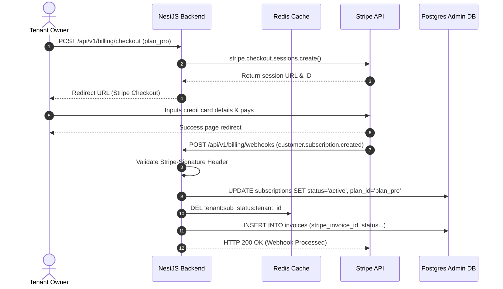

# Subscription Billing

## Purpose
This document specifies the technical design, system configurations, and integration workflows of the subscription pricing and billing engine in the NewsOps Cloud platform. It details how the platform integrates with Stripe to manage payment lifecycles, handle webhooks, update tenant records, and gate features based on active plans.

## Executive Summary
NewsOps Cloud operates on a subscription-based SaaS model. The platform features three distinct subscription plans: Free, Pro, and Enterprise. The system offloads payment processing, billing cycles, and PCI-compliance concerns to Stripe. Local database tables store synchronized subscription metadata and invoice records, allowing rapid authorization checks. Changes to tenant plan states are processed asynchronously using Stripe webhooks.

## Vision
The subscription engine must operate with zero manual payment reconciliation. Every transition of account statuses (signups, upgrades, renewals, card failures, cancellations) must sync immediately and reliably between Stripe and the local database schema, guaranteeing accurate access control.

## Scope
### In-Scope
* Integration with Stripe Checkout and Stripe Customer Billing Portals.
* Real-time local cache synchronization of billing statuses via signature-verified Stripe webhooks.
* Database designs for subscriptions, pricing plan tier configurations, and historical invoices.
* Subscription verification middleware and feature gating rules.

### Out-of-Scope
* direct credit card storage (NewsOps Cloud never saves card raw details).
* Direct invoicing outside of the Stripe platform.

## Goals
* **Webhook Processing Latency**: Process Stripe webhooks and update local subscription caches in $< 200\text{ ms}$.
* **Feature Gating Overhead**: Intercept routing checks to authorize features based on subscription status with $< 1\text{ ms}$ overhead using Redis cache blocks.
* **Webhook Reliability**: Guarantee zero missed events via idempotent processing backed by database transaction logging.

## Functional Requirements
* **Checkout Redirection**: Expose secure routes to generate and redirect users to Stripe Checkout sessions.
* **Webhook Sync**: Listen to Stripe events for creation, modification, and termination of subscription states.
* **Portal Management**: Allow Tenant Owners to securely jump to Stripe's self-service billing management portal.
* **Feature Restrictions Gating**: Enforce strict limits on active content writers, publication counts, and AI credit grants.
* **Invoice Listing**: Render a history of all payments, showing amounts, dates, and direct links to Stripe PDF receipts.

## Non-Functional Requirements
* **PCI Compliance**: Maintain SAQ-A compliance by ensuring zero payment card data touches our backend servers.
* **Stripe Connection Reliability**: Implement automatic retries on Stripe SDK connections with exponential backoff.
* **Concurrency**: Ensure multiple subscription updates for a single tenant are serialized to prevent race condition overrides.

## Business Rules
NewsOps Cloud defines three distinct subscription plans with specific quotas:

| Plan Identifier | Monthly Price | Writer Limit | Publication Limit | Monthly AI Credit Grant |
|:---|:---|:---|:---|:---|
| `plan_free` | $0.00 | Up to 3 | 1,000 articles | 0 credits |
| `plan_pro` | $99.00 / month | Unlimited | 50,000 articles | 5,000 credits |
| `plan_enterprise` | Custom | Unlimited | Unlimited | Custom |

* **Subscription Statuses**: Permitted states are `trialing`, `active`, `past_due`, `unpaid`, `canceled`.
* **Grace Period**: If a payment fails, the system transitions to `past_due` status. The tenant is granted a 7-day grace period to update their payment method before the account is suspended (`unpaid`).

## Actors
* **Tenant Owner**: Manages subscription plans, updates credit cards, and reviews payment history.
* **Stripe Webhook Dispatcher**: Pushes payment and subscription update events to the API endpoint.
* **Gating Interceptor**: NestJS Guard that verifies tenant tiers before handling REST operations.

## User Stories
* **User Story 1**: As a Tenant Owner, I want to upgrade my subscription from Free to Pro using a secure Checkout window so that my news editors can immediately start writing beyond the 1,000-article limit.
* **User Story 2**: As a Tenant Owner, I want to click a "Manage Billing" link to update my payment details on Stripe so that my subscription does not default to suspended during the next billing cycle.
* **User Story 3**: As a Platform Administrator, I want the system to handle Stripe subscription cancellation webhooks so that delinquent accounts are restricted automatically without manual support intervention.

## Acceptance Criteria
* The webhook endpoint must validate the `stripe-signature` header using the configured webhook endpoint secret; unsigned or malformed requests must return HTTP 401.
* A subscription state modification must update both the database and the Redis tenant cache.
* Local invoices must record the Stripe invoice URL for PDF download.
* Webhook updates must be idempotent; receiving the same webhook event ID twice must not trigger secondary updates.

## Workflows
### Upgrade Subscription Flow
1. **User Request**: Tenant Owner clicks "Upgrade to Pro" in the settings panel.
2. **Session Creation**: Backend calls the Stripe SDK to construct a Checkout Session, mapping the dynamic customer metadata.
3. **Redirect**: Backend returns the checkout URL; user is redirected to `checkout.stripe.com`.
4. **Payment**: User inputs credit card data and approves payment.
5. **Webhook Push**: Stripe async dispatches `customer.subscription.created` and `invoice.payment_succeeded` webhooks.
6. **Sync Execution**: The backend parses the events, creates subscription details, grants initial credits, and updates the local status to `active`.
7. **Cache Invalidation**: Redis caches for the tenant are purged, enabling instant application of Pro capabilities.

## API Design
### Create Checkout Session
* **URL**: `/api/v1/billing/checkout`
* **Method**: `POST`
* **Headers**:
  * `Authorization: Bearer <JWT>`
* **Request Payload**:
```json
{
  "planId": "plan_pro",
  "successUrl": "https://vanguard-news.newsops.cloud/admin/billing/success",
  "cancelUrl": "https://vanguard-news.newsops.cloud/admin/billing/cancel"
}
```
* **Response Payload (200 OK)**:
```json
{
  "checkoutSessionId": "cs_test_a1b2c3d4...",
  "url": "https://checkout.stripe.com/pay/cs_test_a1b2c3d4..."
}
```

### Stripe Webhook Ingress
* **URL**: `/api/v1/billing/webhooks`
* **Method**: `POST`
* **Headers**:
  * `Stripe-Signature: t=1672531199,v1=b8e8f828a2a8...`
* **Request Payload**: Raw JSON string from Stripe.
* **Response Payload (200 OK)**:
```json
{
  "received": true,
  "eventId": "evt_1Mjj3uLkd..."
}
```

### Get Invoices History
* **URL**: `/api/v1/billing/invoices`
* **Method**: `GET`
* **Headers**:
  * `Authorization: Bearer <JWT>`
* **Response Payload (200 OK)**:
```json
{
  "invoices": [
    {
      "invoiceId": "inv_123908a",
      "amountCents": 9900,
      "currency": "usd",
      "status": "paid",
      "pdfUrl": "https://pay.stripe.com/invoice/inv_123908a/pdf",
      "billingDate": "2026-06-01T00:00:00Z"
    }
  ]
}
```

## Database Design
To handle subscription states, the administrative database maintains these core tables:

### Table: `subscription_plans`
```sql
CREATE TABLE subscription_plans (
    plan_id VARCHAR(50) PRIMARY KEY,
    name VARCHAR(100) NOT NULL,
    price_cents INT NOT NULL,
    writer_limit INT NOT NULL,
    publication_limit INT NOT NULL,
    monthly_credit_grant INT NOT NULL
);

INSERT INTO subscription_plans (plan_id, name, price_cents, writer_limit, publication_limit, monthly_credit_grant) VALUES
('plan_free', 'Free Basic', 0, 3, 1000, 0),
('plan_pro', 'Pro Professional', 9900, -1, 50000, 5000),
('plan_enterprise', 'Enterprise Custom', 0, -1, -1, -1);
```

### Table: `subscriptions`
```sql
CREATE TABLE subscriptions (
    subscription_id UUID PRIMARY KEY DEFAULT gen_random_uuid(),
    tenant_id UUID NOT NULL UNIQUE,
    stripe_customer_id VARCHAR(100) NOT NULL UNIQUE,
    stripe_subscription_id VARCHAR(100) UNIQUE,
    plan_id VARCHAR(50) REFERENCES subscription_plans(plan_id),
    status VARCHAR(50) NOT NULL, -- 'active', 'trialing', 'past_due', 'unpaid', 'canceled'
    current_period_start TIMESTAMP WITH TIME ZONE,
    current_period_end TIMESTAMP WITH TIME ZONE,
    created_at TIMESTAMP WITH TIME ZONE DEFAULT CURRENT_TIMESTAMP,
    updated_at TIMESTAMP WITH TIME ZONE DEFAULT CURRENT_TIMESTAMP
);

CREATE INDEX idx_subs_tenant ON subscriptions(tenant_id);
```

### Table: `invoices`
```sql
CREATE TABLE invoices (
    invoice_id UUID PRIMARY KEY DEFAULT gen_random_uuid(),
    tenant_id UUID NOT NULL,
    stripe_invoice_id VARCHAR(100) NOT NULL UNIQUE,
    amount_paid_cents INT NOT NULL,
    currency VARCHAR(10) NOT NULL,
    pdf_url TEXT,
    status VARCHAR(50) NOT NULL, -- 'paid', 'open', 'uncollectible', 'void'
    created_at TIMESTAMP WITH TIME ZONE NOT NULL
);

CREATE INDEX idx_invoices_tenant ON invoices(tenant_id);
```

## UI Design
The Billing management UI provides a self-service panel for administrators:
* **Active Plan Banner**: Displays the current plan badge (Free, Pro, Enterprise) along with current writer/publication metrics.
* **Payment Method Actions**: "Manage Payment Methods" button triggers a POST request to construct a Stripe Portal session and redirects the user.
* **Billing Log Table**: Render fields for Billing Date, Amount, status badges, and download icons linked directly to Stripe PDF endpoints.

## Permissions
* `billing:read`: Allows checking subscription levels, limitations, and receipt history.
* `billing:write`: Permits initiating checkout processes and creating management portal requests.
* `billing:admin`: Internal access to override subscription configurations manually.

## Security
* **Stripe Signature Verification**: Webhooks check signatures strictly using the Stripe Node SDK:
```typescript
const event = stripe.webhooks.constructEvent(
  req.rawBody, 
  req.headers['stripe-signature'], 
  process.env.STRIPE_WEBHOOK_SECRET
);
```
* **Raw Body Preservation**: The Express/NestJS server must preserve the raw binary buffer of the request body specifically on the dynamic webhook route, otherwise the signature decryption will fail.
* **SSL Ingress Validation**: The webhook route is limited to IPs matching Stripe's public server networks in production firewalls.

## Performance
* **Active Status Cache**: Subscription status is read on every route intercept. To minimize DB query delays, active parameters are cached in Redis: `tenant:sub_status:<tenant_id>` with a TTL of 1 hour.
* **Background Sync**: Real-time event notifications queue updates in BullMQ so webhooks return HTTP 200 within 50ms, processing data syncing offline.

## Monitoring
* **Prometheus Metric**: `stripe_webhook_delivery_count` (Counter tracking incoming events by type).
* **Prometheus Metric**: `stripe_webhook_processing_failed` (Counter tracking failed DB syncs).
* **Alert Trigger**: Trigger CRITICAL Alarm to Slack if `stripe_webhook_processing_failed > 0` in any 5-minute interval.

## Logging
Every webhook processing step records context for audit transparency:
```json
{"timestamp":"2026-06-27T22:36:20Z","level":"INFO","context":"StripeWebhookHandler","stripe_event_id":"evt_1Mjj3uLkd","stripe_event_type":"customer.subscription.updated","tenant_id":"tnt_29104a-88f1-4ab1","message":"Updated local subscription state to active"}
```

## Error Handling
| Internal Billing Error | HTTP Status | Customer-Facing Message |
|:---|:---|:---|
| `STRIPE_SIGNATURE_INVALID` | 401 Unauthorized | Authentication failed on payment dispatch. |
| `STRIPE_GATEWAY_TIMEOUT` | 504 Gateway Timeout | Payment services are temporarily unreachable. |
| `INSUFFICIENT_PLAN_QUOTAS` | 403 Forbidden | Action denied: Your subscription plan does not allow this operation. |

## Edge Cases
* **Out-of-Order Webhooks**: In rare cases, Stripe might dispatch a `customer.subscription.deleted` webhook before an `updated` event. To counter this, local updates are guarded by verifying that the `current_period_end` from the payload is greater than the existing record before updating.
* **Double Processing Protection**: Every processed webhook event ID (`evt_...`) is locked in Redis for 10 minutes, rejecting duplicates.

## Future Improvements
* **Usage-Based Billing Integration**: Automatically report dynamically tracked bandwidth or storage directly to Stripe metered pricing lines.
* **Multi-Currency Localisation**: Dynamic exchange rates mapping to support local currencies.

## Mermaid Diagrams
### Stripe Checkout and Webhook Provisioning Flow


## References
* High-Level SaaS Index: [index.md](./index.md)
* Multi-Tenancy Architecture: [../02-architecture/multi_tenancy_architecture.md](../02-architecture/multi_tenancy_architecture.md)
* Database Structure Configurations: [../03-database/index.md](../03-database/index.md)
