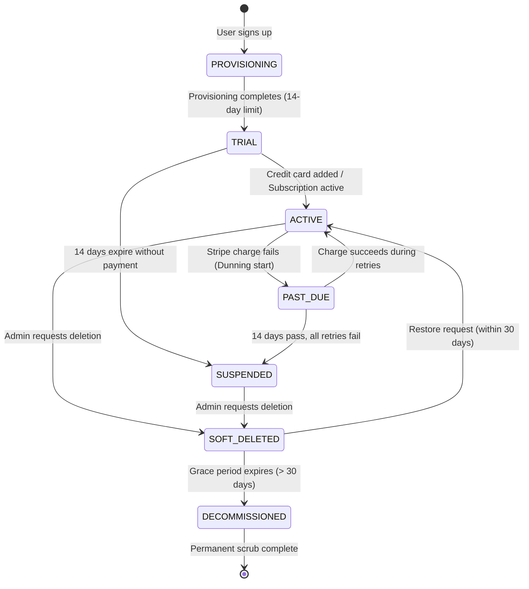

# Tenant Lifecycle
## Purpose
This document specifies the operational lifecycle phases, subscription state machines, trial procedures, graceful cancellations, data retention policies, and soft-delete schedules for organizations within the NewsOps Cloud digital publishing platform.

## Executive Summary
Managing a tenant's lifecycle involves guiding them through phases from registration and initial provisioning, to trials, active billing, payment failures (dunning), cancellation, and eventual data decommissioning. This document establishes the state transitions, PostgreSQL and Stripe synchronization webhooks, administrative APIs, and the background decommissioning workers that enforce GDPR-compliant data erasure schedules.

## Vision
To create an automated, reliable, and compliant tenant lifecycle framework. This framework aims to onboard users quickly during trials, recover payments during failures, and handle account cancellation and data erasure securely.

## Scope
The scope of this design document includes:
- **Tenant Lifecycle State Machine**: Defining system behaviors across states (PROVISIONING, TRIAL, ACTIVE, PAST_DUE, SUSPENDED, SOFT_DELETED, DECOMMISSIONED).
- **Trial Onboarding**: Sandbox provisioning configurations and expiration notifications.
- **Billing State Syncs**: Stripe-to-PostgreSQL subscription state transition hooks.
- **Cancellation Routines**: Standard operations for active subscription termination.
- **Data Retention & Soft-Delete Schedules**: Policies and cleanup tasks that run on S3 and databases.

## Goals
1. Provision a new tenant database schema and initial configuration profiles in less than 5 seconds.
2. Automate subscription status updates following payment events with a sync latency of less than 3 seconds.
3. Keep user access active throughout a 14-day dunning period before applying account suspensions.
4. Execute permanent data sanitization within exactly 30 days of account deletion, meeting GDPR Article 17 specifications.

## Functional Requirements
- **Automated Sandbox Provisioning**:
  - Signing up must initiate background worker tasks to create the database schemas and workspace files.
  - The system must assign new tenants a `TRIAL` status valid for 14 days, without requiring a credit card.
- **Subscription State Engine**:
  - The application must capture Stripe webhook events and update database tables in response to billing changes.
  - If a payment fails, the system must enter a dunning loop and update the tenant's state to `PAST_DUE`.
- **Soft-Delete Grace Period**:
  - Deleting an account must trigger a `SOFT_DELETED` state, hiding the tenant from normal operations but preserving data for 30 days.
  - Organization administrators must be able to restore their account and data within the 30-day window.
- **Hard-Delete Decommissioner**:
  - A background process must run daily to identify organizations in `SOFT_DELETED` status for more than 30 days.
  - The service must permanently delete all database records and S3 assets associated with decommissioned tenants.

## Non-Functional Requirements
- **Security**: The decommissioning worker must run using isolated credentials limited to the specific tenant S3 folders and database tables.
- **Audit Trails**: All changes to a tenant's state and all data erasure runs must write immutable audit records to the database.
- **Performance**: Restoring an account from a soft-deleted state must complete in under 10 seconds.
- **Scalability**: The decommissioning task must handle S3 deletes in batches of 1,000 objects to avoid request throttling.

## Business Rules
1. **Trial Period**: Sandbox trials last exactly 14 calendar days. On day 15, accounts without a valid subscription are changed to `SUSPENDED`.
2. **Dunning Logic**: Stripe retries failed card transactions 3 times over 14 days. During this period, the tenant remains `PAST_DUE` with access active, before being updated to `SUSPENDED`.
3. **Grace Retention Period**: Soft-deleted data is stored for exactly 30 days. On day 31, a permanent scrub is scheduled.
4. **Data Restoration**: Restoring an account from a soft-delete status requires paying any outstanding invoice balances.

## Actors
- **SaaS Core Provisioner**: System worker that creates database tables and workspaces.
- **Billing Event Syncer**: Webhook worker that updates statuses based on Stripe payloads.
- **Decommissioning Daemon**: Daily cron process that deletes data for expired tenants.
- **Tenant Administrator**: Organization Owner managing subscriptions and cancellations.

## User Stories
### Story 1: Free Trial Signup
As a **new Publisher**, I want to sign up for a 14-day trial without entering a credit card, so that I can explore the platform's features and test the writing tools before committing financially.

### Story 2: Subscription Upgrades
As a **Trial Administrator**, I want to upgrade to a Pro tier subscription on the last day of our trial, so that our mapped domains and stored media files transfer to the active tier without service disruption.

### Story 3: Account Deletion and Recovery Grace Period
As an **Organization Owner**, I want to close our account and delete our workspace data, while retaining the ability to restore our settings and files within a 30-day window if our business needs change.

## Acceptance Criteria
1. **Trial Suspension Gate**: On day 15 of a trial without an active subscription, the system must change the organization status to `SUSPENDED` and return HTTP `402 Payment Required` on all write and search requests.
2. **Billing State Propagation**: PostgreSQL database statuses must update to `PAST_DUE` within 3 seconds of receiving a Stripe `invoice.payment_failed` webhook.
3. **Data Purge Integrity**: The Decommissioning Daemon must remove all database rows and S3 objects for tenants in `SOFT_DELETED` status for more than 30 days, leaving only the compliance logs.
4. **Restoration Verification**: Triggering a tenant restore request within the 30-day grace period must change the status to `ACTIVE`, restore API access, and make all files available within 10 seconds.

## Workflows
### 1. Tenant Lifecycle State Machine
```
   [SignUp] 
      |
      v
[PROVISIONING] ---> (Success) ---> [TRIAL] 
      |                             |
      | (Payment Failure/Expiry)     | (Upgrades to paid plan)
      v                             v
[SUSPENDED]                      [ACTIVE] <--- (Charge Fails) --+
      |                             |                           |
      | (Owner deletes account)     | (Stripe Dunning Period)   |
      v                             v                           |
[SOFT_DELETED] (30-day grace)    [PAST_DUE] --------------------+
      |                             |
      | (Grace period ends)         | (Dunning fails completely)
      v                             v
[DECOMMISSIONED] (Permanently)   [SUSPENDED]
```

### 2. Graceful Cancellation & Decommissioning
```
[Admin Console]
   |-- 1. Clicks "Cancel Subscription"
   v
[Stripe Billing Engine]
   |-- 2. Sets subscription to cancel at the end of the billing period
   |-- 3. Informs user: "Service active until [Billing Date]"
   v
[Billing Cycle End reached]
   |-- 4. Stripe fires subscription.deleted webhook
   |-- 5. System changes tenant database status to CANCELED
   |-- 6. User deletes organization -> status transitions to SOFT_DELETED
   v
[Decommissioning Daemon (Day 31)]
   |-- 7. Audit identifies tenant as SOFT_DELETED for > 30 days
   |-- 8. Daemon calls S3 delete batch on tenant objects
   |-- 9. Daemon executes Postgres CASCADE delete on organization rows
   |-- 10. Daemon records audit run and updates status to DECOMMISSIONED
```

## API Design

### 1. Provision Tenant Sandbox
Creates the initial organization structure and prepares workspace settings.
- **Endpoint**: `POST /api/v1/internal/tenants/provision`
- **Headers**:
  - `X-NewsOps-HMAC-Signature`: Verification token.
  - `Content-Type`: application/json
- **Request Payload**:
  ```json
  {
    "organization_name": "Metro News Group",
    "subdomain_namespace": "metronews",
    "admin_email": "admin@metronews.com",
    "initial_plan": "TRIAL"
  }
  ```
- **Response Payload (`201 Created`)**:
  ```json
  {
    "organization_id": "org_5519283-p",
    "status": "TRIAL",
    "trial_ends_at": "2026-07-11T22:35:57Z",
    "provisioned_at": "2026-06-27T22:35:57Z"
  }
  ```

### 2. Cancel Active Subscription
Configures the active subscription to terminate at the end of the current billing cycle.
- **Endpoint**: `POST /api/v1/organizations/{org_id}/subscriptions/cancel`
- **Headers**:
  - `Authorization: Bearer <JWT>`
- **Request Payload**:
  ```json
  {
    "cancellation_reason": "Migrating to custom in-house tools",
    "feedback_notes": "The AI writing tools were useful, but overall costs were too high for our team scale."
  }
  ```
- **Response Payload (`200 OK`)**:
  ```json
  {
    "organization_id": "org_4410294-a",
    "subscription_status": "ACTIVE",
    "cancel_at_period_end": true,
    "current_period_end": "2026-06-30T23:59:59Z"
  }
  ```

### 3. Initiate Organization Soft-Delete
Transitions the tenant account to a soft-deleted state, starting the 30-day recovery countdown.
- **Endpoint**: `DELETE /api/v1/organizations/{org_id}`
- **Headers**:
  - `Authorization: Bearer <Owner-JWT>`
- **Response Payload (`202 Accepted`)**:
  ```json
  {
    "organization_id": "org_4410294-a",
    "status": "SOFT_DELETED",
    "deleted_at": "2026-06-27T22:35:57Z",
    "grace_period_ends_at": "2026-07-27T22:35:57Z",
    "message": "Account suspended and queued for deletion. You can restore this workspace within the next 30 days."
  }
  ```

### 4. Restore Soft-Deleted Organization
Restores a soft-deleted workspace to active status within the grace period.
- **Endpoint**: `POST /api/v1/organizations/{org_id}/restore`
- **Headers**:
  - `Authorization: Bearer <Owner-JWT>`
- **Response Payload (`200 OK`)**:
  ```json
  {
    "organization_id": "org_4410294-a",
    "status": "ACTIVE",
    "restored_at": "2026-06-27T22:36:10Z"
  }
  ```

## Database Design
```sql
-- Track lifecycle state histories for auditing
CREATE TABLE tenant_lifecycle_history (
    id UUID PRIMARY KEY DEFAULT gen_random_uuid(),
    organization_id UUID NOT NULL, -- References tenant_organizations
    previous_state VARCHAR(50),
    new_state VARCHAR(50) NOT NULL CHECK (new_state IN ('PROVISIONING', 'TRIAL', 'ACTIVE', 'PAST_DUE', 'SUSPENDED', 'SOFT_DELETED', 'DECOMMISSIONED')),
    trigger_event VARCHAR(100) NOT NULL, -- STRIPE_WEBHOOK_PAYMENT_FAIL, MANUAL_DELETE, TRIAL_EXPIRY
    notes TEXT,
    changed_by UUID, -- System or Admin user ID
    created_at TIMESTAMP WITH TIME ZONE DEFAULT CURRENT_TIMESTAMP
);

CREATE INDEX idx_lifecycle_history_org ON tenant_lifecycle_history(organization_id, created_at DESC);

-- Track data retention dates and schedules
CREATE TABLE tenant_retention_schedules (
    id UUID PRIMARY KEY DEFAULT gen_random_uuid(),
    organization_id UUID UNIQUE NOT NULL,
    soft_deleted_at TIMESTAMP WITH TIME ZONE NOT NULL,
    purge_scheduled_at TIMESTAMP WITH TIME ZONE NOT NULL, -- soft_deleted_at + 30 days
    is_restored BOOLEAN NOT NULL DEFAULT FALSE,
    restored_at TIMESTAMP WITH TIME ZONE,
    created_at TIMESTAMP WITH TIME ZONE DEFAULT CURRENT_TIMESTAMP,
    updated_at TIMESTAMP WITH TIME ZONE DEFAULT CURRENT_TIMESTAMP
);

CREATE INDEX idx_retention_schedules_purge ON tenant_retention_schedules(purge_scheduled_at) WHERE is_restored = FALSE;

-- Immutable audit logs for legal compliance (GDPR Right to Erasure proof)
CREATE TABLE data_retention_audit_logs (
    id UUID PRIMARY KEY DEFAULT gen_random_uuid(),
    organization_id UUID NOT NULL,
    subdomain_namespace VARCHAR(100) NOT NULL,
    event_type VARCHAR(100) NOT NULL DEFAULT 'PERMANENT_SCRUB',
    objects_deleted_count INT NOT NULL,
    database_rows_deleted_count INT NOT NULL,
    completed_at TIMESTAMP WITH TIME ZONE DEFAULT CURRENT_TIMESTAMP,
    signature_checksum VARCHAR(64) NOT NULL -- SHA-256 validation code proving log integrity
);
```

## UI Design
The console displays lifecycle settings inside the billing dashboard:
1. **Trial Countdown Widget**:
   - Visible to trial accounts, showing a banner: "Trial Account: 8 Days Remaining."
   - Includes a primary "Subscribe Now" button linked directly to the checkout page.
2. **Past Due Notification Header**:
   - A yellow banner displayed to all organization users when the account enters the `PAST_DUE` state, warning: "Action Required: Payment failed. Update card settings to avoid disruption."
3. **Danger Zone Settings Section**:
   - Contains a "Delete Organization Workspace" button.
   - Triggers a security modal requiring the user to type the tenant subdomain to confirm deletion.

## Permissions
- `tenant:provision`: Run background tasks to create workspaces.
- `tenant:subscribe`: Access subscription pages and make payment changes.
- `tenant:delete`: Trigger soft-delete deletions.
- `tenant:restore`: Reopen and restore soft-deleted workspaces.

## Security
- **Stripe Webhook Signature Audits**: The billing engine validates Stripe headers using standard webhook signing secrets to prevent spoofed payments or cancellations.
- **Isolated Decommissioning Rules**: Decommissioning tasks run under a database role with permissions limited to dropping partition tables, preventing accidental drops of global schema records.
- **Row-Level Security Isolation**: RLS policies restrict users from accessing soft-deleted records unless their user role is authorized to perform restoration flows.

## Performance
- **Asynchronous Workspace Creation**: Workspace setup tasks are managed using background queues (Celery/RabbitMQ) to return API responses to users within 200ms.
- **Batch Object Deletions**: The S3 decommissioning tool executes deletes in batches of 1,000 files, with a 2-second sleep between requests to avoid S3 throttling errors.
- **Database Partition Drops**: Organizations use database partitioning by tenant ID, allowing the decommissioning daemon to clean up tables by dropping partitions rather than running heavy `DELETE` loops.

## Monitoring
### Prometheus Metrics
- `newsops_tenant_lifecycle_state_count`: Gauge tracking total active tenants, grouped by lifecycle states (`trial`, `active`, `past_due`, `suspended`, `soft_deleted`).
- `newsops_tenant_provisioning_duration_seconds`: Histogram tracking system provisioning speeds.
- `newsops_decommission_jobs_success_total`: Counter tracking successful permanent data scrubs.
- `newsops_decommission_jobs_failures_total`: Counter tracking errors during data scrub processes.

### Alerting Rules
- **DecommissionFailure**: Alert if `newsops_decommission_jobs_failures_total` increases by > 0.
- **ProvisioningLatencySpike**: Alert if provisioning speeds exceed 15 seconds for 3 consecutive requests.

## Logging
- **Log Format**: Structured JSON payload.
- **Log Levels**:
  - `INFO`: Provisioning completed, state changed, dunning email sent, decommissioning started, scrub complete.
  - `WARN`: Trial ending warnings, payment failed attempts, deletion grace countdown milestones.
  - `ERROR`: Partition drop errors, S3 access failures during scrubbing, Stripe signature verification failures.
- **Log Context**: Includes `organization_id`, `subdomain_namespace`, `previous_state`, `new_state`, `stripe_event_id`, and `audit_log_checksum`.

## Error Handling
| Input/System Error Code | HTTP Status | Customer-Facing Message |
| :--- | :--- | :--- |
| `TENANT_SUSPENDED` | 402 Payment Required | "Your account is suspended. Please update your payment method to restore access." |
| `TENANT_ALREADY_PROVISIONED` | 409 Conflict | "This organization namespace is already registered." |
| `RESTORE_WINDOW_EXPIRED` | 410 Gone | "The grace period for restoring this account has expired and data was permanently deleted." |
| `DECOMMISSION_RUN_LOCKED` | 423 Locked | "A data cleaning task is already running. Please try again later." |

## Edge Cases
- **Active Scraper Running During Deletion**: A crawler job executes write requests while the owner initiates account deletion. Mitigation: The DELETE API changes the Redis state to `SOFT_DELETED` first, which causes the API Gateway to block active crawl requests before database operations begin.
- **Stripe Out-of-Order Webhooks**: An `invoice.payment_succeeded` webhook arrives after a `subscription.deleted` webhook. Mitigation: The system tracks Stripe event sequence numbers, ignoring events with sequence numbers older than the last state update.
- **S3 Delete Network Failure**: The decommissioning daemon fails to delete half of a tenant's S3 files due to network errors. Mitigation: The task uses an S3 bucket lifecycle rule configured to purge files in deleted folders after 30 days as a fallback mechanism:
  ```json
  {
    "Rules": [
      {
        "ID": "PurgeSoftDeletedTenantData",
        "Status": "Enabled",
        "Filter": { "Prefix": "soft-deleted/" },
        "Expiration": { "Days": 30 }
      }
    ]
  }
  ```

## Future Improvements
1. **Cold-Storage Archive Options**: Offer enterprise organizations the choice to export and archive data to cheaper Glacier storage instead of executing permanent scrubs.
2. **Automated Tenant Migration Tools**: Provide tools that export entire workspace states into standalone JSON/ZIP files before deletion.
3. **Automated Compliance Verification**: Integrate tools that automatically check for orphan records across data structures after decommissioning.

## Mermaid Diagrams


## References
- Multi-Tenancy Architecture Specs: [../02-architecture/multi_tenancy_architecture.md](../02-architecture/multi_tenancy_architecture.md)
- Database Partition Isolation: [../03-database/tenant_isolation_database.md](../03-database/tenant_isolation_database.md)
- Billing Schema Definitions: [../03-database/billing_and_subscriptions_schema.md](../03-database/billing_and_subscriptions_schema.md)
- SaaS Metering Services: [../08-saas/usage_metering.md](../08-saas/usage_metering.md)
