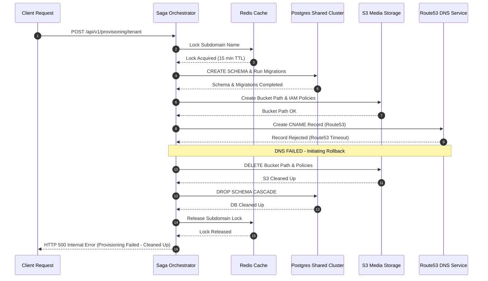

# Tenant Provisioning

## Purpose
This document specifies the technical design, system configurations, and operational workflows of the automated Tenant Onboarding and Provisioning Pipeline in the NewsOps Cloud platform. It guides engineers on how tenant schemas, DNS entries, and cloud resource directories are dynamically initialized and verified.

## Executive Summary
To enable self-service scaling, NewsOps Cloud utilizes an asynchronous, transactional Saga orchestration pattern to provision tenants. When a new customer completes registration, the provisioning worker spawns a dedicated database schema in the shared PostgreSQL cluster, configures subdomain routing via dynamic DNS, maps S3 bucket folders, and executes automated verification checks before activating the tenant.

## Vision
Our vision is to provide "instant-on" tenant provisioning. From registration to live content management, the entire backend infrastructure allocation must be fully automated, taking less than 15 seconds, and requiring zero human operations manual intervention.

## Scope
### In-Scope
* Dynamic database schema creation and auto-execution of TypeORM migrations.
* Automated DNS record creation (A / CNAME) via dynamic integration with Route53 and local BIND9 DNS APIs.
* Dynamic creation of isolated resource directories inside S3 bucket directories.
* End-to-end routing and connectivity validation checks.
* Transactional rollbacks (Saga pattern) for partial provisioning failures.

### Out-of-Scope
* Provisioning of physical database instances (handled in cluster provisioning).
* Configuration of office networks or manual hardware routing.

## Goals
* **Provisioning Speed**: Complete all schema, DNS, and folder provisioning steps within 15 seconds.
* **Isolation Quality**: Ensure database schema and S3 folder access are logically partitioned and secure.
* **Idempotency**: All provisioning steps must support repeated retries with identical transaction IDs without side effects.
* **Auto-Rollback**: Clean up $100\%$ of allocated resources in the event of an unrecoverable provisioning step failure.

## Functional Requirements
* **Subdomain Validation**: Reject subdomains that contain reserved keywords (e.g., `admin`, `api`, `system`, `newsops`, `www`).
* **Schema Initialization**: Create a schema named `tenant_<sanitized_subdomain_uuid>` and execute database table structures.
* **Dynamic DNS Mapping**: Inject a CNAME record pointing `tenant.newsops.cloud` to the primary API gateway ingress endpoint.
* **S3 Workspace Isolation**: Create a target folder path `s3://newsops-assets/tenants/<tenant_uuid>/` with isolated IAM permission blocks.
* **Verification Runner**: Query the newly created tenant endpoint dynamically to confirm it handles mock requests properly.

## Non-Functional Requirements
* **Throughput**: Support up to 50 concurrent tenant provisioning requests without system degradation.
* **S3 Latency**: Folder configuration and IAM policy attachment must complete within $<2\text{ seconds}$.
* **PostgreSQL Schema Creation Overhead**: Database table definitions and index provisioning must complete in $<6\text{ seconds}$.

## Business Rules
* **Alphanumeric Hostnames Only**: Hostnames must match the regular expression `^[a-z0-9]([a-z0-9-]{0,61}[a-z0-9])?$`.
* **Database Target Routing**: Standard and Pro tiers are allocated to the shared PostgreSQL server. Enterprise tiers can provide a custom database server connection string override.
* **Graceful Subdomain Locking**: During provisioning, the chosen subdomain is locked in the Redis catalog for 15 minutes to prevent double-registration collisions.

## Actors
* **Customer Admin**: The client registering their publishing organization.
* **Saga Orchestrator Service**: The internal backend engine coordinating resource allocation.
* **Cloud Infrastructure Agents**: The APIs for AWS Route53, PostgreSQL, and AWS S3/MinIO.

## User Stories
* **User Story 1**: As a Customer Admin, I want to sign up for a NewsOps publication space so that I get a private subdomain, an isolated media library, and a database partition ready within seconds.
* **User Story 2**: As a Platform Administrator, I want to track provisioning steps in real time so that I can diagnose why a specific tenant configuration pipeline failed.
* **User Story 3**: As a SaaS Security Auditor, I want the provisioning system to automatically isolate tenant data schemas so that tenant data is never exposed to other customers.

## Acceptance Criteria
* The database schema must be initialized with exactly 42 core platform tables.
* The DNS record must be dynamically registered and return positive status within 30 seconds.
* The S3 validation module must successfully write and read a test text file to the tenant's isolated directory path.
* If DNS registry fails, the DB schema and S3 folders must be completely removed, and the saga job marked `FAILED`.

## Workflows
The dynamic provisioning process implements a Saga pattern to ensure atomicity across distributed cloud resources:

```
[Customer Sign-Up]
        │
        ▼
[Saga: Lock Subdomain in Redis]
        │
        ├──► (On Failure) ──► Unlock Subdomain & Return Error
        ▼
[Saga: Create PG Schema & Run Migrations]
        │
        ├──► (On Failure) ──► Rollback PG Schema, Unlock Subdomain & Return Error
        ▼
[Saga: Provision S3 Folders & IAM Policies]
        │
        ├──► (On Failure) ──► Delete S3 Paths, Rollback PG Schema, Unlock Subdomain & Return Error
        ▼
[Saga: Register Route53 DNS CNAME]
        │
        ├──► (On Failure) ──► Delete CNAME, Delete S3 Paths, Rollback PG Schema & Return Error
        ▼
[Saga: Run Integration Verification Verification Checks]
        │
        ├──► (On Failure) ──► Trigger full rollback of all resources
        ▼
[Activate Tenant & Send Welcome Email]
```

## API Design
### Provision Tenant Endpoint
* **URL**: `/api/v1/provisioning/tenant`
* **Method**: `POST`
* **Headers**:
  * `Content-Type: application/json`
  * `Authorization: Bearer <ADMIN_OR_SIGNUP_JWT>`
* **Request Payload**:
```json
{
  "organizationName": "Vanguard News",
  "subdomain": "vanguard-news",
  "adminUser": {
    "email": "editor@vanguardnews.com",
    "name": "Jane Doe"
  },
  "tier": "Pro",
  "region": "us-east-1"
}
```
* **Response Payload (202 Accepted)**:
```json
{
  "jobId": "prov_job_88a9c8b7-df88-4672-8822-491c984f8812",
  "status": "processing",
  "subdomain": "vanguard-news.newsops.cloud",
  "estimatedDurationSeconds": 15
}
```

### Get Provisioning Job Status
* **URL**: `/api/v1/provisioning/jobs/prov_job_88a9c8b7-df88-4672-8822-491c984f8812`
* **Method**: `GET`
* **Response Payload (200 OK)**:
```json
{
  "jobId": "prov_job_88a9c8b7-df88-4672-8822-491c984f8812",
  "status": "completed",
  "step": "VERIFICATION_SUCCESSFUL",
  "tenant": {
    "tenantId": "tnt_29104a-88f1-4ab1",
    "subdomain": "vanguard-news.newsops.cloud",
    "databaseSchema": "tenant_vanguard_news_29104a",
    "storageBucketPath": "s3://newsops-assets/tenants/tnt_29104a-88f1-4ab1/"
  },
  "error": null,
  "completedAt": "2026-06-27T22:36:12Z"
}
```

## Database Design
To manage states and track distributed saga components, we utilize the following schema inside our central administrative database:

### Table: `tenant_provisioning_jobs`
```sql
CREATE TABLE tenant_provisioning_jobs (
    job_id UUID PRIMARY KEY DEFAULT gen_random_uuid(),
    tenant_name VARCHAR(255) NOT NULL,
    subdomain VARCHAR(63) NOT NULL UNIQUE,
    tier VARCHAR(50) NOT NULL,
    status VARCHAR(50) NOT NULL, -- 'PENDING', 'PROCESSING', 'COMPLETED', 'FAILED'
    current_step VARCHAR(100) NOT NULL, -- 'LOCKING', 'DATABASE_CREATION', 'MIGRATIONS_RUNNING', 'S3_PROVISIONING', 'DNS_REGISTRY', 'VERIFYING', 'DONE'
    database_schema VARCHAR(100),
    error_message TEXT,
    retry_count INT DEFAULT 0,
    created_at TIMESTAMP WITH TIME ZONE DEFAULT CURRENT_TIMESTAMP,
    updated_at TIMESTAMP WITH TIME ZONE DEFAULT CURRENT_TIMESTAMP
);

CREATE INDEX idx_prov_jobs_status ON tenant_provisioning_jobs(status);
CREATE INDEX idx_prov_jobs_subdomain ON tenant_provisioning_jobs(subdomain);
```

## UI Design
The dynamic provisioning dashboard within the NewsOps admin panel provides a real-time tracking interface:
* **Progress Stepper Component**: Visual representation of the active Saga steps (Subdomain Lock ➔ Schema Creation ➔ Migrations ➔ Storage ➔ DNS ➔ Verification ➔ Active).
* **Step Status Labels**: Success checkmarks, loading spinners, or red failure crosses with collapsible stack traces.
* **Retry and Rollback Controls**: Actionable buttons for administrators to manually trigger a retry of a failed step or initiate a full rollback.

## Permissions
* `tenants:provision`: Required to initiate new tenant creations.
* `tenants:jobs:read`: Required to inspect the state of active provisioning pipelines.
* `tenants:jobs:write`: Required to trigger retries or rollbacks on failed provisioning pipelines.

## Security
* **SQL Injection Prevention**: When creating schemas and dynamically calling `CREATE SCHEMA tenant_...`, input parameters are strictly validated against `^[a-z0-9_]+$` and executed through raw DB engines via safe parameterized drivers to prevent SQL Injection exploits.
* **IAM Privilege Isolation**: Using AWS IAM Security Token Service (STS), each tenant's microservices are granted access keys limited to `s3:GetObject` and `s3:PutObject` restricted exclusively to prefix `/tenants/<tenant_uuid>/`.
* **SSL Certificate Automation**: Upon DNS mapping confirmation, a Let's Encrypt ACME HTTP challenge is automatically queued in NGINX Ingress Controller to issue a valid SSL certificate.

## Performance
* **Connection Pooling**: Postgres migrations execute using dedicated admin credentials. The runtime application resolves tenant data by switching the active connection context schema with less than 2ms overhead.
* **Background Queue**: All provisioning steps are processed out-of-band by workers using NestJS custom dynamic queue services managed by Redis BullMQ.
* **TTL on Subdomain Lock**: Reserved subdomains lock keys in Redis expire in exactly 15 minutes if the provisioning pipeline fails to complete or roll back.

## Monitoring
* **Prometheus Metric**: `tenant_provisioning_duration_seconds` (Histogram monitoring total onboarding time).
* **Prometheus Metric**: `tenant_provisioning_step_failures_total` (Counter tracking failures per step: `database`, `s3`, `dns`, `verification`).
* **Alert Trigger**: Trigger CRITICAL Alert to Slack if `tenant_provisioning_step_failures_total` increases by more than 5 in a 10-minute window.

## Logging
The Saga orchestrator logs every single state transition in a structured key-value format:
```json
{"timestamp":"2026-06-27T22:36:10Z","level":"INFO","context":"TenantProvisioningSaga","job_id":"prov_job_88a9c8b7-df88-4672-8822-491c984f8812","step":"DNS_REGISTRY","message":"Registering DNS CNAME record for subdomain vanguard-news.newsops.cloud"}
```

## Error Handling
| Internal Provisioning Error | HTTP Status | Customer-Facing Message |
|:---|:---|:---|
| `SUBDOMAIN_RESERVED` | 400 Bad Request | The requested subdomain is reserved and cannot be registered. |
| `SUBDOMAIN_EXISTS` | 409 Conflict | The subdomain is already registered. Please choose another one. |
| `DATABASE_PROVISION_TIMEOUT` | 504 Gateway Timeout | Schema initialization timed out. The system is auto-rolling back resources. |
| `S3_PERMISSIONS_FAILURE` | 500 Internal Error | Failed to partition media directories. Please contact support. |

## Edge Cases
* **DNS Propagation Delays**: The verification runner doesn't query public DNS root servers immediately; it maps the local loopback adapter routing host file overrides during the verification phase to avoid DNS cache-propagation latency (which can take minutes).
* **PostgreSQL Lock Conflicts**: If multiple dynamic schemas are initialized simultaneously, migration transactions are isolated via individual lock sessions to prevent pg_catalog system table deadlocks.

## Future Improvements
* **WebAssembly Edge Router Bindings**: Dynamic mapping of Cloudflare worker routing lists to redirect custom hostnames without hitting the primary API Gateway router.
* **Dynamic Database Provisioning Sharding**: Automatically routing new schemas to database server hosts based on physical storage capacity metrics.

## Mermaid Diagrams
### Provisioning Saga Execution and Rollback Sequence


## References
* High-Level SaaS Index: [index.md](./index.md)
* Multi-Tenancy Resolution Design: [multi_tenancy_architecture.md](../02-architecture/multi_tenancy_architecture.md)
* Dynamic Data Migrations: [storage_architecture.md](../02-architecture/storage_architecture.md)
