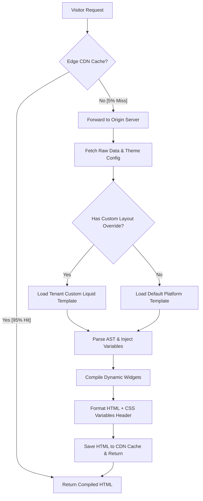

# Dynamic Theme Engine

## Purpose
This document specifies the design, compilation pipelines, and runtime execution of the NewsOps Cloud Dynamic Theme Engine. It describes how tenants customize site designs, inject widgets, override core layouts, and compile dynamic CSS configurations without compromising site load performance or system security.

## Executive Summary
The NewsOps Cloud Theme Engine enables multi-tenant digital publishing with high visual diversity. To avoid expensive rebuild cycles, the platform uses a CSS Custom Properties (CSS Variables) routing architecture mapping to Tailwind utility classes, allowing instant design updates. The engine executes layout overrides and dynamic widget injections through a secure, sandboxed rendering environment (utilizing Liquid templates) combined with edge-based content caching via Cloudflare KV.

## Vision
To enable instant, real-time editorial layout modifications globally. The engine will scale toward edge-native serverless rendering where CSS compiles directly inside Cloudflare Workers, pulling theme payloads and rendering pages at the nearest CDN node in $< 50\text{ ms}$ worldwide.

## Scope
This document covers:
- CSS Custom Variables compilation and integration with Tailwind/Vanilla CSS configurations.
- Template rendering configurations (Liquid templates) and sandbox limits.
- Layout overrides, page template management, and dynamic widget injections.
- Server-side rendering (SSR) and edge-based CDN caching strategies.

It does not cover white-label domain routing (detailed in [white_labeling.md](./white_labeling.md)) or editor workflow APIs (detailed in core CMS schemas).

## Goals
- **Instant CSS Application**: Apply style updates immediately by injecting dynamic CSS variables into the HTML container, avoiding full Webpack/Vite rebuild cycles.
- **Secure Template Rendering**: Restrict template engines to a zero-risk sandbox, blocking access to system environment variables or file systems.
- **Fast First Contentful Paint (FCP)**: Keep rendering overhead below $30\text{ ms}$ at the origin server, and maintain $< 100\text{ ms}$ FCP globally via CDN caching.
- **Declarative Widget Injection**: Provide a non-technical layout builder where editors can position dynamic widgets without editing code.

## Functional Requirements
- **Dynamic Tailwind Mapping**: The engine must output a CSS stylesheet binding a tenant's custom color palette, typography, and spacing selections to standard CSS Variables.
- **Liquid Sandboxing**: All user-submitted layouts and templates must execute using a restricted parser that only grants access to a pre-defined schema context (e.g., `article`, `author`, `site`).
- **Layout Overrides**: Tenants must be able to override specific default layouts (e.g., `article.liquid`, `homepage.liquid`) on a per-domain basis.
- **Widget Injections**: The theme engine must support dynamic widget components (e.g., "Trending Posts", "Newsletter Sign Up") that execute queries and render content dynamically within designated layout placeholders.

## Non-Functional Requirements
- **Template Compile Time**: Parsing and compiling a Liquid template payload must take $< 5\text{ ms}$.
- **Edge Cache Hit Ratio**: The edge caching layers (Cloudflare KV + CDN) must maintain a hit ratio of $\ge 95\%$ for public-facing publication pages.
- **CSS Bundle Size**: Injected tenant-specific custom styling files must not exceed $50\text{ KB}$ gzipped.

## Business Rules
- **No Native Scripting**: Custom HTML templates cannot contain inline server-side scripting elements (such as Node.js or PHP code block executions).
- **Default Theme Fallback**: If a tenant-provided layout fails compile checks or throws execution errors, the engine must catch the exception and fall back to the default system theme layout instantly.
- **Widget Rate Limits**: Injected widgets that perform database calls (e.g., search bars) must inherit strict tenant-level API rate limits to prevent site crashing under DDOS attacks.

## Actors
- **Site Designer/Developer**: Uploads custom Liquid templates, CSS properties, and layout overrides.
- **Editorial Editor**: Places and configures dynamic widgets inside pages via the layout administrator panel.
- **Edge Renderer Engine**: The runtime service that intercepts requests, fetches content and theme layouts, and outputs completed HTML pages.

## User Stories
- **User Story 1**: As a Site Designer, I want to change our primary brand color in the admin dashboard so that all buttons across the entire website change instantly without triggering a rebuild of our Tailwind assets.
- **User Story 2**: As an Editorial Editor, I want to inject a "Breaking News Banner" widget above the main article header so that readers are immediately alerted to live stories.
- **User Story 3**: As a Site Developer, I want to override the default article layout template with a custom structure containing unique author cards and ad placements to maximize monetization.

## Acceptance Criteria
- Dynamic color changes must write style rules into a CSS file injected in the HTML `<head>` containing elements like `--primary-color: #HEX_VAL;`.
- Execution of liquid templates containing invalid directives (e.g., `` or attempt to access global `process`) must fail validation and return a compile error.
- Page rendering must degrade gracefully: if a custom `article.liquid` template errors, the engine must immediately log the event and serve the default system template rather than a 500 error page.

## Workflows
### Request Page Rendering Pipeline
1. **Request Landing**: A user requests `https://sports.daily-news.com/article/championship-results`.
2. **CDN Inspection**: Cloudflare Edge checks if the compiled HTML is cached.
   - **Cache Hit**: Served instantly to the reader (End of workflow).
   - **Cache Miss**: Request forwarded to the NewsOps rendering origin.
3. **Data Resolving**: The system fetches article data and tenant theme configurations concurrently from Redis.
4. **Layout Mapping**: The engine checks if the tenant has a layout override for `article.liquid`. If yes, it loads the custom Liquid template; otherwise, it loads the default.
5. **Widget Compilation**: The engine identifies widget placeholders (e.g., ``) within the template, executes their queries, and compiles the widget markup.
6. **CSS Injection**: The engine injects the tenant's CSS variables block (`:root { --primary-color: ... }`) into the HTML output.
7. **HTML Output**: The compiled page is sent back to the CDN (which saves it to cache) and served to the user.

## API Design
### Theme and Layout Overrides API

#### 1. Update Theme Variables
* **URL**: `/api/v1/themes/config`
* **Method**: `PUT`
* **Headers**:
  * `Authorization: Bearer <TENANT_JWT>`
* **Request Payload**:
```json
{
  "themeName": "Sports Premium",
  "variables": {
    "primaryColor": "#D32F2F",
    "secondaryColor": "#1976D2",
    "fontFamilySans": "Inter, sans-serif",
    "borderRadius": "8px"
  },
  "customCss": "body { -webkit-font-smoothing: antialiased; }"
}
```
* **Response Payload (200 OK)**:
```json
{
  "status": "success",
  "cssUrl": "https://cdn.newsops.cloud/tenants/tenant_123/theme_latest.css",
  "updatedAt": "2026-06-27T22:32:00Z"
}
```

#### 2. Create Layout Override
* **URL**: `/api/v1/themes/layouts`
* **Method**: `POST`
* **Headers**:
  * `Authorization: Bearer <TENANT_JWT>`
* **Request Payload**:
```json
{
  "layoutName": "article.liquid",
  "content": "<html><head><link rel='stylesheet' href='{{ theme.cssUrl }}'></head><body><h1>{{ article.title }}</h1><div class='content'>{{ article.body }}</div></body></html>"
}
```
* **Response Payload (201 Created)**:
```json
{
  "layoutId": "l8b2c9d0-1234-abcd-ef01-23456789abcd",
  "layoutName": "article.liquid",
  "version": 1,
  "status": "active"
}
```

## Database Design
These tables are created within each tenant's isolated database schema to support specific template configurations:

### Table: `theme_configurations`
| Field Name | Data Type | Constraints | Description |
|:---|:---|:---|:---|
| `theme_id` | UUID | PRIMARY KEY, DEFAULT gen_random_uuid() | Unique theme identifier |
| `name` | VARCHAR(128) | NOT NULL | Theme title |
| `variables` | JSONB | NOT NULL | Brand colors, fonts, margins |
| `custom_css` | TEXT | NULL | Additional CSS style overwrites |
| `is_active` | BOOLEAN | DEFAULT FALSE | Status indicator |
| `updated_at` | TIMESTAMP | DEFAULT NOW() | Last update timestamp |

### Table: `theme_layouts`
| Field Name | Data Type | Constraints | Description |
|:---|:---|:---|:---|
| `layout_id` | UUID | PRIMARY KEY, DEFAULT gen_random_uuid() | Unique layout record |
| `layout_name` | VARCHAR(128) | NOT NULL | Target template name (e.g., `article.liquid`) |
| `content` | TEXT | NOT NULL | Custom Liquid raw code |
| `version` | INTEGER | DEFAULT 1 | Version tracking for rollbacks |
| `status` | VARCHAR(32) | DEFAULT 'active' | `active`, `draft`, `historical` |
| `updated_at` | TIMESTAMP | DEFAULT NOW() | Last update timestamp |

### Table: `theme_widgets`
| Field Name | Data Type | Constraints | Description |
|:---|:---|:---|:---|
| `widget_id` | UUID | PRIMARY KEY, DEFAULT gen_random_uuid() | Unique widget instance |
| `type` | VARCHAR(64) | NOT NULL | Widget type identifier (e.g., `newsletter`) |
| `title` | VARCHAR(255) | NOT NULL | Admin label |
| `settings` | JSONB | DEFAULT '{}'::jsonb | Widget configuration values |
| `created_at` | TIMESTAMP | DEFAULT NOW() | Timestamp of creation |

Indexes:
- `idx_layout_name_status`: UNIQUE (`layout_name`, `status`)
- `idx_widget_type`: (`type`)

## UI Design
The Theme Customizer in the NewsOps Admin Console includes:
- **Style Customization Panel**: A sidebar featuring interactive color pickers, font selectors, and size sliders that update a live preview frame instantly.
- **Template Code Editor**: Integrated Monaco editor providing syntax highlighting, autocomplete for Liquid variables (`{{ article.title }}`), and real-time compile error validations.
- **Widget Placement Map**: Drag-and-drop structural representation of layout zones (Header, Sidebar, Content, Footer) where users can easily insert, order, and adjust dynamic widgets.

## Permissions
- `themes:configure`: Access branding customization models.
- `themes:layouts:write`: Authorize creating and updating custom Liquid layout templates.
- `themes:widgets:write`: Modify layout positions and parameters of widgets.
- `themes:read`: Read design layouts and parameters for rendering.

## Security
- **Liquid Context Restricting**: The engine configures the Liquid parser to block dynamic inclusions (`include` commands must only match files in the tenant's registry database and cannot resolve paths containing relative dots like `../`).
- **HTML Sanitization**: All variable outputs containing user-submitted data must be escaped by default (e.g., `{{ article.body | escape }}` or handled via secure HTML purifiers at output time).
- **CSS Variable Validation**: All custom CSS colors must match strict regex patterns (`^#[0-9a-fA-F]{3,8}$` or rgb/rgba shapes) to block injections inside stylesheet tags.

## Performance
- **CSS Pre-compilation**: The theme layout outputs static files cached at the edge. The system registers a webhook to invalidate CDN caches only when the theme variables are updated.
- **Rendering Caching**: Parsed AST structures of Liquid templates are held in server memory cache (using LRU maps) to avoid reparsing the raw template text on every request.
- **Target Rendering Speed**: The engine target execution speed must be $< 15\text{ ms}$ for standard pages containing up to 3 widget structures.

## Monitoring
- **Prometheus Metric**: `theme_rendering_duration_seconds` (Histogram monitoring page rendering speed by layout name).
- **Prometheus Metric**: `theme_template_errors_total` (Counter tracking template compilation and rendering exceptions).
- **Alert Trigger**: Trigger automated notifications if `rate(theme_template_errors_total[10m]) > 5` for any single tenant domain.

## Logging
Every execution failure is captured with context:
* **Log Pattern**: `{"timestamp": "%ISO8601%", "tenant_id": "%TENANT%", "layout": "%LAYOUT%", "error": "%ERROR_MSG%", "message": "Failed to compile theme template"}`
* **Error Level**: `ERROR` for individual parsing issues; system switches to base theme.

## Error Handling
| Internal Theme Error | HTTP Status | Customer-Facing Action |
|:---|:---|:---|
| `TemplateSyntaxException` | 400 Bad Request | Liquid compilation error. Please check your syntax tag matching. |
| `CSSValidationException` | 422 Unprocessable | Invalid color/font values detected. Config rejected. |
| `LayoutNotFoundException` | 404 Not Found | Requested template layout is missing. Render falling back. |

## Edge Cases
- **Missing Widget References**: If a template references a widget that was deleted, the engine renders an empty string in that location and logs a warning instead of aborting the page compilation.
- **Circular Layout Inclusions**: If layouts include other layouts recursively, the maximum execution depth analyzer blocks compiler execution at depth 3, returning `TemplateRecursionException`.

## Future Improvements
- **Component-Based Styling**: Transition to React-server components executing at the edge via WASM to enable dynamic, high-performance interactive templates.
- **Automated Visual Testing**: Introduce visual regression testing (using Puppeteer instances in CI) that checks page designs when changing layouts to prevent broken components.

## Mermaid Diagrams
### Theme Rendering Pipeline


## References
- Multi-Tenancy Architecture: [multi_tenancy_architecture.md](../02-architecture/multi_tenancy_architecture.md)
- Plugin SDK Design: [plugin_sdk.md](./plugin_sdk.md)
- Custom Domain Routing: [white_labeling.md](./white_labeling.md)
